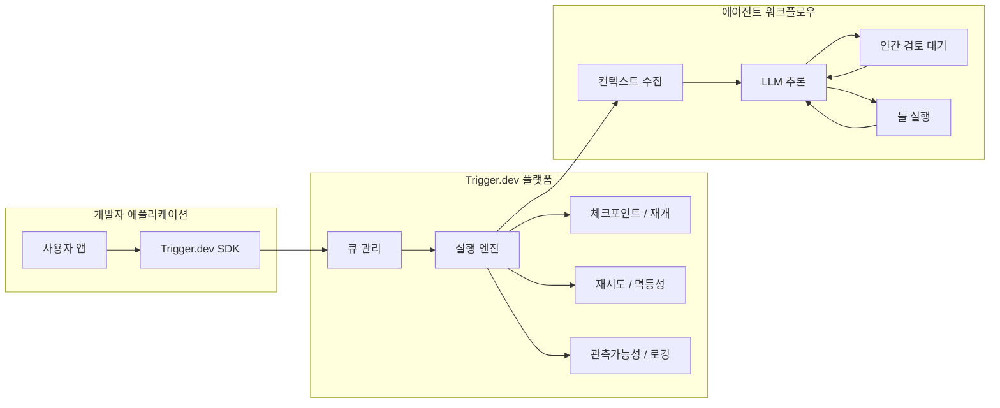
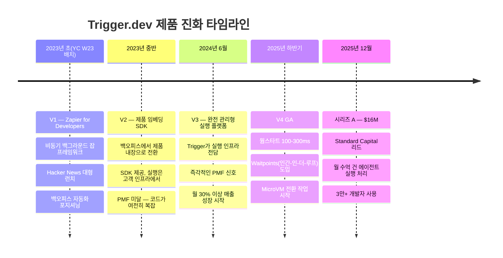
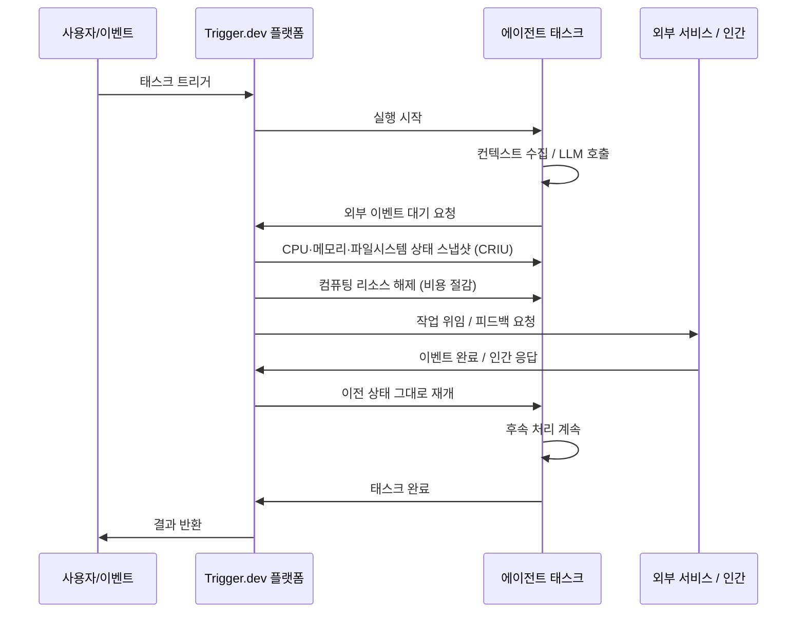
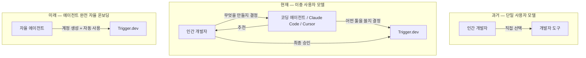
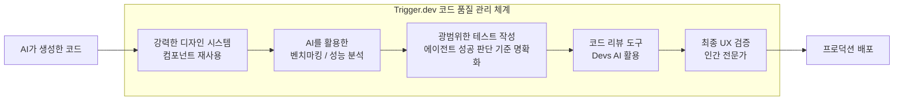
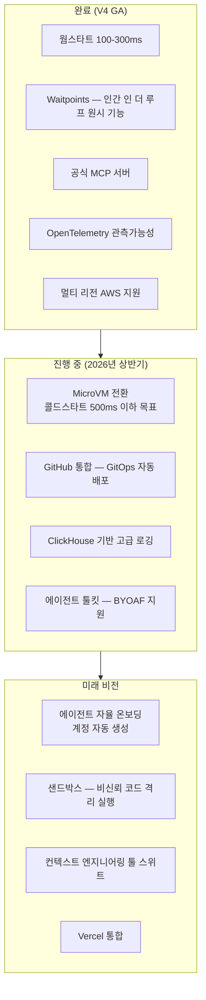

## YC Root Access — Founder Fireside 인터뷰 심층 분석

> **원본**: [From Zapier for Devs to Powering 90% AI Agents](https://www.youtube.com/watch?v=_y7siiS-V5A)  
> **채널**: YC Root Access  
> **공개일**: 2025년 5월 9일  
> **출연**: Matt Aitken, Eric Allam (Trigger.dev 공동창업자), Pete Koomen (YC)

---

## 1. 개요: 이 인터뷰가 중요한 이유

이 영상은 Y Combinator의 "Founder Firesides" 시리즈 중 하나로, Trigger.dev의 공동창업자 Matt Aitken과 Eric Allam이 YC의 Pete Koomen과 나눈 약 35분짜리 심층 대화를 담고 있다. 단순한 제품 홍보 인터뷰가 아니라, 창업 초기부터 세 번의 제품 피벗, 프로덕트-마켓 핏 달성, AI 에이전트 시대로의 전환, 그리고 채용·조직 철학에 이르기까지 스타트업의 궤적 전체를 솔직하게 다루고 있다.

Trigger.dev는 2025년 12월, Standard Capital이 주도한 **1,600만 달러 규모의 시리즈 A**를 발표하며 주목을 받았다. Standard Capital은 YC 역사상 가장 오래 파트너로 재직한 Dalton Caldwell, Paul Buchheit(Gmail 창시자), Bryan Berg가 설립한 신생 시리즈 A 펀드다. YC, Liquid 2, Wayfinder Ventures, Pioneer Fund, Rebel Fund 등 기존 투자자들도 이번 라운드에 재참여했다.

현재(2026년 5월 기준) Trigger.dev는 **3만 명 이상의 개발자**가 사용하며, 매달 **수억 건의 에이전트 실행**을 처리하는 플랫폼으로 성장했다. 전체 사용량의 **90% 이상이 AI 에이전트 워크플로우**에서 발생한다는 점이 이 플랫폼의 현재 정체성을 단적으로 보여준다.

---

## 2. 제품의 정의: Trigger.dev란 무엇인가

가장 간단하게 설명하면, Trigger.dev는 개발자가 자신의 기존 제품에 AI 에이전트를 추가할 수 있도록 해주는 플랫폼이다. SDK를 통해 에이전트를 정의하면, Trigger.dev가 그 에이전트의 실행·안정성·오케스트레이션을 전담한다.

인터뷰에서 Eric은 제품의 핵심 가치를 다음과 같이 명확히 표현한다.

> "우리 SDK를 사용해서 에이전트를 만들고, 기존 제품에 추가하기만 하면 됩니다. 나머지 실행과 안정적인 운영은 저희가 처리합니다."

기술적으로 이 플랫폼이 해결하는 핵심 문제는 **장기 실행(long-running) 비동기 태스크**다. 서버리스 아키텍처가 지배적인 환경에서 단기 요청-응답(request-response) 모델은 매우 효과적이지만, 수 분에서 수 시간이 걸리는 AI 에이전트 루프에는 근본적으로 부적합하다. Trigger.dev는 바로 이 공백을 채운다.

---

## 3. 제품 진화의 역사: 세 번의 버전, 2년의 여정

Trigger.dev의 성공 스토리는 단번에 완성된 것이 아니다. 세 번의 서로 다른 제품 버전을 거치며 2년이 넘는 시간 동안 진짜 문제를 찾아가는 과정이었다.

### 3-1. V1: "Zapier for Developers" (2023년 초)

YC W23 배치에 합류하기 직전에 이미 피벗을 한 번 겪었고, 배치 합류 직후인 2023년 2월 1일에 첫 번째 공개 버전을 출시했다. 콘셉트는 명확했다. "Zapier for Developers" — 개발자를 위한 자동화 도구였다.

Hacker News 런치는 상당한 반향을 일으켰고, 이는 특히 제품의 **디자인 감각** 덕분이었다는 것이 Pete의 평가다. 공동창업자 4명 중 Dan과 James가 UX·디자인에 강점을 보유하고 있었고, 랜딩 페이지의 코드 스니펫 하나에도 상당한 공을 들였다. 처음 5초 안에 개발자가 "이 도구를 써야겠다"는 판단을 내릴 수 있도록, 코드를 가장 먼저 보여주는 "코드 퍼스트" 접근법을 채택했다.

그러나 V1의 주요 사용 사례는 **백오피스 자동화**였다. GitHub 자동화, 마케팅 파이프라인 같은 내부 팀 도구가 주된 수요였다. 이것이 문제의 씨앗이었다.

### 3-2. V1의 한계: 백오피스 vs. 제품 내장

YC 배치 직후 깨달은 것은, 진짜 좋은 사용 사례가 "백오피스"가 아니라 제품 자체에 녹아드는 경우라는 점이었다. 즉, 내부 팀이 쓰는 것이 아니라 **최종 사용자를 위한 제품 경험의 일부**로 작동할 때 더 강력한 가치가 생겼다.

- **백오피스 사용 사례**: 내부 팀의 업무 자동화 (영업, 마케팅, GitHub 관리 등)
- **제품 내장 사용 사례**: 사용자가 트리거한 이후 백그라운드에서 문서 처리, 비디오 인코딩, AI 파이프라인 실행 등

후자가 훨씬 강력한 가치를 제공했고, V2는 이 방향으로 전환했다.

### 3-3. V2: SDK 중심의 제품 내장 (2023년 중반)

V2는 비동기 태스크를 제품에 내장하는 것에 집중했다. 하지만 결정적인 문제가 있었다. **코드를 실행하는 주체가 여전히 고객의 인프라**였다는 점이다. 고객들이 직접 서버를 관리해야 했고, SDK 자체도 복잡했다.

흥미로운 사실이 하나 있다. Matt가 V2 당시 고객 설문을 진행한 결과, 응답자의 약 60%가 "Trigger.dev가 코드를 실행해준다"고 이미 믿고 있었다는 것이다. 즉, 고객들은 이미 완전 관리형 실행을 원하고 있었고, 어떤 의미에서는 그것을 당연히 기대하고 있었다. 이것이 V3로의 전환을 결정하는 핵심 인사이트가 됐다.

V2는 제품-마켓 핏에 이르지 못했다. 수요 자체는 분명히 있었지만, 제품이 그 수요를 충족하기에 충분하지 않았다.

### 3-4. V3: 완전 관리형 실행 플랫폼 (2024년 6월)

V3는 Trigger.dev 역사에서 가장 결정적인 전환점이었다. 핵심 변화는 단 하나다. **실행 인프라 자체를 Trigger.dev가 직접 책임진다**는 것이었다.

SDK뿐 아니라, 플랫폼 전체와 인프라가 하나의 통합된 제품으로 제공됐다. 개발자는 코드만 작성하면 됐다. 큐 관리, 재시도, 멱등성(idempotency), 장기 실행, 상태 관리 등 모든 복잡한 인프라 문제를 Trigger가 대신 처리했다.

V3 출시 직후 반응은 즉각적이었다. **최소 수개월 동안 월 30% 이상의 매출 성장**이 지속됐다. 프로덕트-마켓 핏의 전형적인 신호였다.

---

## 4. AI 에이전트와의 "행운의 조우"

V3가 출시된 2024년 6월은 AI 에이전트 붐이 본격적으로 가속화되던 시점이기도 했다. Eric은 이를 솔직하게 "운이 좋았다"고 표현한다. 2년 동안 비동기 장기 실행 인프라를 쌓아왔는데, 그것이 AI 에이전트 루프의 핵심 요구사항과 정확히 맞아떨어진 것이다.

AI 에이전트가 비동기 장기 실행 인프라를 필요로 하는 이유는 구조적이다.

1. **LLM 추론 자체가 느리다**: 복잡한 태스크에서 단일 추론은 수 초에서 수십 초가 걸릴 수 있다.
2. **다단계 루프**: 에이전트는 하나의 태스크를 완료하기 위해 수십~수백 번의 스텝을 반복한다.
3. **외부 툴 호출 대기**: 웹 검색, 코드 실행, 파일 처리 등 외부 시스템과의 상호작용이 필수다.
4. **인간-인-더-루프(Human-in-the-Loop)**: 에이전트가 사람의 승인이나 피드백을 기다려야 하는 지점이 발생한다.

모두 서버리스의 타임아웃 제한으로는 처리할 수 없는 시나리오들이다. Trigger.dev의 인프라는 이 모든 상황을 네이티브로 지원하도록 설계되어 있었다.

2026년 기준, Trigger.dev 전체 사용량의 **90% 이상이 AI 에이전트 워크플로우**에서 발생하고 있다.

---

## 5. 실제 고객 사례: 에이전트가 제품 속에서 작동하는 방식

### 5-1. Icon.com — AI 기반 광고 영상 제작

Icon.com은 광고 대행사를 대체하는 서비스다. 사용자가 제품 에셋을 업로드하고 원하는 광고의 방향성을 설명하면, 수백 개의 광고 영상이 자동으로 생성돼 TikTok, Instagram 등에 게시된다.

Trigger.dev의 역할은 에셋 처리부터 분류, AI 배우 생성, 최종 영상 생성에 이르는 **전체 파이프라인**을 장기 실행 워크플로우로 처리하는 것이다. 사용자는 실시간으로 각 에셋이 처리되는 상황을 확인할 수 있고, AI가 필요한 경우 피드백을 요청하며 일시 정지한다.

Matt와 Eric은 이 사례를 통해 성공적인 에이전트 구축의 두 가지 핵심 요소를 설명한다.

- **컨텍스트 단계**: 필요한 모든 데이터(에셋, 메타데이터, 사용자 선호도 등)를 수집하는 과정
- **생성 단계**: 수집된 컨텍스트를 바탕으로 실제 결과물(광고 영상, AI 배우 등)을 생성하는 과정

### 5-2. MagicSchool — 교사와 학생을 위한 AI 에이전트

MagicSchool은 성공적인 에듀테크 기업으로, 교사가 수업을 더 효율적으로 진행할 수 있도록 AI 도구를 제공한다. 수업 계획, 질문 생성, 숙제 채점 등이 모두 AI 에이전트를 통해 처리되며, 학생 측면에서는 학습 진도 추적도 지원한다. 이 에이전트들의 실행 전체를 Trigger.dev가 담당한다.

### 5-3. Scrappy Bar (코딩 에이전트) — 전체 개발 루프 자동화

사용자가 GitHub를 연결하고 원하는 기능을 설명하면, 코드베이스를 다운로드하고, 수정하고, 테스트를 실행하고, 커밋까지 자동으로 올려주는 코딩 에이전트를 구축했다. LLM 호출, 코드 실행, Git 작업 등 전체 파이프라인이 Trigger.dev 위에서 돌아간다.

---

## 6. 기술 핵심: 체크포인트-재개(Checkpoint-Resume) 시스템

이 인터뷰에서 가장 기술적으로 흥미로운 대목은 **체크포인트-재개 메커니즘**에 대한 설명이다. Eric은 이것을 "컴퓨팅의 미래"라고 표현한다.

전통적인 접근법에서는 외부 이벤트를 기다리는 동안 상태를 직접 재수화(rehydrate)해야 했다. 데이터베이스에서 상태를 다시 불러오고, 컨텍스트를 재구성하는 등 복잡한 작업이 필요했다.

Trigger.dev의 체크포인트 시스템은 **CRIU(Checkpoint/Restore In Userspace)** 기술을 활용해 태스크의 CPU 레지스터, 메모리, 열린 파일 디스크립터까지 포함한 전체 실행 상태를 스냅샷으로 저장한다. 이후 이벤트가 발생하면 완전히 동일한 상태로 재개한다. 마치 컴퓨터를 절전 모드로 두었다가 깨우는 것과 같다.

실용적 이점은 두 가지다.

첫째, **비용 효율성**이다. 대기 중에는 컴퓨팅 리소스가 해제되므로, 실제 실행 시간에 대해서만 비용을 지불한다.

둘째, **개발자 경험**의 단순화다. 개발자는 복잡한 상태 관리 로직을 작성할 필요 없이, 마치 동기적 코드처럼 `await`을 사용하면 된다. 플랫폼이 나머지를 처리한다.

V4 기준으로 웜 스타트는 100~300ms 수준이며, MicroVM 전환 완료 후에는 콜드 스타트도 500ms 미만을 목표로 하고 있다.

---

## 7. 오픈소스 전략과 "에이전트를 사용자로" 보는 관점

Trigger.dev는 Apache 2.0 라이선스의 오픈소스 프로젝트다. 비즈니스 모델은 클라우드 실행 인프라를 관리해주는 것이고, 오픈소스 프로젝트 자체에는 핵심 기능 대부분이 포함되어 있다. 클로즈드 소스 부분은 수천 대의 서버를 안정적으로 관리하는 Kubernetes 레이어다.

인터뷰에서 Matt와 Eric이 제시하는 흥미로운 통찰은 **에이전트(LLM)도 사용자다**라는 프레임이다.

오픈소스가 이 전략에서 갖는 이점은 명확하다. 코드베이스, 문서, 테스트가 모두 인터넷에 공개되어 있기 때문에, LLM 모델의 학습 데이터 및 RAG 컨텍스트에 포함될 가능성이 훨씬 높다. Claude Code나 Cursor 같은 코딩 에이전트가 특정 기능을 구현할 때 Trigger.dev를 추천하는 빈도가 높아지는 것이다.

Trigger.dev는 이 방향성을 구체화하기 위해 공식 MCP 서버, Claude Code/Cursor/Windsurf 전용 에이전트 룰 및 스킬을 이미 제공하고 있다. 미래 비전은 더 나아간다. 에이전트가 스스로 Trigger.dev 계정을 개설하고 자율적으로 사용하기 시작하는 "에이전트 온보딩" 경험이다.

---

## 8. AI 시대의 채용 철학 변화

인터뷰에서 가장 시사점이 큰 부분 중 하나는 채용에 관한 솔직한 대화다.

Trigger.dev는 2025년 11월 시리즈 A 발표 당시 상당한 규모의 엔지니어 채용을 계획하고 있었다. 그러나 2026년 초(인터뷰 시점은 2026년 2월 초) 기준으로 그 계획은 **상당히 축소**됐다. 이유는 Claude Opus 4.5와 Claude Code의 발전으로 인한 **엔지니어 1인당 생산성 향상**이다. Matt는 5~10배 수준으로 표현했다.

채용은 계속하되, 이제 평가 기준이 달라졌다. "처음부터 코드를 작성할 수 있는가"가 아니라, **"AI 도구를 얼마나 잘 활용하는가"** 가 핵심 역량이 됐다.

채용 과정에 이것이 구체적으로 반영되어 있다. 인터뷰 후반 단계에서 **실제 하루 동안 유급으로 일하는 트라이얼 데이**를 진행한다. 이 날 AI 도구를 잘 활용하지 못하는 지원자는 채용되지 않는다. Matt는 이를 LeetCode 방식의 인터뷰와 정반대 극단에 있는 방식으로 설명한다. LeetCode는 AI 없이, 미리 암기한 패턴으로 잘 다듬어진 문제를 푸는 것이지만, Trigger.dev의 트라이얼 데이는 실제 업무 환경에서의 실질적 역량을 본다.

엔지니어링 외에 최근 Dev Relations 인력을 채용했으며, "콘텐츠 엔지니어"라는 새로운 직군을 채용 중이다. 이 포지션은 에이전트 구축 방법에 관한 고품질 기술 콘텐츠를 생산하는 역할로, Trigger.dev에 특화된 내용이 아닌 일반적인 에이전트 개발 모범 사례를 다룬다. 커뮤니티와 생태계 전체에 가치를 제공하면서 자연스럽게 브랜드 인지도를 높이는 전략이다.

---

## 9. AI 코딩 에이전트로 고품질 코드 유지하기

"AI가 생성하는 코드는 품질이 낮고 유지보수가 어렵다"는 비판에 대해, Matt와 Eric은 자신들의 접근법을 상세히 설명한다.

핵심 인사이트는 에이전트를 단순히 "코드를 작성하는 도구"가 아니라 "스태프 엔지니어 수준의 판단을 보조하는 협력자"로 활용한다는 점이다.

예를 들어, 새로운 라이브러리를 도입할지 판단할 때, 기존에는 개발자가 직접 일주일에 걸쳐 벤치마크를 작성하거나 그냥 넘어갔을 수 있다. 이제는 AI를 통해 몇 분 만에 CPU 사용량, 효율성 비교 벤치마크를 작성하고, 데이터에 기반한 결정을 내릴 수 있다. 이처럼 **"해야 하지만 하기 어려웠던 것"을 AI가 가능하게 만든다**는 것이 핵심이다.

테스트 측면에서도 변화가 뚜렷하다. 1년 전에는 테스트 커버리지가 충분하지 않았지만, 지금은 백엔드 기능 구현 시 에이전트가 성공 여부를 스스로 판단할 수 있도록 광범위한 테스트를 함께 작성한다.

또한 오픈소스의 또 다른 실용적 이점이 여기서 드러난다. 고급 사용자들이 직접 레포지토리를 클론해서 Claude Code에게 질문하고, 버그를 발견하면 그 분석 결과까지 포함한 상세한 리포트를 Slack으로 보내온다. 이후 Trigger.dev 팀은 Claude가 그 내용을 기반으로 PR을 자동 생성하도록 할 수 있다. 지원의 질이 전반적으로 높아지고, 지원 비용은 상대적으로 낮아지는 선순환이다.

---

## 10. "바이브 코더 vs. 전통 개발자"의 경계 붕괴

6개월~1년 전까지만 해도 Trigger.dev의 지원 채널에는 두 개의 뚜렷한 사용자 유형이 존재했다.

- **바이브 코더**: 소프트웨어를 한 번도 작성해본 적 없는 사람들. AI 코딩 도구로 처음 개발을 시작한 그룹으로, 기초적인 지원이 많이 필요했다.
- **전통 개발자**: 고급 아키텍처 질문을 던지는 숙련된 엔지니어들.

인터뷰 시점(2026년 초)에는 이 구분이 거의 사라졌다. 이유는 두 가지다.

첫째, Claude Opus 4.5 등 모델 자체의 성능이 크게 향상돼 바이브 코더들이 Trigger.dev를 훨씬 잘 활용할 수 있게 됐다. 둘째, Trigger.dev 스스로 MCP 서버 구축, 에이전트·스킬 친화적 문서 정비 등을 통해 **LLM 친화적 플랫폼**으로 지속적으로 개선했다.

결과적으로 지원 건수는 매출·사용자 증가 속도에 비해 훨씬 느리게 증가하고 있다. 성장 속도와 지원 부담 사이의 격차가 벌어지고 있다는 것은 제품의 성숙도와 LLM 생태계의 발전이 동시에 기여하는 결과다.

---

## 11. 창업자의 조언: 새로운 창업자들에게

인터뷰 말미에 Matt와 Eric은 YC 스프링 배치에 합류하는 새로운 창업자들에게 두 가지 핵심 메시지를 전달한다.

**첫 번째: 최대한 빨리 출시하라**

출시 전에 사람들과 대화하는 것도 중요하지만, 실제로 출시하고 사람들이 사용하기 시작할 때 비로소 알 수 없었던 것들이 드러난다. 다운타임이 발생했을 때 아무도 연락하지 않는다면, 그 자체가 "당신이 중요한 것을 만들고 있지 않다"는 신호다. 이런 종류의 피드백은 출시 없이는 절대 얻을 수 없다.

**두 번째: 언제 계속할지 판단하는 직관을 키워라**

Trigger.dev는 2년이 지나서야 프로덕트-마켓 핏을 달성했다. 그 기간 동안 포기하지 않을 수 있었던 것은 "이 문제는 진짜 문제다"라는 믿음, 그리고 창업자들 스스로가 그 문제를 직접 겪었다는 사실 때문이었다. 문제의 진정성에 대한 확신이 있다면, 제품이 아직 그 문제를 완벽히 해결하지 못하고 있더라도 계속할 이유가 있다.

**세 번째: 고객과 매일 대화하라**

이것은 YC의 고전적인 조언이지만, 실제로 실천하는 사람이 드물다. 매일 고객 피드백을 받다 보면, 진공 속에서 혼자 생각해서는 절대 알 수 없는 것들을 발견하게 된다.

---

## 12. 현재 Trigger.dev의 기술 로드맵 (2026년 기준)

인터뷰 내용과 공개된 로드맵을 종합하면, Trigger.dev는 현재 다음 방향으로 발전하고 있다.

CRIU 기반의 체크포인트-재개가 현재 기술의 핵심이라면, MicroVM은 그것의 다음 단계다. Firecracker 같은 MicroVM은 하드웨어 수준의 격리를 제공하면서도 500ms 미만의 콜드 스타트를 가능하게 한다. 이는 특히 비신뢰 코드(AI 에이전트가 생성한 코드, 외부 사용자 제출 코드 등)를 안전하게 실행하는 샌드박스 기능의 토대가 된다.

---

## 13. 시사점: 에이전트 인프라 시장의 관점에서

Trigger.dev의 여정은 단순한 스타트업 성공 스토리를 넘어 몇 가지 중요한 시사점을 담고 있다.

**첫째, "우연히 준비된" 인프라의 가치다.** Trigger.dev는 AI 에이전트 붐을 예측하고 준비한 것이 아니라, 다른 문제(비동기 장기 실행 태스크)를 2년 동안 해결하다 보니 에이전트 시대의 핵심 인프라가 되어 있었다. 스택의 깊은 레이어를 쌓는 작업이 얼마나 중요한지를 보여준다.

**둘째, LLM을 사용자로 보는 관점의 전략적 함의다.** 오픈소스는 이제 "개발자 커뮤니티 마케팅"을 넘어 "LLM 모델 학습 및 추론 컨텍스트에 포함되는 전략"으로 진화하고 있다. 코드베이스, 문서, 예제가 오픈소스로 공개될수록 AI 코딩 에이전트가 해당 플랫폼을 추천할 가능성이 높아진다.

**셋째, 채용 패러다임의 실질적 변화다.** "AI 도구를 얼마나 잘 쓰는가"가 핵심 역량이 됐다는 것은 선언이 아니라 실제 채용 프로세스에 반영된 현실이다. 트라이얼 데이에서 AI 도구를 쓰지 않으면 채용되지 않는 회사가 이미 존재한다.

**넷째, 서버리스의 한계와 다음 세대 인프라의 방향이다.** 체크포인트-재개, MicroVM, 상태 스냅샷은 서버리스의 타임아웃 한계를 넘는 새로운 실행 모델의 토대다. Trigger.dev가 "운영체제 스케줄러와 유사하지만 클라우드 컨테이너 위에서 작동하는" 것이라는 Pete의 표현은 이 기술이 어디를 향하고 있는지를 잘 포착한다.

---

## 참고 자료

- [Trigger.dev 공식 사이트](https://trigger.dev)
- [시리즈 A 발표 블로그](https://trigger.dev/blog/series-a)
- [Trigger.dev V4 GA 발표](https://trigger.dev/launchweek/2/trigger-v4-ga)
- [체크포인트-재개 시스템 문서](https://trigger.dev/docs/how-it-works)
- [3개월 로드맵 발표](https://trigger.dev/blog/our-roadmap-for-the-next-3-months)
- [YC Root Access 유튜브 채널](https://www.youtube.com/@ycrootaccess)

---

*작성일: 2026년 5월 11일*
