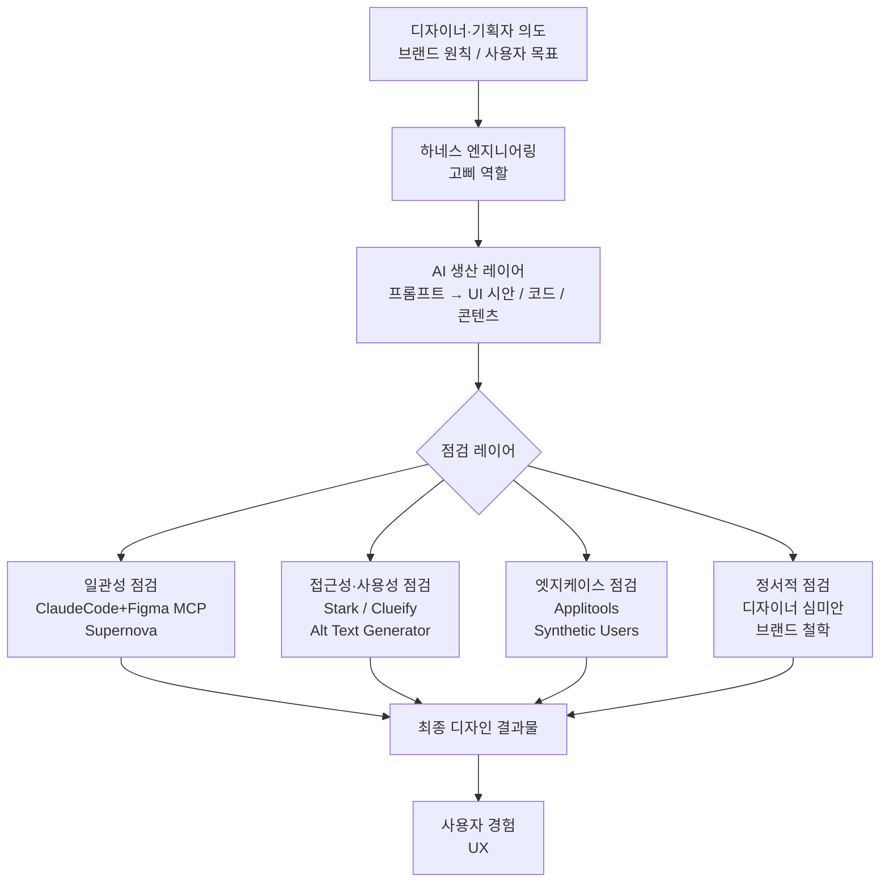
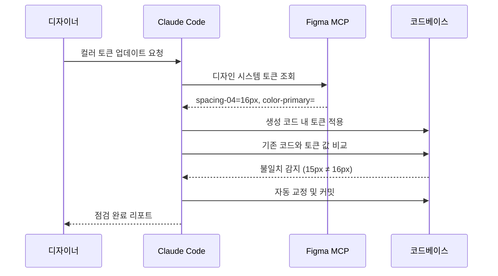
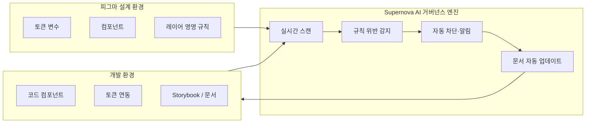
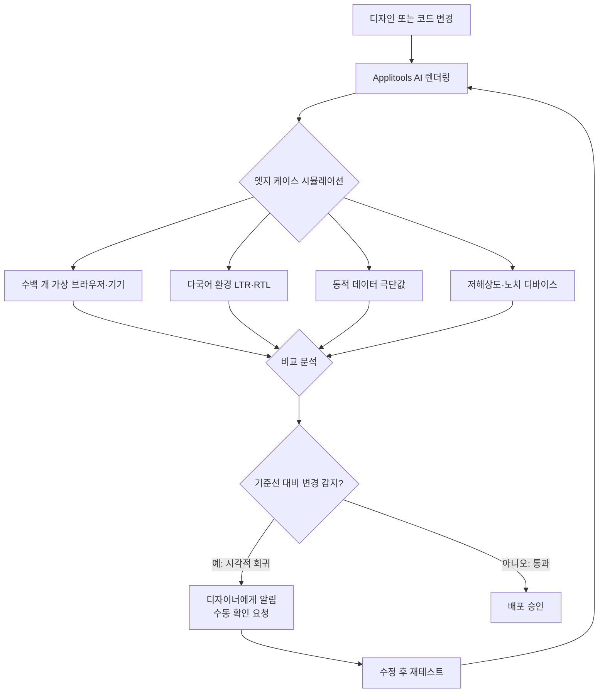
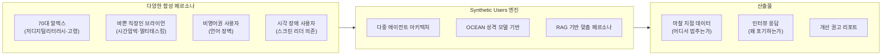
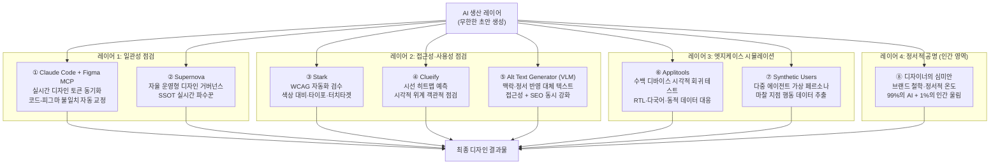
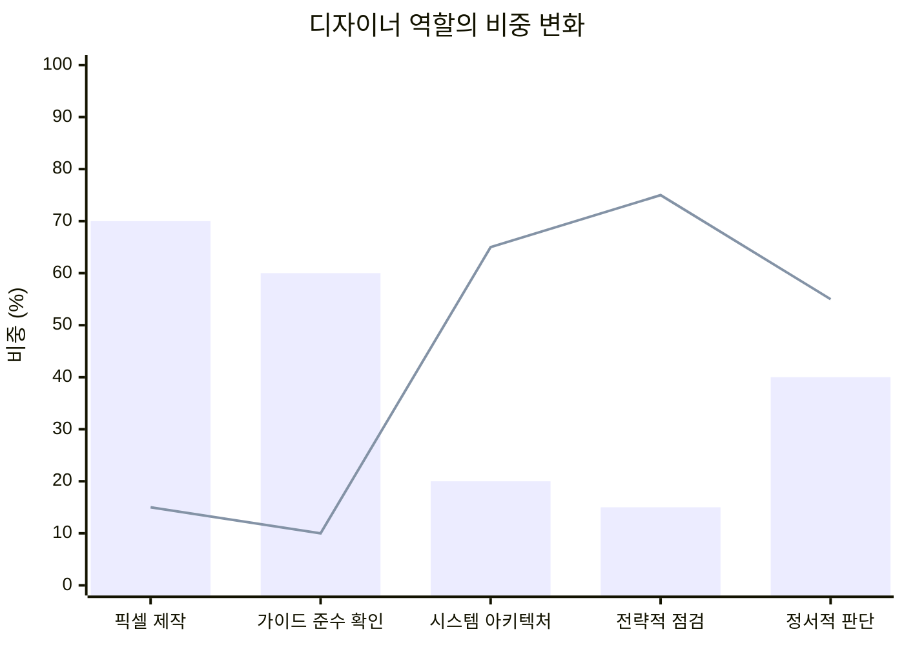

## 하네스 엔지니어링 관점에서 본 AI 시대 디자이너의 진화

---

## 1. 들어가며: AI 생산성 폭발이 불러온 역설

생성형 AI의 급격한 발전은 디자인 분야의 생산 방식을 근본적으로 바꿔놓았다. 프롬프트 몇 줄로 수십 개의 UI 시안이 쏟아지고, 코드를 한 줄도 몰라도 그럴듯한 프로토타입을 손에 쥘 수 있는 시대가 도래했다. 생산의 효율이 무한대에 가까워진 지금, 역설적으로 새로운 문제가 수면 위로 떠오르고 있다. 바로 '쏟아지는 결과물 가운데 무엇이 정답인가?'를 가려내는 일이다.

이 지점에서 등장한 개념이 **하네스 엔지니어링(Harness Engineering)** 이다. 원래 와이어 하네스(Wire Harness)는 자동차나 항공 공학에서 복잡한 전기 배선을 묶고, 보호하며, 제어하는 장치를 가리키는 용어였다. 거대한 엔진의 힘을 각 부품에 안전하게 전달하고 통제하는 핵심 장치였던 셈이다. IT 업계가 이 개념을 AI에 적용하기 시작하면서, 야생마처럼 폭주하는 AI의 생산력에 디자인 원칙이라는 고삐를 채워 원하는 사용자 경험으로 정확히 인도하는 기술의 중요성이 급격히 커지고 있다.

그 결과, 디자이너와 기획자의 역할 중심축이 **제작(Making)에서 점검(Reviewing)** 으로 이동하고 있다. AI가 만든 수많은 초안 가운데 미세한 결함을 찾아내고, 브랜드의 영혼을 불어넣어 최종 완성도를 결정하는 심판관으로서의 역량이 AI 시대의 새로운 생존 전략이 된 것이다.

요즘IT(yozm.wishket.com)에 2026년 5월 11일 게재된 Sarah의 글 "디자인 AI 워크플로에 '고삐'를 채워줄 기술 8가지"는 바로 이 패러다임 전환을 정면으로 다룬 실무 분석 글이다. 본 문서는 그 내용을 기반으로 각 도구의 기술적 원리와 업계 맥락을 더욱 상세히 풀어내고자 한다.

---

## 2. 하네스 엔지니어링의 구조적 위치

하네스 엔지니어링이 디자인 워크플로에서 어떤 위치를 차지하는지를 먼저 구조적으로 이해할 필요가 있다. AI가 생산을 담당하는 '엔진'이라면, 하네스는 그 에너지를 올바른 방향으로 통제하고 전달하는 배선 체계다.

AI가 생성한 초안은 위의 각 점검 레이어를 거치며 정제된다. 이 구조에서 디자이너의 역할은 레이어마다 어느 기준을 적용할지, 어떤 도구로 자동화할지, 그리고 어느 지점에서 인간의 판단이 개입해야 하는지를 설계하는 **아키텍트**에 가까워진다.

---

## 3. 레이어 1: 일관성 있는 디자인 시스템 설계

### 3.1 문제의 본질: 파편화와 관리 부채

디자인 시스템의 가장 큰 적은 방치다. 관리되지 않는 시스템은 필연적으로 코드와 디자인이 따로 움직이는 파편화(Fragmentation)로 이어진다. 예전에는 디자인 시스템을 점검할 때 디자이너와 개발자가 서로 화면을 맞춰보며 "이 컬러 값이 가이드와 맞나요?"라고 묻는 수동적이고 비효율적인 과정이 반복되었다. 피그마에서 바뀐 내용이 개발 환경에 반영되기까지는 누군가의 정성적인 보고와 수정 과정이 반드시 필요했고, 그 사이에서 수많은 레이어 명명 규칙 오류나 사용되지 않는 스타일이 디자인과 개발의 기술 부채로 쌓여갔다.

AI의 등장은 이 일관성 점검의 주도권을 인간에서 시스템으로 옮기고 있다.

---

### 3.2 클로드 코드 + 피그마 MCP: 실시간 동기화의 혁신

수천 개의 화면에 새로운 컬러 토큰을 적용해야 하는 상황을 상상해보자. 기존 방식이라면 수일에 걸친 반복 작업이 불가피하다. 그러나 지금은 다르다.

디자이너는 **클로드 코드(Claude Code)** 에게 MCP(Model Context Protocol)를 통해 피그마 디자인 시스템 라이브러리에 직접 접근할 권한을 부여할 수 있다. AI는 단순히 코드를 생성하는 데 그치지 않고, 현재 작업 중인 코드베이스와 피그마의 디자인 토큰을 실시간으로 비교·대조한다. 예를 들어, AI가 생성한 컴포넌트의 여백이 피그마에 정의된 16px(spacing-04)가 아닌 임의의 15px로 작성됐다면, AI는 이를 스스로 인지하고 즉시 교정한다.

이 흐름에서 디자이너는 "시스템을 제대로 따랐는가?"를 확인하는 반복 업무에서 완전히 해방된다. 대신 시스템 자체의 논리 구조를 개선하는 시스템 아키텍트 관점의 고차원 점검에 집중하게 된다.

---

### 3.3 Supernova: 자율 운영형 디자인 거버넌스

**Supernova**는 '진실의 원천(Single Source of Truth, SSOT)'을 실시간으로 감시하는 자율 운영형 디자인 거버넌스 플랫폼이다. 디자인 시스템 관리 플랫폼으로 2025년 9월 시리즈 A 투자를 유치하며 Supernova 3.0을 출시했고, 2026년 현재는 **에이전틱 AI(Agentic AI)** 를 핵심 기능으로 내세우고 있다.

> **SSOT(Single Source of Truth)란?**
> 데이터 아키텍처 내에서 특정 정보의 무결성을 보장하기 위해, 모든 데이터 요소를 오직 하나의 공식 마스터 데이터베이스에서만 생성하고 편집하도록 강제하는 관리 원칙이다. 디자인 시스템에서 SSOT는 디자인 토큰, 컴포넌트 문서, 코드 라이브러리가 단 하나의 진실로 통합 관리됨을 의미한다.

Supernova AI는 피그마의 레이어 구조와 명명 규칙, 스타일 적용 현황을 실시간으로 스캔하고, 시스템 원칙에 어긋나는 요소가 발견되는 즉시 차단한다. 특히 2026년 기준으로 Supernova는 단순한 문서화 도구를 넘어 **설계에서 코드로 이어지는 전체 파이프라인을 AI 에이전트가 자율 관리**하는 방향으로 진화하고 있다.

Supernova의 2026 트렌드 보고서에 따르면, 현재 고성능 팀들은 Figma, Jira, GitHub 등 복수의 도구를 넘나들며 다단계 작업을 수행하는 AI 에이전트를 활용해 **디자인 드리프트(Design Drift, 시스템으로부터의 이탈)** 를 프로덕션 단계에 도달하기 전에 자동 감지하고 있다. 또한 2026년을 기점으로 **DTCG(Design Tokens Community Group) 표준**이 확산되어 토큰이 도구 간 공통 언어로 기능하고, 브랜드 DNA가 어느 플랫폼에서도 일관되게 유지되는 환경이 구축되고 있다.

이러한 자동화된 점검 체계 덕분에 디자이너는 컴포넌트 간 고도화된 상관관계나 데이터 기반의 확장 가능한 아키텍처가 올바르게 작동하는지를 점검하는, 보다 고차원적인 디렉터 역할을 맡게 된다. 하네스 엔지니어링의 관점에서 이는 기술이 기술을 스스로 검수하게 함으로써 디자인 품질을 보장하는 가장 완성도 높은 형태의 고삐라고 할 수 있다.

---

## 4. 레이어 2: 접근성과 사용성을 지키는 기술의 그물망

제작 속도가 빨라질수록 미처 챙기지 못한 곳들의 결함도 기하급수적으로 늘어난다. 하네스 엔지니어링은 인간의 인지적 한계를 겸허히 인정하고, AI라는 정교한 렌즈로 서비스의 기술적·윤리적 결점을 촘촘하게 걸러내도록 돕는다.

---

### 4.1 Stark: WCAG 표준 자동화 검수

접근성을 고려하는 일은 단순히 법적 규제를 준수하는 차원을 넘어, 모든 사용자에게 평등한 경험을 제공해야 하는 디자이너의 의무다. 특히 복잡한 금융 지표나 데이터 서비스에서 색약 사용자를 고려하지 않은 차트는 정보 전달의 불평등을 만드는 치명적인 결함이 된다.

**Stark**는 피그마 플러그인 형태로 제공되는 AI 기반 접근성 검수 도구다. 디자인 결과물을 업로드하는 즉시 수만 가지의 웹 콘텐츠 접근성 지침(WCAG 2.2 AA/AAA) 규정을 시뮬레이션한다. Stark의 Auto Scan & Fix 기능은 다음과 같은 항목을 자동으로 점검한다.

- **대비율(Contrast Ratio)**: 텍스트와 배경 간의 밝기 대비가 기준치(AA: 4.5:1 / AAA: 7:1)를 충족하는지 검사
- **타이포그래피**: 폰트 크기, 줄 간격, 글자 간격이 가독성 기준에 맞는지 확인
- **터치 타겟(Touch Targets)**: 모바일 환경에서 버튼·링크의 최소 터치 영역(44×44px) 준수 여부
- **비전 시뮬레이터(Vision Simulator)**: 적색맹, 녹색맹, 청색맹, 전색맹 등 다양한 색각 이상 시뮬레이션
- **Alt Text**: 이미지 대체 텍스트 누락 여부 감지
- **포커스 순서(Focus Order)**: 키보드 탭 이동 순서의 논리적 흐름 점검

이러한 분석 리포트를 1초 만에 받아볼 수 있다면, 디자이너는 자신의 시각적 편향을 즉각 인식하고 디자인을 교정할 수 있다. Stark의 자동화 점검 결과는 '위반(Violations)', '잠재적 문제(Potentials)', '통과(Passed)' 세 단계로 구분되어 우선순위 대응을 가능하게 한다.

---

### 4.2 Clueify: 데이터로 증명하는 시각적 위계와 사용성

디자인 검증 현장에서 가장 소모적인 논쟁은 "제 눈에는 이게 더 잘 보여요"와 같은 주관적인 의견 충돌이다. **Clueify**는 이런 주관성을 배제하고, AI Vision 기술로 인간의 시각 시스템을 정교하게 모방한다.

Clueify는 수백만 건의 실제 아이 트래킹(Eye Tracking) 데이터를 학습한 AI 모델을 활용한다. 디자이너가 작업물을 업로드하면 AI는 사용자의 시선이 가장 먼저 머무는 지점과 시선이 이동하는 경로를 예측한 히트맵(Heat Map)을 생성한다. 이 과정에서 **어텐션 맵(Attention Map) 아키텍처**가 활용된다.

> **히트맵(Heatmap)이란?**
> 데이터의 밀도를 온도로 표현하는 시각화 방식이다. 사용자들이 많이 머문 지점은 뜨거운 색(빨간색), 적게 머문 지점은 차가운 색(파란색)으로 표시된다.
>
> **어텐션 맵(Attention Map)이란?**
> 딥러닝 모델이 데이터를 처리할 때 어느 부분에 집중했는지, 특정 픽셀에 부여한 가중치를 보여주는 기술 지표다. 인간의 뇌가 시각 정보를 처리하는 방식을 모방한 AI 알고리즘이 이미지 내의 대비, 색상, 형태 등을 분석하여 시선이 쏠릴 가능성이 높은 지점을 계산한다.

Clueify를 통해 디자이너는 실제 사용자 테스트를 진행하지 않고도 사용자의 시선이 가장 먼저 머무는 핫스팟(Hot Spot)을 1초 만에 확인하며 시각적 위계를 객관적으로 점검할 수 있다. 예를 들어 서비스의 핵심 CTA인 '결제하기' 버튼보다 주변의 화려한 광고 배너에 시선 점수가 더 높게 나왔다면, AI는 이를 '심각한 사용성 저해 요소'로 리포트한다.

텀블벅(Tumblbug) 리디자인 사례에서는 Clueify 기반의 히트맵 분석을 통해 시각 위계를 재설계한 결과, 크리에이터 프로필 영역에서 기존 서비스 대비 29% 증가, 프로젝트 상세 화면에서 45% 증가라는 시선 집중도 향상을 달성한 것으로 나타났다. 이는 디자이너가 의도한 시각적 위계가 실제 사용자의 인지 과정에서 어떻게 작동하는지 사전에 점검하게 함으로써, 단순한 체크리스트 수준을 넘어선 맥락 기반의 오류 검수를 가능하게 한다.

---

### 4.3 Alt Text Generator: 포용적인 스토리텔링

접근성을 고려한 사용성 설계에서 이미지에 대체 텍스트(Alt Text)를 부여하는 일은 간과할 수 없는 요소다. 여기서 대체 텍스트는 단순히 이미지 제목을 입력하는 수준의 작업이 아니다. 이는 시각 장애 사용자가 스크린 리더를 통해 디지털 생태계를 탐색할 때, 이미지가 담고 있는 상징적 의미를 전달받고 브랜드의 서사에 온전히 참여할 수 있도록 돕는 **의미론적 접근성(Semantic Accessibility)** 의 핵심이다.

나아가 이는 검색 엔진 최적화(SEO)와도 직결된다. 검색 엔진이 이미지의 맥락을 더욱 정교하게 이해하도록 만들어, 서비스의 발견 가능성을 크게 높여주기 때문이다.

과거에는 수백, 수천 개의 에셋에 대체 텍스트를 일일이 붙이는 일 자체가 막대한 물리적 노동력을 요구하는 병목 구간이었다. 하지만 최신 멀티모달 AI, 특히 **시각-언어 모델(VLM, Vision-Language Model)** 을 활용한 생성기들은 이제 객체를 단순히 나열하는 수준을 훨씬 넘어선 결과물을 보여준다.

예전에는 "강아지가 한 마리 있습니다"처럼 평면적인 묘사에 머물렀다면, 이제 AI는 "포근한 거실 창가에서 오후의 햇살을 받으며 낮잠을 자는 골든 리트리버"처럼 이미지의 정서적 분위기와 서사적 맥락까지 포착해 제안한다.

> **시각-언어 모델(VLM, Vision-Language Model)이란?**
> VLM은 시각 정보(Vision)와 언어 정보(Language)를 통합적으로 처리하는 AI 모델이다. 컴퓨터 비전 기술이 이미지 속 사물을 개별 객체로 분류하거나 위치를 찾는 데 그쳤다면, VLM은 이미지 전체의 서사와 감정적 맥락을 인간의 언어 체계와 유기적으로 연결하여 이해한다. "무엇이 있는가?"를 넘어 "어떤 분위기 속에서 어떤 일이 일어나고 있는가?"를 서술할 수 있게 된 것이다.
>
> 이러한 혁신의 핵심은 **공통 잠재 공간(Shared Latent Space)** 에서의 데이터 정렬 기술에 있다. AI는 픽셀의 패턴(따스한 조명의 각도, 부드러운 피사체의 질감)을 추출하여 인간의 추상적인 언어 개념인 '포근함', '평화로운 낮잠'이라는 단어와 일치시킨다. 픽셀 데이터가 언어적 의미를 획득하는 순간이다.

tailwindapp과 같은 VLM 기반 Alt Text Generator 도구는 이미지를 업로드하는 즉시 맥락과 정서까지 반영된 대체 텍스트를 제안한다. 여기서 디자이너의 하네스는 AI가 생성한 텍스트가 브랜드 고유의 보이스&톤, 그리고 철학적 일관성과 맞아떨어지는지 최종 검수하는 역할을 수행한다. 기술적 복잡성에 매몰되지 않으면서도 콘텐츠의 포용성을 확보하고, 서비스의 품격을 결정짓는 마지막 디테일을 지켜내는 것. 이것이 바로 지능형 도구를 다루는 현대 디자이너의 진화된 책무다.

---

## 5. 레이어 3: 엣지 케이스에 대응하는 시뮬레이션

완벽하다고 믿었던 디자인이 실제 환경에서 무너지는 순간이 있다. 이러한 엣지 케이스(Edge Case)는 디자이너와 개발자에게 예상치 못한 불청객처럼 찾아온다. 그러나 이를 대응하지 못하면 프로라고 말하기 어렵다. AI를 활용하면 인간의 상상력이 미처 닿지 못했던 극단적인 상황들을 사전에 시뮬레이션하고 선제적으로 방어할 수 있다.

---

### 5.1 Applitools: 시각적 완결성의 자동 검증

과거에는 다양한 디바이스와 환경에 대응하기 위해 화면을 일일이 복제하고 대조하는 수작업이 필요했다. 특히 텍스트 길이가 극단적으로 길어지는 언어(독일어 등)나 오른쪽에서 왼쪽으로 읽는 RTL(아랍어·히브리어 등) 환경은 디자이너에게 상당한 부담이었다.

**Applitools AI**는 인간의 눈처럼 화면을 인지하고 분석한다. 수백 개의 가상 브라우저와 디바이스 환경에서 디자인을 실시간으로 렌더링하며 다음과 같은 다양한 엣지 케이스를 탐지한다.

| 엣지 케이스 유형 | 구체적 예시 |
|---|---|
| **동적 데이터 이슈** | 사용자 이름이 지나치게 길어 버튼 밖으로 텍스트가 넘치는 경우 |
| **다국어 레이아웃** | 상품명이 3줄 이상 늘어날 때 아래 레이아웃과 겹치는 경우 |
| **RTL 미러링 오류** | 아랍어 환경에서 프로필 이미지가 왼쪽이 아닌 오른쪽에 배치된 경우 |
| **디바이스 파편화** | 노치 디자인 기기에서 상단 바 아이콘이 가려지는 경우 |
| **렌더링 오차** | 저사양 기기에서 폰트 렌더링이 뭉개지는 픽셀 단위 오차 |

이러한 엣지 케이스 오류를 발견하면 Applitools는 즉시 **시각적 회귀 테스트(Visual Regression Test)** 를 수행하고, 디자이너에게 확인을 요청한다. 그 덕분에 디자이너는 수작업 기반의 전수 조사에서 벗어나, 시스템의 시각적 안정성을 높이는 데 집중할 수 있다.

---

### 5.2 Synthetic Users: 사용자 시나리오 맞춤 대응

기술적 결함을 넘어 사용자의 심리나 상황적 변수까지 선제적으로 점검하는 일은 서비스의 성패를 좌우하는 핵심 과업이다. **Synthetic Users**와 같은 AI 에이전트 서비스는 가상의 페르소나를 디지털 환경에 주입해 디자인의 실질적인 사용성을 실시간으로 검증한다.

Synthetic Users는 **다중 에이전트 아키텍처(Multi-Agent Architecture)** 를 채택하여 각 AI 참가자가 OCEAN 모델(개방성·성실성·외향성·친화성·신경성) 기반의 개별 성격 프로필을 형성하고, 인터뷰 전반에 걸쳐 일관된 맥락과 연속성을 유지한다. 단일 LLM 기반 도구들이 구현하기 어려운 일관성 있는 페르소나 반응이 가능한 이유다.

구체적인 페르소나 사례를 살펴보면 다음과 같다.

**페르소나 ①: 고령 사용자 '70대 알렉스'**
디지털 리터러시가 낮고 시각적 인지 능력이 다소 떨어지는 사용자다. AI는 이 페르소나를 통해 추상적인 아이콘 의미를 이해하지 못하거나, 작은 텍스트 크기 때문에 정보 구조 안에서 길을 잃는 지점을 정확히 짚어낸다. 특정 내비게이션 탭의 아이콘만으로는 기능을 유추하기 어렵다는 피드백이 도출될 경우, 레이블 텍스트 병기가 필요하다는 개선 방향이 자동으로 제안된다.

**페르소나 ②: 바쁜 직장인 '브라이언'**
멀티태스킹 상황에서 극도의 시간 압박을 느끼는 사용자다. AI는 정보 계층 구조가 지나치게 복잡하거나, 불필요한 팝업 인터럽트가 발생할 때 사용자가 느끼는 피로도와 즉각적인 이탈 구간을 시뮬레이션한다.

AI 에이전트는 이러한 특성을 반영해 서비스를 직접 탐색하고, 사용자가 어디서 행동을 멈추고 어디서 결정을 망설이는지에 대한 마찰 지점 데이터를 리포트한다. 이제 우리는 "사용자가 왜 여기서 멈췄을까?"를 머릿속으로 추측하는 가설 단계에 머물지 않는다. 대신 AI가 점검해온 객체화된 행동 데이터를 바탕으로 서비스 고도화와 개선 의사결정에 집중하게 된다.

단, 여기서 반드시 짚어야 할 비판적 관점이 있다. ACM Interactions(2025년 12월)에 발표된 논문 "The Synthetic Persona Fallacy"는 합성 페르소나 도구들이 실제 인간 연구를 대체하는 것처럼 마케팅되고 있는 현실을 정면으로 비판한다. Nielsen Norman Group 역시 합성 사용자들이 과도하게 낙관적인 반응을 보이고, 실제 사용자 경험의 맥락적 미묘함을 놓치는 경향이 있다고 지적했다. 따라서 Synthetic Users는 **가설 생성과 초기 검증**의 도구로 활용하되, 최종 의사결정은 반드시 실제 사용자 리서치와 병행해야 한다는 점을 명심해야 한다.

---

## 6. 레이어 4: 디자이너의 심미안과 정서적 공명

지금까지 기술적 결함을 제거하고 시스템 효율을 극대화하는 하네스의 역할을 살펴봤다면, 마지막으로는 그 고삐를 쥔 기수, 즉 디자이너의 본질적인 감각에 대한 이야기로 넘어가야 한다. AI가 시스템적으로 무결하고 기술적으로 완벽한 디자인을 만들어냈다고 해도, 그것이 정말 사용자의 마음을 움직이는 좋은 디자인인가의 문제는 또 다른 차원의 영역이기 때문이다.

바로 이 지점에서 디자이너만의 독보적인 가치인 **심미안(Aesthetic Sensibility)** 이 발휘된다. 이는 단순히 시각적 아름다움을 넘어, 브랜드의 영혼과 사용자의 감성을 잇는 정서적 점검까지 포함한다.

구체적인 사례를 들어보자. AI가 설계한 보험 서비스의 '사고 접수 완료' 화면은 정보 구조 측면에서 매우 효율적이고 명확할 것이다. 그러나 예기치 못한 사고로 당혹감과 불안을 느끼는 사용자가 이 화면을 마주한다면 상황은 달라진다. AI가 제안한 경직된 시스템 폰트와 차가운 원색의 체크 아이콘, "접수가 완료되었습니다"라는 건조한 문구는 사용자에게 기능적인 편리함은 줄지언정, 정서적인 안도감까지 줄 수는 없다.

바로 이 순간, 디자이너의 하네스가 다시 작동한다. AI가 내놓은 매끈한 정답지에 인간의 온도를 불어넣는 일이다. 버튼 모서리의 곡률을 미세하게 조정해 시각적 긴장감을 완화하고, 마이크로 카피에 브랜드 철학이 담긴 다정한 위로의 톤 앤 매너를 입히는 과정이다.

기술이 복잡성을 삼켜 인터페이스 뒤편으로 사라질수록, 마지막까지 남아 사용자의 삶을 어루만지는 것은 결국 사람의 상황을 깊이 이해하려는 디자이너의 태도다. AI가 99%의 논리적 완결성을 구축하더라도, 사용자와 서비스가 깊게 공명하도록 만드는 마지막 1%의 울림은 오직 인간 디자이너의 예민한 점검을 통해서만 완성된다.

---

## 7. 8가지 기술의 종합 맵

원문에서 언급된 8가지 기술을 하네스 엔지니어링의 레이어 구조에 따라 정리하면 다음과 같다.

---

## 8. 디자이너 역할의 패러다임 전환

하네스 엔지니어링이 가져온 가장 근본적인 변화는 디자이너의 직무 정의 자체의 전환이다. 이 전환을 축 두 개로 표현하면 다음과 같다.

*막대: AI 도입 이전 디자이너 비중 / 꺾은선: AI 도입 이후 디자이너 비중*

이 전환을 가장 명확하게 요약하는 질문은 하나다. **"우리는 무엇을 점검할 수 있는가?"**

브랜드의 일관성이 흔들리는 순간을 알아채는 감각, 기술적 결함이 사용자 경험을 갉아먹기 전에 먼저 막아내는 판단력, 그리고 AI가 완성한 화면에 사람의 온도를 불어넣는 태도. 이런 역량은 프롬프트 한 줄로 만들어지지 않는다. 수백 번의 시행착오와 사용자의 표정을 직접 목격한 경험, 그리고 사람을 향한 진심 어린 시선이 쌓여야 비로소 만들어지는 능력이다.

---

## 9. 비판적 고찰: 하네스 엔지니어링의 한계

이 글이 제시하는 하네스 엔지니어링 개념은 현장의 실무적 필요에 응답하는 가치 있는 프레임이지만, 몇 가지 비판적 시각도 함께 살펴볼 필요가 있다.

첫째, **도구 의존의 역설**이다. 점검 도구가 많아질수록 디자이너는 도구의 리포트를 해석하고 대응하는 새로운 메타 작업에 시간을 쏟게 될 위험이 있다. 하네스가 또 다른 복잡성의 레이어가 되지 않으려면, 각 도구의 결과를 통합해 우선순위화하는 워크플로 설계 자체가 전략적 역량이 된다.

둘째, **합성 페르소나의 유효성 한계**다. ACM과 Nielsen Norman Group이 공통적으로 지적하듯, AI 합성 사용자는 실제 사용자의 정서적 맥락, 즉흥적 행동, 문화적 뉘앙스를 충분히 재현하지 못한다. 초기 가설 검증 도구로는 유효하지만, 이를 실제 사용자 리서치의 대체제로 오용하는 것은 심각한 방법론적 오류다.

셋째, **접근성 도구의 규정 준수와 실질적 포용성의 괴리**다. Stark가 WCAG 규정 준수를 자동화해주더라도, 규정 통과가 곧 실질적 접근성을 보장하지는 않는다. 특수한 보조 기술 사용자, 인지 장애 사용자의 경험은 여전히 실제 사용자 테스트를 통해서만 검증될 수 있다.

---

## 10. 마치며: 고삐를 쥔 자의 책임

AI 덕분에 생산력이 상향 평준화된 지금, 누가 더 많이 그리고 더 빠르게 만드느냐는 더 이상 변별력이 되지 않는다. 그 영역은 이미 AI가 가져갔다.

하네스 엔지니어링은 그 빈자리에 디자이너가 새롭게 자리 잡아야 할 역할의 지도를 제시한다. 클로드 코드와 피그마 MCP로 일관성의 고삐를 채우고, Supernova로 시스템이 스스로를 지키게 하며, Stark와 Clueify로 접근성과 사용성의 그물을 치고, Applitools와 Synthetic Users로 예상치 못한 균열을 선제적으로 막는다. 그리고 그 모든 레이어를 통과한 최종 산출물에 인간의 온도를 더하는 것이 디자이너의 최후 책임이다.

기술이 평준화될수록 경험의 깊이가 차별점이 된다. 생산은 AI에게 맡기더라도, 그 고삐(Harness)만큼은 절대 놓지 말아야 한다. 현장에서 쌓아온 모든 경험이 가장 귀한 자산이기 때문이다.

---

## 참고 자료

- Sarah, "디자인 AI 워크플로에 '고삐'를 채워줄 기술 8가지", 요즘IT, 2026년 5월 11일. https://yozm.wishket.com/magazine/detail/3747/
- Supernova, "The Future of Enterprise Design Systems: 2026 Trends", Supernova Blog, January 9, 2026. https://www.supernova.io/blog/the-future-of-enterprise-design-systems-2026-trends-and-tools-for-success
- Supernova, Design System Management. https://www.supernova.io/design-system-management
- Synthetic Users, Platform Overview. https://www.syntheticusers.com/
- AIMulitple, "Synthetic Users Explained: Top 7 AI User Research Tools", March 6, 2026. https://aimultiple.com/synthetic-users
- Konstantinos Papangelis, "The Synthetic Persona Fallacy: How AI-Generated Research Undermines UX Research", ACM Interactions, December 17, 2025. https://interactions.acm.org/blog/view/the-synthetic-persona-fallacy-how-ai-generated-research-undermines-ux-research
- Qualz.ai, "Synthetic Users for Early-Stage Validation", January 25, 2026.
- Behance, 텀블벅 UX/UI 리디자인. https://www.behance.net/gallery/247338319/Tumblbug-UXUI-Redesign-UXUI
- Stark, Figma Contrast & Accessibility Checker. https://www.figma.com/community/plugin/732603254453395948/stark-contrast-accessibility-checker
- Applitools, Visual AI Testing. https://applitools.com/

---

*작성일: 2026년 5월 11일*
