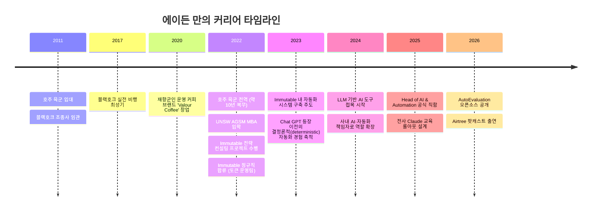
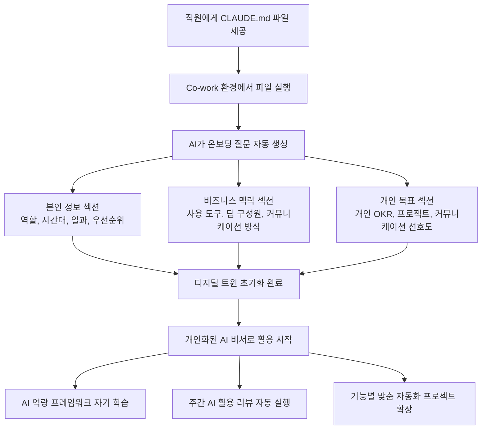
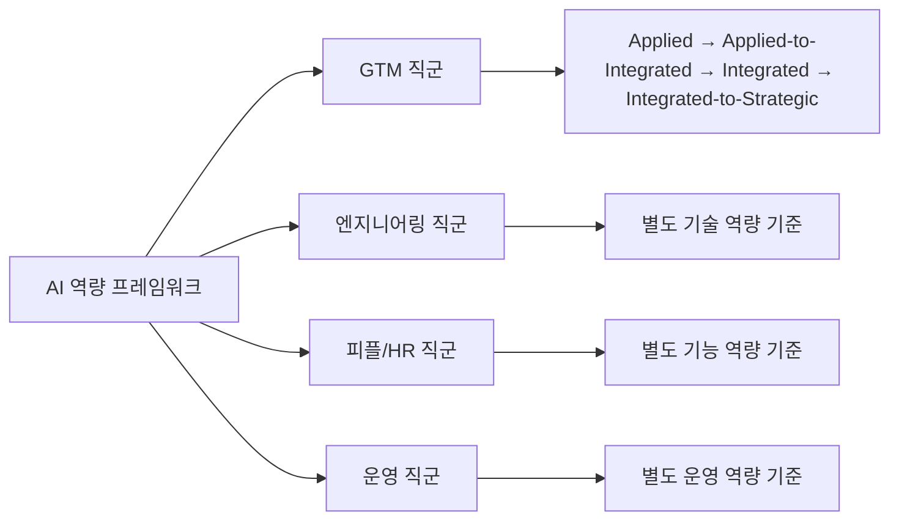
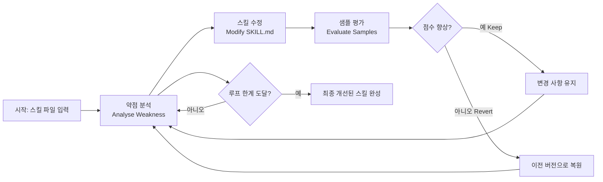
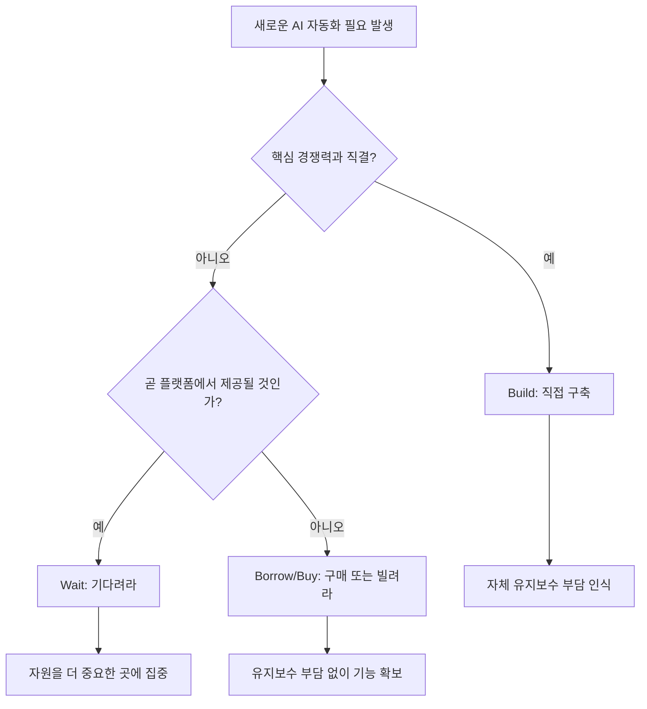
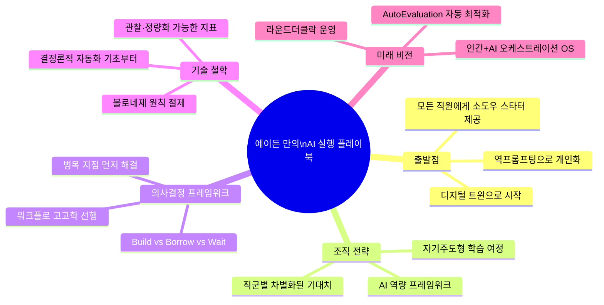

> **원본 영상**: [From Black Hawk pilot to Head of AI: The operator's playbook](https://www.youtube.com/watch?v=UXj_g5cvBto)  
> **채널**: Airtree Ventures (2026년 4월 24일 공개)  
> **게스트**: Aden Mann, Head of AI & Automation @ Immutable  
> **진행자**: Jackie Vullinghs (Airtree Ventures)

---

## 1. 에이든 만은 누구인가

에이든 만(Aden Mann)은 호주 시드니 출신으로, 어린 시절부터 헬리콥터 조종사가 되는 것을 꿈꿔왔다. 그 꿈을 현실로 만들어, 만 23세에 UH-60 블랙호크(Black Hawk) 헬리콥터의 조종석에 앉아 실제 임무를 수행하는 수준에 도달했다. 이후 약 10년간 호주 육군에서 헬리콥터 조종사 및 전술 작전 연락관으로 복무하며, 블랙호크와 MRH90 타이판(Taipan) 두 기종을 운용했다.

군 복무를 마친 후, 그는 UNSW AGSM(오스트레일리아 경영대학원)에서 MBA를 1년 만에 집중 이수했다. 졸업 직전 최종 학기에 '산업 전략 컨설팅 프로젝트'를 수행하게 되었고, 그 대상 기업이 바로 블록체인 게임 플랫폼 기업인 **Immutable**이었다. 디지털 자산과 암호화폐 관련 업무를 다루며 군에서 체득한 운영(Operations) 역량을 비즈니스 언어로 빠르게 전환해내면서, 졸업 후 정규직으로 합류하게 된다.

Immutable에서 그는 토큰 운영(Token Operations) 팀부터 시작해, 디지털 자산 금융 머신 전체를 홀로 운영하며 자동화 시스템을 구축하는 핵심 인물로 성장했다. 이제 그의 공식 직함은 **Head of AI & Automation(AI·자동화 총괄)** 이다.

---

## 2. 아날로그에서 디지털로: 헬리콥터 조종석이 알려준 것

에이든이 영상에서 가장 먼저 꺼낸 이야기는 헬리콥터 조종석의 변화다. 그는 2017년 블랙호크 조종석과 이후 탑승한 MRH90 타이판 조종석을 대비해 설명한다.

**블랙호크(2017년경)**: 모든 계기판이 아날로그 방식, 즉 그가 표현하는 대로 "스팀 구동식(steam driven)" 방식이었다. 기술적으로는 1960~70년대와 크게 다르지 않았다.

**MRH90 타이판(3년 후)**: 완전히 다른 디지털 조종석 설계로, 멀티펑션 디스플레이(MFD)가 수백 개의 하위 페이지를 숨긴 채 배치되어 있었다.

이 두 조종석 사이의 전환은 단순히 도구의 변화가 아니었다. 조종사가 기계와 상호작용하는 방식 자체가 완전히 달라지는 **패러다임 전환**이었다. 그리고 에이든은 이것이 오늘날 AI 도입과 정확히 같은 구조를 가지고 있다고 말한다.

> "인간이 시스템과 상호작용하는 방식은 계속해서 변하고 있습니다. 인간 두뇌가 정보에 포화되는 방식도 아날로그 세계와 디지털 세계에서 완전히 다릅니다. 저는 AI 이전 세계에서 지금 이 미칠 듯한 세계로의 전환에서 정확히 같은 것을 봅니다."

---

## 3. 블랙호크 조종사에서 AI 책임자까지: 경력의 흐름

---

## 4. Immutable은 어떤 회사인가

Immutable은 이더리움(Ethereum) 기반 웹3 게임 개발 및 퍼블리싱을 위한 개발자 플랫폼이다. 대표작으로는 카드 게임 **Gods Unchained**와 길드 기반 RPG **Guild of Guardians**가 있으며, Immutable Platform과 Immutable Games 두 사업부로 구성되어 있다. 시드니 본사를 중심으로 운영되며, 에이든은 이 스타트업 특유의 '빠르게 진화하는 혼돈' 속에서 시스템과 구조를 잡아나가는 역할을 해왔다.

---

## 5. AI 이전 세계에서 배운 자동화의 기초

에이든이 Immutable에 합류한 것은 ChatGPT 출시 이전이었다. 당시 그는 사용 가능한 도구 자체가 많지 않았기 때문에, 완전히 결정론적(deterministic)인 방식으로 자동화를 설계해야 했다. 이 경험이 오히려 지금 그에게 큰 강점이 되었다고 그는 말한다.

> "AI 이전의 매우 결정론적인 세계에서 이를 갈며 배웠기 때문에, 도구의 기능이 무한히 복잡해진 지금의 세계에서도 설계 선택을 제대로 할 수 있게 되었습니다."

그는 토큰 운영 팀에서 혼자 거대한 디지털 자산 금융 시스템을 운영하며, 자신의 레버리지를 극대화하기 위해 시스템과 자동화를 쌓아 올렸다. 그러자 회사의 다른 부서들도 그를 찾기 시작했고, 결국 AI·자동화 총괄로 역할이 확장되었다.

---

## 6. 전사 AI 도입 전략: 디지털 트윈으로 시작하라

에이든이 Immutable 전체에 Claude와 Claude Code를 교육하고 도입할 때 맞닥뜨린 핵심 문제는 **기술 격차(skill gradient)** 였다. 비기술 직군과 제품/엔지니어링 직군 사이에는 AI 도구 활용 역량에서 현격한 차이가 있었다.

### 6.1 소도우 스타터(Sourdough Starter) 비유

에이든은 전사 교육의 첫 번째 프로젝트를 **소도우 스타터**에 비유한다. 모든 직원에게 빵을 구울 수 있는 스타터를 주면, 각자 자신만의 빵을 구워나갈 수 있듯이, 모든 직원에게 **자신만의 디지털 트윈(Digital Twin)** 을 만들어주는 것이 출발점이었다.

### 6.2 디지털 트윈이란 무엇인가

디지털 트윈은 Claude 환경 안에서 자신을 복제한 AI 에이전트다. 이것은 단순한 채팅 프롬프트 설정이 아니라, 아래와 같은 구조화된 온보딩 과정을 통해 개인화된다.

#### 온보딩 질문의 구체적 내용

디지털 트윈 초기화 과정에서 AI가 직원에게 묻는 질문들은 다음과 같이 구성된다.

**[본인 소개 섹션]**
- 현재 Immutable에서의 직책과 역할은 무엇인가?
- 시간대는 어디인가? (예: 시드니 동부 표준시)
- 매일 하는 주요 업무는 무엇인가?
- 현재 가장 중요한 우선순위 하나는 무엇인가?

**[비즈니스 맥락 섹션]**
- Immutable의 사업 구조에서 본인은 어디에 속하는가?
- 매일 사용하는 도구는 무엇인가?
- 연결되기를 원하는 시스템은 무엇인가?

**[팀 섹션]**
- 팀원은 누구인가?
- 내가 알아야 할 사람은 누가 있는가?
- 최선의 커뮤니케이션 방식은 무엇인가?

**[개인 목표 섹션]**
- 개인 우선순위, 목표, 현재 진행 중인 프로젝트는 무엇인가?

**[커뮤니케이션 선호도]**
- 불릿 포인트를 선호하는가, 아니면 긴 문체를 선호하는가?

이 질문들에 답하면, 디지털 트윈은 스스로 초기화되어 맞춤형 AI 비서로 작동하기 시작한다. 사용자는 복잡한 설정을 할 필요가 없다. 그저 질문에 답하기만 하면 된다.

### 6.3 왜 Co-work인가

에이든은 Claude의 채팅 인터페이스와 Claude Code 사이에서 절충점으로 **Cowork**를 선택했다. Cowork는 비기술 직군에게도 친근하면서, 단순 채팅의 한계를 넘어 컴퓨터의 실제 파일 시스템과 상호작용할 수 있는 환경이기 때문이다.

---

## 7. AI 역량 프레임워크 (AI Fluency Framework)

에이든은 Immutable 전사에 적용되는 **AI 역량 프레임워크**를 직접 설계했다. 이 프레임워크는 조직 내 어떤 위치에 있더라도 각자가 목표로 해야 할 AI 활용 수준을 정의한다.

### 7.1 설계 원칙

이 프레임워크의 가장 핵심적인 인사이트는 **직군별 기대치가 달라야 한다**는 것이다. 예를 들어, 엔지니어링 총괄과 피플(HR) 총괄이 달성해야 하는 AI 역량의 수준과 종류는 다르다. 따라서 각 직군 리더와 긴밀히 협업하면서, 각 영역에 맞는 역량 기준을 지속적으로 업데이트하는 것이 가장 중요한 작업이었다고 그는 강조한다.

### 7.2 자기 주도형 역량 개발

디지털 트윈은 이 프레임워크를 자동으로 학습하고, 사용자 스스로를 평가하게 만든다. 예를 들어, AI가 다음과 같은 질문을 던진다.

> "프레임워크를 기준으로 지금 당신이 있는 위치를 솔직하게 어디라고 생각하십니까? Applied / Applied-to-Integrated / Integrated / Integrated-to-Strategic"

이후 각 역량 기둥(pillar)에 대한 자가 평가를 순차적으로 진행하며, 인터랙티브한 학습 여정이 시작된다. 여기에 **매주 금요일 자동 실행되는 예약 작업**을 추가하면, AI가 스스로 "이번 주에 AI를 어떻게 활용했는지, 다음 주에는 어떻게 더 잘할 수 있을지"를 사용자에게 질문한다.

에이든은 이를 **자기 반성적 학습 여정(self-reflexive learning journey)** 이라고 부른다.

---

## 8. AutoEvaluation: 잠자는 동안 스킬이 성장하는 시스템

### 8.1 탄생 배경: 카르파티의 autoresearch

2026년 3월, AI 연구자 안드레이 카르파티(Andrej Karpathy, 전 OpenAI 공동 창업자, 전 테슬라 AI 총괄)는 **autoresearch**라는 오픈소스 프로젝트를 공개했다. 핵심 개념은 AI 에이전트에게 소규모 LLM 훈련 환경을 제공하고, 사람의 개입 없이 밤새 실험하게 두는 것이다. 에이전트는 코드를 수정하고, 5분간 훈련하고, 결과가 개선되었는지 확인하고, 유지하거나 버리고, 다시 반복한다.

카르파티의 autoresearch는 하나의 마크다운 프롬프트와 약 630줄의 훈련 코드만으로 단 2일 만에 700번의 실험을 실행했다. 그 결과 훈련을 개선하는 20가지 최적화 방법을 발견했다. 에이전트들은 train.py를 수정하고, 새 아이디어를 시도하고(QK Norm과 RoPE 순서 변경 같은 참신한 아키텍처 조정 포함), 실패로부터 배우고, 계속 진행했다.

2026년 3월 7일 공개된 이 프로젝트는 며칠 만에 21,000개 이상의 GitHub 스타와 카르파티의 발표 포스트에 860만 건의 조회수를 기록했다.

### 8.2 에이든의 응용: 스킬 자동 평가 시스템

에이든은 이 autoresearch 개념을 자신의 문제에 맞게 변형했다. 그의 문제의식은 이것이었다.

> "저는 Claude 환경에 30~40개의 스킬(skill)을 가지고 있습니다. 퇴근하고 자는 동안, 이 스킬들이 스스로 평가되고 개선된다면 어떨까요?"

이를 위해 그는 **AutoEvaluation**이라는 시스템을 구축하고 GitHub에 공개했다. 핵심은 LLM 스킬(instruction 파일)을 자동으로 최적화하는 루프를 만드는 것이다.

### 8.3 AutoEvaluation 작동 원리

**4단계 루프의 세부 내용:**

1. **분석(Analyse)**: 마지막 실행에서 가장 약한 지표를 읽어낸다.
2. **수정(Modify)**: 스킬에 단 하나의 표적화된 변경을 가한다.
3. **평가(Evaluate)**: 수정된 스킬로 출력물을 생성하고, 채점 기준표(rubric)에 따라 점수를 매긴다.
4. **결정(Decide)**: 점수가 개선되면 변경을 유지하고, 그렇지 않으면 이전 버전으로 되돌린다. 반복.

### 8.4 피드백 루프의 속도 조절

에이든이 이 시스템에 특별히 구현한 기능 중 하나는 **루프 속도 조절**이다. 10분 안에 빠른 결과를 원하는 경우와, 한 달에 걸쳐 천천히 최적화하고 싶은 경우 모두를 지원하는 **설정 마법사(setup wizard)** 를 내장했다.

### 8.5 대시보드: 개선 과정을 시각화하다

단순히 터미널에서 실행되는 것을 보는 것을 넘어, 에이든은 **시각적 대시보드**를 함께 구축했다. 이 대시보드는 스킬의 평가 지표 진행 상황을 시간순으로 보여준다.

**영상에서 소개된 '글쓰기 스타일 스킬(Writing Style Skill)' 약 2시간 평가 루프 결과 예시:**

| 지표 | 내용 |
|------|------|
| Human Score | 인간 평가자 기준 자연스러움 |
| Task Accuracy | 지시 이행 정확도 |
| Quality | 전반적 품질 |
| Banned Words | 금지 단어 사용 횟수 |
| Em Dashes | 금지된 em 대시(—) 사용 횟수 |
| Contraction Ratio | 자연스러운 축약형 사용 비율 |
| Not X is Y | "X가 아니라 Y다" 패턴 사용 |
| AV Spelling | 호주식 영어 철자 준수 |
| Mean Sent Len | 평균 문장 길이 |
| Worst Len Var | 문장 길이 편차 |
| Order Variety | 문장 구조 다양성 |
| Parallel Clusters | 병렬 구조 클러스터 |

이 대시보드는 또한 **실험 히스토리**를 히트맵 형식으로 시각화하며, 각 이터레이션에서 변경을 유지했는지(Keep), 버렸는지(Discard), 어떤 이유로 그 결정을 내렸는지를 기록한다.

### 8.6 실행 자동화: GitHub Action과 Claude 스케줄 태스크

에이든은 이 루프를 완전한 자동 운영으로 만들기 위해 두 가지 방법을 활용한다.

- **GitHub Action**: 매일 새벽 3시에 AutoEvaluation 루프를 자동 실행하도록 예약
- **Claude 스케줄 태스크**: Claude에 스케줄 기능이 도입되면서, GitHub Action 없이도 워크플로 내에서 예약 실행이 가능해짐

이로써 사용자는 점심을 먹고 돌아오면 자신의 스킬이 더 좋아져 있는 경험을 할 수 있다.

---

## 9. 어떤 스킬을 AutoEvaluation 대상으로 삼아야 하는가

에이든의 기준은 명확하다. **매일 사용하는 스킬**이 먼저다. 자주 쓰는 것을 개선할 때 복리(compounding) 효과가 가장 크기 때문이다.

그리고 최적화의 핵심 조건은 **관찰 가능하고 정량화할 수 있는 지표(observable quantifiable metric)** 의 존재 여부다. "이게 좋은가?"라는 질적 판단은 LLM이 LLM의 출력을 평가하는 구조로 신뢰성이 낮다. 반면 "이 텍스트에서 금지된 em 대시가 몇 번 나왔는가?"는 명확히 측정 가능하다.

> "관찰 가능하고 정량화할 수 있는 지표가 있는 한, 그 지표를 중심으로 최적화할 수 있습니다."

---

## 10. AI 도입 시 피해야 할 세 가지 실수

에이든이 영상에서 직접 꼽은 기업 AI 도입의 핵심 교훈들이다.

### 10.1 잘못된 것을 만드는 기회비용이 그 어느 때보다 높다

AI 도입의 속도가 너무 빠르기 때문에, 잘못된 방향으로 장기 프로젝트에 시간과 자원을 투입하면 그 기간 동안 다른 중요한 것들이 외부에서 급속히 발전한다. 따라서 **무엇을 먼저 만들 것인가**를 가장 신중하게 결정해야 한다.

에이든은 Immutable에서 AI·자동화를 시작할 때, CEO와 함께 **GTM(Go-to-Market) 엔지니어링**을 첫 번째 집중 영역으로 선택했다. 제한된 AI·자동화 자원을 고려할 때 가장 병목이 되는 지점을 찾아 그곳에 집중 투자한 것이다.

### 10.2 AI 시스템이 스스로 찾아오게 하라: Build/Borrow/Wait 프레임워크

모든 것을 직접 만들려 하지 말고, 때로는 기다리는 것이 최선이다. 에이든은 이를 **Build / Borrow(Buy) / Wait** 프레임워크로 설명한다.

실제 사례로, 에이든의 팀은 한때 회의 녹음·전사·액션 아이템 자동화 소프트웨어를 어떤 서드파티 제품으로 구매할지 검토하는 데 시간을 쏟았다. 하지만 그들은 Google Suite를 쓰고 있었고, 결국 Gemini가 이 기능을 자동으로 제공하게 되었다. 먼저 "AI가 우리에게 어떻게 자연스럽게 찾아올까?"를 생각했다면 그 시간을 아꼈을 것이다.

### 10.3 워크플로 고고학(Workflow Archaeology): 자동화하기 전에 먼저 파헤쳐라

이것이 에이든이 가장 강조하는 교훈이다. 팀의 업무에 AI를 적용해달라는 요청을 받으면, 가장 먼저 해야 할 일은 코드를 짜는 것이 아니다.

> "그 팀이 항상 해왔던 방식의 가정들과 습관들을 발굴(dig up)하고, 그것들을 진정으로 이해하는 것이 먼저입니다. 그런 다음에 최적화와 사이클 타임 단축, AI 접목을 생각해야 합니다."

기존 프로세스를 그대로 자동화하면 단지 **더 빠른 쓰레기(faster mess)** 를 만들 뿐이다. 먼저 불필요한 것을 제거하고, 그것이 실제로 작동함을 검증한 후에야 자동화해야 한다.

---

## 11. 인간의 정보 포화와 AI 시대의 집중력

에이든은 군에서 **인간 수행 최적화(Human Performance Optimization)** 를 직접 교관으로 가르쳤다. 그 핵심 개념 중 하나는 **인간은 단일 채널 프로세서(single-channel processor)** 라는 것이다. 즉, 인간은 한 번에 하나의 것에만 진정으로 집중할 수 있다.

그런데 현재 여러 Claude 인스턴스와 Gemini, 여러 터미널 창을 동시에 열어두는 작업 환경은, 밤에 야간 투시경을 착용하고 MRH90의 다섯 개 멀티펑션 디스플레이를 관리하던 조종석만큼이나 정보 포화 상태를 만들어낸다. 그는 지금 자신의 일상 업무에서 똑같은 경험을 하고 있다고 말한다.

> "최고의 조종사들은 언제, 어디를 봐야 최적의 정보를 얻을 수 있는지 아는 사람들이었습니다. 에이전트 8개를 동시에 실행할 수 있다고 해서 반드시 그렇게 해야 한다는 의미는 아닙니다. 8가지를 형편없이 하는 것보다 한 가지를 제대로 하는 게 낫습니다."

그리고 그는 AI 자동화에도 같은 원칙을 적용한다.

> "볼로네제 같은 것입니다. 절제의 문제입니다. 볼로네제에 너무 많은 것을 넣어서는 안 됩니다."

---

## 12. 라운드더클락(Round-the-Clock) 운영: 잠자는 동안 가치를 창출하라

에이든의 현재 최대 관심사는 **24시간 운영(Round-the-Clock Operations)** 이다. 퇴근 후부터 출근 전까지, 지금까지 완전히 비어 있던 시간대를 AI 에이전트가 채울 수 있다는 것이다.

그는 Immutable에서 자신의 공식 임무 중 하나가 **인간과 AI가 함께 최대 효율을 내는 운영 체계(OS)** 를 설계하는 것이라고 말한다. 이 관점에서 자연스럽게 도달하는 결론은, "우리가 아무것도 하지 않는 시간에 무엇을 할 수 있는가?"다.

AutoEvaluation이 바로 이 철학의 실천 사례다. 그는 저녁에 일을 마치고, 새벽 동안 시스템이 스킬을 개선하고, 아침에 더 나아진 결과를 보는 사이클을 구축했다.

---

## 13. 개인 레버리지의 측정과 미래

에이든은 자신의 한 주 작업량을 Claude에게 평가시키는 흥미로운 실험을 진행했다.

> "일주일치 Claude 채팅 히스토리와 리포지터리를 보고, 내 인간 아웃풋 점수를 매겨라. 그리고 상위 FAANG 기업의 비슷한 직급 사람과 비교해달라."

이처럼 개인의 순수 아웃풋을 이렇게 빠르게 피드백받는 것은 전례 없는 일이다. 그리고 그는 6개월 후를 이렇게 전망한다.

> "레버리지가 단지 제가 이 인터페이스에서 무언가를 하는 것이 아니라, 저의 여러 버전 혹은 에이전트들이 동시에 그것과 병행해서 무언가를 하는 것으로 확장됩니다. Claude는 병렬 실행을 완벽하게 해냈습니다. 무언가를 요청하면, 3개의 에이전트를 스핀업하여 처리합니다. 이것을 항상 실행되는 형태로 만들면, 빠르게 관리·오케스트레이션 문제가 기술 가능성의 문제를 대체합니다."

---

## 14. 비기술 직군을 위한 AI 시작 조언

에이든이 AI를 처음 시작하는 비기술직 사람들에게 권하는 첫 번째 프로젝트는 단연 **디지털 트윈**이다.

그 이유는 다음과 같다. 자기 자신에 대해서는 이미 알고 있기 때문에, AI에게 **역프롬프팅(Reverse Prompting)** 을 통해 정보를 추출하는 것이 가능하다. AI가 사용자에게 질문하고, 사용자는 그에 답하면서, AI가 스스로 구축되어 간다. 이 과정에서 사용자는 자연스럽게 다음을 깨닫는다.

> "디지털 트윈을 만들면서 이것을 배웠다면, 내 일상 재무 조정(reconciliation) 업무의 3분의 1을 처리하는 스킬을 만드는 것은 어떨까? 글쓰기 스타일을 위한 스킬을 개발했다면, 데이터 준비 작업을 위한 스킬도 만들 수 있지 않을까?"

이러한 시냅스가 연결되기 시작하면, 단순한 AI 비서 활용이 경제적 가치를 창출하는 비즈니스 운영 자동화로 확장된다.

---

## 15. 핵심 요약

---

## 참고 자료 및 링크

- **에이든 만 공식 웹사이트**: [adamann.com](https://adamann.com) (바이브 코딩으로 제작, GTM 엔지니어링 전문 AI 에이전트 포함)
- **에이든 만 LinkedIn**: [linkedin.com/in/aden-mann](https://www.linkedin.com/in/aden-mann/)
- **AutoEvaluation GitHub**: [github.com/AidenC_IM/auto-evaluation](https://github.com) (영상 내 언급)
- **Andrej Karpathy의 autoresearch**: [github.com/karpathy/autoresearch](https://github.com/karpathy/autoresearch)
- **Airtree Ventures**: [airtree.vc](https://airtree.vc)
- **Jackie Vullinghs Substack**: [jax.substack.com](https://jax.substack.com)

---

*이 문서는 2026년 4월 24일 Airtree Ventures가 공개한 유튜브 영상 "From Black Hawk pilot to Head of AI: The operator's playbook" 및 관련 공개 자료를 바탕으로 작성되었습니다.*
