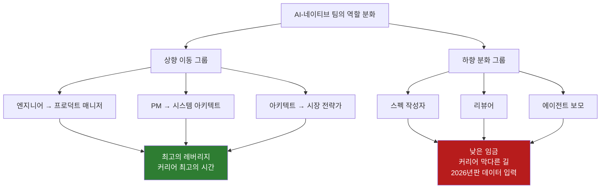
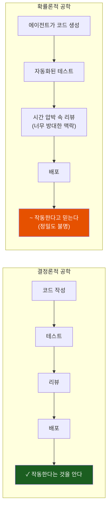
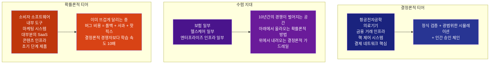
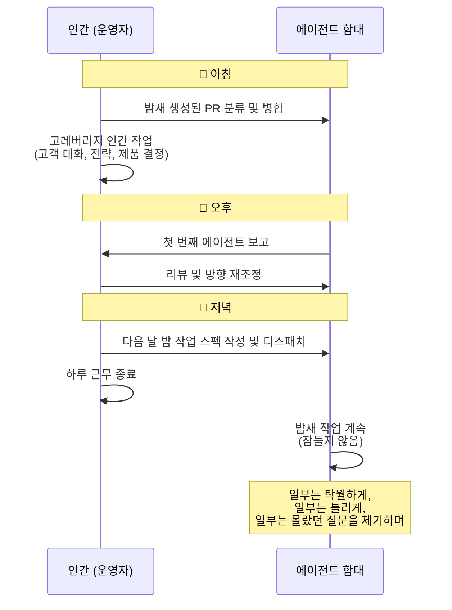
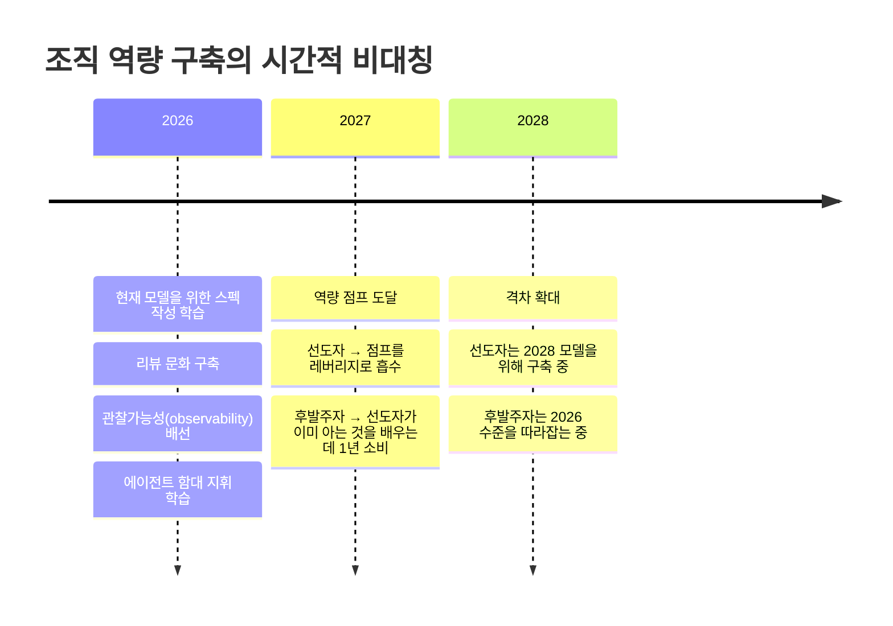

> **원문**: Tim Davis, *"Probabilistic engineering and the 24-7 employee"*  
> **게재일**: 2026년 4월 16일  
> **원문 URL**: https://www.timdavis.com/blog/probabilistic-engineering-and-the-24-7-employee  
> **저자**: Tim Davis — Modular의 공동창업자 겸 대표(Co-Founder & President). 구글에서 6년간 AI 인프라 핵심 아키텍처를 설계하고 온디바이스 머신러닝 부문을 공동창업한 인물로, Modular를 통해 총 3억 8천만 달러를 유치하며 AI 하드웨어 추상화 계층을 구축하고 있다.

---

## 들어가며 — 이 글이 말하는 것의 본질

소프트웨어 업계는 수십 년간 하나의 암묵적 계약 위에서 작동해 왔다. 코드를 작성하고, 테스트하고, 배포하면, 그 코드가 "작동한다"는 것을 알 수 있다는 계약이다. 이것이 결정론적(deterministic) 공학의 세계다. 동일한 입력에는 항상 동일한 출력이 따라온다. 버그는 재현 가능한 것이었고, 추적 가능한 것이었고, 결국 잡힐 수 있는 것이었다.

Tim Davis는 이 에세이에서 그 계약이 조용히 깨지고 있다고 선언한다. 그리고 그것이 단순한 기술적 변화가 아니라 — 역할, 조직, 교육, 그리고 "무언가를 만들었다"는 것의 의미 자체를 바꾸는 — 문명적 수준의 전환이라고 주장한다.

이 글은 산업 전반에 대한 묘사가 아니다. Davis 본인이 명시하듯, 이것은 가장 AI-네이티브한 팀들 내부에서 이미 일어나고 있는 일에 대한 관찰이며, 그것이 나머지 업계를 어디로 끌어당기는지에 대한 예측이다.

---

## 1장 — Compound Loop: 실험에서 얻은 통찰

### 잠든 사이에 코드를 짜는 시스템

Davis는 이 에세이를 추상적 주장이 아니라 자신의 직접 경험으로 시작한다. 그는 Modular를 운영하는 본업 이외의 시간, 즉 퇴근 후 저녁 시간에 **Compound Loop**라는 사이드 프로젝트를 구축했다.

Compound Loop는 여러 개의 최전선(frontier) AI 모델을 서로 대결시켜 코드를 작성하고, 리뷰하고, 병합(merge)하는 시스템이다. LinkedIn에 공개된 그의 설명에 따르면, 이 시스템에서는 Claude가 계획을 세우고, Codex가 구현하며, Gemini가 리뷰하는 방식으로 역할이 분담된다. 이 구조는 단일 모델의 한계를 다중 모델의 상호 검토로 보완하려는 시도다.

그의 하루 루틴은 이렇게 달라졌다. 밤에 실제 문제를 시스템에 던져놓고 잠든다. 아침 8시에 일어나면 전날 밤에는 존재하지 않았던 풀 리퀘스트(PR) 더미가 쌓여 있다. 어떤 PR은 탁월하고, 어떤 것은 틀렸고, 어떤 것은 그가 스스로 물어볼 생각조차 하지 못했던 질문을 수면 위로 끌어올린다. 그리고 그가 PR들을 분류하는 동안, 시스템은 이미 로그를 분석하며 새 PR을 추가하고 있다.

이 경험에서 Davis가 얻은 핵심 통찰은 하나다.

> **"지식 노동의 역사상 처음으로, 집에 간 사람이 자신의 뇌의 유일한 복사본을 가지고 가지 않게 되었다."**

### 9-9-6의 죽음과 24-7의 탄생

중국의 테크 기업 문화를 상징하던 '9-9-6(오전 9시~오후 9시, 주 6일 근무)'이라는 개념은 사라지고, 우리는 24-7 직원이 되었다. 그러나 여기서 Davis가 강조하는 것은, **24-7 직원이란 24시간 일하는 사람이 아니라는 것**이다. 그것은 에이전트 함대(agentic fleet)가 엄청난 병렬성으로 작동하는 사람이다.

2026년 현재 대부분의 팀은 여전히 타이핑 속도가 아니라 조정(coordination) 능력에서 병목이 생긴다. 조직 재편은 이제 막 시작되었다. 그러나 미래는 언제나 최전선에서 먼저 모습을 드러낸다.

---

## 2장 — 역할의 분화: "모두가 레벨업한다"는 신화

### 위로 올라가는 사람들

AI-네이티브 팀 내부의 현실은 언론이 팔고 있는 "모두가 레벨업한다"는 깔끔한 이야기보다 훨씬 복잡하다. 상위 계층에 있는 엔지니어들은 실제로 스택 위로 이동하고 있다. 최고의 엔지니어는 더 효과적인 프로덕트 매니저가 되고, 최고의 PM은 시스템 아키텍트가 되며, 최고의 아키텍트는 시장의 형태와 성장, 배포에 대해 생각하게 된다. 이 그룹에게는 지금이 커리어 최고의 시간이다. 레버리지가 그 어느 때보다 높다.

### 아래로 분화되는 사람들

그러나 그것이 전부가 아니다. 동시에, 상향 이동과 함께 하향 압력도 작용하며 역할이 파편화되고 있다.

많은 엔지니어들이 아키텍트가 되는 것이 아니라, **스펙 작성자(spec writers)**, **리뷰어(reviewers)**, **에이전트 보모(agent babysitters)** 가 되고 있다. 이들은 하루 종일 의도를 기계가 읽을 수 있는 프롬프트로 번역하고, 기계의 결과물을 자신도 완전히 갖추지 못한 기준에 대조해 채점하는 일을 한다.

Davis는 이 현실에 대해 정직하게 말한다. 이 파편화된 역할들은 더 낮은 임금을 받고, 더 낮은 가치를 인정받으며, 많은 경우 커리어 막다른 길이 될 것이다. 에이전트 함대를 효과적으로 운용하는 상위 3분의 1과, 그 출력물을 관리하는 중간 계층 사이의 임금 격차는 이전 시대의 엔지니어와 영업직 사이의 격차보다 클 것이다.

그리고 그 격차는 이미 벌어지기 시작하고 있다.

### 희소한 작업이 이동한 곳

Davis는 한 가지 정직한 주석을 달아둔다. AI 인프라의 최저 수준, 즉 커널 성능, 컴파일러 설계, 하드웨어 추상화 계층은 여전히 높은 수준의 결정론이 필요하기 때문에 깊은 방어 해자(defensible moat)로 남아 있다. 그러나 그 위에서 소프트웨어를 만드는 수준에서는, 무게 중심이 기계가 아직 복제할 수 없는 인간적 입력 쪽으로 강하게 이동했다.

---

## 3장 — 제번스의 역설: 코드에도 적용된다

### 1865년의 교훈

1865년, 경제학자 윌리엄 스탠리 제번스(William Stanley Jevons)는 증기기관이 더 효율적이 될수록 석탄 소비량이 줄어드는 것이 아니라 오히려 늘어났다는 것을 관찰했다. 효율성이 높아지자 엔진을 쓸 가치가 있는 일들의 집합이 확장되었기 때문이다. 이것이 **제번스의 역설(Jevons Paradox)** 이다.

우리는 지금 소프트웨어 버전의 제번스의 역설을 살고 있다. 코드 작성의 단위 비용이 0에 가까워질수록, 우리는 코드를 덜 쓰는 것이 아니라 훨씬 더 많이 쓰고 훨씬 더 많이 출시하고 있다.

### AI-네이티브 팀의 현재

Davis의 주변, 선도적인 AI-네이티브 기업들에서는 이미 다음과 같은 일들이 일어나고 있다.

- 에이전트들이 PR을 열고, 서로의 작업을 리뷰하며, 인간이 키보드를 한 번도 건드리지 않고 PR을 닫는다.
- 실시간 로그 모니터링 루프가 지속적으로 돌아가며 문제를 빠르게 수정한다.
- 자가치유(self-healing) 테스트 스위트가 기반 코드가 변경되면 스스로를 재작성한다.
- 자율 실험 루프가 팀이 예전에 3개의 가설을 실험하던 시간에 100개의 가설을 실행, 측정, 폐기한다.
- 문서는 머지가 이루어질 때마다 스스로 업데이트된다.

이 팀들은 에이전트들을 중심으로 진정으로 구조를 재편한 결과, 1년 전 대비 3배, 5배, 혹은 10배의 속도로 출시하고 있다. 그리고 그 곡선은 평탄해지는 것이 아니라 위로 굽어지고 있다.

### 제번스의 두 번째 교훈: 공급이 폭발할 때, 선택이 전부다

그러나 Davis는 제번스의 두 번째 교훈을 잊지 않는다. 공급이 폭발적으로 늘어날 때, **선택(selection)이 전부가 된다.** 더 많은 석탄이 엔진을 더 가치 있게 만들었지만, 동시에 무엇을 태울지, 무엇에 동력을 공급할지, 그 결과물로 무엇을 만들지를 선택하는 규율이 훨씬 더 중요해졌다. 판단 없는 값싼 에너지는 그냥 낭비다. 코드에도 동일한 논리가 적용된다.

지금 소프트웨어에서 가장 높은 레버리지를 가진 작업은 에이전트 함대를 올바른 문제로 이끌고, 그 출력물에서 실제로 가치 있는 것을 걸러내며, 그 결과를 일관된 무언가로 통합하는 것이다.

> **작업의 가치는 더 이상 그것을 생산하는 데 얼마나 많은 노력이 들었느냐가 아니라, 에이전트 함대를 얼마나 잘 지향시켰고, 돌아온 것에서 무엇을 선택했으며, 그것을 더 빠르게 복리로 성장하는 무언가로 통합했느냐로 결정된다.**

생산이 더 이상 어려운 곳이 아니다. 이제 어려운 곳은 **방향 설정(direction), 선택(selection), 그리고 일관성(coherence)** 이다.

---

## 4장 — 결정론적 공학에서 확률론적 공학으로

이것이 이 에세이의 핵심 주장이다.

### 결정론적 공학의 계약

우리가 대부분의 역사 동안 운영해 온 계약은 이것이다. 코드를 작성하고, 테스트하고, 리뷰한다. 그러면 충분히 잘 이해된 범위 내에서 그 코드가 무엇을 하는지 알 수 있다. 실패는 결정론적이다. 같은 입력을 주면 같은 출력이 나온다. 버그는 재현 가능한 것이므로 추적할 수 있다.

### 확률론적 공학의 현실

확률론적 공학은 다르다. 코드베이스의 상당 부분이 확률적 시스템에 의해 생성되었다. 너무 방대해서 완전히 파악할 수 없는 맥락 속에서 시간 압박을 받으며 리뷰되었다. 단 한 명의 인간도 전체를 처음부터 끝까지 설계하지 않은 전체 속에 통합되었다. 코드베이스는 여전히 실행되고 출시되지만, "의도한 대로 작동한다"는 신뢰 구간이 넓어졌다. 그리고 대부분의 팀은 이 현실을 반영하도록 관행을 업데이트하지 않았다.

이것이 이 모든 것의 중심에 있는 비대칭이다.

> **생성(generation)은 저렴해졌지만, 검증(validation)은 그렇지 않다.**

### 검증의 비선형적 악화

에이전트는 1분 안에 그럴듯한 500줄짜리 PR을 만들어낼 수 있다. 하지만 그 PR에서 미묘한 버그를 잡아내는 것 — 동시성 문제, 스펙에 대한 조용한 오해, 또는 코드가 문자 그대로 요청한 것을 했지만 실제로 원했던 것은 하지 않은 경우 — 은 시니어 엔지니어에게도 한 시간 이상의 꼼꼼한 읽기가 필요할 수 있다.

더 나쁜 것은, 리뷰는 생성보다 더 느리게 확장될 뿐만 아니라, 출력 볼륨에 대해 **선형보다 더 나쁘게** 확장된다는 점이다. 코드베이스의 더 많은 부분이 에이전트에 의해 작성될수록, 어떤 하나의 조각을 평가하기 위해 머릿속에 담아야 하는 맥락이 커진다. 당신이 직접 작성한 코드베이스에 대한 PR을 리뷰하는 것이 아니라, 다른 에이전트들이 작성하고 당신이 얕은 깊이에서 리뷰한 코드베이스에 대한 PR을 리뷰하는 것이다. 시간 압박은 항상 올라가고 있다.

어느 규모에 이르면, 시스템은 인간이 신뢰성 있게 평가할 수 있는 것보다 더 많은 것을 생산하게 된다.

### 구체적인 실패 모드

Davis는 추상적인 주장에 머물지 않고 구체적인 실패 모드를 나열한다.

- 테스트 스위트를 10번 중 9번 통과하는 **경쟁 조건(race condition)**
- 스테이징에서는 완벽하게 작동하지만 예상치 못한 프롬프트 분포 하에서는 실패하는 **기능**
- 조용히 1만 행 중 한 행을 손상시키고 있어 발견까지 3주가 걸리는 **마이그레이션**

Proximal과 Modular가 공동으로 발표한 연구에서, 최전선 에이전트 시스템을 기본 작업에 대해 테스트했을 때 문서화된 실패 패턴이 바로 이러한 것들이다. 전형적인 실패 모드는 극적인 붕괴가 아니라 느리고 조용한 저하다. 생성은 늘어나고, 리뷰 품질은 떨어지고, 눈에 띄지 않는 결함이 쌓이며, 고객, 감사자, 또는 프로덕션 사고가 문제를 드러낼 때까지 신뢰는 조용히 침식된다. 그때쯤이면 기술 부채는 깊어져 있다.

### 현재 우리에게 없는 것

Davis는 불편한 진실을 인정한다. 이 문제를 올바르게 해결할 도구를 우리는 아직 갖고 있지 않다. 문화는 도움이 된다 — 더 작은 머지, 더 단단한 게이트, 세련된 출력물에 대한 냉혹한 회의주의, 관찰가능성(observability), 롤백 규율. 하지만 문화는 일정 팀 규모를 넘어서면 확장되지 않는다.

> **새로운 CI/CD는 아직 도구가 아니다. 지금은 냉혹한 회의주의의 문화이며, 우리가 그 문화의 대체재를 실시간으로 구축하고 있다는 솔직한 인정이다.**

이 문제를 위한 올바른 도구를 구축하는 사람이 향후 10년간 진지한 소프트웨어 개발의 운영 체계를 정의할 것이다.

---

## 5장 — 모든 산업이 같은 속도로 움직이지 않는다

이 전환은 균일하게 일어나지 않을 것이다. 기술 확산에는 시간이 걸리고, 법적·규제적 프레임워크는 항상 기술 진보보다 늦다.

### 결정론적 티어

항공전자공학, 의료기기, 금융 거래 인프라, 핵 제어 시스템, 결제 네트워크의 핵심 같은 고도로 규제된 고위험 분야는 오랫동안 깊이 결정론적으로 남아 있을 것이다. 비행 중 제어 시스템에서 조용한 정확성 실패의 비용은 고객 불만이 아니라 인명이다. 이 분야들은 정식 검증, 광범위한 시뮬레이션, 의도적으로 속도를 늦추는 인간 승인 체인 뒤에서 에이전트 지원을 신중하게 채택할 것이다.

### 확률론적 티어

소비자 소프트웨어, 내부 도구, 마케팅 시스템, 대부분의 SaaS, 콘텐츠 인프라, 초기 단계 제품 — 이것이 확률론적 공학이 이미 뜨겁게 달리고 있고 빠르게 가속될 곳이다. 버그의 비용은 롤백, 사과, 핫픽스이며, 그 대가로 결정론적 세계가 구조적으로 따라갈 수 없는 반복 속도를 얻는다.

### 수렴 지대 (Convergence Zone)

Davis가 가장 흥미로운 미래라고 부르는 중간 지점이 이곳이다. 모델이 더 스마트해지고, 주변의 하네스가 개선되고, 반복 루프가 실시간에 가까워질수록, "확률론적으로 해도 충분히 안전하다"의 경계는 계속 이동할 것이다. 오늘은 결정론적으로 보이는 분야들이 — 보험의 일부, 헬스케어의 일부, 엔터프라이즈 인프라의 일부 — 10%씩 아래에서 확률론적 방법에 잠식되어 갈 것이다.

향후 10년의 승자는 자신이 어느 티어에 있는지 알고, 다른 티어인 척하려는 유혹에 저항하며, 자신의 스택 내부에서 두 티어의 경계가 어디에 있어야 하는지 매우 정확히 설정하는 팀들이다.

---

## 6장 — 에이전트 함대: 올바른 은유의 탐색

Davis는 변화를 묘사하는 올바른 은유를 찾는다. 그리고 "공장 교대"는 틀렸다고 말한다. 공장 노동자는 자동화되는 시스템이었는데, 우리가 그것이 아니기 때문이다.

올바른 은유는 **에이전트 함대(agentic fleet)** 다. 그러나 그는 이 단어를 사용하는 데 있어 신중하다. "함대"라는 단어가 질서, 위계, 신뢰성의 함의를 갖고 있기 때문이다. 현실은 아직 그것을 정당화하지 않는다.

### 현재의 에이전트 함대의 실제 모습

대부분의 운영자들이 실제로 운영하는 것은 잘 훈련된 해군보다는 **취약한 계약자들의 무리**에 가깝다.

- 에이전트들은 역량이 고르지 않다.
- 행동이 확률론적이다.
- 때로는 확신에 차서 틀린다.
- 규모에서 실행하는 데 비용이 많이 든다.
- 오케스트레이션 레이어가 고장난다.
- 컨텍스트 윈도우가 폭발한다.
- 추론 비용이 창업자와 임원진이 이사회에 보여주고 싶지 않은 청구서로 나타난다.

### 그럼에도 함대라는 개념이 성립하는 이유

이런 경고를 달면서도, Davis는 에이전트 함대 개념이 성립한다고 말한다. 함대에는 구성(composition)이 있다 — 다른 에이전트들이 다른 임무를 맡는다. 조정(coordination)이 있다 — 핸드오프, 종속성, 에스컬레이션 경로가 있다. 지휘 구조(command structure)가 있다 — 누군가가 임무를 결정하고, 누군가가 교전 규칙을 설정하며, 누군가가 돌아온 것을 리뷰한다. 그리고 결정적으로, 교대 근무(watch shifts)가 있다.

하루의 모양이 달라졌다. 아침에 분류하고 병합하며, 하루 중간에 고레버리지 인간 작업(고객 대화, 전략, 제품 결정, 야간 실행을 이끌 스펙 작성)을 하고, 오후에 첫 번째 에이전트들이 보고할 때 리뷰하고 방향을 재조정한다. 하루 끝에는, 이전 세대 지식 노동자들이 한 번도 하지 않았던 일 — 단순히 핸드오프한다. 에이전트 함대에게 스펙을 주고 디스패치하며, 돌아온 것 중 일부는 틀리고 일부는 탁월하며, 그 차이를 분별하는 것이 당신만이 할 수 있는 일임을 받아들인다.

> **에이전트들은 잠들지 않는다. 그것이 핵심이다. 당신은 어젯밤 끝낸 것보다 앞선 상태로 깨어난다 — 리뷰 규율이 유지된다면.**

---

## 7장 — 아직 갖지 못한 모델을 위해 구축하라

### "현재 모델은 당신이 사용할 가장 멍청한 모델이다"

Davis가 수년간 일관되게 주장해 온 것이 있다. 오늘 우리가 사용하는 모델은 우리가 앞으로 사용할 가장 낮은 역량의 모델이라는 것이다.

그는 이 주장을 신중하게 다룬다. 역량 성장이 순조로울 것이라는 보장은 없다. 비용, 지연 시간, 신뢰성, 확장 한계가 여러 방식으로 곡선을 복잡하게 만들 수 있다. 하지만 방향적 베팅은 인프라 계층에서 그가 보는 것에 의해 잘 뒷받침된다. 최전선 역량은 향후 6~12개월 내에 오늘을 의미 있게 초과할 것이다.

### 전략적 함의

이것이 대부분의 리더십 팀이 완전히 흡수하지 못한 전략적 함의를 갖는다.

당신은 현재 갖고 있는 모델을 활용하기 위한 조직 근육을 구축하는 것이 아니다. **아직 갖지 못한 모델을 활용하기 위한 것을 구축하고 있다.**

지금 배우고 있는 스펙 작성, 설치하는 리뷰 문화, 배선하는 관찰가능성, 이끄는 법을 배우는 에이전트 함대, 주니어들의 장인정신을 살아있게 유지하기 위해 실험하는 훈련 의식 — 이 중 어느 것도 2026년 역량을 위한 것이 아니다. 이것은 2027년과 2028년을 위한 비계(scaffolding)다.

지금 이 비계를 구축하는 기업들은 다음 역량 점프가 도래할 때 그것을 레버리지로 흡수할 것이다. 조직을 재정비하기 전에 도구가 성숙하기를 기다리는 기업들은 다음 역량 시대의 첫 해를 초기 선도자들이 이미 아는 것을 배우는 데 보낼 것이다. 그리고 초기 선도자들은 복리로 성장하고 있다.

> **이 시대의 무관련성은 스스로를 알리지 않는다. 그것은 1년 전에는 눈에 띄게 더 낫지 않았던 팀들을 따라잡을 수 없다는 점진적 무능함으로 찾아온다.**

---

## 8장 — 잃어버릴 근육

### 만들지 않으면 평가 능력을 잃는다

Davis는 이전 에세이에서 AI가 사회를 결정적으로 계층화하거나 크게 민주화할 것이라고 썼다. 우리는 최소 저항 경로를 최적화하는 존재다. 인지적 노력이 줄어들 수 있다면, 우리는 그 선택지를 고른다.

하지만 이것이 단순한 함의로 이어진다.

> **만들지 않으면, 무엇이 만들어지고 있는지 평가하는 능력을 잃는다.**

이것은 가설이 아니다. AI에 의존해 첫 번째 주부터 일해온 주니어 엔지니어들에게 이미 일어나고 있다. 그들은 빠르게 출시하고, 세련된 코드를 만들며, 그 코드가 무엇을 하는지 일반적인 용어로 설명할 수 있다. 하지만 모델이 예상하지 못한 방식으로 실패할 때, 그들은 종종 버그를 찾을 수 없다. 새벽 2시에 백 번째로 스택 트레이스와 씨름할 때만 형성되는 시스템의 내부 모델을 결코 개발하지 않았기 때문이다.

취향(taste)은 세련된 초안에 승인 클릭을 하는 것으로 학습되지 않는다. 판단(judgment)은 어려운 문제와 오후 내내 씨름하는 대신 5초 만에 기계의 그럴듯한 답을 받아들이는 것으로 개발되지 않는다. 장인정신(craft)은 다른 에이전트의 작업을 리뷰하는 것으로 습득되지 않는다. 이것들은 에이전트가 지금 매우 도움이 되게 제거하고 있는 마찰을 통해서만 형성된다.

### 도제식 교육의 붕괴

이것은 대부분의 조직이 아직 씨름하기 시작하지 않은 훈련 위기를 만들어낸다. 소프트웨어 엔지니어링의 도제 모델 — 주니어들이 작은 것을 출시하고, 시니어들이 리뷰하며, 주니어들이 빨간 잉크를 통해 취향을 흡수하는 — 은 주니어들이 에이전트를 통해 출시하고 시니어들이 인간의 출력물이 아닌 에이전트 출력물을 리뷰할 때 무너진다.

다음 세대의 장인정신은 어디서 오는가? 반복 없이 취향을 어떻게 훈련하는가? 멘토링의 대상이 처음부터 멘티가 쓴 것이 아닐 때 멘토링이 무엇을 대체하는가?

Davis가 내놓는 불편한 결론은 이것이다. 대부분의 전통적인 조직에서, 현재 세대의 시니어 엔지니어들이 이 구방법론에서 완전히 훈련된 마지막 코호트일 것이다. 그들 뒤에 오는 모든 사람들은 몇 년 전에는 존재하지 않았던 기계에 의해 매개된 환경에서 배우고 있다.

그것이 그들이 더 나쁠 것이라는 의미는 아니다. 그것은 그들이 **다를** 것이라는 의미이며, 오래된 어려운 방식이 더 이상 상업적으로 강요하기 합리적이지 않을 때 어려운 방식 훈련이 어떤 모습이어야 하는지 파악하는 부담이 나머지 우리에게 달려 있다는 의미다.

Davis의 개인적 처방은 이것이다.

> **균형 잡힌 반대자(balanced contrarian)가 되어라. 함대 없이 하라. 분명히 항상도 아니고, 대부분도 아니지만, 의도적으로 그리고 규칙적으로, 중요한 무언가에서, 어려운 방식으로. 대부분의 동료들이 하지 않을 근육을 유지하라.**

---

## 9장 — 불편한 결말

이 에세이는 설계상 낙관주의로 끝나지 않는다.

Davis가 제시하는 가능한 위험 시나리오들은 이것이다.

- 자신이 감당하기로 한 리뷰 부담에 지친 직원 계층
- 시스템이 필요로 하지만 보상하지 않는 파편화된 역할의 계층
- 현재 시니어들이 돌아오는 것을 판단하는 데 사용하던 장인정신을 결코 개발하지 못하는 주니어 세대
- 출력 볼륨을 작업 품질과 혼동하고 사고가 이를 강제할 때까지 격차를 알아차리지 못하는 팀들
- 다음 모델을 위한 운영 근육을 구축한 조직과 그렇지 않은 조직이 계속 벌어지는 격차로 분리되는 것

이것들 모두 가능하며, 일부는 이미 일어나고 있다.

### 핵심 메시지

Davis가 최소한의 핵심 메시지로 제시하는 것은 세 가지다.

첫째, **아직 갖지 못한 모델을 위해 조직을 구축하라.** 역량 점프가 왔을 때 준비가 안 되어 있지 않도록.

둘째, **때로는 어려운 것들을 스스로 계속 구축하라.** 그 방법을 기억하기 위해.

셋째, **야간 함대를 디스패치하고 작업이 진행 중임을 알고 잘 자라. 그리고 돌아오는 것 중 일부가 더 이상 훈련되지 않은 방식으로 틀릴 수 있다는 가능성에 깨어 있어라.**

---

## 종합 분석 — 이 에세이의 의의와 한계

### 이 에세이가 탁월한 이유

Tim Davis의 이 에세이는 AI 시대의 소프트웨어 개발에 관한 많은 글들이 범하는 함정을 피한다. 그것은 이분법적 낙관주의나 종말론적 비관주의를 거부한다. 대신, 그는 관찰된 현실을 보고하면서, 그 현실이 누군가에게는 기회이고 다른 누군가에게는 위협임을 동시에 인정한다.

특히 주목할 만한 것들이 있다.

**역할 분화의 정직한 묘사.** "모두가 레벨업한다"는 서사를 거부하고, 에이전트 보모와 스펙 작성자라는 파편화된 역할이 낮게 보상받을 것임을 명시적으로 말한다. 이것은 많은 AI 낙관주의 담론에서 빠진 부분이다.

**생성 대 검증의 비대칭성 포착.** 생성 비용의 급격한 하락과 검증 비용의 완고한 유지 사이의 비대칭이 이 시대의 핵심 긴장임을 명확히 한다.

**훈련 위기의 선제적 인식.** 도제 모델의 붕괴와 장인정신 상실 문제는 많은 기업들이 아직 직면하지 않은 문제이지만, 그 결과는 5-10년 후에야 완전히 가시화될 것이다.

### 이 에세이의 한계

물론 이 에세이는 한계도 있다. Davis 자신이 인정하듯, 이것은 산업 전반에 대한 묘사가 아니라 가장 AI-네이티브한 팀들에 대한 관찰이다. 이 팀들은 전체의 작은 비율을 차지하며, 그들의 경험이 더 넓은 산업으로 어떻게, 얼마나 빠르게 전파될지는 여전히 열린 질문이다.

또한 그가 묘사하는 에이전트 함대의 현실 — 취약한 계약자들의 무리, 폭발하는 컨텍스트 윈도우, 이사회에 보여주기 싫은 추론 비용 — 은 많은 조직들이 이 방향으로 나아가기 전에 해결해야 할 상당한 실용적 장벽들을 시사한다.

### 결론

그럼에도 불구하고, "소프트웨어는 조용히 확률론적 시스템이 되고 있다"는 핵심 주장은 강력하고 정확하다. 그리고 그것이 가져오는 함의 — 역할의 분화, 검증의 새로운 중요성, 차세대 모델을 위한 조직 구축의 필요성, 장인정신 근육의 보존 — 는 이 시대에 진지하게 소프트웨어를 만드는 모든 사람이 씨름해야 할 질문들이다.

**24-7 직원은 약속이 아니다. 그것은 재배열이며, 확률론적 공학적 미래에 대한 베팅이다. 그 베팅은 이길 수 있지만, 아직 이긴 것이 아니다.**

---

*이 문서는 Tim Davis의 원문 에세이 "Probabilistic engineering and the 24-7 employee" (2026년 4월 16일)를 바탕으로 작성된 상세 한국어 해설입니다. 인용된 사실 관계는 원문 및 공개된 정보를 기반으로 합니다.*
