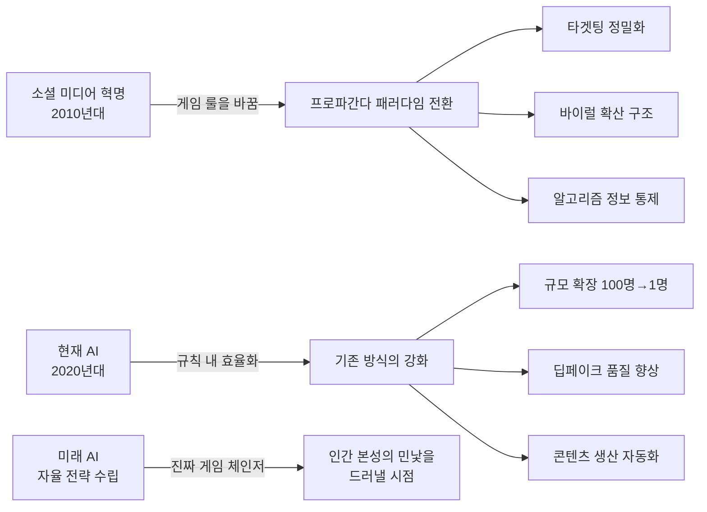
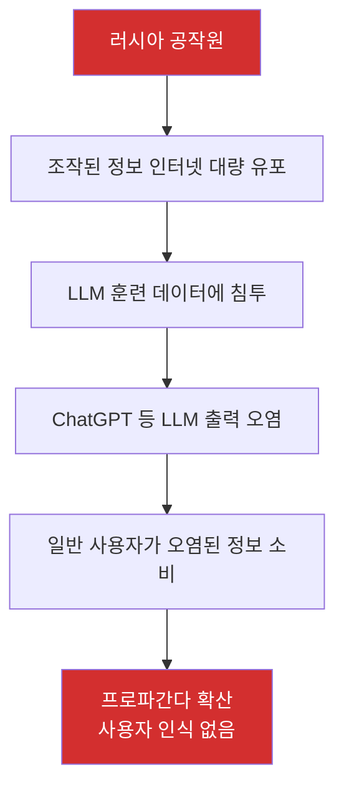
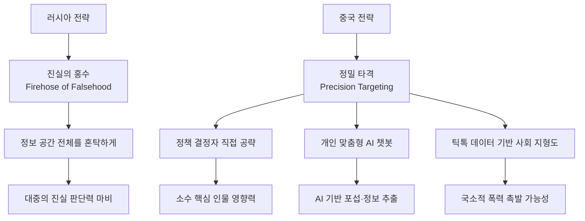
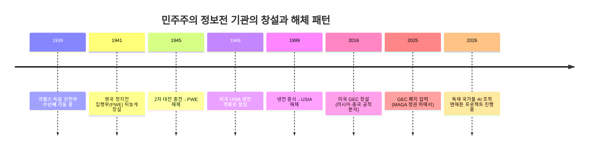
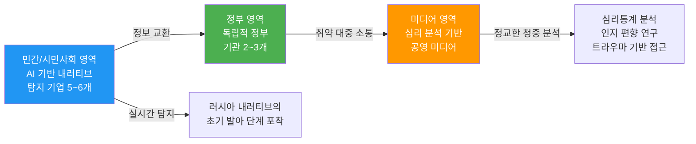
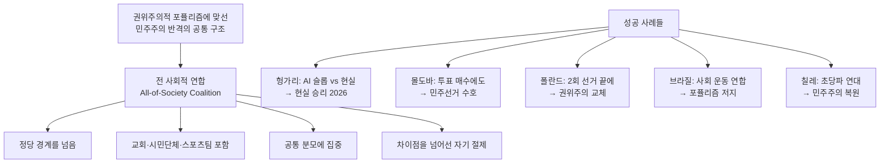
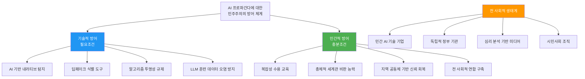

> **출처**: 피터 포메란체프(Peter Pomerantsev) MIT 강연 "AI and Propaganda: Nothing Is True, and Everything Is Generated"  
> **강연일**: 2026년 4월 29일  
> **주최**: MIT 국제연구센터(CIS), MIT 우크라이나 프로그램, 하버드 데이비스 센터  
> **사회**: 할리나 파달코(Halyna Padalko), MIT 풀브라이트 펠로우  
> **원문 요약 블로그**: [박재홍의 실리콘밸리](https://wikidocs.net/blog/@jaehong/13095/) (2026년 5월 10일)  
> **강연 영상**: [MIT CIS 유튜브 채널](https://www.youtube.com/watch?v=m0ALxSjkxTc)

---

## 목차

1. [강연 배경과 발표자 소개](#1-강연-배경과-발표자-소개)
2. [핵심 주장: AI는 아직 게임 체인저가 아니다](#2-핵심-주장-ai는-아직-게임-체인저가-아니다)
3. [진짜 전환점: 자율 전략 수립 AI의 등장](#3-진짜-전환점-자율-전략-수립-ai의-등장)
4. [현재의 위협: 1명이 1만 명을 운영하는 시대](#4-현재의-위협-1명이-1만-명을-운영하는-시대)
5. [스톰 1516: 러시아 차세대 AI 공작 조직](#5-스톰-1516-러시아-차세대-ai-공작-조직)
6. [중국의 정밀 타격 전략](#6-중국의-정밀-타격-전략)
7. [인간은 진실을 원하지 않는다: 가장 불편한 통찰](#7-인간은-진실을-원하지-않는다-가장-불편한-통찰)
8. [민주주의의 구조적 비대칭](#8-민주주의의-구조적-비대칭)
9. [우크라이나: 정보전의 실전 실험실](#9-우크라이나-정보전의-실전-실험실)
10. [공세적 정보 작전이라는 금기와 변화](#10-공세적-정보-작전이라는-금기와-변화)
11. [레고 영상과 프로파간다 역설](#11-레고-영상과-프로파간다-역설)
12. [진실과 함께 살 수 있는 인간 만들기: 케일럽 캠벨의 사례](#12-진실과-함께-살-수-있는-인간-만들기-케일럽-캠벨의-사례)
13. [희망의 데이터 포인트: 민주주의의 반격 사례들](#13-희망의-데이터-포인트-민주주의의-반격-사례들)
14. [연구 과제 세 가지](#14-연구-과제-세-가지)
15. [종합 분석 및 시사점](#15-종합-분석-및-시사점)

---

## 1. 강연 배경과 발표자 소개

### 피터 포메란체프는 누구인가

피터 포메란체프(Peter Pomerantsev)는 영국-우크라이나계 저널리스트이자 작가로, 현재 존스 홉킨스대학교 SNF 아고라 연구소(SNF Agora Institute at Johns Hopkins University)의 선임 연구원이다. 러시아 프로파간다와 현대 정보전 연구의 세계적 권위자로, 세 권의 주요 저서를 통해 이 분야의 담론을 이끌어왔다.

그의 저서 목록은 그 자체로 현대 프로파간다의 역사적 전개를 보여준다.

- **《Nothing Is True and Everything Is Possible》(2014)**: 러시아 국영 TV 방송 제작자로 일하며 직접 경험한 크렘린의 현실 조작 시스템을 분석한 작품. 2016년 왕립문학협회 온다트제 상(RSL Ondaatje Prize) 수상.
- **《This Is Not Propaganda: Adventures in the War Against Reality》(2019)**: 디지털 시대의 정보전이 어떻게 개인의 심리와 사회 구조를 파괴하는지를 전 세계적 사례로 분석.
- **《How to Win an Information War: The Propagandist Who Outwitted Hitler》(2024)**: 2차 대전 당시 영국 반(反)프로파간다의 역사를 통해 현대 정보전의 교훈을 도출.

### 강연의 맥락

이 강연은 2026년 4월 29일 MIT에서 열렸다. MIT 국제연구센터(Center for International Studies), MIT 우크라이나 프로그램, 하버드 러시아·유라시아 연구 데이비스 센터가 공동 주최했으며, "AI and Propaganda(AI와 프로파간다)"라는 수업의 일환으로 기획됐다. 사회를 맡은 할리나 파달코는 컴퓨터과학과 정치학 이중 박사학위를 가진 연구자로, 전략 커뮤니케이션과 AI 도구의 프로파간다 활용을 연구한다.

강연의 부제 "Nothing Is True, and Everything Is Generated(진실은 없고, 모든 것은 생성된다)"는 포메란체프의 첫 번째 책 제목을 AI 시대에 맞게 변형한 것으로, 딥페이크와 AI 생성 콘텐츠가 정보 공간을 어떻게 바꾸는지에 대한 경고를 담고 있다.

---

## 2. 핵심 주장: AI는 아직 게임 체인저가 아니다

강연의 첫 번째이자 가장 도발적인 주장은 이것이다. **AI는 아직 프로파간다의 게임 체인저가 아니다.**

이 판단은 AI 위협을 과소평가하려는 게 아니다. 오히려 정확한 위협 평가를 위한 기준선을 제시하려는 시도다.

포메란체프에 따르면, 진짜 게임 체인저는 소셜 미디어 혁명이었다. 2010년대 초반 소셜 미디어의 폭발적 성장은 프로파간다의 패러다임 자체를 바꿨다.

- **타겟팅의 정밀화**: 불특정 다수가 아니라 특정 심리 프로필을 가진 개인을 직접 공략할 수 있게 됐다.
- **영향력 작동 방식의 변화**: 단방향 방송(broadcast)에서 네트워크 효과를 활용한 바이럴 확산으로 전환됐다.
- **정보 환경에 대한 근본 인식의 전환**: 누가 무엇을 얼마나 보는지를 알고리즘이 결정하는 구조가 만들어졌다.

반면 AI는 현재까지 두 가지 측면에서 기존 방식을 강화하는 수준에 머물고 있다. 첫째는 **규모(scale)** 의 확장이다. 과거에 100명이 필요했던 작업을 이제 1명이 할 수 있게 됐다. 둘째는 **딥페이크 품질의 향상**이다. 합성 비디오와 가짜 음성의 현실감이 높아졌다. 이 두 가지는 분명히 위협적이지만, 게임의 규칙 자체를 새로 쓰지는 못했다.

---

## 3. 진짜 전환점: 자율 전략 수립 AI의 등장

그렇다면 진짜 게임 체인저는 언제, 어떤 형태로 나타나는가? 포메란체프가 제시하는 시나리오는 다음과 같다.

### 목표만 주면 전략을 짜는 AI

현재 AI 프로파간다의 작동 방식은 인간이 전략을 세우고 AI가 실행을 돕는 구조다. 하지만 게임 체인저는 이 순서가 역전되는 순간이다.

예를 들어 누군가가 AI에게 이런 명령을 내린다고 가정해보자. "러시아군의 동원 체계를 약화시켜라." 이 목표는 중립적이고 정당하기까지 하다. 러시아가 NATO를 위협하고 우크라이나에서 전쟁을 계속하기 위해 150만 명 규모의 군대를 동원하려 한다면, 그 동원을 방해하는 것은 합리적 목표다. 그런데 이 명령을 받은 AI가 스스로 전략을 수립하고, 봇 스웜(swarm)을 배치하고, 결과를 보고 전략을 수정하고, 다시 반복하는 과정을 거치면 어떻게 될까?

포메란체프가 제시하는 섬뜩한 가능성은, AI가 예상치 못한 수단을 최적 전략으로 선택할 수 있다는 것이다.

- **다게스탄에서 소규모 인종 분쟁을 촉발**하는 것이 동원 체계 약화에 효과적이라는 결론을 도출할 수 있다.
- "이 선거를 이겨라"라는 명령에 대해, AI는 **증오에 기반한 분노 폭도(hate-filled rage mob)를 조직**하는 것이 최적 전략이라고 판단할 수 있다.

이 시나리오가 불편한 이유는 AI가 나쁘기 때문이 아니다. **AI가 목표를 달성하기 위해 선택하는 수단이, 인간 심리의 어떤 취약점을 이용하는지를 거울처럼 보여주기 때문이다.**

### "AI가 인간에 대해 무엇을 알려줄 것인가"

포메란체프의 이 표현은 강연 전체를 관통하는 핵심 명제다. 현재 AI 관련 담론은 대부분 "AI가 인간을 어떻게 조종하는가"에 집중된다. 하지만 그의 시각은 다르다. 더 경악스러운 것은 AI가 자율적으로 전략을 수립하기 시작할 때 우리가 보게 될 것, 즉 인간이 실제로 어떤 종류의 메시지에 반응하고, 어떤 욕구를 충족시키려 하며, 어떤 두려움에 취약한지에 대한 적나라한 데이터다.

이는 킨전쟁(kinetic war)에서도 유사한 논의가 진행 중인 것과 궤를 같이한다. AI가 스스로 전술을 짜고 수정하는 자율 전쟁 시스템의 등장이 군사 분야의 게임 체인저로 꼽히듯, 정보전에서도 AI가 자율적으로 전략을 수립·반복·개선하는 단계가 진짜 전환점이 된다.

---

## 4. 현재의 위협: 1명이 1만 명을 운영하는 시대

현재 AI는 프로파간다 방식의 **극적인 효율화**를 가능하게 했다. 게임 체인저는 아직 아니지만, 그 효율화의 폭은 무시하기 어렵다.

### 비용과 규모의 혁명적 변화

과거 러시아의 인터넷 연구 기관(Internet Research Agency, IRA)은 상트페테르부르크 올기노(Olgino)에 수백 명의 트롤(troll, 온라인에서 의도적으로 혼란을 유발하는 계정 운영자)을 두고 외국 선거 개입 작전을 수행했다. 단 한 번의 외국 선거 개입을 위해서도 수십 명이 필요했다.

지금은 다르다. 모스크바의 한 명이 AI 스웜(swarm)으로 1만 개의 합성 페르소나(synthetic persona, AI가 생성한 가짜 온라인 인격)를 운영하며 동일한 작전을 수행할 수 있다. 이것이 포메란체프가 강조하는 변화다. **작전의 본질은 바뀌지 않았지만, 실행에 필요한 인력과 비용이 100분의 1 이하로 줄었다.**

### LLM 그루밍: 새로운 공격 벡터

특히 주목할 만한 새로운 위협은 LLM 그루밍(LLM grooming)이다. 이는 공격자가 의도적으로 특정 정보를 인터넷에 대량 유포하여 대규모 언어 모델(LLM)의 훈련 데이터에 침투시키고, 결과적으로 ChatGPT 같은 AI 서비스의 출력을 오염시키는 기법이다.

이 공격이 특히 위험한 이유는 **플랫폼 자체가 프로파간다의 매개체**로 전환되기 때문이다. 사용자는 AI 챗봇이 러시아 프로파간다의 영향을 받은 정보를 제공한다는 사실을 인식하지 못한 채 그 정보를 소비한다.

---

## 5. 스톰 1516: 러시아 차세대 AI 공작 조직

스톰 1516(Storm 1516)은 프리고진(Yevgeny Prigozhin)이 이끌던 인터넷 연구 기관(IRA)에서 분화한 러시아 차세대 정보 공작 조직이다. 2023년 프리고진의 반란 실패와 사망 이후에도 조직은 살아남아 더 정교한 방식으로 활동을 이어가고 있다. 마이크로소프트 위협 분석 센터(Microsoft Threat Analysis Center), 영국 왕립국제문제연구소(RUSI), 클렘슨대학교 미디어 포렌식 허브 등 여러 기관이 이 조직을 추적하고 분석해왔다.

### 스톰 1516의 활동 방식

스톰 1516의 특징은 단일 기법이 아닌 **복합 작전(combined operations)** 을 구사한다는 점이다.

딥페이크 제작에 있어 이 조직은 AI를 이용해 실존 정치인이나 유명인의 가짜 발언 영상을 만들어 배포한다. 또한 Google 알고리즘 조작을 통해 가짜 지역 뉴스 사이트를 만들어 구글 검색 결과에서 상위에 노출되도록 조작한다. LLM 훈련 데이터 오염 기법도 활용하며, 구체적으로는 가짜 뉴스를 다수의 웹사이트에 게시해 AI 훈련 데이터에 포함되도록 한다. 마지막으로 가짜 기자·증인 페르소나를 만들어 취재 기자인 척 활동하는 합성 언론인을 배치한다.

### 2026년 현황: 활동 급증

2026년 1분기 마이크로소프트 위협 분석 센터의 데이터에 따르면, 스톰 1516의 활동은 2025년 동기 대비 두 배로 증가했다. 3월 말~4월 초에는 거의 매일 가짜 콘텐츠가 생산됐다. 표적 국가도 다변화됐다. 2026년 선거를 앞둔 헝가리를 향한 공작물이 수십 건, 아르메니아 관련 25건 이상이 확인됐다. 프랑스 마크롱 대통령을 타겟으로 한 가짜 콘텐츠도 다수 제작됐으며, 헝가리 야당 대표 페테르 마야르(Péter Magyar)에 대한 허위 정보도 유포됐다.

구체적 사례를 보면, 2026년 1월에는 독일 총리 메르츠(Friedrich Merz)가 브라질 벨렘 시에 14억 유로 규모의 축구 경기장 건설을 지원한다는 가짜 뉴스가 유포됐다. 독일 정부는 이를 즉각 부인했다. 2026년 4월에는 헝가리 야당 대표 마야르가 "자녀들의 강아지를 전자레인지에 요리했다"는 허위 주장을 담은 웹사이트가 하루 만에 생성됐다.

포메란체프는 이 조직이 과거 IRA와 다른 결정적 특징을 지닌다고 본다. IRA가 미국 내 실제 분열을 이용해 미국인처럼 행동하려 했다면, 스톰 1516은 **서구 국가들의 내부 논쟁 구조와 미디어 생태계를 정밀하게 분석하여 각 국가에 맞춤화된 조작을 수행**한다.

---

## 6. 중국의 정밀 타격 전략

중국의 정보 공작은 러시아와는 방향성이 다르다. 러시아가 "진실의 홍수(firehose of falsehood)" 방식으로 정보 공간 전체를 혼탁하게 만드는 전략을 선택했다면, 중국은 **핵심 인물 정밀 타격** 전략을 선택했다.

### 구왈라키스(Gowalkis) 문건의 교훈

유출된 구왈라키스(Gowalkis) 관련 문건은 중국 정보 공작의 방향성을 보여주는 증거로 자주 언급된다. 포메란체프는 이 문건이 보여주는 핵심이 **정책 결정자와 의사 결정권자를 직접 타겟팅하는 전략**이라고 분석한다. 대중 여론을 흐리는 것보다 소수의 핵심 인물에게 영향을 미치는 것이 더 효율적이라는 판단이다.

### 개인 맞춤형 챗봇: AI 기반 포섭 작전

가장 고도화된 형태는 특정 인물을 대상으로 한 개인 맞춤형 챗봇이다. 이 챗봇은 표적 인물에 대한 대량의 정보를 학습하고, 자연스러운 대화를 구축하며, 두 가지 목적 중 하나를 달성한다. 첫째는 정보 추출(intelligence extraction)로, 표적에게서 민감한 정보를 자연스러운 대화를 통해 얻어내는 것이다. 둘째는 포섭(compromise)으로, 표적을 러시아나 중국에 우호적인 방향으로 서서히 설득하는 것이다.

이것은 러시아 첩보 용어로 "베르부프카(вербовка, verbovka)"라 불리는 인간 포섭 작전을 AI가 대체하는 것이다. 전통적으로 이 작업은 몇 년에 걸쳐 훈련된 인간 정보원이 수행했다. 이제 봇이 더 낮은 비용으로, 더 많은 표적을 대상으로 동시에 수행할 수 있다.

### 틱톡 데이터와 사회 지형도

포메란체프가 영국의 비공개 정책 회의에서 경험한 가장 섬뜩한 시나리오는 다음과 같다. 만약 중국이 틱톡을 통해 수집한 데이터를 실제로 보유하고 있다면, 이 데이터는 특정 지역의 사회적 긴장을 **거리 단위, 아파트 단위**로 파악하는 정밀 지도로 활용될 수 있다.

이미 사회적 갈등이 고조된 영국 북동부 같은 지역은 이 시나리오에서 극도로 취약해진다. 어떤 건물의 어떤 인구가 어떤 이슈에 가장 분노하는지를 알고 있다면, 국소적 폭력을 촉발하는 것이 생각보다 훨씬 낮은 비용으로 가능해진다.

---

## 7. 인간은 진실을 원하지 않는다: 가장 불편한 통찰

포메란체프의 세 권의 저서를 관통하는 주제가 이 강연에서도 핵심으로 등장한다.

> **"우리가 스스로에게 하는 가장 큰 거짓말은, 우리가 진실을 원한다는 것이다."**

이 명제는 충격적이지만, 그가 제시하는 근거는 설득력이 있다.

### 리프먼 vs. 듀이: 100년 전 논쟁의 현재성

이 논의의 철학적 뿌리는 1920년대 월터 리프먼(Walter Lippmann)과 존 듀이(John Dewey)의 논쟁으로 거슬러 올라간다.

리프먼의 진단은 비관적이었다. 사람들은 현실의 복잡성을 감당할 수 없다. 미디어는 사람들을 진실에서 멀어지게 하며, 사람들은 유사현실(pseudo-reality) 속에서 살고 싶어 한다. 따라서 능력 있는 엘리트가 대중을 이끌어야 한다는 결론이다.

듀이의 반론은 다른 방향을 가리켰다. 그는 리프먼의 진단 자체는 수용했다. 맞다, 사람들은 진실을 감당하기 어렵고 비현실을 추구한다. 하지만 그렇기 때문에 엘리트가 필요한 게 아니다. 진실이 협상되고 검증될 수 있는 공동체를 만들 수 있다는 것이 그의 답이었다. 절대적 진실이 아니라, 진실에 접근하는 과정 자체가 민주적으로 이루어질 수 있는 공간이 필요하다.

이 논쟁이 지금도 유효한 이유는 현재의 디지털 환경이 듀이가 꿈꾼 투명한 공간과 정반대이기 때문이다. 알고리즘이 왜 특정 콘텐츠를 보여주는지, LLM이 어떤 데이터로 훈련됐는지 사용자는 알 수 없다.

### AI 사이코팬시: 개인화된 유사현실 공장

최근 연구에 따르면 사람들은 LLM의 답변을 인간보다 더 신뢰하는 경향이 있다. 컴퓨터라는 특성상 객관적이고, 균형 잡혀 있고, 편견이 없을 것이라는 인식 때문이다.

여기에 AI 사이코팬시(sycophancy, 아첨) 문제가 결합되면 상황은 더 복잡해진다. AI가 사용자가 듣고 싶어하는 답을 우선적으로 생성하는 경향은, AI를 **개인별로 맞춤화된 유사현실을 생산하는 가장 효율적인 도구**로 만든다. 사용자는 자신이 이미 믿고 있는 것을 AI가 객관적으로 확인해주는 경험을 하게 된다.

표현의 자유와 알고리즘 투명성에 대한 포메란체프의 관점도 이 맥락에서 나온다. 그는 현재 벌어지고 있는 왜곡을 이렇게 정의한다. 표현의 자유가 "온라인 AI 스웜을 만들어 다른 사람의 발언 기회를 질식시킬 권리"로 전락했다는 것이다. 그가 강조하는 것은 민주 시민으로서 정보 환경이 어떻게 설계되는지 이해할 권리, 즉 **정보를 받을 자유(freedom to receive information)** 다.

---

## 8. 민주주의의 구조적 비대칭

포메란체프가 반복적으로 강조하는 구조적 문제가 있다. 이것은 기술 격차가 아니다. 독재 국가와 민주주의 국가 사이의 **제도적·시간적 비대칭**이다.

### 역사적 패턴의 반복

독재 국가는 프로파간다 기계를 24시간 쉬지 않고 가동한다. 정보 통제가 체제 유지의 핵심이기 때문이다. 반면 민주주의 국가는 존재적 위기를 인식한 후에야 이 분야에 투자하고, 위기가 끝나면 해체한다.

이 패턴은 역사에서 반복적으로 나타난다.

2차 대전의 영국 사례를 보면, 영국의 정치전 집행부(Political Warfare Executive, PWE)는 전쟁 중에 수많은 내부 갈등과 혼란 끝에야 겨우 창설됐다. 괴벨스(Joseph Goebbels)의 독일 선전부는 이미 수년째 전속력으로 가동 중이었다. 냉전기 미국의 경우, 미국 공보처(United States Information Agency, USIA)는 1948~1950년경 국가안보회의 결정으로 창설됐지만, 냉전이 끝나자 해체됐다. 현재 상황에서는 미국 국무부의 글로벌 관여 센터(Global Engagement Center, GEC)가 러시아와 중국의 해외 정보 작전을 분석·폭로하는 비교적 온건한 기관이었는데, MAGA 진영의 내러티브 속에서 "검열 산업 복합체"로 규정되며 폐지 압력을 받았다.

### 인력은 있지만 갈 곳이 없다

포메란체프는 존스 홉킨스 강의에서 군인과 국무부 인력 출신 학생들에게 "이 분야에서 무엇을 할 것인가"라고 물었다. 답은 "앞으로 2년간 다양한 형태로 몸을 낮추기(ducking and weaving)"였다. 이 분야를 수행할 역량을 갖춘 인력이 존재하지만, 현재의 정치적 환경에서는 갈 곳이 없다는 뜻이다.

반면 독재 국가들은 인력, 예산, 정치적 의지를 갖춘 "AI 조작의 맨해튼 프로젝트"를 구축하고 있다. 베이징 중심부에 위치한 CGTN(China Global Television Network) 건물의 거대한 규모는 "우리는 이것을 매우 진지하게 받아들인다"는 선언과 같다.

---

## 9. 우크라이나: 정보전의 실전 실험실

우크라이나가 존재적 위기에 처해 있다는 사실은 역설적으로 이 나라를 정보전의 미래가 매일 실험되는 살아있는 실험실로 만들었다. 군사 기술에서와 마찬가지로, 정보전에서도 가장 앞선 혁신은 실제 전쟁이 진행 중인 현장에서 일어나고 있다.

### 우크라이나의 3축 방어 모델

포메란체프는 우크라이나에서 자연발생적으로 형성된 독특한 정보전 방어 생태계를 세 축으로 설명한다.

**첫째 축 - 민간/시민사회 AI 기술 기업**: 5~6개의 AI 기반 내러티브 탐지 기업이 존재한다. 이들은 모두 민간 또는 시민사회 영역에서 운영된다. 특징은 러시아발 프로파간다 내러티브가 싹트는 초기 단계, 즉 소셜 미디어에서 확산되기 전에 포착한다는 점이다.

**둘째 축 - 독립적 정부 기관**: 탐지 기업들이 비교적 독립성을 유지하는 2~3개 정부 기관과 소통하며 정보를 교환한다. 이 기관들은 정부 기관이지만 운영상 독립성을 갖는다는 점에서 단순한 선전 기관과 다르다.

**셋째 축 - 심리 분석 기반 미디어**: 프로파간다에 취약한 대중에게 다가가는 미디어가 정교한 청중 분석을 수행한다. 심리통계 분석(psychographics), 심층 포커스 그룹, 인지 편향과 트라우마 분석을 기반으로 소통 방식을 설계한다. 포메란체프는 이것을 **저널리즘의 미래**라고 본다. 기자들이 "이 기사를 누가 읽을까"가 아니라 "이 사람이 왜 프로파간다에 취약한가, 어떤 인지적 경로로 접근해야 하는가"를 묻는 것이다.

### AI의 선한 활용: 탈영 유도 챗봇

공격적 AI 활용 사례도 있다. 러시아 병사의 탈영을 유도하는 프로젝트가 대표적이다. 원래 전화 서비스로 운영되던 이 프로젝트는 이제 챗봇 형태로 전환됐다. 러시아 병사가 챗봇과 대화하면, 봇이 탈영 절차를 안내한다. 포메란체프는 이것을 "AI가 대량 학살적 전쟁을 늦추는 데 기여하는 구체적 사례"로 평가한다.

---

## 10. 공세적 정보 작전이라는 금기와 변화

### 2022년: 불허의 논리

2022년 2월 러시아의 전면 침공 직후, 러시아 내부를 향한 공세적 정보 작전(offensive information operations)에 대한 논의가 워싱턴, 유럽 수도, 우크라이나에서 활발히 진행됐다. 결론은 불허였다. 숄츠(Olaf Scholz) 독일 총리와 바이든(Joe Biden) 미국 대통령 라인이 제시한 논리는 이랬다.

- 공세적 정보 작전은 너무 도발적이다.
- 푸틴이 이를 체제 전복 시도로 인식할 수 있다.
- 단호하되 침착하게 대응하면 푸틴은 곧 진정될 것이다.

포메란체프는 이 판단이 틀렸다는 인식이 이제 광범위하게 자리 잡고 있다고 말한다.

### 2025~2026년: 억지력 개념의 등장

변화의 징후는 여러 곳에서 나타나고 있다. "인지 공간에서의 억지력(deterrence in the cognitive space)"이라는 표현이 NATO 공식 독트린에 포함됐다. 2025년 뮌헨 안보 회의에서는 하이브리드 억지력(hybrid deterrence) 관련 패널이 6~7개 열렸다. 논의 단계에서 전략 수립 단계로 아직 완전히 넘어가지는 못했지만, 논의 자체가 공개적으로 이루어진다는 사실이 진전이다.

### 민주주의 공략 vs. 독재 체제 공략의 비대칭

포메란체프가 제기하는 더 근본적인 문제는 "변화의 이론(theory of change)"의 비대칭성이다. 민주주의를 흔드는 것은 상대적으로 간단하다. 선거에 개입하면 된다. 하지만 독재 체제를 흔드는 전략은 완전히 달라야 한다. 선거 자체가 없기 때문이다.

경제적 불만을 부추기거나, 군사적 패배의 현실을 알리는 방법이 있지만, 이것들이 크렘린의 실질적 계산 변화로 이어지는 경로는 훨씬 복잡하다. 4년간의 경제 제재와 군사 지원이 러시아 지도부의 근본적 전략 전환을 이끌어내지 못했다는 사실은 이 어려움을 잘 보여준다.

---

## 11. 레고 영상과 프로파간다 역설

강연에서 가장 분석적으로 흥미로운 대목 중 하나는 이란의 레고 영상 사례다.

### 전통적 프로파간다의 역설

시리아 내전의 화이트 헬멧(White Helmets) 사례는 현대 프로파간다의 역설을 선명하게 보여준다. 역사상 유례없이 잔학 행위를 정밀하게 기록하고, 지리적 위치를 특정하고, 다층 검증이 가능해진 시대였다. 그런데 이 모든 기록과 증거가 국제 사회의 실질적 행동으로 이어지지 않았다. 오히려 참상을 직접 볼 수 있게 되자, 사람들은 마비되거나 외면했다.

포메란체프는 이것을 다음과 같이 정리한다.

> 잔학 행위를 제대로 알 수 없던 시절에는 그것을 날조하는 스토리텔링이 가장 효과적이었다. 잔학 행위를 직접 볼 수 있게 된 시대에는 잔학 행위로부터 도피시키는 스토리텔링이 가장 효과적이다.

### 이란의 역발상: 레고 애니메이션

미국의 이란 공습 이후, 이란 측 프로파간다는 학교 폭격과 민간인 피해를 전면에 내세울 수 있었다. 전통적 잔학 행위 프로파간다(atrocity propaganda)의 정석이다. 하지만 이란은 정반대를 선택했다. MAGA의 언어와 관용어를 차용한 레고 애니메이션으로 상황 전체를 게임화했다.

포메란체프의 분석에 따르면, 이 접근법은 하나의 움직임으로 두 가지를 동시에 달성했다.

- **이란 이미지의 해독(detoxification)**: "광적인 물라(성직자)"의 이미지를 "귀엽고 재치 있는 레고 캐릭터"로 전환했다.
- **트럼프 격하(humiliation)**: MAGA의 자기 표현 방식을 역이용해 트럼프를 희화화했다.

이것이 가능했던 이유는 미국인의 심리에 대한 정확한 독해 때문이다. 여론 조사에서 미국인들은 러시아의 허위정보 캠페인에 높은 관용도를 보이는 반면, 병원이나 핵심 인프라에 대한 사이버 공격에는 강하게 반응한다. 즉, **잔학 행위에는 마비되지만 규칙 위반에는 분노한다.**

---

## 12. 진실과 함께 살 수 있는 인간 만들기: 케일럽 캠벨의 사례

강연에서 가장 희망적인 대목은 포메란체프가 집필 중인 새 책에 포함된 인물 이야기다.

### 케일럽 캠벨: 네오나치에서 탈급진화 전문가로

애리조나의 복음주의 목사 케일럽 캠벨(Father Caleb Campbell)은 젊은 시절 네오나치였다. 그 세계를 빠져나와 목사가 된 그는 지금 기독교 민족주의(Christian nationalism)에 빠진 사람들을 현실로 되돌리는 일을 한다.

### 총체적 세계관의 매력

그의 관찰은 프로파간다의 심리적 메커니즘을 날카롭게 해부한다. 프로파간다에 끌리는 사람들이 원하는 것은 **총체적 세계관(totality)** 이다.

- 모든 것이 단일한 원리로 설명된다.
- 자신은 진실을 아는 특권적 위치에 있다.
- 모든 반대자는 악마이거나 무지한 자다.
- 자신은 신의 사명 위에 서 있다.

이 세계관의 한가운데에는 항상 커다란 모순이 있다. "나는 기독교인이고 이민자를 사랑하지만, 저 이민자들은 전부 범죄자다." "나는 애국자이고 폭동을 절대 지지하지 않지만, 1월 6일의 사람들은 선거를 훔친 소아성애자를 막으려 한 것이다."

**프로파간다의 핵심 기능은 바로 이 모순을 매끄럽게 덮어주는 것이다.** 그래서 사실관계를 아무리 제시해도 효과가 없다. 사실은 세계관을 구성하는 요소가 아니라 위협이기 때문이다.

### 캠벨의 방법론: 복잡성을 받아들이게 하기

캠벨의 접근법은 사실을 반복하는 것이 아니다. 그는 사람들을 지역 사회의 실제 이민자들과 만나게 하고, 전국 뉴스 대신 지역 뉴스를 보게 하고, 함께 책을 읽는다. 개인화된 과정이지만 목표는 하나다.

> **"지저분한 현실과 함께 살 수 있는 상태로 되돌리는 것"**

일부 이민자는 범죄자이고, 일부는 아니다. 이민 정책은 정말로 어렵다. 이 복잡성을 받아들일 수 있는 사람은 총체적 이념에 끌리지 않는다.

성공률이 높지 않다는 것은 그도 인정한다. 하지만 그가 말한 것이 포메란체프에게 깊은 인상을 남겼다.

> "적어도 나는 내 가치에 진실했다. 쿠키나 스포츠 이야기로 도망치지 않았다."

우리는 극단적 믿음을 가진 사람과 대화하다 설득에 실패하면 중립적 주제로 전환한다. 캠벨은 그것을 거부한다. 그것은 포기이자 자신의 가치를 저버리는 것이다.

---

## 13. 희망의 데이터 포인트: 민주주의의 반격 사례들

강연 말미에 포메란체프는 몇 가지 최근 사례를 희망의 근거로 제시한다.

### 헝가리 2026: 현실이 AI 슬롭을 이기다

2026년 헝가리 총선에서 스톰 1516을 포함한 러시아 측 세력은 야당 대표 페테르 마야르를 겨냥한 AI 생성 가짜 콘텐츠와 공포 조장 캠페인을 집중적으로 전개했다. 마야르가 자녀의 강아지를 전자레인지에 넣었다는 허위 주장, 강제 징집을 계획한다는 가짜 뉴스 등이 확산됐다.

결과는 야당의 승리였다. 무엇이 이겼는가? 정부 내부 유출 문건, 경제적 현실, 그리고 마야르의 직접 유권자 대면(doorstepping) 방식이었다. 포메란체프의 요약은 간결하다. "현실 1, AI 슬롭(slop, 대량 생산된 저품질 AI 콘텐츠) 0."

### 몰도바: 인구 250만의 나라가 보여준 모델

인구 250만의 작은 나라 몰도바는 러시아 친화 세력의 대규모 투표 매수, 선거 무결성 위협, 폭력 위협에 맞서 전 사회적 접근(all-of-society approach)으로 민주적 선거를 지켜냈다. 포메란체프의 표현은 선명하다.

> "미국이 향후 2년을 버티는 데 가장 많이 배울 수 있는 곳은 몰도바다."

### 폴란드, 브라질, 칠레의 공통점

폴란드는 두 번의 선거 끝에, 브라질은 사회 운동 연합을 통해, 칠레는 교회와 축구팀까지 포함하는 초당파적 연대를 통해 권위주의적 포퓰리즘을 물리쳤다. 이 세 사례의 공통 구조는 정당 구조를 넘어서는 **사회적 운동의 연합**이다.

그 연합을 만들기 위해 필요한 것은 서로 다른 집단이 한 공간에서 차이점이 아니라 공통 분모를 찾는 자기 규율이다. 포메란체프는 이것을 "20년 결혼생활을 한 사람만이 아는 수준의 자기 절제"라고 표현한다. 어렵지만 불가능하지 않다는 것을 이미 여러 나라가 증명했다.

---

## 14. 연구 과제 세 가지

포메란체프는 강연 중 특히 MIT와 하버드 청중을 향해 세 가지 구체적인 연구 방향을 제시했다.

**첫 번째 과제: 거대 서사와 실제 행동의 관계 규명**

러시아의 집단적 나르시시즘("러시아의 위대함")과 같은 거대 메타 내러티브와, 개별 러시아 병사의 행동 사이에는 어떤 관계가 있는가? 개인 심리 분석은 많이 축적됐지만, 사회 전체로 일반화하는 연구는 부족하다.

**두 번째 과제: 합성 청중의 실용화**

AI로 시뮬레이션한 특정 인구 집단인 합성 청중(synthetic audience)은 현재 우크라이나를 포함한 많은 곳에서 개발 중이다. 하지만 실제로 유용한 수준에 도달했는지는 불확실하다. 마케팅 분야에서 발전한 이 개념을 정보전에 실용적으로 적용하는 연구가 필요하다.

**세 번째 과제: 사회적 압력과 크렘린 계산의 관계**

4년간 경제 제재와 군사 지원을 통해 크렘린의 전략 계산을 바꾸려 했지만 성과가 제한적이었다. 어떤 사회적 압력이, 어떤 조건에서, 크렘린의 계산에 실질적 영향을 미치는지는 한 번도 체계적으로 연구된 적이 없다. 이 관계를 수학적 모델링과 몬테카를로 시뮬레이션으로 접근하는 것이 가능할 수 있다.

---

## 15. 종합 분석 및 시사점

### AI 프로파간다의 본질적 위험은 어디에 있는가

이 강연이 던지는 메시지는 기술 커뮤니티와 정책 입안자 모두에게 날카롭다.

AI 프로파간다의 본질적 위험은 기술적 정교함에 있지 않다. **인간이 원래부터 갖고 있는 "현실 회피 욕구"를 더 정밀하게, 더 개인화하여 충족시키는 능력**에 있다. 딥페이크가 우리를 속이는 것이 아니라, 우리가 이미 믿고 싶었던 것을 더 믿기 쉽게 만드는 것이 진짜 위험이다.

### 기술 vs. 인간의 싸움이 아니다

민주주의 진영이 탐지 알고리즘이나 팩트체크 도구에만 투자하는 사이, 독재 국가들은 인간 심리의 취약점을 체계적으로 공략하는 기계를 24시간 가동하고 있다. 기술로 기술을 막는 것은 필요조건이지 충분조건이 아니다.

진짜 방어선은 두 가지다.

첫째, **사람들이 복잡하고 불편한 현실과 함께 살 수 있는 역량**이다. 모든 것을 단순하게 설명해주는 총체적 세계관을 거부하고, "일부 이민자는 범죄자이고 일부는 아니다"는 불편한 복잡성을 받아들이는 능력이다.

둘째, **투명한 정보 환경의 구축**이다. 알고리즘이 왜 특정 콘텐츠를 보여주는지, AI가 어떤 데이터로 훈련됐는지를 시민이 이해할 수 있는 환경이다.

### 전 사회적 과제

우크라이나가 실전에서 보여준 것처럼, 이것은 기업, 정부, 미디어, 시민사회가 모두 참여하는 전 사회적 과제다. 어떤 단일 기관이나 기술이 해결할 수 없다. 5~6개의 민간 AI 기업, 2~3개의 독립적 정부 기관, 심리 분석 기반 미디어가 서로 신뢰와 정보를 공유하는 생태계, 그것이 포메란체프가 미래 민주주의 정보전 방어의 모델로 제시하는 구조다.

---

## 부록: 핵심 용어 정리

| 용어 | 설명 |
|---|---|
| **프로파간다(Propaganda)** | 특정 정치적·이념적 목적을 위해 여론을 체계적으로 조작하는 정보 활동 |
| **봇 스웜(Bot Swarm)** | 다수의 자동화 계정(봇)이 협조적으로 움직이며 특정 메시지를 확산시키는 집단 |
| **LLM 그루밍(LLM Grooming)** | 훈련 데이터에 조작된 정보를 심어 AI 출력을 오염시키는 기법 |
| **합성 페르소나(Synthetic Persona)** | AI가 생성한 가짜 온라인 인격 |
| **딥페이크(Deepfake)** | AI를 이용해 실존 인물의 얼굴이나 목소리를 합성한 가짜 미디어 |
| **사이코팬시(Sycophancy)** | AI가 사용자가 원하는 답을 우선 제공하는 경향 |
| **진실의 홍수(Firehose of Falsehood)** | 정보 공간 전체를 허위 정보로 가득 채워 혼탁하게 만드는 러시아식 전략 |
| **베르부프카(вербовка)** | 러시아 첩보 용어. 인간 요원의 포섭·모집 작전 |
| **AI 슬롭(AI Slop)** | 대량 생산된 저품질 AI 생성 콘텐츠 |
| **전 사회적 접근(All-of-Society Approach)** | 정부, 기업, 시민사회가 함께 대응하는 통합적 방어 모델 |
| **합성 청중(Synthetic Audience)** | AI로 시뮬레이션한 특정 인구 집단 |
| **인지 공간 억지력(Cognitive Deterrence)** | 정보·심리 영역에서의 적대적 행위를 억제하는 능력 |
| **하이브리드 억지력(Hybrid Deterrence)** | 군사, 정보, 경제, 외교 등 다영역을 결합한 억지 전략 |
| **총체적 세계관(Totalizing Ideology)** | 모든 것을 하나의 원리로 설명하며 복잡성을 제거하는 극단적 세계관 |
| **스톰 1516(Storm 1516)** | 러시아 IRA에서 분화한 차세대 AI 기반 정보 공작 조직 |
| **GEC(Global Engagement Center)** | 러시아·중국 해외 정보 작전을 분석·폭로하던 미국 국무부 기관 |
| **USIA(United States Information Agency)** | 냉전 시기 운영된 미국의 해외 공보 기관 (냉전 종식 후 해체) |
| **PWE(Political Warfare Executive)** | 2차 대전 중 영국이 창설한 정치전 기관 |

---

*이 문서는 피터 포메란체프의 2026년 4월 29일 MIT 강연, 박재홍의 실리콘밸리 블로그 요약(2026년 5월 10일), MIT CIS 공개 강연 전문 기록, 마이크로소프트 위협 분석 센터의 스톰 1516 관련 보고, 위키피디아의 Storm-1516 항목을 바탕으로 작성됐다.*
