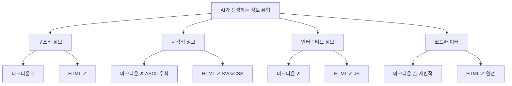
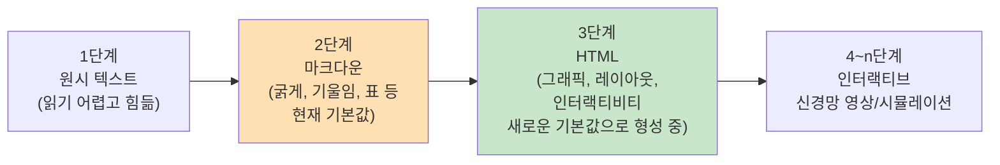
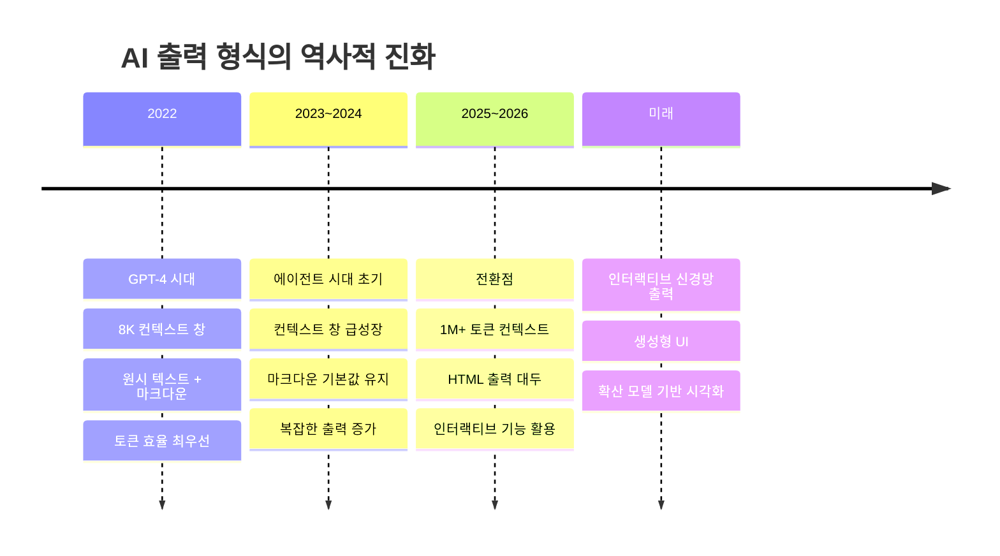

> **작성 기준일**: 2026년 5월 13일  
> **원문 출처**: Thariq Shihipar ([@trq212](https://x.com/trq212/status/2052809885763747935)), X(트위터), 2026년 5월  
> **관련 반응**: Andrej Karpathy ([@karpathy](https://x.com/karpathy/status/2053872850101285137)), 아이 아이노트 ([@AYi_AInotes](https://x.com/AYi_AInotes/status/2053911048877707443))  
> **커뮤니티 논의**: Hacker News, Simon Willison's Weblog 등

---

## 목차

1. [사건의 발단: Thariq의 글이 불을 붙이다](#1-사건의-발단)
2. [마크다운의 한계: 왜 지금 문제가 되는가](#2-마크다운의-한계)
3. [HTML이 더 우월한 이유: 정보 밀도의 차이](#3-html이-더-우월한-이유)
4. [Andrej Karpathy의 가세: AI 출력의 진화 경로](#4-andrej-karpathy의-가세)
5. [중국 커뮤니티의 반응: 인간-기계 인터페이스의 재해석](#5-중국-커뮤니티의-반응)
6. [실제 활용 사례와 프롬프트 예시](#6-실제-활용-사례와-프롬프트-예시)
7. [반론과 비판: 균형 잡힌 시각](#7-반론과-비판)
8. [커뮤니티의 반향: Hacker News와 Simon Willison](#8-커뮤니티의-반향)
9. [AI 출력 형식의 진화 경로](#9-ai-출력-형식의-진화-경로)
10. [결론: 지금 당장 시작할 수 있는 것](#10-결론)

---

## 1. 사건의 발단

2026년 5월, Anthropic에서 Claude Code 엔지니어링 팀을 이끌고 있는 Thariq Shihipar가 X(구 트위터)에 한 편의 글을 올렸다. 제목은 *"Using Claude Code: The Unreasonable Effectiveness of HTML"*, 즉 "HTML의 비합리적인 효과성"이었다. 이 글은 게재 후 16시간 만에 440만 뷰, 8,200개의 좋아요, 15,700개의 북마크를 기록하며 개발자 커뮤니티 전반에 거대한 파장을 일으켰다.

이 글의 주장은 단순하면서도 도발적이었다. "마크다운(Markdown)은 AI 에이전트 시대의 출력 형식으로는 더 이상 충분하지 않다. HTML이 그 자리를 대체해야 한다."

Thariq는 외부의 에반젤리스트가 아니라 Claude Code를 직접 만들고 매일 사용하는 Anthropic 내부 엔지니어다. 그는 이 주장을 이론으로 제시한 것이 아니라, 본인과 Claude Code 팀이 이미 사내에서 기획서, 코드 리뷰, 디자인 시스템, 보고서 등의 기본 형식을 HTML로 전환했다고 밝혔다. 그리고 그 결과물들을 공개 웹사이트(`thariqs.github.io/html-effectiveness`)에 20개 이상의 실제 예시 파일로 공개했다.

---

## 2. 마크다운의 한계: 왜 지금 문제가 되는가

마크다운은 2004년 John Gruber가 만든 경량 텍스트 형식 언어다. 간단한 기호로 헤더, 굵게, 기울임, 목록 등을 표현할 수 있어 GPT-4 시대부터 AI의 기본 출력 형식으로 자리 잡았다. 당시에는 컨텍스트 창이 8,192 토큰에 불과했기 때문에 토큰 효율이 높은 마크다운이 합리적인 선택이었다.

그러나 Thariq는 세 가지 근본적인 문제를 지적한다.

### 2.1 가독성의 한계

실무에서 100줄을 넘는 마크다운 파일은 사실상 읽히지 않는다. 개발자 본인도 끝까지 읽기 어려운데, 조직의 다른 구성원에게 읽히는 것은 더욱 어렵다. AI 에이전트의 능력이 강해질수록 생성하는 기획서와 계획의 분량도 늘어나는데, 마크다운은 이 분량을 소화하기에 구조적으로 취약하다.

### 2.2 표현력의 부재

마크다운은 구조적 정보(헤더, 목록, 표)를 넘어서는 표현이 불가능하다. 흐름도, 색상을 사용한 시각화, 인터랙티브한 요소, 공간적 배치 등은 마크다운의 범위 밖에 있다. 이 때문에 AI 모델은 종종 ASCII 아트로 다이어그램을 그리거나, 유니코드 문자로 색상을 흉내 내는 등 비효율적인 우회 방법을 택하게 된다.

### 2.3 공유의 어려움

마크다운 파일은 대부분의 브라우저에서 네이티브로 렌더링되지 않는다. 이메일 첨부나 별도 뷰어가 필요하기 때문에, 기획서나 PR 리뷰를 동료에게 전달할 때 마크다운은 실질적인 장벽이 된다. 반면 HTML 파일은 S3 등에 업로드하면 링크 하나로 누구나 어디서든 열 수 있다.

### 2.4 맥락 변화: 더 이상 직접 편집하지 않는다

과거에는 마크다운의 가장 큰 장점이 "사람이 직접 편집하기 쉽다"는 점이었다. 그러나 현재의 워크플로우에서는 이 파일들을 주로 사양서(spec), 참조 문서, 브레인스토밍 결과물로 사용한다. 편집이 필요할 때는 Claude에게 프롬프트로 수정을 지시하는 경우가 대부분이다. 이 변화는 마크다운의 핵심 장점 하나를 사실상 무효화한다.

---

## 3. HTML이 더 우월한 이유: 정보 밀도의 차이

Thariq가 주장하는 HTML의 강점은 단순히 "더 예쁘다"는 수준이 아니다. HTML은 Claude가 읽고 처리할 수 있는 거의 모든 유형의 정보를 표현할 수 있는 범용적 형식이다.

HTML이 표현할 수 있는 정보의 유형을 정리하면 다음과 같다.

| 정보 유형 | HTML에서의 구현 방법 |
|---|---|
| 문서 구조 | 헤더, 단락, 서식 |
| 표 형식 데이터 | `<table>` 태그 |
| 디자인 데이터 | CSS |
| 일러스트레이션 | SVG 인라인 벡터 그래픽 |
| 코드 예시 | `<script>` 태그 및 코드 블록 |
| 인터랙션 | JavaScript + CSS |
| 워크플로우 | SVG + HTML 혼합 |
| 공간적 데이터 | 절대 위치, 캔버스 |
| 외부 리소스 | `` 태그 |

이 범위는 AI가 처리하거나 전달할 수 있는 거의 모든 정보 유형을 커버한다. 즉, HTML은 정보 표현의 상한선이 사실상 없는 형식이다.



---

## 4. Andrej Karpathy의 가세: AI 출력의 진화 경로

Thariq의 글이 확산되자 전 Tesla AI 총괄이자 OpenAI 공동 창업자인 Andrej Karpathy가 이 논의에 직접 가세했다. Karpathy는 단순히 Thariq의 주장에 동의하는 데 그치지 않고, 훨씬 넓은 맥락에서 AI 출력 형식의 진화 경로를 제시했다.

그의 핵심 주장은 인간의 입출력 비대칭에서 출발한다. 인간에게 있어 **가장 자연스러운 입력 방식은 음성**이다. 말하는 속도는 타이핑보다 4배 빠르고, 사고의 흐름도 더 자연스럽다. 반면 **가장 효율적인 출력 수용 방식은 시각**이다. 인간 뇌의 약 3분의 1에 해당하는 피질이 시각 정보 처리에 전용되어 있으며, 시각은 인간에게 있어 가장 고대역폭의 정보 입력 채널이다.

현재 우리가 AI와 소통하는 방식, 즉 텍스트로 주고 텍스트로 받는 것은 이 비대칭을 완전히 무시하고 있다. 두 방향 모두에서 인간에게 가장 비효율적인 채널인 텍스트만을 사용하는 셈이다.

Karpathy는 AI 출력 형식의 진화 경로를 다음과 같이 제시했다.



현재 우리는 2단계(마크다운)에서 3단계(HTML)로 넘어가는 전환점에 서 있다고 Karpathy는 진단한다. 그리고 이 진화의 종착점은, 아직 기술이 존재하지는 않지만, 확산 모델(diffusion model)이 직접 생성하는 인터랙티브 비디오/시뮬레이션이 될 것이라는 전망이다.

Karpathy는 구체적인 실용 팁도 덧붙였다. 어떤 쿼리를 보내든 마지막에 `"structure your response as HTML"` 한 마디를 추가하고, 생성된 파일을 브라우저에서 열어보라는 것이다. 그는 슬라이드쇼 형식으로 출력을 요청하는 실험도 성공적이었다고 밝혔다.

---

## 5. 중국 커뮤니티의 반응: 인간-기계 인터페이스의 재해석

중국의 AI 인플루언서 阿绎 AYi(@AYi_AInotes)는 Karpathy의 글에 반응하며 자신이 지난 반 년간 구축해 온 AI 워크플로우가 완전히 뒤집혔다고 고백했다. 그의 분석은 이 논의의 핵심을 가장 간결하게 정리한다.

> "많은 사람들이 더 강한 모델을 기다리고, 더 큰 컨텍스트 창을 기다린다. 그러나 Karpathy는 방향이 완전히 틀렸다고 말한다. 현재 AI의 가장 큰 병목은 모델이 부족해서가 아니라, 우리가 여전히 가장 낮은 대역폭인 텍스트 방식으로 소통하고 있기 때문이다."

그는 토큰 비용 문제에 대해서도 명확한 반박을 제시한다. HTML은 마크다운보다 2~4배 많은 토큰을 소모한다. 그러나 그것이 10배의 읽기 속도와 이해도를 가져다준다면, 이는 세상에서 가장 유리한 거래다. 우리는 토큰을 아끼는 사고방식에 사로잡혀 인간의 시간이 진정한 희소 자원이라는 사실을 잊고 있었다는 것이다.

그는 또한 형식의 목적론적 분류를 제안한다.

- **마크다운과 JSON**: AI 에이전트들 사이의 소통에 적합한 형식
- **HTML**: 인간이 최종적으로 소비하는 모든 것에 적합한 형식

이 구분은 단순히 미적 선호의 문제가 아니다. AI 간에는 기계가 파싱하기 좋은 형식이 효율적이지만, 인간에게 전달되는 최종 결과물은 인간의 인지 구조에 맞게 설계되어야 한다는 원칙에서 출발한다.

---

## 6. 실제 활용 사례와 프롬프트 예시

Thariq는 단순한 주장으로 그치지 않고 실제 사용 사례와 구체적인 프롬프트 예시를 제시했다. 다음은 그가 공개한 활용 사례들이다.

### 6.1 기획, 계획 수립, 탐색

AI 에이전트가 점점 더 복잡한 작업을 수행할수록, 그 작업을 위한 기획 단계도 길고 복잡해진다. HTML은 이 과정을 하나의 리치 캔버스로 만들어 준다. 여러 접근법을 나란히 비교하고, 모형을 포함하고, 코드 조각을 삽입한 완전한 구현 계획서를 하나의 HTML 파일로 표현할 수 있다.

**예시 프롬프트:**
```
온보딩 화면을 어떤 방향으로 가져갈지 확실하지 않다. 
레이아웃, 톤, 정보 밀도를 각각 다르게 한 6가지의 
뚜렷이 다른 접근법을 생성하고, 그것들을 하나의 HTML 파일 안에 
그리드로 나란히 배치하여 비교할 수 있게 해달라. 
각각이 어떤 트레이드오프를 선택했는지 레이블을 붙여달라.
```

### 6.2 코드 리뷰와 이해

코드는 마크다운 파일에서 읽기가 어렵다. HTML을 활용하면 diff를 렌더링하고, 주석을 달고, 플로우차트를 그리고, 모듈 구조를 시각화할 수 있다. Thariq는 본인이 만드는 모든 PR에 HTML 코드 설명 파일을 첨부한다고 밝혔다.

**예시 프롬프트:**
```
HTML 아티팩트를 생성해서 이 PR을 리뷰해달라. 
스트리밍/백프레셔 로직에 익숙하지 않으니 그 부분에 집중해달라. 
실제 diff를 인라인 여백 주석과 함께 렌더링하고, 
발견 사항들을 심각도에 따라 색상으로 구분하고, 
개념을 잘 전달하기 위해 필요한 다른 것들도 추가해달라.
```

### 6.3 디자인과 프로토타입

HTML과 CSS는 디자인 표현에 있어 매우 강력하다. 최종 결과물이 React든 Swift든, Claude는 HTML로 디자인을 스케치하고 상호작용을 프로토타입할 수 있다. 슬라이더, 노브 등을 추가해 값을 실시간으로 조정하는 것도 가능하다.

**예시 프롬프트:**
```
새 체크아웃 버튼을 프로토타입하고 싶다. 
클릭하면 재생 애니메이션이 실행되다가 빠르게 보라색으로 바뀐다. 
여러 슬라이더와 옵션이 있는 HTML 파일을 만들어서 
이 애니메이션의 다양한 옵션을 시도해볼 수 있게 해달라. 
잘 작동하는 파라미터들을 복사할 수 있는 복사 버튼도 달아달라.
```

### 6.4 보고서, 조사, 학습

Claude Code는 여러 데이터 소스에 걸쳐 정보를 종합하는 능력이 매우 뛰어나다. Slack 히스토리, 코드베이스, git 히스토리, 인터넷 등을 탐색해 읽기 쉬운 보고서를 생성할 수 있다. 이를 슬라이드쇼 형식이나 인터랙티브 설명 페이지로 만들 수도 있다.

**예시 프롬프트:**
```
우리의 레이트 리미터가 실제로 어떻게 작동하는지 이해하지 못한다. 
관련 코드를 읽고 단일 HTML 설명 페이지를 만들어달라: 
토큰 버킷 플로우 다이어그램, 주석이 달린 핵심 코드 3~4개, 
그리고 하단에 "주의사항" 섹션을 넣어달라. 
한 번 읽는 사람을 위해 최적화해달라.
```

### 6.5 커스텀 편집 인터페이스

때로는 원하는 것을 텍스트로만 설명하기 어렵다. 이때 Thariq는 Claude에게 작업 중인 특정 데이터를 위한 일회용 에디터를 만들어 달라고 요청한다. 핵심은 항상 마지막에 "내보내기" 기능을 포함시키는 것이다. "JSON으로 복사" 또는 "프롬프트로 복사" 버튼이 있어야 UI에서 한 작업의 결과를 Claude Code에 다시 붙여 넣을 수 있다.

**예시 프롬프트:**
```
30개의 Linear 티켓 우선순위를 재조정해야 한다. 
각 티켓을 Now / Next / Later / Cut 컬럼에 드래그 가능한 카드로 
표현하는 HTML 파일을 만들어달라. 
당신이 판단하는 최선의 순서로 미리 정렬해달라. 
버킷당 한 줄 근거와 함께 최종 순서를 내보내는 
"마크다운으로 복사" 버튼을 추가해달라.
```

---

## 7. 반론과 비판: 균형 잡힌 시각

이 논의가 급속도로 확산되면서 반론도 상당히 등장했다. 가장 체계적인 반론을 제시한 것은 Kurtis Redux의 Medium 글 ["The Unreasonable Ineffectiveness of HTML"](https://kurtis-redux.medium.com/the-unreasonable-ineffectiveness-of-html-5bd01ae1e879)이었다.

### 7.1 주요 반론들

**소스 가독성과 버전 관리의 문제**  
HTML 파일은 소스 코드 자체가 마크다운보다 훨씬 읽기 어렵다. git diff로 변경 사항을 추적하거나 리뷰하는 것이 매우 복잡해진다. 이는 Thariq 본인도 HTML의 단점으로 인정한 부분이다.

**보안 고려사항**  
HTML은 JavaScript를 포함할 수 있어, 신뢰할 수 없는 소스에서 받은 HTML 파일을 브라우저에서 열 경우 보안 위험이 존재한다.

**생태계 호환성**  
마크다운은 GitHub, Notion, Obsidian, Slack 등 대부분의 개발 도구에서 네이티브로 지원된다. HTML은 이런 생태계에서의 통합이 제한적이다.

**생성 시간**  
HTML은 마크다운 대비 2~4배 더 긴 생성 시간이 걸린다.

**이해관계 충돌 지적**  
일부에서는 Claude Code의 내부 엔지니어가 더 많은 토큰을 소모하는 사용 패턴을 권장하는 것은 이해관계 충돌의 소지가 있다고 지적했다.

### 7.2 Thariq의 반론

Thariq는 이러한 비판에 대해 몇 가지 답변을 제시했다.

토큰 효율에 대해서는, Claude Opus 4.7의 100만 토큰 컨텍스트 창을 고려하면 HTML의 추가 토큰 소비는 체감할 수 없는 수준이라고 밝혔다. 실제로 HTML을 사용함으로써 얻는 이해도 향상이 전체 출력 품질을 높이기 때문에 오히려 더 효율적이라는 주장이다.

버전 관리 문제는 현실적인 단점으로 인정했다. 다만 이 파일들은 에이전트 간 소통 문서가 아니라 인간이 읽는 최종 결과물임을 강조했다.

---

## 8. 커뮤니티의 반향: Hacker News와 Simon Willison

Simon Willison은 자신의 웹로그에서 이 논의를 다루며 본인도 GPT-4 시대부터 마크다운을 기본 출력 형식으로 사용해 왔는데, Thariq의 글로 인해 그 관행을 재고하게 되었다고 밝혔다. 특히 8,192 토큰 제한이 있던 당시에는 마크다운의 토큰 효율이 매우 중요했으나 지금은 상황이 달라졌다는 점을 인정했다.

Hacker News에서의 논의도 상당한 규모로 이루어졌다. 주요 반응은 크게 세 가지 방향으로 나뉘었다. 첫 번째는 "이미 실무에서 사용하고 있었는데 맞는 방향이다"라는 공감, 두 번째는 "특정 사용 사례에는 HTML이 유리하지만 마크다운의 역할도 여전히 있다"는 절충론, 세 번째는 "버전 관리와 소스 가독성 문제를 과소평가하고 있다"는 비판이었다.

개발 커뮤니티 내 여러 글에서 이 논의의 핵심을 다음과 같이 요약하기도 했다.

> "마크다운은 메모에 적합하다. 작업이 밀도 있어질 때 마크다운은 약해진다. 계획서, 코드 리뷰, 조사 요약, 이슈 분류, 제품 비교는 금방 계층 구조, 시각적 강조, 필터링, 상태 표시, 그리고 인터랙션이 필요해진다."

---

## 9. AI 출력 형식의 진화 경로

이 논의를 통해 드러나는 더 큰 그림은 인간-AI 인터페이스가 어떤 방향으로 진화하고 있는가의 문제다.



이 진화의 핵심 동력은 두 가지다. 첫째는 AI 모델 자체의 역량 향상으로, 이제 Claude는 복잡한 SVG 다이어그램, 인터랙티브 JavaScript 컴포넌트, 반응형 CSS 레이아웃을 높은 품질로 생성할 수 있다. 둘째는 컨텍스트 창의 급격한 확대로, 토큰 효율에 대한 압박이 크게 줄었다.

또한 인간과 AI의 협업 방식 자체가 변화하고 있다. 과거에는 AI가 짧은 코드 조각이나 텍스트 단락을 생성하고 인간이 이를 직접 편집하는 방식이었다면, 현재는 AI가 복잡한 작업을 수행하고 인간이 그 결과를 판단하고 방향을 지시하는 형태로 바뀌고 있다. 이 "핸드오프(handoff)" 단계에서 풍부한 시각적 표현이 갖는 가치는 단순한 미적 향상을 훨씬 뛰어넘는다.

---

## 10. 결론

"HTML의 비합리적인 효과성" 논의는 단순히 출력 형식의 기술적 선호도 문제가 아니다. 이것은 AI 에이전트의 역량이 커질수록 인간이 AI와 어떻게 소통해야 하는가에 대한 근본적인 질문이다.

Thariq의 논지를 있는 그대로 받아들이면, 지금 당장 할 수 있는 것들이 있다.

**오늘 바로 시작할 수 있는 것:**
- 어떤 쿼리든 마지막에 `"HTML 파일로 만들어달라"` 또는 `"HTML 아티팩트로 생성해달라"`를 추가한다.
- 생성된 파일을 브라우저에서 열어본다.
- 기획서, 코드 리뷰 문서, 학습 자료 등에 적용해 마크다운과 비교해 본다.

**도입에 신중해야 할 영역:**
- git으로 버전을 추적해야 하는 소스 문서
- 마크다운 네이티브 렌더링 환경(GitHub README, Notion, Obsidian)
- AI 에이전트 간의 기계 판독용 소통 파일

이 논의가 보여주는 가장 중요한 통찰은 아마도 이것일 것이다. 우리는 AI와 소통하는 방식을 GPT-4 시대에 형성된 관행 그대로 유지해 왔다. 모델은 비약적으로 발전했지만, 우리가 결과물을 받아들이는 방식은 2022년의 기본값에 머물러 있었다. HTML로의 전환 시도는 이 관성을 재검토하는 작은 출발점이 될 수 있다.

---

*본 문서는 2026년 5월에 공개된 Thariq Shihipar의 원글, Andrej Karpathy의 X 포스팅, 중국 커뮤니티의 반응, 그리고 Hacker News, Simon Willison's Weblog 등의 커뮤니티 논의를 종합하여 작성되었습니다. 모든 내용은 공개된 출처에 기반하며, 추측을 포함하지 않습니다.*
