> **원문 출처**: [@yechan.ai (Threads)](https://www.threads.com/@yechan.ai/post/DYKa6YxCeI1)  
> **GitHub 저장소**: [https://github.com/Royaltyprogram/Crack-CLI](https://github.com/Royaltyprogram/Crack-CLI)

---

## 1. 들어가며: 6,542 커밋이라는 숫자의 의미

OpenAI Codex를 Pro 플랜에서 집중 운용하여 단일 도구로만 6,542개의 커밋을 쌓아낸 실전 경험이 공개되었다. 이 숫자는 단순한 통계가 아니다. 코드 에이전트를 장기간 운용하면서 표면화된 구조적 문제들을 정직하게 마주하고, 그것을 해결하는 과정에서 탄생한 오픈소스 CLI 도구인 **Crack-CLI**의 탄생 배경을 담고 있다.

제작자 스스로의 정의는 간결하다.

> *"A CLI built for Codex. More precisely, it is a tiny remote control for making Codex boss around other agents."*

Codex를 위해 만들어진 CLI이며, 더 정확히는 **Codex가 다른 에이전트들을 지휘하도록 만들기 위한 소형 리모컨**이다. 이 한 줄의 정의가 Crack-CLI의 설계 철학 전체를 함축한다.

---

## 2. Codex란 무엇인가 — 현재 상태 개요

OpenAI Codex는 터미널 또는 앱에서 실행되는 코딩 에이전트다. 로컬 파일을 읽고, 수정하고, 명령을 실행하며 Git 커밋까지 자율적으로 처리한다. Codex CLI는 Rust로 작성된 오픈소스 로컬 실행 환경이며, Codex 앱(데스크톱/웹)은 동일한 엔진 위에서 GUI를 제공한다. ChatGPT Pro·Plus·Business 구독에 포함되어 있으며, macOS·Windows·Linux를 모두 지원한다.

Codex의 주요 기능 스택은 다음과 같다.

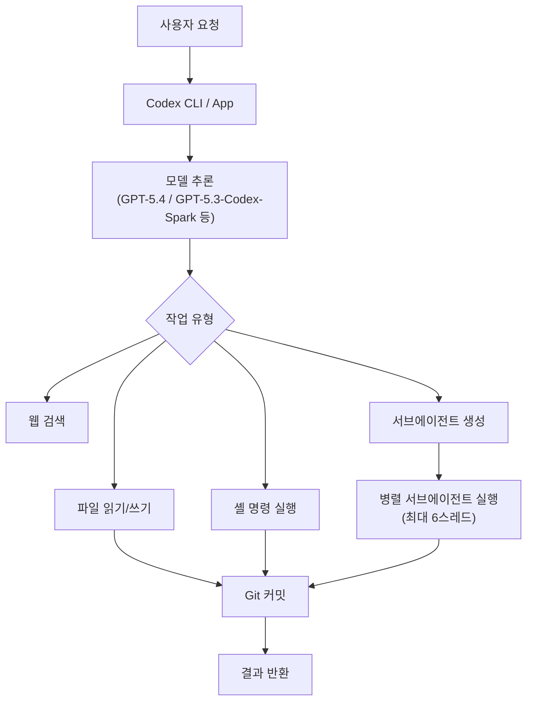

Codex는 Plan Mode를 통해 코드 수정 전 계획을 세울 수 있으며, MCP(Model Context Protocol) 서버를 통해 외부 도구에 접근할 수 있다. 또한 Codex 자체를 MCP 서버로 실행하여 다른 에이전트가 Codex를 하위 실행 엔진으로 활용하는 것도 공식 지원된다.

---

## 3. 실전에서 마주친 네 가지 핵심 문제

README에 명시된 문제 진술은 날카로운 비유로 구성되어 있다. 각 문제의 원문 표현과 함께 기술적 분석을 제공한다.

### 3.1 문제 1 — Plan Mode의 단일 컨텍스트 병목

> *"Codex's Plan mode considers every step in a single context, which creates a performance bottleneck. It feels like inviting the entire company into one meeting room inside its head."*

Codex의 Plan Mode는 계획의 모든 단계를 단일 컨텍스트 스트림 위에서 처리한다. 회사 전체 직원을 하나의 회의실에 집어넣는 것과 같다. 1단계 구현에서 발생한 오류, 수정 이력, 폐기된 코드 조각들이 모두 컨텍스트에 남아 2단계, 3단계 추론에 영향을 미친다. 이것이 **컨텍스트 오염(Context Rot)** 이다.

아무리 성능이 뛰어난 프런티어 모델이라도 컨텍스트가 길어질수록 오류 발생률이 빠르게 높아진다. 이는 어텐션 메커니즘의 구조적 특성에서 비롯된다. 컨텍스트가 길어질수록 초기 정보에 대한 어텐션 가중치가 희석되고, 이전 단계의 잡음에 과도한 가중치가 투여된다.

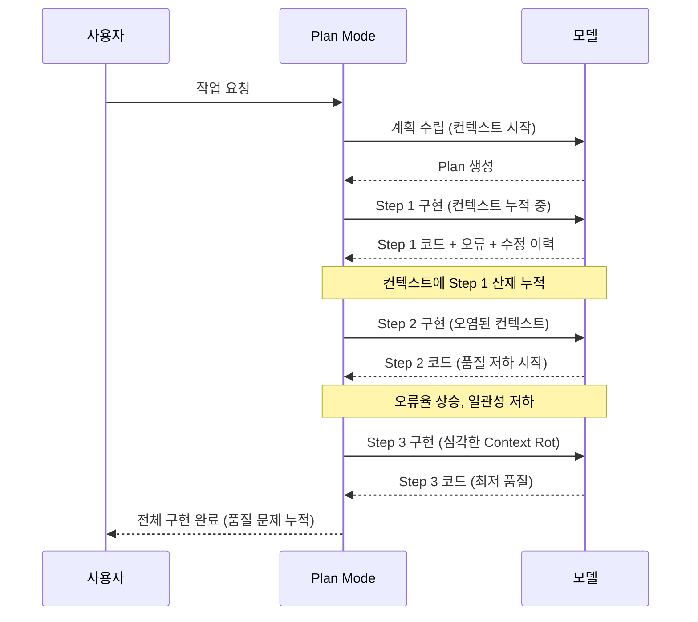

올바른 접근 방식은 계획은 하나의 컨텍스트에서 수립하되, 각 구현 단계는 독립된 컨텍스트에서 실행하는 것이다. 계획 산출물만 다음 컨텍스트로 전달되고, 이전 단계의 구현 잔재는 차단된다.

---

### 3.2 문제 2 — 탐욕 알고리즘 패턴: 최소 변경 편향

> *"Codex tends to make the smallest possible change to the current codebase instead of thinking seriously about code quality. Sometimes the result feels like repairing a bridge with toothpicks."*

Codex가 코드를 작성할 때 드러나는 행태 문제는 **탐욕적 최소 변경(Greedy Minimal Edit)** 경향이다. 현재 코드베이스에 대한 변경량을 최소화하려는 방향으로 동작하며, 그 결과는 마치 이쑤시개로 다리를 수리하는 것과 같다.

컴퓨터 과학에서 탐욕 알고리즘(Greedy Algorithm)은 매 순간 가장 이득이 크거나 비용이 적은 선택만을 반복하는 방식이다. 국소 최적(local optimum)만을 연속적으로 선택하기 때문에 전역 최적(global optimum)을 보장하지 못한다. Codex의 코드 생성 패턴이 정확히 이 구조를 따른다. 단기적으로는 안전하고 리뷰하기 쉬운 변경처럼 보이지만, 수십 개의 커밋이 쌓이면 유지보수성과 아키텍처적 일관성이 훼손된 코드베이스가 된다.

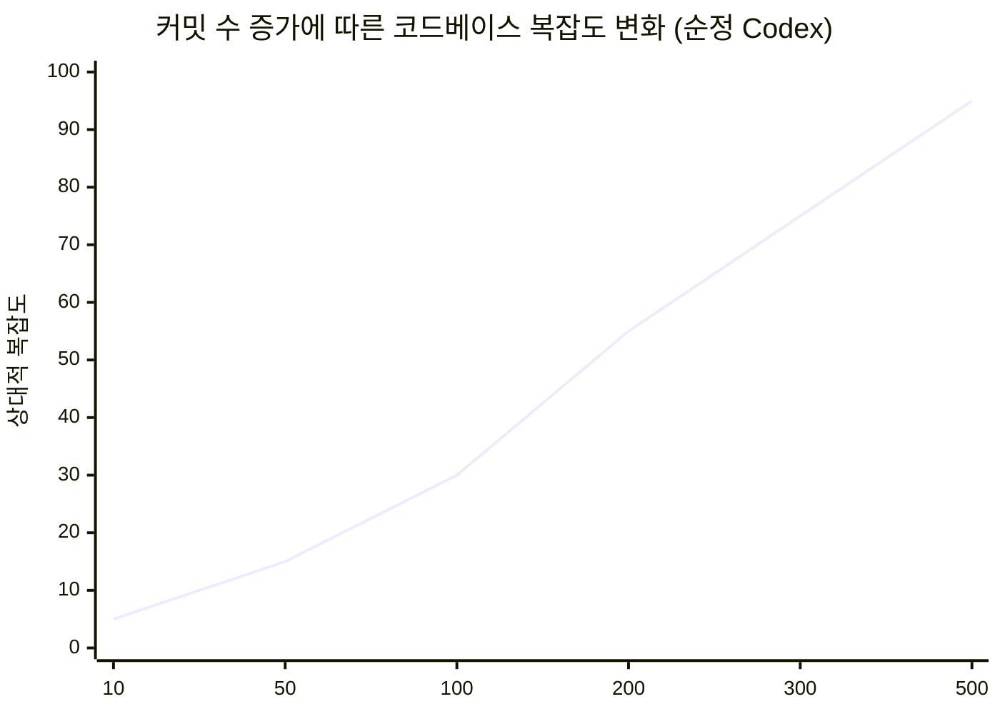

---

### 3.3 문제 3 — TUI 대신 Codex 앱 안에서 다른 에이전트를 쓰고 싶다

> *"Instead of using agents like the oh-my series or Aider directly in a TUI, I want Codex to use them for me inside the Codex app. I want to be the director, not the keyboard intern."*

Oh-My-Codex나 Aider 같은 오케스트레이션 도구들은 강력하지만, TUI(텍스트 기반 UI) 위에서 직접 조작해야 한다. 제작자가 원했던 것은 다르다. Codex 앱의 UX는 그대로 유지하면서, Codex 에이전트 자신이 다른 에이전트들을 하위 도구로 활용하게 만드는 것이다. 사용자는 감독(director)이 되고, Codex가 에이전트들을 지휘하는 구조다. 키보드 인턴이 되지 않겠다는 선언이다.

---

### 3.4 문제 4 — 대부분의 에이전트 하네스는 범용적이지 않다

> *"Most agent harnesses are only effective in specific situations, which makes them hard to use generally. They look like universal remotes, but somehow only turn on the air conditioner."*

대부분의 에이전트 하네스(harness)는 특정 상황에서만 효과적이다. 만능 리모컨처럼 보이지만 실상은 에어컨만 켜지는 리모컨이다. 범용으로 사용하기 어려운 이유는 특정 워크플로우나 환경에 지나치게 특화되어 있기 때문이다. Crack-CLI는 이 문제를 최소 구현으로 접근한다. 핵심 문제만 해결하고, 특정 환경에 대한 가정을 최소화한다.

---

## 4. Crack-CLI 아키텍처: 설계 원칙과 내부 구조

### 4.1 설계 원칙: 사람이 아닌 에이전트를 위한 CLI

Crack-CLI의 가장 독특한 특성은 이것이 **사람을 위한 도구가 아니라는 점**이다. Codex에게 제공되는 스킬(Skill)로 설치되며, Codex 에이전트 자신이 이 CLI를 호출한다. 사람은 Codex 앱에서 요청을 입력하고, Codex는 필요할 때 Crack-CLI를 도구로 사용하여 하위 에이전트들을 오케스트레이션한다.

기존 CLI 도구는 인간 조작자를 전제로 설계된다. 읽기 쉬운 출력, 인터랙티브한 프롬프트, 시각적 피드백이 중요하다. 그러나 에이전트가 소비하는 CLI는 다른 설계 원칙을 따른다. 파싱하기 쉬운 구조화된 출력, 명확한 성공/실패 상태, 에이전트가 의사결정에 필요한 정보를 최소한의 형식으로 전달하는 것이 우선이다.

### 4.2 파일 시스템 기반 상태 관리

Crack-CLI는 데몬(daemon), 백그라운드 큐, 숨겨진 스케줄러를 전혀 사용하지 않는다. 모든 워크플로우 상태는 프로젝트 루트의 `.crack/` 디렉토리 아래 평문 마크다운 파일로 저장된다.

```
.crack/
  inbox.md              ← PR 잠금 중 대기하는 요청들
  pr-lock.md            ← 원격 PR 모드 활성 시 생성되는 잠금 파일
  plans/
    <plan-name>/
      plan.md           ← 계획 명세 + 커밋 단위 목록 (핵심 맵)
      queue.md          ← 해당 Plan에 대기 중인 후속 요청
      log.md            ← 완료된 커밋 단위 기록
```

이 설계는 의도적으로 단순하다. README에서 직접 언급하듯, "새벽 2시에도 읽을 수 있는 상태 파일"이 기능이다. plan.md의 `### Commit N:` 섹션과 log.md의 `Completed commit unit N` 항목을 비교하는 것만으로 다음에 실행해야 할 커밋 단위를 결정한다. 별도의 데이터베이스나 복잡한 상태 직렬화 없이 파일 시스템 자체가 진실의 원천(source of truth)이 된다.

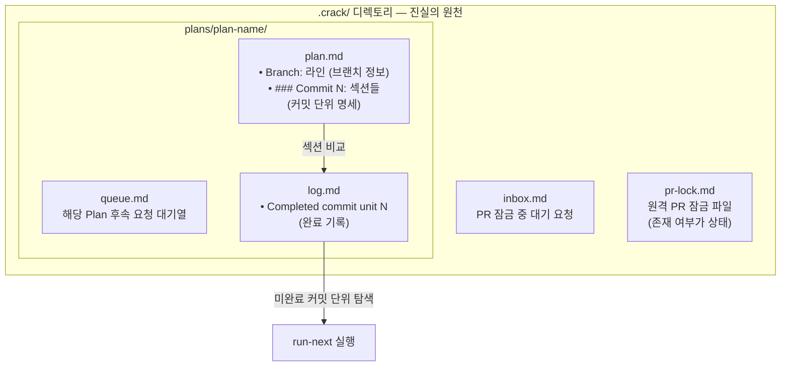

### 4.3 브랜치 관리

Crack-CLI는 새로운 Plan을 생성할 때 자동으로 브랜치를 준비한다. `--branch` 옵션을 명시하지 않으면, 요청 제목을 기반으로 `codex/<slug>` 형태의 브랜치명을 자동 생성한다.

브랜치 처리 로직은 다음과 같다. 해당 브랜치가 이미 존재하면 `git switch <branch>`를 실행하고, 존재하지 않으면 `git switch -c <branch>`를 실행하여 새로 생성한다.

여기서 중요한 세부사항이 있다. Plan의 실제 소스 브랜치는 항상 plan.md의 `Branch:` 라인에서 다시 읽어온다. plan.md는 단순한 문서가 아니라 실행 흐름의 기준 맵이다. 브랜치명이 plan.md 외부에서 변경되더라도, Crack-CLI는 항상 plan.md를 기준으로 동작한다.

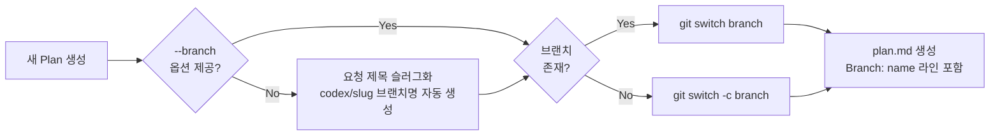

### 4.4 스케줄링 모델

Crack-CLI의 스케줄링은 의도적으로 단순하게 설계되었다. README는 이것을 "deliberately boring"이라고 표현한다.

`submit`과 `route` 명령은 코드를 즉시 구현하지 않는다. 이들은 요청을 적절한 위치에 배치하는 역할만 한다. `.crack/pr-lock.md`가 존재하면 새 요청은 inbox.md로 보내진다. `--plan <path>` 옵션을 지정하면 해당 Plan의 queue.md로 전달된다. 활성 Plan들이 존재하면 Router가 기존 Plan에 요청을 붙일지, 새 브랜치를 생성할지 판단한다.

실제 구현은 `run-next`와 `run-all`을 통해 이루어진다. `run-next`는 미완료된 커밋 단위 하나를 실행한다. `run-all`은 Plan이 완료되거나 `needs_work` 상태가 반환될 때까지 `run-next`를 반복한다.

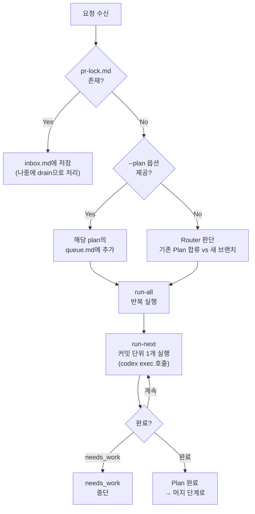

### 4.5 PR 잠금(PR Lock) 메커니즘

원격 PR 모드가 활성화되면 `.crack/pr-lock.md`가 생성된다. 이 파일이 존재하는 동안 Crack-CLI는 새 Plan 생성을 일시 중지하고 들어오는 모든 요청을 inbox.md에 저장한다.

잠금은 두 가지 경우에 해제된다. `crack pr-check`가 해당 PR이 머지되었음을 확인했을 때, 또는 동일 브랜치에 대한 원격 머지가 성공했을 때다. 잠금이 해제되면 `drain` 명령이 inbox.md에 대기 중이던 요청들을 Router를 통해 하나씩 처리한다. 이 메커니즘은 PR이 열려 있는 동안 충돌 가능성이 있는 병렬 작업이 시작되는 것을 방지한다.

### 4.6 머지(Merge)와 충돌 해결 에이전트

머지는 Plan이 완전히 완료된 경우에만 실행된다. Crack-CLI는 plan.md와 log.md를 검사하여 완료되지 않은 커밋 단위가 있으면 `needs_work` 상태로 중단한다.

로컬 머지는 대상 브랜치로 전환한 뒤 Plan 브랜치를 머지하고 결과를 log.md에 기록한다. 원격 머지는 소스 브랜치를 push하고, PR을 재사용하거나 새로 생성한 뒤 `gh pr merge --merge`를 실행한다. GitHub CLI(`gh`)가 필수 의존성인 이유가 여기에 있다.

충돌이 발생하면 Crack-CLI는 **Merge Agent**를 호출한다. 이 에이전트의 역할 범위는 의도적으로 좁게 제한된다.

> *"resolve the current conflict, not redesign the feature, not rewrite the Plan, not suddenly become a product manager"*

현재 충돌을 해결하는 것이 유일한 임무다. 기능을 재설계하거나, Plan을 재작성하거나, 갑자기 프로덕트 매니저가 되는 것은 Merge Agent의 역할이 아니다. 충돌을 완전히 해결하지 못한 경우, Crack-CLI는 `merge_needs_work` 상태로 중단하고 이유를 Plan 로그에 기록한다.

---

## 5. 전체 워크플로우 흐름

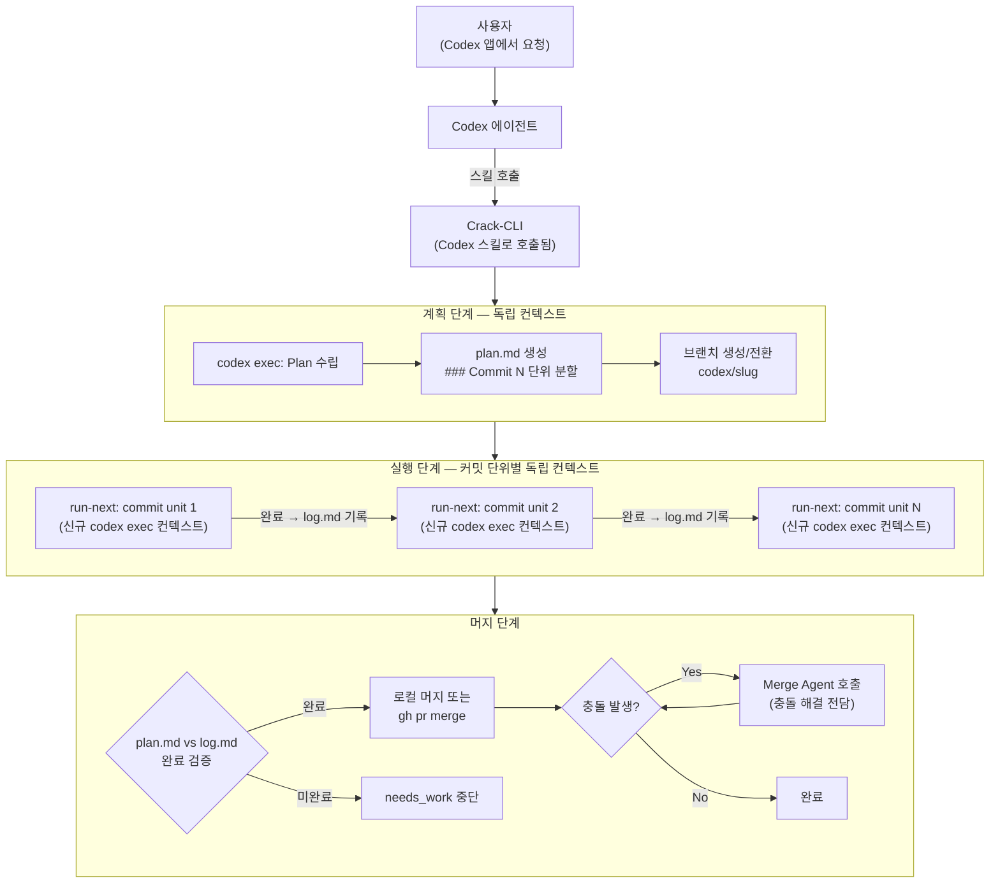

---

## 6. 설치 및 의존성

### 6.1 설치 절차

중요한 특징은 이 설치 지시문이 **사람이 아닌 Codex 에이전트에게 주는 프롬프트**라는 점이다. README에는 명시적으로 "We prepared a skill for Codex, not for you"라고 적혀 있다. 다음 내용을 Codex에게 전달하면 Codex가 설치 작업을 수행한다.

```
Install Crack CLI from https://github.com/Royaltyprogram/crack-cli.git.
Clone the repository, run npm install, run npm run build, and link the 
crack binary with npm link.
Then install the Codex skill by copying skills/crack-cli into 
${CODEX_HOME:-$HOME/.codex}/skills/crack-cli.
After that, verify the setup with crack --help.
```

설치 완료 후 스킬은 `~/.codex/skills/crack-cli/`에 위치하며, Codex가 세션을 시작할 때 자동으로 로드한다.

### 6.2 필수 의존성

설치에 앞서 두 가지 외부 도구가 필요하다.

첫째, **GitHub CLI(`gh`)** 가 설치되어 있고 인증된 상태여야 한다. 원격 PR 생성(`gh pr create`)과 머지(`gh pr merge --merge`)에 사용된다.

둘째, **Codex CLI**가 사용 가능해야 한다. Crack-CLI는 계획 수립, 구현, 충돌 해결의 각 단계에서 내부적으로 `codex exec`를 호출한다. Crack-CLI 자체가 코드를 생성하지 않는다. 코드 생성은 전적으로 Codex에게 위임된다.

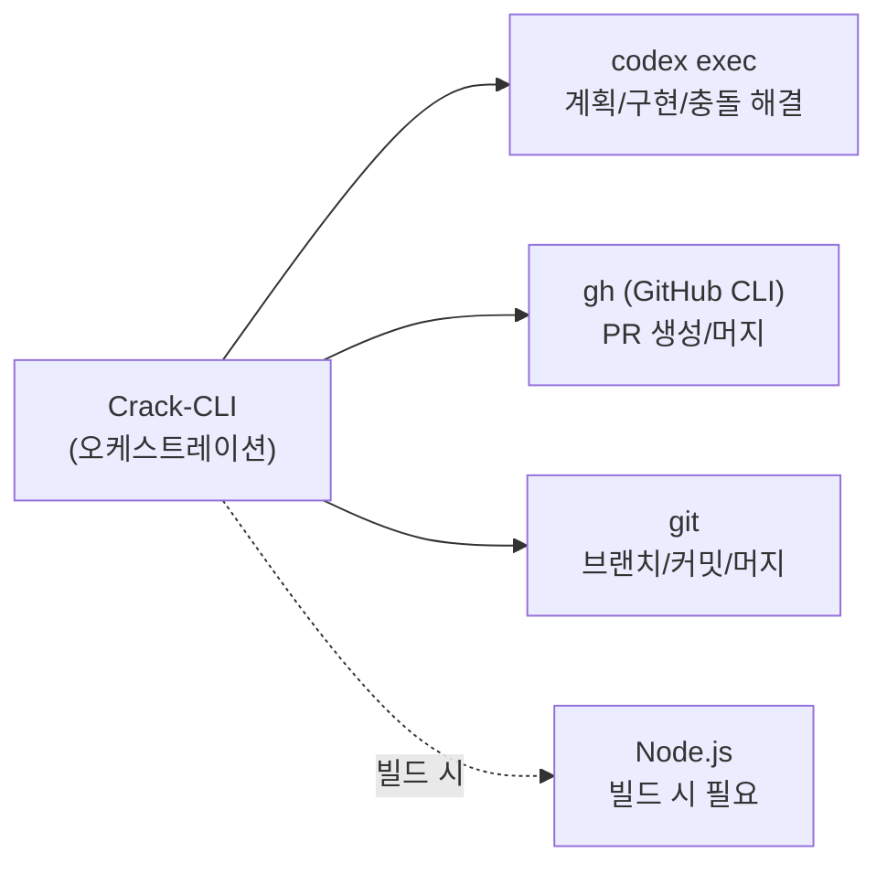

---

## 7. 생태계 맥락: 다른 오케스트레이션 도구들과의 비교

### 7.1 Oh-My-Codex (OMX)

OMX는 OpenAI Codex CLI 위에 올라가는 워크플로우·오케스트레이션 레이어다. 구조화된 4단계 워크플로우(`$deep-interview → $ralplan → $ralph / $team`), tmux 기반 병렬 워커, `.omx/` 디렉토리를 통한 세션 간 영속 상태 관리, 네이티브 Codex 훅 연동을 제공한다. 복잡하고 다중 파일에 걸친 작업에서 가치를 발휘한다.

Crack-CLI와의 결정적 차이는 인터페이스 레이어다. OMX는 사람이 직접 CLI를 조작하는 구조인 반면, Crack-CLI는 Codex 앱 안에서 에이전트가 스킬로 호출하는 구조다.

### 7.2 내장 서브에이전트(Subagents)

현재 Codex 릴리스는 서브에이전트 워크플로우를 기본 지원하지만 최대 6개 스레드로 제한된다. 의존성 분석 및 브랜치 격리 전략이 명시적이지 않으며, 컨텍스트 오염 문제를 내장 메커니즘만으로 완전히 해결하지 못한다. 설정 없이 사용 가능하다는 장점이 있다.

### 7.3 비교 요약

| 항목 | Crack-CLI | Oh-My-Codex | 내장 서브에이전트 |
|---|---|---|---|
| 인터페이스 | Codex 앱 스킬 (에이전트 호출) | TUI 직접 조작 | Codex 앱/CLI |
| 컨텍스트 격리 | 단계별 완전 격리 | 영속 상태 관리 | 제한적 |
| 상태 저장 | `.crack/` 파일 시스템 | `.omx/` 파일 시스템 | 세션 내 메모리 |
| 병렬 실행 | Router 기반 브랜치 분기 | tmux 워커 | 최대 6스레드 |
| PR 관리 | 내장 (`gh` 사용) | 별도 처리 | 별도 처리 |
| PR 잠금 | `pr-lock.md` 메커니즘 내장 | 없음 | 없음 |
| 충돌 해결 | Merge Agent (좁은 역할) | 수동 | 수동 |
| 복잡도 | 최소 구현 지향 | 풍부한 기능 | 단순하지만 제한적 |

---

## 8. 기술적 심층 분석: Context Rot와 컨텍스트 격리

### 8.1 Context Rot의 메커니즘

Context Rot는 단순히 컨텍스트가 길어지는 것이 아니다. 구현 과정에서 발생한 오류, 수정 시도, 폐기된 접근 방식, 부분적으로 완성된 코드 조각들이 컨텍스트에 누적되면서 모델의 추론 품질을 점진적으로 저하시키는 현상이다.

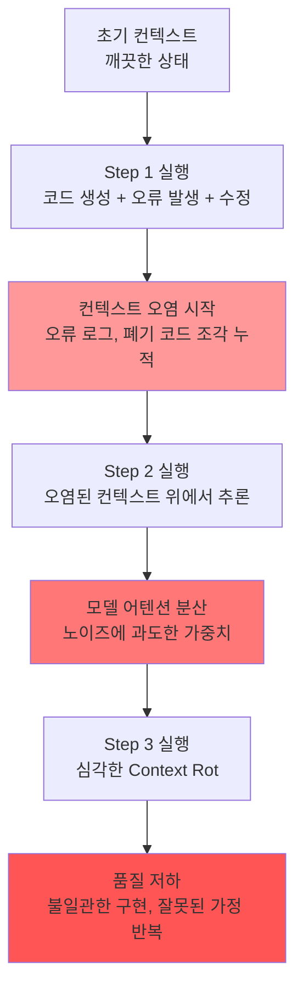

### 8.2 Crack-CLI의 해결 방식: plan.md가 유일한 선행 정보

Crack-CLI에서 plan.md는 각 구현 컨텍스트에 주입되는 유일한 선행 정보다. plan.md에는 브랜치 정보와 `### Commit N:` 형식으로 분할된 커밋 단위별 구현 명세가 담긴다. 각 `run-next` 실행은 이 plan.md와 현재 코드베이스 상태만을 가지고 새로운 `codex exec` 세션에서 시작한다. 이전 실행에서 발생한 오류, 수정 이력, 폐기된 접근 방식은 포함되지 않는다.

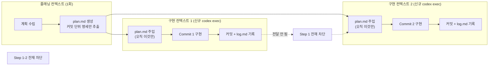

---

## 9. 실전 결과와 검증

### 9.1 324 커밋 실험

Crack-CLI를 통해 단일 프로젝트에 연속으로 최대 324개의 커밋을 쌓은 실험에서 코드는 사람이 읽을 수 있었다. 순정 Codex로 생성되는 코드베이스가 수십 커밋 이후 급격히 복잡도를 쌓아가는 것과 달리, Crack-CLI를 통한 코드베이스는 확장성과 유지보수성이 유지되었다. 탐욕적 최소 변경 편향이 오케스트레이션 레이어를 통해 효과적으로 억제된 결과다.

### 9.2 구현 속도에 대한 솔직한 한계 인정

제작자는 중요한 점을 명확히 밝혔다. Crack-CLI는 구현 속도 자체를 높여주지 않는다. 개발에는 본질적으로 순차적으로 처리되어야 하는 부분이 많다. A가 완성되어야 B를 구현할 수 있는 종속 관계는 병렬화로 극복할 수 없다.

Crack-CLI의 가치는 속도가 아니라 **신뢰 가능한 위임(Trusted Delegation)** 에 있다. 대기해야 하는 시간 동안 에이전트에게 안심하고 작업을 맡길 수 있다는 것, 중간에 개입하지 않아도 일관된 품질이 유지된다는 확신이 이 도구의 핵심 가치다.

---

## 10. 결론: 에이전트 공학이란 무엇인가

Crack-CLI의 탄생 과정은 에이전트 공학(Agentic Engineering)의 본질을 잘 보여준다. 바이브 코딩(Vibe Coding)이 에이전트에게 요청을 던지고 결과를 기다리는 방식이라면, 에이전트 공학은 에이전트가 어떻게 동작하는지를 이해하고, 그 동작 패턴의 결함을 인식하며, 이를 체계적으로 보완하는 인프라를 설계하는 것이다.

Crack-CLI가 다루는 네 가지 문제 — 단일 컨텍스트 병목, 탐욕적 최소 변경 편향, TUI 대신 앱 내 오케스트레이션, 하네스의 범용성 결여 — 는 모두 "더 강한 모델로 교체하면 해결된다"는 방식으로는 접근할 수 없다. 이것들은 구조적 문제이며, 모델 성능과 무관하게 에이전트 운용 방식에서 발생한다.

파일 시스템 기반의 투명한 상태 관리, 계획과 구현의 컨텍스트 분리, 에이전트가 호출하는 CLI라는 인터페이스 역전 — 이 세 가지 설계 선택이 "코딩 에이전트의 결과물 품질은 모델 성능만이 아니라, 그 에이전트를 어떻게 오케스트레이션하는가에 의해 결정된다"는 명제를 실증한다.

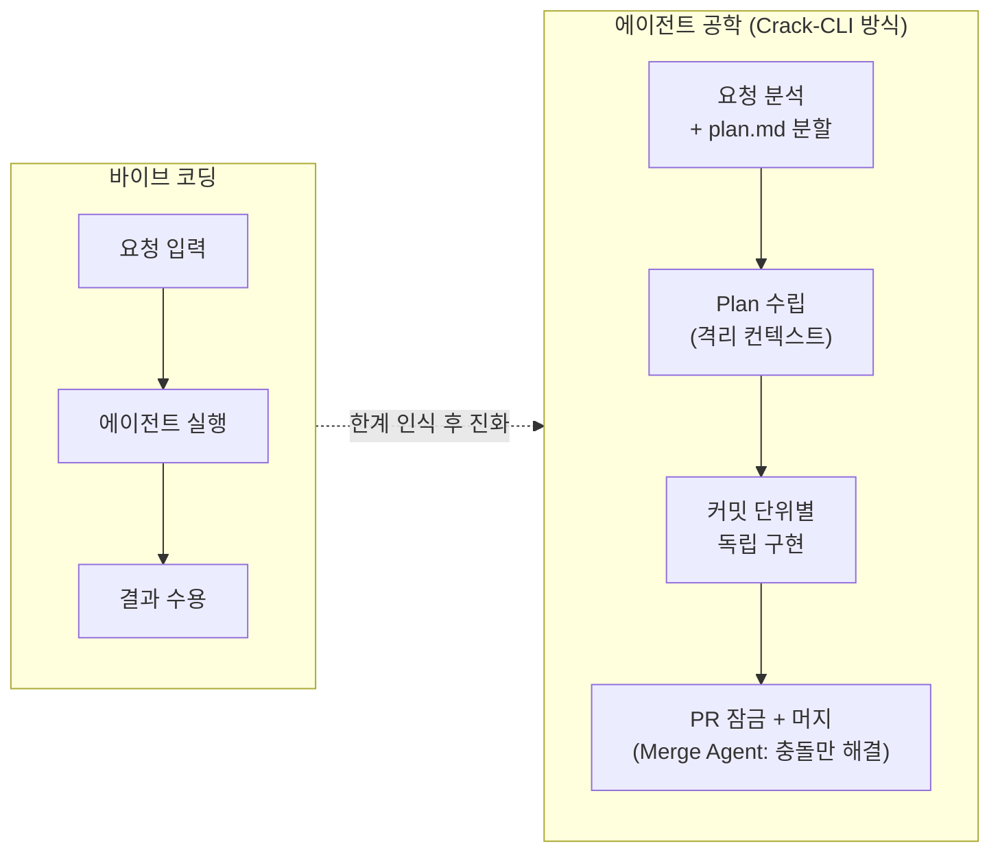

Crack-CLI는 오픈소스(MIT 라이선스)이며 PR을 통한 기여를 환영한다. 6,542 커밋의 실전 경험이 응축된 이 도구가 어떤 방향으로 발전해 나갈지는, 이 문제 의식에 공감하는 개발자들의 기여에 달려 있다.

---

*작성일: 2026년 5월 12일*
