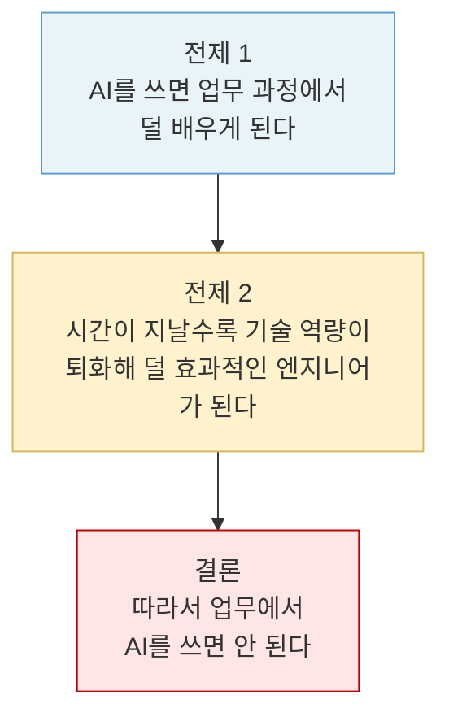
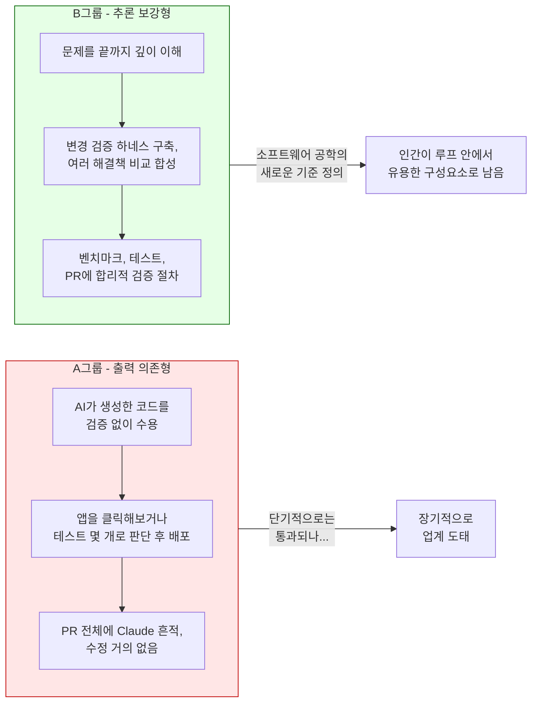
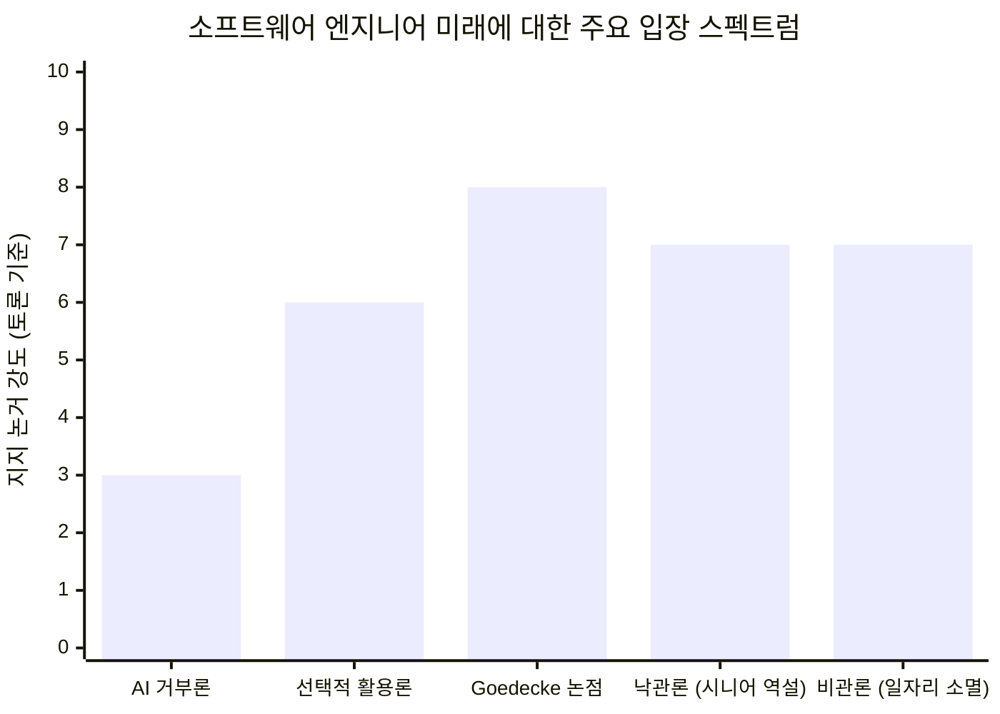

## Sean Goedecke 글과 Hacker News / GeekNews 토론 상세 분석

---

## 1. 저자 소개: Sean Goedecke는 누구인가

이 글을 이해하려면 먼저 저자의 배경을 파악할 필요가 있다. Sean Goedecke는 호주 멜버른 출신의 소프트웨어 엔지니어로, 약 10년간 GitHub을 비롯한 미국 대형 기술 기업에서 근무했으며, GitHub Copilot 팀에서 Staff Software Engineer로 활동하다 최근 GitHub을 떠났다. 수학 학위와 도덕철학 석사 학위라는 이례적인 학문적 배경을 가졌으며, 그로 인해 소프트웨어 공학 문제를 철학적·논리적 방식으로 접근하는 것이 특징이다.

2025년 기준으로 그는 Hacker News에서 가장 많이 공유되는 블로거 3위 안에 들 만큼 영향력 있는 필자로, 141편의 글이 월 100만 명 이상의 독자에게 읽혔다. 그의 글은 실용적이고 과장 없는 관점으로 소프트웨어 엔지니어링의 현실을 다루는 것으로 유명하다. 이 글 역시 2026년 4월 24일에 발행되어 Hacker News와 GeekNews(한국의 개발자 커뮤니티)에서 즉각적인 반향을 일으켰다.

---

## 2. 본문 핵심 주장의 구조

### 2.1 출발점: AI는 정말 사람을 멍청하게 만드는가?

Goedecke는 글의 첫 문장부터 자신의 입장을 분명히 한다. 그는 AI 사용이 인간의 전반적인 지능을 저하시킨다는 설득력 있는 증거가 아직 없다고 말한다. 그러나 동시에 한 가지 사실은 "꽤 분명하다(pretty obvious)"고 인정한다. AI를 이용해 어떤 작업을 처리하면, 그 작업을 스스로 수행하는 과정에서 얻을 수 있었던 학습량이 줄어든다는 것이다. 이는 단순한 추측이 아니라 학습 이론의 관점에서 자연스러운 귀결이다. 어떤 기술이든 직접 수련해야 숙달되는데, AI가 그 수련의 기회를 대신 가져가는 구조가 되기 때문이다.

### 2.2 AI 거부론자들의 3단 논법과 그 약점

일부 소프트웨어 엔지니어들은 바로 이 관찰에서 출발해 AI 사용을 반대하는 논리를 전개한다. 저자가 정리한 그 논리 구조는 다음과 같다.

Goedecke는 이 논증에서 전제 2가 불확실하다고 지적한다. 어셈블리어에서 C 언어로의 전환을 예로 들며, 그 과정에서 프로그래머들은 어떤 면에서는 덜 효과적이 되었지만 다른 면에서는 더 효과적이 되었다는 역사적 사례를 제시한다. 손코딩에서 AI 활용으로의 전환이 훨씬 더 큰 패러다임 이동이기 때문에 결과를 단정하기 어렵다고 본다.

그러나 저자의 핵심 반박은 더 깊은 곳에 있다. **설령 전제 2가 맞다 하더라도 이 논증은 여전히 나쁜 논증**이라는 것이다. 왜냐하면 어떤 기술이 개인의 장기적 역량을 저하시킨다는 사실이 곧바로 그 기술을 쓰지 말아야 한다는 결론으로 이어지지 않기 때문이다.

### 2.3 "운 좋은 우연"이라는 시각 전환

저자가 제시하는 가장 강력한 통찰은 2024년 전후까지 소프트웨어 엔지니어들이 누렸던 특권이 사실은 "운 좋은 우연(fortunate coincidence)"에 불과했다는 것이다. 과거에는 소프트웨어 엔지니어링을 배우는 가장 좋은 방법이 바로 소프트웨어 엔지니어링을 직접 하는 것이었다. 일을 하면서 자연스럽게 성장했고, 그 성장이 다시 더 좋은 일로 이어지는 선순환 구조였다.

코딩이라는 취미가 곧 고수익 직업이 되는 이 구조는 소프트웨어 엔지니어링의 본질적 속성이 아니었다. 다른 수많은 직업들에서는 이 행운이 주어지지 않았다. 건설 노동자는 일을 하면서 몸이 소모된다. 프로 운동선수는 경기를 뛰면서 신체가 닳는다. 소프트웨어 엔지니어들이 일을 하면서 더 강해지는 구조는, 돌이켜보면 매우 특이하고 운이 좋은 경우였을 뿐이라는 것이다.

---

## 3. 세 가지 핵심 비유와 그 함의

### 3.1 건설 노동자와 무거운 물건

저자가 제시하는 첫 번째 비유는 건설 노동자다. 건설 현장에서 일하려면 무거운 물건을 들어야 한다. 그런데 반복적으로 무거운 것을 드는 행위는 장기적으로 허리와 관절을 마모시킨다. 즉, 일을 잘하기 위해 해야 하는 행동이 동시에 자신의 몸을 망가뜨리는 행동이기도 하다.

건설 노동자들은 이 상황에서 "무거운 것을 들지 않는 것이 좋은 건설 노동자의 덕목"이라고 말하지 않는다. 그들은 그냥 "어쩔 수 없다, 이게 일이다(too bad, that's the job)"라고 말한다. Goedecke는 소프트웨어 엔지니어도 같은 현실을 받아들여야 할 수 있다고 본다.

저자 자신도 이 비유에 대한 보완적 관찰을 각주에서 덧붙인다. 건설 현장에도 크레인, 손수레, 지게차처럼 무거운 것을 피하기 위한 기법들이 존재한다. 소프트웨어 엔지니어에게도 AI를 쓰면서도 정신적으로 깊이 몰입하는 상태를 유지하기 위한 기법들이 아직 발견되지 않았을 뿐이지, 언젠가 나타날 수도 있다는 것이다.

### 3.2 전동 공구를 거부하는 목수

두 번째 비유는 더 직접적이다. AI가 장기적으로 엔지니어를 덜 똑똑하게 만든다는 것이 사실이라 하더라도, 손코딩을 고집하는 것은 여전히 가능하다. 그러나 전동 공구를 거부하는 목수에게 일자리가 없는 것처럼, 손코딩만으로 급여를 받기가 어려워질 수 있다. AI 모델이 충분히 강력해진다면, 장기적 인지 능력을 다소 희생하더라도 AI를 활용해 단기적으로 높은 생산성을 보이는 엔지니어들에게 경쟁에서 밀리게 될 것이기 때문이다.

이 비유는 개인의 선택과 시장의 선택이 다를 수 있음을 보여준다. 개인은 손코딩이 자신에게 더 좋다고 판단할 수 있지만, 시장은 AI를 쓰는 엔지니어를 더 선호한다. 그리고 결국 시장이 이긴다.

### 3.3 프로 운동선수의 경력 수명

세 번째 비유는 글 전체에서 가장 충격적이다. 프로 운동선수의 경력은 통상 15년을 넘기기 어렵다. 30대 중반이 되면 신체가 더 이상 경쟁적 수준을 유지하지 못한다. 이 세계에서 흔히 보이는 비극적 인물은 "쇼는 영원히 계속될 것"이라 믿고 은퇴 후를 준비하지 않는 운동선수다.

Goedecke는 소프트웨어 엔지니어들이 같은 상황에 놓인 첫 번째 세대가 될 수 있다고 경고한다. 만약 AI 사용이 실제로 장기적 기술 역량 저하를 가져온다면, 소프트웨어 엔지니어링도 더 이상 평생 직업이 아닐 수 있다. 지금이 좋을 때 많은 돈을 벌되, 언제가 될지 모를 "커리어의 끝"에 대비해 계획을 세워야 한다는 메시지다.

---

## 4. 저자 후기: Hacker News 반응에 대한 성찰

글이 Hacker News에서 큰 반응을 얻자, 저자는 글 말미에 편집 노트를 추가했다. 그는 많은 댓글이 "엔지니어들이 AI를 통해 더 많은 엔지니어링 작업을 할 수 있다"는 낙관적 관점을 제시했다며 약간의 실망을 표했다.

저자가 보완하고자 한 두 가지 핵심 논점은 다음과 같다. 첫째, 손으로 직접 코드를 쓰지 않게 되면, 코드베이스 전체를 깊이 이해하는 능력도 함께 퇴화할 수 있다. 단순히 타이핑을 안 하는 것이 아니라, 시스템을 이해하는 방식 자체가 변하기 때문이다. 둘째, 이 분야의 변화 속도가 워낙 빠르기 때문에, 10년이나 20년 후에 어떤 일이 일어날지는 아무도 알 수 없다. 낙관론도 비관론도 모두 과신이 될 수 있다.

---

## 5. Hacker News와 GeekNews 토론: 주요 논점들

이 글이 Hacker News에 게재된 후 수백 개의 댓글이 달렸으며, GeekNews(GeekNews HN: news.hada.io)에서도 이를 큰 관심을 갖고 소개했다. 토론에서 등장한 주요 논점들을 분류해 살펴보자.

### 5.1 개발자의 실제 업무에서 코딩이 차지하는 비중 논쟁

가장 활발한 논쟁 중 하나는 "소프트웨어 엔지니어의 업무에서 실제 코딩이 얼마나 많은 비중을 차지하는가"였다. 한 댓글 작성자는 자신의 업무에서 코드 작성 자체는 이전에도 2~5%, 지금은 그보다도 더 적다고 말했다. 나머지는 "사물을 이해하고 해결책을 구성하는 능력"을 적용하는 일이라고 주장했다.

이 견해는 즉각적인 반박을 불러일으켰다. 반박자들은 코드 작성이 2%밖에 안 되는 것은 대형 기업의 극히 상위 직급에나 해당하는 이야기이며, 대부분의 개발자는 25~40%의 시간을 실제 코딩에 쓴다고 반론했다. 또 다른 댓글은 "사물을 이해하고 해결책을 구성하는 것"도 AI가 노리는 영역이라고 지적했다. CRUD 웹앱이나 Jira 티켓 처리에 집중하는 개발자들은 이미 생계가 흔들리고 있다는 현실적 진단도 나왔다.

### 5.2 시니어 엔지니어 역설 - AI가 경험자를 더 강하게 만든다는 주장

흥미롭게도 일부 시니어 엔지니어들은 정반대의 경험을 공유했다. Claude Code와 Codex 같은 AI 코딩 도구가 오히려 40~50대 경험 많은 엔지니어들을 더 강하게 만든다는 것이다.

이 관점의 논리는 다음과 같다. 나이 든 체스 선수가 19세 천재보다 체스를 훨씬 잘 알지만, 같은 속도로 오래 계산하지는 못해 순수 계산력에서 밀리는 것처럼, 나이 든 개발자들은 구체적인 문법 암기나 반복적 코딩에서는 젊은 개발자에게 밀렸다. 그런데 AI가 그 계산 부담을 덜어주면서, 오랜 경험에서 쌓인 직관과 2초짜리 "감"이 그대로 살아 경쟁력을 발휘하게 되었다는 것이다.

그 결과, 예전에 6명 팀을 이끌던 시니어가 이제는 AI 에이전트 팀을 이끌며, 때로는 주변 주니어보다 에이전트의 방향을 바꾸는 것이 더 쉬울 때도 있다고 한다.

그러나 이 주장은 곧바로 강력한 반박에 직면했다. "시니어 1명이 6명 팀의 일을 할 수 있다면, 그 나머지 5명에게는 무슨 일이 생기는가? 농업에서 트랙터에 대체된 사람들이 일자리를 유지하지 못했듯, 지금은 무엇이 다른가?" 그리고 "6명 팀이 필요 없어진다는 말은 결국 글쓴이의 원래 요점을 확인해준 것"이라는 날카로운 반론이 이어졌다.

### 5.3 AI 사용 방식의 A그룹 vs B그룹 분류

토론에서 등장한 가장 실용적인 분석 틀 중 하나가 AI 사용자를 A그룹과 B그룹으로 나누는 것이었다.

A그룹은 AI가 생성한 코드를 제대로 검토하지 않고 수용하며, 앱을 대충 클릭해보거나 몇 가지 테스트를 돌린 후 결과가 그럭저럭 괜찮으면 배포한다. PR 전체에 Claude의 흔적이 역력하고 거의 수정하지 않는다. B그룹은 문제를 끝까지 파고들고, 변경사항을 검증할 하네스를 구축하며, 여러 해결책을 비교해 최적의 결과를 합성하고, 벤치마크하고 다듬고 철저히 테스트한다.

A그룹은 단기적으로 통과될 수 있지만 꽤 빠르게 업계에서 밀려날 것이라는 예측이 나왔다. 반면 B그룹의 방식은 소프트웨어 공학의 새로운 기준을 정의하고 있으며, 인간이 "루프 안에서 여용한 구성요소"로 남을 수 있는 유일한 방식이 될 것이라는 분석이다.

이 맥락에서 "AI로 추론을 보강(augment)하는 사람"과 "AI로 추론을 대체(replace)하는 사람"이라는 구분도 제시되었다. 전자는 크게 걱정하지 않아도 되지만, 후자는 장기적으로 문제가 된다는 것이다.

### 5.4 재훈련 신화와 일자리 이동의 한계

"AI로 인해 일자리를 잃어도 다른 직업으로 재훈련하면 된다"는 낙관적 주장에 대한 강한 반발도 있었다. 이 반발의 핵심 논점들은 다음과 같다.

첫째, 재훈련할 "그 직업"이 무엇인지, 재훈련 비용을 누가 낼지에 대한 구체적인 답이 없다. "항상 새로운 일자리가 생겼다"는 역사적 논리는 인간이 자동화보다 항상 지능적 우위를 가져왔다는 전제 위에 서 있었다. AGI에 가까운 것이 실제로 작동한다면 그 전제 자체가 무너진다.

둘째, AI가 화이트칼라 일자리를 대체하는 동안 배관공이나 건설 노동자로 재훈련하라는 조언은 그 수요가 무한하다고 가정하는데, 실제로는 그렇지 않다. 현재 화이트칼라 인력의 50%를 육체노동 직업으로 몰아넣어도 수요가 충분하지 않다. 동시에 소매업의 셀프 계산대, 로보택시와 드론 배송, 창고 로봇 등 소위 "저숙련" 육체노동 일자리도 동시에 자동화되고 있다.

셋째, "AI에도 안전하고 외주화에도 안전한 고임금 직업"이 대체 무엇인지에 대한 답이 없다. 가장 현실적인 시나리오는 사람들이 일자리를 잃고 국내 경제에 남은 제한된 일자리를 두고 끝없는 하향 경쟁에 빠지는 것이라는 비관적 전망도 나왔다.

### 5.5 소프트웨어 채용 시장의 실제 변화

2026년 초 미국 소프트웨어 채용 시장에서 실제 변화가 감지된다는 현장의 목소리도 등장했다. 채용 공고 하나에 500개가 넘는 LLM 작성 지원서가 쏟아지고, 기업들이 인적 자본에 과투자하지 않으려는 관망 전략을 취한다는 것이다. 반면 이를 반박하는 관점도 있었다. AI 때문에 채용이 줄었다기보다, 코로나 시기의 과잉채용 후유증, 제로금리 시대의 종료, 경제 불확실성 등 복합적 요인 때문이라는 분석이었다. 경영진이 "AI 때문"이라고 말하는 것을 좋아하는 이유는 그렇게 말하면 통제하고 있는 것처럼 들리기 때문이라는 냉소적 시각도 있었다.

### 5.6 결정성(Determinism) 논쟁: LLM은 추상화 계층인가

토론의 기술적 심층부에서는 LLM과 추상화 계층의 관계에 대한 철학적 논쟁이 벌어졌다. 어셈블리어에서 C로, C에서 객체지향으로의 전환처럼 AI도 또 하나의 추상화 계층이라는 주장에 대해, 핵심 차이는 "결정성(determinism)"이라는 반박이 나왔다.

전통적인 모든 추상화 계층은 결정적(deterministic)이어서 같은 입력에 같은 결과를 보장했고, 그것이 엔지니어들이 신뢰하며 일할 수 있는 기반이었다. 반면 LLM은 같은 입력에도 다양한 출력을 낸다. 이에 대한 재반박으로는, LLM 출력물을 직접 실행하는 것이 아니라 LLM으로 생성된 코드를 결정적으로 실행한다는 점, 그리고 가비지 컬렉션이나 명령어 사이클처럼 기존의 추상화 계층도 완전히 결정적이지 않다는 점이 제시되었다.

이 논쟁의 본질은 LLM이 "불투명한 함수(opaque function)"라는 데 있다. LLM의 동작을 논리적 단계들의 열로 환원할 수 없고, 입출력 공간이 구조화되지 않아 전통적 프로그램에 적용하는 분석 방법으로는 추론하기 거의 불가능하다. 이는 기존 추상화 계층과 근본적으로 다른 성질이다.

### 5.7 펀치카드 교훈: 소프트웨어는 항상 변한다

토론 중 가장 인상적인 일화 중 하나는 "펀치카드 교훈"이었다. 한 댓글 작성자가 2000년경 첫 직장에서 1970년대 초부터 일한 선배 엔지니어와 짝이 된 경험을 공유했다. 그 선배가 가르쳐준 것은 "펀치카드에 항상 번호를 매겨라"는 것이었다. 이미 펀치카드 시대가 한참 지난 뒤였기 때문에 그는 실망했다. 그러나 선배는 "너에게 도움이 되는 게 아니라 나에게 도움이 됐던 것이라고 했다. 소프트웨어는 항상 변한다"고 말했다.

이 일화는 소프트웨어 분야에서 "지금의 최선"이 언제나 곧 과거의 유물이 될 수 있다는 사실을 상기시킨다. AI 도구에 대한 의존이 깊어지는 지금, 우리가 지금 쌓는 기술과 습관 역시 몇 년 후에는 "펀치카드 번호 매기기"처럼 보일 수 있다.

---

## 6. 논점들의 구조적 정리

아래 다이어그램은 이번 토론에서 제시된 주요 입장들의 스펙트럼을 보여준다.

각 입장을 정리하면 다음과 같다.

**AI 거부론** — AI 사용이 기술 역량 퇴화를 가져오므로 쓰지 말아야 한다. Goedecke가 논리적으로 반박한 입장으로, 토론에서 지지를 거의 받지 못했다.

**선택적 활용론** — AI를 쓰되, AI로 추론을 보강하는 B그룹 방식을 택해야 한다. 코드를 직접 이해하면서 AI를 도구로 사용하는 접근이다. 토론에서 비교적 폭넓은 공감을 얻었다.

**Goedecke의 핵심 논점** — 개인이 어떻게 생각하든 시장은 AI를 활용한 엔지니어를 선호할 것이며, 소프트웨어 엔지니어링이 더 이상 평생 직업이 아닐 수 있음을 직시하고 대비해야 한다.

**시니어 역설 낙관론** — AI가 오히려 경험 많은 시니어를 더 강하게 만든다. 직관과 경험이 계산 부담에서 해방되어 더 잘 빛난다.

**일자리 소멸 비관론** — 재훈련 신화는 허구이며, 화이트칼라와 저숙련 육체노동 일자리가 동시에 자동화되는 현실에서 갈 곳이 없어진다.

---

## 7. 이 토론이 제기하는 더 깊은 질문들

이 글과 토론을 종합하면, 표면에 드러난 AI 활용 논쟁 너머에 더 근본적인 질문들이 놓여 있음을 알 수 있다.

**첫 번째 질문: 경험과 직관은 수련 없이 얻을 수 있는가**

소프트웨어 엔지니어링에서 "좋은 아키텍트"는 단순히 설계 패턴을 아는 것이 아니라, 수많은 실패와 성공을 통해 쌓인 실용적 직관을 가진 사람이다. 그런데 AI가 코딩의 "참호 경험"을 대체한다면, 그 직관을 얻지 못한 채 아키텍처 역할을 맡는 사람이 늘어날 것이다. "실무의 참호를 거치지 않고도 좋은 아키텍트가 될 수 있는가"라는 질문은, 토론 참여자들도 스스로 "시급하지만 아직 알 수 없는 질문"이라고 인정한 난제다.

**두 번째 질문: 생산성 증가와 노동 수요 사이의 관계**

AI가 소프트웨어 개발 생산성을 10배 높인다면, 한 회사는 같은 인력으로 10배 많은 일을 할 수 있고 다른 회사는 인력을 90% 줄일 수 있다. 어느 쪽이 시장 경쟁에서 유리한지는 산업 구조에 따라 다르다. 그러나 두 전략 중 어느 것을 선택하더라도 총 노동 수요는 이전과 같지 않다. 더 많은 소프트웨어가 만들어지더라도, 그것이 이미 존재하는 기능의 중복에 불과하다면 실제로 새로운 경제적 가치를 창출하는지도 불분명하다.

**세 번째 질문: 이번 자동화는 정말 이전과 다른가**

"자동화가 일어날 때마다 인류는 새로운 일자리를 찾아왔다"는 역사적 낙관론은 강력하다. 그러나 이 논리가 계속 성립하는 것은 인간이 자동화보다 항상 지능적 우위를 가져왔기 때문이었다. AGI에 근접하는 시스템이 실제로 작동한다면, 그 전제가 무너질 수 있다. 과거의 패턴이 미래에도 반드시 반복된다고 가정하는 것 자체가 하나의 믿음이지, 논리적 필연이 아니다. 이 점에서 맬서스 이론의 교훈이 역방향으로 적용될 수 있다는 주장도 나왔다.

---

## 8. 종합 평가

Sean Goedecke의 이 글이 가진 가장 큰 가치는 불편한 가능성을 정직하게 직시하도록 강제한다는 데 있다. 그는 AI가 반드시 소프트웨어 엔지니어링의 종말을 가져온다고 주장하는 것이 아니다. 그는 "만약 그렇게 된다면, 우리가 지금 그것을 직시하고 있는가"를 묻는다.

AI 도구의 도입으로 생산성이 높아지는 것과, 그로 인해 개별 엔지니어의 장기적 숙련도가 저하될 가능성은 서로 양립할 수 있다. 이 두 가능성이 동시에 사실이라면, 소프트웨어 엔지니어링은 높은 수익을 제공하지만 특정 시점 이후에는 지속하기 어려워지는 직업이 될 수 있다. 운동선수가 전성기에 충분한 자산을 쌓고 은퇴 후를 준비하는 것처럼, 지금의 소프트웨어 엔지니어들도 같은 지혜를 발휘해야 할 수 있다.

물론 이 예측이 틀릴 수도 있다. AI가 오히려 경험 많은 엔지니어들을 더 오래, 더 효과적으로 일하게 할 수도 있다. 새로운 추상화 도구들이 소프트웨어 공학에 진정한 공학적 엄밀함을 불어넣을 수도 있다. 그러나 저자의 말처럼, "그것이 사실이고 우리가 그것을 인정하지 않는다면, 그것이 더 불행한 일"이다.

---

## 9. 원문 및 참고 자료

- **원문**: [Software engineering may no longer be a lifetime career](https://www.seangoedecke.com/software-engineering-may-no-longer-be-a-lifetime-career/) — Sean Goedecke, 2026년 4월 24일
- **GeekNews 정리 및 HN 토론 번역**: [소프트웨어 엔지니어링은 더 이상 평생 직업이 아닐 수 있다](https://news.hada.io/topic?id=29416) — GeekNews, 2026년 5월 12일
- **저자 소개**: Sean Goedecke — GitHub Staff Software Engineer (전), 수학 및 도덕철학 전공, 호주 멜버른 거주, seangoedecke.com 운영

---

*작성일: 2026년 5월 12일*
