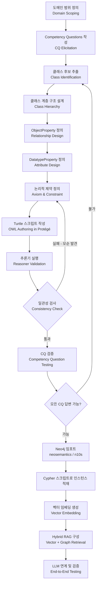
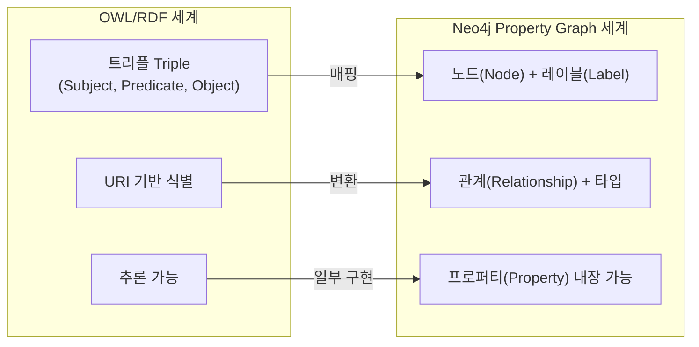
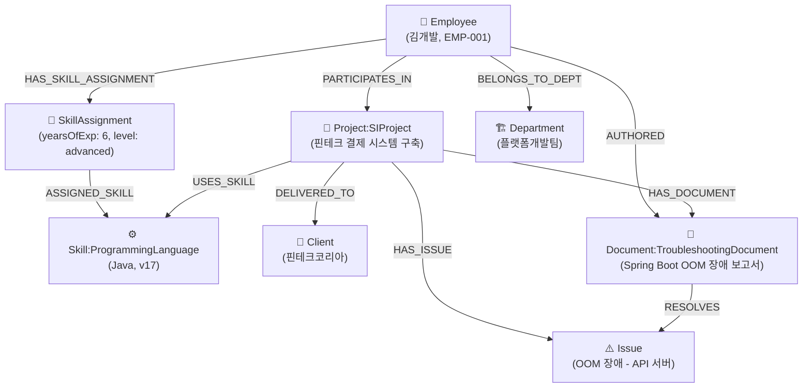
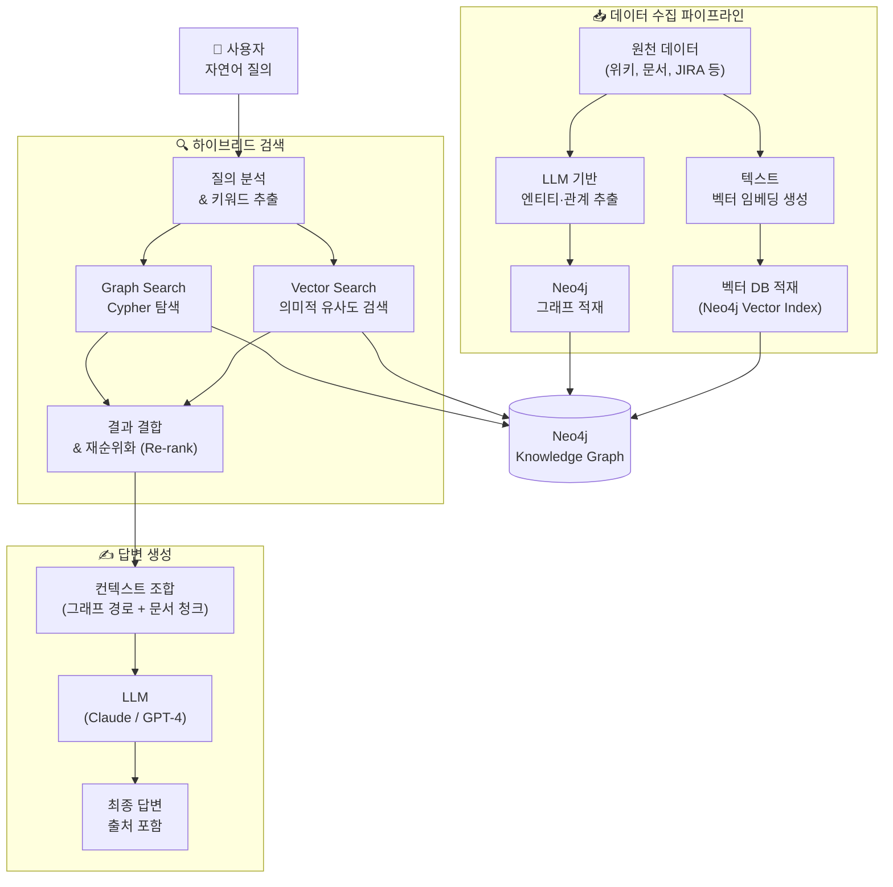

## IT SI/SM 기업 사내 지식 검색 시스템을 중심으로
### Hybrid RAG 기반 Neo4j 연계 전략 포함

---

> **문서 목적**: 이 문서는 OWL(Web Ontology Language) 기반 온톨로지의 개념적 이해부터, IT SI/SM 기업의 사내 지식 검색 시스템을 실제 사례로 삼아 온톨로지를 설계하고, Turtle 스크립트를 작성하고, 테스트하고, Neo4j에 연계하며, 궁극적으로 Hybrid RAG 기반 지식 검색 시스템으로 발전시키는 전 과정을 상세히 서술한다.

---

## 목차

1. [온톨로지란 무엇인가](#1-온톨로지란-무엇인가)
2. [제공된 예제 온톨로지 해설](#2-제공된-예제-온톨로지-해설)
3. [온톨로지 설계자의 사고방식](#3-온톨로지-설계자의-사고방식)
4. [IT SI/SM 사내 지식 검색 도메인 분석](#4-it-sism-사내-지식-검색-도메인-분석)
5. [온톨로지 설계 전체 흐름](#5-온톨로지-설계-전체-흐름)
6. [OWL/Turtle 스크립트 작성](#6-owlturtle-스크립트-작성)
7. [온톨로지 테스트 방법론](#7-온톨로지-테스트-방법론)
8. [Neo4j 연계 전략](#8-neo4j-연계-전략)
9. [Hybrid RAG 아키텍처 연계](#9-hybrid-rag-아키텍처-연계)
10. [설계 시 주의사항과 Best Practice](#10-설계-시-주의사항과-best-practice)

---

## 1. 온톨로지란 무엇인가

### 1.1 철학적 배경에서 정보공학적 개념으로

"온톨로지(Ontology)"라는 단어는 원래 철학의 한 분야로, "존재하는 것이 무엇인가(What exists?)"를 탐구하는 학문이다. 정보공학에서는 이 철학적 개념을 빌려와, **특정 도메인 안에서 '어떤 개념이 존재하고, 그 개념들이 서로 어떻게 연결되는가'를 기계가 이해할 수 있는 형식으로 명시한 것**을 온톨로지라고 부른다.

간단히 말하면, 온톨로지는 세상의 일부를 구조화하여 컴퓨터가 "의미"를 이해할 수 있게 만드는 **공유 어휘(Shared Vocabulary) + 논리적 규칙의 집합**이다.

### 1.2 온톨로지 vs 데이터베이스 스키마 vs 분류체계

이 세 가지는 종종 혼동되지만 근본적으로 다르다.

- **분류체계(Taxonomy)**: 단순히 계층 구조로 개념을 나누는 것이다. 예를 들어 "동물 → 포유류 → 개"처럼 부모-자식 관계만 표현한다.
- **데이터베이스 스키마**: 특정 애플리케이션에서 데이터를 저장하는 구조를 정의하지만, 의미적 추론 능력은 없다.
- **온톨로지**: 계층 구조를 포함하면서 동시에 다양한 관계, 속성 제약, 논리적 공리(Axiom)를 통해 추론(Inference)이 가능하다. "강아지는 포유류이므로, 강아지가 살아있다면 포유류가 살아있다"는 식의 추론이 가능해진다.

### 1.3 OWL과 RDF의 관계

온톨로지를 기술하는 대표적인 표준은 W3C가 정의한 **OWL(Web Ontology Language)** 이다. OWL은 **RDF(Resource Description Framework)** 위에 구축된다.

- **RDF**는 세상의 모든 것을 `주어(Subject) - 술어(Predicate) - 목적어(Object)`의 **트리플(Triple)** 구조로 표현하는 데이터 모델이다. 예를 들어 `(홍길동, 소속, ABC회사)`가 하나의 트리플이다.
- **RDFS(RDF Schema)** 는 RDF에 클래스, 서브클래스, 도메인, 레인지 등 간단한 어휘를 추가한다.
- **OWL**은 RDFS를 확장하여 등가 클래스, 이접(Disjoint) 관계, 카디널리티 제약, 전이성(Transitivity) 등 풍부한 논리적 표현을 지원한다.

OWL로 작성된 온톨로지는 **Turtle**, **RDF/XML**, **N-Triples**, **JSON-LD** 등 다양한 직렬화 형식으로 저장할 수 있으며, 이 문서에서는 가독성이 높은 **Turtle(.ttl)** 형식을 사용한다.

---

## 2. 제공된 예제 온톨로지 해설

질문에 포함된 온톨로지 예제는 범죄 수사 도메인을 모델링한 것이다. 이 예제를 통해 온톨로지의 핵심 구성 요소를 먼저 이해하고, 이후 IT SI/SM 도메인으로 사고를 전환하는 발판으로 삼는다.

### 2.1 클래스 계층 구조

```turtle
:Person a owl:Class .

:Suspect a owl:Class ;
    rdfs:subClassOf :Person .

:Victim a owl:Class ;
    rdfs:subClassOf :Person .

:Investigator a owl:Class ;
    rdfs:subClassOf :Person .
```

여기서 `:Person`은 **최상위 클래스(Top-level Class)** 이며, `:Suspect`, `:Victim`, `:Investigator`는 모두 `:Person`의 **서브클래스(Subclass)** 이다. 이 관계가 의미하는 바는 "용의자는 사람이다", "피해자는 사람이다", "수사관은 사람이다"라는 **IS-A 관계**이다.

마찬가지로 `:Organization`과 `:CriminalOrganization`, `:Event`와 `:Crime`, `:Crime`과 `:DrugCrime`도 동일한 IS-A 계층을 형성한다. `:DrugCrime`은 `:Crime`의 서브클래스이고, `:Crime`은 `:Event`의 서브클래스이므로, `:DrugCrime`은 자동으로 `:Event`의 서브클래스이기도 하다. 이것이 바로 **전이적 서브클래스 관계(Transitive subClassOf)** 이다.

### 2.2 프로퍼티 정의

```turtle
:knows a owl:ObjectProperty ;
    rdfs:domain :Person ;
    rdfs:range  :Person .

:memberOf a owl:ObjectProperty ;
    rdfs:domain :Person ;
    rdfs:range  :Organization .

:partOf a owl:ObjectProperty ;
    rdfs:domain :Event ;
    rdfs:range  :Event .
```

**ObjectProperty**는 두 개의 클래스 인스턴스(개체) 사이의 관계를 표현한다. `rdfs:domain`은 이 관계의 주어가 될 수 있는 클래스를, `rdfs:range`는 목적어가 될 수 있는 클래스를 지정한다. 예를 들어 `:knows`는 `:Person`이 `:Person`을 "안다"는 관계이다. `:memberOf`는 `:Person`이 `:Organization`의 "구성원"임을 나타낸다.

### 2.3 논리적 제약: Disjoint 선언

```turtle
:Investigator owl:disjointWith :Suspect .
```

이 선언은 "수사관은 절대 용의자일 수 없다"는 **상호 배타적 관계(Disjoint)** 를 명시한다. 이 제약 덕분에 OWL 추론기(Reasoner)는 어떤 개체가 `:Investigator`이면서 동시에 `:Suspect`라는 잘못된 데이터가 입력되면 모순(Inconsistency)을 감지할 수 있다. 이것이 온톨로지가 단순한 분류 체계와 다른 핵심 이유다.

### 2.4 이 예제에서 무엇을 배울 것인가

이 범죄 수사 예제는 구조는 단순하지만 온톨로지 설계의 핵심 패턴을 모두 담고 있다.
- IS-A 계층(subClassOf)으로 클래스를 구성한다.
- ObjectProperty로 클래스 간 관계를 정의한다.
- 논리적 제약(Disjoint)으로 도메인 규칙을 강제한다.

IT SI/SM 사내 지식 검색 시스템을 위한 온톨로지도 동일한 패턴을 따르되, 훨씬 더 풍부한 클래스와 관계, 그리고 속성(DatatypeProperty)들이 추가된다.

---

## 3. 온톨로지 설계자의 사고방식

온톨로지를 설계할 때 가장 중요한 것은 "어떻게 코드를 짜느냐"가 아니라 **"어떤 질문에 답할 수 있어야 하는가"에서 출발하는 것**이다. 이 절에서는 온톨로지 설계자가 거쳐야 하는 사고의 흐름을 설명한다.

### 3.1 첫 번째 질문: "무엇에 대한 온톨로지인가? (What is it about?)"

온톨로지 설계를 시작할 때 가장 먼저 해야 할 일은 **도메인(Domain)의 범위를 명확히 확정**하는 것이다. IT SI/SM 회사의 사내 지식 검색 시스템이라는 도메인에서는 다음과 같은 질문을 던진다.

- 우리 회사에서 "지식"이란 무엇을 의미하는가? 문서인가, 사람의 경험인가, 프로젝트 산출물인가?
- "검색"의 주체는 누구인가? 일반 직원인가, PM(프로젝트 매니저)인가, 신입 직원인가?
- 검색 결과로 무엇을 돌려줘야 하는가? 문서 링크인가, 담당자 정보인가, 프로젝트 이력인가?

이 질문에 대한 답이 없으면 온톨로지는 방향을 잃고 지나치게 넓어지거나, 실제 필요한 정보를 담지 못하게 된다.

### 3.2 두 번째 질문: "어떤 질문에 답해야 하는가? (Competency Questions)"

온톨로지 공학에서는 **Competency Question(CQ)** 기법을 사용한다. 이는 온톨로지가 완성된 후에 실제로 답할 수 있어야 하는 질문들을 미리 목록화하는 것이다. 이 질문 목록이 온톨로지의 설계 명세서 역할을 한다.

IT SI/SM 사내 지식 검색 시스템의 Competency Question 예시는 다음과 같다.

- "Java Spring Boot 경험이 3년 이상인 직원은 누구인가?"
- "A프로젝트에서 장애 대응을 담당했던 사람은 누구인가?"
- "B 고객사와 진행한 프로젝트 목록과 각 프로젝트의 최종 산출물은 무엇인가?"
- "Oracle DB 관련 트러블슈팅 문서를 작성한 사람과 해당 문서의 위치는 어디인가?"
- "현재 진행 중인 프로젝트에서 인프라 아키텍처를 담당하는 직원의 보유 자격증은 무엇인가?"
- "PM 역할을 수행한 경험이 있는 직원이 작성한 제안서(Proposal) 문서 목록은 무엇인가?"

이 질문들을 미리 작성해 두면, 나중에 설계한 온톨로지가 이 질문들에 실제로 답할 수 있는지 검증할 수 있다.

### 3.3 세 번째 질문: "어떤 개념들이 존재하는가? (What are the concepts?)"

Competency Question을 분석하면 자연스럽게 **핵심 명사들**이 추출된다. 이 명사들이 **클래스(Class) 후보**가 된다.

위 질문들에서 추출되는 명사들을 나열하면 다음과 같다.

- 직원(Employee), PM(Project Manager), 아키텍트(Architect)
- 프로젝트(Project), 고객사(Client)
- 기술(Skill), 자격증(Certificate)
- 문서(Document), 제안서(Proposal), 트러블슈팅 문서(TroubleshootingDocument)
- 부서(Department), 역할(Role)

### 3.4 네 번째 질문: "개념들 사이에 어떤 관계가 있는가? (What are the relationships?)"

핵심 동사와 관계 표현을 추출하면 **ObjectProperty 후보**가 된다.

- 직원이 프로젝트에 "참여한다" → `:participatesIn`
- 직원이 기술을 "보유한다" → `:hasSkill`
- 직원이 문서를 "작성한다" → `:authored`
- 프로젝트가 고객사에 "귀속된다" → `:belongsTo`
- 문서가 프로젝트에 "관련된다" → `:relatedTo`

### 3.5 다섯 번째 질문: "속성(Attribute)은 무엇인가? (What are the properties?)"

각 클래스 인스턴스가 가져야 하는 **데이터 속성(DatatypeProperty)** 을 정의한다. 이것들은 나중에 Neo4j의 노드 프로퍼티(Node Property)가 된다.

- 직원: 이름(name), 사번(employeeId), 입사일(hireDate), 직급(grade)
- 프로젝트: 프로젝트명(projectName), 시작일(startDate), 종료일(endDate), 상태(status)
- 문서: 제목(title), 생성일(createdAt), URL(documentUrl), 내용(content)
- 기술: 기술명(skillName), 카테고리(category), 버전(version)

### 3.6 여섯 번째 질문: "어떤 제약이 있어야 하는가? (What are the constraints?)"

비즈니스 규칙을 논리적 제약으로 표현한다.

- "프로젝트 매니저는 일반 직원이기도 하다" → `:ProjectManager rdfs:subClassOf :Employee`
- "장애처리문서는 반드시 프로젝트와 연결되어야 한다" → OWL Restriction
- "같은 사람이 동시에 PM이면서 인턴일 수 없다" → `owl:disjointWith`

이 사고 흐름—도메인 범위 확정 → Competency Question → 클래스 후보 → 관계 후보 → 속성 후보 → 제약 정의—이 온톨로지 설계자가 반드시 거쳐야 하는 **7단계 사고 사이클**이다.

---

## 4. IT SI/SM 사내 지식 검색 도메인 분석

### 4.1 도메인 범위 정의

IT SI(System Integration) / SM(System Management) 기업은 고객사의 시스템을 구축하고 운영하는 프로젝트 기반 조직이다. 이 조직에서 지식은 다음 세 가지 원천으로부터 발생한다.

첫째, **사람(Human)**: 직원 각각이 보유한 기술, 경험, 역할, 자격증이 암묵지(Tacit Knowledge)의 핵심 원천이다.

둘째, **프로젝트(Project)**: SI/SM 기업의 핵심 업무 단위이다. 프로젝트는 특정 고객사, 특정 기간, 특정 기술 스택, 특정 팀 구성원을 가진다.

셋째, **문서(Document)**: 제안서, 설계서, 기술 노트, 트러블슈팅 로그, 회의록, 완료 보고서 등 명시지(Explicit Knowledge)가 문서 형태로 축적된다.

### 4.2 핵심 Use Case 시나리오

다음 시나리오들이 사내 지식 검색 시스템의 핵심 Use Case가 된다.

**시나리오 A - 전문가 찾기**: 신규 프로젝트 제안을 위해 "AWS 클라우드 마이그레이션 경험이 있고, Java 개발 경험이 5년 이상인 직원"을 찾고 싶다.

**시나리오 B - 유사 프로젝트 탐색**: 현재 진행 중인 금융권 레거시 시스템 마이그레이션 프로젝트와 유사한 과거 프로젝트를 찾고, 당시 발생한 이슈와 해결책을 참고하고 싶다.

**시나리오 C - 문서 탐색**: "Kubernetes 클러스터 설정 관련 트러블슈팅 문서를 작성한 담당자와 해당 문서를 찾고 싶다."

**시나리오 D - 지식 연결**: "A 프로젝트에 참여했던 직원들 중 현재 B 프로젝트에도 참여 중인 사람은 누구인지, 그리고 그 사람이 작성한 아키텍처 문서가 있는지 확인하고 싶다."

### 4.3 도출된 클래스 목록

```
최상위 클래스:
  Person (사람)
  ├── Employee (직원)
  │   ├── ProjectManager (PM)
  │   ├── Architect (아키텍트)
  │   ├── Developer (개발자)
  │   └── Intern (인턴)

  Organization (조직)
  ├── Company (회사 내부 조직)
  │   └── Department (부서)
  └── Client (고객사)

  Project (프로젝트)
  ├── SIProject (SI 구축 프로젝트)
  └── SMProject (SM 운영 프로젝트)

  KnowledgeAsset (지식 자산)
  └── Document (문서)
      ├── Proposal (제안서)
      ├── ArchitectureDocument (아키텍처 문서)
      ├── TroubleshootingDocument (트러블슈팅 문서)
      ├── MeetingMinutes (회의록)
      └── CompletionReport (완료 보고서)

  Skill (기술)
  ├── ProgrammingLanguage (프로그래밍 언어)
  ├── Framework (프레임워크)
  ├── CloudPlatform (클라우드 플랫폼)
  └── Database (데이터베이스)

  Certificate (자격증)
  Issue (이슈/장애)
  Role (역할)
```

---

## 5. 온톨로지 설계 전체 흐름

아래 다이어그램은 온톨로지 설계의 전체 흐름을 보여준다.



이 흐름에서 중요한 점은 **반복적(Iterative)** 이라는 것이다. 온톨로지는 한 번에 완성되지 않는다. 추론기가 모순을 발견하거나, Competency Question에 답하지 못하는 경우가 생기면 이전 단계로 돌아가 수정한다.

---

## 6. OWL/Turtle 스크립트 작성

### 6.1 네임스페이스(Prefix) 선언

Turtle 파일의 맨 앞에는 사용할 네임스페이스를 선언한다.

```turtle

<https://ontology.myitsm.com/knowledge>
    a owl:Ontology ;
    dc:title "IT SI/SM 기업 사내 지식 검색 온톨로지" ;
    dc:description "Hybrid RAG 기반 사내 지식 검색 시스템을 위한 도메인 온톨로지" ;
    dc:creator "Knowledge Architecture Team" ;
    owl:versionInfo "1.0.0" .
```

네임스페이스는 URI 충돌을 방지하고, 여러 온톨로지를 조합할 때 명확성을 보장한다. 사내 온톨로지의 경우 회사 도메인 기반의 URI를 사용하는 것이 권장된다.

### 6.2 클래스(Class) 정의

```turtle
# ───────────────────────────────────────────────
# 1. 사람(Person) 계층 클래스
# ───────────────────────────────────────────────

:Person a owl:Class ;
    rdfs:label "사람"@ko ;
    rdfs:label "Person"@en ;
    rdfs:comment "조직 내 모든 인적 개체의 최상위 클래스"@ko .

:Employee a owl:Class ;
    rdfs:subClassOf :Person ;
    rdfs:label "직원"@ko ;
    rdfs:comment "회사 소속 직원. 정규직, 계약직 포함"@ko .

:ProjectManager a owl:Class ;
    rdfs:subClassOf :Employee ;
    rdfs:label "프로젝트 매니저"@ko ;
    rdfs:comment "프로젝트 전반을 관리하는 PM 역할 담당자"@ko .

:Architect a owl:Class ;
    rdfs:subClassOf :Employee ;
    rdfs:label "아키텍트"@ko ;
    rdfs:comment "시스템 아키텍처를 설계하는 직원"@ko .

:Developer a owl:Class ;
    rdfs:subClassOf :Employee ;
    rdfs:label "개발자"@ko .

:Intern a owl:Class ;
    rdfs:subClassOf :Employee ;
    rdfs:label "인턴"@ko .

# ───────────────────────────────────────────────
# 2. 조직(Organization) 계층 클래스
# ───────────────────────────────────────────────

:Organization a owl:Class ;
    rdfs:label "조직"@ko .

:Department a owl:Class ;
    rdfs:subClassOf :Organization ;
    rdfs:label "부서"@ko ;
    rdfs:comment "회사 내부 조직 단위"@ko .

:Client a owl:Class ;
    rdfs:subClassOf :Organization ;
    rdfs:label "고객사"@ko ;
    rdfs:comment "SI/SM 서비스를 제공받는 외부 고객 조직"@ko .

# ───────────────────────────────────────────────
# 3. 프로젝트(Project) 계층 클래스
# ───────────────────────────────────────────────

:Project a owl:Class ;
    rdfs:label "프로젝트"@ko ;
    rdfs:comment "고객사를 위한 업무 수행 단위"@ko .

:SIProject a owl:Class ;
    rdfs:subClassOf :Project ;
    rdfs:label "SI 구축 프로젝트"@ko ;
    rdfs:comment "신규 시스템 구축 프로젝트"@ko .

:SMProject a owl:Class ;
    rdfs:subClassOf :Project ;
    rdfs:label "SM 운영 프로젝트"@ko ;
    rdfs:comment "기존 시스템 유지보수 및 운영 프로젝트"@ko .

# ───────────────────────────────────────────────
# 4. 문서(Document) 계층 클래스
# ───────────────────────────────────────────────

:Document a owl:Class ;
    rdfs:label "문서"@ko ;
    rdfs:comment "지식 자산으로 관리되는 모든 문서 유형"@ko .

:Proposal a owl:Class ;
    rdfs:subClassOf :Document ;
    rdfs:label "제안서"@ko .

:ArchitectureDocument a owl:Class ;
    rdfs:subClassOf :Document ;
    rdfs:label "아키텍처 문서"@ko .

:TroubleshootingDocument a owl:Class ;
    rdfs:subClassOf :Document ;
    rdfs:label "트러블슈팅 문서"@ko ;
    rdfs:comment "장애 원인 분석 및 조치 결과를 기록한 문서"@ko .

:MeetingMinutes a owl:Class ;
    rdfs:subClassOf :Document ;
    rdfs:label "회의록"@ko .

:CompletionReport a owl:Class ;
    rdfs:subClassOf :Document ;
    rdfs:label "완료 보고서"@ko .

# ───────────────────────────────────────────────
# 5. 기술(Skill) 계층 클래스
# ───────────────────────────────────────────────

:Skill a owl:Class ;
    rdfs:label "기술"@ko ;
    rdfs:comment "직원이 보유하거나 프로젝트에서 사용된 기술"@ko .

:ProgrammingLanguage a owl:Class ;
    rdfs:subClassOf :Skill ;
    rdfs:label "프로그래밍 언어"@ko .

:Framework a owl:Class ;
    rdfs:subClassOf :Skill ;
    rdfs:label "프레임워크"@ko .

:CloudPlatform a owl:Class ;
    rdfs:subClassOf :Skill ;
    rdfs:label "클라우드 플랫폼"@ko .

:Database a owl:Class ;
    rdfs:subClassOf :Skill ;
    rdfs:label "데이터베이스"@ko .

# ───────────────────────────────────────────────
# 6. 기타 핵심 클래스
# ───────────────────────────────────────────────

:Certificate a owl:Class ;
    rdfs:label "자격증"@ko ;
    rdfs:comment "직원이 보유한 공인 자격증 또는 인증"@ko .

:Issue a owl:Class ;
    rdfs:label "이슈"@ko ;
    rdfs:comment "프로젝트 수행 중 발생한 문제, 장애, 기술적 이슈"@ko .

:Role a owl:Class ;
    rdfs:label "역할"@ko ;
    rdfs:comment "직원이 특정 프로젝트에서 맡은 역할. PM, Developer, DBA 등"@ko .
```

### 6.3 ObjectProperty(관계) 정의

```turtle
# ───────────────────────────────────────────────
# 직원 ↔ 프로젝트 관계
# ───────────────────────────────────────────────

:participatesIn a owl:ObjectProperty ;
    rdfs:label "참여한다"@ko ;
    rdfs:domain :Employee ;
    rdfs:range  :Project ;
    rdfs:comment "직원이 특정 프로젝트에 참여한 관계"@ko .

:manages a owl:ObjectProperty ;
    rdfs:label "관리한다"@ko ;
    rdfs:subPropertyOf :participatesIn ;
    rdfs:domain :ProjectManager ;
    rdfs:range  :Project ;
    rdfs:comment "PM이 특정 프로젝트를 관리(책임)하는 관계"@ko .

:assignedRole a owl:ObjectProperty ;
    rdfs:label "역할을 맡는다"@ko ;
    rdfs:domain :Employee ;
    rdfs:range  :Role ;
    rdfs:comment "직원이 특정 역할을 수행하는 관계"@ko .

# ───────────────────────────────────────────────
# 직원 ↔ 기술/자격증 관계
# ───────────────────────────────────────────────

:hasSkill a owl:ObjectProperty ;
    rdfs:label "기술을 보유한다"@ko ;
    rdfs:domain :Employee ;
    rdfs:range  :Skill ;
    rdfs:comment "직원이 특정 기술을 보유함"@ko .

:hasCertificate a owl:ObjectProperty ;
    rdfs:label "자격증을 보유한다"@ko ;
    rdfs:domain :Employee ;
    rdfs:range  :Certificate ;
    rdfs:comment "직원이 특정 자격증을 취득함"@ko .

# ───────────────────────────────────────────────
# 직원 ↔ 문서 관계
# ───────────────────────────────────────────────

:authored a owl:ObjectProperty ;
    rdfs:label "작성했다"@ko ;
    rdfs:domain :Employee ;
    rdfs:range  :Document ;
    rdfs:comment "직원이 특정 문서를 작성한 관계"@ko .

:reviewed a owl:ObjectProperty ;
    rdfs:label "검토했다"@ko ;
    rdfs:domain :Employee ;
    rdfs:range  :Document .

# ───────────────────────────────────────────────
# 프로젝트 ↔ 문서/클라이언트/이슈 관계
# ───────────────────────────────────────────────

:hasDocument a owl:ObjectProperty ;
    rdfs:label "문서를 포함한다"@ko ;
    rdfs:domain :Project ;
    rdfs:range  :Document ;
    rdfs:comment "프로젝트가 특정 문서를 산출물로 가짐"@ko .

:deliveredTo a owl:ObjectProperty ;
    rdfs:label "납품된다"@ko ;
    rdfs:domain :Project ;
    rdfs:range  :Client ;
    rdfs:comment "프로젝트가 특정 고객사에 납품되는 관계"@ko .

:hasIssue a owl:ObjectProperty ;
    rdfs:label "이슈를 포함한다"@ko ;
    rdfs:domain :Project ;
    rdfs:range  :Issue .

:usesSkill a owl:ObjectProperty ;
    rdfs:label "기술을 사용한다"@ko ;
    rdfs:domain :Project ;
    rdfs:range  :Skill ;
    rdfs:comment "프로젝트에서 사용된 핵심 기술 스택"@ko .

# ───────────────────────────────────────────────
# 문서 ↔ 이슈 관계
# ───────────────────────────────────────────────

:resolves a owl:ObjectProperty ;
    rdfs:label "해결한다"@ko ;
    rdfs:domain :TroubleshootingDocument ;
    rdfs:range  :Issue ;
    rdfs:comment "트러블슈팅 문서가 특정 이슈를 해결하는 관계"@ko .

:relatedToDocument a owl:ObjectProperty ;
    rdfs:label "관련 문서"@ko ;
    rdfs:domain :Issue ;
    rdfs:range  :Document ;
    owl:inverseOf :resolves .

# ───────────────────────────────────────────────
# 직원 ↔ 부서 관계
# ───────────────────────────────────────────────

:belongsToDept a owl:ObjectProperty ;
    rdfs:label "부서에 소속된다"@ko ;
    rdfs:domain :Employee ;
    rdfs:range  :Department .
```

### 6.4 DatatypeProperty(속성) 정의

```turtle
# ───────────────────────────────────────────────
# Employee 속성
# ───────────────────────────────────────────────

:employeeId a owl:DatatypeProperty ;
    rdfs:label "사번"@ko ;
    rdfs:domain :Employee ;
    rdfs:range  xsd:string .

:name a owl:DatatypeProperty ;
    rdfs:label "이름"@ko ;
    rdfs:domain :Person ;
    rdfs:range  xsd:string .

:email a owl:DatatypeProperty ;
    rdfs:label "이메일"@ko ;
    rdfs:domain :Employee ;
    rdfs:range  xsd:string .

:hireDate a owl:DatatypeProperty ;
    rdfs:label "입사일"@ko ;
    rdfs:domain :Employee ;
    rdfs:range  xsd:date .

:grade a owl:DatatypeProperty ;
    rdfs:label "직급"@ko ;
    rdfs:domain :Employee ;
    rdfs:range  xsd:string ;
    rdfs:comment "사원, 대리, 과장, 차장, 부장 등"@ko .

# ───────────────────────────────────────────────
# Project 속성
# ───────────────────────────────────────────────

:projectId a owl:DatatypeProperty ;
    rdfs:label "프로젝트 ID"@ko ;
    rdfs:domain :Project ;
    rdfs:range  xsd:string .

:projectName a owl:DatatypeProperty ;
    rdfs:label "프로젝트명"@ko ;
    rdfs:domain :Project ;
    rdfs:range  xsd:string .

:startDate a owl:DatatypeProperty ;
    rdfs:label "시작일"@ko ;
    rdfs:domain :Project ;
    rdfs:range  xsd:date .

:endDate a owl:DatatypeProperty ;
    rdfs:label "종료일"@ko ;
    rdfs:domain :Project ;
    rdfs:range  xsd:date .

:projectStatus a owl:DatatypeProperty ;
    rdfs:label "프로젝트 상태"@ko ;
    rdfs:domain :Project ;
    rdfs:range  xsd:string ;
    rdfs:comment "진행중, 완료, 제안, 취소 중 하나"@ko .

# ───────────────────────────────────────────────
# Document 속성
# ───────────────────────────────────────────────

:documentId a owl:DatatypeProperty ;
    rdfs:label "문서 ID"@ko ;
    rdfs:domain :Document ;
    rdfs:range  xsd:string .

:title a owl:DatatypeProperty ;
    rdfs:label "제목"@ko ;
    rdfs:domain :Document ;
    rdfs:range  xsd:string .

:content a owl:DatatypeProperty ;
    rdfs:label "내용"@ko ;
    rdfs:domain :Document ;
    rdfs:range  xsd:string ;
    rdfs:comment "문서의 전체 텍스트 내용. 벡터 임베딩의 입력으로 사용됨"@ko .

:documentUrl a owl:DatatypeProperty ;
    rdfs:label "문서 URL"@ko ;
    rdfs:domain :Document ;
    rdfs:range  xsd:anyURI .

:createdAt a owl:DatatypeProperty ;
    rdfs:label "생성일"@ko ;
    rdfs:domain :Document ;
    rdfs:range  xsd:dateTime .

# ───────────────────────────────────────────────
# Skill 속성
# ───────────────────────────────────────────────

:skillName a owl:DatatypeProperty ;
    rdfs:label "기술명"@ko ;
    rdfs:domain :Skill ;
    rdfs:range  xsd:string .

:skillVersion a owl:DatatypeProperty ;
    rdfs:label "기술 버전"@ko ;
    rdfs:domain :Skill ;
    rdfs:range  xsd:string .

:skillCategory a owl:DatatypeProperty ;
    rdfs:label "기술 카테고리"@ko ;
    rdfs:domain :Skill ;
    rdfs:range  xsd:string .

# ───────────────────────────────────────────────
# 관계 속성 (Qualified Relation Properties)
# - 직원이 기술을 보유한 "수준"은 관계 자체의 속성임
# - OWL에서는 n항 관계를 별도 클래스로 표현하는 패턴 사용
# ───────────────────────────────────────────────

:SkillAssignment a owl:Class ;
    rdfs:label "기술 보유 이력"@ko ;
    rdfs:comment "직원과 기술 사이의 관계를 구체화(Reification)한 클래스. 경력 연수, 숙련도 등을 표현"@ko .

:hasEmployee a owl:ObjectProperty ;
    rdfs:domain :SkillAssignment ;
    rdfs:range  :Employee .

:hasAssignedSkill a owl:ObjectProperty ;
    rdfs:domain :SkillAssignment ;
    rdfs:range  :Skill .

:yearsOfExperience a owl:DatatypeProperty ;
    rdfs:label "경력 연수"@ko ;
    rdfs:domain :SkillAssignment ;
    rdfs:range  xsd:integer .

:proficiencyLevel a owl:DatatypeProperty ;
    rdfs:label "숙련도"@ko ;
    rdfs:domain :SkillAssignment ;
    rdfs:range  xsd:string ;
    rdfs:comment "beginner, intermediate, advanced, expert 중 하나"@ko .
```

### 6.5 논리적 제약(Axiom) 정의

```turtle
# ───────────────────────────────────────────────
# Disjoint 선언 (상호 배타 관계)
# ───────────────────────────────────────────────

# ProjectManager와 Intern은 동시에 같은 인스턴스일 수 없다
:ProjectManager owl:disjointWith :Intern .

# 내부 직원과 고객사는 상호 배타적이다
:Employee owl:disjointWith :Client .

# SI 프로젝트와 SM 프로젝트는 상호 배타적이다 (하나의 프로젝트는 둘 중 하나)
:SIProject owl:disjointWith :SMProject .

# ───────────────────────────────────────────────
# OWL Restriction (필수 관계 제약)
# ───────────────────────────────────────────────

# 모든 프로젝트는 반드시 최소 1명의 직원이 참여해야 한다
:Project rdfs:subClassOf [
    a owl:Restriction ;
    owl:onProperty [ owl:inverseOf :participatesIn ] ;
    owl:minCardinality 1
] .

# 모든 트러블슈팅 문서는 반드시 하나의 이슈와 연결되어야 한다
:TroubleshootingDocument rdfs:subClassOf [
    a owl:Restriction ;
    owl:onProperty :resolves ;
    owl:minCardinality 1
] .

# 모든 프로젝트는 반드시 하나의 고객사와 연결되어야 한다
:Project rdfs:subClassOf [
    a owl:Restriction ;
    owl:onProperty :deliveredTo ;
    owl:cardinality 1
] .

# ───────────────────────────────────────────────
# 전이적 프로퍼티 (Transitive Property)
# ───────────────────────────────────────────────

# 부서 계층이 있는 경우 (예: 팀 → 파트 → 본부)
:isPartOf a owl:ObjectProperty , owl:TransitiveProperty ;
    rdfs:label "상위 조직에 속한다"@ko ;
    rdfs:domain :Organization ;
    rdfs:range  :Organization .
```

### 6.6 개체(Individual) 예시 — 실제 데이터 샘플

온톨로지에 실제 데이터를 직접 넣는 것은 규모가 작을 때만 적합하다. 여기서는 구조를 이해하기 위한 예시로만 활용한다.

```turtle
# ───────────────────────────────────────────────
# 개체(Individual) 샘플
# ───────────────────────────────────────────────

:emp001 a :Developer ;
    :name "김개발" ;
    :employeeId "EMP-001" ;
    :email "kim.dev@myitsm.com" ;
    :hireDate "2019-03-02"^^xsd:date ;
    :grade "과장" ;
    :belongsToDept :dept_platform .

:dept_platform a :Department ;
    :name "플랫폼개발팀" .

:skill_java a :ProgrammingLanguage ;
    :skillName "Java" ;
    :skillVersion "17" ;
    :skillCategory "Backend" .

:skill_spring a :Framework ;
    :skillName "Spring Boot" ;
    :skillVersion "3.x" .

:skillAssign_001 a :SkillAssignment ;
    :hasEmployee :emp001 ;
    :hasAssignedSkill :skill_java ;
    :yearsOfExperience 6 ;
    :proficiencyLevel "advanced" .

:proj_fintech_2023 a :SIProject ;
    :projectId "PRJ-2023-001" ;
    :projectName "핀테크 결제 시스템 구축" ;
    :startDate "2023-01-15"^^xsd:date ;
    :endDate "2023-12-31"^^xsd:date ;
    :projectStatus "완료" ;
    :deliveredTo :client_fintech_corp ;
    :usesSkill :skill_java ;
    :usesSkill :skill_spring .

:client_fintech_corp a :Client ;
    :name "핀테크코리아(주)" .

:emp001 :participatesIn :proj_fintech_2023 .

:doc_trouble_001 a :TroubleshootingDocument ;
    :documentId "DOC-TS-001" ;
    :title "Spring Boot 메모리 누수 장애 처리 보고서" ;
    :createdAt "2023-08-10T14:30:00"^^xsd:dateTime ;
    :documentUrl "https://wiki.myitsm.com/doc/DOC-TS-001"^^xsd:anyURI ;
    :content "2023년 8월 10일 발생한 API 서버 OOM(Out of Memory) 장애에 대한 원인 분석 및 조치 결과를 기록한 문서. ThreadLocal 미회수 및 캐시 만료 정책 오설정이 원인이었음." .

:emp001 :authored :doc_trouble_001 .
:proj_fintech_2023 :hasDocument :doc_trouble_001 .

:issue_oom_001 a :Issue ;
    :name "OOM 장애 - API 서버" .

:doc_trouble_001 :resolves :issue_oom_001 .
:proj_fintech_2023 :hasIssue :issue_oom_001 .
```

---

## 7. 온톨로지 테스트 방법론

온톨로지를 작성했다고 해서 바로 사용할 수 있는 것이 아니다. 반드시 검증 과정을 거쳐야 한다. 검증은 크게 **자동 추론 기반 검증**과 **수동 CQ 기반 검증** 두 가지로 나뉜다.

### 7.1 도구 준비: Protégé

온톨로지 개발 및 테스트의 표준 도구는 **Protégé(프로테제)** 이다. 스탠포드 대학교가 개발한 오픈소스 온톨로지 편집기로, OWL 파일을 GUI로 편집하고 추론기를 실행할 수 있다.

- 다운로드: https://protege.stanford.edu
- 내장 추론기: HermiT, Pellet, FaCT++ 등을 플러그인으로 설치

Turtle 파일을 Protégé에서 열 때는 `File → Open` 후 .ttl 확장자로 불러오면 된다.

### 7.2 1단계: 구문 검증 (Syntax Validation)

Turtle 파일은 작성 중에 구문 오류가 발생하기 쉽다. 세미콜론(`;`) 누락, URI 오탈자 등이 빈번하다. 명령줄에서 `rapper`(Raptor RDF Parser) 또는 Apache Jena의 `riot` 도구를 사용하면 구문을 빠르게 검증할 수 있다.

```bash
# Apache Jena riot 도구로 Turtle 구문 검증
riot --validate knowledge_ontology.ttl

# 출력 예시 (오류 없음)
# 09:21:05 INFO  riot            :: File: knowledge_ontology.ttl

# 출력 예시 (오류 있음)
# ERROR [line: 47, col: 3] Undefined prefix: :xyz
```

### 7.3 2단계: 일관성 검사 (Consistency Check)

Protégé에서 HermiT 추론기를 실행하면 온톨로지의 논리적 일관성을 자동으로 검사한다. 만약 디스조인트(Disjoint) 선언을 위반하는 개체가 있거나, 카디널리티 제약이 만족되지 않는 경우 추론기는 "Ontology is Inconsistent"라는 오류를 보고한다.

예를 들어 다음과 같이 잘못된 인스턴스를 추가했다고 하자.

```turtle
# 의도적으로 잘못된 데이터 - ProjectManager이자 Intern인 직원
:emp999 a :ProjectManager , :Intern ;
    :name "오류직원" .
```

이 경우 `:ProjectManager owl:disjointWith :Intern` 선언에 의해 추론기는 즉각 모순을 탐지한다. 이 메커니즘이 온톨로지가 단순 분류 체계보다 우수한 핵심 이유다.

### 7.4 3단계: Competency Question 검증 (SPARQL 쿼리)

온톨로지 파일을 **Apache Jena Fuseki** 또는 **Stardog** 같은 Triple Store에 로드한 후 SPARQL 쿼리로 Competency Question을 검증한다.

**CQ 검증 예시 1**: "Java 경력이 5년 이상인 직원을 찾아라"

```sparql
PREFIX : <https://ontology.myitsm.com/knowledge#>

SELECT ?employee ?name ?years
WHERE {
    ?assignment a :SkillAssignment ;
                :hasEmployee ?employee ;
                :hasAssignedSkill ?skill ;
                :yearsOfExperience ?years .
    ?skill :skillName "Java" .
    ?employee :name ?name .
    FILTER (?years >= 5)
}
ORDER BY DESC(?years)
```

**CQ 검증 예시 2**: "완료된 SI 프로젝트에서 트러블슈팅 문서를 작성한 직원과 문서 목록을 찾아라"

```sparql
PREFIX : <https://ontology.myitsm.com/knowledge#>

SELECT ?empName ?docTitle ?projectName
WHERE {
    ?project a :SIProject ;
             :projectStatus "완료" ;
             :projectName ?projectName ;
             :hasDocument ?doc .
    ?doc a :TroubleshootingDocument ;
         :title ?docTitle .
    ?emp :authored ?doc ;
         :name ?empName .
}
```

**CQ 검증 예시 3**: "AWS 클라우드 기술을 사용한 프로젝트에 참여한 직원을 찾아라 (추론 활용)"

```sparql
PREFIX : <https://ontology.myitsm.com/knowledge#>

SELECT DISTINCT ?empName ?projectName
WHERE {
    ?project :usesSkill ?skill ;
             :projectName ?projectName .
    ?skill a :CloudPlatform ;
           :skillName ?skillName .
    FILTER(CONTAINS(LCASE(?skillName), "aws"))
    ?emp :participatesIn ?project ;
         :name ?empName .
}
```

이 쿼리들이 예상한 결과를 반환하면 온톨로지가 Competency Question을 충족한다고 판단한다.

### 7.5 4단계: 추론 결과 검증 (Inference Validation)

OWL의 강점은 명시하지 않은 것도 추론해 낸다는 점이다. 예를 들어 `:ProjectManager rdfs:subClassOf :Employee`로 선언했으므로, `:emp002 a :ProjectManager`로만 선언해도 추론기는 자동으로 `:emp002 a :Employee`라는 사실을 도출한다. 이 추론이 의도한 대로 작동하는지 Protégé의 "Inferred Hierarchy" 패널에서 확인한다.

```sparql
# 추론된 사실 확인 쿼리
# emp002를 ProjectManager로만 선언했는데, Employee로도 조회되어야 함

PREFIX : <https://ontology.myitsm.com/knowledge#>

ASK {
    :emp002 a :Employee .
}
# 결과: true (추론이 정상 작동함)
```

---

## 8. Neo4j 연계 전략

OWL 온톨로지를 Neo4j에 연계하는 방법은 크게 두 가지 접근법이 있다. 하나는 **neosemantics(n10s) 플러그인**을 사용해 온톨로지를 직접 임포트하는 방법이고, 다른 하나는 온톨로지를 **설계 명세서로만 활용**하고 Neo4j의 Property Graph 모델로 별도로 구성하는 방법이다. 두 접근법 모두 설명한다.

### 8.1 OWL과 Neo4j Property Graph 모델의 차이



OWL의 클래스(Class)는 Neo4j의 노드 레이블(Label)로, OWL의 개체(Individual)는 노드(Node)로, OWL의 ObjectProperty는 관계(Relationship)로, DatatypeProperty는 노드의 프로퍼티(Property)로 매핑된다.

핵심 차이는 **OWL은 추론 가능하지만 Neo4j는 Cypher로 명시적 탐색**을 한다는 점이다. OWL에서의 자동 추론 기능은 Neo4j에서는 Cypher의 재귀 패턴(`shortestPath`, `apoc.path.expand` 등)으로 구현한다.

### 8.2 방법 1: Neosemantics(n10s) 플러그인으로 온톨로지 임포트

neosemantics는 Neo4j Labs에서 개발한 플러그인으로, RDF/OWL 데이터를 Neo4j로 가져오고 내보내는 기능을 제공한다. Neo4j 5.x 기준으로 `n10s`라는 네임스페이스로 Cypher 프로시저를 호출한다.

**설치 절차:**

1. Neo4j Plugin 디렉토리에 neosemantics JAR 파일을 복사한다.
   - 다운로드: https://github.com/neo4j-labs/neosemantics/releases
   - `$NEO4J_HOME/plugins/` 디렉토리에 복사

2. `neo4j.conf`에 다음 설정을 추가한다.
   ```
   dbms.security.procedures.unrestricted=n10s.*
   dbms.security.procedures.allowlist=n10s.*
   ```

3. Neo4j를 재시작하면 `n10s.*` 프로시저들이 활성화된다.

**온톨로지 임포트 절차:**

```cypher
-- 1단계: n10s 그래프 설정 초기화
CALL n10s.graphconfig.init({
    handleVocabUris: 'MAP',
    handleMultival: 'ARRAY',
    multivalPropList: [],
    keepLangTag: false,
    handleRDFTypes: 'LABELS_AND_NODES'
});

-- 2단계: 온톨로지 임포트 (로컬 파일)
CALL n10s.onto.import.fetch(
    "file:///var/lib/neo4j/import/knowledge_ontology.ttl",
    "Turtle"
);

-- 2단계 대안: URL에서 임포트
CALL n10s.onto.import.fetch(
    "https://ontology.myitsm.com/knowledge.ttl",
    "Turtle"
);

-- 3단계: 임포트 결과 확인
MATCH (n:Class)
RETURN n.name, n.uri
ORDER BY n.name;

-- 서브클래스 관계 확인
MATCH (child:Class)-[:SCO]->(parent:Class)
RETURN child.name, parent.name
ORDER BY parent.name, child.name;
```

임포트 결과로 Neo4j 그래프에는 `Class` 레이블을 가진 노드들이 생성되고, `SCO`(SubClassOf) 관계로 연결된다. ObjectProperty들은 `Relationship` 레이블 노드로 임포트된다.

### 8.3 방법 2: 온톨로지를 명세서로 활용한 Cypher 직접 구성 (권장)

실제 Hybrid RAG 시스템 구축에는 이 방법이 더 적합하다. 온톨로지는 **도메인 설계 문서**로 활용하고, Neo4j에는 직접 Cypher로 스키마와 데이터를 구성한다. 이 방법은 Neo4j의 네이티브 성능을 최대로 활용하며, Cypher 쿼리 최적화가 용이하다.

**스키마 제약 및 인덱스 생성:**

```cypher
-- 노드 고유성 제약 (Unique Constraint)
CREATE CONSTRAINT employee_id_unique
    FOR (e:Employee) REQUIRE e.employeeId IS UNIQUE;

CREATE CONSTRAINT project_id_unique
    FOR (p:Project) REQUIRE p.projectId IS UNIQUE;

CREATE CONSTRAINT document_id_unique
    FOR (d:Document) REQUIRE d.documentId IS UNIQUE;

CREATE CONSTRAINT skill_name_unique
    FOR (s:Skill) REQUIRE s.skillName IS UNIQUE;

-- 전문 검색 인덱스 (Full-Text Search Index)
CREATE FULLTEXT INDEX document_content_index
    FOR (d:Document) ON EACH [d.title, d.content];

-- 일반 인덱스
CREATE INDEX employee_name_index
    FOR (e:Employee) ON (e.name);

CREATE INDEX project_status_index
    FOR (p:Project) ON (p.projectStatus);

CREATE INDEX skill_category_index
    FOR (s:Skill) ON (s.skillCategory);
```

**노드 및 관계 생성 (MERGE 사용):**

```cypher
-- 직원 노드 생성
MERGE (e:Employee:Developer {employeeId: "EMP-001"})
    ON CREATE SET
        e.name = "김개발",
        e.email = "kim.dev@myitsm.com",
        e.hireDate = date("2019-03-02"),
        e.grade = "과장"
    ON MATCH SET
        e.grade = "과장";

-- 기술 노드 생성
MERGE (s:Skill:ProgrammingLanguage {skillName: "Java"})
    ON CREATE SET
        s.skillVersion = "17",
        s.skillCategory = "Backend";

-- SkillAssignment (관계 노드) 생성
MERGE (sa:SkillAssignment {
    employeeId: "EMP-001",
    skillName: "Java"
})
ON CREATE SET
    sa.yearsOfExperience = 6,
    sa.proficiencyLevel = "advanced";

-- 연결
MATCH (e:Employee {employeeId: "EMP-001"})
MATCH (sa:SkillAssignment {employeeId: "EMP-001", skillName: "Java"})
MATCH (s:Skill {skillName: "Java"})
MERGE (e)-[:HAS_SKILL_ASSIGNMENT]->(sa)
MERGE (sa)-[:ASSIGNED_SKILL]->(s);

-- 프로젝트 및 관계 생성
MERGE (p:Project:SIProject {projectId: "PRJ-2023-001"})
    ON CREATE SET
        p.projectName = "핀테크 결제 시스템 구축",
        p.startDate = date("2023-01-15"),
        p.endDate = date("2023-12-31"),
        p.projectStatus = "완료";

MERGE (c:Client {name: "핀테크코리아(주)"});

MATCH (p:Project {projectId: "PRJ-2023-001"})
MATCH (c:Client {name: "핀테크코리아(주)"})
MERGE (p)-[:DELIVERED_TO]->(c);

MATCH (e:Employee {employeeId: "EMP-001"})
MATCH (p:Project {projectId: "PRJ-2023-001"})
MERGE (e)-[:PARTICIPATES_IN]->(p);

-- 트러블슈팅 문서 및 관계 생성
MERGE (d:Document:TroubleshootingDocument {documentId: "DOC-TS-001"})
    ON CREATE SET
        d.title = "Spring Boot 메모리 누수 장애 처리 보고서",
        d.createdAt = datetime("2023-08-10T14:30:00"),
        d.documentUrl = "https://wiki.myitsm.com/doc/DOC-TS-001",
        d.content = "2023년 8월 10일 발생한 API 서버 OOM 장애에 대한 원인 분석 및 조치 결과. ThreadLocal 미회수 및 캐시 만료 정책 오설정이 원인이었음.";

MATCH (e:Employee {employeeId: "EMP-001"})
MATCH (d:Document {documentId: "DOC-TS-001"})
MERGE (e)-[:AUTHORED]->(d);

MATCH (p:Project {projectId: "PRJ-2023-001"})
MATCH (d:Document {documentId: "DOC-TS-001"})
MERGE (p)-[:HAS_DOCUMENT]->(d);
```

### 8.4 Neo4j 그래프 구조 다이어그램



### 8.5 Competency Question을 Cypher로 변환

OWL/SPARQL로 작성했던 Competency Question을 이제 Neo4j Cypher로 재작성한다.

**CQ 1: "Java 경력이 5년 이상인 직원을 찾아라"**

```cypher
MATCH (e:Employee)-[:HAS_SKILL_ASSIGNMENT]->(sa:SkillAssignment)-[:ASSIGNED_SKILL]->(s:Skill)
WHERE s.skillName = "Java"
  AND sa.yearsOfExperience >= 5
RETURN e.name AS 직원명,
       e.grade AS 직급,
       sa.yearsOfExperience AS Java경력년수,
       sa.proficiencyLevel AS 숙련도
ORDER BY sa.yearsOfExperience DESC;
```

**CQ 2: "완료된 SI 프로젝트의 트러블슈팅 문서와 작성자를 찾아라"**

```cypher
MATCH (p:Project:SIProject {projectStatus: "완료"})
      -[:HAS_DOCUMENT]->(d:Document:TroubleshootingDocument)
MATCH (e:Employee)-[:AUTHORED]->(d)
RETURN p.projectName AS 프로젝트명,
       d.title AS 문서제목,
       e.name AS 작성자,
       d.documentUrl AS 문서링크
ORDER BY p.projectName;
```

**CQ 3: "특정 직원이 참여한 모든 프로젝트에서 사용된 기술 스택을 찾아라"**

```cypher
MATCH (e:Employee {name: "김개발"})
      -[:PARTICIPATES_IN]->(p:Project)
      -[:USES_SKILL]->(s:Skill)
RETURN DISTINCT s.skillName AS 기술명,
       s.skillCategory AS 카테고리,
       COLLECT(DISTINCT p.projectName) AS 사용된_프로젝트들
ORDER BY s.skillCategory;
```

**CQ 4: "이슈를 해결한 문서와 작성자를 통해 전문가를 찾아라"**

```cypher
MATCH (i:Issue)<-[:RESOLVES]-(d:Document:TroubleshootingDocument)
MATCH (e:Employee)-[:AUTHORED]->(d)
MATCH (p:Project)-[:HAS_ISSUE]->(i)
RETURN i.name AS 이슈명,
       d.title AS 해결문서,
       e.name AS 전문가,
       p.projectName AS 프로젝트
ORDER BY p.projectName;
```

---

## 9. Hybrid RAG 아키텍처 연계

Hybrid RAG는 **Vector Search(의미적 유사도 검색)** 와 **Graph Search(구조적 관계 탐색)** 를 결합한 검색 방식이다. 온톨로지 기반으로 구조화된 Neo4j 그래프는 Graph Search의 핵심 인프라가 되며, 문서의 텍스트 임베딩은 Vector Search를 담당한다.

### 9.1 전체 아키텍처



### 9.2 Neo4j Vector Index 설정

Neo4j 5.x부터 벡터 인덱스를 네이티브로 지원한다. 이를 통해 Neo4j 하나만으로 그래프 탐색과 벡터 유사도 검색을 동시에 수행할 수 있다.

```cypher
-- 문서 콘텐츠 벡터 인덱스 생성 (차원: text-embedding-3-small = 1536)
CREATE VECTOR INDEX document_vector_index
    FOR (d:Document) ON (d.embedding)
    OPTIONS {
        indexConfig: {
            `vector.dimensions`: 1536,
            `vector.similarity_function`: 'cosine'
        }
    };

-- 직원 프로필 벡터 인덱스 생성
CREATE VECTOR INDEX employee_profile_index
    FOR (e:Employee) ON (e.profileEmbedding)
    OPTIONS {
        indexConfig: {
            `vector.dimensions`: 1536,
            `vector.similarity_function`: 'cosine'
        }
    };
```

```cypher
-- 문서 임베딩 업데이트 (Python에서 OpenAI Embeddings API로 생성 후 저장)
MATCH (d:Document {documentId: $documentId})
SET d.embedding = $embeddingVector;
```

### 9.3 Hybrid RAG 검색 Cypher 패턴

**패턴 1: Vector Search만 사용**

```cypher
-- "Spring Boot 메모리 문제"와 관련된 문서를 벡터 유사도로 검색
CALL db.index.vector.queryNodes(
    'document_vector_index',
    5,
    $queryEmbedding
) YIELD node AS doc, score
RETURN doc.title, doc.documentUrl, score
ORDER BY score DESC;
```

**패턴 2: Graph Search만 사용**

```cypher
-- "AWS 관련 경험이 있는 직원"을 그래프 구조로 탐색
MATCH (e:Employee)-[:PARTICIPATES_IN]->(p:Project)-[:USES_SKILL]->(s:Skill)
WHERE s.skillName CONTAINS "AWS" OR s.skillCategory = "CloudPlatform"
RETURN e.name, COLLECT(DISTINCT p.projectName) AS awsProjects
ORDER BY SIZE(awsProjects) DESC;
```

**패턴 3: Hybrid Search (Vector + Graph 결합)**

```cypher
-- 벡터 유사도로 관련 문서를 먼저 찾고, 그래프를 통해 관련 전문가까지 탐색
CALL db.index.vector.queryNodes(
    'document_vector_index',
    10,
    $queryEmbedding
) YIELD node AS doc, score
WHERE score > 0.75
MATCH (e:Employee)-[:AUTHORED]->(doc)
MATCH (e)-[:PARTICIPATES_IN]->(p:Project)-[:HAS_DOCUMENT]->(doc)
RETURN doc.title AS 문서제목,
       e.name AS 전문가,
       p.projectName AS 프로젝트,
       score AS 유사도
ORDER BY score DESC
LIMIT 5;
```

### 9.4 Python 연계 코드 예시

```python
from neo4j import GraphDatabase
import openai
import numpy as np

class HybridKnowledgeSearch:
    def __init__(self, neo4j_uri, neo4j_user, neo4j_password, openai_api_key):
        self.driver = GraphDatabase.driver(neo4j_uri, auth=(neo4j_user, neo4j_password))
        openai.api_key = openai_api_key

    def embed_query(self, query: str) -> list:
        """질의 텍스트를 벡터로 변환"""
        response = openai.embeddings.create(
            model="text-embedding-3-small",
            input=query
        )
        return response.data[0].embedding

    def graph_search(self, session, keywords: list) -> list:
        """키워드 기반 그래프 탐색"""
        results = session.run("""
            MATCH (e:Employee)-[:PARTICIPATES_IN]->(p:Project)-[:USES_SKILL]->(s:Skill)
            WHERE ANY(kw IN $keywords WHERE
                toLower(s.skillName) CONTAINS toLower(kw) OR
                toLower(p.projectName) CONTAINS toLower(kw)
            )
            OPTIONAL MATCH (e)-[:AUTHORED]->(d:Document)
            WHERE ANY(kw IN $keywords WHERE
                toLower(d.title) CONTAINS toLower(kw)
            )
            RETURN e.name AS expert,
                   e.grade AS grade,
                   COLLECT(DISTINCT p.projectName) AS projects,
                   COLLECT(DISTINCT d.title) AS documents
            ORDER BY SIZE(projects) DESC
            LIMIT 5
        """, keywords=keywords)
        return [record.data() for record in results]

    def vector_search(self, session, query_embedding: list, top_k: int = 5) -> list:
        """벡터 유사도 기반 문서 검색"""
        results = session.run("""
            CALL db.index.vector.queryNodes(
                'document_vector_index', $topK, $embedding
            ) YIELD node AS doc, score
            WHERE score > 0.7
            MATCH (e:Employee)-[:AUTHORED]->(doc)
            RETURN doc.title AS title,
                   doc.documentUrl AS url,
                   doc.content AS content,
                   e.name AS author,
                   score
            ORDER BY score DESC
        """, topK=top_k, embedding=query_embedding)
        return [record.data() for record in results]

    def hybrid_search(self, query: str, keywords: list) -> dict:
        """Hybrid Search: Vector + Graph 결합"""
        query_embedding = self.embed_query(query)
        with self.driver.session() as session:
            graph_results = self.graph_search(session, keywords)
            vector_results = self.vector_search(session, query_embedding)
        return {
            "graph_context": graph_results,
            "vector_context": vector_results
        }
```

---

## 10. 설계 시 주의사항과 Best Practice

### 10.1 온톨로지 범위는 좁게 시작하라

처음부터 완벽한 온톨로지를 만들려 하면 실패한다. IT SI/SM 사내 지식 검색이라는 목적에 집중하여, **첫 버전에는 5~7개의 핵심 클래스만 정의**하고, 실제 데이터를 적재해 운영해보면서 점진적으로 확장하는 것이 바람직하다.

### 10.2 클래스와 인스턴스를 혼용하지 마라

초보 설계자가 자주 범하는 실수는 "Java"를 `:ProgrammingLanguage` 클래스의 인스턴스로 정의해야 할 것을 별도 클래스로 만드는 것이다. "Java"는 하나의 개체(Individual)이지, 클래스가 아니다. 클래스는 "범주(Category)"를 나타내고, 인스턴스는 "실제 존재하는 것(Instance)"을 나타낸다.

### 10.3 관계의 방향(Direction)을 일관성 있게 정의하라

OWL의 ObjectProperty는 방향성을 가지므로, 설계 초기에 방향 규칙을 정해야 한다. 예를 들어 "직원이 프로젝트에 참여한다"를 `:participatesIn (Employee → Project)`로 정의했다면, 반대 방향인 "프로젝트에 참여하는 직원"은 `owl:inverseOf`로 명시하거나 SPARQL/Cypher에서 역방향으로 조회한다. Neo4j에서도 관계 방향이 일관성 있어야 Cypher 쿼리가 단순해진다.

### 10.4 관계에 속성이 필요하면 Reification 패턴을 사용하라

"직원이 Java를 보유한다"는 단순 관계이지만, "직원이 Java를 6년간 advanced 수준으로 보유한다"는 관계 자체에 속성이 있다. OWL에서는 이를 **Reification(구체화) 패턴**으로 해결한다. 관계를 별도 클래스(`:SkillAssignment`)로 만들고, 이 클래스의 속성으로 경력 연수와 숙련도를 정의하는 것이다. Neo4j에서도 동일하게 관계를 중간 노드로 표현할 수 있다.

### 10.5 언어 태그(Language Tag)를 활용하라

사내 시스템이라도 온톨로지 레이블과 주석에 언어 태그(`@ko`, `@en`)를 붙여두면, 나중에 다국어 지원이나 외부 온톨로지와 연동할 때 훨씬 편리하다.

### 10.6 Neo4j에서 레이블 복수 할당의 장점을 활용하라

Neo4j는 하나의 노드에 여러 레이블을 붙일 수 있다. 온톨로지의 클래스 계층 구조를 반영하여 `:Employee:Developer`처럼 복수 레이블을 사용하면, "모든 Developer"를 찾을 때나 "모든 Employee"를 찾을 때 모두 효율적으로 쿼리할 수 있다.

```cypher
-- Developer이면서 동시에 Employee인 노드들 조회
MATCH (e:Employee:Developer)
RETURN e.name, e.grade;

-- Employee 전체 (Developer, Architect 등 포함) 조회
MATCH (e:Employee)
RETURN e.name, labels(e) AS roles;
```

### 10.7 전문 검색(Full-Text)과 그래프 탐색을 함께 인덱싱하라

Hybrid RAG에서 성능의 핵심은 검색 속도다. Neo4j에서 문서 콘텐츠는 전문 검색 인덱스(`FULLTEXT INDEX`)로, 키워드/상태 필드는 일반 인덱스로, 임베딩은 벡터 인덱스로 관리한다. 이 세 가지 인덱스를 함께 활용하면 다양한 검색 패턴에 대응할 수 있다.

---

## 부록 A: 파일 구조 권장 레이아웃

```
knowledge-ontology/
│
├── ontology/
│   ├── knowledge_base.ttl          # 메인 온톨로지 (클래스, 프로퍼티, 제약)
│   ├── knowledge_instances.ttl     # 샘플 개체 데이터 (개발/테스트용)
│   └── knowledge_ontology.owl      # OWL/XML 직렬화 (Protégé 호환)
│
├── scripts/
│   ├── neo4j_schema.cypher         # 제약, 인덱스 생성 스크립트
│   ├── neo4j_seed_data.cypher      # 초기 데이터 적재 스크립트
│   ├── neo4j_queries.cypher        # CQ 검증용 Cypher 쿼리 모음
│   └── embed_documents.py          # 문서 벡터 임베딩 생성 스크립트
│
├── tests/
│   ├── sparql_cq_tests.sparql      # SPARQL 기반 CQ 테스트
│   └── cypher_validation_tests.py  # Cypher 기반 통합 테스트
│
└── docs/
    ├── competency_questions.md     # Competency Question 목록
    ├── class_diagram.md            # 클래스 계층 다이어그램
    └── README.md                   # 온톨로지 사용 가이드
```

---

## 부록 B: 온톨로지 설계 체크리스트

**설계 단계:**
- [ ] 도메인 범위를 한 문장으로 설명할 수 있는가?
- [ ] Competency Question이 최소 10개 이상 작성되었는가?
- [ ] 모든 클래스가 IS-A 관계로 명확히 배치되었는가?
- [ ] 관계의 도메인(domain)과 레인지(range)가 모두 명시되었는가?
- [ ] 비즈니스 규칙이 논리적 제약(Axiom)으로 표현되었는가?

**테스트 단계:**
- [ ] Turtle 구문 검증(riot --validate)을 통과했는가?
- [ ] Protégé에서 일관성 검사(HermiT)를 통과했는가?
- [ ] 모든 Competency Question에 SPARQL 쿼리가 작성되었는가?
- [ ] 의도한 추론(Inference) 결과가 맞게 나오는가?

**Neo4j 연계 단계:**
- [ ] 제약(Constraint)과 인덱스가 모두 생성되었는가?
- [ ] 샘플 데이터 적재 후 Cypher CQ 검증이 완료되었는가?
- [ ] 벡터 인덱스가 생성되고 임베딩이 저장되었는가?
- [ ] Hybrid Search 쿼리(Vector + Graph)가 정상 동작하는가?

---

*이 문서는 Hybrid RAG 기반 사내 지식 검색 시스템 구축의 온톨로지 설계 단계에서 참고하기 위한 가이드입니다. 온톨로지는 도메인 전문가와 지식 엔지니어가 긴밀히 협력하여 반복적으로 개선해야 하며, 첫 버전의 완성도보다 실제 데이터를 기반으로 빠르게 검증하고 발전시키는 것이 중요합니다.*
