> **출처**: @catlovessubakba (Threads) — 「온톨로지 온톨로지 온톨로지...!!!」, 「온톨로지...하지 말라고 하기 위해 예시를 꺼내보겠습니다」  
> **참고 블로그**: https://schift.io/blog/why-your-company-probably-does-not-need-an-ontology/  
> **작성일**: 2026-05-12

---

## 목차

1. [이 글이 다루는 문제의식](#1-이-글이-다루는-문제의식)
2. [RAG ≠ VectorDB — 가장 흔한 등치 오류](#2-rag--vectordb--가장-흔한-등치-오류)
3. [VectorDB는 왜 등장했고, 어떤 가치를 갖는가](#3-vectordb는-왜-등장했고-어떤-가치를-갖는가)
4. [온톨로지란 무엇인가 — 그리고 무엇이 아닌가](#4-온톨로지란-무엇인가--그리고-무엇이-아닌가)
5. [GraphDB ≠ 온톨로지 — 모델과 저장소의 차이](#5-graphdb--온톨로지--모델과-저장소의-차이)
6. [온톨로지는 합의된 도메인을 전제한다](#6-온톨로지는-합의된-도메인을-전제한다)
7. [실제 현장의 비극 — 다학제 임상 사례로 본 OWL의 한계](#7-실제-현장의-비극--다학제-임상-사례로-본-owl의-한계)
8. [사람들이 온톨로지라고 부르는 것의 진짜 정체](#8-사람들이-온톨로지라고-부르는-것의-진짜-정체)
9. [내부 사전 ≠ 온톨로지 — 재사용성이 기준이다](#9-내부-사전--온톨로지--재사용성이-기준이다)
10. [카드 혜택 예시로 본 온톨로지의 실제 구현](#10-카드-혜택-예시로-본-온톨로지의-실제-구현)
11. [3가지 접근법 비교 — 실무 결재 전에 볼 표](#11-3가지-접근법-비교--실무-결재-전에-볼-표)
12. [그래프 시각화의 함정 — 멋있음과 최선은 다른 말이다](#12-그래프-시각화의-함정--멋있음과-최선은-다른-말이다)
13. [당신의 회사에는 무엇이 필요한가](#13-당신의-회사에는-무엇이-필요한가)
14. [먼저 해야 할 7단계 — 작고 지루하지만 맞는 순서](#14-먼저-해야-할-7단계--작고-지루하지만-맞는-순서)
15. [부록: Hybrid RAG 아키텍처 상세 — BM25 + RDB + GraphRAG + Vector](#부록-hybrid-rag-아키텍처-상세--bm25--rdb--graphrag--vector)

---

## 1. 이 글이 다루는 문제의식

AI 붐과 함께 **온톨로지(Ontology)** 라는 단어가 갑자기 어디서나 튀어나오기 시작했다. 팔란티어(Palantir)가 활용한다고 해서 마치 데이터 세계의 만병통치약처럼 회자되고, "이걸 쓰면 LLM 환각도 해결되고, AI 시대의 진정한 Context Layer"라는 문구가 블로그마다 등장한다. 아리스토텔레스의 범주론을 끌어오는 글도 있고, 그래프가 빛처럼 연결되는 화려한 데모 영상이 임원 회의실을 흥분시킨다.

그런데 왜 OWL 언어도 있고, 수십 년의 역사도 있는 이 시스템이 지금까지 아무도 안 해봤다고 생각하는가? 진실은 이렇다. 아무도 안 해본 게 아니다. **수많은 실패가 있어서 접근하지 못하고 있는 것이다.**

이 글은 세 가지 목적을 가진다. 첫째, 온톨로지·GraphDB·RAG·VectorDB 사이의 개념 혼동을 풀어낸다. 둘째, 온톨로지라는 "만병통치약"이 고지하지 않은 부작용을 솔직하게 다룬다. 셋째, 대부분의 조직에서 실제로 먼저 해야 할 일이 무엇인지 현실적인 순서를 제시한다.

---

## 2. RAG ≠ VectorDB — 가장 흔한 등치 오류

온톨로지 관련 글에서 가장 자주 보이는 논리 구조는 이런 형태다.

> "기존 RAG: 벡터 유사도 기반 / 환각 가능 / 다단계 추론 취약"  
> "GraphRAG/온톨로지: 구조적 검색 / 의미 이해 / 공리 검증 / 강력한 추론"

언뜻 합리적으로 보이지만, 이 논증은 첫 줄에서부터 슬쩍 등치를 저질러 버린다. **RAG = VectorDB**로 놓아버리는 것이다. 이 등치가 틀렸기 때문에 뒤에 나오는 결론 전체가 흔들린다.

RAG(Retrieval-Augmented Generation)의 정의는 단순하다. **"외부 검색 결과를 LLM의 컨텍스트에 넣는 패턴"** 이다. 백엔드가 SQLite든, VectorDB든, BM25든, 지식 그래프(Knowledge Graph)든 상관없다. 검색해서 컨텍스트에 넣으면 모두 RAG다.

실제로 권장되는 프로덕션 RAG 시스템들은 이미 BM25 + Vector + 메타데이터 필터 조합의 하이브리드로 운영한다. 이것이 지금의 산업 표준이다. 따라서 "VectorDB의 약점 = RAG의 약점 → 다른 솔루션이 필요하다"는 삼단논법에 넘어가서는 안 된다.

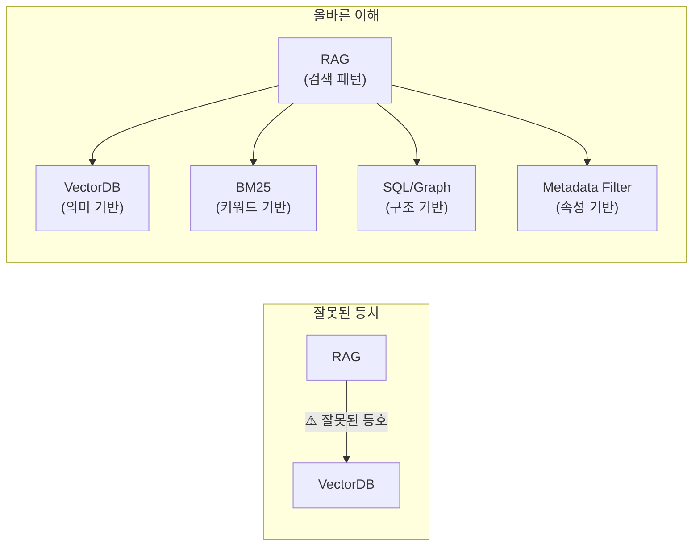

---

## 3. VectorDB는 왜 등장했고, 어떤 가치를 갖는가

온톨로지를 옹호하는 자료들은 VectorDB를 종종 "유사도 기반의 무지성 검색"이나 "의미적 연결을 놓치는 방식"으로 묘사한다. 그러나 이런 설명은 VectorDB가 등장하기 전에 세상이 어떠했는지를 의도적으로 짧게 다루는 경우가 많다.

VectorDB 이전 시대에 비정형 텍스트를 다루는 방법은 두 가지뿐이었다.

첫째, 자연어 처리로 키워드를 추출하고, 동의어를 매핑하고, 어간을 분리해서 동사 원형으로 찾는 키워드 매칭 방식이었다. "두통"으로 검색하면 "headache"라는 문서가 나오려면 이 둘이 동의어로 등록되어 있어야 했다.

둘째, SNOMED CT 같은 표준을 수작업으로 코딩하고 매핑하는 방식이었다. 전문가가 손으로 모든 관계를 입력해야 했다.

VectorDB(그리고 임베딩 모델)는 이 두 방식이 전혀 해결하지 못하던 문제를 풀었다. **사전에 아무 합의 없이, 의미만으로 검색을 가능하게 만든 최초의 도구**였다. "두통"으로 검색하면 "migraine", "headache", "두부 통증"이 담긴 문서가 모두 나오도록 해주는, 당시 기준으로는 마법 같은 도구였다.

포지셔닝을 명확히 하자면, **VectorDB는 비정형 데이터의 90%를 처음으로 풀어냈고, 온톨로지는 "합의 가능한" 10%를 더 정밀히 풀 뿐이다.** 10%를 더 잘 다루는 도구가 90%를 다루는 도구보다 우월하다는 논리는 성립하지 않는다.

---

## 4. 온톨로지란 무엇인가 — 그리고 무엇이 아닌가

온톨로지의 본질을 가장 쉽게 이해하려면 생물 분류 체계를 생각하면 된다. 호모 사피엔스는 종(Species) → 속(Genus) → 과(Family) → 목(Order) → 강(Class) → 문(Phylum) → 계(Kingdom)로 이어지는 체계로 분류된다. 이런 분류 체계가 바로 온톨로지다. 핵심은 이것이 **"모두가 합의한"** 분류 체계라는 점이다. 린네(Carl Linnaeus)가 혼자 정한 것이 아니라, 수백 년에 걸쳐 전 세계 생물학자들이 합의해온 체계다.

온톨로지의 기술적 정의로 들어가면, **"이 도메인에 어떤 종류의 것들이 존재할 수 있고, 어떤 종류의 관계가 가능한가"에 대한 메타 수준의 추상적 정의**다. OWL(Web Ontology Language)과 SPARQL은 이 추상을 표현하고 질의하기 위한 언어다.

반면 GraphDB는 이 온톨로지에 맞춰 실제 데이터를 넣는 **저장 수단**이다. 온톨로지가 "종은 속에 속한다"는 규칙을 정의한다면, GraphDB는 "호모 사피엔스 → 속함 → 호모속"이라는 실제 데이터를 담는 그릇이다.

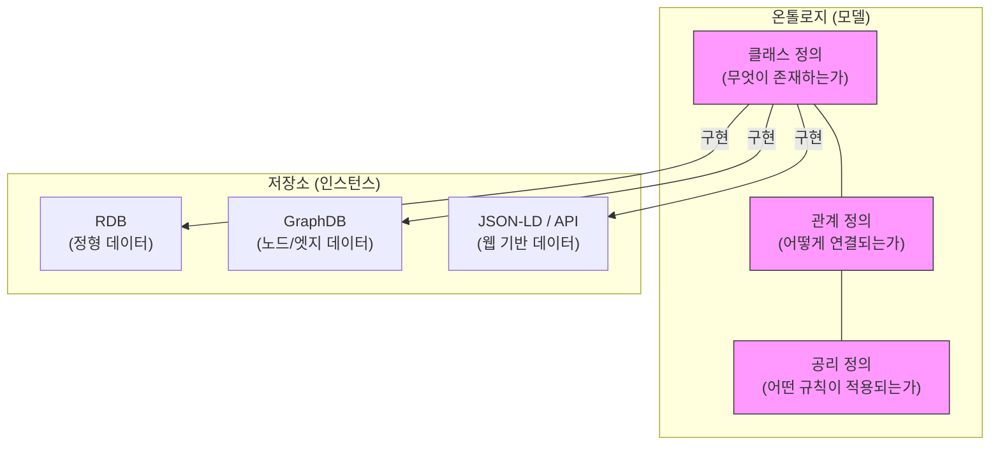

---

## 5. GraphDB ≠ 온톨로지 — 모델과 저장소의 차이

이 구분은 실무에서 매우 자주 혼동된다. SNOMED CT 같은 의료 표준은 RF2 포맷으로 배포되고, 병원 시스템에서는 RDB에 적재되는 경우가 많다. schema.org는 JSON-LD나 microdata로 웹 페이지에 들어간다. HL7 FHIR는 JSON과 REST API로 운영된다. 회계 계정과목은 ERP의 RDB에 산다.

즉, 그래프 DB에 저장하지 않아도 온톨로지(도메인 모델)는 얼마든지 존재한다. 반대로 Neo4j에 고객, 주문, 제품 노드를 넣었다고 자동으로 온톨로지가 생기는 것도 아니다. **그래프 DB는 저장소이고, 온톨로지는 모델이다.** 저장소는 쿼리 패턴과 운영 요건으로 고르는 것이다.

세 축을 정리하면 이렇다.

- **온톨로지** = 도메인 모델 (OWL 사용, 합의된 규칙)
- **GraphRAG** = 검색 백엔드가 그래프인 RAG 패턴
- **GraphDB** = 노드/엣지 저장소

세 축은 직교한다. OWL 없이도 GraphRAG가 가능하고, 스키마 없이도 GraphDB가 운영되며, VectorDB 위에 메타데이터 스키마를 얹어도 된다. 이 셋을 같은 선 위에 놓고 "온톨로지 → GraphDB → GraphRAG"로 이어지는 것처럼 설명하는 것은 오해를 낳는다.

---

## 6. 온톨로지는 합의된 도메인을 전제한다

온톨로지가 실제로 ROI를 내는 영역은 생각보다 훨씬 좁다. 그리고 그 좁음은 결함이 아니라 본분이다.

| 도메인 | 이유 |
|--------|------|
| 유전자 기능 분류 (Gene Ontology) | 수십 년간 전 세계 생물학자들이 합의를 쌓아온 강한 합의 |
| 약물 상호작용 | 닫힌 룰셋 — 새로운 규칙이 생기더라도 형식이 고정됨 |
| 행정 매핑 (ICD ↔ KCD) | 정부가 합의를 강제하는 영역 |
| 도서관 어휘 통제 (SKOS) | 합의를 만드는 것 자체가 직무인 사람들이 존재 |

이 영역들의 공통점은 두 가지다. **합의를 만드는 비용보다 합의가 주는 ROI가 크다는 것**, 그리고 **그 합의가 이미 대부분 만들어져 있다는 것**이다.

문제는 일반 기업이 "우리도 온톨로지를 만들겠다"고 할 때 발생한다. 부서마다 같은 개념을 다르게 인식하고 있다면, 그것부터 합의하는 작업이 선행되어야 한다. 이 합의 없이 진행하면 어떻게 되는가?

"이건 우리가 그렇게 안 부르는데"로 시작해서 클래스를 추가하고, 큰 합의는 회피하고, 이런 것들이 누적되다가, 나중에 변경 관리에서 진통을 겪고, 사장된 `.ttl` 파일과 사장된 거버넌스에 대해 위원회를 열고, 어떻게 레거시와 조율할지를 고민하게 된다. 이것이 온톨로지 프로젝트의 전형적인 실패 패턴이다.

---

## 7. 실제 현장의 비극 — 다학제 임상 사례로 본 OWL의 한계

온톨로지의 근본적 가정이 왜 실제 업무와 충돌하는지를 극적으로 보여주는 예시가 다학제 진료 환경이다. 다음 시나리오를 보자.

**환자 A, 65세 남성. 두통과 의식 저하로 응급실 내원.**

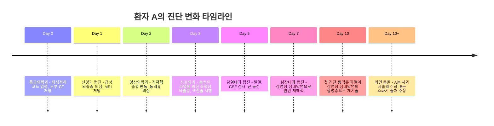

이 시나리오를 OWL로 모델링하려고 시도하면 다음과 같은 문제가 터진다.

**진단 상태**: OWL 표준에 없다. 별도 로직을 짜야 한다.

**시간**: RDF 트리플은 시간을 갖지 않는다. RDF-star 또는 reification으로 우회해야 한다.

**번복**: "새 사실은 기존 추론을 무효화하지 않는다"는 OWL의 단조 추론(Monotonic Reasoning) 가정과 충돌한다. 10일 차의 재진단은 3일 차의 진단을 무효화하는데, OWL은 이것을 처리하지 못한다.

**의견 충돌**: OWL의 개방 세계 가정(OWA) 하에서는 A의 주장과 B의 주장이 모두 참으로 존재하지만, 사건의 진실은 하나다.

**다학제 관점**: 신경과, 신경외과, 심장내과가 같은 이벤트를 다른 관점으로 기록한다. Perspective Ontology가 필요한데, 이것은 OWL 표준이 아니다.

결과는 뻔하다. 클래스를 추가하고 또 추가하다가, SNOMED 매핑이 실패하고, 시스템이 무효화되면서, 결국 노트 텍스트 검색, 즉 VectorDB나 Elasticsearch로 돌아가게 된다. 괜히 SNOMED CT 같은 것을 만들어 놓고 분류 어휘로만 활용하는 이유가 있었던 것이다. **워크플로우와 분류는 역할이 전혀 다르다.**

여기서 중간 결론이 하나 도출된다.

> **온톨로지는 의미 합의를 기록 시점에 고정한다. 그러나 실무 데이터는 합의가 기록 이후에 바뀐다. VectorDB + LLM은 이 합의를 질의 시점까지 미룬다.**

"이 환자 두통의 원인이 어떻게 변해왔나"라고 물으면, VectorDB 방식은 환자 ID + 시간으로 필터링하고, 의미 검색으로 관련 노트들을 가져오고, LLM이 시간순으로 내러티브를 만든다. 의사 두 명의 다른 의견은 원문에 살아있으니 LLM도 그대로 보여줄 수 있다. 새 진료과가 들어와도 임베딩만 추가하면 된다.

---

## 8. 사람들이 온톨로지라고 부르는 것의 진짜 정체

온톨로지에 관한 가장 깊은 혼동은 개념 적용에 있다. "우리 회사 데이터를 온톨로지로 정리했어요", "제품 카탈로그를 온톨로지로 구조화했어요"라는 문장에서 "온톨로지"가 가리키는 것은 모두 다르고, 그중 진짜 온톨로지는 사실상 0개에 가깝다.

판타지 소설 세계관을 예시로 살펴보자. 작가가 자신의 세계관을 Obsidian에 정리한다고 가정하면, 보통 이런 것들을 기록한다.

- "저그는 젤나가가 만들었다" → 인스턴스 사실
- "프로토스는 사이온 에너지를 사용한다" → 작품 내부 룰
- "7장에서 칼날여왕이 저그를 배신한다" → 사건 데이터

이것은 그래프로 그릴 수 있고, 인스턴스 그래프라고 부를 수 있다. 그러나 온톨로지는 아니다. 진짜 온톨로지에 가까운 것은 한 단계 위의 분류다.

- 판타지 장르 캐릭터 유형: 마법사, 전사, 치유자, 암살자
- 마법 시스템 유형: 원소 기반, 룬 기반, 계약 기반, 기억 기반
- 서사 구조 유형: 3막 구조, 영웅의 여정, 옴니버스 구조

**다른 작가와 다른 작품에도 재사용될 수 있다면 온톨로지에 가깝다. 한 작품 안에서만 통하면 인스턴스 그래프 또는 사전이다.**

마찬가지로, "우리 고객은 245만 명입니다"는 인스턴스 사실이고, "우리 회사에서는 가입 후 첫 결제까지 한 사람을 customer로 부릅니다"는 내부 정의다. 부서별 정의를 모아놓은 문서는 내부 사전(Internal Glossary) 또는 데이터 사전(Data Dictionary)이지 온톨로지가 아니다.

또한 실제 유명한 그래프 사례들을 들여다보면 OWL을 사용하지 않는 경우가 대부분이다.

- LinkedIn의 KG 정확도 향상 사례에서 사용한 KG는 이슈 티켓에서 LLM과 룰로 추출한 Property Graph다. OWL 추론을 하지 않는다.
- MS GraphRAG도 같은 패턴이다. LLM이 엔티티와 관계를 뽑고, Leiden 클러스터링을 하고, 요약으로 검색한다. OWL 표준이 없다.
- "온톨로지 자동 생성" 솔루션들의 대부분은 Neo4j 기반 그래프 + LLM 추출이다. Neo4j는 native OWL 추론을 지원하지 않는다.

---

## 9. 내부 사전 ≠ 온톨로지 — 재사용성이 기준이다

온톨로지와 내부 사전을 구분하는 기준은 단 하나, **재사용 가능성**이다.

다른 조직이 그대로 받아 써도 되는 분류 체계라면 온톨로지에 가깝다. 우리 조직 안에서만 통하는 정의 모음이라면 사전에 가깝다.

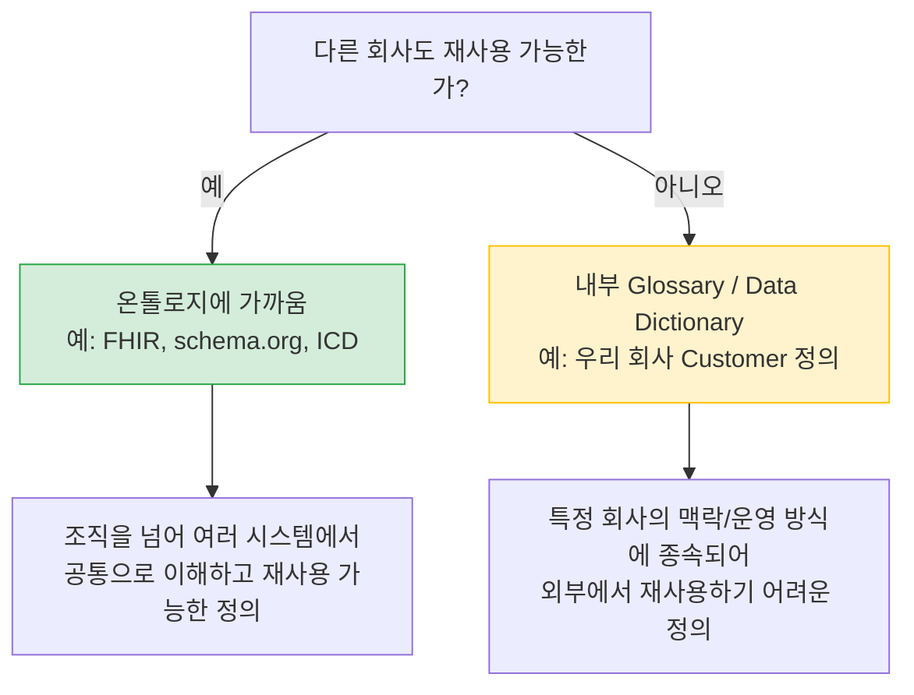

이 기준으로 보면, 대부분의 기업이 "온톨로지를 만들었다"고 할 때 실제로 만든 것은 내부 데이터 사전이다. 그리고 그것을 만드는 일도 충분히 가치 있다. 단지 그것을 온톨로지라고 부르면서 OWL 추론, GraphDB, SPARQL까지 끌어들이는 것이 과잉 투자의 시작이다.

---

## 10. 카드 혜택 예시로 본 온톨로지의 실제 구현

온톨로지가 어떤 것인지, 그리고 왜 생각보다 훨씬 복잡한지를 현실적인 예시로 살펴보자. "카드 혜택"을 다룬다.

현대카드 아멕스에는 이런 혜택이 있다. "공항철도 탑승권 연 12회." 그런데 사용 조건을 보면 50만 원 이상 해당 카드로 구매한 항공권에 대해 주게 되어 있고, 전월실적 50만 원 이상도 충족해야 한다.

이것을 단순히 `num공항철도` 같은 컬럼을 추가해서 관리하려고 생각하는 순간, 이미 방향이 틀린 것이다. 온톨로지는 처음에 짜는 것이 아니라, **있는 데이터를 해석하는 규칙 레이어**다. 저장 위치를 먼저 고민하고 있다면 이미 틀린 방향이다.

이 혜택을 온톨로지로 표현하면 다음과 같은 구조가 필요하다.

```
BenefitInstance
  - type: FeeWaiver / FreeAccess / FreeService
  - target: AirportTrain
  - eligibility:
      type: SpendThresholdRule
      spendMetric: PreviousMonthSpend
      operator: >=
      amount: 500000
      currency: KRW
      aggregationRule: PreviousMonthSpendDefinition_A
  - limit:
      type: MonthlyUsageLimit
      period: CalendarMonth
      maxCount: 1
  - validDuring: 2026Q1
```

여기서 "전월실적"이 단순하지 않다는 것이 드러난다. 이것은 단일 숫자가 아니다.

- 승인일 기준인가, 매입일 기준인가?
- 세금 포함인가, 세금 제외인가?
- 어떤 가맹점 유형이 포함되고, 어떤 유형이 제외되는가?

따라서 전월실적에 대한 별도 Canonical Definition이 필요하다.

```
PreviousMonthSpend
  = accordingTo: SpendAggregationRule_현대카드_2026Q1
  = period: previous calendar month
  = transactionDateBasis: approvalDate
  = includedTransactions: [...]
  = excludedTransactions: [...]
```

이렇게 하나의 혜택을 제대로 온톨로지화하는 데에도 상당한 구조가 필요하다. 혜택이 수십 개, 수백 개라면 이 복잡성은 선형이 아니라 기하급수적으로 증가한다.

그렇다면 실제 거래 1억 건을 그래프에 다 넣어야 하는가? 그럴 필요가 없다. 현실적인 저장 전략은 역할에 따른 분리다.

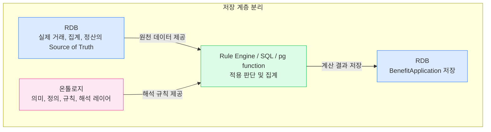

집계 처리에 대해서도 방법별 적합성이 다르다.

| 방법 | 적합한 경우 | 주의사항 |
|------|-------------|----------|
| Trigger | 단순 카운트/합계 보정 | 범위 이슈, 복잡한 혜택 판단에는 비추천 |
| pg function | 규칙 계산 캡슐화 | 버전 관리와 테스트가 필수 |
| Batch / Materialized View | 전월실적, 월 한도, 누적 사용액 | 주기 설정과 누락 처리 필요 |
| Rule Engine | 혜택 조건이 자주 바뀌는 경우 | 별도 인프라 운영 비용 발생 |

---

## 11. 3가지 접근법 비교 — 실무 결재 전에 볼 표

아래는 온톨로지(OWL/SPARQL), Property Graph(Neo4j 등), VectorDB + LLM(Hybrid RAG) 세 접근법을 실무 관점에서 비교한 표다.

| 항목 | 온톨로지 (OWL/SPARQL) | Property Graph (Neo4j 등) | VectorDB + LLM (Hybrid RAG) |
|------|----------------------|--------------------------|------------------------------|
| **초기 구축** | 도메인 전문가와 온톨로지 엔지니어가 필요. 보통 수개월 단위 | 데이터 모델링과 ETL이 필요. 관계 탐색이 명확할 때 적합 | 원문 적재, 임베딩, 검색, rerank부터 시작 가능. 첫 결과가 빠름 |
| **입력 매핑** | 표준 코드와 내부 데이터를 매핑해야 함. 사람 입력 누락이 생기기 쉬움 | 노드 타입과 엣지 타입 정의가 필요. 운영 중 schema drift가 생김 | 원문을 유지한 채 metadata만 붙여 시작 가능 |
| **변경 비용** | 클래스와 규칙 변경이 reasoner, 매핑, 거버넌스를 건드림 | 노드/엣지 타입 변경과 재처리 비용이 있음 | 문서 변경분 재임베딩과 index 갱신이 중심 |
| **운영 인력** | 거버넌스와 모델 관리자가 계속 필요 | 데이터 엔지니어와 graph 모델 관리가 필요 | 검색 품질 평가, 권한, 모니터링 운영이 핵심 |
| **잘 맞는 영역** | 표준 분류, 닫힌 룰셋, 규제 보고, 코드 매핑 | 사기 탐지, 계정 관계, 공급망, 깊은 path traversal | 비정형 문서 검색, QA, 지식 검색, 업무 assistant |
| **결재 회의 인상** | 엄밀하지만 무겁게 보임 | 시각적으로 강함 | 덜 화려하지만 사용자 앞 결과가 빠름 |

---

## 12. 그래프 시각화의 함정 — 멋있음과 최선은 다른 말이다

그래프 데모는 강렬하다. 가운데 고객 노드가 있고, 제품, 계약, 티켓, 문서, 담당자가 빛처럼 연결되며, 마우스를 올리면 노드가 움직인다. 임원 회의에서 이런 화면은 강한 설득력을 발휘한다.

반면 임베딩 공간을 UMAP으로 시각화하면 분석가에게는 의미 있는 군집이지만, 결재권자에게는 그냥 점처럼 보인다. 이 미적 차이가 실제 의사결정에 영향을 준다. 그래서 더 조심해야 한다.

운영 환경에서 그래프 시각화는 생각보다 빨리 한계에 부딪힌다.

- 100개 노드를 넘으면 화면이 복잡해진다.
- 실제 시스템은 최소 수백만 노드이고, 사용자는 대개 그래프를 직접 보지 않는다. 검색 결과, 답변, 알림, 업무 화면을 본다.
- 실제 query는 1~2 hop인 경우가 많다. 이 정도는 SQL JOIN과 metadata filter로도 더 빠르고 정확하다.
- "회사", "고객", "문서" 같은 hub node에 모든 것이 연결되면 traversal 결과가 빠르게 넓어진다.

물론 그래프가 진짜 필요한 영역이 있다. 사기 탐지, 자금세탁, 권한 전파, 공급망 리스크처럼 **깊은 관계 탐색이 비즈니스 로직의 핵심인 영역**에서는 그래프가 강하다. 다만 "그래프가 멋있다"와 "우리 운영 문제의 최선 해결책이다"는 전혀 다른 문장이다.

---

## 13. 당신의 회사에는 무엇이 필요한가

온톨로지가 필요한 회사는 분명히 있다. 다만 범위가 좁다.

**온톨로지가 진지하게 검토될 수 있는 조건**:

- 의약품 데이터베이스, 화학물질 카탈로그, 생물학 표준 어휘 같은 영역을 핵심으로 다루는 회사
- ICD, KCD, FHIR, HS 코드처럼 **외부 표준이 이미 존재하는** 영역
- 닫힌 룰셋 추론이 핵심인 경우 (이때도 OWL보다 SHACL, 룰 엔진, RDB constraint가 더 실용적일 가능성이 높다)

**대부분의 일반 기업이 해당하는 영역**:

- 일반 기업 지식 검색
- 사내 문서 QA
- 고객 지원 assistant
- 영업 enablement
- 정책 검색

이런 문제라면 **Hybrid RAG부터 시작**하는 것이 맞다. 먼저 산업 표준이 있는지 확인하고, 있으면 재사용하고, 부족한 부분만 작게 확장하는 전략이 현실적이다.

---

## 14. 먼저 해야 할 7단계 — 작고 지루하지만 맞는 순서

대부분의 회사가 지금 해야 할 일은 더 작고 덜 화려하다.

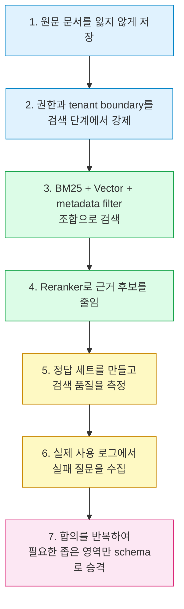

이 순서가 맞다. **처음부터 모든 의미를 고정하려고 하지 마라.** 의미가 안정적으로 반복되는 곳이 보일 때만 그 부분을 모델 레벨로 올리면 된다.

온톨로지는 좋은 도구다. 다만 모든 데이터 문제의 출발점은 아니다. 특히 AI 시대에는 "의미를 미리 완전히 합의한다"보다 "원문을 보존하고, 검색으로 근거를 모으고, 질의 시점에 설명한다"가 더 빨리 작동하는 경우가 많다.

---

## 핵심 요약

| 핵심 명제 | 내용 |
|-----------|------|
| 온톨로지 = 합의된 규칙 | 혼자 쓰면 온톨로지가 아님. 자주 바뀌어서도 안 됨 |
| 온톨로지 ≠ GraphRAG | GraphRAG와 온톨로지는 직교하는 개념 |
| RAG ≠ VectorDB | RAG는 검색 패턴, VectorDB는 백엔드 중 하나 |
| 내부 사전 ≠ 온톨로지 | 재사용성이 기준. 우리 회사에서만 통하면 사전 |
| 대부분의 경우 | Hybrid RAG (BM25 + Vector + metadata)로 98%는 커버 가능 |

---

---

# 부록: Hybrid RAG 아키텍처 상세 — BM25 + RDB + GraphRAG + Vector RAG

> Hybrid RAG는 "RAG = VectorDB 하나"라는 오해를 넘어서, 다양한 검색 방법을 병렬로 실행하고, Rerank로 통합하여 LLM에게 최선의 컨텍스트를 제공하는 아키텍처다.

---

## A. 왜 Hybrid RAG인가 — 단일 검색의 한계

각 검색 방식은 저마다 맹점이 있다.

| 검색 방식 | 강점 | 약점 |
|-----------|------|------|
| **BM25** (키워드) | 정확한 용어, 고유명사, 법령 조항 매칭 | 의미적 유사어 탐지 불가 |
| **Vector** (의미) | 유의어, 맥락, 개념적 유사성 탐지 | 정확한 키워드 매칭 취약 |
| **RDB** (정형) | 집계, 필터, 수치 연산이 정확 | 비정형 텍스트 처리 불가 |
| **GraphRAG** (관계) | 다단계 관계 추론, 커뮤니티 요약 | 단순 검색에는 과잉 비용 |

실증 수치를 보면, BM25 단독 Recall이 약 0.72, Hybrid(BM25 + Vector)의 Recall이 약 0.91로, 하이브리드가 단일 방식보다 현저히 높다. 이것이 Hybrid RAG가 현재 프로덕션 표준이 된 이유다.

---

## B. Hybrid RAG 전체 아키텍처

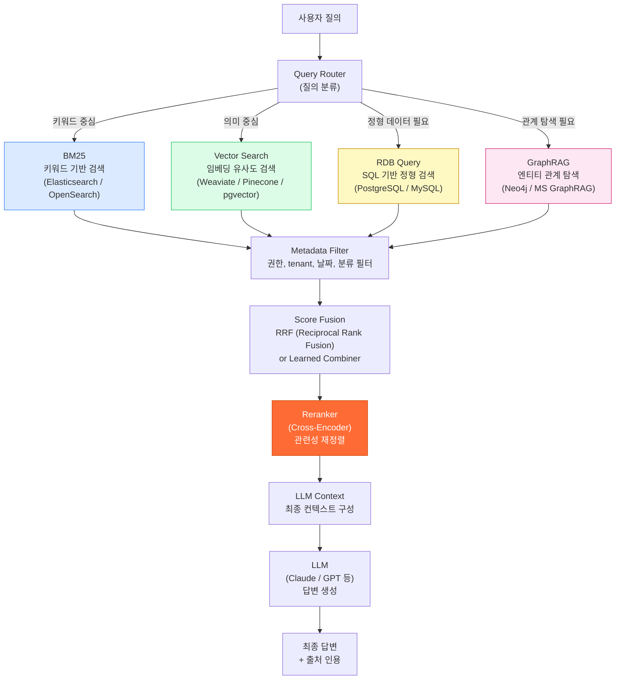

---

## C. BM25 레이어 — 키워드 기반 검색의 역할

BM25(Best Match 25)는 TF-IDF를 개선한 확률적 랭킹 함수로, 문서 내 단어 빈도와 문서 길이를 고려한다. 핵심 공식은 다음과 같다.

$$\text{BM25}(d,q) = \sum_{i=1}^{n} \text{IDF}(q_i) \cdot \frac{f(q_i, d) \cdot (k_1 + 1)}{f(q_i, d) + k_1 \cdot (1 - b + b \cdot \frac{|d|}{\text{avgdl}})}$$

BM25가 Vector Search보다 우수한 영역이 존재한다.

- 법령, 규정, 의료 코드 등 **정확한 용어 매칭**이 중요한 문서
- 제품 코드, SKU, 고유명사처럼 의미보다 **정확한 철자**가 중요한 경우
- "Regulation XYZ"처럼 **특정 표현을 명시적으로 포함한 문서**를 찾아야 하는 경우

프로덕션 구현에서는 Elasticsearch 또는 OpenSearch의 내장 BM25를 활용하거나, Weaviate처럼 BM25와 Vector Search를 모두 지원하는 벡터 DB를 사용한다.

---

## D. Vector Search 레이어 — 의미 기반 검색의 역할

임베딩 모델(OpenAI ada, Cohere Embed, BGE 등)이 텍스트를 고차원 벡터로 변환하고, 코사인 유사도나 dot product로 근접한 벡터를 찾는다. HNSW(Hierarchical Navigable Small World) 알고리즘으로 효율적인 근사 최근접 이웃 탐색을 수행한다.

Vector Search가 BM25보다 우수한 영역:

- "두통"으로 검색해서 "cephalalgia", "migraine", "두부 통증" 등 유의어가 담긴 문서를 찾는 경우
- 자연어로 개념을 질의할 때 ("재무 리스크를 줄이는 전략이 뭐가 있나")
- 다국어 환경 (multilingual embedding으로 한국어 질의 → 영문 문서 검색)

---

## E. RDB 레이어 — 정형 데이터와의 통합

많은 기업의 핵심 데이터는 여전히 RDB에 있다. 매출, 재고, 사용자 프로필, 트랜잭션 기록 등이다. Hybrid RAG에서 RDB는 두 가지 방식으로 참여한다.

첫째, **Metadata Filter**로서 권한, 날짜 범위, 카테고리, tenant 경계를 검색 단계에서 강제한다. 이것은 보안과 정확성 모두에 필수다.

둘째, **직접 SQL 쿼리**로 집계 데이터를 가져온다. "지난 분기 매출 상위 10개 제품"은 Vector Search로 찾을 수 없다. SQL로 계산해서 LLM 컨텍스트에 넣어야 한다.

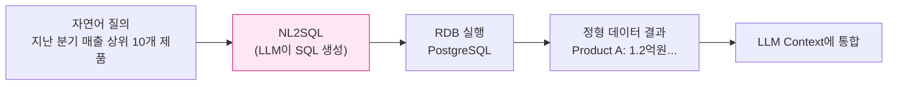

---

## F. GraphRAG 레이어 — 관계 탐색이 필요한 경우

GraphRAG는 MS Research가 2024년에 발표한 접근법으로, LLM이 원문에서 엔티티와 관계를 추출하여 그래프를 구성하고, Leiden 알고리즘으로 커뮤니티를 클러스터링한 뒤, 각 커뮤니티의 요약을 검색 인덱스로 활용한다. OWL을 사용하지 않는다는 점이 중요하다.

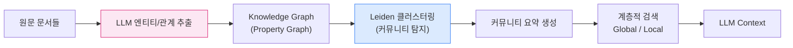

GraphRAG가 효과적인 경우:

- 100,000개 이상의 문서에 걸친 **글로벌 요약**이 필요한 질의 ("이 회사의 주요 리스크 요인은 전반적으로 무엇인가")
- 여러 문서에 흩어진 엔티티 관계를 추적해야 하는 경우
- 사기 탐지, 공급망 리스크처럼 다단계 관계 추론이 핵심인 경우

반면 단순 사실 조회나 1~2 hop 관계는 BM25 + Vector + SQL 조합이 더 빠르고 저렴하다.

---

## G. Score Fusion — 다수의 결과를 통합하는 방법

각 검색 레이어에서 나온 결과들을 어떻게 통합하는가? 가장 널리 쓰이는 방법이 **RRF(Reciprocal Rank Fusion)** 이다.

$$\text{RRF}\_\text{score}(d) = \sum_{i} \frac{1}{k + \text{rank}\_i(d)}$$

여기서 $k$는 보통 60으로 설정하며, 각 검색 결과에서 문서 $d$의 순위가 높을수록 높은 점수를 받는다. RRF는 서로 다른 검색 방식의 점수를 정규화 없이 결합할 수 있어서 실용적이다.

---

## H. Reranker — 품질을 결정하는 마지막 관문

Hybrid RAG에서 단일 최대 ROI 개선 지점은 Reranker다. Cross-Encoder 방식의 Reranker는 (질의, 문서) 쌍을 동시에 보고 관련성을 정밀하게 평가한다. Bi-Encoder(임베딩 모델)보다 훨씬 정확하지만 느리기 때문에, 상위 50~100개 후보를 추려낸 뒤 10~20개로 줄이는 단계에서 사용한다.

대표적인 Reranker 모델로는 Cohere Rerank, BGE Reranker, ms-marco-MiniLM 계열 등이 있다.

---

## I. 실제 프로덕션 사례

**LinkedIn**: 이슈 티켓에서 LLM으로 엔티티/관계를 추출한 Property Graph 기반 KG로 검색 정확도를 향상시켰다. 해결 시간을 28.6% 단축했다는 결과가 있다.

**DoorDash**: 배달원 지원을 위한 RAG 시스템에서 BM25 + Vector Hybrid 방식을 운영한다.

**Royal Bank of Canada**: 수천 명의 뱅킹 전문가를 지원하는 Arcane 시스템을 Hybrid RAG로 구축했다.

---

## J. Hybrid RAG 도입 로드맵

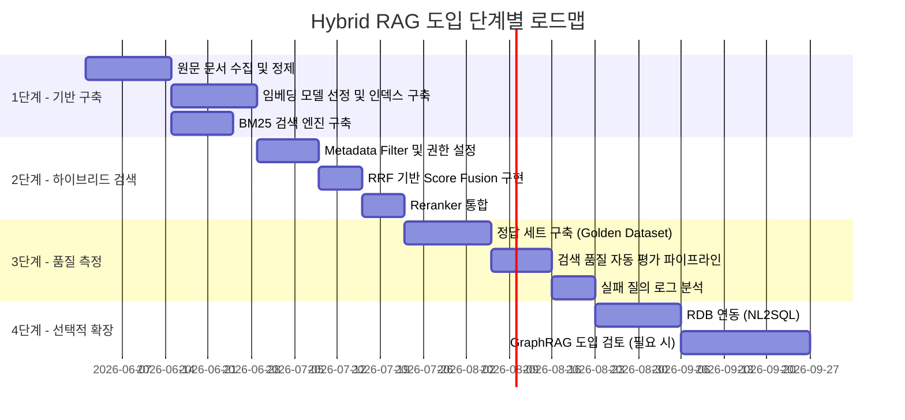

---

## K. 최종 정리 — 무엇을 언제 쓰는가

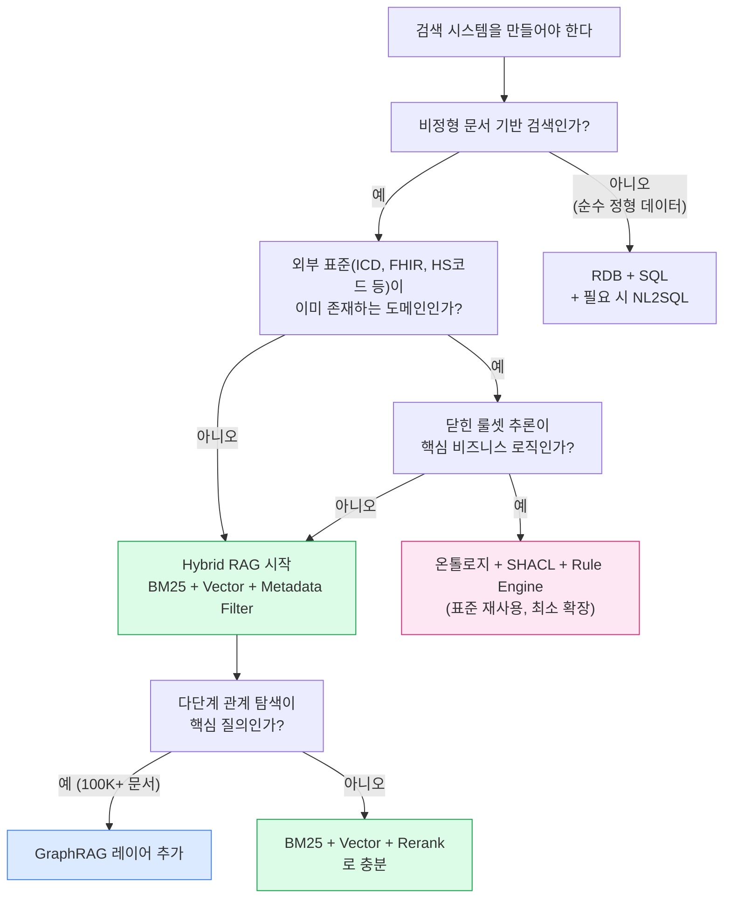

**대부분의 기업은 이 플로우에서 "Hybrid RAG 시작" 경로로 가야 한다.** 온톨로지는 이 플로우에서 좁은 조건이 충족될 때만 의미 있는 선택지가 된다.

---

*작성일: 2026-05-12*
