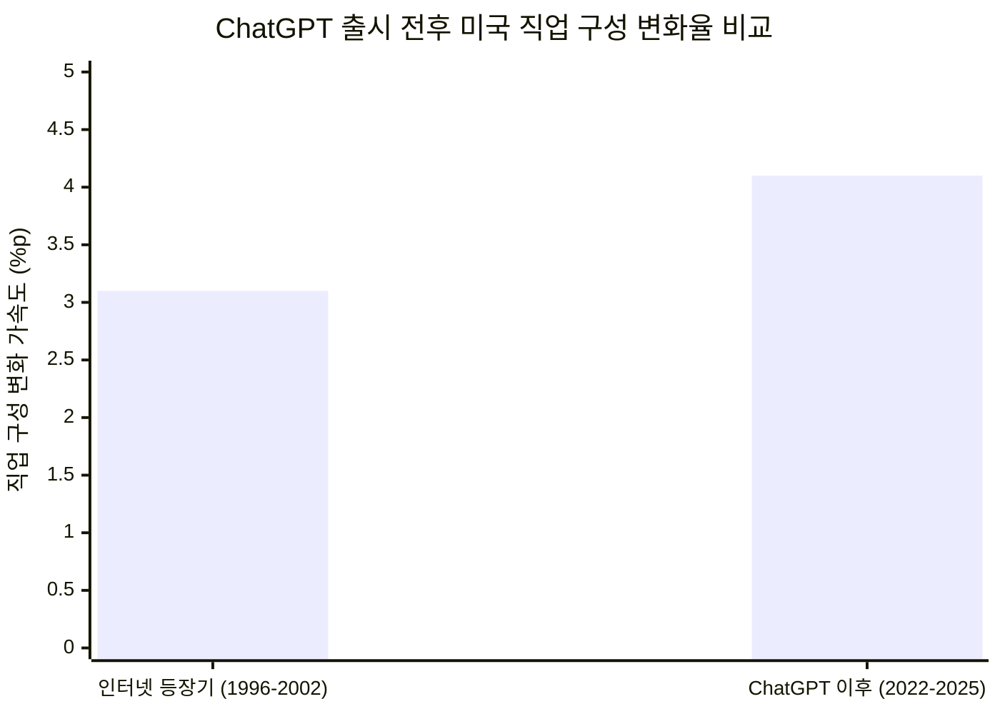
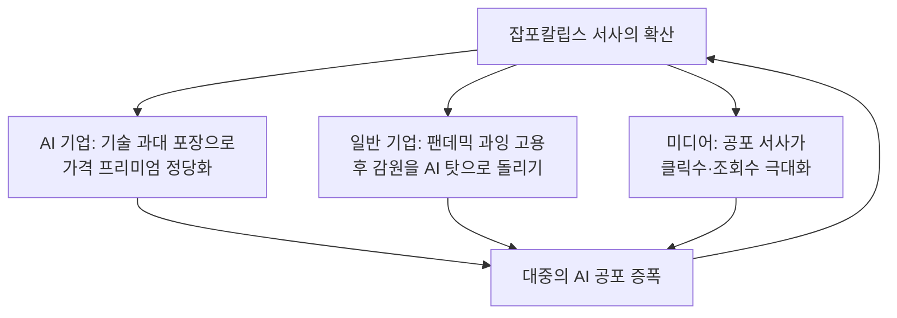
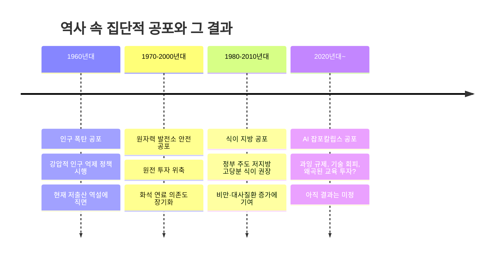
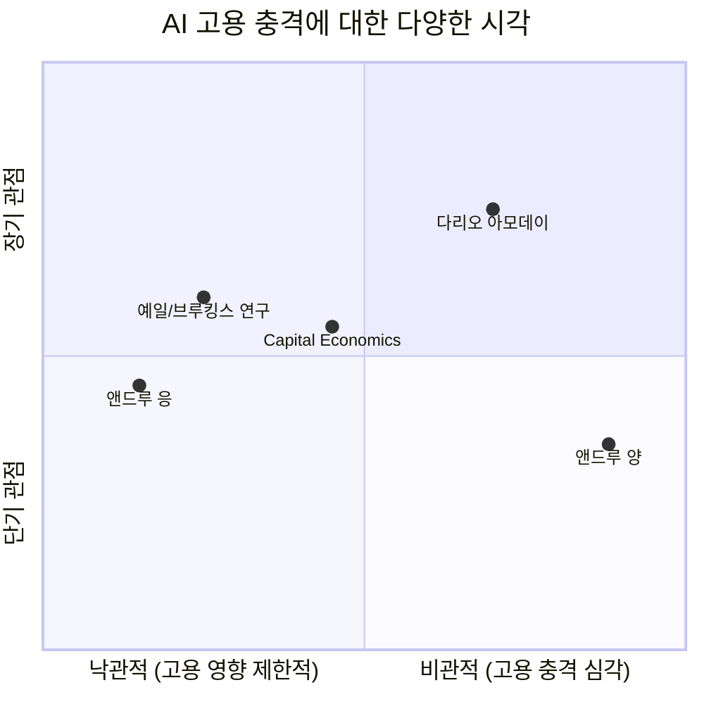
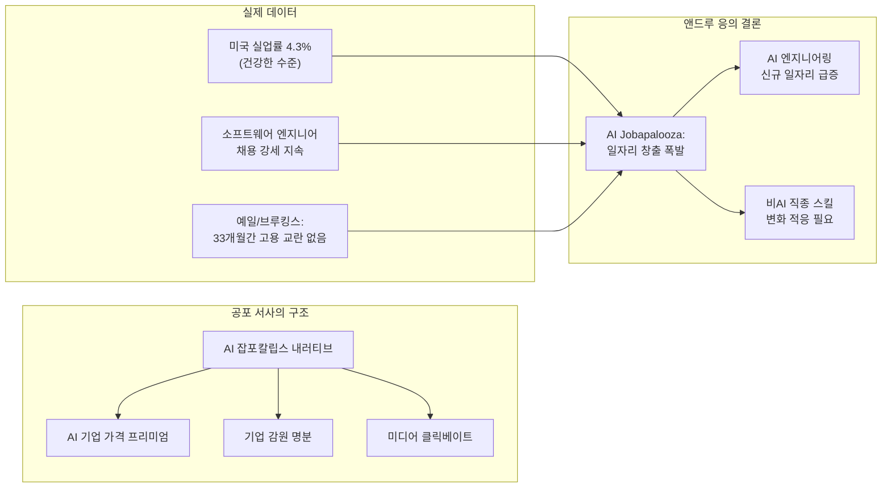

## 앤드루 응(Andrew Ng)의 ["AI 잡포칼립스는 없다"](https://x.com/andrewyng/status/2054236506756370865) 완전 분석

---

## 1. 이 글의 배경: 누가, 어디서, 왜 이런 말을 했나

2025년 5월, AI 분야에서 가장 영향력 있는 인물 중 하나인 **앤드루 응(Andrew Ng)** 이 자신의 X(구 트위터) 계정과 뉴스레터 《The Batch》에 도발적인 주장을 게재했다. 핵심 메시지는 단 한 문장으로 요약된다.

> **"AI로 인한 대규모 실업은 없을 것이다(There will be no AI jobpocalypse)."**

이 발언이 왜 주목받는지 이해하려면 먼저 앤드루 응이 어떤 사람인지, 그리고 그가 발언한 플랫폼이 무엇인지를 파악해야 한다.

### 앤드루 응은 누구인가

앤드루 응은 AI 업계에서 "건국의 아버지" 격으로 불리는 인물이다. 그의 이력은 다음과 같다.

- **Google Brain 창립 리드**: 구글을 현대적 AI 기업으로 탈바꿈시키는 데 핵심적인 역할을 했다.
- **Baidu 수석 과학자**: 중국 최대 IT 기업의 AI 전략을 총괄하는 1,300명 규모의 팀을 이끌었다.
- **스탠퍼드 대학교 AI 연구소 소장**: 세계 최고 수준의 AI 연구소를 운영했다.
- **Coursera 공동 창업자**: 전 세계 수천만 명에게 온라인 교육을 제공하는 플랫폼을 만들었다.
- **DeepLearning.AI 창립자**: 800만 명 이상이 수강한 AI 교육 플랫폼을 운영 중이다.
- **AI Fund 운영 파트너**: AI 기반 스타트업을 공동 창업하는 벤처 스튜디오를 이끌고 있다.
- 2023년 **TIME 100 AI** 선정, 세계에서 가장 영향력 있는 AI 인물로 공인받았다.

한마디로, 앤드루 응은 AI 기술 자체를 가장 깊이 이해하는 동시에, 그것이 사회와 노동시장에 미치는 영향을 가장 오래 고민해온 사람 중 하나다.

### 《The Batch》란 무엇인가

이번 발언이 실린 《The Batch》는 DeepLearning.AI가 매주 발행하는 AI 뉴스레터다. 단순한 뉴스 요약이 아니라, 매 호마다 앤드루 응의 친필 편지(Letter from Andrew)가 포함되어 있어 그의 AI 철학을 직접 접할 수 있는 창구로 여겨진다. 엔지니어, 경영진, 연구자 등 수십만 명의 독자가 구독하는 이 뉴스레터에서 앤드루 응은 AI 업계의 과장된 서사에 지속적으로 비판적 시각을 견지해왔다.

---

## 2. 핵심 주장: "잡포칼립스(Jobpocalypse)" 서사는 왜 틀렸나

### "잡포칼립스"란 무엇인가

"잡포칼립스(Jobpocalypse)"는 "일자리(Job)"와 "묵시록(Apocalypse)"을 합친 조어로, AI로 인해 대규모 실업이 발생하고 노동시장이 붕괴된다는 시나리오를 가리킨다. 이 단어가 일상적으로 쓰일 만큼, AI로 인한 일자리 소멸 공포는 이미 대중 담론의 주류를 이루고 있다.

앤드루 응은 이 서사가 "불필요한 공포를 부추기는 무책임하고 해로운 이야기"라고 직격한다.

### 데이터가 말하는 현실

앤드루 응의 주장에서 가장 중요한 근거는 데이터다. 그가 제시한 두 가지 핵심 사실은 다음과 같다.

**첫째, AI 도구의 영향을 가장 많이 받는 소프트웨어 엔지니어 채용은 오히려 강세를 유지하고 있다.**

코딩 에이전트가 빠르게 발전하고 있음에도 불구하고, 소프트웨어 엔지니어 채용 시장은 건재하다. 가장 많은 타격을 입어야 할 분야에서 오히려 인력 수요가 꺾이지 않고 있다는 것이다.

**둘째, 미국 실업률은 4.3%로 건강한 수준을 유지하고 있다.**

이 수치는 통상적으로 "완전 고용"에 가까운 것으로 평가된다. AI가 대규모로 일자리를 빼앗고 있다면, 실업률이 이렇게 낮게 유지될 수 없다.

이 두 가지 사실을 바탕으로 앤드루 응은 "일자리 파괴보다 일자리 창출이 훨씬 크다는 추세가 강력하게 시사된다"고 결론짓는다. 그것도 "이전의 기술 혁신 파도들과 마찬가지로."

### 예일대·브루킹스 연구소의 독립적 확인

앤드루 응의 주장은 학술 연구로도 뒷받침된다. 2025년 10월, **예일대 Budget Lab과 브루킹스 연구소**는 ChatGPT 출시 이후 33개월간의 노동시장 데이터를 분석한 보고서를 발표했다. 결론은 명확했다.

> "ChatGPT 출시 이후 전체 경제 수준에서 뚜렷한 고용 교란이 발견되지 않았다."

더 구체적으로, 현재 노동시장에서 나타나는 직업 구성 변화의 상당 부분은 ChatGPT가 등장하기 이전인 2021년부터 이미 진행되고 있었다는 사실도 확인됐다. "AI 노출 정도, 자동화 가능성, 업무 증강 측면 어느 것도 현재 고용 또는 실업 변화와 유의미한 상관관계를 보이지 않는다"는 것이 연구진의 결론이다.

> **주**: 브루킹스 연구 결과, ChatGPT 이후의 직업 구성 변화 속도는 인터넷 등장 시기보다 약 1%p 빠른 수준에 불과하다. "혁명적 변화"와는 거리가 멀다.

---

## 3. 왜 "잡포칼립스" 서사가 이토록 인기를 끄는가

앤드루 응은 단순히 "틀렸다"고 말하는 것에서 그치지 않는다. 이 서사가 왜 이렇게 널리 퍼졌는지를 세 가지 구조적 이유로 설명한다. 이 부분이 특히 날카롭다.

### 이유 1: 프런티어 AI 기업들의 과장 마케팅

최첨단 AI 연구를 수행하는 기업들은 자신의 기술을 최대한 강력하게 포장할 강한 동기를 갖고 있다.

논리는 단순하다. "우리 AI가 수많은 직원을 대체할 수 있다"는 이야기가 설득력 있게 들릴수록, 기술의 가치는 올라간다. 극단적인 경우, 일부 기업들은 "AI의 지배"나 "AI로 인한 인류 멸종"과 같은 공상과학적 시나리오까지 내세운다. 기술이 강력할수록 두려워해야 하고, 두려워할수록 비싼 값을 치러야 한다는 논리 구조다.

### 이유 2: AI 기업의 가격 책정 전략

앤드루 응은 이 부분에서 AI 산업의 비즈니스 모델을 정면으로 해부한다.

일반적인 SaaS 소프트웨어의 구독료는 연간 사용자당 $100~$1,000 수준이다. 그런데 어떤 AI 회사가 "우리 솔루션이 연봉 $100,000짜리 직원을 대체할 수 있다"거나 "50% 생산성을 높여준다"고 주장한다면, $10,000짜리 연간 구독료도 오히려 저렴하게 느껴진다. 비교 기준을 소프트웨어 가격이 아닌 직원 연봉으로 바꾸는 순간, 가격 체계 자체가 달라지는 것이다.

다시 말해, "AI가 사람을 대체한다"는 서사는 AI 기업들이 SaaS 시장의 상식을 뛰어넘는 고가 구독료를 정당화하기 위한 근거가 된다.

### 이유 3: 기업들의 감원 명분 돌리기

기업들도 AI 과장에 한몫하고 있다. 앤드루 응은 이 구조를 냉소적으로 꼬집는다.

팬데믹 시기, 유동성이 넘치고 금리가 낮으며 정부 재정 지원이 쏟아지던 시절에 많은 기업들이 필요 이상으로 직원을 채용했다. 이후 금리가 오르고 경기가 조정되면서 그 잉여 인력을 정리해야 하는 상황이 됐다. 그런데 "우리가 과잉 고용을 했다"고 인정하는 것보다 "AI 효율화로 더 적은 인원으로 더 많은 성과를 낸다"고 말하는 편이 훨씬 그럴듯하게 들린다. AI는 경영진의 실수를 덮어주는 완벽한 구실이 된다.

이 세 가지 힘이 서로를 강화하며 "잡포칼립스" 서사를 계속 재생산하는 구조다.

---

## 4. 역사적 유사 사례: 집단적 공포가 정책을 망친 세 가지 사례

앤드루 응이 AI 담론에 특히 예리한 비판적 시각을 던지는 지점은, 이 현상을 역사적 맥락에서 바라보는 시각이다. 그는 인류가 이미 유사한 집단적 공포 서사를 경험했고, 그것이 실제 정책에 심각한 해악을 끼쳤다는 사실을 세 가지 사례로 설명한다.

### 사례 1: 원자력 발전소 안전에 대한 과도한 공포

공중의 원자력 발전소 안전에 대한 과장된 불안감은, 수십 년간 원자력 발전에 대한 투자 부족으로 이어졌다. 그 결과 많은 국가들이 탄소 배출량이 많은 화석 연료에 더 오래 의존하는 아이러니한 결과를 낳았다. 공포가 현실보다 앞서간 사례다.

### 사례 2: 1960년대 "인구 폭탄" 공포

1960년대에는 인구 과잉으로 인류가 멸망할 것이라는 "인구 폭탄(Population Bomb)" 담론이 유행했다. 이는 다수 국가가 강압적인 인구 감소 정책을 시행하는 근거가 됐다. 그러나 실제로 인류는 식량 생산 기술 발전 등으로 이 위기를 넘겼으며, 지금 많은 나라가 오히려 인구 감소로 고통받고 있다.

### 사례 3: 식이 지방에 대한 공포와 고당분 식이 정책

지방 섭취가 심장 질환을 유발한다는 공포는 여러 정부가 수십 년간 저지방·고당분 식이를 권장하는 결과를 낳았다. 역설적으로 이는 비만 및 대사질환 증가에 기여한 것으로 현재 평가받고 있다. 과학적 근거보다 사회적 공포가 정책을 앞질러 나간 사례다.

앤드루 응의 요점은 명확하다. **사회는 현실과 거의 무관한 서사를 수년간 믿을 수 있으며, 그것이 사회 전반의 잘못된 의사결정으로 이어진다.** AI 잡포칼립스도 그 구조가 유사하다는 것이다.

---

## 5. 반론: "AI 잡포칼립스"를 주장하는 목소리도 있다

앤드루 응의 주장이 학계 데이터와 맞닿아 있는 것은 사실이지만, 반대 편에서도 무시하기 어려운 목소리가 나오고 있다. 공정한 이해를 위해 반론도 정리한다.

**전 미국 대선 후보 앤드루 양(Andrew Yang)** 은 2026년 초에 "AI 잡포칼립스는 이미 현실"이라고 경고하며, 18개월 내에 수백만 명의 화이트칼라 노동자가 직업을 잃을 것이라고 주장했다.

**Anthropic CEO 다리오 아모데이(Dario Amodei)** 도 2025년 5월 언론 인터뷰에서 AI가 향후 5년 내 초급 화이트칼라 일자리의 절반을 없앨 수도 있다고 발언했다.

**Capital Economics**의 분석(2025년 11월)은 중간 지점의 관점을 제시한다. "초급 직업 시장의 악화는 AI 잡포칼립스의 시작이라는 우려를 낳는다. AI가 기여 요인이긴 하지만, 주요 원인은 아닌 것으로 판단된다"고 분석했다.

예일대·브루킹스 연구도 중요한 단서를 남겼다. "이 연구는 'AI가 노동을 교란하지 않을 것'과 'AI가 아직 교란하지 않았다' 사이를 구분할 수 없다"는 점을 인정한다. 즉, 지금까지는 명백한 교란이 없었지만, 미래에 대한 보장은 아니라는 것이다.

---

## 6. 앤드루 응의 역제안: "AI 잡아팔루자(Jobapalooza)"

이 글에서 가장 인상적인 부분은 앤드루 응이 단순히 공포를 부정하는 데 그치지 않는다는 점이다. 그는 정반대의 현상, 즉 **AI로 인한 일자리 창출 폭발**이 올 것이라고 역제안한다. 그 이름이 "**AI 잡아팔루자(AI Jobapalooza)**" 다. "잡포칼립스"를 정면 반박하며 만들어진 조어로, '일자리의 축제'라는 의미다.

그의 근거는 다음과 같다.

첫째, AI 엔지니어링 분야에서 좋은 일자리가 대규모로 창출될 것이다. 이 일자리들은 전통적인 대형 IT 기업뿐만 아니라 훨씬 넓은 분야의 기업에서 만들어질 것이다.

둘째, AI가 아닌 분야의 일자리도 AI로 인해 요구 역량이 달라질 것이다. 직업이 사라지는 것이 아니라, 일하는 방식과 필요한 스킬이 변한다는 것이다.

따라서 지금은 더 많은 사람이 AI에 능숙해질 수 있도록 장려하고, 미래의 다양하고 풍부한 일자리를 위해 준비시켜야 할 때라는 것이 그의 결론이다.

실제로 앤드루 응은 DeepLearning.AI를 통해 800만 명 이상의 사람들에게 AI 교육을 제공하고 있으며, 2025년에는 개인의 AI 역량 진단 도구인 'Skill Builder'를 출시하기도 했다. 이 발언은 단순한 낙관론이 아니라, 그가 실제로 실행하고 있는 전략이기도 하다.

---

## 7. 중국어권의 반응: 같은 메시지, 다른 강조점

흥미롭게도, 앤드루 응의 원문을 [중국어로 요약한 게시물(첨부 문서의 두 번째 내용)](https://x.com/dotey/status/2054256272740864294)에서는 몇 가지 부분이 더 부각된다.

**가격 전략 분석의 부각:** 중국어 요약본은 "SaaS 구독료 대비 직원 연봉으로 가격을 재앙의 기준점으로 삼는다"는 비즈니스 논리를 특히 강조한다. 이는 AI 솔루션 기업들이 "직원 대체"라는 프레이밍을 통해 고가 책정을 정당화하는 구조를 꿰뚫는 날카로운 시각이다.

**역사적 비유의 공감:** 핵 안전 공포, 인구 폭탄, 식이 지방 공포에 대한 비유를 "황당하게 들리지만, 당시에는 매우 유행했고 수많은 사람의 삶에 실질적 영향을 미쳤다"고 부연 설명한 것은, 역사적 비유에 대한 동양 독자의 맥락 이해를 돕는 역할을 한다.

**실천적 메시지의 강조:** 중국어 요약본은 마지막에 "지금이 AI 산업에 진입하거나 AI 도구를 익히기에 가장 좋은 시기"라는 행동 지침을 전면에 내세운다. 이는 원문의 결론을 보다 직접적인 실행 권고로 전환한 것이다.

---

## 8. 핵심 정리 및 독자를 위한 시사점

앤드루 응의 주장을 정리하면 다음과 같다.

마지막으로, 앤드루 응 본인의 말을 직접 인용한다.

> "AI가 사람들의 일하는 방식을 많이 바꾸고 있다는 것은 사실이다. 이것은 힘들고, 스트레스받는 일이다. 나는 영향받는 모든 사람에게 공감한다. 그러나 동시에, 이것은 노동시장 붕괴를 예측하는 것과는 전혀 다른 이야기다."

공포를 인정하면서도, 그것이 실제 데이터와 동떨어진 과장된 서사임을 구분하는 것. 그것이 앤드루 응이 이 글에서 말하고자 하는 핵심이다.

---

## 부록: 주요 등장 인물·기관 소개

| 이름/기관 | 역할 | 이 맥락에서의 입장 |
|---|---|---|
| 앤드루 응 (Andrew Ng) | DeepLearning.AI 창립자, Google Brain 창시자, Coursera 공동창업자 | AI 잡포칼립스 부정, 잡아팔루자 예측 |
| 예일대 Budget Lab | 미국 노동경제학 연구기관 | ChatGPT 이후 33개월 고용 교란 없음 확인 |
| 브루킹스 연구소 | 미국 최대 정책싱크탱크 | 동일 연구 공동 발표 |
| 앤드루 양 (Andrew Yang) | 전 미국 대선 후보 | AI 잡포칼립스 현실 주장 |
| 다리오 아모데이 | Anthropic CEO | 5년 내 초급 화이트칼라 일자리 50% 소멸 가능성 언급 |
| Capital Economics | 영국 거시경제 분석기관 | AI가 기여 요인이나 주요 원인은 아님 |
| The Batch | DeepLearning.AI 주간 뉴스레터 | 앤드루 응의 원문 발표 매체 |

---

*작성일: 2026년 5월 13일*
