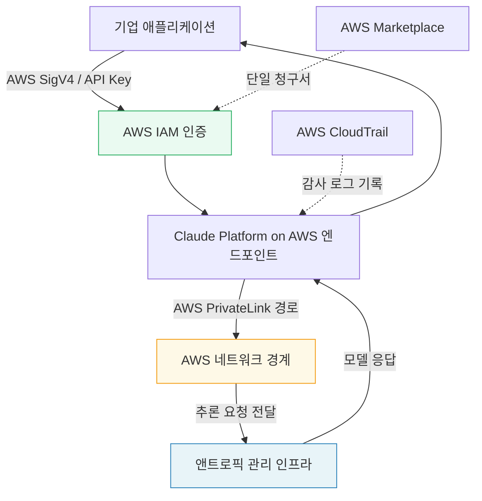
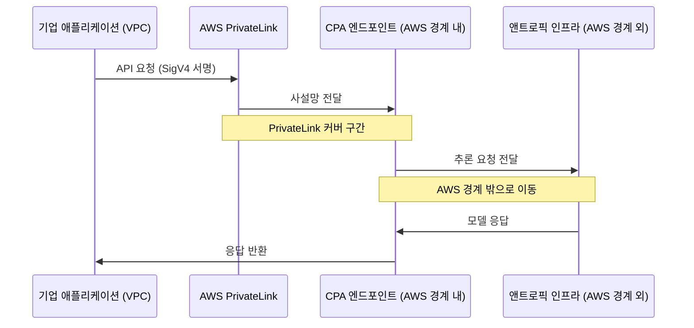
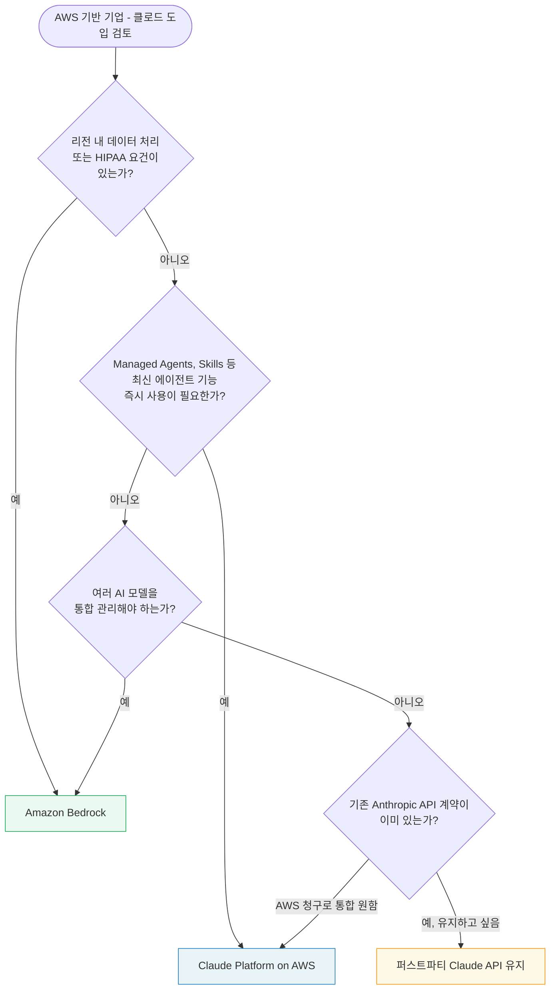
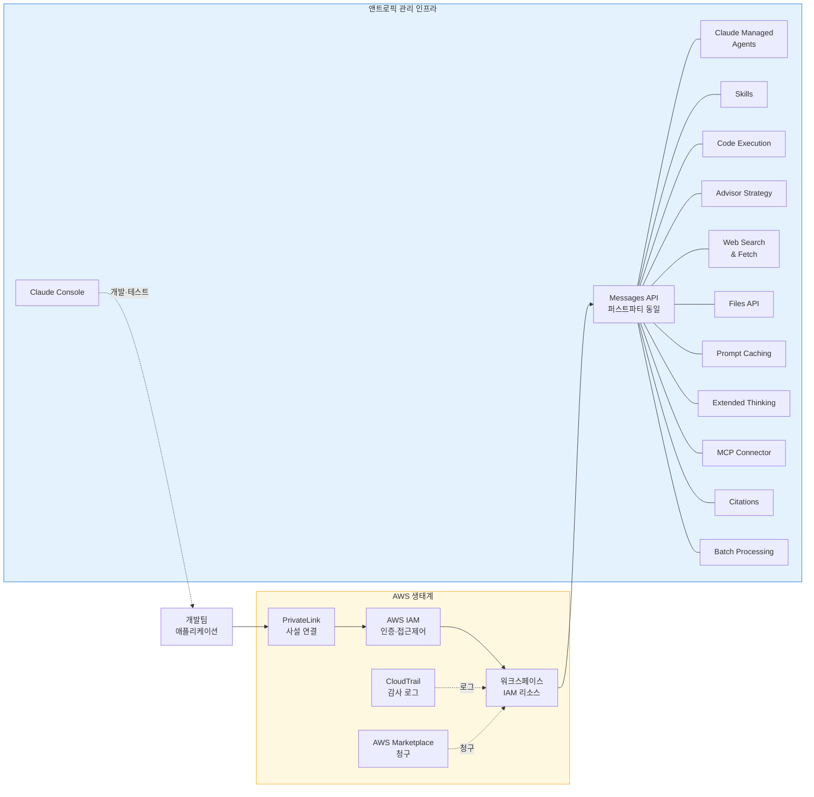

> 앤트로픽이 2026년 5월 11일 정식 출시한 AWS 전용 클로드 플랫폼의 모든 것

---

## 1. 왜 지금, 왜 이 서비스인가?

앤트로픽이 2026년 5월 11일(현지시간) 'Claude Platform on AWS'(이하 CPA)를 일반 공개(GA, Generally Available)로 출시했다. 이 서비스는 "AWS 환경을 사용하면서도 클로드 네이티브 API의 모든 기능을 즉시 쓸 수 있도록 한다"는 단 하나의 목표 아래 설계됐다.

그 전까지 AWS 위에서 클로드를 사용하는 기업 고객에게는 사실상 두 가지 선택지만 있었다. 첫 번째는 **아마존 베드록(Amazon Bedrock)** 을 통한 방법이다. 베드록은 AWS가 추론 인프라를 직접 운영하며, 데이터가 AWS 경계 안에서만 처리된다. 여러 모델 제공사의 모델을 통합 관리할 수 있고 AWS 고유의 Guardrails나 Knowledge Bases 같은 부가 기능도 붙일 수 있다는 장점이 있다. 그러나 단점이 하나 있었다. 앤트로픽이 자사 API에 새 기능을 출시해도 그것이 베드록에 반영되기까지는 시간이 걸렸고, 클로드 매니지드 에이전트나 스킬 같은 최신 에이전트 기능은 아예 베드록에서 쓸 수 없었다.

두 번째는 **앤트로픽 퍼스트파티 API** 를 직접 사용하는 방법이다. 이 경우 신규 모델과 기능을 출시 당일 바로 쓸 수 있고 에이전트 기능도 완벽하게 지원된다. 하지만 AWS와는 완전히 별개의 계정 체계, 별개의 청구서, 별개의 인증 방식을 써야 했다. AWS를 기반으로 운영하는 기업 IT 환경에서는 이 이중 관리가 운영 복잡성을 높이는 요인이 됐다.

Claude Platform on AWS는 이 두 가지 방식의 공백을 메우는 세 번째 옵션으로 탄생했다. 네이티브 클로드 API의 전체 기능을 그대로 쓰되, 결제와 인증만큼은 AWS 생태계 안에서 처리할 수 있도록 한 것이다.

---

## 2. 서비스의 핵심 구조

### 2.1 누가 무엇을 운영하는가

CPA는 겉으로는 AWS를 통해 접근하지만, 실제 추론(inference)은 앤트로픽이 직접 관리하는 인프라 위에서 실행된다. AWS는 인증 레이어(SigV4 서명 또는 API 키)와 IAM 기반 접근 제어, 그리고 AWS Marketplace를 통한 청구를 제공한다. 앤트로픽과 AWS는 각자 독립적인 데이터 처리자(independent data processors)로서 역할을 분담한다.

이 구조에서 중요한 사실은 **데이터가 AWS 경계 밖으로 나간다**는 점이다. 사용자의 요청이 AWS PrivateLink를 통해 AWS 네트워크 안에서 CPA 엔드포인트까지는 이동하지만, 실제 추론을 위해 앤트로픽 인프라에 도달하는 시점에는 AWS 경계를 벗어난다. 이 점은 기존 베드록 방식과 가장 크게 다른 특징이다.

### 2.2 베드록과의 명확한 차이

이 두 서비스는 경쟁 관계가 아니라 서로 다른 수요를 위한 보완 관계다. 다음 표는 공식 문서와 앤트로픽 블로그에 명시된 내용을 정리한 것이다.

| 구분 | Claude Platform on AWS | Amazon Bedrock의 Claude |
|---|---|---|
| 인프라 운영 주체 | 앤트로픽 | AWS |
| 데이터 처리 위치 | AWS 경계 외부 (앤트로픽 인프라) | AWS 경계 내부 |
| 신규 기능 반영 속도 | 퍼스트파티 API와 동일 당일 반영 | 별도 일정에 따라 지연 가능 |
| 에이전트 기능 | 완전 지원 (Managed Agents, Skills 등) | 제한적 |
| 데이터 주권 요건 충족 | 리전 내 데이터 요건 불충족 | 충족 (리전 내 처리 보장) |
| HIPAA 준수 | 미지원 | 지원 |
| 비용 청구 | AWS 단일 청구서 | AWS 단일 청구서 |
| 인증 방식 | AWS IAM (SigV4 / API Key) | AWS IAM |
| Multi-model 통합 | Claude 전용 | Llama, Mistral 등 다수 모델 통합 가능 |
| AWS Guardrails | 미지원 | 지원 |

이 표에서 읽히는 핵심은 간단하다. **데이터가 AWS 안에 있어야 하는가**가 갈림길이다. 금융, 의료, 공공 분야처럼 리전 내 데이터 처리 요건이 엄격한 곳은 베드록이 맞다. 최신 에이전트 기능과 클로드 네이티브 경험을 원하면서 데이터 주권 요건이 상대적으로 유연한 곳은 CPA가 맞다.

---

## 3. AWS 통합의 구체적인 작동 방식

### 3.1 인증: AWS IAM으로 일원화

CPA는 AWS IAM의 SigV4 서명 방식 또는 API 키 방식으로 인증을 처리한다. 기업 고객 입장에서 이것이 의미하는 바는 별도의 앤트로픽 계정 자격증명을 관리할 필요가 없다는 것이다. 기존에 AWS 리소스에 접근할 때 쓰던 IAM 사용자나 IAM 역할(Role)을 그대로 사용한다.

접근 제어도 기존 AWS 방식을 따른다. IAM 정책, 조직 수준 SCP(Service Control Policy), 권한 경계(Permission Boundary), 리소스 레벨 조건 등 AWS의 표준 접근 제어 체계를 통해 누가 어떤 워크스페이스에서 어떤 작업을 할 수 있는지 관리한다. 기존 베드록에서는 사용자를 워크스페이스에 직접 추가하는 방식으로 접근을 부여했지만, CPA에서는 IAM 주체(Principal)가 특정 워크스페이스 ARN에 대한 권한을 갖는 정책을 부여받는 방식으로 대체된다.

### 3.2 감사 로그: AWS CloudTrail

모든 API 호출은 AWS CloudTrail에 자동으로 기록된다. 기업 보안팀 입장에서 이것은 중요한 의미를 갖는다. 클로드 API 사용 내역이 다른 AWS 서비스 사용 로그와 같은 위치에 같은 형식으로 남기 때문에, 기존의 SIEM(보안 정보 및 이벤트 관리) 도구나 감사 체계에 클로드 사용 내역을 별도 통합 없이 포함시킬 수 있다.

### 3.3 비용 청구: AWS 단일 인보이스

과금은 AWS Marketplace를 통해 이루어지며, 기존 AWS 청구서에 통합된다. 더 중요한 것은 기존 AWS 사용 약정(commitment, 예: 엔터프라이즈 할인 계약이나 Savings Plans)과 연동되어 사용량이 약정 소진에 반영된다는 점이다. 앤트로픽에 별도 결제 관계를 맺지 않아도 된다.

단, 기존에 베드록에서 앤트로픽 프라이빗 오퍼(private offer)를 사용하고 있는 기업은 주의가 필요하다. CPA로 전환하기 전에 반드시 앤트로픽 또는 AWS 어카운트 익스큐티브에게 연락하여 할인 조건이 올바르게 이전되도록 확인해야 한다. CPA 프라이빗 오퍼를 수락하기 전에 발생한 사용량에는 할인이 소급 적용되지 않는다.

### 3.4 네트워크 연결: AWS PrivateLink

기업이 퍼블릭 인터넷을 통하지 않고 VPC와 CPA 엔드포인트 사이를 사설망으로 연결하고자 할 때 AWS PrivateLink를 사용할 수 있다. 다만 PrivateLink는 애플리케이션에서 AWS 네트워크 경계까지의 구간만 커버한다는 점을 명확히 이해해야 한다. 실제 추론을 위해 앤트로픽 인프라에 도달하는 순간에는 여전히 AWS 경계를 벗어난다.

---

## 4. 지원 기능 전체 해설

CPA가 가진 가장 큰 가치는 기능의 완전성이다. 앤트로픽 퍼스트파티 API에 새 기능이나 새 모델이 출시되면 **CPA에서도 동일 당일에 사용 가능**하다. 아래에 각 기능의 의미와 활용 맥락을 설명한다.

### 4.1 Claude Managed Agents (클로드 매니지드 에이전트)

현재 베타로 제공되는 클로드 매니지드 에이전트는 대규모 AI 에이전트를 구축하고 배포하기 위한 플랫폼이다. CPA에서 에이전트, 세션, 환경(클라우드 컨테이너 설정), 자격증명 볼트(credential vault), 메모리 스토어는 모두 일급 IAM 리소스로 취급된다. 즉 AWS 접근 제어 체계 안에서 에이전트의 생성, 실행, 삭제를 세밀하게 통제할 수 있다.

앤트로픽 에이전트 SDK는 CPA에 대해 별도의 통합 작업 없이 그대로 동작한다. 베이스 URL을 CPA 엔드포인트로 지정하고 SigV4 또는 API 키로 인증하면 된다.

한 가지 제약이 있다. CPA에서 자율 세션(autonomous session)을 실행할 때는 6시간마다 재인증이 필요하다. 장시간 실행되는 에이전트 작업은 이 창 안에서 SigV4 자격증명이나 API 키를 갱신해야 하며, 그러지 않으면 세션이 종료된다.

현재 CPA의 Claude Managed Agents에서 **아직 지원되지 않는 기능**도 있다. 에이전트 세션에 대한 Outcomes(결과 추적) 기능, 여러 에이전트가 상호작용하는 Multi-agent 세션, 그리고 세션 이벤트의 웹훅 전달 기능은 현재 미지원이다.

### 4.2 Advisor Strategy (어드바이저 전략)

현재 베타로 제공된다. 에이전트가 복잡한 판단을 내려야 하는 순간에 별도의 '자문 모델(advisor model)'을 내부적으로 호출하여 에이전트의 응답 품질을 높이는 방식이다. 단일 모델 에이전트보다 높은 신뢰도가 필요한 작업에서 활용할 수 있다.

### 4.3 Web Search & Web Fetch (웹 검색 및 웹 페치)

클로드가 API 호출 내에서 직접 인터넷 검색을 수행하거나 특정 URL의 콘텐츠를 가져올 수 있는 기능이다. 클로드의 학습 데이터 마감 이후의 최신 정보를 반영한 답변이 필요하거나, 실시간 데이터를 기반으로 에이전트가 판단을 내려야 할 때 유용하다.

### 4.4 Code Execution (코드 실행)

앤트로픽이 관리하는 샌드박스 환경에서 Python 코드를 API 호출 내에서 직접 실행할 수 있다. 데이터 분석, 시각화 생성, 수치 계산 등을 별도의 실행 환경 없이 클로드 API 호출 흐름 안에서 처리할 수 있다. 실행 결과는 대화 흐름에 바로 반영된다.

### 4.5 Skills (스킬)

현재 베타로 제공된다. 스킬은 특정 업무 방식이나 모범 사례를 클로드에게 가르치는 메커니즘이다. 한 번 정의해두면 이후 API 호출에서 해당 스킬을 참조하여 일관된 결과물을 얻을 수 있다. 사전 제작된 스킬로는 PowerPoint, Excel, Word, PDF 문서 생성 스킬이 제공되며, 기업별 커스텀 스킬도 만들 수 있다.

### 4.6 MCP Connector (MCP 커넥터)

현재 베타로 제공된다. MCP(Model Context Protocol)는 외부 서비스나 도구를 AI 모델에 연결하는 표준 프로토콜이다. MCP 커넥터를 사용하면 별도의 클라이언트 코드를 작성하지 않아도 원격 MCP 서버에 클로드를 연결할 수 있다. 다양한 외부 시스템과의 통합을 간소화하는 역할을 한다.

### 4.7 Files API (파일 API)

현재 베타로 제공된다. 문서나 파일을 업로드해두고 여러 API 요청에 걸쳐 참조할 수 있다. 긴 문서를 매번 요청에 포함시키는 대신 한 번 업로드하고 필요할 때마다 참조하는 방식으로 사용할 수 있어 비용과 지연을 줄일 수 있다.

### 4.8 Prompt Caching (프롬프트 캐싱)

도구 정의, 시스템 프롬프트, 메시지 히스토리를 캐시해두었다가 재사용하는 기능이다. 반복적인 컨텍스트가 많은 작업에서 비용과 지연 시간을 크게 줄일 수 있다. 5분 TTL, 1시간 TTL, 자동 캐싱 방식 모두 지원된다.

### 4.9 Extended Thinking (확장적 사고)

클로드가 응답하기 전에 더 많은 추론 단계를 수행하도록 허용하는 기능이다. 복잡한 문제 해결, 긴 수학적 추론, 다단계 계획 수립 같은 작업에서 응답 품질을 높일 수 있다.

### 4.10 Streaming & Batch Processing (스트리밍과 배치 처리)

실시간 SSE(Server-Sent Events) 스트리밍으로 응답을 토큰 단위로 받거나, 고처리량 비동기 작업을 위해 배치 요청을 제출할 수 있다. 대화형 인터페이스에는 스트리밍이, 대규모 문서 처리나 평가 파이프라인에는 배치가 적합하다.

### 4.11 Citations (인용)

클로드의 응답이 어떤 소스 문서의 어떤 부분에 근거하는지 명시하는 기능이다. 환각(hallucination)을 줄이고 응답의 신뢰성을 높여야 하는 기업용 애플리케이션에서 유용하다.

### 4.12 Workspace Tagging (워크스페이스 태깅)

워크스페이스에 태그를 붙이면 이 태그가 IAM의 속성 기반 접근 제어(ABAC)와 AWS 비용 및 사용 보고서(Cost and Usage Reports)에 흘러들어간다. 팀별, 프로젝트별 비용 배분이나 세분화된 접근 제어가 필요한 대규모 조직에서 유용하다. 흥미롭게도 이 기능은 CPA에서 정식(GA) 기능이지만 퍼스트파티 클로드 API에서는 여전히 베타 기능이다.

---

## 5. 제공 모델과 접근 방법

현재 CPA에서 사용 가능한 모델은 다음 세 가지다.

| 모델명 | 모델 스트링 | 특성 |
|---|---|---|
| Claude Opus 4.7 | claude-opus-4-7 | 가장 강력한 추론, 에이전트 코딩, 복잡한 전문가 작업 |
| Claude Sonnet 4.6 | claude-sonnet-4-6 | 성능과 속도의 균형, 일반 업무용 |
| Claude Haiku 4.5 | claude-haiku-4-5-20251001 | 빠른 응답속도, 비용 효율, 간단한 작업 |

앤트로픽이 퍼스트파티 API에 새 모델을 출시하면 CPA에도 동시에 추가된다.

### 접근 경로

1. AWS Marketplace에서 Claude Platform on AWS를 구독 활성화한다.
2. 워크스페이스를 생성한다. (워크스페이스는 CPA의 핵심 IAM 리소스로, 프로젝트나 팀, 환경을 분리하는 단위다.)
3. SigV4 서명 또는 API 키로 인증한다.
4. 앤트로픽 SDK 또는 HTTP로 Messages API를 직접 호출한다.

앤트로픽의 Python, TypeScript 등 공식 SDK는 CPA를 완전히 지원한다. 베이스 URL만 CPA 엔드포인트로 변경하면 기존 코드 대부분이 그대로 동작한다.

---

## 6. 개발 환경: Claude Console

CPA 사용자는 앤트로픽의 웹 기반 개발 환경인 **Claude Console**에 접근할 수 있다. 콘솔에는 다음 도구들이 포함되어 있다.

- **프롬프트 생성기(Prompt Generator)**: 목적에 맞는 프롬프트 초안을 생성하는 도구
- **프롬프트 개선 도구(Prompt Improver)**: 기존 프롬프트를 더 효과적으로 개선하는 도구
- **평가 도구(Evaluation Tools)**: AI 애플리케이션의 응답 품질을 테스트하고 측정하는 도구
- **워크스페이스 관리**: API 키 생성, 사용량 확인, 비용 현황 조회

---

## 7. 데이터 관련 중요 사항

### 7.1 데이터 보존 정책

CPA는 퍼스트파티 클로드 API와 동일한 데이터 보존 정책을 따른다. 요청에 포함된 데이터는 기본적으로 앤트로픽의 보존 정책에 따라 처리된다. 데이터를 일체 저장하지 않는 **ZDR(Zero Data Retention)** 도 요청 시 활성화할 수 있다. ZDR이 필요한 기업은 앤트로픽 어카운트 담당자에게 연락해 계정 수준에서 활성화를 요청해야 한다.

### 7.2 추론 지역 고정 (inference_geo)

데이터가 어느 지역에서 처리될지를 요청 단위로 지정할 수 있다. 각 API 요청에 `inference_geo` 파라미터를 사용하면 된다. CPA는 대부분의 AWS 상용 리전에서 이용 가능하며, 글로벌 및 미국 내 추론 지역을 지원한다.

워크스페이스 수준에서 허용 추론 지역을 제한하는 기능(`allowed_inference_geos`, `default_inference_geo`)은 현재 CPA에서 지원되지 않는다. 이 점은 특정 리전 내 처리를 강제해야 하는 요건이 있는 기업이 CPA보다 베드록을 선택해야 하는 이유 중 하나다.

### 7.3 컴플라이언스 유의사항

공식 문서에는 명확한 경고가 있다. CPA는 앤트로픽이 제공하는 서드파티 서비스로, SOC, ISO, HIPAA 같은 표준 AWS 컴플라이언스 프로그램의 범위에 포함되지 않는다. 민감한 규제 데이터를 처리하기 전에 앤트로픽 Trust Center의 컴플라이언스 문서를 직접 검토해야 한다. HIPAA 준수가 요구되는 의료 분야 기업은 CPA 대신 아마존 베드록을 사용해야 한다.

---

## 8. 현재 지원되지 않는 기능

공식 문서에 명시된 미지원 기능을 모두 정리한다.

| 미지원 기능 | 설명 |
|---|---|
| HIPAA 준비 프로그램 | 의료정보 규제 요건이 있는 경우 베드록 사용 권장 |
| Priority Tier 서비스 | Standard와 Batch 티어만 제공 |
| 일부 Admin API 엔드포인트 | 멤버십 관리, API 키, 사용량 보고서 등 일부 미지원 (IAM으로 대체) |
| Spend Limits | AWS 결제 제어 기능으로 대체 |
| Claude Code 전용 워크스페이스 및 Analytics API | 사용량이 일반 뷰에 통합 표시 |
| OAuth 인증 | SigV4 또는 API 키 방식만 지원 |
| OpenAI 호환 API 엔드포인트 | 미지원 |
| 워크스페이스 수준 추론 지역 제어 | 요청 단위 inference_geo 파라미터로 대체 |
| Managed Agents - Outcomes 추적 | 에이전트 세션 결과 추적 기능 미지원 |
| Managed Agents - Multi-agent 세션 | 여러 에이전트 간 상호작용 세션 미지원 |
| Managed Agents - 웹훅 | 세션 이벤트 웹훅 전달 미지원 |

---

## 9. 어떤 기업이 무엇을 선택해야 하는가

세 가지 옵션을 작업(workload) 유형별로 간단히 정리하면 다음과 같다.

**베드록이 적합한 경우**: 단순 추론 호출(시스템 프롬프트 + 사용자 메시지 + 응답)이 핵심인 파이프라인, Llama나 Mistral 같은 다른 모델과 통합이 필요한 경우, 리전 내 데이터 처리나 HIPAA 요건이 있는 경우, AWS Guardrails나 Knowledge Bases 같은 AWS 네이티브 기능을 사용해야 하는 경우.

**CPA가 적합한 경우**: 클로드 매니지드 에이전트나 스킬 같은 최신 에이전트 기능이 즉시 필요한 경우, 퍼스트파티 API와 동일한 베타 기능에 당일 접근이 중요한 경우, AWS IAM과 CloudTrail을 통한 보안 통제와 감사를 원하지만 클로드 전용 에이전트 기능도 필요한 경우, 기존에 앤트로픽 퍼스트파티 API를 직접 사용하면서 AWS 청구 통합을 원하는 경우.

**퍼스트파티 API가 적합한 경우**: AWS 생태계 밖에서 운영하거나, Claude Code 전용 워크스페이스와 분석 기능이 필요하거나, OAuth 인증이 필요한 경우.

---

## 10. 실제 도입 사례

CPA 정식 출시와 함께 앤트로픽이 공개한 사용 사례들을 통해 이 서비스가 어떤 맥락에서 가치를 발휘하는지 확인할 수 있다.

사이버보안 기업 **ReliaQuest**의 수석 연구과학자 Jonathan Echavarria는 CPA가 기존 클라우드 운영 모델 안에서 클로드에 접근하는 방식을 단순화했으며, Claude Code 엔지니어 같은 핵심 사용자들의 경험을 개선했다고 밝혔다.

AI 모델 라우팅 플랫폼 **OpenRouter**의 AI 플랫폼 엔지니어 Tomas Oliva는 네이티브 클로드 API의 최신 기능에 직접 접근할 수 있고, AWS IAM을 통해 접근 제어가 가능해졌다고 설명했다. 업타임, 레이턴시, 처리량에서 일관된 성능을 경험했다고도 덧붙였다.

에이전트 플랫폼 기업 **Emergent**의 수석 아키텍트 Avinash Vishwakarma는 CPA를 통해 퍼스트파티 API와 완전한 기능 동등성을 확보했으며, 신규 모델 기능에 당일 접근이 가능해졌다고 했다.

---

## 11. 전체 구조 요약

---

## 마치며

Claude Platform on AWS는 클로드 에이전트 생태계를 기업의 AWS 인프라 안으로 끌어들이려는 앤트로픽의 전략적 시도다. 베드록이 AWS 경계 안에서의 안전한 추론에 초점을 맞춘다면, CPA는 에이전트 기능의 최전선을 AWS 고객에게 동일하게 열어주는 데 초점을 맞춘다. 두 서비스는 경쟁이 아닌 보완 관계이며, 기업이 자신의 데이터 주권 요건과 기능 요건을 기준으로 선택하면 된다.

---

*출처: Anthropic 공식 블로그 (claude.com/blog/claude-platform-on-aws), AWS 공식 문서 (docs.aws.amazon.com/claude-platform), AI타임스 (aitimes.com), AWS Machine Learning 블로그*

*작성일: 2026년 5월 13일*
