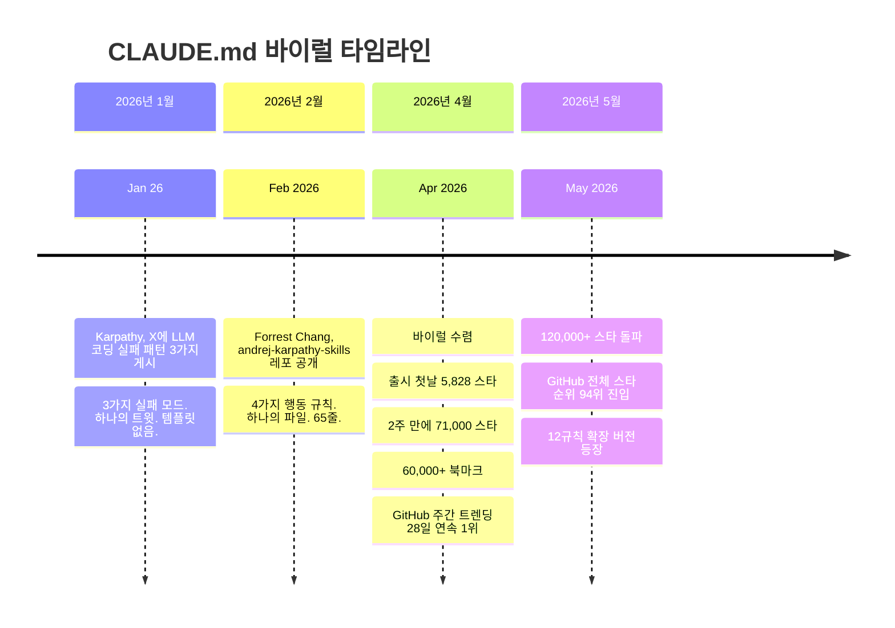
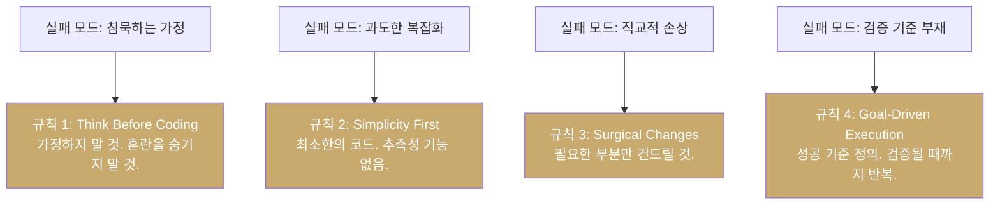
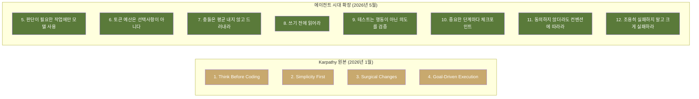
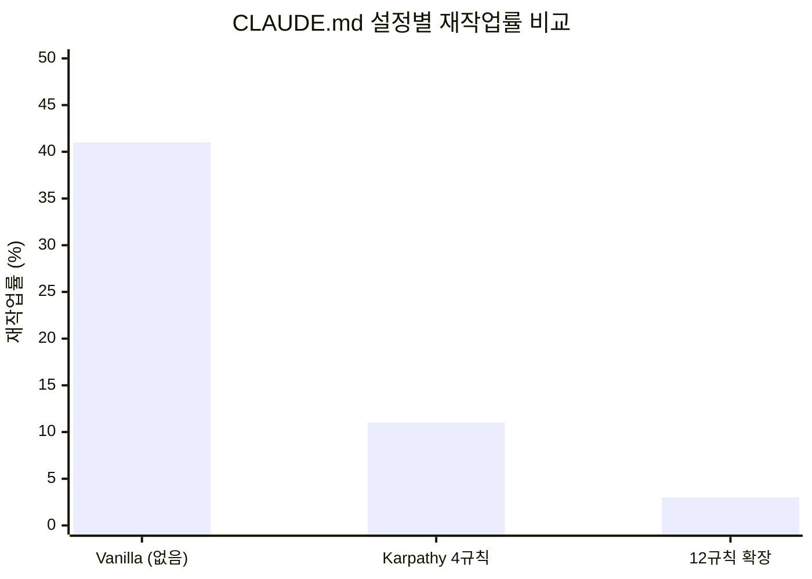
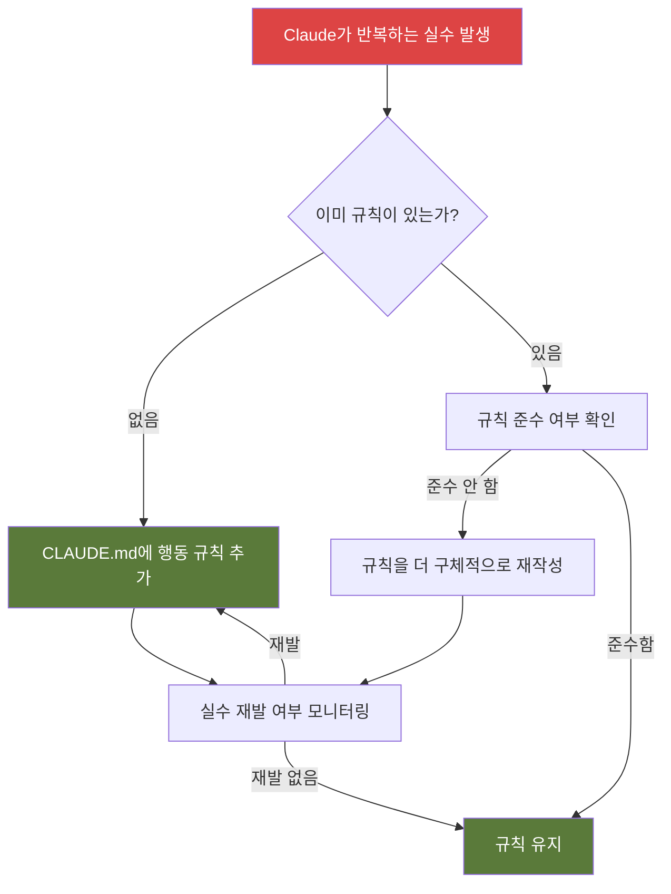

> Karpathy의 불만에서 시작해 GitHub 역사상 가장 빠르게 성장한 단일 파일 레포지토리가 된 이야기,  
> 그리고 2026년 5월 현재의 에이전트 환경에 맞게 확장된 12규칙 완전 해설

---

## 목차

1. [배경: Andrej Karpathy의 경고](#1-배경)
2. [탄생: Forrest Chang의 4가지 규칙](#2-탄생)
3. [바이럴 타임라인](#3-바이럴-타임라인)
4. [Karpathy 원본 4규칙 상세 해설](#4-karpathy-원본-4규칙)
5. [Karpathy 템플릿의 4가지 한계](#5-한계)
6. [12규칙으로의 확장: 추가된 8가지 규칙](#6-12규칙-확장)
7. [수치로 보는 효과](#7-수치)
8. [전체 12규칙 CLAUDE.md 전문](#8-전문)
9. [핵심 철학: CLAUDE.md는 위시리스트가 아니다](#9-핵심-철학)

---

## 1. 배경: Andrej Karpathy의 경고 {#1-배경}

2025년 11월, Andrej Karpathy는 여전히 코드의 80%를 직접 손으로 작성하고 있었다. 불과 한두 달 후인 2026년 1월, 그 비율은 완전히 뒤집혔다. 클로드 코드(Claude Code)를 이용한 에이전트가 코드의 80%를 생성하고, 그가 하는 일의 20%는 수정과 마무리 작업으로 바뀐 것이다. 그는 이것을 "20년 프로그래밍 인생에서 가장 큰 워크플로우 변화"라고 불렀다.

그런데 그 변화를 솔직하게 기록한 2026년 1월 26일 X(구 트위터) 게시물에서, Karpathy는 흥분이 아니라 불만을 털어놓았다. 에이전트 코딩으로 80%까지 올라갔지만, 반복적으로 마주치는 세 가지 구조적 문제가 있다는 것이었다.

### Karpathy가 직접 기술한 세 가지 실패 패턴

**첫 번째: 침묵하는 가정(Silent Assumptions)**

> "모델들은 당신을 대신해서 잘못된 가정을 하고, 확인 없이 그냥 달려나갑니다. 혼란을 관리하지 않고, 명확화를 구하지 않고, 불일치를 드러내지 않고, 트레이드오프를 제시하지 않고, 밀어붙여야 할 때 물러서지 않습니다."

모델은 요청이 모호할 때 묻지 않는다. 스스로 해석하고, 그 해석을 조용히 선택한 뒤 수백 줄의 코드를 쏟아낸다. 개발자가 결과물을 받아보기 전까지 어떤 가정이 들어갔는지조차 알 수 없다.

**두 번째: 과도한 복잡화(Over-complication)**

> "모델들은 코드와 API를 지나치게 복잡하게 만들고, 추상화를 부풀리고, 죽은 코드를 청소하지 않습니다. 100줄이면 될 것을 1000줄짜리 비대한 구조물로 구현합니다."

단순한 기능 하나를 추가하면 스트래티지 패턴, 팩토리 클래스, 설정 시스템이 함께 딸려온다. 아무도 요청하지 않은 유연성과 확장성이 코드에 스며든다.

**세 번째: 직교적 손상(Orthogonal Damage)**

> "모델들은 충분히 이해하지 못한 주석과 코드를 사이드 이펙트로 변경하거나 삭제합니다. 심지어 작업과 무관한 부분에서도요."

버그 하나를 고쳐달라고 하면, 인접한 함수의 들여쓰기를 바꾸고, 타입 힌트를 추가하고, 주석 스타일을 수정하고, 리팩토링하지 말아야 할 코드를 리팩토링한다.

---

## 2. 탄생: Forrest Chang의 4가지 규칙 {#2-탄생}

Karpathy의 게시물이 퍼지는 것을 본 개발자 Forrest Chang은 2026년 1월 27일, 하루 만에 그 불만들을 실행 가능한 행동 규칙으로 바꿔 GitHub에 올렸다. 블로그 포스트가 아니었다. 트위터 스레드도 아니었다. Claude Code가 프로젝트 시작 시 자동으로 읽는 구성 파일인 `CLAUDE.md`였다.

파일의 내용은 단 65줄, 4개의 원칙이 전부였다. 그런데 이것이 GitHub 역사상 가장 빠르게 성장한 단일 파일 레포지토리 중 하나가 되었다.

### CLAUDE.md란 무엇인가

`CLAUDE.md`는 Claude Code가 세션을 시작할 때 자동으로 읽는 프로젝트 메모리 문서다. 개발자가 이 파일에 컨벤션, 선호사항, 제약 조건을 적어두면 모델이 매번 세션에서 참조한다. Anthropic의 공식 문서에 따르면 이 파일은 권고(advisory) 성격으로 작동하며, 약 80%의 준수율을 보인다. 200줄을 넘어가면 준수율이 급격히 떨어지는 것으로 알려져 있다.

대부분의 개발자들은 이 파일을 세 가지 방식으로 잘못 사용하고 있었다:
- 4,000 토큰이 넘는 모든 선호사항의 덤핑 창고로 쓰거나
- 아예 건너뛰고 매번 프롬프트로 대신하거나
- 템플릿을 한 번 복사하고 코드베이스가 바뀌어도 업데이트하지 않거나

Forrest Chang의 기여는 이 파일을 "원하는 것을 적는 곳"이 아니라 "반복하는 실수를 막는 행동 규약"으로 재정의한 데 있다.

---

## 3. 바이럴 타임라인 {#3-바이럴-타임라인}



2026년 5월 기준, `forrestchang/andrej-karpathy-skills` 레포지토리는 불과 3개월 만에 110,000개 이상의 스타를 기록했고, GitHub 주간 트렌딩에서 28일 연속 1위를 차지했으며, 전체 레포지토리 스타 순위 94위에 올랐다. 하나의 텍스트 파일이 만들어낸 결과였다.

중요한 사실은, Karpathy가 이 파일을 직접 작성하거나 공식적으로 지지한 것이 아니라는 점이다. 파일의 저자는 Forrest Chang이며, Karpathy의 2026년 1월 26일 X 게시물에서 영감을 받아 제작했다.

---

## 4. Karpathy 원본 4규칙 상세 해설 {#4-karpathy-원본-4규칙}



### 규칙 1: 코딩 전에 먼저 생각하라 (Think Before Coding)

**핵심 원칙:** 가정하지 말 것. 혼란을 숨기지 말 것. 트레이드오프를 드러낼 것.

구현을 시작하기 전에 모델은 다음을 해야 한다:
- 자신이 하는 가정을 명시적으로 밝힌다. 불확실하면 추측하지 않고 질문한다.
- 여러 해석이 가능한 경우 조용히 선택하지 않고 모두 제시한다.
- 더 단순한 접근법이 존재한다면 말한다. 필요하면 되돌려보낸다.
- 무언가 불분명하면 멈춘다. 무엇이 불분명한지 이름을 붙이고 질문한다.

**왜 중요한가:** LLM은 모호한 요청을 받으면 조용히 하나의 해석을 선택한 뒤 달려나간다. 개발자가 결과물을 보기 전까지 어떤 가정이 들어갔는지 알 수 없다. "사용자 데이터 내보내기 기능을 추가해줘"라는 요청 하나에도 어떤 포맷인지, 어떤 필드를 포함하는지, 어떤 사용자 범위인지, 파일을 어디에 쓸 것인지 수많은 결정이 숨어 있다. 이것을 드러내는 것이 규칙 1의 목적이다.

---

### 규칙 2: 단순함을 먼저 (Simplicity First)

**핵심 원칙:** 문제를 해결하는 최소한의 코드. 추측성 기능은 없다.

구체적으로 금지하는 것들:
- 요청받지 않은 기능
- 단일 사용 코드에 대한 추상화
- 요청하지 않은 유연성 또는 설정 가능성
- 불가능한 시나리오에 대한 에러 처리
- 50줄로 해결될 것을 200줄로 작성하는 것

**자가 테스트:** "시니어 엔지니어가 이것이 과도하게 복잡하다고 말할까?" 그렇다면 단순화하라.

단순한 할인 계산 함수 하나를 요청했을 때 전략 패턴(Strategy Pattern), 추상 기반 클래스, 데이터클래스, 설정 시스템을 동원한 30줄짜리 클래스 계층이 돌아오는 것이 현실이다. 규칙 2는 이것을 막는다. 복잡성은 실제로 필요해졌을 때 추가하면 된다. 지금 필요하지 않은 복잡성은 코드를 이해하기 어렵게 만들고, 버그를 늘리고, 구현에 더 많은 시간을 쓰게 한다.

---

### 규칙 3: 수술적 변경 (Surgical Changes)

**핵심 원칙:** 반드시 필요한 부분만 건드릴 것. 자신이 만든 문제만 정리할 것.

기존 코드를 편집할 때:
- 인접한 코드, 주석, 포맷팅을 "개선"하지 않는다
- 깨지지 않은 것은 리팩토링하지 않는다
- 다르게 작성하고 싶더라도 기존 스타일에 맞춘다
- 무관한 죽은 코드를 발견하면 언급만 하고 삭제하지 않는다

자신의 변경이 고아(orphan)를 만들었을 때:
- 자신의 변경으로 사용되지 않게 된 임포트/변수/함수는 제거한다
- 기존의 죽은 코드는 요청받지 않는 한 건드리지 않는다

**자가 테스트:** 모든 변경된 줄이 사용자의 요청으로 직접 추적될 수 있어야 한다.

빈 이메일이 검증기를 충돌시키는 버그를 고쳐달라고 했는데, 이메일 검증 로직 전체를 개선하고, 사용자명 검증을 추가하고, 주석을 바꾸고, 독스트링을 붙여서 30줄짜리 diff가 돌아오는 상황을 막는 것이 이 규칙의 목적이다.

---

### 규칙 4: 목표 주도 실행 (Goal-Driven Execution)

**핵심 원칙:** 성공 기준을 정의하라. 검증될 때까지 반복하라.

명령형 지시를 검증 가능한 목표로 변환한다:

| 명령형 지시 | 목표 주도 변환 |
|------------|--------------|
| "검증 추가해줘" | "잘못된 입력에 대한 테스트를 작성하고, 테스트를 통과시켜줘" |
| "버그 고쳐줘" | "버그를 재현하는 테스트를 작성하고, 테스트를 통과시켜줘" |
| "X를 리팩토링해줘" | "리팩토링 전후로 테스트가 통과하는지 확인해줘" |

Karpathy의 핵심 인사이트는 바로 이것이었다: "LLM은 특정 목표를 충족할 때까지 루프하는 데 탁월하다. 무엇을 해야 하는지 말하지 말고, 성공이 어떤 모습인지 알려주고 지켜봐라."

---

## 5. Karpathy 템플릿의 4가지 한계 {#5-한계}

4가지 규칙은 2026년 1월의 코드 작성 문제를 해결하도록 설계되었다. 그러나 2026년 5월의 에이전트 환경은 다른 문제들을 만들어냈다.

```mermaid
quadrantChart
    title Karpathy 4규칙의 커버리지 한계
    x-axis 단순 코드 작성 --> 복잡한 에이전트 워크플로우
    y-axis 단일 코드베이스 --> 멀티 코드베이스/프로젝트
    quadrant-1 4규칙으로 해결 가능
    quadrant-2 GAP 2: 멀티 코드베이스 일관성
    quadrant-3 완전 해결
    quadrant-4 GAP 1: 장기 에이전트 작업
    "단순 버그 수정": [0.2, 0.2]
    "단일 기능 추가": [0.3, 0.3]
    "멀티 파일 리팩토링": [0.6, 0.2]
    "장기 디버깅 세션": [0.8, 0.2]
    "모노레포 작업": [0.5, 0.8]
    "멀티 서비스 통합": [0.7, 0.8]
```

### GAP 1: 장기 에이전트 작업

Karpathy의 규칙은 Claude Code가 코드를 작성하는 순간을 대상으로 한다. 멀티 스텝 파이프라인이 실행될 때 무슨 일이 일어나는지에 대해서는 침묵한다. 예산 규칙도 없고, 체크포인트 규칙도 없고, 조용한 실패를 드러내는 규칙도 없다. 90분짜리 디버깅 세션에서 모델은 같은 오류 메시지를 반복해서 읽으며 이미 거부된 수정을 다시 제안하기 시작한다.

### GAP 2: 멀티 코드베이스 일관성

"기존 스타일에 맞춰라"는 스타일이 하나라는 전제를 깔고 있다. 12개의 서비스가 있는 모노레포에서 Claude는 어떤 스타일을 선택해야 할지 모른다. 원칙이 없으면 무작위로 선택하거나 평균을 낸다.

### GAP 3: 테스트 품질

목표 주도 실행은 "테스트 통과"를 성공으로 취급한다. 테스트가 의미 있어야 한다는 것은 말하지 않는다. 결과적으로 아무것도 유의미하게 검증하지 않는 테스트를 작성하면서 모델은 자신감을 얻는다. 인증 함수에 대한 12개의 테스트가 모두 통과했지만 프로덕션에서 인증이 망가진 사례가 여기서 나온다.

### GAP 4: 프로덕션 vs 프로토타입

Simplicity First 규칙이 초기 단계 코드에서는 과도하게 발동된다. 방향을 찾기 위해 100줄짜리 스캐폴딩이 정당하게 필요한 프로토타입에서도 단순화 압력이 작동한다.

---

## 6. 12규칙으로의 확장: 추가된 8가지 규칙 {#6-12규칙-확장}

30개의 코드베이스에서 6주 동안 실험한 결과, Karpathy의 4규칙이 커버하지 못하는 실패 모드를 막기 위해 8개의 규칙이 추가되었다. 각 규칙은 실제로 발생한 문제에서 도출되었다.



---

### 규칙 5: 판단이 필요한 작업에만 모델을 사용하라

**발동된 실제 사건:** 503 응답이 왔을 때 재시도 여부를 "결정"하도록 Claude를 호출하는 코드가 있었다. 처음 2주는 완벽하게 작동했지만, 모델이 요청 본문을 맥락으로 읽기 시작하면서 결정이 무작위해졌다. 재시도 정책이 프롬프트에 따라 달라지는 코드가 된 것이다.

**규칙의 내용:**

모델을 써야 하는 것: 분류, 초안 작성, 요약, 비구조화 텍스트 추출.

모델을 쓰면 안 되는 것: 라우팅, 재시도, 상태 코드 처리, 결정론적 변환.

상태 코드가 이미 답을 알고 있다면, 코드가 답한다.

**핵심 원리:** LLM은 언어적 판단에 강하다. 하지만 결정론적으로 처리할 수 있는 일을 LLM에게 맡기면 동일한 입력에 다른 출력이 나온다. 이것은 버그다.

---

### 규칙 6: 토큰 예산은 선택사항이 아니다

**발동된 실제 사건:** 90분짜리 디버깅 세션이 진행되었다. 모델은 8KB짜리 오류 메시지를 계속 처리하면서 이미 시도하고 거부된 수정을 반복 제안했다. 예산이 있었다면 12분 만에 종료되었을 세션이었다.

**규칙의 내용:**

- 작업당 예산: 4,000 토큰
- 세션당 예산: 30,000 토큰
- 예산에 가까워지면 요약하고 새로 시작한다
- 초과가 임박하면 표면에 드러낸다. 조용히 초과하지 않는다

**핵심 원리:** 예산 없는 CLAUDE.md는 무한 수표다. 예산 규칙이 없으면 모델은 스스로 멈추지 않는다. 루프는 언제나 확장될 가능성이 있다.

---

### 규칙 7: 충돌을 평균 내지 말고 드러내라

**발동된 실제 사건:** 코드베이스에 두 가지 에러 처리 패턴이 있었다. 하나는 async/await와 명시적 try/catch, 다른 하나는 전역 에러 경계. Claude는 새 코드를 작성하면서 둘 다 만족시키려 했고, 에러가 두 번 삼켜지는 코드가 탄생했다.

**규칙의 내용:**

코드베이스의 두 패턴이 충돌하면 섞지 않는다. 하나를 선택하고(더 최근의 것/더 많이 테스트된 것), 이유를 설명하고, 다른 하나는 정리 대상으로 표시한다. 두 규칙을 모두 만족하는 "평균" 코드는 최악의 코드다.

**핵심 원리:** 일관성 없는 코드베이스를 마주했을 때 모델은 양쪽을 달래려는 경향이 있다. 그 결과물은 어느 쪽 패턴도 아닌 혼종이 된다.

---

### 규칙 8: 쓰기 전에 읽어라

**발동된 실제 사건:** Claude가 기존 함수 옆에 동일한 기능을 하는 새 함수를 추가했다. 읽지 않았기 때문이다. 임포트 순서 때문에 새 함수가 우선 적용되었고, 6개월간 진실의 원천이었던 기존 함수는 사실상 죽은 코드가 되었다.

**규칙의 내용:**

파일에 코드를 추가하기 전에 해당 파일의 익스포트, 직접 호출자, 공유 유틸리티를 읽는다. 기존 코드가 왜 그런 구조로 되어 있는지 이해하지 못한다면, 추가하기 전에 물어본다. "직교적으로 보인다"는 이 코드베이스에서 가장 위험한 문장이다.

**핵심 원리:** Karpathy의 "수술적 변경"은 인접 코드를 건드리지 말라고 말한다. 하지만 인접 코드를 먼저 이해하라는 것은 말하지 않는다. 읽지 않고 쓰면 30줄 떨어진 기존 코드와 충돌하는 새 코드가 나온다.

---

### 규칙 9: 테스트는 행동이 아닌 의도를 검증해야 한다

**발동된 실제 사건:** 인증 함수에 대해 12개의 테스트를 작성했고, 모두 통과했다. 그런데 프로덕션에서 인증이 망가졌다. 테스트들은 함수가 무언가를 반환하는지만 확인하고 있었다. 함수는 상수를 반환하고 있었고, 그것도 통과되었다.

**규칙의 내용:**

모든 테스트는 행동이 왜 중요한지 인코딩해야지, 단순히 무엇을 하는지만 담으면 안 된다. 비즈니스 로직이 바뀔 때 실패하지 않는 테스트는 잘못된 테스트다.

**핵심 원리:** 목표 주도 실행이 "테스트 통과"를 성공 기준으로 사용할 때, 모델은 테스트를 통과시키는 가장 쉬운 방법을 찾는다. 의미 있는 검증이 아니라 통과 자체를 목표로 삼는 것이다.

---

### 규칙 10: 중요한 단계마다 체크포인트

**발동된 실제 사건:** 6단계 리팩토링이 4단계에서 잘못되었다. 발견했을 때 모델은 이미 5단계와 6단계를 망가진 상태 위에 완료한 상태였다. 풀어내는 데 처음부터 다시 하는 것보다 더 오랜 시간이 걸렸다.

**규칙의 내용:**

멀티 스텝 작업의 각 단계를 완료한 후 다음을 요약한다: 무엇을 했는지, 무엇이 검증되었는지, 무엇이 남았는지. 자신이 설명할 수 없는 상태에서 계속하지 않는다. 추적을 잃었다면 멈추고 재진술한다.

**핵심 원리:** Karpathy의 템플릿은 원샷 인터랙션을 전제로 한다. 실제 Claude Code 작업은 멀티 스텝이다. 20개 파일에 걸친 리팩토링, 여러 커밋에 걸친 디버깅. 체크포인트 없이는 하나의 잘못된 전환이 모든 진행 상황을 날려버린다.

---

### 규칙 11: 동의하지 않더라도 코드베이스의 컨벤션에 따라라

**발동된 실제 사건:** Claude가 클래스 기반 컴포넌트 코드베이스에 React 훅을 도입했다. 훅은 작동했지만, componentDidMount를 전제로 하는 코드베이스의 테스트 패턴이 모두 깨졌다. 제거하고 다시 쓰는 데 반나절이 걸렸다.

**규칙의 내용:**

코드베이스가 snake_case를 쓴다면 camelCase를 선호해도 snake_case로 쓴다. 클래스 기반 컴포넌트가 있다면 훅을 선호해도 클래스 기반으로 쓴다. 의견 불일치는 별도의 대화다. 코드베이스 내에서는 준수가 취향보다 우선이다. 컨벤션이 해롭다고 생각한다면 드러내라. 조용히 분기하지 마라.

**핵심 원리:** 두 개의 패턴이 공존하는 것이 어느 한 패턴보다 나쁘다. 일관성 없는 코드베이스는 유지보수 비용을 두 배로 만든다.

---

### 규칙 12: 크게 실패하라

**발동된 실제 사건:** 데이터베이스 마이그레이션이 "성공적으로 완료"되었다. 그런데 14%의 레코드가 제약 위반으로 조용히 건너뛰어졌다. 건너뜀은 로그에 기록되었지만 드러나지 않았다. 11일 후 리포트가 이상하게 나오면서 문제를 발견했다.

**규칙의 내용:**

무언가가 작동했다고 확신할 수 없다면 명시적으로 말한다. "마이그레이션 완료"는 30개 레코드가 조용히 건너뛰어졌다면 틀린 말이다. "테스트 통과"는 어떤 것이라도 건너뛰었다면 틀린 말이다. "기능 작동"은 요청한 엣지 케이스를 검증하지 않았다면 틀린 말이다. 기본값은 불확실성을 드러내는 것이다. 숨기는 것이 아니다.

**핵심 원리:** 가장 비용이 큰 Claude 실패는 성공처럼 보이는 실패다. 조용한 실패는 수 주 후에 더 큰 문제로 돌아온다.

---

## 7. 수치로 보는 효과 {#7-수치}

30개의 코드베이스에서 6주간 50개의 대표 작업을 동일하게 세 가지 설정으로 추적한 결과다.

| 설정 | 재작업률 | 작업당 토큰 | 준수율 |
|------|---------|-----------|--------|
| Vanilla (CLAUDE.md 없음) | **41%** | 8,200 | n/a |
| Karpathy 4규칙 | **11%** | 5,400 | 78% |
| 12규칙 (Karpathy + 8) | **3%** | 5,800 | 76% |



몇 가지 주목할 만한 포인트가 있다.

**효과가 누적된다.** 4규칙은 재작업률을 41%에서 11%로 줄였다(73% 감소). 12규칙은 이를 다시 11%에서 3%로 줄였다(추가 73% 감소). 두 단계를 합치면 전체 93% 감소다.

**토큰 비용이 거의 늘지 않는다.** 4규칙에서 12규칙으로 가면서 준수율은 78%에서 76%로 약간 떨어지고, 토큰은 5,400에서 5,800으로 7% 증가한다. 반면 재작업률은 8%포인트 추가로 줄어든다. 추가 8규칙이 준수율 예산을 빼앗지 않으면서 기존 4규칙이 다루지 못한 실패 모드를 커버하기 때문이다.

**14규칙을 넘기면 준수율이 급락한다.** 18규칙까지 테스트한 결과, 14규칙을 넘어서면서 준수율이 76%에서 52%로 떨어졌다. CLAUDE.md의 200줄 한계는 실재한다. 이 한계를 넘어가면 모델은 "규칙이 있다"는 패턴 매칭만 하고 실제로 읽지 않기 시작한다.

---

## 8. 전체 12규칙 CLAUDE.md 전문 {#8-전문}

아래는 바로 복사해서 프로젝트 루트의 `CLAUDE.md`에 붙여 넣을 수 있는 전체 파일이다.

```markdown
# CLAUDE.md — 12규칙 템플릿

이 규칙들은 명시적으로 재정의되지 않는 한 이 프로젝트의 모든 작업에 적용된다.
편향: 비자명한 작업에서는 속도보다 신중함을 우선한다. 단순 작업에서는 판단을 사용하라.

## 규칙 1 — 코딩 전에 먼저 생각하라
가정을 명시적으로 밝혀라. 불확실하면 추측하지 말고 질문하라.
모호성이 있을 때는 조용히 선택하지 말고 여러 해석을 제시하라.
더 단순한 접근법이 있다면 말하라. 필요하면 되돌려보내라.
혼란스러우면 멈춰라. 무엇이 불분명한지 이름을 붙여라.

## 규칙 2 — 단순함을 먼저
문제를 해결하는 최소한의 코드. 추측성은 없다.
요청받지 않은 기능은 없다. 단일 사용 코드에 추상화도 없다.
테스트: 시니어 엔지니어가 과도하게 복잡하다고 할까? 그렇다면 단순화하라.

## 규칙 3 — 수술적 변경
반드시 필요한 부분만 건드려라. 자신이 만든 문제만 정리하라.
인접 코드, 주석, 포맷팅을 "개선"하지 마라.
깨지지 않은 것은 리팩토링하지 마라. 기존 스타일에 맞춰라.

## 규칙 4 — 목표 주도 실행
성공 기준을 정의하라. 검증될 때까지 반복하라.
단계를 따르지 말고, 성공을 정의하고 반복하라.
강력한 성공 기준은 독립적으로 루프할 수 있게 한다.

## 규칙 5 — 판단이 필요한 작업에만 모델을 사용하라
모델에 적합한 것: 분류, 초안 작성, 요약, 추출.
모델에 부적합한 것: 라우팅, 재시도, 결정론적 변환.
코드가 답할 수 있다면 코드가 답한다.

## 규칙 6 — 토큰 예산은 선택사항이 아니다
작업당: 4,000 토큰. 세션당: 30,000 토큰.
예산에 가까워지면 요약하고 새로 시작하라.
초과를 드러내라. 조용히 초과하지 마라.

## 규칙 7 — 충돌을 평균 내지 말고 드러내라
두 패턴이 충돌한다면 하나를 선택하라 (더 최근의 것/더 많이 테스트된 것).
이유를 설명하라. 다른 것은 정리 대상으로 표시하라.
충돌하는 패턴을 섞지 마라.

## 규칙 8 — 쓰기 전에 읽어라
코드를 추가하기 전에 익스포트, 직접 호출자, 공유 유틸리티를 읽어라.
"직교적으로 보인다"는 위험하다. 구조의 이유를 모른다면 물어봐라.

## 규칙 9 — 테스트는 행동이 아닌 의도를 검증한다
테스트는 무엇을 하는지가 아니라 왜 그 행동이 중요한지를 인코딩해야 한다.
비즈니스 로직이 바뀔 때 실패하지 않는 테스트는 잘못된 테스트다.

## 규칙 10 — 중요한 단계마다 체크포인트
각 단계 완료 후 요약하라: 무엇을 했는지, 무엇이 검증되었는지, 무엇이 남았는지.
설명할 수 없는 상태에서 계속하지 마라.
추적을 잃었다면 멈추고 재진술하라.

## 규칙 11 — 동의하지 않더라도 코드베이스의 컨벤션에 따라라
코드베이스 내에서는 준수가 취향보다 우선이다.
컨벤션이 해롭다고 생각한다면 드러내라. 조용히 분기하지 마라.

## 규칙 12 — 크게 실패하라
무언가가 조용히 건너뛰어졌다면 "완료"는 틀린 말이다.
어떤 것이라도 건너뛰었다면 "테스트 통과"는 틀린 말이다.
기본값은 불확실성을 드러내는 것이다. 숨기는 것이 아니다.
```

**설치 방법:**

```bash
# 1. Karpathy의 4규칙 기준선을 CLAUDE.md에 추가
curl https://raw.githubusercontent.com/forrestchang/andrej-karpathy-skills/main/CLAUDE.md >> CLAUDE.md

# 2. 위의 규칙 5-12를 그 아래에 붙여넣기
```

`>>` 가 중요하다. 기존 CLAUDE.md에 덮어쓰지 않고 추가한다.

---

## 9. 핵심 철학: CLAUDE.md는 위시리스트가 아니다 {#9-핵심-철학}

이 모든 것을 관통하는 핵심 메시지는 하나다.

> **CLAUDE.md는 "Claude에게 바라는 점"을 적는 파일이 아니다. 반복하는 실수를 짧은 행동 규약으로 막는 파일이다.**

모든 규칙은 하나의 질문에 답해야 한다: **이 규칙은 어떤 실수를 막는가?**



### 사용하지 말아야 할 것들

6주 실험 동안 시도했지만 효과가 없었던 것들:

- **"신중하게 해라" / "집중해라" / "정말 잘 생각해라"** — 순수한 노이즈다. 준수율이 30%까지 떨어진다. 테스트할 수 없기 때문이다. 구체적인 명령형 규칙으로 대체하라.
- **"시니어 엔지니어처럼 행동해라"** — 작동하지 않는다. 모델은 이미 자신이 시니어라고 생각한다. 격차는 생각과 실행 사이에 있다. 정체성 프롬프트가 아니라 명령형 규칙이 격차를 좁힌다.
- **규칙 안에 예시 넣기** — 예시는 규칙보다 무겁다. 예시 3개가 규칙 10개만큼의 컨텍스트를 소비하고, 모델이 예시에 과적합한다. 규칙은 추상적이고, 예시는 구체적이다. 규칙을 사용하라.
- **12개를 넘기기** — 18개까지 테스트했다. 14개를 넘어서면서 준수율이 76%에서 52%로 하락했다.

### 커스터마이즈하는 방법

12규칙이 전부 필요한 것은 아니다. 멀티 스텝 파이프라인을 실행하지 않는다면 규칙 10은 필요 없다. 린팅으로 일관성이 강제되는 단일 스타일 코드베이스라면 규칙 11은 중복이다.

**실제로 겪은 실수에 매핑되는 규칙만 남겨라. 6개의 진짜 규칙이 12개의 남의 규칙보다 낫다.**

---

## 정리

Karpathy의 2026년 1월 게시물은 불만이었다. Forrest Chang이 그것을 4개의 규칙으로 만들었다. 12만 명의 개발자가 결과물에 별을 달았다. 그러나 대부분은 여전히 4개의 규칙만으로 작업 중이다.

모델은 발전했다. 에코시스템도 변했다. 멀티 스텝 에이전트, 훅 캐스케이드, 스킬 로딩, 멀티 코드베이스 작업 — 이것들은 Karpathy가 게시물을 올렸을 때 존재하지 않았다. 4개의 규칙은 이것들을 다루지 않는다. 틀린 것이 아니라, 불완전한 것이다.

8개의 규칙이 추가되었다. 30개 코드베이스, 6주 테스트. 재작업률이 41%에서 3%로.

---

*2026년 5월 13일 작성*
