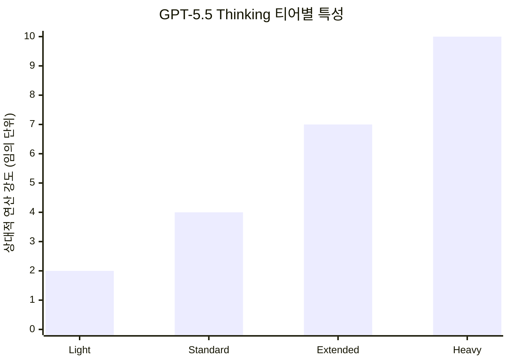
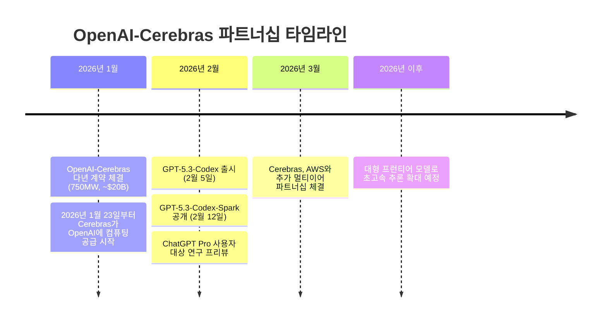

> Park Chansung([@Thomas.CS.Park](https://www.facebook.com/share/p/18TTbeXQwN/))이 macOS 앱 기본 설치 후 즉시 사용 조건으로 작성한 실사용 후기를 바탕으로, 공식 문서 및 최신 업계 동향을 종합하여 정리한 글입니다.

---

## 들어가며: Codex 앱이란 무엇인가

OpenAI의 Codex 앱은 단순한 코드 자동완성 도구가 아니다. 2025년 4월 클라우드 기반 소프트웨어 엔지니어링 에이전트로 연구 프리뷰를 시작한 Codex는, 2026년 2월 2일 macOS용 네이티브 데스크탑 앱 형태로 정식 출시되었다. 이후 Windows 버전도 추가로 제공되었으며, CLI·IDE 익스텐션·웹 인터페이스와 함께 ChatGPT 계정 하나로 연결되는 통합 개발 환경으로 진화하고 있다.

Codex가 기존 AI 코딩 도구들과 결정적으로 다른 점은 설계 철학에 있다. Cursor나 Windsurf(구 Codeium) 같은 도구들이 VSCode를 포크(fork)하여 그 위에 AI 레이어를 얹는 방식을 채택한 반면, Codex 앱은 처음부터 **에이전트 중심의 워크플로**를 위해 설계된 독립 애플리케이션이다. 코드 편집기라기보다 "여러 AI 에이전트를 동시에 지휘하는 커맨드 센터"에 가깝다.

OpenAI는 Codex 앱 출시 당시를 기준으로 월 백만 명 이상의 개발자가 Codex를 사용하고 있다고 밝혔으며, GPT-5.2-Codex 모델 출시(2025년 12월) 이후 전체 사용량이 두 배로 증가했다고 공개한 바 있다.

---

## 1. 쾌적함: 메시지가 쌓여도 버벅임이 없다

Codex 앱을 처음 사용한 개발자들이 공통적으로 꼽는 첫 번째 인상은 **응답 속도와 인터페이스의 유연함**이다.

웹 기반 도구들—특히 ChatGPT 브라우저 인터페이스—은 대화 메시지가 수십 개를 넘어가면 렌더링 지연이 눈에 띄기 시작한다. 브라우저가 DOM 요소를 누적하는 구조적 한계 때문이다. Codex macOS 앱은 네이티브 앱 아키텍처를 채택함으로써 이 병목을 구조적으로 회피한다. 메시지가 아무리 많아져도 인터페이스 자체의 버벅임은 발생하지 않는다.

내장 브라우저도 실무 편의성에 직접 기여한다. 웹 결과를 확인하기 위해 외부 브라우저로 컨텍스트를 전환할 필요가 없다. 앱 내에서 렌더링된 페이지를 즉시 확인할 수 있어, 코딩→실행→결과 확인의 루프가 단일 앱 안에서 완결된다.

이 쾌적함의 기반에는 OpenAI가 Cerebras와의 협업을 통해 진행한 **추론 스택 전반의 지연 최적화** 작업이 있다. OpenAI는 GPT-5.3-Codex-Spark 출시(2026년 2월 12일)와 함께 클라이언트-서버 왕복 오버헤드를 80% 줄이고, 토큰당 오버헤드를 30%, 첫 토큰 생성까지의 시간(TTFT)을 50% 단축했다고 밝혔다. 이 최적화는 Cerebras 전용 모델뿐 아니라 모든 Codex 모델에 적용된다.

---

## 2. 심플함: "IDE처럼 보이지만 본질은 터미널"

### VSCode 포크와의 철학적 차이

Cursor, Windsurf, Antigravity 등의 도구는 VSCode라는 거대한 플랫폼 위에 AI 기능을 얹는 방식이다. 익숙한 편집기 경험을 유지한다는 장점이 있지만, 그 대가로 VSCode 특유의 복잡성을 그대로 안고 간다. Extension인지, 커스텀 네이티브 기능인지 구분이 모호한 UI 요소들, 방대한 설정 항목들, 그리고 플랫폼 추상화 계층의 존재가 그것이다.

Codex 앱은 정반대 방향을 선택했다. 화면 레이아웃은 IDE처럼 보이지만, 내부 구조는 **터미널 수준의 단순한 앱**에 가깝다. 기본적으로 에이전트가 작업을 실행하고, 그 결과를 보기 좋게 렌더링하는 것이 전부다.

```
┌──────────────────────────────────────────────────────────────┐
│  Codex 앱 UI 구조                                             │
│                                                              │
│  ┌─────────────┐  ┌──────────────────────────────────────┐  │
│  │  사이드바   │  │       메인 대화 / 작업 영역           │  │
│  │             │  │                                      │  │
│  │  • Git 상태 │  │  마크다운 렌더링                      │  │
│  │  • Plan     │  │  코드 블록                           │  │
│  │  • 아티팩트 │  │  생성/수정된 파일 추적               │  │
│  │             │  │                                      │  │
│  │  [프로젝트  │  │  내장 브라우저 패널                   │  │
│  │   목록]     │  │  (웹 결과 즉시 확인)                 │  │
│  └─────────────┘  └──────────────────────────────────────┘  │
└──────────────────────────────────────────────────────────────┘
```

사이드바에는 Git 상태, 작업 계획(Plan), 생성된 아티팩트 같은 꼭 필요한 정보만 노출된다. 군더더기 없는 이 구조는 에이전트 작업의 진행 상황을 파악하는 데 집중할 수 있게 해준다.

### 멀티 프로젝트 병렬 실행

Codex 앱의 핵심 가치 제안 중 하나는 **여러 프로젝트를 동시에 진행**할 수 있다는 점이다. 실제 사용에서 3개 프로젝트를 병렬로 진행한 경험에 따르면, 각 작업의 진행/완료 여부를 앱 내에서 즉시 확인할 수 있는 수준의 관리가 가능하다. 에이전트들이 각자의 격리된 환경에서 독립적으로 작업하기 때문에, 한 에이전트의 작업이 다른 에이전트에게 영향을 미치지 않는다.

OpenAI가 공식적으로 내세우는 슬로건도 이를 반영한다. "built-in worktrees and cloud environments, agents work in parallel across projects, completing weeks of work in days."

---

## 3. 가독성: 마크다운 렌더링과 아티팩트 추적

### 터미널과의 비교

순수 CLI 환경(예: Claude Code 터미널)에서 에이전트 작업 결과를 따라가려면 텍스트 스크롤과 해석이 전부다. Codex 앱은 여기에 시각적 레이어를 더한다.

- **마크다운 렌더링**: 에이전트가 계획이나 설명을 출력할 때 마크다운 형식으로 렌더링되어 가독성이 높아진다.
- **아티팩트 추적**: 생성되거나 수정된 파일이 UI 상에서 명확하게 표시된다. 에이전트가 어떤 파일에 어떤 변경을 가했는지 히스토리를 한눈에 따라갈 수 있다.
- **인라인 스크린샷 렌더링**: 에이전트에게 화면을 캡처해서 보여달라고 요청하면 즉시 인라인으로 렌더링된다. 이 기능은 컨텍스트 전환 없이 시각적 결과를 확인할 때 특히 유용하다.

예를 들어 웹 앱을 만드는 과정에서 생성→확인 루프를 100회 이상 반복해야 하는 경우, 매번 외부 브라우저로 전환하는 것은 지루하다. Codex 앱은 이 루프를 앱 내부에서 완결시켜 집중력을 유지할 수 있게 한다.

이는 OpenAI가 공식 문서에서 설명하는 "Skills" 기능과도 연관된다. Skills는 지침, 리소스, 스크립트를 묶어 Codex가 코드 생성을 넘어 정보 수집, 문서 작성, 워크플로 자동화까지 수행할 수 있도록 확장하는 메커니즘이다.

---

## 4. Rate Limit과 크레딧 구조: 관대한 사용량, 비싼 추가 비용

### GPT-5.5 Thinking Extended 모드와 주간 사용량

현재(2026년 5월 기준) ChatGPT의 최신 모델은 2026년 4월 23일 공개된 **GPT-5.5**다. ChatGPT Pro($200/월) 구독자는 GPT-5.5 Thinking의 네 가지 티어(Light, Standard, Extended, Heavy)에 모두 접근할 수 있으며, Extended 이상부터는 상당한 연산 자원을 소비한다.



GPT-5.5 Thinking Extended(또는 이전 세대 모델의 동등 티어)를 동시에 3개 이상 프로젝트에 적용하면, $200 Pro 플랜의 주간 사용량이 2~3일 내에 소진될 수 있다. OpenAI 공식 문서도 "Codex 비용은 사용 모델, 동시 실행 인스턴스 수, 자동화 설정에 따라 개발자당 월 $100~200 수준이나 분산이 크다"고 명시하고 있다. 이 수치는 적절한 사용 환경에서의 평균치이며, 최고 추론 티어를 최대한 활용하는 경우라면 Pro 플랜 한도를 빠르게 소진하는 것이 오히려 자연스러운 결과다.

### 크레딧 구조와 가격 정책 변경

OpenAI는 2026년 4월 2일 Codex의 가격 체계를 **메시지당 과금에서 토큰 기반 과금**으로 전환했다. 이전에는 메시지 하나당 약 14 크레딧이 소모되는 방식이었고, $80 상당의 크레딧을 반나절 만에 소진할 수 있었다. 현재는 입력 토큰, 캐시된 입력 토큰, 출력 토큰 각각에 크레딧이 할당되어 실제 소비 패턴에 따라 비용이 달라진다.

핵심적인 경제학적 함의는 다음과 같다.

- Claude Code(CC)와 비교해 최상위 모델을 더 관대하게 사용할 수 있다.
- Thinking Budget(추론에 투입하는 연산량)도 상대적으로 크게 설정되어 있다.
- 추가 크레딧 구매 시에는 한 메시지로 최대한 많은 작업을 처리하는 효율적 프롬프팅이 비용 절감의 핵심이 된다.

Claude Code와 직접 비교하자면, Anthropic의 Claude Code Max 플랜도 최상위 모델(Claude Opus 4.6 등)의 사용에 월 사용량 제한이 있다. 어떤 도구가 더 "관대"한지는 사용 패턴에 따라 다르지만, 여러 에이전트를 동시에 최고 추론 모드로 돌리는 헤비유저 입장에서는 두 플랫폼 모두 추가 비용이 발생하는 구조다.

---

## 5. 속도 조절과 Cerebras 파트너십: 1.5배 모드의 배경

### Speed 1.5x 기능

Codex 앱에는 응답 속도를 조절할 수 있는 **Speed 설정**이 존재한다. 1.5x 모드를 활성화하면 Rate Limit이 빠르게 소진되는 대신 체감상 "미칠 듯이 빠른 속도"를 경험할 수 있다. OpenAI 공식 문서에 따르면, Fast mode는 일반 속도 대비 **2.5배의 크레딧**을 소모한다.

### Cerebras와의 파트너십: 1,200 토큰/초의 세계

이 속도 뒤에는 OpenAI와 Cerebras 간의 전략적 파트너십이 자리하고 있다.

OpenAI는 2026년 1월 Cerebras Systems와 다년간 계약을 체결했다. 3년간 750MW의 컴퓨팅 파워를 Cerebras로부터 공급받는 이 계약의 규모는 약 200억 달러에 달하는 것으로 알려졌다. 그 첫 번째 산물이 2026년 2월 12일 공개된 **GPT-5.3-Codex-Spark**다.



Cerebras의 핵심 기술은 **Wafer-Scale Engine(WSE-3)** 이다. 일반 GPU 기반 추론이 수십 개의 칩에 걸쳐 작업을 분산하면서 통신 오버헤드가 발생하는 것과 달리, WSE-3는 저녁 식사 접시 크기의 단일 칩 위에 4조 개의 트랜지스터를 집적하여 통신 지연을 구조적으로 제거한다. 그 결과 **초당 1,000~1,200 토큰 이상**의 생성 속도를 달성했다. 이는 기존 GPU 기반 추론 대비 최대 15배 빠른 속도다.

GPT-5.3-Codex-Spark는 GPT-5.3-Codex의 소형화 버전으로, 빠른 피드백이 중요한 실시간 코딩 작업에 최적화되어 있다. 긴 자율 실행 작업보다 짧은 편집 루프, 빠른 테스트 실행, 즉각적인 코드 수정 같은 대화형 개발 워크플로에 강점을 발휘한다.

OpenAI는 Cerebras를 GPU의 대체재가 아닌 **보완재**로 포지셔닝하고 있다. GPU는 학습과 비용 효율적인 대규모 추론에서 여전히 핵심적인 역할을 하며, Cerebras는 초저지연이 요구되는 실시간 워크플로에서 GPU를 보완하는 구조다.

### 인퍼런스 속도가 경쟁의 축으로

2025년까지 AI 개발 경쟁의 주요 축이 "모델 지능"이었다면, 2026년부터는 **추론 속도**가 새로운 경쟁 축으로 부상하고 있다. 구글은 Gemini 3 Flash를 Gemini 3 Pro보다 3배 빠르게 만들었고, Anthropic은 Claude Opus 4.6의 2.5배 빠른 속도 특화 버전을 출시했으며, OpenAI는 Cerebras와 협력하여 Codex-Spark를 공개했다. 더 빠른 추론이 가능하면 개발자들이 더 짧은 피드백 루프로 더 많은 반복을 할 수 있고, 그것이 더 좋은 소프트웨어로 이어진다는 논리다.

---

## Codex 앱의 포지셔닝: Claude Code와의 비교 관점

실사용자 관점에서 Codex 앱과 Claude Code(Anthropic)는 각자 다른 장점을 가진다.

| 항목 | Codex 앱 | Claude Code |
|---|---|---|
| UI | 네이티브 macOS/Windows 앱, 내장 브라우저 | CLI 기반 (터미널), IDE 익스텐션 |
| 멀티 에이전트 | 앱 UI 내에서 여러 프로젝트 동시 시각화 | 병렬 실행 가능하나 시각화 레이어 없음 |
| 속도 | Fast mode(Cerebras 기반) 1.5x 선택 가능 | 기본 추론 속도 |
| 요금 체계 | ChatGPT Pro $200/월 포함, 추가 크레딧 구매 | Claude Code Max 플랜별 상이 |
| 에코시스템 | ChatGPT·Codex CLI·IDE 익스텐션 통합 | Anthropic API, MCP 생태계 |
| 기반 모델 | GPT-5.5 (Codex 내 400K 컨텍스트) | Claude Opus 4.6 / Sonnet 4.6 |

어느 도구가 우월하다는 단순 결론보다는, 워크플로의 성격에 따라 선택이 달라진다. 웹 결과를 직접 확인하며 시각적으로 여러 에이전트를 관리하고 싶다면 Codex 앱이, 터미널 중심의 깊은 코드베이스 작업이나 MCP 에코시스템 활용이 우선이라면 Claude Code가 더 적합할 수 있다.

---

## 결론: "앱처럼 생겼지만 새로운 패러다임"

Park Chansung의 후기는 Codex 앱을 단순히 "또 하나의 AI 코딩 도구"가 아닌, **에이전트 기반 소프트웨어 개발의 새로운 작업 방식**을 체험한 관점에서 기술하고 있다. 핵심 요약은 다음과 같다.

첫째, Codex 앱은 VSCode를 포크한 도구들과 달리 처음부터 에이전트 커맨드 센터로 설계되어, 군더더기 없는 심플함과 쾌적한 성능을 동시에 제공한다.

둘째, 마크다운 렌더링과 아티팩트 추적 덕분에 터미널 대비 작업 흐름의 가독성이 높고, 생성→확인 루프를 앱 내에서 완결할 수 있다.

셋째, $200 Pro 플랜은 최상위 추론 모드(GPT-5.5 Thinking Extended/Heavy)를 동시에 여러 프로젝트에 적용하는 헤비유저에게도 상대적으로 관대한 편이지만, 추가 크레딧은 빠르게 소진될 수 있다.

넷째, Cerebras와의 파트너십에서 비롯된 Speed 1.5x 모드는 1,000토큰/초 이상의 생성 속도를 체감할 수 있게 해주며, 이는 단순한 편의 기능이 아니라 실시간 코딩 루프의 구조적 가속이다.

AI 추론 속도가 경쟁의 새로운 축이 된 2026년, Codex 앱은 그 변화를 개발자가 직접 손으로 만질 수 있게 해주는 가장 구체적인 인터페이스 중 하나다.

---

*작성일: 2026년 5월 13일*
