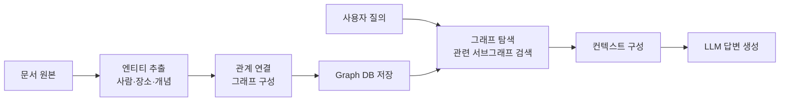
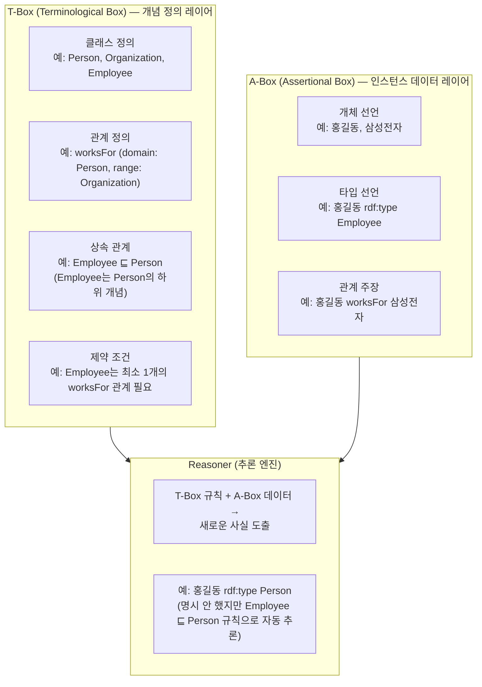
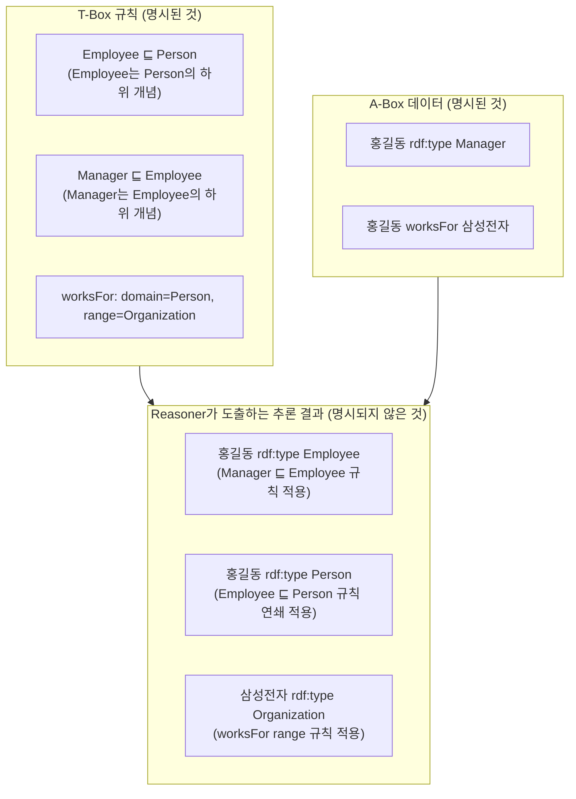
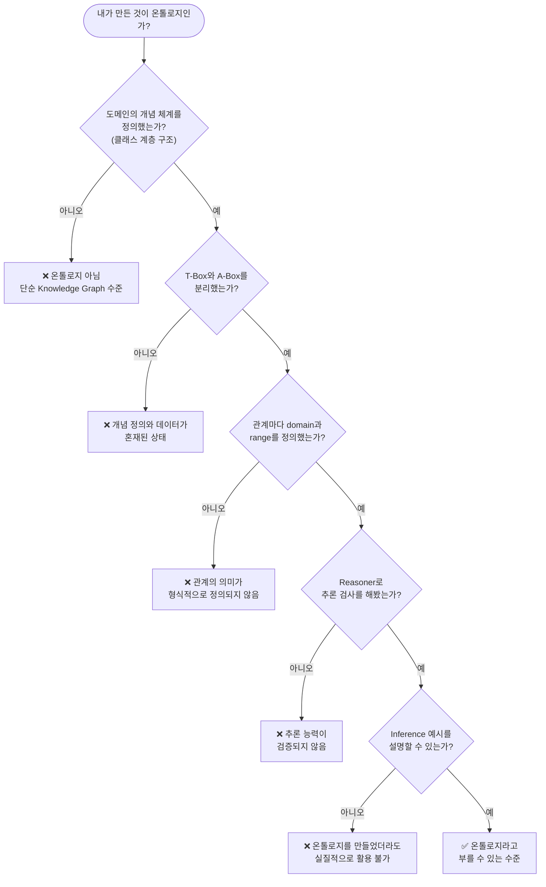
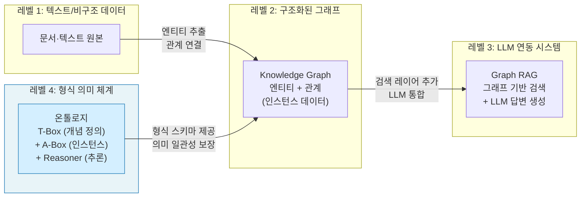

> "내가 만든 게 온톨로지인지 아닌지 판단하려면 스스로에게 이렇게 한번 물어봐봐.  
> Graph RAG랑 내가 만든 게 뭐가 다른 걸까?"  
> — [@gptaku_ai]( https://www.threads.com/@gptaku_ai/post/DYO5vsRk40r) (Threads, 2025)

---

## 들어가며: 왜 이 논쟁이 생겼는가

최근 AI 커뮤니티, 특히 한국의 기술 블로그와 소셜 미디어에서 "온톨로지 구축"이라는 표현이 자주 등장하기 시작했다. RAG(Retrieval-Augmented Generation) 시스템을 개발하거나, 개인 지식 관리 도구(Obsidian 등)를 활용하는 사람들 사이에서 "그래프로 연결했다", "온톨로지를 만들었다"는 말이 뒤섞여 쓰이고 있다.

문제는 이 표현들이 기술적으로 동일한 의미가 아니라는 점이다. Threads(@gptaku_ai)에서 한 개발자가 정확히 이 지점을 짚었다. 요지는 명확하다. **"노드와 엣지로 연결된 그래프"와 "그 연결을 해석하는 규칙을 정의한 온톨로지"는 근본적으로 다르다.** 

이 글에서는 Knowledge Graph, Graph RAG, 온톨로지(Ontology)가 각각 무엇인지, 어떤 점에서 다른지, 그리고 어떤 상황에서 어떤 것이 적합한지를 가능한 한 명확하게 설명한다.

---

## 1. 세 가지 개념의 기본 정의

### 1-1. Knowledge Graph (지식 그래프)

Knowledge Graph는 **현실 세계의 엔티티(사람, 장소, 개념, 사건 등)를 노드(node)로, 그들 사이의 관계를 엣지(edge)로 표현한 그래프 구조**다. 각 노드와 엣지는 속성(property)을 가질 수 있다.

예를 들어 이런 식이다.

- 노드: `홍길동`, `삼성전자`, `서울`
- 엣지: `홍길동 → [재직중] → 삼성전자`, `삼성전자 → [본사위치] → 서울`

이 구조는 관계형 데이터베이스(RDBMS)에서는 표현하기 번거로운 **복잡한 다대다 관계(Many-to-Many)** 를 직관적으로 표현할 수 있고, 그래프 순회(traversal)를 통한 다중 홉(multi-hop) 추론이 가능하다. Neo4j 같은 그래프 DB가 대표적인 구현 도구다.

그러나 Knowledge Graph는 **"이 연결이 어떤 의미인지"를 형식적으로 정의하지 않는다.** 데이터(인스턴스)의 집합이지, 그 데이터를 해석하는 규칙의 집합이 아니다.

### 1-2. Graph RAG

Graph RAG는 **LLM(대규모 언어 모델)의 답변 생성에 Knowledge Graph를 검색 수단으로 활용하는 아키텍처**다. Microsoft가 2024년 제안한 GraphRAG가 대표적이며, 이후 다양한 변형이 등장했다.

기본 파이프라인은 다음과 같다.

Graph RAG의 강점은 기존 Vector RAG가 갖는 **청크 단편화(chunk fragmentation)** 문제, 즉 여러 문서에 걸쳐 있는 관계적 정보를 통합하지 못하는 한계를 일정 부분 극복한다는 점이다. 엔티티 간 관계를 그래프로 유지하기 때문에, "A와 B의 관계는 무엇인가?" 같은 질문에 더 정확하게 답할 수 있다.

하지만 Graph RAG 역시 **그래프 생성과 검색** 단계까지다. 개념 체계를 정의하거나, 논리적 추론 규칙을 명시하지는 않는다.

### 1-3. 온톨로지 (Ontology)

온톨로지는 철학 용어에서 왔다. 원래 "존재론", 즉 "무엇이 존재하는가"를 다루는 학문 분야다. 컴퓨터 과학에서의 온톨로지는 이 개념을 차용하여 **특정 도메인에서 존재하는 개념(class)들, 그 개념들 사이의 관계(property), 그리고 그 관계에 대한 제약 조건(constraint)을 형식적 언어로 정의한 스키마**를 의미한다.

핵심 표준 언어는 **OWL(Web Ontology Language)** 이며, W3C에서 관리한다.

온톨로지는 단순히 데이터를 연결하는 것이 아니라, 다음을 정의한다.

- **어떤 개념이 존재하는가** (클래스 정의)
- **개념들이 어떤 관계를 맺을 수 있는가** (관계의 domain과 range)
- **어떤 조건이 성립하면 새로운 사실을 논리적으로 추론할 수 있는가** (추론 규칙)
- **어떤 관계는 불가능한가** (제약 조건, disjointness)

이 점에서 온톨로지는 Knowledge Graph의 **상위 개념이자 설계도**에 해당한다. @bigtable.anonymous가 Threads에서 표현한 것처럼, "온톨로지는 스키마이고 그래프는 인스턴스"다.

---

## 2. T-Box와 A-Box: 온톨로지의 핵심 구조

온톨로지를 이해하는 데 가장 중요한 개념이 바로 **T-Box**와 **A-Box**의 분리다. 이 구분을 이해하면 온톨로지와 일반 지식 그래프의 차이가 명확해진다.

### T-Box: 개념 정의 레이어

T-Box(Terminological Box)는 온톨로지의 **용어적·개념적 틀**을 정의하는 부분이다. 쉽게 말하면 "이 도메인에서는 어떤 종류의 것들이 있고, 그것들이 어떻게 서로 관련될 수 있는가"에 대한 규칙집이다.

- `Person`, `Organization`, `Employee`, `Manager` 같은 **클래스(개념)** 정의
- `worksFor`, `manages`, `locatedIn` 같은 **관계(property)** 정의
- 각 관계가 어떤 클래스 사이에만 성립할 수 있는지 명시 — 예: `worksFor`의 **domain은 Person**, **range는 Organization**
- `Employee ⊑ Person` 같은 **상속 관계(subsumption)** — Employee는 Person의 하위 개념
- `Manager ⊑ Employee` — Manager는 Employee의 하위 개념, 따라서 Manager는 Person이기도 함

### A-Box: 인스턴스 데이터 레이어

A-Box(Assertional Box)는 **실제 데이터, 즉 구체적인 개체들과 그들 사이의 실제 관계**를 담는다.

- `홍길동 rdf:type Employee`
- `홍길동 worksFor 삼성전자`
- `삼성전자 rdf:type Organization`

Knowledge Graph만 있는 경우, 이 A-Box 수준의 데이터만 존재하는 경우가 많다. 

### T-Box와 A-Box를 분리하는 이유

분리가 중요한 이유는 **재사용성과 추론 가능성** 때문이다. T-Box(개념 정의)는 데이터가 바뀌어도 변하지 않는다. 반면 A-Box(인스턴스)는 계속 추가·변경된다. 이 둘을 명확히 분리해야 Reasoner가 T-Box의 규칙을 A-Box 데이터에 적용하여 **명시적으로 서술되지 않은 새로운 사실**을 논리적으로 도출할 수 있다.

---

## 3. Reasoner(추론 엔진): 온톨로지의 핵심 가치

온톨로지가 단순 Knowledge Graph와 가장 극명하게 다른 지점이 바로 **Reasoner**의 존재다.

Reasoner는 온톨로지에 정의된 T-Box 규칙들을 읽고, A-Box 데이터에 적용하여 **논리적으로 따라오는 결론을 자동으로 도출**하는 도구다. 대표적인 구현으로는 HermiT, Pellet, FaCT++, ELK 등이 있다.

### 추론의 구체적인 예시

이것이 중요한 이유는 **LLM이 "그럴듯하게" 추론하는 것과 근본적으로 다르기** 때문이다. Reasoner는 형식 논리에 따라 항상 동일한 결론을 도출한다. 규칙이 바뀌지 않는 한 결과가 바뀌지 않는다. 이것이 **결정론적 추론(deterministic reasoning)** 이다.

Graph RAG에서 LLM이 답하는 것은 확률적 패턴 매칭이다. 같은 질문을 두 번 해도 다른 답이 나올 수 있다. 온톨로지 기반 추론은 그렇지 않다.

---

## 4. "내가 만든 게 온톨로지인지" 자가진단하는 법

이 중 하나라도 "아니오"라면, 그것은 "잘 만든 Knowledge Graph"다. 이것이 나쁜 것이 아니다. 오히려 많은 실용적 목적에는 Knowledge Graph나 Graph RAG로 충분하다.

---

## 5. 기술 스택 기준으로 본 정리

실무에서 어떤 도구를 썼는지로도 대략 구분이 가능하다.

| 표현 | 일반적인 실체 | 설명 |
|------|------------|------|
| `Neo4j로 관계 연결했다` | Graph DB / Knowledge Graph | 관계형 그래프 저장소. 스키마 없이도 가능 |
| `문서에서 개체 뽑고 연결했다` | Knowledge Graph | 엔티티 추출 + 관계 연결. 온톨로지 없음 |
| `그래프 기반 RAG 만들었다` | Graph RAG | 그래프를 검색 인프라로 활용. LLM 답변 생성 |
| `OWL로 클래스/관계 정의하고 Reasoner 돌렸다` | **온톨로지** | T-Box/A-Box 분리, 형식 추론 가능 |
| `Obsidian에 노드 만들고 링크했다` | 개인 지식 관리 도구 | 온톨로지와 무관. 시각적 그래프 뷰일 뿐 |

---

## 6. 온톨로지를 실제로 써야 하는 상황

온톨로지가 실질적으로 필요한 영역은 다음과 같다.

**의미의 일관성이 절대적으로 요구되는 영역.** 의료, 법률, 생명과학 같은 도메인에서는 "Drug"와 "Medication"이 같은 개념인지, "side effect"와 "adverse event"가 같은 것인지를 **형식적으로 정의**해야 한다. 시스템끼리 동일한 개념을 동일한 의미로 이해해야 하기 때문이다. 의료 분야의 SNOMED CT, 생명과학의 Gene Ontology(GO), 식품 도메인의 FoodOn 같은 표준 온톨로지들이 이런 이유로 존재한다.

**여러 시스템이 데이터를 공유해야 하는 인터오퍼러빌리티(Interoperability) 환경.** 서로 다른 기관, 서로 다른 시스템이 동일한 개념을 다루어야 할 때 온톨로지가 공통 어휘(vocabulary) 역할을 한다.

**명시되지 않은 새로운 사실을 논리적으로 도출해야 하는 경우.** 온톨로지 기반 Reasoner를 통해 데이터에 직접 기록되지 않은 관계를 추론할 수 있다. 이것은 LLM의 확률적 추론과 달리 결정론적이고 설명 가능하다.

반대로, **개인이 보유한 대부분의 자료**나 **소규모 지식 관리 시스템**에서는 이 수준의 형식화가 필요하지 않다. @gptaku_ai의 답변처럼, 이런 경우에는 관계형 DB나 단순 Knowledge Graph가 훨씬 현실적이다. 온톨로지 구축은 상당한 도메인 전문성과 시간 투자를 요구한다.

---

## 7. 과도한 포장의 문제

이 논쟁에서 핵심적인 지적은 기술 용어의 **인플레이션** 문제다.

"Knowledge Graph를 만들었다"보다 "온톨로지를 구축했다"가 더 있어 보인다는 이유로 잘못된 용어가 퍼진다. 이는 단순한 명칭 문제를 넘어, **기술적 개념 자체가 희석**될 수 있다는 점에서 심각하다.

실제로 온톨로지 분야에서 T-Box/A-Box 구분, OWL 문법, Reasoner 사용 등은 상당한 전문 지식이 필요한 작업이다. "Claude Code로 주말에 뚝딱 만들 수 있는" 것이 아니다. 반대로, Graph RAG나 Knowledge Graph는 LLM 기반 자동화 도구 덕분에 진입 장벽이 빠르게 낮아지고 있다. 이 둘을 혼용하면 실제 온톨로지 엔지니어링이 요구하는 전문성이 보이지 않게 된다.

---

## 8. 온톨로지 + Graph RAG의 결합: 최신 연구 방향

흥미로운 점은 최근 연구들이 온톨로지와 Graph RAG를 대립 관계가 아닌 **보완 관계**로 보고 있다는 것이다.

2025년 arXiv에 발표된 연구("Ontology Learning and Knowledge Graph Construction")에 따르면, 온톨로지가 가이드하는 Knowledge Graph를 기반으로 한 RAG 시스템이 벡터 검색 기반 RAG를 크게 앞서는 성능을 보였으며, 최신 GraphRAG 프레임워크와도 경쟁력 있는 수준을 보였다.

Knowledge Graph가 검증된 컨텍스트를 제공하는 반면, 온톨로지는 그 컨텍스트를 충분히 일관되게 유지하여 LLM이 올바른 이유로 올바른 것을 검색할 수 있도록 돕는다. 기업 수준의 RAG 시스템, 내부 코파일럿, 의사결정 지원 도구를 구축할 때 이 기반 구조의 품질이 신뢰성, 정확성, 설명 가능성에 직접적인 영향을 미친다.

온톨로지 기반 Knowledge Graph가 스키마 없는 GraphRAG 시스템의 다중 홉 질의응답 정확도를 높이는 것이 입증되었으며, 단순한 연관 검색 엔진을 추론 엔진으로 변환시키는 것이 가능하다는 연구 결과도 있다.

이는 곧 **온톨로지는 Graph RAG의 상위 대체재가 아니라, 더 신뢰할 수 있는 Graph RAG를 만들기 위한 기반**이 될 수 있다는 뜻이다. 단, 이 수준은 단순한 엔티티 추출과 그래프 연결을 넘어선다.

---

## 9. 전체 개념 관계 정리

---

## 결론: 이름이 아니라 개념을 정확히

그래프 ≠ 온톨로지. 이 등식이 이 글 전체의 요약이다.

Knowledge Graph는 데이터다. Graph RAG는 그 데이터를 검색과 답변 생성에 활용하는 아키텍처다. 온톨로지는 그 데이터와 아키텍처 위에 **개념 정의, 관계의 의미, 논리적 추론 규칙**을 형식적으로 정의한 상위 구조다.

셋 중 어느 것이 더 우월한가의 문제가 아니다. **어떤 문제를 풀고 있는가**에 따라 적합한 도구가 다르다. 개인 자료 정리에 온톨로지가 필요하지 않다. 하지만 의료 시스템 간 데이터 교환이나 법률 추론 엔진이 필요한 곳에서는 Knowledge Graph만으로는 부족하다.

자신이 만든 것을 정확하게 부르는 것, 그리고 각 개념이 무엇을 의미하는지 알고 쓰는 것. 기술 커뮤니티에서 개념 인플레이션을 막기 위한 가장 기본적인 태도다.

---

*작성일: 2026년 5월 13일*
