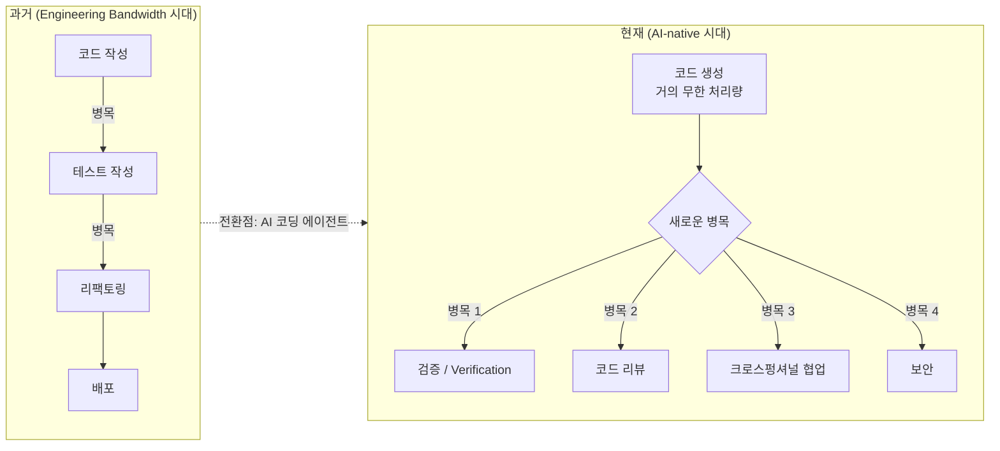
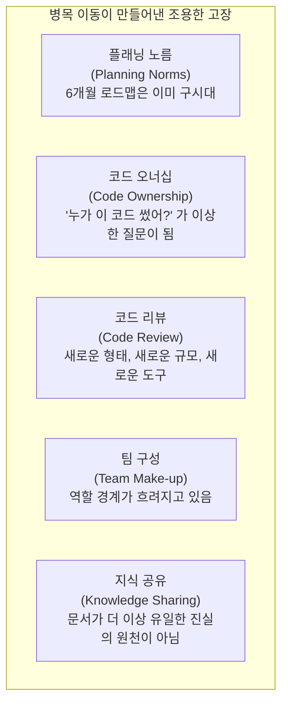
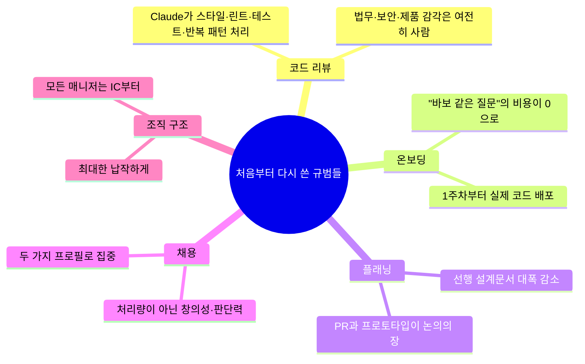
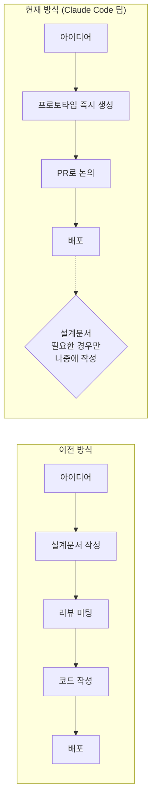
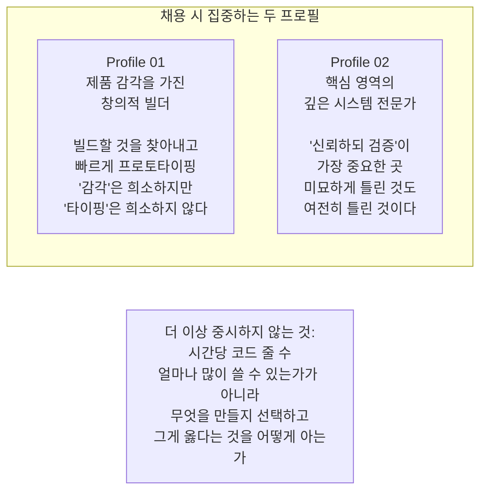
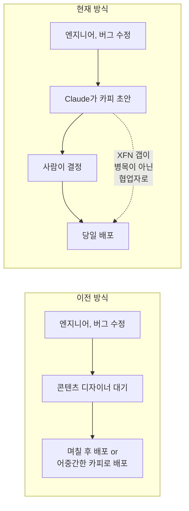
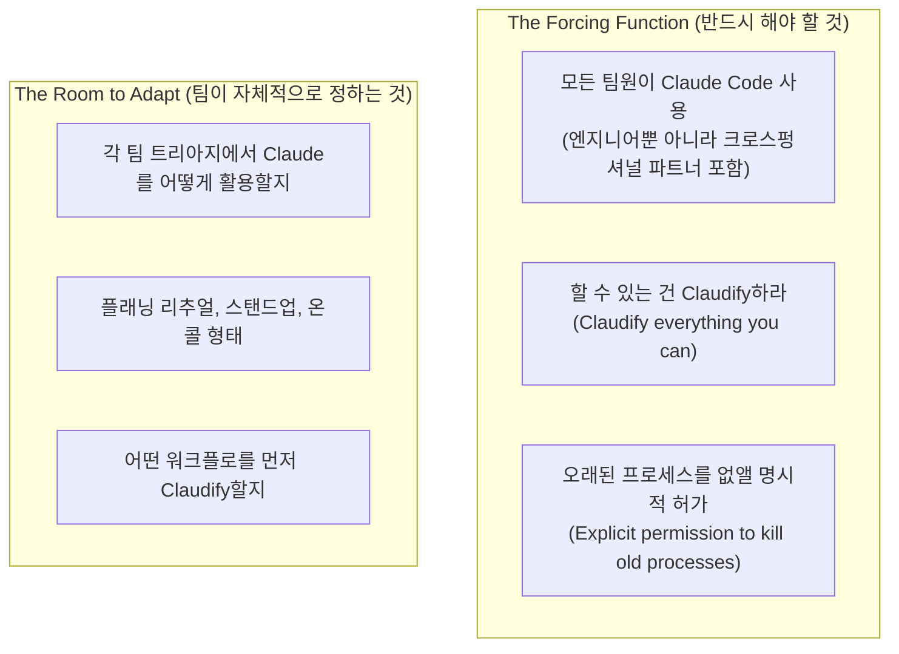
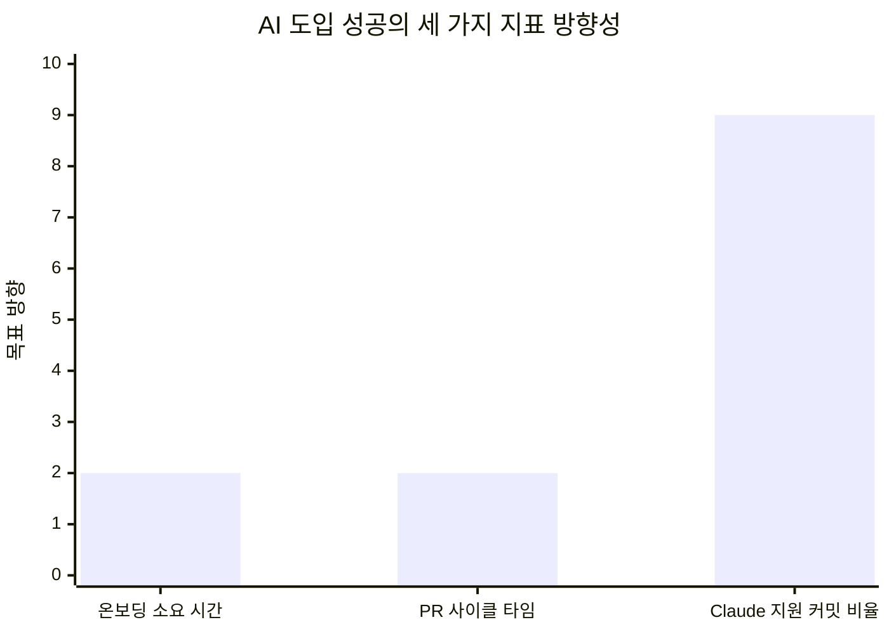
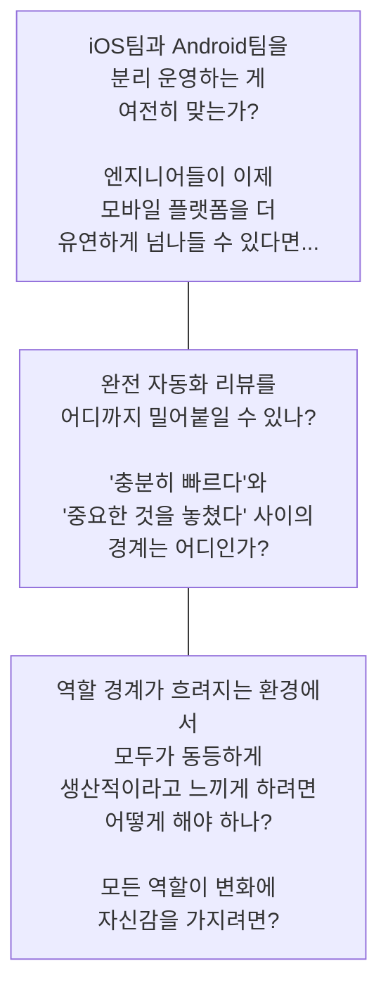
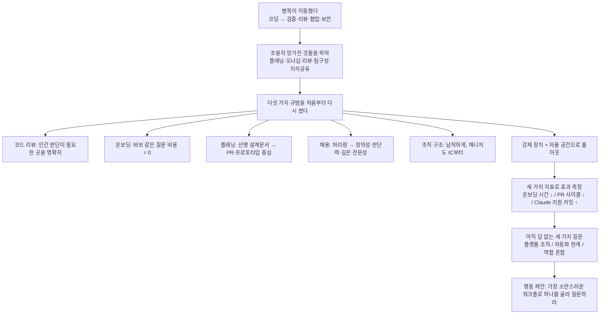

### Fiona Fung (Anthropic, Claude Code 엔지니어링 책임자) — Code with Claude 2026 발표 세션 전체 분석

---

## 발표 개요

2026년 5월 6일, 샌프란시스코에서 열린 Anthropic의 개발자 컨퍼런스 **Code with Claude 2026**에서 Fiona Fung은 약 28분짜리 발표를 진행했다. 그는 Claude Code와 Co-work 두 제품의 엔지니어링·프로덕트 총괄 책임자로, 마이크로소프트에서 12년(Visual Studio 포함), 이후 Meta(Facebook Marketplace, Instagram 팀)를 거쳐 2025년 9월 Anthropic에 합류했다.

발표 제목은 평범해 보인다. "AI 네이티브 엔지니어링 조직 운영하기." 그러나 그 내용은 전혀 추상적이지 않다. Anthropic의 Claude Code 팀이 실제로 무엇을 부수고, 무엇을 새로 썼는지, 그리고 아직도 답을 못 찾고 있는 현실적 질문들이 솔직하게 담겨 있다.

발표를 준비하는 약 한 달 사이에도 슬라이드를 다시 고쳐야 했다는 고백으로 강연을 시작한 것이 인상적이다. 처음 초안을 쓸 때만 해도 Anthropic에 Routines 기능이 없었는데, 강연 전 출시되면서 이미 구시대 이야기가 된 슬라이드가 생겼다는 것이다. 이 에피소드 자체가 발표의 핵심 메시지를 담고 있다. **지금 유효한 것이 한 달 뒤에도 유효하리라는 보장이 없다.**

---

## 1부 — 병목이 움직였다: "The Shift"

Fiona는 청중을 2000년대 초로 데려가는 것으로 발표를 시작한다. Visual Studio 2005를 개발할 당시, 소프트웨어는 CD-ROM에 구워서 공장에 보내고, 공장이 디스크를 찍어 상자에 담아 매장에 보내는 방식으로 배포됐다. 그래서 출시일은 절대적 마감이었다. 이후 인터넷이 등장하며 배포 방식이 바뀌자 엔지니어링의 리듬이 근본적으로 달라졌다. Fiona는 지금이 그에 필적하는, 혹은 그보다 더 큰 전환점이라고 말한다.

핵심 명제는 단순하다. **수십 년간 소프트웨어 개발의 모든 프로세스는 "엔지니어링 대역폭이 비싸다"는 가정 위에 설계됐다.** 코드를 쓰는 것도, 테스트를 쓰는 것도, 리팩토링도 다 비쌌다. 워터폴이든 애자일이든 결국 이 희소 자원을 어떻게 배분하느냐의 문제였다.

작년까지만 해도 그는 vibe coding을 보며 "왜 상수를 저렇게 남발하냐, 좋은 엔지니어링 관행이 아니다"라고 투덜거렸다고 한다. 그러나 지금은 모델이 너무 좋아졌다. 단순히 속도가 빨라진 게 아니다. **처리량(throughput) 자체가 자릿수가 다르게 늘어났다.** 코드를 만드는 행위의 비용이 사실상 0에 가까워진 것이다.

그렇다면 병목은 어디로 갔는가. Fiona가 다른 엔지니어링 리더들에게 가장 많이 받는 질문은 "그 코드를 인간이 어떻게 다 리뷰하냐"였다. 새 병목은 이렇게 생겼다.

- **검증(Verification)**: 이 코드는 올바른가?
- **코드 리뷰**: 누가 이걸 검토하는가?
- **유지보수**: 쏟아지는 코드의 장기 비용은?
- **크로스펑셔널 파트너십**: 보안, 법무, 디자인팀이 처리량을 따라올 수 있는가?

그리고 발표 전체에서 반복되는 한 마디가 있다. **"과거에 통했던 것이 더 이상 통하지 않을 수 있다."** (What served you prior may not serve you any longer.)

---

## 2부 — 조용히 작동을 멈춘 것들

Fiona는 "조용히 작동을 멈춘다"(quietly stops working)는 표현을 특히 좋아한다고 했다. 프로세스는 스스로 죽지 않는다. 이유가 있어서 만들었고, 그 이유가 사라져도 프로세스는 살아남아 축적된다. 어느 팀에서는 P0 버그 SLA, high-pri 리뷰 SLA, SE 리뷰 SLA가 쌓여 SLA들의 우선순위를 매기는 SLA가 필요해졌다.

### 2-1. 플래닝 방식

Anthropic 입사 초기 그는 6개월 로드맵을 만들었다. 석 달쯤 지나 새해를 넘기고 돌아보니 이미 많은 것이 바뀌어 있었다. 6개월 계획이 너무 길다는 것을 실감했다. 이제 Claude Code 팀의 플래닝은 **JIT(Just-In-Time) 컴파일에 비유할 만큼 즉각적**이다. 프로토타이핑과 코드 생성이 더 이상 병목이 아닌 세상에서, 긴 선행 계획은 오히려 낭비다.

### 2-2. 기술 토론 방식

예전에는 기술적 선택을 두고 논쟁이 생기면 화이트보드 앞에 모여 아키텍처를 그렸다. Fiona도 입사 초기 Boris Cherny(Claude Code 창업자)와 리팩토링 방향을 두고 이견이 생겼을 때, 본능적으로 "회의실 가서 화이트보드 그리자"고 하려 했다. 그러다 멈췄다. 지금은 논의 중인 세 가지 구현 방안을 Claude에게 각각 PR로 만들게 할 수 있다는 걸 깨달았다. 그렇게 하면 구현 방식뿐 아니라 API 호출자들에 미치는 실제 영향까지 코드로 비교할 수 있다.

**"빌딩이 싸지면 논쟁이 비싸진다."** 단, 이 원칙에는 전제가 있다. 코드가 빠르게 생성되는 환경일수록 "마지막에 PR 올린 사람이 이기는" 문화가 생길 위험이 있다. 새벽 3시에 PR을 밀어넣어 기정사실로 만드는 전략이 가능해진다는 뜻이다. 그래서 기술 토론에서 코드가 승자를 결정하게 하되, **팀 문화와 정렬(alignment) 프로세스는 더 명확히 세워야 한다.**

### 2-3. 코드 오너십

모든 PR에 Claude가 관여하는 환경에서 "누가 이 코드를 만들었나"는 질문은 점점 이상해진다. 그렇다고 이 질문이 아무 의미가 없는 건 아니다. Fiona는 이 질문 뒤에 **실제로 답해야 할 진짜 질문**이 무엇인지를 파악하라고 말한다.

- 이 버그를 낸 사람을 찾는 것인가? → 블레임이 아니라 마지막으로 건드린 맥락을 찾는 것
- 고객 질문에 답할 전문가를 찾는 것인가?
- 이 코드의 배경 맥락을 이해하려는 것인가?

그리고 그 진짜 질문에 Claude가 직접 답할 수 있도록 자동화할 방법을 찾으라고 권한다. Fiona 자신은 매일 아침 desktop Claude Code와 로컬 레포지토리를 열고 고객 피드백 채널 요약을 하며 하루를 시작했는데, 이제 그 루틴은 Routines 기능으로 자동화됐다.

---

## 3부 — 처음부터 다시 쓴 다섯 가지 규범

### 3-1. 코드 리뷰: 인간 판단이 실제로 필요한 곳

Claude Code 팀은 코드 리뷰를 Claude에게 많이 위임했다. 스타일, 린트, PR 피드백 요청, 버그 포착, 테스트 추가처럼 반복적이고 패턴화된 작업들이다. 그러나 **여전히 사람이 반드시 봐야 하는 영역**이 있다.

- **법무 리뷰**: 리스크 허용 범위는 AI가 판단할 수 없다
- **보안 민감 코드**: 신뢰 경계(trust boundary)와 관련된 영역
- **제품 감각과 미적 판단**: Fiona가 터미널에 홀리데이 테마를 입히려고 Claude에게 스노우맨을 만들어 달라고 했더니 'Mr. Peanut'처럼 나왔다. 이런 감각은 아직 디자이너가 필요하다.

원칙은 **"신뢰하되 검증하라(Trust but verify)"** 다. 어느 영역을 얼마나 자동화할지는 리스크 허용 범위에 따라 다르고, 모델 성능이 계속 올라가면서 이 선도 계속 이동한다.

### 3-2. 온보딩: "바보 같은 질문"의 비용이 0이 됐다

신입 엔지니어나 다른 직군이 팀에 합류했을 때 겪는 가장 큰 장벽 중 하나는 "이 질문을 해도 되나"의 두려움이다. Claude Code를 활용한 온보딩에서는 이 비용이 사라진다. 레포지토리를 열고 Claude에게 물으면 된다. **첫 주부터 실제 코드를 배포하는 것이 가능해졌다.** 이것이 온보딩 소요 시간을 극적으로 줄인 직접적 원인이다.

### 3-3. 플래닝: "코드 전에 설계문서" 관행의 해체

Fiona는 거의 모든 코딩 전에 설계문서를 쓰던 관행을 대폭 줄였다. 그의 표현에 따르면 대부분의 설계문서는 "극장"(theater)이었다. 실제 가치는 PR과 프로토타입에서 나온다. 단, 비동기 논의가 필요한 복잡한 케이스에서는 여전히 설계문서가 의미있다고 덧붙인다. AI 네이티브 팀에서도 설계문서가 완전히 사라지는 것은 아니다. 타이밍이 바뀐 것이다. 코드를 쓰기 전에 설계문서를 쓰는 게 아니라, 필요하다면 코드를 본 후에 문서를 쓴다.

### 3-4. 채용: 처리량이 아니라 창의성과 판단력

Claude Code 팀에서 더 이상 중요하지 않은 채용 기준은 **원시 처리량(raw throughput)** 이다. 시간당 몇 줄의 코드를 쓸 수 있는가는 이제 의미 없다. Fiona가 집중하는 두 프로필이 있다.

첫째, **제품 감각을 가진 창의적 빌더.** 무엇을 만들어야 하는지 발견하고, 빠르게 프로토타입하고, 사용자가 기뻐하는 경험을 만들기 위해 끊임없이 반복하는 사람이다. 감각(taste)은 희소하지만 타이핑(typing)은 이제 희소하지 않다는 표현이 핵심이다.

둘째, **핵심 영역의 깊은 시스템 전문가.** Fiona는 입사 초기 Claude Code 팀이 제품 제너럴리스트는 잘 갖춰져 있었지만 분산 시스템 전문가가 부족했다고 말한다. Claude Code Remote처럼 어디서든 Claude를 실행하는 인프라를 만들 때는 여전히 이 전문성이 필요하다. AI가 미묘하게 잘못된 것을 만들어 냈을 때 그걸 잡아낼 수 있는 사람이 필요하다.

### 3-5. 조직 구조: 납작하게, 매니저는 IC부터

가장 논란이 됐던 결정이다. Fiona가 채용 파트너에게 "모든 매니저는 IC(Individual Contributor, 개인 기여자)로 먼저 시작해야 한다"고 말했을 때, 담당자의 첫 반응은 "어떤 매니저가 그걸 원하겠냐"였다. Fiona의 대답은 간단했다. "원하지 않는 사람이라면 일찍 이별하는 것이 낫다."

이 원칙의 근거는 명확하다.

- 코드에서 빠져나온 리더는 팀원들에게 '빠르게 프로토타입하고 버려라'를 코칭할 수 없다. 자신이 하지 않는 것을 가르칠 수 없기 때문이다.
- 직접 제품을 써보는 것이 제품을 잘 만드는 가장 빠른 길이다(dogfooding).
- Meta에서는 내부 툴이 너무 자주 바뀌어 git 명령어를 익히면 이미 바뀌어 있었다. 이제는 Claude에게 물으면 된다. 진입 장벽이 낮아졌으니 리더도 다시 코드에 들어올 수 있다.

조직은 최대한 납작하게 유지한다. Claude Code와 Co-work 전체 팀이 하나의 미션을 공유한다. 여러 팟(pod)으로 나누면 각 팟이 자체 미션을 만들고 싶어 하고, 방향을 바꿀 때 정렬 비용이 커지기 때문이다.

---

## 4부 — 크로스펑셔널 갭을 Claude가 메운다

역할 경계가 흐려진다는 것은 단순히 엔지니어가 디자인을 더 한다는 뜻이 아니다. 실무에서 생기는 가장 큰 병목 중 하나는 **크로스펑셔널 갭(cross-functional gap)** 이다. 예를 들어 설문 응답 문구를 업데이트하고 싶을 때 전담 콘텐츠 디자이너가 없으면 며칠이 걸리거나, 어중간한 카피로 그냥 배포하는 경우가 생겼다.

Claude는 이 갭을 메우는 협업자가 됐다. 이전에는 콘텐츠 디자이너를 기다렸다. 지금은 Claude가 초안을 내고 사람이 최종 결정을 내린다. 핵심은 **"사람은 사라지지 않는다. 사람이 첫 번째 초안을 쓰지 않아도 된다는 것이다."**

반대 방향도 작동한다. PM이 코드를 작성하고, 엔지니어가 카피를 다듬는다. 역할이 고정된 사일로가 아니라 AI를 매개로 경계를 가로지르는 협업이 일상화됐다.

---

## 5부 — 어떻게 새 규범을 팀에 뿌리내렸나

모든 것을 위에서 내려오는 규정으로 강제하지는 않는다. Fiona의 접근은 두 가지 레이어로 나뉜다. 첫 번째는 전체가 정렬해야 하는 **강제 장치(forcing function)**, 두 번째는 각 팟이 자율적으로 결정하는 **자율 공간(room to adapt)** 이다.

강제 장치의 세 가지는 다음과 같다.

- **모든 팀원이 Claude Code를 사용한다.** 엔지니어뿐만 아니라 모든 크로스펑셔널 파트너 포함이다. Co-work도 팀 전체가 활발히 쓴다.
- **할 수 있는 건 Claudify하라.** 지금 하고 있는 일을 Claude가 대신할 방법이 있는지 항상 생각하는 문화다. 이전에는 고객 피드백 요약을 아침마다 수동으로 했지만, 이제는 Routines로 자동화됐다.
- **오래된 프로세스를 없앨 명시적 허가.** 프로세스는 저절로 사라지지 않는다. 명시적으로 "이건 이제 없애도 된다"고 허가해 줄 누군가가 필요하다. Fiona 팀은 정기적으로 기존 프로세스를 검토하고 역할을 다했는지 평가한다. 스탠드업 스프레드시트를 팀 전체가 채우던 관행이 있었는데, 어느 날 "이게 아직도 의미 있나"를 질문했고 그 자리에서 없애버렸다.

---

## 6부 — 효과를 어떻게 측정하나

*위 차트에서 온보딩 소요 시간과 PR 사이클 타임은 '낮아야 좋은' 지표(↓), Claude 지원 커밋 비율은 '높아야 좋은' 지표(↑)를 나타낸다.*

Fiona는 구체적인 수치는 공개할 수 없다고 했지만, 방향성을 확인하는 세 가지 지표를 공유했다.

**첫째, 온보딩 소요 시간(Onboarding Ramp Time)의 단축.** 1년 전보다 눈에 띄게 빨라졌고, 1주차 엔지니어가 실제 코드를 배포하는 것이 가능해졌다. 이 지표가 줄지 않는다면 AI 도입이 실제로 효과를 내지 못하고 있다는 신호다.

**둘째, PR 사이클 타임(PR Cycle Time)의 단축.** 생성되는 코드가 많아지면 CI 인프라가 그 속도를 따라가지 못하는 병목도 생긴다. PR 사이클이 줄지 않는다면 파이프라인의 다른 곳에 병목이 있는 것이다. 단순히 AI 도입 여부가 아닌 전체 파이프라인의 건강 상태를 보는 지표다.

**셋째, Claude 지원 커밋 비율(Claude-assisted commits)의 증가.** Claude Code 팀에서는 이미 지난 4개월간 Claude의 도움 없이 작성된 커밋을 거의 보지 못했다고 한다. 이것이 기본(default)이 됐다.

단, Fiona는 중요한 경고를 덧붙인다. "AI가 만든 코드가 몇 퍼센트냐"는 언론 헤드라인에 나오는 지표는 **허영 지표(vanity metric)** 일 수 있다. 처리량 증가 자체보다 **품질과 신뢰성**을 함께 봐야 한다.

---

## 7부 — 아직 답을 못 찾은 세 가지 질문

Fiona는 발표를 마무리하며 자신도 아직 답을 내리지 못한 세 가지 질문을 솔직하게 공유했다. 이것이 이 발표에서 가장 가치 있는 부분 중 하나다.

### 질문 1: iOS팀과 Android팀을 여전히 분리해야 하는가?

엔지니어들이 AI의 도움으로 플랫폼을 더 유연하게 넘나들 수 있게 됐을 때, 모바일 플랫폼별로 조직을 분리하는 전통적인 구조가 여전히 최선인지 명확하지 않다. 이건 Claude Code 팀만의 질문이 아니라 모바일 제품을 가진 모든 조직에 해당하는 질문이다.

### 질문 2: 완전 자동화 리뷰의 적정선은 어디인가?

"빠른 리뷰"와 "중요한 것을 놓친 리뷰" 사이의 경계는 어디인가. 모델 성능이 계속 올라가면서 이 경계도 이동하고 있다. 오늘 사람이 봐야 한다고 판단한 영역이 다음 모델에서는 자동화 가능해질 수 있다. 따라서 이 질문은 한 번 결정하고 끝나는 게 아니라 지속적으로 재평가해야 한다.

### 질문 3: 역할 경계가 흐려질 때 모두가 동등하게 생산적이라고 느끼게 하려면?

엔지니어, PM, 디자이너 모두 더 많은 것을 할 수 있게 됐다. 그러나 자신이 변화에 자신감을 갖지 못하면 생산성이 아니라 불안감으로 이어진다. 특히 전통적으로 코딩을 하지 않던 역할에 있는 사람들이 코드를 배포할 때의 불확실감을 어떻게 해소할 것인가. Fiona 본인도 디자이너가 제출한 PR이 다음 날 버그로 이어진 경험을 언급했다. 더 강력한 자동화 검증이 답의 일부이지만 완전한 답은 아직 없다.

---

## 8부 — 월요일에 당장 할 수 있는 한 가지

발표의 마지막 메시지는 단순하다.

> **가장 소란스러운 워크플로를 하나 골라라. 그것이 여전히 자기 자리를 차지할 자격이 있는지 물어라.**
>
> 그 워크플로가 "엔지니어링 비용이 비쌌을 때"라는 이유만으로 존재하고 있다면, 아마 그럴 자격이 없다.
>
> 거기서부터 Claude Code로 시작하라. 한 번에 하나씩.

50명이 모여 각자 노트북을 보다가 자기 차례에만 고개를 드는 주간 리뷰 미팅이 있었다. Fiona가 "왜 이걸 하고 있나"는 질문 하나를 던졌고, 다들 동의하며 그날 바로 없앴다. 복잡한 분석이 필요하지 않았다. 질문 자체가 답이었다.

---

## 전체 구조 요약

---

## 발표가 주는 메시지의 핵심

이 발표에서 Fiona Fung이 전달하는 핵심은 기술 도구 사용법이 아니다. **"코드를 만드는 것이 거의 공짜가 됐을 때, 비싸지는 것이 무엇인가"** 를 묻는 것이다.

그 비싸지는 것들은 판단력, 검증 능력, 제품 감각, 시스템 전문성, 팀 정렬이다. 그리고 이 역량들을 중심으로 팀을 재설계하는 것이 AI 네이티브 조직 운영의 본질이라는 주장이다.

변화의 속도가 빠르다는 말은 항상 있었다. 그러나 Fiona는 그 말을 다른 방식으로 증명했다. 발표 준비 중 기능 하나가 출시돼 슬라이드를 다시 써야 했다는 에피소드처럼, 현재 시점에서 옳은 답이 몇 주 후에는 이미 구식이 될 수 있다는 것을 몸소 보여줬다. 그래서 그는 결론을 내리는 대신 질문을 공유했고, 그 선택이 오히려 더 설득력 있게 느껴진다.

---

- *출처: Fiona Fung, "Running an AI-native engineering org", Code with Claude 2026, San Francisco, 2026년 5월 6일*
- *영상: https://www.youtube.com/watch?v=cx6yo_z6GiI*
- *공식 세션 페이지: https://claude.com/code-with-claude/session/sf-running-an-ai-native-engineering-org*
 
*작성일: 2026년 5월 14일*
