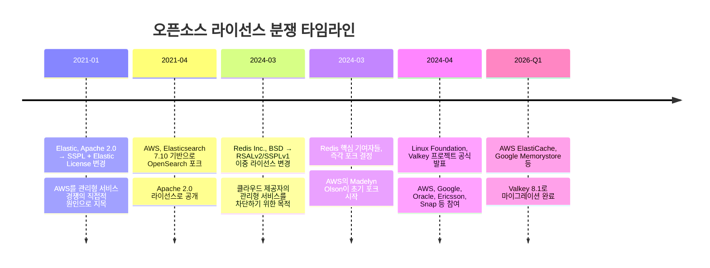
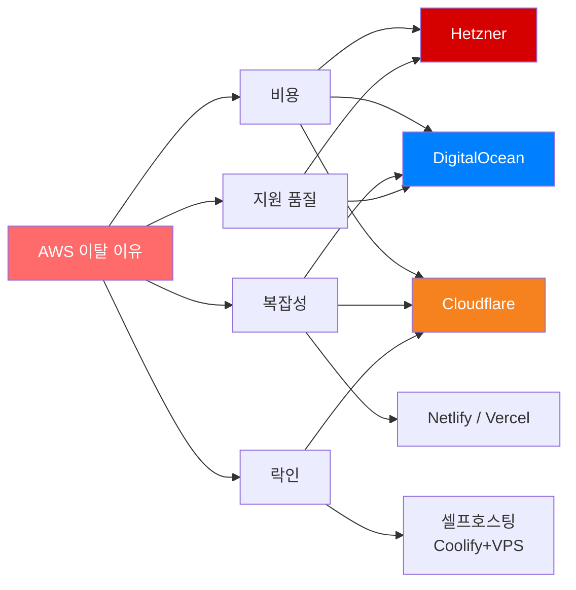
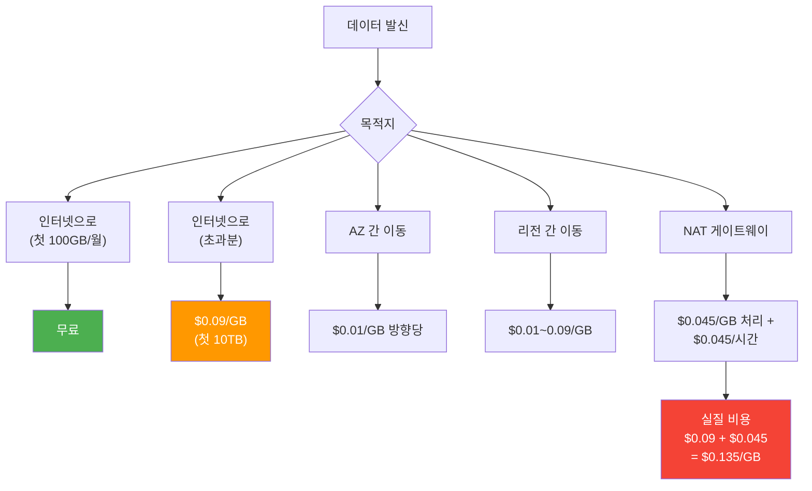
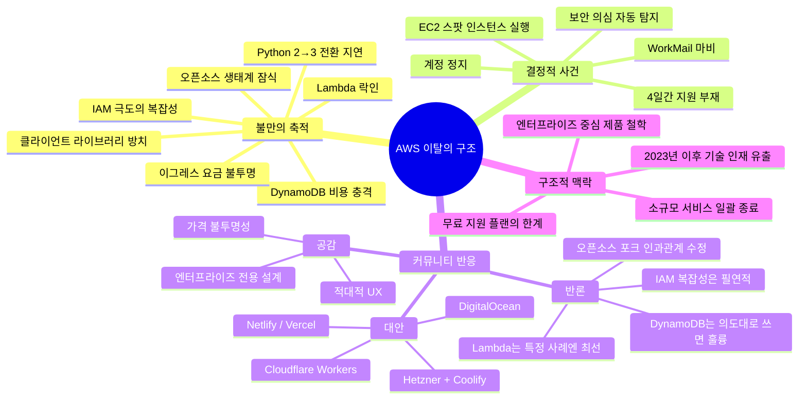

> **원문 출처**
> - 블로그 포스트: [fourlightyears.blogspot.com](http://fourlightyears.blogspot.com/2026/05/i-returned-to-aws-and-was-reminded-hard.html) (Andrew Stuart, 2026년 5월 8일)
> - 커뮤니티 반응: [GeekNews / Hacker News](https://news.hada.io/topic?id=29364) (2026년 5월 11일)

---

## 1. 글의 배경과 필자 소개

이 글의 저자인 Andrew Stuart는 호주 멜버른을 기반으로 활동하는 개발자로, AWS가 막 세상에 등장했던 초창기 — SQS, S3, EC2, SimpleDB라는 네 가지 서비스밖에 없던 시절 — 부터 열렬한 지지자였다. 그는 미국 AWS 담당자가 호주를 방문해 클라우드 컴퓨팅을 알리던 자리에서, 멜버른 최초의 AWS 행사를 직접 조직할 정도로 깊이 헌신했다. 이후 15년가량을 AWS의 팬보이(fanboi), 즉 무조건적인 신봉자로 지내왔다.

그런 그가 2026년 5월, "AWS로 돌아갔다가 내가 왜 떠났는지 뼈저리게 다시 떠올렸다(I returned to AWS — and was reminded HARD why I left)"는 제목으로 블로그 포스트를 게재했다. 이 글은 GeekNews(긱뉴스, news.hada.io)를 통해 한국어 IT 커뮤니티에 소개되었으며, 동시에 Hacker News에도 공유되어 개발자들 사이에서 활발한 토론이 이어졌다.

---

## 2. AWS를 사랑했던 이유 — 그리고 그 열정의 본질

Andrew가 처음 AWS를 사랑한 것은 단순한 기술적 흥미 이상의 이유가 있었다. 클라우드 컴퓨팅이 등장하기 전, 스타트업이 자체 컴퓨터 시스템을 운영하려면 데이터센터에 서버를 직접 설치·관리해야 했다. 이는 막대한 초기 비용과 전문 인력을 요구하는 일이었다. AWS는 그 장벽을 단 몇 분 만에 무너뜨렸다. 신용카드 하나만 있으면 누구나 거대한 컴퓨팅 인프라를 즉시 사용할 수 있게 된 것이다. Andrew는 이를 "마음을 뒤흔드는 혁명(mind blowing revolution)"이라고 표현했다.

이런 경험은 그를 진정한 신봉자로 만들었다. 그는 "쿨에이드를 마지막 한 방울까지 마신 뒤 컵까지 핥아먹었다"고 스스로를 묘사할 만큼 AWS에 전적으로 헌신했다.

---

## 3. 균열의 시작 — 하나씩 쌓여간 불만

연인 관계처럼, 플랫폼에 대한 신뢰도 한 번에 무너지지 않는다. 처음에는 사소한 불편 하나, 그다음엔 또 다른 불편 하나 — 그렇게 하나씩 쌓이다 어느 순간 결정적인 계기를 만나 "이 관계는 끝났다"고 깨닫게 된다. Andrew는 이를 관계의 파국에 비유하며, 자신에게 불만이 쌓여간 구체적인 이유들을 열거했다.

### 3-1. 클라이언트 라이브러리 방치 — 커뮤니티에 떠넘기기

AWS는 초기 6년 동안 자체 클라이언트 라이브러리를 만들지 않았다. Python 같은 언어용 SDK를 누군가 만들어야 한다면, AWS가 직접 만드는 것이 당연해 보이지만 실상은 달랐다. "우리의 멋진 커뮤니티"라는 표현 뒤에 숨어, 수많은 개발자들이 주말과 밤을 태우며 AWS의 이익을 위한 코드를 무료로 작성하도록 방치했다. Andrew는 이를 개발자에 대한 착취로 받아들였다.

또한 AWS가 Python 2에서 Python 3로 전환하는 데 터무니없이 오랜 시간이 걸렸던 것도 불만의 씨앗이 되었다. Python 3는 2008년에 출시되었고 Python 2는 2020년에 공식 지원이 종료되었는데, AWS는 이 전환 과정에서 지나치게 느린 대응을 보였다.

### 3-2. DynamoDB — 첫날부터 75달러 청구서

DynamoDB는 AWS가 자랑하는 완전관리형 NoSQL 데이터베이스다. 그러나 Andrew에게 DynamoDB는 "생각할 수 있는 최악의 방식으로 최악인 시스템(the worst system I can imagine in every possible way)"이었다. 그는 DynamoDB를 처음 사용한 날, 별다른 대형 트래픽도 없는 상황에서 75달러의 청구서를 받았다고 밝혔다. 비용 문제만이 아니라 시스템 설계 방식 자체가 불합리하게 느껴졌다는 것이다.

이후 커뮤니티 댓글에서는 이 경험에 대한 흥미로운 반론이 제기되기도 했는데, 이는 5장에서 상세히 다룬다.

### 3-3. 이그레스(Egress) 요금 — GB당 9센트의 함정

데이터를 AWS 밖으로 꺼내는 이그레스 요금은 처음엔 GB당 20센트였고, 이후 9센트로 인하되었다. Andrew는 이를 "여전히 터무니없이 비싸다"고 표현했다. 2026년 현재 기준으로 확인하면, AWS의 인터넷 이그레스 요금은 첫 100GB 무료 이후 처음 10TB 구간에서 GB당 약 $0.09 수준으로 유지되고 있다.

이 구조의 핵심 문제는 단순한 요금 수준이 아니라, **인지하기 어렵다는 점**에 있다. NAT 게이트웨이를 통해 데이터가 이동할 경우 GB당 $0.045의 처리 비용이 추가되어 실질적으로 GB당 $0.135에 달하기도 한다. 가용 영역(AZ) 간 데이터 이동에도 방향당 GB당 $0.01이 청구된다. 복잡한 멀티 서비스 아키텍처에서는 이런 요금들이 겹겹이 쌓여 예상치 못한 청구서로 돌아온다. 한 분석에 따르면 데이터 이동 비용은 일반 기업의 AWS 청구서에서 세 번째로 큰 항목이며, 분산 아키텍처에서는 전체 비용의 30~40%를 차지하기도 한다.

### 3-4. 불투명한 청구 구조 — 이중·삼중 청구의 미로

AWS의 과금 구조는 단순히 복잡한 수준을 넘어, 내부 시스템 간 데이터 이동에도 과금이 발생하는 구조를 갖고 있다. Andrew는 이를 "이중 청구, 심지어 삼중 청구처럼 느껴지는 경우도 있다"고 묘사했다. 특히 NAT 게이트웨이, CloudFront, 자동 확장, 로드 밸런서 등이 조합되면 비용 예측은 과학이 아니라 예술에 가까워진다는 커뮤니티의 표현은 이 문제의 본질을 잘 담아낸다.

### 3-5. IAM — 복잡성의 화신

IAM(Identity and Access Management)은 AWS의 인증 및 접근 제어 시스템이다. Andrew는 이를 "지옥의 아홉 번째 층에서 루시퍼가 불타는 왕좌에 앉아 AWS를 쓰는 죄인들을 위해 발명한 최악의 형벌"이라는 강렬한 표현으로 묘사했다.

IAM의 복잡성은 단순한 불편함을 넘어, AWS의 전반적인 복잡성 문제를 상징한다. 사용자, 그룹, 역할, 정책, 신원 제공자, OIDC 등의 개념을 모두 이해해야 하며, 세부적인 권한 설정 하나하나에 전문적인 지식이 필요하다. 이 복잡성을 인식하게 되면, AWS 플랫폼 전반에 만연한 동일한 복잡성이 보이기 시작한다는 것이 Andrew의 경험이었다.

아이러니한 점은, AWS 지지자들이 종종 "자체 리눅스, 하드웨어, 네트워킹, 보안을 운영하는 것은 너무 복잡하니 AWS를 써야 한다"고 주장하면서도, AWS 자체의 엄청난 복잡성은 외면한다는 것이다.

### 3-6. AWS Lambda — 락인의 완성

서버리스 컴퓨팅의 대표 주자인 Lambda는 "확장 가능하다"는 구호로 많은 개발자를 끌어들였다. Andrew도 예외가 아니었다. 그러나 느린 콜드 스타트(Cold Start)와 막대한 개발 복잡성이 문제였다. 더 심각한 것은 벤더 락인이었다. AWS를 떠나려 할 때, Lambda 기반 코드가 가장 해체하기 어려운 부분이었다고 그는 고백했다.

### 3-7. 오픈소스 생태계 잠식

Andrew는 AWS가 Elasticsearch, Redis, MongoDB 등의 오픈소스 프로젝트가 자신들의 코드를 상업적으로 복제·수익화하기를 원하지 않는다는 명확한 의사를 보였음에도, OpenSearch, Valkey, DocumentDB를 강행했다고 주장했다. 그는 이 커뮤니티와 기업들이 시장을 키워놓은 뒤 AWS가 호스팅 서비스 수익을 가로챘고, 그 결과 SSPL, Elastic License, RSAL 같은 방어적 라이선스들이 등장했다고 서술했다.

그러나 이 주장의 사실관계에 대해서는 커뮤니티에서 중요한 반론이 제기되었다. 이 부분은 5장의 오픈소스 논쟁 섹션에서 별도로 다룬다.

---

## 4. AWS를 완전히 떠나지 못했던 이유 — 그리고 복귀의 계기

Andrew는 한때의 열정이 사라진 뒤 거의 모든 서비스를 AWS 밖으로 이전했지만, 세 가지 서비스만은 남겨두었다.

- **Route53**: 도메인 관리
- **S3**: 일부 백업 저장
- **AWS WorkMail**: 핵심 사업용 이메일

그가 2026년 초 다시 AWS에 로그인한 이유는 두 가지 구체적인 연구 목적이 있었다.

첫 번째는 **AWS Bedrock에서의 Claude/Anthropic 성능 확인**이었다. 결론적으로 Claude Code 기준으로 동작 자체는 동일하지만 더 느리고, Anthropic 직접 구독보다 비용이 훨씬 더 비쌌다. 프라이버시 요건이 있는 기업이라면 Bedrock이 의미 있을 수 있지만, 일반 사용자에게는 직접 구독이 훨씬 낫다는 결론을 내렸다.

두 번째는 **코드 벤치마크**였다. 자택의 최고 성능 머신이 20코어, 32GB RAM인 상황에서, AWS의 192코어, 1TB RAM 머신에서 자신의 코드가 얼마나 빨라지는지 확인하고 싶었다.

---

## 5. 계정 정지 사태 — 부메랑이 된 일시적 복귀

Bedrock 테스트는 한 달 전에 문제없이 완료되었다. 그러나 이후 192코어 EC2 스팟 인스턴스를 실행하고 약 3시간이 지났을 때, AWS로부터 "계정 보안 침해 의심(Suspected security breach of your account)"이라는 이메일을 받았다. 거의 휴면 상태였던 계정이 갑자기 고가의 컴퓨팅 자원을 사용하기 시작했으니, AWS의 이상 탐지 시스템이 반응한 것이다. 이 자체는 이해할 수 있는 보안 조치였다.

문제는 그 이후였다.

```
사태 타임라인
━━━━━━━━━━━━━━━━━━━━━━━━━━━━━━━━━━━━━━━━━━━
Day 0  : EC2 192코어 스팟 인스턴스 실행 (3시간 테스트 중)
        → AWS 보안 의심 이메일 수신
        → 계정 정지/제한

즉각 영향:
  • AWS WorkMail (핵심 사업 이메일) 완전 중단
  • 누구도 이메일 발신 불가
  • 어떤 AWS 리소스도 생성 불가

Day 1~3: AWS 지원팀에 이메일 답변 → 응답 없음
         (무료 지원 플랜 = 24시간 응답 약속)

Day 3  : AWS 포럼에 도움 요청
         → 조언: "채팅으로 문의하면 답변을 받는다"

Day 3  : 채팅 연결까지 30분 대기
         → 모든 요구 사항 수행:
           - 비밀번호 변경
           - 액세스 토큰 삭제
           - 청구 내역 확인
         → 담당자: "내부 팀에 요청하겠다"

Day 4  : 8시간 후 후속 문의 → "기다려 달라"
         계정 제한 미해제
━━━━━━━━━━━━━━━━━━━━━━━━━━━━━━━━━━━━━━━━━━━
```

이 사태의 가장 큰 피해는 보안 의심 자체가 아니라, 그로 인한 부수적 피해였다. 사업용 이메일 시스템이 4일 이상 멈춰섰고, 아무것도 AWS에 해킹된 것이 없었음에도 아무런 조치가 이루어지지 않았다. 무료 지원 플랜이라는 현실이 야기한 서비스 공백이었다.

---

## 6. 최종 결론 — 그리고 남겨진 숙제

이 경험은 Andrew에게 AWS를 떠났던 이유를 다시 한번 확인시켜 주었다. 그는 "그때 AWS에서 나온 것이 매우 다행"이라고 쓰면서도, Route53에 도메인을, S3에 백업을, WorkMail에 사업 이메일을 남겨둔 것을 "어리석은 신뢰(foolishly trusting)"라고 표현했다. 특히 WorkMail에 대해서는 한 번의 실수로 사업 이메일이 마비되는 경험을 하고서야 완전한 이전의 필요성을 절감했다.

2026년 현재, AWS WorkMail은 이미 종료 수순에 들어가 있다. 2026년 4월 30일부터 신규 고객 등록이 중단되었으며, 2027년 3월 31일을 기점으로 모든 접근이 차단되고 이메일, 연락처, 일정, 첨부파일 등 모든 데이터가 영구 삭제될 예정이다. 이와 동시에 App Runner도 유지보수 모드로 전환되는 등, AWS는 여러 소규모 서비스들을 단계적으로 종료하고 있어 커뮤니티 사이에서 우려와 논쟁을 낳고 있다.

---

## 7. AWS의 구조적 문제 — 커뮤니티의 다층적 시각

이 블로그 포스트가 Hacker News에 공유되면서, 단순한 공감을 넘어 훨씬 다양하고 깊이 있는 논의가 이어졌다. GeekNews를 통해 번역된 이 댓글들을 주요 논점별로 정리한다.

### 7-1. 가격 불투명성과 '적대적 UX' 논쟁

한 개발자는 새 회사에 합류해 3개월 안에 제품을 출시해야 하는 상황에서 AWS 콘솔에서 머신을 추가하려다 가격이 UI에 보이지 않는 구조를 발견했다. 사양 표와 가격 표를 별도 탭에서 열어 대조해야 했던 이 경험을 그는 "착취적인 관계의 신호"로 읽었고, 즉시 DigitalOcean으로 모두 이전한 뒤 약속보다 한 달 앞서 제품을 출시했다.

이에 대해 반론도 있었다. AWS의 가격은 단일 숫자로 표현되는 것이 애초에 불가능할 만큼 복잡하며, NAT 게이트웨이, CloudFront, S3, 자동 확장, 로드 밸런서가 결합되면 비용 계산은 예술에 가까워진다는 것이다. 두 탭을 여는 것이 불편하다면 AWS뿐 아니라 모든 클라우드 제공자를 피하는 것이 낫다고 주장했다.

Azure에 대한 비교도 등장했다. Azure는 모든 항목에서 가격을 들이밀지는 않지만, 비용이 발생할 수 있는 항목에는 대체로 가격 정보를 표시하는 균형감이 있어 요금 청구 때 놀란 경험이 없다는 의견이었다.

콘웨이의 법칙(Conway's Law)을 언급한 시각도 흥미롭다. AWS는 자신의 조직도를 그대로 제품으로 내보내고 있으며, 이것이 복잡한 UX의 근본 원인이라는 분석이다. Amazon의 엔지니어 주도 제품 문화에서 개발자가 UX까지 책임지는 경우, 결과물이 끔찍해질 수 있다는 전직 AWS 인턴 채용 경험담도 공유되었다.

### 7-2. DynamoDB 재평가 — 도구의 의도된 사용법 문제

Andrew의 DynamoDB 혐오에 대해 커뮤니티에서는 흥미로운 반박이 제기되었다. DynamoDB를 가장 좋아하는 AWS 서비스 중 하나로 꼽는 개발자들도 있었는데, 핵심은 "의도된 방식으로 사용했는가"의 문제였다.

DynamoDB는 뛰어난 내구성과 거의 무한한 테이블 확장을 제공하는 **키-값 저장소**로 이해해야 한다. SQL 데이터베이스처럼 다루어 JOIN과 GROUP BY를 시도하는 순간, 75달러 청구서는 예정된 결과다. 실제로 5천만 건의 레코드, 인덱스 1개, 월 1만 회 읽기/쓰기 수준의 앱을 운영했을 때 초기 적재 비용은 약 50달러, 이후 월 유지 비용은 10센트 수준이었다는 경험담이 공유되기도 했다.

이는 도구의 문제가 아니라 **도구에 대한 이해와 사용법의 문제**라는 관점이다. 단, 이 도구가 사전에 많은 학습과 이해를 요구한다는 점 자체가 진입 장벽이자 AWS 복잡성의 일부라는 점은 여전히 유효하다.

### 7-3. IAM 복잡성 — 필연인가, 악의인가

IAM에 대해서는 흥미로운 내부자 시각이 제시되었다. AWS 내부 관점에서 보면 IAM의 본질은 두 가지 질문으로 귀결된다: "이 역할이 무엇에 접근해 무엇을 할 수 있는가", "누가 이 역할에 접근할 수 있는가". 1만 피트 상공에서 보면 그게 전부다.

더 중요한 점은, IAM이 AWS 외부 고객뿐 아니라 **AWS 내부 팀에도 동일하게 적용**된다는 것이다. Lambda 서비스가 고객의 S3 버킷을 읽으려면 고객이 IAM 신뢰 관계에 서비스 주체를 추가해 명시적으로 허용해야 한다. "우리는 AWS니까 자동으로 접근 가능"이라는 논리는 통하지 않는다. 이는 고객이 AWS 내부 접근도 완전히 감사할 수 있는 보안 모델을 의미한다.

반면, 그 복잡성이 불가피하다는 주장도 있다. 사용자, 그룹, 역할, 정책, 신원 제공자, OIDC를 단순하게 구현한 사례는 찾기 어렵다. "X는 너무 복잡하다"며 도입을 막다가, 결국 Vault, Consul, systemd, Nomad, iSCSI, Ansible, Jenkins, Puppet, Bash 등을 조합해 Kubernetes를 조악하게 재발명한 사례가 현업에서 반복된다는 지적도 있었다.

### 7-4. Lambda 재평가 — 단점과 장점의 공존

Lambda에 대한 평가도 엇갈렸다. 한쪽에서는 Lambda를 "머리 아프지 않게 빠른 반복 주기로 배포 서비스를 운영하는 최고의 방법"으로 극찬했다. 반드시 마이크로서비스로 가거나 코드를 수천 개의 작은 저장소로 쪼갤 필요가 없으며, 요청 간 서버 내 상태 공유를 기대하지 않는 표준 웹 서버라면 Lambda로 옮길 수 있다는 논리다.

다른 쪽에서는 Andrew의 주장처럼 콜드 스타트 문제와 벤더 락인이 심각하다고 반박했다. 그리고 이 논쟁의 결론으로 많은 사람들이 도달한 공통적인 답은, Lambda가 **아주 특정한 사용 사례**에 빛을 발하는 도구라는 것이다. 맞지 않는 곳에서 쓰면 문제가 된다.

### 7-5. 오픈소스 라이선스 분쟁의 진실 — 인과관계 재검토

Andrew가 AWS를 "오픈소스 포식자"로 묘사한 부분에 대해 커뮤니티에서 가장 중요한 사실 관계 수정이 이루어졌다.

Andrew의 서술은 "AWS가 포크를 만들어서 라이선스 변경을 유발했다"는 구조였지만, 실제 시간 순서는 정반대였다.



즉, AWS는 라이선스 변경 이전에 포크를 만든 것이 아니라, 오픈소스 프로젝트들이 라이선스를 바꾼 이후에 기존 오픈소스 버전을 포크했다. Valkey의 경우 특히 주목할 점이 있는데, Redis Inc.가 오픈소스 라이선스를 제거한다고 발표한 지 일주일도 안 되어, Redis 기여자들이 자발적으로 Linux Foundation 산하 Valkey 프로젝트로 이전하기 위해 뭉쳤다. Valkey는 AWS가 일방적으로 만든 것이 아니라, 기존 Redis 핵심 유지관리자들이 주도한 커뮤니티 주도 포크였다.

그렇다고 AWS가 완전히 무죄인 것도 아니다. 라이선스 변경의 근본 원인 — AWS가 오픈소스 프로젝트 위에서 관리형 서비스로 막대한 수익을 올리면서도 프로젝트에 기여하지 않았다는 불만 — 은 실재한다. Redis Inc. CEO는 라이선스 변경 발표 당시 "Amazon이 포크를 만들어도 놀랍지 않을 것"이라고 직접 언급했을 정도다.

Elastic은 2021년 1월 Apache 2.0에서 SSPL과 Elastic License의 이중 라이선스로 변경하면서 AWS의 Elasticsearch 관리형 서비스를 직접적인 원인으로 지목했고, AWS는 2021년 4월 Apache 2.0 라이선스로 OpenSearch를 포크했다. 3년 반이 지난 2024년 9월, Elastic은 독점 라이선스와 함께 AGPLv3을 옵션으로 추가했다.

결과적으로 Redis는 라이선스 결정을 번복했고, Elastic도 번복했으며, HashiCorp는 IBM에 64억 달러에 인수되었다. 한편 Valkey, OpenSearch, OpenTofu는 "1년 안에 사라질 것"이라는 예측을 뒤집고 건강하게 살아남아 있다.

2026년 1분기 현재, AWS ElastiCache, Google Cloud Memorystore, Oracle OCI Cache, Heroku 모두 Valkey 8.1로의 마이그레이션을 완료하며, Redis의 라이선스 전략에 대한 클라우드 업계의 집단적 판결을 내렸다.

---

## 8. AWS의 인재 공동화 문제

커뮤니티에서 제기된 또 하나의 중요한 맥락은 AWS의 내부 인적 역량 저하다. 한 전 직원은 다음과 같이 서술했다.

2023년 이후 AWS에서 기술 인력이 체계적으로 비워지고 있으며, 대규모 해고나 두 차례의 성과개선계획을 통해 프리세일즈나 지원 쪽에서 실력 있던 동료들이 AWS에 남아 있지 않은 경우가 많아졌다. 반면 업무 이력이 가장 모호한 사람들이 남고 승진한 경우를 자주 보게 되었다.

이 맥락에서 Andrew가 경험한 4일 이상의 지원 지연은 단순한 일회성 사건이 아니라, 구조적인 지원 품질 저하를 반영하는 것일 수 있다.

---

## 9. 대안 생태계 — 개발자들이 선택한 출구

이 논쟁에서 반복적으로 등장한 AWS 대안들을 정리하면 다음과 같다.



**Cloudflare**는 가장 자주 언급된 대안으로, Workers, D1 Database, Cloudflare KV의 조합이 기본적인 풀스택 앱에서 AWS보다 훨씬 단순하고 합리적이라는 평가를 받았다. Workers 안에서 직접 호출 가능하기 때문에 서비스 간 환경 변수 전달 문제도 해소된다. 다만, 이메일 활성화 같은 작업에 Wrangler를 사용해야 하는 구조가 또 다른 종류의 락인처럼 느껴진다는 비판도 있었다.

**Hetzner + Coolify** 조합은 월 5달러 수준의 VPS 비용으로 PostgreSQL 인스턴스와 웹 서버를 운영할 수 있는 비용 효율적인 선택지로 소개되었다. Coolify가 오픈소스이기 때문에 VPS 비용 이외의 추가 요금이 없다.

**DigitalOcean**은 단순하고 예측 가능한 가격 구조로 반복적으로 언급되었으며, Heroku는 "20년 전에 이미 대부분의 웹 앱에 필요한 것을 정확히 파악했다"는 평가를 받았다.

이 논쟁의 핵심 결론 중 하나는 **적합한 도구의 선택**이다. AWS는 확장을 위한 도구이지, 가장 저렴하고 단순한 구성을 위한 도구가 아니다. VC 자금이 있고 스케일업이 최우선인 스타트업이라면 AWS가 합리적 선택일 수 있다. 그러나 개인 프로젝트, 인디 개발자, 부트스트랩 창업자라면 Hetzner나 DigitalOcean으로도 충분하다.

---

## 10. AWS 비용 함정 — 2026년 현황

2026년 현재, AWS의 이그레스 요금 구조를 정확히 이해하는 것은 여전히 중요하다.



2025년부터 AWS의 월별 무료 데이터 송신 한도가 기존 1GB에서 100GB로 대폭 확대되었다. 이는 소규모 개발자들에게 의미 있는 개선이지만, 데이터 이동 비용은 일반 기업의 AWS 청구서에서 컴퓨팅과 스토리지에 이어 세 번째로 큰 항목이며, 분산 아키텍처에서는 전체 비용의 30~40%를 차지하기도 한다.

NAT 게이트웨이는 GB당 $0.045의 처리 비용이 표준 $0.09/GB 이그레스 비용에 추가되어, 사설 서브넷에서 인터넷으로 나가는 트래픽의 실질 비용이 GB당 $0.135에 달한다. AZ 간 이전은 방향당 $0.01/GB, Transit Gateway는 목적지에 관계없이 GB당 $0.02가 추가된다.

---

## 11. "역사는 반복된다" — AI 클라우드 종속 경고

커뮤니티에서 흥미로운 예측이 하나 등장했다. Anthropic, OpenAI 같은 AI 서비스 제공자에 대해서도 언제쯤 같은 이야기가 나오기 시작할지 궁금하다는 것이다. 지금 AI 흐름은 AWS 초창기와 비슷한 냄새가 나며, 모두가 탑승했다가 나중에 쉽게 떼어내기 어려운 큰 의존성을 쌓았다는 것을 깨닫게 될 것이라는 경고다.

실제로 Andrew 자신의 사례가 이를 잘 보여준다. AWS에서 벗어나면서도 "당장 필요하고 편리한" 세 가지 서비스를 남겨두었고, 그 중 하나인 WorkMail 때문에 사업이 타격을 입었다. 대규모 이전의 결정적 동기가 생기기 전까지 작은 의존성들을 방치하는 인간의 자연스러운 경향이, 결국 취약점으로 돌아왔다.

---

## 12. 종합 정리

이 블로그 포스트와 커뮤니티 반응을 통해 드러난 핵심 구조를 시각화하면 다음과 같다.



Andrew Stuart의 회고는 한 개인의 경험담을 넘어, 클라우드 제공자와 개발자 사이의 근본적인 긴장 관계를 보여주는 사례다. AWS가 엔터프라이즈 규모의 확장에는 여전히 강력한 도구이지만, 그 복잡성과 비용 구조는 모든 사용자에게 맞는 것이 아니다. 플랫폼에 깊이 의존하기 전에, 그 의존이 만들어내는 락인과 리스크를 인식하는 것이 중요하다는 교훈이 남는다.

---

*작성일: 2026년 5월 14일*
