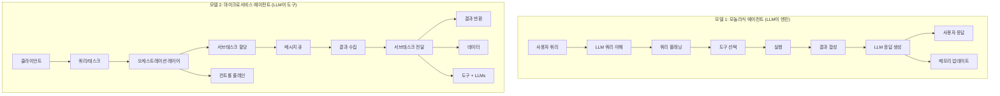
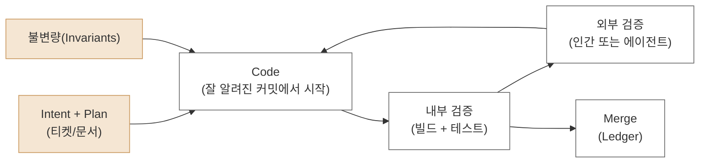
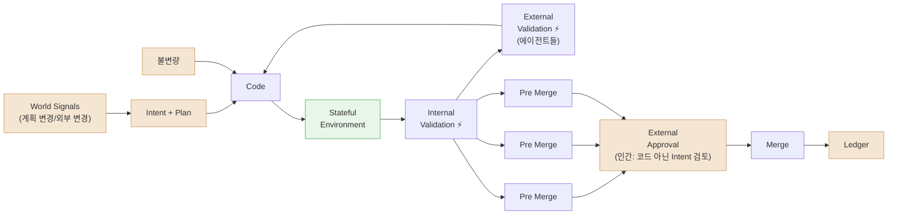
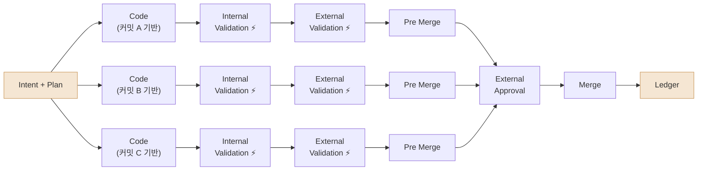
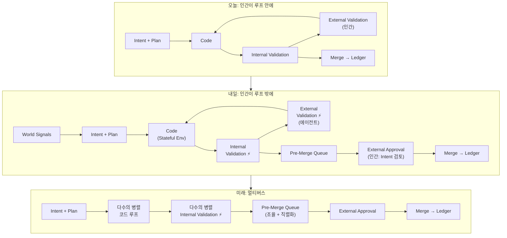

> **출처:** AI Engineer Europe 컨퍼런스 발표  
> **발표자:** Madison Faulkner (NEA 파트너) · Hugo Santos (Namespace CEO)  
> **영상:** [YouTube](https://www.youtube.com/watch?v=VktrqzQgytY) — "Continuous Compute: Intents, Humans *Outside* the Loop and the Multiverse future of the SDLC"  
> **발표 공개일:** 2026년 5월 13일

---

## 개요

이 발표는 NEA의 파트너 Madison Faulkner와 고성능 컴퓨트 인프라 스타트업 Namespace의 CEO Hugo Santos가 공동으로 진행한 약 18분짜리 강연이다. 핵심 주제는 단 하나다: **기존의 CI/CD 패러다임은 에이전트 소프트웨어 시대에 더 이상 작동하지 않는다.** 두 발표자는 그 이유를 구조적으로 분석하고, 대안 아키텍처로서 "Continuous Compute"와 Intent 기반 개발 루프를 제안한다. 이 문서는 발표 전체를 챕터별로 재구성하여, 각 논지의 맥락과 함의를 상세히 설명한다.

---

## 1. 발표자 소개 — 누가, 왜 이 이야기를 하는가

발표자 두 사람의 배경은 이 주제에 상당한 신뢰감을 부여한다.

Madison Faulkner는 현재 NEA(New Enterprise Associates)의 파트너로 인프라 및 개발 도구 분야에 집중 투자하고 있다. 그는 Meta AI에서 데이터·AI 팀을 이끈 연구자 출신이기도 하다. 그가 벤처로 이직한 배경에는 "인프라의 현재 상태에 대한 깊은 좌절감"이 있었다고 밝혔다. 즉, 이 발표는 학술적 예측이 아니라 현장에서 실제로 문제를 마주한 실무자의 진단이다.

Hugo Santos는 Namespace의 CEO로, Google에서 마이크로서비스 아키텍처를 이끈 이력을 갖고 있다. Namespace는 현재 고성능 CI/CD 인프라를 제공하는 회사로, FAL, Zed, RAMP 같은 첨단 개발 기업들을 고객으로 두고 있으며 Warp, Ghostty 같은 AI 네이티브 제품의 CI 인프라를 직접 운영하고 있다. 그는 수십 개 팀의 개발 워크플로우가 실시간으로 변화하는 것을 직접 목격하고 있는 위치에 있다.

---

## 2. 파운데이션 모델은 에이전트로 분해되고 있다

발표의 첫 번째 핵심 주장은 LLM 활용 방식 자체가 근본적으로 바뀌고 있다는 것이다.

초기 에이전트 소프트웨어는 "모놀리식 에이전트" 형태를 취했다. 하나의 LLM이 사용자 쿼리를 받아 내부에서 쿼리 이해 → 계획 수립 → 도구 선택 → 실행 → 결과 합성 → 응답 생성의 모든 단계를 처리했다. LLM이 엔진 그 자체였다.

그런데 지금은 전혀 다른 방향으로 가고 있다. LLM은 도구로 내려앉고, 대신 외부에 오케스트레이션 레이어가 존재하며, 복잡한 태스크를 잘게 쪼개 여러 전문화된 에이전트에게 분산 처리한다. 이른바 "마이크로서비스 에이전트" 모델이다. 클라이언트(인간 또는 다른 에이전트)가 쿼리를 던지면, 오케스트레이션 레이어가 이를 서브태스크로 분해하고 메시지 큐를 통해 각 에이전트에게 전달하며, 컨트롤 플레인이 전체를 모니터링하는 구조다.

이 전환이 중요한 이유는 에이전트 수가 기하급수적으로 늘어난다는 것이다. 하나의 의도(Intent)를 처리하기 위해 수십, 수백 개의 에이전트가 동시에 작동하고 각자가 코드 저장소에 변경을 가하는 세상이 이미 도래하고 있다.

---

## 3. 기존 CI/CD 생명주기는 이미 파편화되어 있다

발표자들은 현재 소프트웨어 개발 생명주기가 세 가지 층이 혼재하는 혼란 상태라고 진단한다.

첫째, 전통적 CI/CD 시스템(빌드, 테스트, 배포, DevOps)이 여전히 존재한다. 둘째, 자율 에이전트 엔지니어링 솔루션이 등장해 기존 파이프라인 위에 덮이고 있다. 셋째, 그 사이에서 전통적인 DevOps 도구들이 다음 1년 안에 크게 변화할 것으로 예측된다. 이 세 층이 서로 조율 없이 충돌하면서 현재의 인프라는 점점 버거워지고 있다.

---

## 4. 기존 CI/CD 파이프라인은 어떻게 작동하는가

문제를 이해하려면 먼저 기존 시스템의 작동 원리를 명확히 해야 한다.

전통적인 CI/CD는 **인간 개발자를 기준 단위**로 설계되었다. 한 명의 개발자가 하루에 하나에서 두 개 정도의 diff를 작성하고, 그것을 Pull Request로 제출한다. 동료들이 PR을 리뷰하고 피드백을 주면, 개발자는 다시 코드를 수정한다. 승인이 나면 GitHub Actions 같은 러너가 빌드, 테스트, 배포 단계를 자동화한다. 테스트가 실패하면 다시 수정 루프로 돌아간다.

이 모델에서 인간의 리뷰와 응답 지연은 **당연한 것으로 가정**되어 있다. 러너는 소수, PR은 예측 가능한 빈도로 들어오고, 로컬 캐시는 항상 따뜻하게 유지된다. 한 마디로 이 시스템은 "인간의 속도"에 최적화되어 있다.

---

## 5. 에이전트 규모에서 CI/CD가 실패하는 지점

에이전트가 등장하면 모든 가정이 무너진다.

이제 한 명의 인간이 여러 에이전트를 관리하고, 각 에이전트는 N개의 저장소에 N개의 PR을 동시에 제출한다. PR 하나를 검증하는 데 여전히 약 10분이 걸리지만, 이 PR이 하루에 수십 개가 아니라 **시간당 수백 개**로 쏟아진다. 러너 큐는 포화 상태가 되고, Docker 이미지는 매 브랜치마다 콜드 빌드를 반복하며, 캐시 히트율은 급격히 떨어진다.

더 심각한 문제는 **머지 충돌**이다. 수천 개의 단명(short-lived) 브랜치가 동일한 코드베이스를 동시에 서로 다른 방향으로 수정하면, 이것들을 하나의 저장소로 병합하는 것은 사실상 불가능해진다. 에이전트들이 만들어낸 변경들 간의 충돌은 인간이 처리할 수 없는 규모다.

GitHub 활동 데이터를 보면 이 변화가 이미 현실임을 알 수 있다. 최근 몇 달 새 커밋 수와 추가/삭제된 코드 라인 수가 전례 없이 급증하고 있다. 이것은 바이브 코딩과 에이전트 코딩이 실제로 저장소에 닿기 시작했다는 신호다.

버스트·팬아웃·단명성이라는 에이전트의 세 가지 특성이 캐시 읽기/쓰기 패턴과 히트율에 구조적으로 악영향을 미친다는 것이 발표자들의 핵심 진단이다. 인간 개발자는 하루 1개의 PR, 예측 가능한 큐, 따뜻한 로컬 캐시라는 특성을 가지는 반면, 에이전트는 수천 개의 단명 브랜치/PR, 러너 큐 포화, 캐시 미스율 급등이라는 완전히 다른 특성을 만들어낸다.

---

## 6. CI/CD를 가속화로 대체하기: 첫 번째 단계

그렇다면 어디서부터 시작해야 하는가? 발표자들은 **가속화(Acceleration)를 출발점**으로 제안한다.

지금 당장 대부분의 팀이 겪는 현실적 고통은 빌드·테스트·배포 시간이 너무 느리다는 것이다. 이것을 먼저 해결해야 한다. 해법은 기존 GitHub Actions와 다른 CI/CD 인프라 위에 새로운 레이어를 삽입하는 것이다.

여기서 핵심 개념이 등장한다. **에이전트 캐시(Agent Cache)가 오케스트레이션 레이어가 된다.** 이것은 하드웨어와 소프트웨어의 공동설계(hardware-software co-design)를 통해 달성된다. 에이전트 캐시는 러너들, 빌드 도구들, 소스 코드 관리 시스템과 연결되어, 모든 에이전트의 요청을 중앙에서 라우팅하고 조율한다.

이 첫 단계에서의 구체적인 기능은 다섯 가지 영역으로 확장된다.

**인테이크(Intake):** 인그레스 형성과 속도 제한을 담당한다. 에이전트들이 제출하는 중복에 가까운 PR들을 GitHub/GitLab에 도달하기 전에 병합하거나 제거하고, 업스트림 호출을 코얼레스(coalesce)한다.

**캐시(Cache):** 전역 캐시 오케스트레이션을 수행한다. 의존성, Docker 레이어, 컴파일된 출력물, 테스트 결과를 컨텐츠 주소 지정 방식으로 캐싱해 동일한 작업을 반복하지 않도록 한다.

**오케스트레이션(Orchestration):** 셀프 호스팅/클라우드/Intel/ARM/GPU 러너 중 적합한 것을 선택해 라우팅하고, 따뜻한 캐시와 함께 멀티 아키텍처 에뮬레이션을 피한다.

**아이덴티티(Identity):** 에이전트에게 단명(short-lived) 자격증명을 발급한다. 이는 에이전트를 위한 Okta 역할을 한다. 에지에서 프리플라이트 체크를 수행해 보안을 확보한다.

**리트라이(Retries):** 로그를 파싱하고 알려진 오류 유형(flaky test, 누락된 캐시 시드 등)을 자동으로 수정한다. 수정이 불가능한 경우 RCA(Root Cause Analysis) 힌트를 제공한다.

---

## 7. 현장 사례: 에이전트 루프의 현실

Hugo Santos는 이 시점에서 Namespace의 실제 고객사들이 겪고 있는 전환 과정을 소개한다.

불과 6개월 전만 해도, 인간 개발자들은 코드를 작성하고 PR로 변경사항을 묶어 검증을 수행했으며, 그 과정에서 머신 지연은 인간 지연 뒤에 숨어 있었다. 즉, 빌드에 15분이 걸려도 개발자가 다음 작업을 진행하는 동안 그것은 크게 문제가 되지 않았다.

지금은 다르다. 코드 생성이 매우 저렴해지면서 작업이 연속적으로 이루어지고, 검증이 내부 루프 안으로 들어온다. **레이턴시가 일급 문제(first-class problem)가 된 것이다.**

그리고 발표자는 여기서 중요한 통찰을 제시한다. "지금까지 인간이 바로 에이전트였다." 개발자가 코드 → PR → CI → 휴먼 리뷰 → 머지의 전체 루프를 직접 관리하면서 목표를 머릿속에 유지하고 피드백에 반응하며 반복했다. 인간 자체가 에이전트 루프의 중심이었다.

---

## 8. PR이 병목이 되는 이유

Pull Request는 **인간 리뷰를 위해 설계된 추상화**다. PR의 근본적인 특성은 다음과 같다: 지연된 피드백을 허용하고, 희소한 인간의 주의를 전제로 하며, 이산적인 핸드오프(discrete handoffs) 방식으로 작동한다. 리뷰어에게 코드를 보내고 답이 올 때까지 기다리는 구조다.

이것이 에이전트 세상에서 무너지는 이유는 PR 기반 검증이 내재적으로 높은 지연을 가지기 때문이다. 에이전트는 초당 수십 개의 변경을 만들 수 있지만, PR 프로세스는 그 속도를 따라갈 수 없다.

인간 리뷰어 문제는 더 심각하다. 이미 많은 팀에서 PR 볼륨이 인간이 처리할 수 있는 한계를 넘어섰다. Hugo Santos의 팀은 불과 몇 달 만에 PR 볼륨이 4배로 증가했다고 밝혔다. 인간 리뷰어가 모든 PR을 검토하는 것은 불가능하다.

머지(Merge) 자체도 고성능 데이터베이스 문제와 유사해진다. 저장소의 git 히스토리는 일종의 직렬화된 원장(ledger)이며, 모든 변경이 순서대로 커밋되어야 한다. 인간이 작업할 때는 락 시간(lock time)이 길어도 괜찮다. 하지만 머신이 작업할 때는 락 시간이 짧아야 하고, 그렇지 않으면 롤백이 폭발적으로 증가한다.

---

## 9. 새로운 아키텍처: Intent와 Plan 기반 개발

이제 Hugo Santos가 제안하는 새로운 아키텍처가 등장한다. 발표자들은 이것이 이미 자신들의 팀과 첨단 기업들이 오늘 운영하고 있는 방식이라고 강조한다.

핵심은 **PR이 없다는 것**이다. 대신 모든 것은 Intent와 Plan에서 시작한다.

개발자 또는 PM이 달성하고자 하는 목표를 명문화한다. Linear 티켓이 될 수도 있고, Slack 메시지가 될 수도 있다. 어디든 목표와 계획이 문서화된 곳이 시작점이다. 이 Intent와 Plan이 에이전트 하네스 루프로 입력된다. 루프는 Claude Code, Cursor, Amp, Factory 같은 에이전트 하네스가 될 수 있다.

루프 안에서 일어나는 일은 다음과 같다. 에이전트는 잘 알려진 특정 커밋을 체크아웃한다. 임의의 상태에서 시작하지 않는다. 그 불변량(invariants)을 지키면서 계획을 향해 코드를 수정한다. 수정이 완료되면 내부 검증(Internal Validation)을 수행한다. 저장소에 존재하는 빌드/테스트 자산을 사용해 변경이 올바른지 확인한다. 그 다음 인간에게 "이렇게 완료했습니다. 계속할까요?"를 물어본다. 인간의 답변은 대부분 "continue"다.

그리고 외부 검증(External Validation)을 통과하면 머지 큐로 진입하고, 저장소(원장)에 기록된다.

현재 상태를 다이어그램으로 표현하면 위와 같다. 중요한 것은 외부 검증 단계에 아직 인간이 있다는 점이다. 이것이 오늘의 한계다.

---

## 10. 내일: 완전 자동화된 내부/외부 검증

발표자들은 "이 변화는 몇 년이 아니라 몇 주에서 몇 달 안에 일어날 것"이라고 말한다.

변화의 방향은 세 가지다.

첫째, **코드 생성이 훨씬 빨라진다.** 이미 빠르지만, 추론(inference) 속도는 계속 개선될 것이다.

둘째, **내부 검증이 극도로 빨라져야 한다.** 빌드와 테스트에 15분, 45분이 걸리면 전체 루프가 지연된다. 수초 내에 완료되어야 한다. 이것이 바로 Namespace 같은 회사가 해결하려는 문제다.

셋째, **외부 검증에서 인간이 사라진다.** 대신 다른 에이전트들이 변경을 평가한다. 보안 중심 LLM이 보안 취약점을 검토하고, API 적합성 중심 LLM이 API 규약 준수 여부를 확인하며, 이 피드백이 루프 안으로 다시 입력되어 메인 하네스가 코드를 수정한다. 이 모든 것이 매우 빠르게 돌아간다.

이를 가능하게 하는 조건은 **스테이트풀 환경(Stateful Environment)** 이다. 매번 처음부터 시작하면 루프가 느려진다. 메모리와 상태가 유지되어야 한다. 환경이 이전 실행의 맥락을 기억하고 있어야 인크리멘털하게 작업을 이어갈 수 있다.

또한 이 루프는 **월드 시그널(World Signals)** 을 받는다. 계획이 바뀌거나 다른 누군가의 변경이 들어오면, 하네스는 그에 맞게 Intent와 Plan을 조정하고 새로운 루프를 시작한다.

---

## 11. 프리머지 큐(Pre-Merge Queue)와 인간의 역할 재정의

이 새로운 아키텍처에서 인간의 역할은 완전히 달라진다.

에이전트들이 너무 많은 변경을 병렬로 처리하기 때문에, 완성된 변경들이 저장소에 바로 들어가지 않고 **프리머지 큐(Pre-Merge Queue)** 에 쌓인다. 이 큐는 에이전트들이 동일한 코드베이스에 가한 여러 변경들을 조정하고 직렬화(serialization)를 보장하는 레이어다. 모든 변경이 충돌 없이 순서대로 원장에 기록될 수 있도록 재조정한다.

인간은 이 프리머지 큐에서 개입한다. 그런데 중요한 것은 **인간이 코드 자체를 보지 않는다**는 것이다. 대신 인간은 다음을 확인한다:

- 처음에 설정한 Intent(목표)
- 그 Intent가 어떻게 달성되었는지 결과
- 결과의 증거 — 예를 들어 기능 작동 영상, 보안 LLM의 검토 결과 등

그리고 이것은 단일 PR 또는 단일 커밋에 대한 리뷰가 아니다. 여러 에이전트가 독립적으로 작업한 여러 기능들이 의미론적으로 그룹화되어 인간에게 전달된다. 인간은 이미 처리 불가능한 양의 PR을 코드 레벨에서 검토하는 것이 아니라, **더 높은 추상화 수준에서 의사결정**을 내린다.

Hugo Santos 팀의 경우 현재 PR 볼륨이 과거 대비 4배가 되었고, 인간 리뷰어가 모든 PR을 들여다보는 것은 이미 불가능하다. 이 프리머지 + 외부 승인 구조가 그 문제에 대한 해답이다.

---

## 12. 멀티버스: 병렬 개발의 미래

발표의 가장 원대한 비전이 마지막에 등장한다. 발표자들은 이것을 "멀티버스(the Multiverse)"라고 부른다.

지금까지 설명한 아키텍처에서도, 에이전트는 저장소의 "팁(tip)" — 즉 가장 최신 커밋 — 에서 작업을 시작한다. 그런데 이것 자체가 병목이다. 에이전트들이 병렬로 매우 빠르게 변경을 만들어내면, 저장소의 팁은 계속 움직이는 타깃이 된다.

멀티버스 시나리오에서는 에이전트들이 **동일한 Intent와 Plan을 달성하기 위해 저장소의 서로 다른 커밋들에서 동시에 작업을 시작**한다. 하나의 목표를 향해 여러 평행 세계에서 동시에 구현이 이루어지는 것이다.

이것이 가능하려면 내부 루프가 극도로 빠르고 스테이트풀해야 한다. 수십 개의 병렬 루프가 각각 빌드, 테스트, 검증을 수행하기 때문에, 컴퓨트 용량 수요도 폭발적으로 증가한다. 발표자들이 "Continuous Compute"라는 개념을 내세우는 것도 이 맥락에서다. 에이전트들이 탐색하는 모든 후보(candidate)를 지원하기 위해 리소스 사용량이 급격히 늘어나는 것을 효율적으로 처리하는 인프라가 필요하다.

Namespace의 접근 방식은 불필요한 작업을 없애고(don't do work that is not necessary), 매번 처음부터 시작하지 않으며(don't start from scratch all the time), 엔지니어가 자신의 워크스테이션에서 일했던 것처럼 에이전트가 인크리멘털하게 작업하도록 만드는 것이다.

---

## 13. CI의 역할은 사라지는 것이 아니라 이동한다

발표자들은 "그렇다면 CI는 완전히 없어지는 것인가?"라는 질문에 명확하게 답한다. **CI는 사라지지 않는다. 다만 위치가 바뀐다.**

기존 CI가 담당하던 역할들을 분해하면 네 가지로 정리된다.

**검증(Validation):** "코드가 실제로 작동하는가?" — 이것은 더 이상 별도의 단계가 아니다. 매 이터레이션마다 루프 안에서 수행된다. 계속 유지된다.

**불변량 강제(Enforcing Invariants):** 잘 알려진 상태에서 체크아웃하는 것, 검증되지 않은 코드가 시작점이 되지 않도록 하는 것 — 이것은 컴플라이언스 이유로 여전히 중요하다. 다만 CI 시스템이 아니라 하네스와 도구가 이 역할을 이어받는다. 계속 유지된다.

**조율(Coordination):** "내 변경이 유효한가? 다른 변경과 충돌하지 않는가?" — 이것은 전체 루프의 일부가 되어야 한다. CI가 별도로 처리할 필요 없이 프리머지 큐와 직렬화 메커니즘이 담당한다. **CI에서 이동한다.**

**거버넌스(Governance):** "이 변경은 허용된 것인가?" — 이것은 계속 중요하다. 다만 하네스 자체로 더 많이 들어간다. 하네스가 팀이 정의한 모든 프로세스와 정책을 준수하도록 변경을 유도한다. 계속 유지된다.

---

## 14. 비포/애프터: 패러다임 전환의 요약

발표 중 등장한 Before/After 대조 슬라이드는 이 전체 논지를 가장 간결하게 요약한다.

| Before (과거) | After (현재/미래) |
|---|---|
| 인간이 코드를 느리게 작성한다 | 코드 생성이 저렴하다 |
| 변경이 PR로 패키징된다 | 작업이 연속적이다 |
| 검증이 푸시 이후에 실행된다 | 검증이 내부 루프 안으로 들어온다 |
| 머신 레이턴시가 인간 레이턴시 뒤에 숨는다 | 레이턴시가 일급 문제가 된다 |

이 네 가지 전환이 전통적 CI/CD를 무의미하게 만드는 핵심 동력이다.

---

## 15. 전체 흐름 요약: 오늘에서 내일로

---

## 마치며: 이 발표가 시사하는 것

이 발표는 단순히 "빌드 속도를 높이자"는 이야기가 아니다. 소프트웨어 개발의 기본 단위와 인간의 역할이 근본적으로 바뀐다는 주장이다.

PR은 인간의 인지적 제약을 보완하기 위해 만들어진 추상화다. 에이전트에게는 이 제약이 없다. 에이전트는 수천 개의 변경을 동시에 만들 수 있고, 그것들을 인간이 이해할 수 있는 단위로 묶어 제시할 수 있다. 따라서 인간은 더 이상 개별 코드 변경을 리뷰하는 역할을 할 필요가 없다. 인간의 가치는 **더 높은 추상화 수준에서의 의사결정** — 무엇을 만들 것인가, 왜 만드는가, 결과가 Intent와 일치하는가 — 에 있다.

이것은 개발자의 역할 소멸이 아니다. 개발자의 역할이 코드 작성에서 Intent 설계, 불변량 정의, 거버넌스 수립으로 이동하는 것이다. 에이전트 하네스에게 무엇을 지시할 것인가를 결정하는 사람이 가치 있는 사람이 된다.

Namespace가 제시하는 Continuous Compute는 이 새로운 세계를 위한 인프라 레이어다. 에이전트들이 병렬로 탐색하는 모든 후보를 빠르고 효율적으로 처리하고, 인간이 결코 볼 수 없는 양의 변경을 조율하며, 최종적으로 원장에 기록되는 변경의 품질을 보장하는 시스템. 이것이 다음 CI/CD의 모습이다.

---

*작성일: 2026년 5월 14일*
