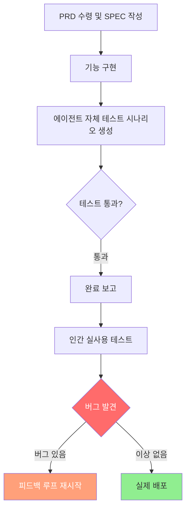
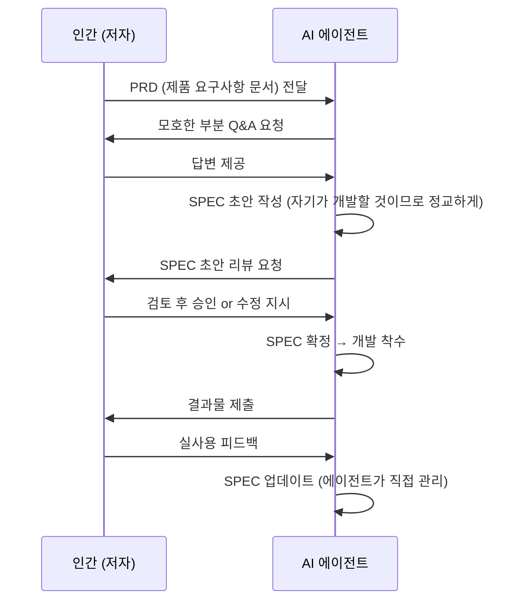
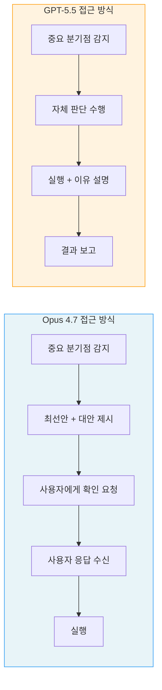
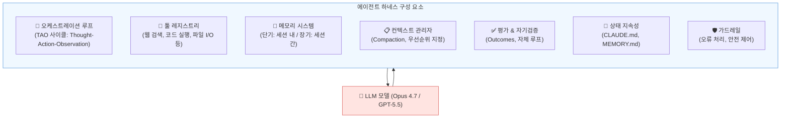
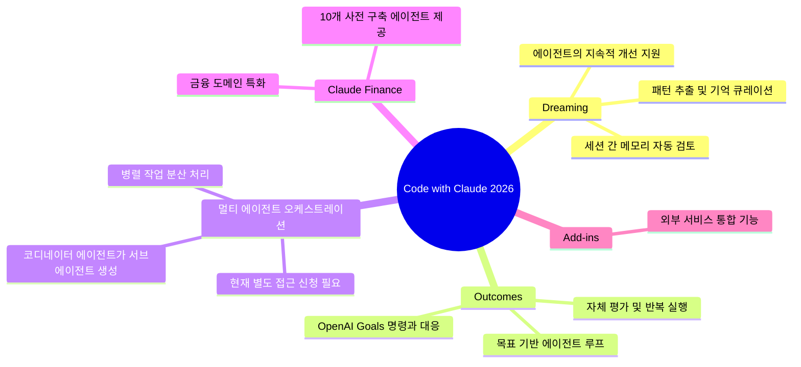
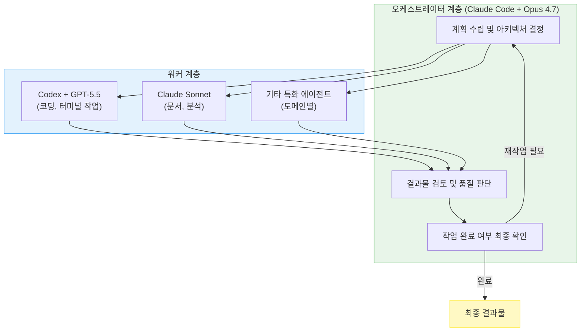
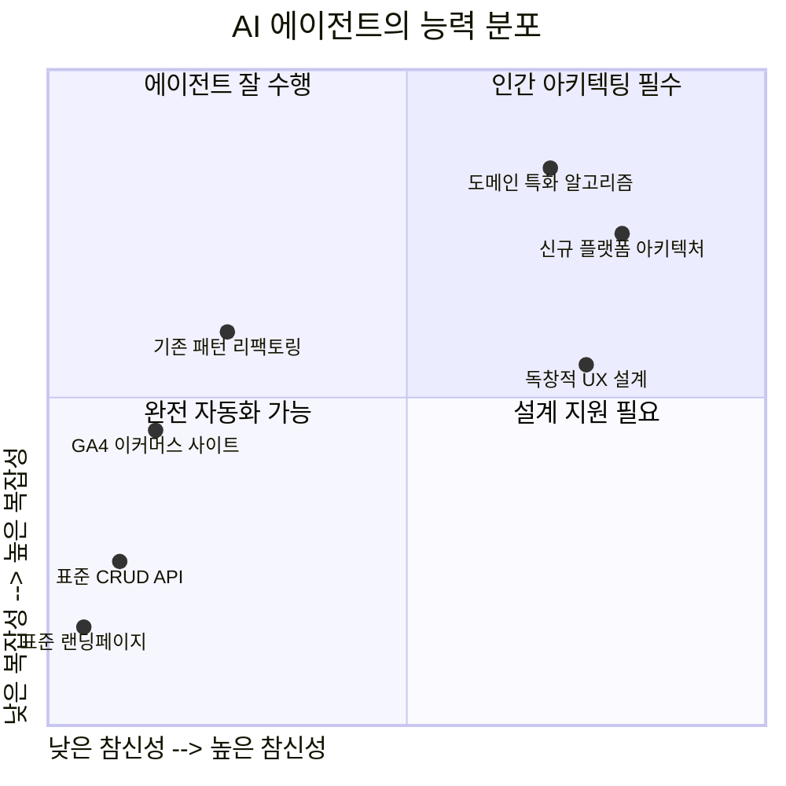
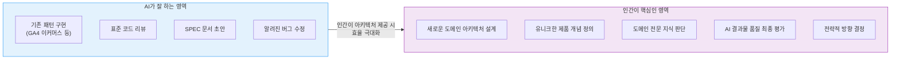

> 고넥터 고영혁의 실사용 비교 포스트를 중심으로, 최신 기술 정보를 종합하여 상세히 풀어쓴 분석

---

## 1. 글의 배경과 맥락

이 글은 AI 에이전트를 활용한 실제 소프트웨어 개발 현장에서의 체험을 기반으로 작성된 것이다. 저자인 고영혁(고넥터)은 고객용 및 개인용 도구들을 동시에 개발하는 과정에서 **Claude Code + Opus 4.7** 기반의 에이전트에 아쉬움을 느끼기 시작했고, 이를 계기로 미루어 두었던 **Codex + GPT-5.5** 환경을 본격적으로 병행 테스트하게 되었다는 것이 출발점이다.

단순한 벤치마크 비교가 아니라, 실제 완성도 있는 제품을 만들어야 하는 현실적 맥락에서 두 에이전트를 비교했다는 점이 이 글의 핵심적 가치다. 인위적으로 설계된 테스트 환경이 아니라, 실사용 버그 발견이라는 실전적 기준으로 두 시스템의 차이를 평가했다.

---

## 2. Opus 4.7 에이전트의 한계로 지목된 문제: 테스트 시나리오 설계의 정교성

### 2-1. 핵심 문제의 구조

저자가 지적한 Opus 4.7 기반 에이전트의 문제는 기능 구현 자체의 품질보다 **테스트 시나리오 설계의 정교성** 문제였다. 에이전트가 자신이 스스로 만든 테스트 시나리오는 통과시키지만, 실제 저자가 사용해보면 버그가 발견되는 구조적 아이러니다.

이는 AI 에이전트의 보편적 한계이기도 하다. 에이전트는 자신이 이미 알고 있는 방식으로 코드를 짜고, 자신이 예측할 수 있는 케이스만 테스트 시나리오로 삼는 경향이 있다. 즉, **"모르는 것은 테스트하지 않는다"** 는 맹점이 생긴다.

### 2-2. 실제 벤치마크로 본 Opus 4.7의 위치

최신 비교 자료에 따르면, Opus 4.7은 실제 GitHub 이슈 해결 능력을 측정하는 **SWE-bench Pro에서 64.3%** 를 기록하며 GPT-5.5의 58.6%를 앞선다. 복잡한 멀티파일 리팩토링이나 버그 재현 같은 실제 코드베이스 작업에서 강점을 보인다. 반면 터미널 중심의 DevOps 작업을 측정하는 **Terminal-Bench 2.0에서는 GPT-5.5(82.7%)가 Opus 4.7(69.4%)을 크게 앞서며**, 이는 두 모델 간 가장 큰 격차를 보이는 영역이다.

즉, "Opus 4.7이 나쁜 모델"이 아니라 특정 유형의 작업에서 각자가 강한 영역이 다르다는 맥락을 먼저 이해해야 한다.

---

## 3. 개발 프로세스의 혁신: "에이전트가 SPEC을 만든다"

### 3-1. 기획자-개발자 분리 문제의 해소

저자가 언급한 매우 흥미로운 실무 방식이 있다. 인간 세계에서는 기획자가 SPEC 문서를 만들고, 개발자가 그것을 받아서 개발하다가 모호한 부분이 생기면 다시 기획자에게 묻는 과정이 반복된다. 이 구조는 수십 년간 소프트웨어 산업에서 엄청난 비효율과 오해를 만들어왔다.

저자의 접근법은 **에이전트가 PRD 문서와 저자와의 Q&A를 통해 SPEC을 직접 작성**하게 하는 것이다. 이것이 왜 더 좋은 결과를 만드는가에 대한 저자의 통찰은 예리하다.

> "자기도 자기가 이걸 토대로 만들어야 한다는 것을 알기 때문에 스스로 이해하기 애매한 문서를 안만드는 것이죠."

에이전트는 자신이 실행해야 할 사양 문서를 만들기 때문에, 그 문서가 모호하면 자신이 나중에 고통받는다는 사실을 이미 알고 있다. 결과적으로 더 명확하고 실행 가능한 SPEC이 나온다.

### 3-2. 기획과 개발의 통합이 주는 의미

이 방식은 단순한 편의성 향상이 아니다. 기획(What to build)과 구현(How to build)을 한 존재가 담당하면, 수많은 **"해석 오차"** 가 사라진다. 인간-인간 협업에서 발생하는 커뮤니케이션 비용, 회의, 문서 정합성 문제 등이 대폭 줄어든다. 이제 그 통합된 존재가 AI 에이전트이며, 인간은 맥락 제공자이자 최종 판단자 역할로 이동한다.

---

## 4. 두 에이전트의 행동 방식 차이: 자율성 vs 협의

이 부분은 두 시스템의 가장 근본적인 **철학적 차이**를 드러낸다.

### 4-1. Opus 4.7: 중요 분기점에서 사용자에게 묻는다

Opus 4.7은 중요한 결정을 내려야 할 때 최대한 이용자에게 의견을 구하는 방식을 택한다. 저자는 나름 프롬프트 튜닝을 통해 에이전트가 자신의 최선안과 대안들을 먼저 제시하도록 설정했지만, 해당 지점이 발생하면 어쨌든 멈추고 사용자에게 확인한다.

이는 실제 벤치마크와도 일치한다. DataCamp의 분석에 따르면 Opus 4.7은 **스펙이 불완전하게 지정된 상황에서 나쁜 가정을 하기보다 명확화 질문을 하는 경향**이 있으며, 이는 데모에서는 불편해 보일 수 있지만 실제 프로덕션 환경에서는 매우 가치 있는 특성이다.

### 4-2. GPT-5.5: 스스로 결정하고 이유를 설명한다

반면 GPT-5.5는 나름의 판단과 이유를 명확하게 정하고 묻지 않고 그냥 진행한다. 그러나 왜 그렇게 결정했는지를 어느 정도 설명해주며, 저자의 평가에 따르면 그 설명이 나름 수긍 가능한 수준이다. 이전 버전(5.3)에 비해 **사용자와의 상호작용과 자체 의사결정 실행 간의 밸런스가 지금까지 버전 중 최상**이라는 것이 저자의 평가다.

MindStudio의 분석도 이를 뒷받침한다. GPT-5.5는 **최소한의 사용자 가이드로 멀티스텝 태스크를 수행하며 스스로 작업을 체크하고 완료까지 지속하도록 설계**되어 있다.

---

## 5. 데스크톱 앱 환경 비교: Claude Code vs Codex

### 5-1. 두 환경 모두 현재 상당한 완성도

저자는 AI가 보조(서브) 역할을 하는 개발 환경(Cursor 등)과, AI가 완전히 주도를 하는 개발 환경을 구분한다. 후자의 시작점으로 구글의 Antigravity를 꼽으며, 현재 Codex와 Claude Code의 데스크톱 앱은 그 진화의 결과물로 **"정말 프론트엔드의 디자인과 상세 인터랙션을 AI와 상호작용하며 수정/업데이트하기에 정말 편하다"** 고 평가한다.

### 5-2. 저자가 직접 느낀 각각의 강점

| 비교 항목 | Claude Code 데스크톱 | Codex 데스크톱 |
|---|---|---|
| 프론트엔드 미리보기 피드백 전달 | ✅ 더 직관적이고 편리 | 보통 |
| 뷰포트 크기 조정 | 보통 | ✅ 더 편리 |
| 반응형 적용 여부 제어 | 보통 | ✅ 더 편리 |
| 브라우저 핵심 속성 제어 | 보통 | ✅ 크롬 개발툴 방식 유사 |

Lushbinary의 4월 2026년 기준 벤치마크 분석에서도 Claude Code는 아키텍처 중심 벤치마크(CursorBench 70%)에서, Codex는 터미널과 컴퓨터 사용 벤치마크에서 각각 강점을 보이는 것으로 확인된다.

---

## 6. 하네스 엔지니어링(Harness Engineering): 모델보다 중요한 것

### 6-1. 하네스란 무엇인가

최근 기술 커뮤니티에서 정립된 개념인 **하네스(Harness)** 는 LLM 모델을 감싸는 전체 소프트웨어 인프라다. 오케스트레이션 루프, 툴, 메모리, 컨텍스트 관리, 상태 지속성, 오류 처리, 가드레일 등이 모두 포함된다. LangChain의 Vivek Trivedy의 공식처럼, **"모델이 아닌 모든 것이 하네스다(If you're not the model, you're the harness)"** 라는 말이 이 개념을 잘 압축한다.

Anthropic의 Claude Code 문서 역시 SDK를 "Claude Code에 동력을 공급하는 에이전트 하네스"로 명시하고 있다.

특히 중요한 데이터가 있다. 2026년 4월 기준 측정치에 따르면, **Claude Opus가 최소 스캐폴드에서 SWE-bench 42%를 기록했지만, Claude Code의 완전한 하네스 안에서는 78%를 기록**했다. 즉, 모델 가중치(weights)의 개선이 아닌 순전히 하네스 차이만으로 **36 포인트의 능력 차이**가 만들어진 것이다.

### 6-2. 메모리 시스템의 진화: Context Engineering → Harness Engineering

저자가 언급한 "컨텍스트 엔지니어링"과 "하네스 엔지니어링"의 결합은 현재 업계의 핵심 화두다. Avi Chawla의 하네스 해부학 분석에 따르면, **컨텍스트 부패(Context Rot) 문제**가 에이전트 실패의 핵심 원인이다. 핵심 콘텐츠가 컨텍스트 윈도우 중간에 위치하면 모델 성능이 30% 이상 저하된다. 100만 토큰의 거대한 컨텍스트 윈도우도 이 문제에서 자유롭지 않다.

Claude Code는 이를 해결하기 위해 3단계 메모리 계층을 구현하고 있다. 항상 로드되는 경량 인덱스(항목당 약 150자), 온디맨드로 불러오는 상세 토픽 파일, 그리고 검색을 통해서만 접근하는 원시 트랜스크립트가 그것이다.

---

## 7. Anthropic의 현재 전략: Managed Agents와 Code with Claude 2026

### 7-1. Claude Managed Agents (2026년 4월 출시)

저자가 언급한 "메모리 관리와 멀티 에이전트를 긴밀하게 연결한다"는 방향은 Anthropic이 2026년 4월 8일 출시한 **Claude Managed Agents**에서 구체화되었다. 이 제품은 에이전트 로직과 실행 인프라를 분리하여, 개발자는 에이전트가 무엇을 할지를 정의하고 Anthropic의 플랫폼이 어떻게 안전하고 확장 가능하게 실행할지를 담당하는 구조다.

Anthropic이 이 제품에서 핵심적으로 해결하려는 세 가지 문제는 다음과 같다.

- **세션 간 메모리 퇴화**: 에이전트가 이전 세션의 맥락을 기억하지 못하는 문제
- **출력 품질의 일관성 부재**: 사람의 리뷰 없이 품질을 보증하기 어려운 문제
- **복잡한 작업의 멀티 에이전트 조율**: 병렬 처리가 필요한 복잡한 작업의 분산 처리 문제

### 7-2. Code with Claude 2026 (5월)에서 발표된 5가지 기능

Anthropic이 2026년 5월 개최한 Code with Claude 개발자 컨퍼런스에서는 새 모델 없이 5가지 핵심 기능을 발표했다. 저자가 말한 "메모리 관리와 멀티 에이전트의 긴밀한 결합"이 이 발표에서 실제로 구현된 형태로 나타났다.

**Dreaming**은 세션 사이에 에이전트 세션과 메모리 저장소를 검토하여 패턴을 추출하고 기억을 큐레이션하는 스케줄 프로세스다. 에이전트가 시간이 지나면서 스스로 개선될 수 있는 기반을 만든다.

**Outcomes**는 개발자가 목표와 성공 기준을 정의하면 에이전트가 그 기준을 달성할 때까지 루프를 실행하는 자체 평가 기능이다. Anthropic에 따르면 평가 루프 추가만으로 출력 품질이 10.1% 향상되었다.

---

## 8. 하이브리드 멀티 에이전트 시스템으로의 진화

저자는 현재 Claude Code 및 Opus 기반으로 작동하는 멀티 에이전트 시스템에 GPT와 Codex를 하위 계층으로 통합하려는 계획을 밝혔다. 이미 추후 확장성을 위해 일부를 범용으로 운영할 수 있도록 설계해 두었으며, 조만간 하이브리드로 전환하려 한다는 것이다.

이 아키텍처 방향은 기술 커뮤니티에서도 실제 채택되고 있는 패턴이다. Fountaincity Tech의 분석에 따르면, Chandler Nguyen의 팀은 수주간 두 시스템을 운용한 결과 **"Codex가 코딩 역할을 맡고 Claude Code가 나머지 모든 것을 담당했다"** 는 결론에 도달했다. "나머지 모든 것"이란 계획 수립, 코드베이스 파악, 워커에서 돌아온 결과물 검토, 작업의 완료 여부 판단 등을 말한다.

오픈소스 하네스 빌더인 Archon, BEADS+Metaswarm 프레임워크 등이 이러한 혼합 에이전트 아키텍처를 실현하는 도구로 현장에서 활용되고 있다.

---

## 9. AI 에이전트가 잘 하는 것과 못 하는 것

저자는 에이전트의 능력 한계를 매우 현실적으로 묘사한다. GA4 풀태깅까지 포함한 이커머스 사이트를 20분 만에 상당한 완성도로 만들어낸다는 사례는 **이미 세상에 충분히 학습된 패턴**을 구현할 때의 놀라운 능력을 보여준다. 그러나 기존에 보편적으로 접해볼 수 없던 **유니크하고 차별화된 것**을 대충 말해주면 헤매고 문제가 많이 보인다.

이 경우 반드시 **사람이 먼저 제대로 설계하고 그 설계도를 에이전트에게 제공**해야 한다. 그리고 이 설계는 인간과 AI 에이전트 협업으로 이루어지지만, 진짜 핵심은 새로운 것을 만들고자 하는 **인간의 아키텍팅 역량**에 달려 있다.

---

## 10. 인간 역량의 재정의: 아키텍트의 시대

### 10-1. 뾰족한 버티컬 도메인 전문성

저자는 AI 에이전트 시대에 인간이 집중해야 할 역량을 "뾰족한 버티컬에 대한 도메인 전문성"으로 정의한다. Anthropic이 법무, 영업, 재무, 마케팅, 제품개발, 고객서비스, 보안, 개발 등 모든 비즈니스 도메인에 특화된 서비스를 내놓고 있지만, 그 안에서도 다시 세부 특화 영역이 나뉜다. 그리고 그 세부 영역에서는 여전히 해당 분야의 도메인 전문가가 최상의 결과물을 만들어낸다는 것이다.

Claude Finance에 10개의 사전 구축 에이전트가 포함되었다는 사실이 이를 방증한다. 금융 도메인 자체에 특화된 에이전트가 있어도, 그 에이전트를 실제 업무에 맞게 운용하고 방향을 제시하는 것은 여전히 해당 분야 전문가의 몫이다.

### 10-2. 아키텍팅 역량이 핵심인 이유

저자는 건축이든, SW 개발이든, 플랫폼 개발이든, 제품 개발이든 **"그 근간의 가장 핵심 역량은 아키텍처를 이해하고 설계하는 것"** 이라고 단언한다.

AI가 이미 있는 것의 아키텍처는 당연히 만들 수 있다. 하지만 이 시대에 이미 있던 것을 AI로 조금 더 잘 만드는 것은 지속가능한 차별화가 되기 어렵다. 진정한 가치는 **상상만 했지 제대로 구체화하지 못했던 것들을 AI의 도움으로 바로 구체화**해가면서, 윤곽을 뚜렷하게 잡고 새로운 의미를 지니는 결과물을 아키텍팅하는 데 있다.

---

## 11. 전체 흐름 요약

이 글이 담고 있는 핵심 메시지는 층위별로 정리하면 다음과 같다.

**기술 실용 층위**에서는, Claude Code + Opus 4.7과 Codex + GPT-5.5 모두 현시점에서 상당한 완성도를 갖춘 AI 개발 환경이며, PRD → SPEC → 개발 → 테스트의 전 과정을 에이전트가 주도하는 시대가 실제로 도래했음을 실증적으로 보여준다. Opus 4.7은 복잡한 코드베이스 작업과 아키텍처 판단에서, GPT-5.5는 터미널 작업과 독립적 실행에서 각각 강점을 보인다.

**시스템 설계 층위**에서는, 단일 에이전트가 아닌 오케스트레이터와 워커 역할을 분리한 **하이브리드 멀티 에이전트 아키텍처**가 실전에서 효과적임을 보여주며, 모델 자체보다 하네스 설계가 결과를 크게 좌우한다는 점을 강조한다.

**산업 전략 층위**에서는, Anthropic의 Managed Agents와 Dreaming/Outcomes 기능이 저자가 예측했던 "컨텍스트 엔지니어링과 하네스 엔지니어링의 결합"을 실제로 구현하고 있음을 확인할 수 있다. 이 흐름은 이제 돌이킬 수 없다.

**인간 역량 층위**에서는, AI 에이전트가 잘 알려진 패턴의 구현을 빠르게 처리하는 시대일수록, 인간의 경쟁력은 **새로운 것을 구상하고 아키텍팅하는 능력, 그리고 특정 도메인의 깊은 전문성**에 있다는 것이 이 글의 가장 중요한 메시지다.

---

## 참고 자료

- 고넥터 고영혁, Facebook 원문 포스트 (2026년 5월)
- DataCamp: *Claude Opus 4.7 vs GPT-5.5: Which Frontier Model Is Best?* (2026년 4월)
- MindStudio: *Claude Opus 4.7 vs GPT-5.5: Which Model Should You Build On?* (2026년 4월)
- Fountaincity Tech: *Codex (GPT-5.5) vs Claude Code (Opus 4.7): Driver/Worker Guide* (2026년 4월)
- Anthropic Engineering Blog: *Effective Harnesses for Long-Running Agents*
- MindStudio: *Code with Claude 2026: 5 New Agent Features Anthropic Just Shipped* (2026년 5월)
- VentureBeat: *Anthropic wants to own your agent's memory, evals, and orchestration* (2026년 5월)
- InfoQ: *Anthropic Introduces Managed Agents* (2026년 4월)
- Every.to: *Inside Anthropic's 2026 Developer Conference* (2026년 5월)
- Avi Chawla: *The Anatomy of an Agent Harness* (2026년 4월)

---

*작성일: 2026년 5월 14일*
