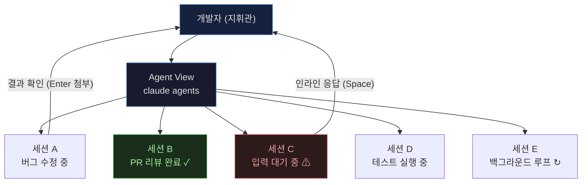
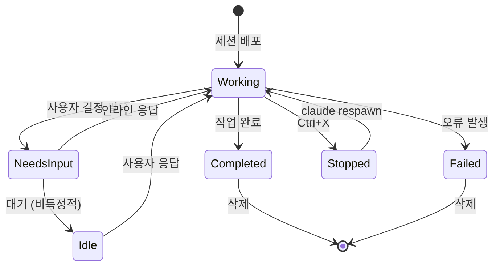
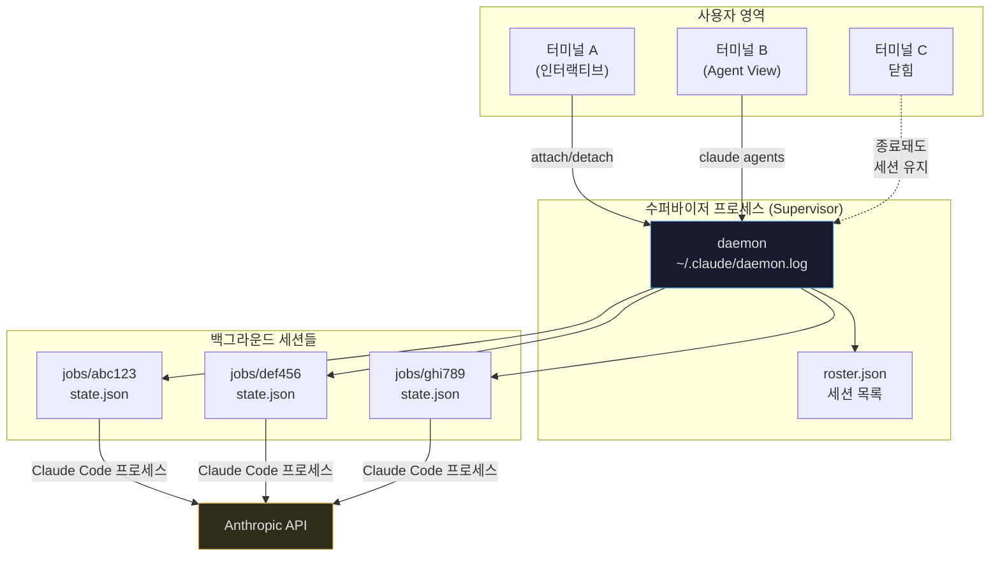
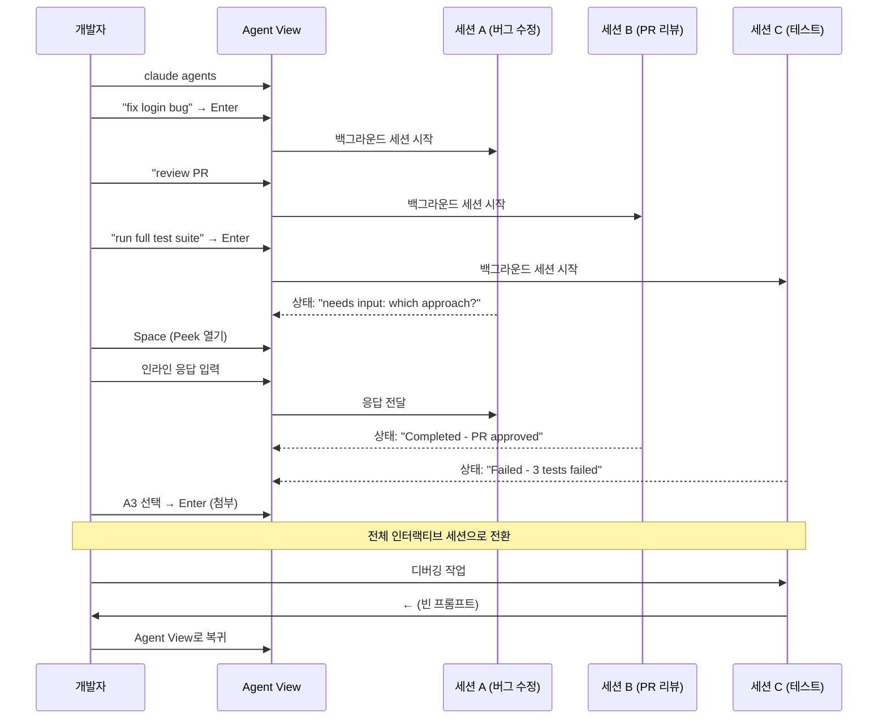
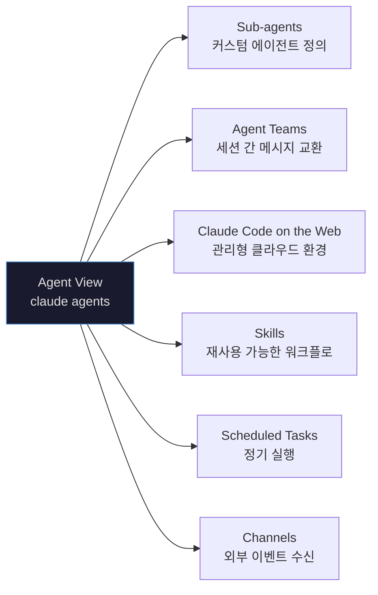

> **출처**: Anthropic 공식 블로그 및 Claude Code 공식 문서  
> **원문**: https://claude.com/blog/agent-view-in-claude-code  
> **문서**: https://code.claude.com/docs/en/agent-view  
> **출시일**: 2026년 5월 11일 (Research Preview)

---

## 목차

1. [배경: 왜 Agent View가 필요했는가](#1-배경-왜-agent-view가-필요했는가)
2. [Agent View란 무엇인가](#2-agent-view란-무엇인가)
3. [핵심 작동 원리](#3-핵심-작동-원리)
4. [세션 상태와 아이콘 체계](#4-세션-상태와-아이콘-체계)
5. [주요 기능 상세 설명](#5-주요-기능-상세-설명)
6. [에이전트 배포(Dispatch) 방법](#6-에이전트-배포dispatch-방법)
7. [셸에서의 세션 관리](#7-셸에서의-세션-관리)
8. [백그라운드 세션의 기술적 구조](#8-백그라운드-세션의-기술적-구조)
9. [실제 활용 패턴](#9-실제-활용-패턴)
10. [현재 한계와 주의사항](#10-현재-한계와-주의사항)
11. [개발자 경험의 패러다임 전환](#11-개발자-경험의-패러다임-전환)

---

## 1. 배경: 왜 Agent View가 필요했는가

Claude Code가 등장하면서 개발자들은 AI를 이용해 복수의 작업을 동시에 처리하는 방식에 자연스럽게 익숙해졌다. 버그 수정, PR 리뷰, 테스트 실행, 코드 리팩토링 등 서로 독립적인 태스크들을 병렬로 돌리고 싶은 욕구는 당연한 것이었다.

그러나 그 이전까지의 Claude Code 사용 경험은 다음과 같은 문제를 안고 있었다.

**여러 터미널 탭의 혼란.** 에이전트를 4~5개 동시에 돌리려면 그만큼의 터미널 창이나 탭이 필요했다. 어느 탭이 무슨 작업을 하고 있는지, 어느 세션이 내 응답을 기다리고 있는지 파악하는 일 자체가 인지적 부담이었다. tmux 같은 멀티플렉서를 써서 화면을 분할해도, 각 패널을 동시에 모니터링하며 적시에 개입하는 것은 쉽지 않았다.

**컨텍스트 스위칭 비용.** 한 세션에서 다른 세션으로 넘어갈 때마다 "이 세션은 어디까지 진행됐더라?"를 다시 파악해야 했다. 스크롤을 올려 히스토리를 훑어야 현재 상태를 알 수 있었고, 그 사이 다른 세션에서 의사결정을 기다리고 있을 수 있었다.

**정신적 장부(mental ledger).** 개발자 스스로가 "세션 A는 테스트 중, 세션 B는 PR 대기 중, 세션 C는 내 승인 필요"라는 상태를 머릿속에서 관리해야 했다. 에이전트 수가 늘어날수록 이 인지 부하는 기하급수적으로 증가했다.

Anthropic은 이 문제를 정확히 인식했고, 해결책으로 **Agent View**를 제시했다.

---

## 2. Agent View란 무엇인가

Agent View는 2026년 5월 11일 Anthropic이 공개한 Claude Code의 신기능으로, 모든 Claude Code 세션을 단일 화면에서 관리할 수 있게 해주는 대시보드다.

Agent View는 `claude agents` 명령어로 열 수 있으며, 모든 백그라운드 세션을 한 화면에서 관리한다. 어느 세션이 실행 중인지, 어느 세션이 사용자 입력을 기다리는지, 어느 세션이 완료됐는지를 한눈에 파악할 수 있다.

단순한 UI 업데이트가 아니다. Agent View는 개발자가 **코드를 직접 작성하는 행위**에서 **AI 에이전트들의 작업 흐름을 조율하는 행위**로 전환하도록 설계된, 일종의 AI 오케스트레이션 레이어다.



---

## 3. 핵심 작동 원리

Agent View의 진입점은 터미널에서 실행하는 `claude agents` 명령어다. 이 명령어를 입력하면 터미널 전체를 점유하는 대시보드가 열린다. 세션 목록이 테이블 형태로 나타나며, 하단에는 새로운 세션을 배포하거나 필터링하기 위한 입력창이 위치한다.

각 행에는 세션 이름, 현재 활동 내용, 마지막으로 변경된 시간이 표시된다. 세션 목록은 머신 전체에 걸쳐 전역적(global)으로 관리되며, 프로젝트나 worktree에 관계없이 모든 백그라운드 세션이 포함된다.

중요한 점은, 다른 터미널에서 열어둔 인터랙티브 세션은 사용자가 직접 백그라운드로 전환하기 전까지는 목록에 나타나지 않으며, 세션 내부에서 실행 중인 서브에이전트(subagent)도 별도 행으로 표시되지 않는다.

세션 목록의 구성 예시는 다음과 같다:

```
Pinned
  ✽ clawd walk cycle          Write assets/sprites/clawd-walk.png           3m

Ready for review
  ∙ jump physics              github.com/anthropics/example/pull/2048       2h

Needs input
  ✻ power-up design           needs input: double jump or wall climb?       1m

Working
  ✽ collision detection       Edit src/physics/CollisionSystem.ts           2m
  ✢ playtest level 3          run 12 · all checkpoints cleared           in 4m

Completed
  ✻ title screen              result: menu, options, and credits done       9m
  ∙ sound effects             result: 14 SFX exported to assets/audio       4h
```

각 행의 한 줄 요약(one-line summary)은 사용자가 설정한 Haiku급 모델이 생성한다. 세션이 무엇을 하고 있는지, 무엇이 필요한지, 무엇을 만들어냈는지를 전체 트랜스크립트를 열지 않고도 파악할 수 있도록 설계된 것이다. 이 요약 생성은 일반 세션 비용과 동일한 방식으로 청구된다.

---

## 4. 세션 상태와 아이콘 체계

Agent View는 각 세션의 상태를 아이콘으로 표현하는 명확한 시각 언어를 사용한다.

### 상태(State) 아이콘

아이콘의 색상은 세션의 현재 상태를 나타낸다:

| 아이콘 유형 | 상태 | 의미 |
|---|---|---|
| 애니메이션 | Working | Claude가 현재 도구를 실행하거나 응답을 생성하는 중 |
| 노란색 | Needs input | Claude가 사용자 입력 대기 중 (권한 결정 또는 질문) |
| 흐릿한 색 | Idle | 입력을 기다리지만 특정 질문에 막혀있지는 않은 상태 |
| 초록색 | Completed | 태스크가 성공적으로 완료됨 |
| 빨간색 | Failed | 오류와 함께 태스크 종료 |
| 회색 | Stopped | `Ctrl+X` 또는 `claude stop`으로 세션이 중단됨 |

### 프로세스 상태 아이콘

아이콘의 형태는 백그라운드 프로세스가 실행 중인지 여부를 알려준다:

- **`✻` (또는 작업 중일 때 애니메이션 `✽`)**: 세션이 살아있으며 즉시 응답할 수 있는 상태
- **`∙`**: 프로세스가 종료됐지만, 첨부(attach)·엿보기(peek)·응답이 가능하다. Claude가 중단된 지점부터 세션을 재시작함
- **`✢`**: `/loop` 세션으로, 반복 실행 사이에 대기 중. 행에 실행 횟수와 다음 실행까지의 카운트다운이 표시됨



---

## 5. 주요 기능 상세 설명

### 5-1. 전체 현황 파악 (See everything at once)

어떤 세션에서든 왼쪽 화살표를 누르거나, 터미널에서 `claude agents`를 실행하면 Agent View가 열린다. 각 행은 세션 이름, 입력이 필요한지 여부, 마지막 응답 내용, 마지막으로 상호작용한 시간을 보여준다.

세션 목록은 상태별로 그룹화되며, 입력이 필요한 세션과 핀(pin)된 세션이 최상단에 배치된다. `Ctrl+S`로 디렉토리별 그룹화로 전환할 수 있으며, 이 설정은 재실행 후에도 유지된다.

### 5-2. 엿보기와 인라인 응답 (Peek and reply)

세션을 선택하면 마지막 턴을 엿볼(peek) 수 있다. 세션이 결정을 기다리고 있다면, 그 자리에서 인라인으로 응답하면 세션이 이어서 진행된다. 전체 트랜스크립트를 탐색하려면 Enter를 눌러 세션에 직접 첨부할 수 있다.

Peek 패널에서 할 수 있는 세부 조작은 다음과 같다:

- 세션이 객관식 질문을 하는 경우, 숫자 키로 선택지를 고를 수 있다.
- 막혀있는 세션에 대해 `Tab`을 누르면 수정 가능한 제안 응답이 입력창에 채워진다.
- 응답 앞에 `!`를 붙이면 응답 대신 Bash 명령어를 전송할 수 있다.
- `↑`와 `↓`로 패널을 닫지 않고 인접 세션을 엿볼 수 있으며, `→`로 바로 첨부할 수 있다.

### 5-3. 세션 첨부와 분리 (Attach and detach)

선택한 행에서 `Enter` 또는 `→`를 눌러 세션에 첨부할 수 있으며, `Alt+1`부터 `Alt+9`까지의 단축키로 해당 번호의 세션에 즉시 첨부할 수 있다.

첨부(attach)하면 Agent View는 사라지고 마치 `claude`를 직접 실행한 것처럼 인터랙티브 세션이 시작된다. 첨부 시, Claude는 자리를 비운 동안 무슨 일이 있었는지 짧은 요약을 제공한다.

분리(detach)는 세션을 중단시키지 않는다. `←`, `Ctrl+C`, `Ctrl+D`, `Ctrl+Z`, `/exit` 모두 세션을 계속 실행 상태로 유지한다. 세션을 종료하려면 내부에서 `/stop`을 실행해야 한다.

### 5-4. 목록 필터링

배포 입력창에 텍스트를 입력하면 배포 대신 필터링이 동작한다.

| 필터 | 표시 대상 |
|---|---|
| `a:<name>` | 특정 이름의 에이전트가 실행 중인 세션 |
| `s:<state>` | 지정한 상태의 세션 (예: `s:blocked`는 입력 대기 세션) |
| `#<number>` 또는 PR URL | 해당 PR을 작업 중인 세션 |

### 5-5. 키보드 단축키 전체 목록

Agent View 내에서 `?`를 누르면 모든 단축키를 확인할 수 있다. 주요 단축키는 다음과 같다:

| 단축키 | 동작 |
|---|---|
| `↑` / `↓` | 행 간 이동 |
| `Enter` | 선택한 세션에 첨부, 또는 입력창에 텍스트가 있으면 배포 |
| `Space` | 선택한 세션의 Peek 패널 열기/닫기 |
| `Shift+Enter` | 배포 후 즉시 첨부 |
| `→` | 선택한 세션에 첨부 |
| `Alt+1`~`Alt+9` | 포커스된 그룹의 N번째 세션에 첨부 |
| `Tab` | 모든 서브에이전트 탐색, 또는 하이라이트된 제안 적용 |
| `Ctrl+S` | 상태별 / 디렉토리별 그룹화 전환 |
| `Ctrl+T` | 선택한 세션 핀/핀 해제 |
| `Ctrl+R` | 선택한 세션 이름 변경 |
| `Ctrl+G` | `$EDITOR`에서 배포 프롬프트 열기 |
| `Ctrl+X` | 세션 중단; 2초 내 재입력 시 삭제 |
| `Shift+↑` / `Shift+↓` | 선택한 세션 순서 변경 |
| `Esc` | Peek 패널 닫기, 입력창 초기화, 또는 종료 |
| `?` | 모든 단축키 보기 |

---

## 6. 에이전트 배포(Dispatch) 방법

새 백그라운드 세션을 시작하는 방법은 세 가지다.

### 6-1. Agent View 내에서 배포

Agent View 하단 입력창에 프롬프트를 입력하고 `Enter`를 누르면 새 백그라운드 세션이 시작된다. 세션 이름은 프롬프트에서 자동 생성되며, 나중에 `Ctrl+R`로 변경할 수 있다.

입력 방식에 따라 다음과 같은 특수 동작이 지원된다:

| 입력 형식 | 효과 |
|---|---|
| `<agent-name> <prompt>` | 첫 단어가 커스텀 서브에이전트 이름과 일치하면 해당 에이전트가 실행됨 |
| `@<agent-name>` | 프롬프트 어디서든 언급해 해당 에이전트를 메인으로 지정 |
| `@<repo>` | Agent View를 연 디렉토리 하위의 저장소 지정 |
| `/<skill>` | 스킬(skill)을 프롬프트로 배포 |
| `#<number>` 또는 PR URL | 이미 해당 PR 작업 중인 세션이 있으면 배포 대신 해당 세션 선택 |
| `Shift+Enter` | 배포 후 즉시 해당 세션에 첨부 |

### 6-2. 세션 내부에서 백그라운드 전환

기존의 긴 작업 세션을 백그라운드로 보내려면 세션 내에서 `/bg` 명령어를 사용하면 된다. `/bg run the test suite and fix any failures`처럼 분리 전에 마지막 지시사항을 함께 전달할 수도 있다.

또한 빈 프롬프트 상태에서 `←`를 누르면 현재 세션을 백그라운드로 전환하면서 Agent View를 여는 것이 한 번에 이루어진다.

### 6-3. 셸에서 직접 배포

`--bg` 옵션으로 처음부터 백그라운드 세션으로 시작할 수 있다.

```bash
claude --bg "investigate the flaky SettingsChangeDetector test"
```

특정 서브에이전트를 메인 에이전트로 지정하려면 `--agent` 옵션을 함께 사용한다:

```bash
claude --agent code-reviewer --bg "address review comments on PR 1234"
```

백그라운드 전환 후, Claude는 세션의 짧은 ID와 관리 명령어들을 출력한다:

```
backgrounded · 7c5dcf5d
  claude agents             list sessions
  claude attach 7c5dcf5d    open in this terminal
  claude logs 7c5dcf5d      show recent output
  claude stop 7c5dcf5d      stop this session
```

---

## 7. 셸에서의 세션 관리

스크립팅이나 Agent View를 열지 않고도 세션을 관리하고 싶을 때 사용할 수 있는 CLI 명령어들이다.

모든 백그라운드 세션에는 짧은 ID가 부여되며, 이를 이용해 셸에서 직접 조작할 수 있다:

| 명령어 | 목적 |
|---|---|
| `claude agents` | Agent View 열기 |
| `claude attach <id>` | 해당 세션에 현재 터미널로 첨부 |
| `claude logs <id>` | 세션의 최근 출력 내용 출력 |
| `claude stop <id>` | 세션 중단 (`claude kill`도 동일) |
| `claude respawn <id>` | 중단된 세션을 대화 내용 유지하며 재시작 |
| `claude respawn --all` | 중단된 모든 세션 일괄 재시작 |
| `claude rm <id>` | 목록에서 세션 제거 |

---

## 8. 백그라운드 세션의 기술적 구조

Agent View가 어떻게 작동하는지 이해하려면 백그라운드 세션을 호스팅하는 내부 구조를 알아야 한다.



### 수퍼바이저 프로세스(Supervisor Process)

백그라운드 세션은 사용자별 수퍼바이저 프로세스가 호스팅한다. 이 프로세스는 터미널이나 Agent View와는 독립적이다. 처음으로 세션을 백그라운드로 전환하거나 Agent View를 열 때 자동으로 시작되며, 사용자가 직접 관리할 필요가 없다.

수퍼바이저와 세션들은 인터랙티브 세션과 동일한 자격증명(credentials)으로 인증하며, 모델 API 외에 추가적인 네트워크 연결을 만들지 않는다.

### 세션 생명주기와 리소스 관리

각 백그라운드 세션은 자체 Claude Code 프로세스이며, 터미널이 아닌 수퍼바이저에 부모 프로세스로 귀속된다. 세션이 작업 중이거나, 사용자 입력을 기다리거나, 터미널이 첨부되어 있는 경우 프로세스가 계속 실행된다.

세션이 완료되고 첨부되지 않은 채로 약 1시간이 지나면, 수퍼바이저가 리소스를 해제하기 위해 해당 프로세스를 중단시킨다. 트랜스크립트와 상태는 디스크에 남아있으며, 다음에 첨부·엿보기·응답 시 수퍼바이저가 중단된 지점부터 새 프로세스를 시작한다.

### 세션 지속성

백그라운드 세션은 터미널을 닫거나 자동 업데이트가 발생해도 유지된다. 단, 머신이 슬립 상태가 되거나 종료되면 실행 중인 세션이 멈춘다. 이때는 `claude respawn --all`로 재시작할 수 있다.

### 파일 시스템 구조

세션 관련 파일들의 저장 위치는 다음과 같다:

| 경로 | 내용 |
|---|---|
| `~/.claude/daemon.log` | 수퍼바이저 로그 |
| `~/.claude/daemon/roster.json` | 실행 중인 백그라운드 세션 목록 (재시작 후 재연결에 사용) |
| `~/.claude/jobs/<id>/state.json` | Agent View에 표시되는 세션별 상태 |

### 자동 업데이트와의 연동

수퍼바이저는 설치된 Claude Code 바이너리를 디스크에서 감시하다가, 자동 업데이터가 새 버전으로 교체하면 새 버전으로 재시작한다. 이것은 로컬 파일 감시이며 네트워크 확인이 아니다. 백그라운드 세션들은 분리된 프로세스이므로 재시작 중에도 계속 실행되고, 새 수퍼바이저가 이들과 재연결한다.

### Worktree 격리

Agent View에서 배포한 세션들은 기본적으로 동일한 작업 디렉토리를 공유하므로, 두 에이전트가 같은 파일을 편집하면 충돌이 발생할 수 있다. 이를 방지하기 위해 Claude Code는 파일 편집이 필요한 세션이 격리된 git worktree로 이동할 때까지 파일 쓰기를 차단한다. Worktree는 프로젝트 디렉토리 내 `.claude/worktrees/` 아래 자동 생성되며, 세션 삭제 시 함께 제거된다.

---

## 9. 실제 활용 패턴

Anthropic이 얼리 유저들로부터 확인한 실제 활용 패턴들은 다음과 같다:

### 9-1. 동시 세션 수 확장

여러 아이디어를 한 번에 배포하되, 각각에 선택적으로 스킬(skill)을 연결하고, 나중에 돌아왔을 때 리뷰 준비가 된 PR 목록을 확인한다.

실용적으로는, 기능 개발·버그 수정·성능 최적화·코드 리뷰 등을 동시에 돌리면서, 각각이 완료되는 순서대로 결과를 수집하는 방식이다.

### 9-2. 장기 실행 에이전트 관리

PR 모니터링(babysitter), 대시보드 업데이터, 루프 작업 등의 작업이 목록에 다음 실행 시간을 표시한다.

예를 들어, "30분마다 CI 상태를 확인하고 실패 시 슬랙 알림" 같은 루프 작업을 `/loop` 명령과 함께 백그라운드에서 지속 실행하면서 Agent View에서 상태를 확인하는 식이다.

### 9-3. 세션 간 빠른 전환

특정 세션에서 작업 중, 왼쪽 화살표를 눌러 관련 태스크를 시작하거나 코드베이스에 대한 빠른 질문을 처리한 후, 다시 오른쪽 화살표로 원래 작업으로 돌아오는 방식이다. 결과가 나오면 Peek에서 확인한다.

### 9-4. 완료 현황 파악

각 행의 상태 아이콘과 Peek의 제목을 통해 어느 세션이 PR을 생성했는지 빠르게 스캔할 수 있다.

특히 세션이 PR을 열면, 해당 행에 PR 링크와 CI 상태 인디케이터가 표시된다. 대부분의 작업에서 이 행이 결과를 수집하는 지점이 된다. CI 검사가 통과되면 PR을 리뷰하고 병합하면 된다.



---

## 10. 현재 한계와 주의사항

Agent View는 Research Preview 단계이므로 몇 가지 중요한 한계가 있다.

### 요금 및 할당량(Rate limits)

백그라운드 세션은 인터랙티브 세션과 동일하게 구독 사용량을 소비한다. 에이전트 10개를 병렬 실행하면 할당량도 10배 빠르게 소진된다. 따라서 다수의 에이전트를 동시에 운용할 때는 사용량 관리에 주의가 필요하다.

### 로컬 실행 환경

백그라운드 세션은 사용자의 로컬 머신에서 실행되므로, 머신이 슬립 상태가 되거나 종료되면 세션이 중단된다. 클라우드 기반 지속 실행이 필요하다면 Claude Code on the Web(관리형 클라우드 환경)을 고려할 수 있다.

### Worktree 관리

파일을 편집한 세션을 삭제하면 해당 worktree도 함께 삭제된다. 삭제 전에 변경사항을 반드시 머지하거나 푸시해야 한다.

### 버전 요구사항

Agent View는 Claude Code v2.1.139 이상에서만 사용 가능하다. `claude --version`으로 현재 버전을 확인할 수 있다. Research Preview 단계이므로 인터페이스와 키보드 단축키가 변경될 수 있다.

### 관리자 비활성화 옵션

조직 관리자는 `disableAgentView` 관리 설정을 통해 Agent View를 비활성화할 수 있다. 환경변수 `CLAUDE_CODE_DISABLE_AGENT_VIEW`를 설정해도 동일한 효과를 얻을 수 있다.

### 서브에이전트와의 차이

독립적인 태스크를 여러 에이전트가 동시에 작업할 때는 Agent View가 적합하다. 반면 단일 대화 안에서 결과를 하나로 모아야 하는 워커들은 서브에이전트(subagent)를 사용하는 것이 맞다.

---

## 11. 개발자 경험의 패러다임 전환

Agent View가 갖는 의미를 단순히 "편리한 UI 업데이트" 수준으로 이해하는 것은 그 핵심을 놓치는 것이다. 이 기능은 개발자의 역할 자체를 재정의하는 방향을 가리키고 있다.

### 인지 부하의 외부화

기존에는 개발자의 뇌가 "세션 상태 추적" 역할을 담당해야 했다. "세션 A는 지금 뭐 하고 있지?", "세션 B가 내 답변을 기다리고 있나?"를 스스로 기억하고 추적하는 것은 비생산적인 인지 소모였다. Agent View는 이 역할을 CLI가 담당하게 함으로써 개발자의 뇌를 고수준 판단에만 쓸 수 있도록 해방시킨다.

### "검수자"로서의 개발자

새 에이전트를 백그라운드로 보내고 다른 창에서 또 다른 에이전트를 시작하는 행위는 개발의 정의를 바꾼다. 개발은 이제 코드를 타이핑하는 노동이 아니라, 자원을 배분하고 결과를 승인하는 검수의 영역이다.

이것은 단순한 수사가 아니다. PR이 생성되면 Agent View에서 링크를 확인하고 CI 통과 여부를 보고 머지하면 된다. 직접 코드를 짜는 시간보다 결과를 검토하고 방향을 제시하는 시간이 더 가치있어진다.

### Anthropic의 전략적 포지셔닝

Anthropic은 순수 CLI 방식의 극단적 경로를 선택했다. 이는 IDE 중심의 GitHub Copilot이나 Cursor와 대조적으로, 터미널 헤비유저와 서버사이드 개발자를 겨냥한 포지셔닝이다. 여러 에이전트 세션을 통합 관리하는 인터페이스는 사실상 개발자 워크플로의 새로운 진입점, 즉 "AI 커맨드 센터"를 겨냥한 것이다.

### 관련 기능과의 연계

Agent View는 독립된 기능이 아니라, Claude Code의 더 넓은 에이전트 생태계와 연결된다.



다음 단계로는 서브에이전트(커스텀 프롬프트, 도구, 격리 설정이 가능한 재사용 에이전트 구성), 에이전트 팀(서로 메시지를 주고받는 복수 세션 조율), 그리고 Claude Code on the Web(로컬이 아닌 관리형 클라우드 환경에서의 세션 실행) 등을 탐색해 볼 수 있다.

---

## 이용 가능 플랜

Agent View는 2026년 5월 11일부터 Research Preview로 제공되며, Pro, Max, Team, Enterprise 및 Claude API 플랜에서 사용 가능하다. `claude agents` 명령어를 실행해 옵트인할 수 있으며, 일반 요금제 한도가 동일하게 적용된다.

---

*작성일: 2026년 5월 13일*
