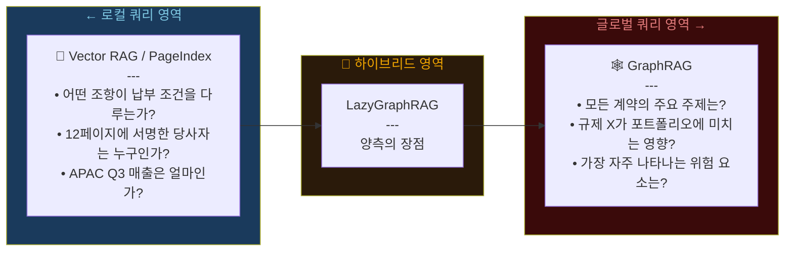
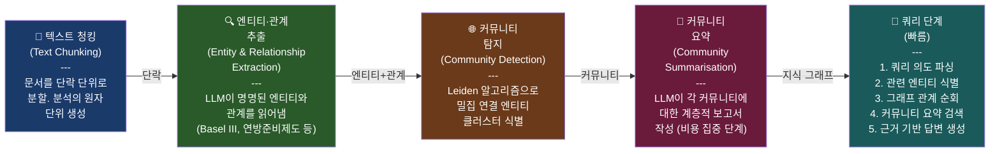
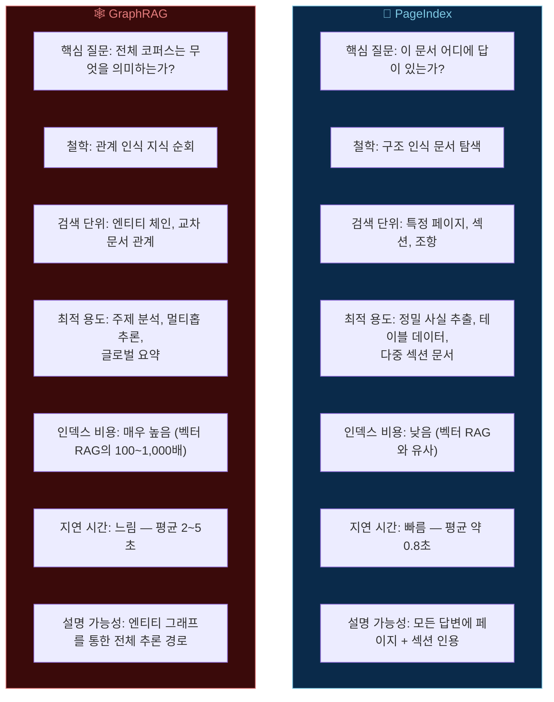
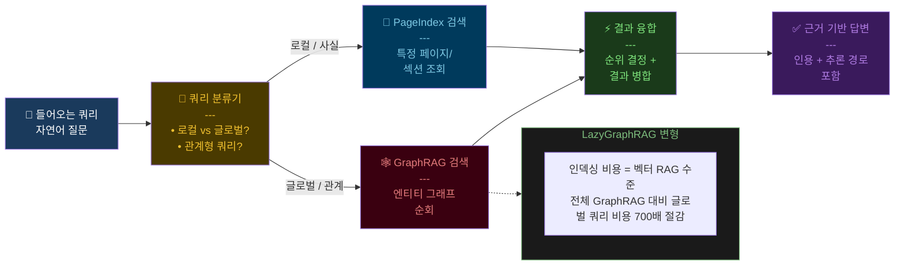
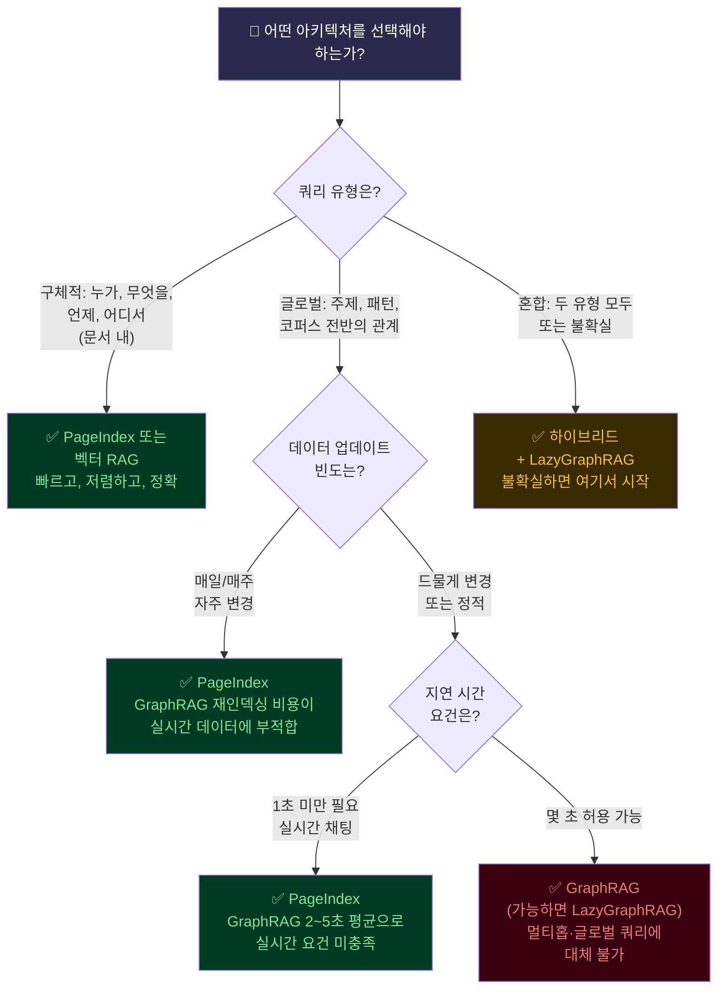

> **원문**: Umesh Kushwaha, ["GraphRAG vs PageIndex: When Knowledge Graphs Beat Vector Search — and When They Don't"](https://medium.com/@umesh382.kushwaha/graphrag-vs-pageindex-when-knowledge-graphs-beat-vector-search-and-when-they-dont-25b10fad5fcb), Medium, 2026년 3월 13일  
> **원문 출처**: Microsoft Research, Edge et al. (arXiv:2404.16130), LazyGraphRAG (2025), GraphRAG-Bench (ICLR 2026), Cognilium 500K 문서 연구 (2025) 등 1차 출처 기반

---

## 들어가며: 같은 조건, 다른 결과

동일한 AI 예산, 동일한 대형 언어 모델(LLM), 동일한 1만 개의 법률 문서. 이 조건에서 두 팀이 서로 다른 아키텍처를 선택했다. 팀 A는 **PageIndex** 파이프라인을 구축했고, 팀 B는 **GraphRAG**를 구축했다. 6개월 후의 결과는 이렇다.

- **팀 A (PageIndex)**: 계약 관련 질문의 97%를 1초 미만에 정확히 처리
- **팀 B (GraphRAG)**: 팀 A가 답할 수 없는 전체 코퍼스 수준의 글로벌 질문에 답할 수 있지만, 인덱싱 비용은 800배 더 들고 쿼리당 4초 소요

놀라운 점은, **두 팀 모두 올바른 선택을 했다는 것**이다. 단지 완전히 다른 문제를 풀고 있었을 뿐이다.

이것이 현대 검색 아키텍처의 핵심 긴장이다. GraphRAG와 PageIndex는 동일한 문제에 대한 경쟁 솔루션이 아니라, 근본적으로 다른 문제를 각각 해결한다. 둘 중 어느 것을 선택할지, 혹은 어떻게 결합할지는 각 시스템이 실제로 무엇을 하는지, 그리고 어디서 한계에 부딪히는지를 이해해야 결정할 수 있다.

---

## 1. 두 시스템이 답하려는 근본적으로 다른 질문

모든 검색 시스템은 하나의 핵심 질문에 답하기 위해 설계된다. 바로 그 질문이 아키텍처를 결정한다.

**PageIndex가 묻는 질문**: *"이 문서 어디에 정확히 답이 있는가?"*

PageIndex는 정밀성 지향 시스템이다. 문서를 챕터, 섹션, 조항, 페이지로 이루어진 계층적 구조로 탐색하고, 특정 사실이 위치한 정확한 위치를 반환한다. 마치 도서관의 고도로 지능화된 색인 시스템과 같다고 생각하면 된다.

**GraphRAG가 묻는 질문**: *"전체 코퍼스는 무엇을 의미하며, 이것들은 어떻게 연결되어 있는가?"*

GraphRAG는 이해력 지향 시스템이다. 수천 개의 문서에 걸쳐 엔티티 간의 관계를 매핑하고, 그 관계 사슬을 따라 추론하는 것을 가능하게 한다. 모든 것이 다른 모든 것과 어떻게 관련되는지를 보여주는 지도라고 이해하면 된다.

Microsoft Research의 2025년 벤치마크는 이 구분을 명확히 공식화했다. 그들의 분석은 **"로컬 쿼리"** 와 **"글로벌 쿼리"** 를 명확히 구분한다.

- **로컬 쿼리**: 답이 소수의 텍스트 영역에 존재하는 경우 (예: "Acme 계약서의 납부 조건이 무엇인가?")
- **글로벌 쿼리**: 어디에도 명시되어 있지 않은 답을 합성하기 위해 데이터셋의 광범위한 부분에 걸쳐 추론해야 하는 경우 (예: "2015년 이후 도입된 모든 은행 규제의 공통 자본 요건 주제는 무엇인가?")

```
Microsoft Research, BenchmarkQED, 2025:
"Vector RAG는 답이 쿼리와 유사한 로컬 쿼리에 뛰어나다.
 GraphRAG는 전체 데이터셋에 걸친 추론을 요구하는 글로벌 쿼리에 뛰어나다."
```

---

## 2. 쿼리 스펙트럼: 어느 아키텍처가 어디서 이기는가



> 출처: Microsoft Research, LazyGraphRAG 2025; GraphRAG-Bench, ICLR 2026

---

## 3. GraphRAG의 작동 원리: 쉬운 설명

GraphRAG는 Microsoft Research가 2024년에 발표한 시스템이다(arXiv:2404.16130). 기존 RAG가 문서를 텍스트 청크로 분할하고 벡터로 임베딩하는 것과 달리, GraphRAG는 언어 모델을 사용하여 세 가지 핵심 요소를 추출한다.

첫째, **엔티티(Entities)**: 사람, 조직, 규정, 개념 등의 명명된 실체.  
둘째, **관계(Relationships)**: 엔티티 간의 관계 (예: "연방준비제도가 금리를 인상하다").  
셋째, **커뮤니티 구조(Community Structures)**: 그래프 알고리즘으로 그룹화된 밀접하게 관련된 엔티티들의 클러스터.

결과물은 벡터 데이터베이스가 아닌 **지식 그래프(Knowledge Graph)** 다. 전체 문서 코퍼스에 걸쳐 '누가-무엇을-누구에게'를 보여주는 살아있는 지도이며, 모든 연결이 명시적으로 인코딩되고 쿼리 가능하다.

### 3.1 GraphRAG의 4단계 인덱싱 프로세스



**1단계 — 텍스트 청킹**: 문서를 텍스트 단위(일반적으로 단락)로 분할한다. 이것들이 그래프가 구축되는 원자 단위가 된다.

**2단계 — 엔티티 및 관계 추출**: 언어 모델이 각 청크를 읽고 명명된 엔티티(사람, 조직, 장소, 개념, 이벤트)와 그 사이의 관계를 추출한다. 예를 들어 "Basel III"는 "은행 자본 요건에 대한 국제 규제 프레임워크"로 설명되고, "연방준비제도가 금리를 인상하다"는 방향성 있는 관계로 기록된다.

**3단계 — 커뮤니티 탐지**: Leiden 알고리즘(그래프 분할 알고리즘)이 밀집 연결된 엔티티 클러스터, 즉 "커뮤니티"를 식별한다. 모기지 규제와 관련된 모든 엔티티가 함께 클러스터를 이루고, 특정 인수합병과 관련된 엔티티들이 또 다른 커뮤니티를 형성할 수 있다.

**4단계 — 커뮤니티 요약**: 언어 모델이 여러 추상화 수준에서 각 커뮤니티에 대한 요약 보고서를 작성한다. 이 요약들이 — 원문 텍스트가 아닌 — GraphRAG가 쿼리 시점에 검색하는 내용이다. 이것이 GraphRAG의 초능력이자 비용 문제의 근원이다.

---

## 4. 실제 사례: 규제 인텔리전스에서의 GraphRAG

한 금융 기관이 50,000개의 규제 문서(Basel III, MiFID II, Dodd-Frank, GDPR, 20년에 걸친 수백 개의 관할권별 개정안)에 GraphRAG를 적용했다. 컴플라이언스 담당자가 묻는다:

*"2015년 이후 도입된 모든 은행 규제에서 공통적인 자본 요건 주제는 무엇이며, 그것들은 어떻게 상충하는가?"*

벡터 RAG는 이것에 답할 수 없다. 질문에는 단일한 "유사 문서"가 없다. 답은 서로 다른 규제 패밀리에 속한 수백 개의 문서에 걸친 관계에서 합성되어야 한다.

GraphRAG는 지식 그래프를 순회한다: 쿼리 엔티티(자본 요건, 은행 규제, 2015년 이후)에서 커뮤니티 구조를 거쳐 관련 요약에 도달하고 — 인간 분석가가 몇 주에 걸쳐 만들어낼 포괄적이고 인용된 합성 결과를 생성한다.

> GraphRAG는 단일 출처가 없는 질문에 답했다. 답은 모든 출처에 걸친 패턴이었으며, 관계 그래프만이 그 패턴을 볼 수 있었다.

---

## 5. GraphRAG의 불편한 진실: 비용 문제

GraphRAG는 강력하다. 그러나 완전한 형태로는 구축과 유지에 **극도로 많은 비용**이 든다. 이 비용을 이해하는 것은 선택이 아니라 필수다.

인덱싱 단계 — 엔티티 추출, 그래프 구축, 커뮤니티 탐지, 요약 생성 — 에서 코퍼스의 모든 청크에 대해 LLM 호출이 필요하다. Microsoft의 2024년 보고에 따르면 대규모 엔터프라이즈 데이터셋의 인덱싱 비용이 **$33,000**에 달했다. 32,000단어 분량의 단 한 권의 책을 인덱싱하는 데도 $7가 들 수 있다. 50,000개의 문서로 확장하면 예산 논의가 필수다.

### 5.1 GraphRAG 비용 현실 점검

| 항목 | 세부 내용 |
|------|-----------|
| 전체 GraphRAG 인덱싱 비용 | 벡터 RAG 대비 **100~1,000배** 더 비쌈 |
| 데이터 업데이트 시 재인덱싱 | **필수** (저렴한 증분 업데이트 없음) |
| 쿼리 지연 시간 | 벡터 RAG의 1초 미만 대비 평균 **2~5초** |
| LazyGraphRAG (2025년 6월) | 인덱싱 비용 = 벡터 RAG 수준, 전체 GraphRAG 대비 글로벌 쿼리 비용 **700배** 절감 |
| GraphRAG-Bench (ICLR 2026) | "GraphRAG는 많은 실제 작업에서 바닐라 RAG를 자주 뛰어넘지 못함" |

이것이 GraphRAG 하이프 사이클이 실제 프로덕션 배포에서 현실과 충돌한 이유다. 쿼리 스펙트럼을 이해하지 못한 채 GraphRAG를 범용 RAG 업그레이드로 적용한 팀들은 인덱싱에 100배 더 많은 비용을 지출하고 혼재된 결과를 얻었다. 올바른 문제에 적용한 팀들은 혁신적인 결과를 보았다.

---

## 6. PageIndex: 무엇을 하고, 무엇을 못 하는가

PageIndex는 문서를 평면적인 청크 시퀀스가 아닌 섹션의 계층 구조로 처리하는 **구조 인식 검색 아키텍처**다. 문서 내의 올바른 위치 — 올바른 페이지, 올바른 섹션, 올바른 조항 — 로 탐색한다.

PageIndex는 로컬 쿼리에 탁월하다. 500,000개의 엔터프라이즈 문서에 대한 Cognilium 연구에서 PageIndex는 로컬 사실 검색에서 **97% 이상의 정확도**를 달성했다 — 특정 조항 찾기, 표 값 추출, 인용된 페이지 번호 반환. 인덱싱 비용은 표준 벡터 RAG와 동일하며, 쿼리 지연 시간은 빠르다(약 0.8초).

그러나 PageIndex는 글로벌 쿼리에 답할 수 없다. "이 코퍼스의 모든 500개 계약에 걸쳐 반복되는 책임 주제는 무엇인가?"라고 물으면 — PageIndex는 문서 간 관계를 순회할 메커니즘이 없다. 각 문서를 개별적으로 검색해야 하고, LLM의 컨텍스트 창이 합성된 답변이 나오기 전에 소진될 것이다.

---

## 7. PageIndex vs GraphRAG: 철학과 특성의 비교



---

## 8. 10개 차원에서의 정면 비교

아래는 프로덕션 의사 결정에서 중요한 10개 차원에 걸친 전체 비교다.

| 차원 | PageIndex | GraphRAG | 하이브리드 |
|------|-----------|----------|-----------|
| **핵심 질문** | 이 문서 어디에 답이 있는가? | 전체 코퍼스는 무엇을 의미하는가? | 둘 다 |
| **검색 단위** | 페이지, 섹션, 조항 | 엔티티, 관계, 커뮤니티 | 적응형 |
| **인덱스 구축 비용** | 낮음 (~벡터 RAG) | 매우 높음 (100~1,000배) | 보통 |
| **쿼리 지연 시간** | ~0.8초 | 2~5초 | 1~3초 |
| **멀티홉 추론** | 제한적 | 우수 | 우수 |
| **글로벌 주제 쿼리** | 취약 | 강함 (72~83%) | 강함 |
| **로컬 사실 검색** | 우수 (97%+) | 양호 (72%) | 우수 |
| **인용/감사 추적** | 페이지 + 섹션 | 엔티티 경로 | 전체 추적 |
| **스트리밍/실시간 데이터** | 예 | 비용 높음 (재인덱싱) | 부분적 |
| **최적 도메인** | 법률, 금융, 컴플라이언스 | 연구, 인텔리전스, KM | 대규모 엔터프라이즈 |

> 출처: Cognilium 500K 문서 연구 (2025), Microsoft Research (2025), GraphRAG-Bench ICLR 2026, Diffbot KG-LM Benchmark (2023), FalkorDB Q1 2025 내부 평가, Lettria VectorRAG vs GraphRAG 벤치마크 (2024)

이 표에서 특별히 주목해야 할 세 가지 수치가 있다.

**멀티홉 추론**: GraphRAG의 가장 명확한 승리 지점이다. Cognilium 연구에서 멀티홉 쿼리("서명자가 관련 개정안도 승인한 계약을 모두 찾아라")에 대해 벡터 RAG는 34%, PageIndex는 58%의 정확도를 보인 반면 GraphRAG는 91%에 도달했다. 이 격차는 튜닝 문제가 아니라 **근본적인 아키텍처 차이**를 반영한다.

**로컬 사실 검색**: PageIndex 97% vs GraphRAG 72%. 답이 알려진 문서에서 특정 숫자, 조항, 날짜인 경우 PageIndex가 승리한다 — GraphRAG가 망가진 것이 아니라, 이 작업을 위해 설계되지 않았기 때문이다. "4페이지의 납부 조건이 무엇인가?"를 찾기 위해 지식 그래프를 사용하는 것은 아키텍처적 과잉이다.

**글로벌 주제 쿼리**: GraphRAG 72~83% 포괄성 vs PageIndex의 전혀 답할 수 없음. 이것이 Microsoft Research의 가장 명확한 발견이다: 벡터 기반 접근 방식은 100만 토큰 컨텍스트 창을 사용하더라도 글로벌 쿼리에 답할 수 없다. 그 격차는 점진적이 아니라 범주적이다.

---

## 9. 패턴을 드러내는 세 가지 실제 사례

### 9.1 사례 1: 법률 계약 분석 — PageIndex 승

기업 법무팀이 2,000개의 서비스 계약을 쿼리해야 한다. 질문은 구체적이다: 납부 조건, SLA 조항, 관할권 조항, 계약 해지 조건. AI는 정확한 조항을 검색하고, 페이지를 인용하고, 표준 템플릿에서의 이탈을 표시해야 한다.

GraphRAG는 모든 계약 엔티티와 관계의 지식 그래프를 구축할 것이다. 그 그래프는 구축하는 데 수만 달러가 들고 인덱싱하는 데 몇 시간이 걸릴 것이다. 그리고 변호사가 "Acme 계약의 통지 기간이 무엇인가?"라고 물으면 — 그래프 순회가 3초 걸려 PageIndex가 0.8초에 97% 정확도로 찾는 정보를 반환한다.

**승자: PageIndex**. 쿼리가 로컬이고, 비용 차이가 압도적이며, GraphRAG는 지연 시간 요건을 충족하지 못한다.

### 9.2 사례 2: 제약 연구 인텔리전스 — GraphRAG 승

신약 개발팀이 15,000개의 임상 시험 문서, 규제 신청서, 연구 논문에 걸쳐 인사이트를 합성해야 한다. 질문은 글로벌하다:

- "이 화합물 클래스에 대한 모든 2상 임상 시험에서 반복적으로 나타나는 안전 신호는 무엇인가?"
- "어떤 규제 기관이 X에 대한 지침에서 가장 많은 충돌을 보이는가?"
- "2018년 이후 종양학 신약 승인의 공통적인 실패 패턴은 무엇인가?"

PageIndex는 이것에 답할 수 없다. 단일 페이지, 섹션, 조항에 답이 없다. 답은 전체 코퍼스에 걸친 패턴이며, 관계 순회를 통해서만 표현될 수 있다.

GraphRAG의 지식 그래프는 다음을 매핑한다: 화합물 → 임상 시험 → 결과 → 부작용 → 규제 결정 → 승인 상태. 쿼리가 이 체인을 순회한다. Cedars-Sinai는 정확히 이런 방식으로 알츠하이머 연구를 위해 160만 엣지 지식 그래프를 구축하여, 개별 문서 검색에서는 볼 수 없었던 발견을 가능하게 했다.

**승자: GraphRAG**. 쿼리가 글로벌하고 멀티홉이며, 인사이트의 가치가 투자를 정당화한다.

### 9.3 사례 3: 대규모 엔터프라이즈 지식 베이스 — 하이브리드 승

전문 서비스 회사가 100,000개의 내부 문서(프로젝트 보고서, 방법론 가이드, 고객 제안서, 연구 메모, 이메일)를 보유하고 있다. 직원들은 구체적인 질문("2022년 Deutsche Telekom 프로젝트의 가격은 얼마였나?")과 글로벌 질문("회사가 금융 서비스 디지털 혁신 프로젝트에서 사용한 방법론은 무엇인가?")을 모두 한다.

순수 PageIndex 시스템은 첫 번째 질문을 잘 처리하지만 두 번째는 실패한다. 순수 GraphRAG 시스템은 두 번째를 처리하지만 비용이 금지적이고 첫 번째에는 너무 느리다. 올바른 답은 지능형 쿼리 라우팅이 있는 **하이브리드 아키텍처**다.

**승자: 하이브리드**. 서로 다른 쿼리 유형은 서로 다른 검색 메커니즘을 필요로 한다. 라우팅 레이어가 각 쿼리를 분류하고 올바른 시스템으로 전달한다.

---

## 10. 게임 체인저: LazyGraphRAG

2025년 6월, Microsoft Research는 **LazyGraphRAG**를 도입하여 비용 계산을 근본적으로 바꾸었다. 핵심 혁신은 다음과 같다: LazyGraphRAG는 **모든 LLM 기반 요약을 쿼리 시점으로 연기**하고, 인덱싱 중에는 경량 그래프 구축만 수행한다. 결과는 놀랍다:

- **인덱싱 비용**: 벡터 RAG와 동일 (전체 GraphRAG의 0.1%)
- **글로벌 쿼리 품질**: 전체 GraphRAG 글로벌 검색과 동등
- **로컬 쿼리 품질**: 100만 토큰 창의 장문 컨텍스트 벡터 RAG를 포함한 모든 경쟁 방법보다 우수
- **글로벌 쿼리 비용**: 동등한 품질에서 전체 GraphRAG보다 **700배** 저렴

Microsoft의 BenchmarkQED 평가에 따르면 LazyGraphRAG는 동일한 생성 모델을 사용하여 100만 토큰 컨텍스트 창의 벡터 RAG를 포함한 모든 경쟁 방법보다 모든 쿼리 클래스에서 높은 승률을 달성했다. 이것은 중요한 결과다: **인덱스 시점의 지능형 그래프 구조가 쿼리 시점의 원시 컨텍스트 길이보다 더 가치 있다**는 것을 시사한다.

---

## 11. 하이브리드 아키텍처: 프로덕션에서 PageIndex + GraphRAG



> 출처: Microsoft Research, 2025년 6월

---

## 12. 의사 결정 프레임워크: 아키텍처 선택하기

연구 결과를 바탕으로 의사 결정 프레임워크가 명확해진다. 핵심 질문은 항상 **쿼리 유형**이다 — 비용, 지연 시간, 도구 등 다른 모든 것은 이로부터 따라온다.



### 요약 의사 결정표

| 시나리오 | PageIndex | GraphRAG | 하이브리드 |
|----------|-----------|----------|-----------|
| 계약 조항 검색 | ✅ 최적 | ❌ 과잉 | ~ 선택적 |
| 매출 표 추출 | ✅ 최적 | ❌ 불가 | ~ 선택적 |
| 규제 주제 분석 | ❌ 취약 | ✅ 최적 | ✅ 이상적 |
| 멀티홉: 보고 관계 | ❌ 실패 | ✅ 최적 | ✅ 이상적 |
| "코퍼스의 모든 위험 설명" | ❌ 실패 | ✅ 최적 | ✅ 이상적 |
| 단순 Q&A, 저예산 | ✅ 최적 | ❌ 너무 비쌈 | ❌ 과잉 설계 |
| 10만+ 상호 연결 문서 | ~ 부분적 | ✅ 최적 | ✅ 이상적 |
| 실시간 채팅 (<1초) | ✅ 최적 | ❌ 너무 느림 | ❌ 과잉 설계 |

> 출처: Cognilium 500K 문서 연구 (2025), Microsoft Research, GraphRAG-Bench ICLR 2026

---

## 13. 구현: LlamaIndex를 이용한 하이브리드 라우팅

아래는 프로덕션 하이브리드 라우팅 레이어의 모습이다 — 쿼리 분류가 올바른 검색 엔진으로 트래픽을 보낸다.

```python
# pip install llama-index-core llama-index-graph-stores-neo4j
# pip install llama-index-readers-docling graphrag

from llama_index.core import VectorStoreIndex, KnowledgeGraphIndex
from llama_index.core.query_engine import RouterQueryEngine
from llama_index.core.selectors import LLMSingleSelector
from llama_index.core.tools import QueryEngineTool

# ── PageIndex 구축 (구조 인식, Docling 파싱 문서) ──
from llama_index.readers.docling import DoclingReader
reader    = DoclingReader()
documents = reader.load_data("contracts/")  # 섹션 + 페이지 번호 보존
page_index = VectorStoreIndex.from_documents(documents)
page_engine = page_index.as_query_engine(similarity_top_k=3)

# ── 지식 그래프 인덱스 구축 (GraphRAG) ──
from llama_index.graph_stores.neo4j import Neo4jGraphStore
graph_store  = Neo4jGraphStore(url="bolt://localhost:7687", ...)
kg_index     = KnowledgeGraphIndex.from_documents(
    documents,
    graph_store=graph_store,
    max_triplets_per_chunk=10,   # 청크당 엔티티 + 관계
    include_embeddings=True
)
kg_engine = kg_index.as_query_engine(
    include_text=True,
    retriever_mode="keyword",
    response_mode="tree_summarize"  # 글로벌 쿼리에 중요
)

# ── 라우터: LLM이 각 쿼리를 올바른 엔진으로 분류 ──
page_tool = QueryEngineTool.from_defaults(
    query_engine=page_engine,
    name="page_index",
    description="특정 문서에서의 정밀 사실 검색. "
                "사용: 조항 조회, 표 추출, 페이지 수준 사실. "
                "부적합: 주제, 문서 간 관계."
)
graph_tool = QueryEngineTool.from_defaults(
    query_engine=kg_engine,
    name="knowledge_graph",
    description="전체 문서 코퍼스에 걸친 관계 추론. "
                "사용: 멀티홉 쿼리, 주제, 엔티티 연결. "
                "부적합: 특정 페이지 수준 사실."
)

router = RouterQueryEngine(
    selector=LLMSingleSelector.from_defaults(),
    query_engine_tools=[page_tool, graph_tool]
)

# ── 쿼리 — 라우터가 어떤 엔진을 사용할지 결정 ──
r1 = router.query("Acme 계약의 납부 조건은 무엇인가?")
# → PageIndex로 라우팅: "Net 30, 4페이지, 섹션 3.1"

r2 = router.query("모든 계약에 걸쳐 반복되는 책임 주제는 무엇인가?")
# → GraphRAG로 라우팅: 관계 패턴 합성
```

---

## 14. 비즈니스 리더를 위한 올바른 질문

GraphRAG는 기술 벤더들의 상당한 주목을 받고 있다. GraphRAG 구현을 결정하기 전에, 다음 세 가지 질문이 투자를 보호한다.

**질문 1: "실제 사용자 쿼리의 몇 퍼센트가 글로벌 vs 로컬인가?"**

쿼리 로그 분석을 실행해보라. 질문의 80%가 특정 조회(조항, 날짜, 숫자, 이름)라면, PageIndex가 훨씬 적은 비용으로 GraphRAG를 능가할 것이다. GraphRAG는 쿼리의 상당 비율이 진정으로 관계형이거나 주제 수준일 때만 그 이점을 발휘한다.

**질문 2: "전체 인덱싱 비용은 얼마이며, 데이터가 변경될 때 재인덱싱 비용은 얼마인가?"**

대규모 코퍼스의 경우 전체 GraphRAG 인덱싱은 수만 달러가 될 수 있다. 문서가 매일 또는 매주 업데이트된다면, 재인덱싱은 일회성 투자가 아닌 반복 비용이다. 백분율 추정이 아닌 구체적인 숫자를 요구하라.

**질문 3: "벤더가 벤치마크 데이터셋이 아닌 우리 문서 유형에서 결과를 보여줬는가?"**

GraphRAG-Bench(ICLR 2026)는 GraphRAG가 "많은 실제 작업에서 바닐라 RAG를 자주 뛰어넘지 못한다"고 발견했다. 성능은 도메인에 크게 의존한다. 뉴스 기사나 학술 논문에 대한 벤치마크가 법률 계약이나 재무 보고서에서의 성능을 예측하지 않는다. 실제 데이터에 대한 개념 증명을 요구하라.

---

## 15. 결론: 아키텍처는 질문을 따른다

GraphRAG와 PageIndex 사이의 논쟁은 어느 것이 더 좋은가에 대한 논쟁이 아니다. **어떤 질문에 답하려고 하는가**에 대한 논쟁이다.

- **PageIndex는 위치로 탐색한다**
- **GraphRAG는 관계를 순회한다**

이것들은 서로 다른 작업에 적합한 서로 다른 연산이다.

올바른 검색 아키텍처는 **쿼리 유형과 일치하는 것**이다. 모델 선택, 청크 크기, 임베딩 차원 등 다른 모든 것은 이 결정에 부차적이다.

### 실행 권고사항

1. **로컬 쿼리에는 PageIndex로 시작하라**. 빠르고, 저렴하고, 놀랍도록 정확하다.
2. **진정한 멀티홉 또는 글로벌 쿼리 요건이 있을 때 GraphRAG를 추가하라** — 가능하면 LazyGraphRAG 형태로.
3. **사용자가 두 유형의 질문을 모두 할 때 라우팅 레이어를 갖춘 하이브리드를 구축하라**.
4. **확실하지 않다면 하이브리드 + LazyGraphRAG로 시작하라**. LazyGraphRAG의 등장으로 이 조합은 훨씬 더 비용 접근 가능해졌다.

---

## 참고 문헌 및 출처

모든 주장은 다음 1차 출처를 기반으로 한다:

1. Edge et al., "From Local to Global: A Graph RAG Approach to Query-Focused Summarization," arXiv:2404.16130, Microsoft Research, 2024 — https://arxiv.org/abs/2404.16130
2. Microsoft Research, "LazyGraphRAG: Setting a New Standard for Quality and Cost," 2025년 6월 — https://www.microsoft.com/en-us/research/blog/lazygraphrag-setting-a-new-standard-for-quality-and-cost/
3. Microsoft Research, "BenchmarkQED: Automated Benchmarking of RAG Systems," 2025년 6월 — https://www.microsoft.com/en-us/research/blog/benchmarkqed-automated-benchmarking-of-rag-systems/
4. Xiang et al., "When to Use Graphs in RAG: A Comprehensive Analysis," arXiv:2506.05690, ICLR 2026 — https://github.com/GraphRAG-Bench/GraphRAG-Benchmark
5. Cognilium, "RAG vs GraphRAG: When to Use Each (With Benchmarks)," 2025년 12월 — https://cognilium.ai/blogs/rag-vs-graphrag
6. FalkorDB, "GraphRAG Accuracy: Diffbot KG-LM Benchmark Analysis," 2025년 4월 — https://www.falkordb.com/blog/graphrag-accuracy-diffbot-falkordb/
7. Lettria, "VectorRAG vs. GraphRAG: A Convincing Comparison," 2024년 12월 — https://www.lettria.com/blogpost/vectorrag-vs-graphrag-a-convincing-comparison
8. Neo4j, "The GraphRAG Manifesto: Adding Knowledge to GenAI," 2025년 7월 — https://neo4j.com/blog/genai/graphrag-manifesto/
9. Han et al., "Retrieval-Augmented Generation with Graphs (GraphRAG)," arXiv:2501.00309, 2024 — https://arxiv.org/abs/2501.00309
10. Shereshevsky, "Graph RAG in 2026: A Practitioner's Guide to What Actually Works," 2026년 2월 — https://medium.com/graph-praxis/graph-rag-in-2026-a-practitioners-guide-to-what-actually-works-dca4962e7517
11. KET-RAG, "A Cost-Efficient Multi-Granular Indexing Framework for Graph-RAG," arXiv:2502.09304, 2025 — https://arxiv.org/html/2502.09304v2

---

*본 문서는 Umesh Kushwaha의 Medium 아티클 및 인용된 1차 연구 자료를 바탕으로 작성되었으며, 추측 없이 검증된 사실과 벤치마크 데이터만을 포함합니다.*
