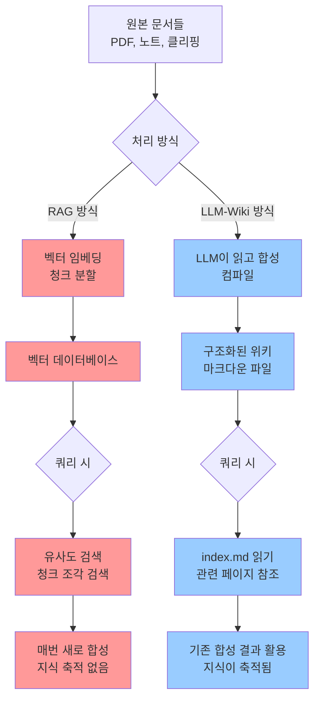
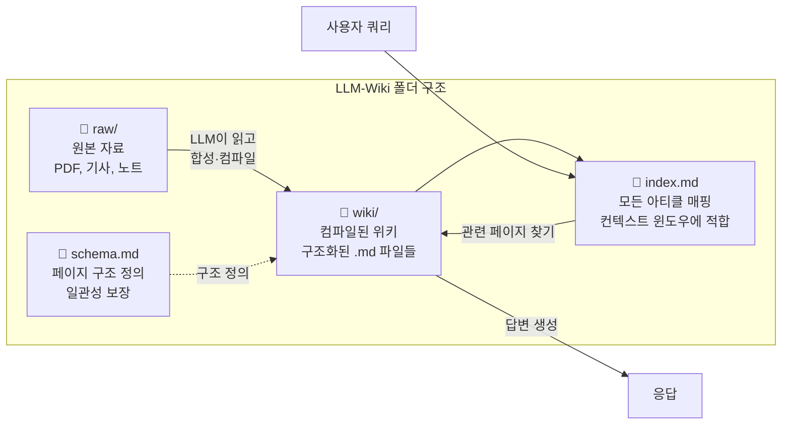
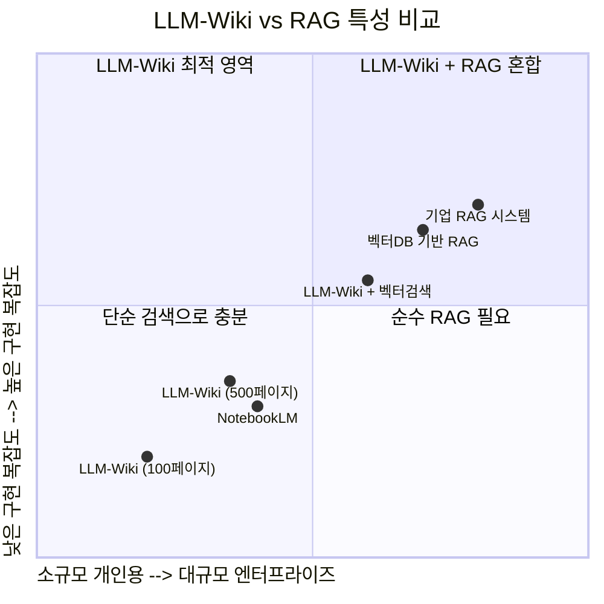
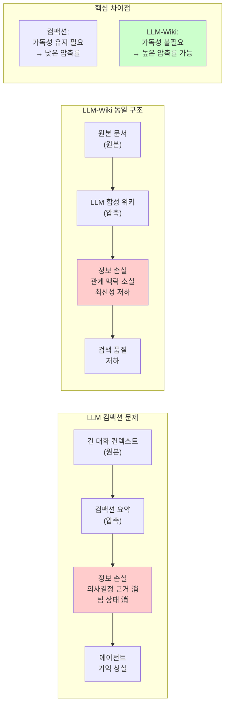
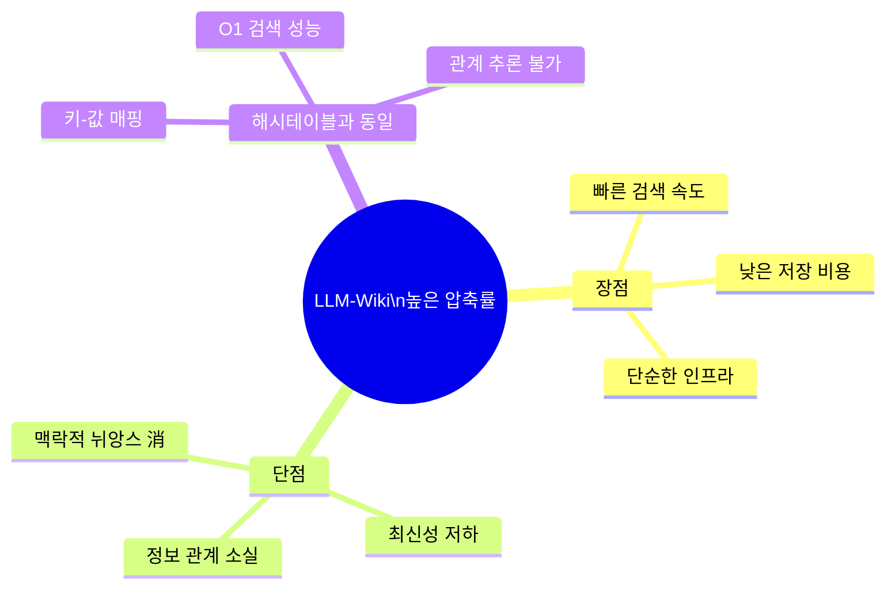
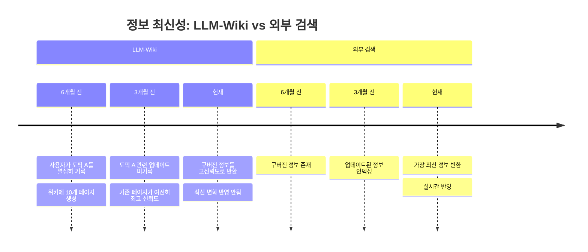
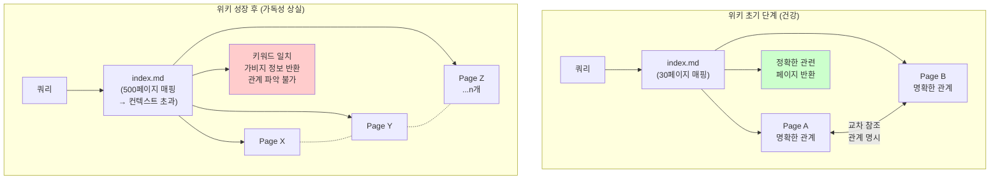
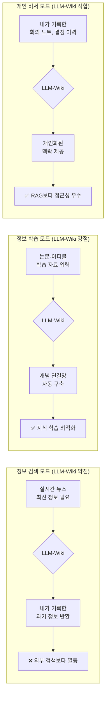
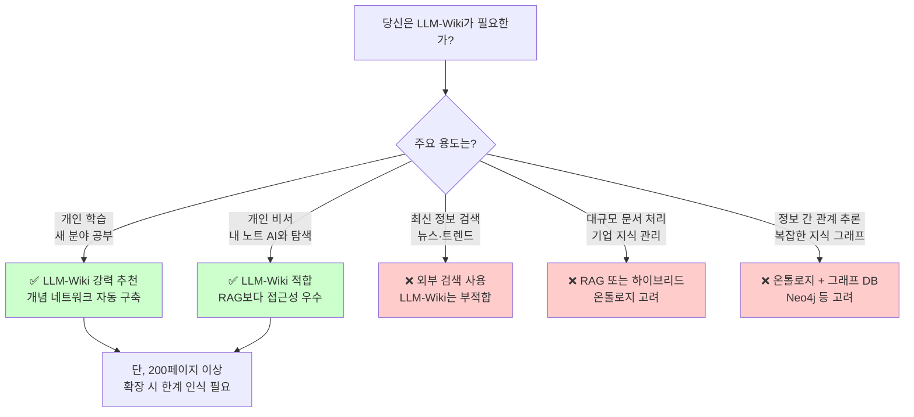

---

## 관련글 

[**LLM-Wiki에 대해서 제 관점을 말씀드릴게요**](https://www.facebook.com/share/p/18ZMB4WYEG/)

---

## 목차

1. [사건의 발단: 17백만 뷰를 기록한 GitHub Gist](#1-사건의-발단)
2. [LLM-Wiki의 핵심 개념: 컴파일 비유](#2-핵심-개념-컴파일-비유)
3. [기술 구조: 3폴더 아키텍처](#3-기술-구조-3폴더-아키텍처)
4. [RAG와의 비교: 무엇이 다른가](#4-rag와의-비교)
5. [LLM 컴팩션과의 유사성: 정보 손실의 구조적 문제](#5-llm-컴팩션과의-유사성)
6. [압축률의 역설: 해시테이블 비유](#6-압축률의-역설)
7. [최신성 문제: 내가 기록한 것의 우선순위](#7-최신성-문제)
8. [정보 관계의 붕괴: 가비지 검색의 위험](#8-정보-관계의-붕괴)
9. [AI 에이전트들의 냉정한 평가](#9-ai-에이전트들의-냉정한-평가)
10. [개인 비서 도구로서의 접근성](#10-개인-비서-도구로서의-접근성)
11. [Wiki 본래의 가치: 정보학습 도구](#11-wiki-본래의-가치)
12. [결론: LLM-Wiki의 적합한 영역과 한계](#12-결론)

---

## 1. 사건의 발단

2026년 4월 3일, 안드레이 카파시(Andrej Karpathy)가 X(구 트위터)에 한 장의 포스트를 올렸다. OpenAI 공동창업자이자 전 테슬라 AI 디렉터, '바이브 코딩(Vibe Coding)'이라는 용어를 처음 만들어낸 인물이 이번엔 개인 지식 관리의 새로운 패러다임을 제안한 것이다. 그의 트윗은 며칠 만에 1,200만 뷰를 넘어섰고, 다음 날 공개된 GitHub Gist는 1,700만 뷰에 5,000개의 스타, 4,282개의 포크를 기록했다.

트윗의 핵심 메시지는 이랬다. "최근 들어 매우 유용하게 쓰고 있는 것이 있다. LLM을 사용해 다양한 연구 주제에 대한 개인 지식 베이스를 구축하는 것이다. 이런 방식으로 최근 내 토큰 처리량의 상당 부분이 코드를 조작하는 것보다 지식을 조작하는 데 들어가고 있다."

인터넷 개발자 커뮤니티는 즉각 'RAG는 죽었다'는 선언을 쏟아냈다. 그러나 두 진영 모두 완전히 옳지는 않았다.

카파시가 공개한 것은 코드도, 제품도 아니었다. 그가 '아이디어 파일(idea file)'이라 부른 형식의 문서였다. LLM 에이전트 시대에는 특정 코드나 앱을 공유하는 것보다 아이디어 자체를 공유하고, 수신자의 에이전트가 그 아이디어를 자신의 요구에 맞게 구체화하는 방식이 더 적합하다는 것이 그의 논리였다.

---

## 2. 핵심 개념: 컴파일 비유

LLM-Wiki의 핵심은 소프트웨어 엔지니어링의 **컴파일(compilation)** 개념을 지식 관리에 적용한 것이다.

카파시가 제안하는 핵심 비유는 이렇다. 전통적인 RAG는 매번 원본 소스를 직접 실행하는 것과 같다. 매 쿼리마다 동일한 PDF를 다시 읽고, 동일한 청크를 분할하고, 동일한 답변을 새로 합성한다. LLM-Wiki 패턴은 이렇게 말한다. 지식을 먼저 컴파일하라. LLM을 사용해 소스들을 읽고, 그 내용을 구조화된 상호 연결된 위키 페이지로 합성하고, 그 컴파일된 아티팩트에 대해 모든 쿼리를 실행하라.

카파시가 직접 사용한 비유는 이렇다. "당신의 파일들은 원재료다. LLM-Wiki는 조리된 음식이다. RAG는 배고플 때마다 음식을 조리하는 것이다." 그리고 이렇게도 말했다. "Obsidian은 IDE이고, LLM은 프로그래머이며, 위키는 코드베이스다."

새로운 문서가 추가될 때마다 LLM은 단순히 인덱싱만 하는 것이 아니다. 해당 문서를 읽고, 핵심 정보를 추출하며, 기존 엔티티 페이지를 생성하거나 업데이트하고, 새 데이터가 기존 주장과 모순되는 지점을 표시하며, 전체 위키에 걸친 교차 참조를 유지한다. 위키는 지속적으로 축적되는 아티팩트다. RAG는 무국적(stateless)이다. 모든 쿼리는 독립적인 사건이다. LLM-Wiki 패턴은 상태를 유지한다. 지식이 축적된다.

---

## 3. 기술 구조: 3폴더 아키텍처

카파시의 원본 Gist는 3폴더 시스템을 설명한다. `raw/` 폴더는 소스 자료를 담고, `wiki/` 폴더는 LLM이 컴파일한 요약 아티클들이 위치하며, `index.md`는 모든 아티클을 매핑하여 단일 컨텍스트 윈도우에 들어갈 수 있도록 구성된다. LLM은 먼저 index.md를 읽고, 이후 필요한 특정 아티클들을 참조한다. 임베딩 단계도, 벡터 검색도, 검색 파이프라인도 없다.

카파시 자신의 언급에 따르면, 그의 위키가 충분히 작아서 index.md 파일만으로도 충분할 수 있다고 했다. 77페이지 기준으로 인덱스는 여전히 작동한다. LLM이 인덱스를 읽고 관련 페이지를 찾아 들어간다. 임베딩도, 벡터 검색도 없다. 그러나 이 상한선이 느껴지기 시작한다. 인덱스가 길어지고 있다.

실제 구현 사례에서 스키마 파일이 전체 시스템에서 가장 중요한 파일임이 확인되었다. 이 파일 없이는 LLM이 일관성 없는 비구조적 결과를 생성한다. 스키마가 있을 때 모든 페이지가 동일한 패턴을 따른다. 스키마가 챗봇을 규율 있는 위키 관리자로 변환하는 것이다.

---

## 4. RAG와의 비교

LLM-Wiki가 등장하면서 가장 뜨거운 논쟁거리가 된 것은 기존의 RAG(Retrieval-Augmented Generation)와의 비교였다.

구조적 차이는 생각보다 단순하다. LLM-Wiki는 구조화된 인덱스를 컨텍스트에 직접 로드한다. LLM이 관련된 모든 것을 미리 읽는다. RAG 지식 베이스는 쿼리 시점에 벡터 저장소에서 청크를 동적으로 검색한다. 차이는 컴파일 타임 대 쿼리 타임의 지식 조립이다. 지능의 차이가 아니다.

전통적 RAG의 핵심 결함은 이것이다. 지식이 결코 축적되지 않는다. 모든 쿼리는 제로에서 시작한다. 시스템은 영구적으로 기억 상실 상태다. 능력은 있지만 성장하지 못한다.

그러나 LLM-Wiki가 RAG보다 무조건 우월한 것은 아니다. 카파시는 약 100개의 아티클, 40만 단어 규모로 위키를 운영한다. 그 규모에서 인덱스 파일은 컨텍스트 윈도우에 들어가고 인덱스 탐색은 디렉토리 목록과 다름없다. 그러나 'RAG와 작별' 프레이밍은 100페이지에서 작동하는 것이 10,000페이지에서도 작동한다는 가정을 암묵적으로 품고 있다. 그것은 사실이 아니다. 위키가 컨텍스트에 들어가지 못할 만큼 커지면, 그 아래에 진짜 검색 기반이 필요하고, 그 기반을 구축하는 가장 저렴한 방법은 아이러니하게도 벡터 임베딩이다.

500페이지 미만의 개인 지식 관리에서는 위키가 더 빠르고, 저렴하며, 더 일관된 답변을 생성한다. RAG는 사전 컴파일이 비현실적인 약 10,000개 이상의 문서에서 우위를 점한다.

---

## 5. LLM 컴팩션과의 유사성

LLM-Wiki가 가진 구조적 문제를 이해하는 데 있어 **LLM 컴팩션(compaction)** 개념과의 비교는 매우 통찰력 있는 시각을 제공한다.

LLM 컴팩션이란, 에이전트가 장시간 작업을 수행하면서 컨텍스트 윈도우가 한계에 도달할 때 발생하는 현상이다. 모든 장시간 실행 AI 에이전트는 결국 컨텍스트 한계에 도달하여 대화를 압축(컴팩트)한다. 기본 컴팩션 요약기는 중요한 정보를 손실시킨다. 의사결정 근거, 팀 상태, 역사적 맥락이 사라진다. 2~3번의 컴팩션 이후 에이전트는 세션이 방금 시작된 것처럼 행동한다.

Chroma의 2025년 7월 연구는 이른바 '컨텍스트 부패(context rot)'를 정량화했다. LLM은 컨텍스트를 균일하게 처리하지 않는다. 성능은 U자형 곡선을 따른다. 컨텍스트 윈도우의 시작과 끝에서 최상의 회상률을 보이고, 중간에서 최악의 회상률을 보인다.

LLM-Wiki가 직면하는 문제는 이 컴팩션 문제와 구조적으로 동일하다. 원본 문서를 LLM이 읽어 위키로 '컴파일'하는 과정 자체가 본질적으로 손실 압축이다. 압축 이전의 원본 뉘앙스, 맥락적 세부사항, 미묘한 관계들이 합성 과정에서 필연적으로 일부 소실된다.

그런데 LLM-Wiki는 LLM 컴팩션과 한 가지 결정적으로 다른 점이 있다. LLM 컴팩션에서 압축된 요약은 여전히 사람이나 LLM이 '읽을 수 있어야' 한다. 즉, 가독성을 어느 정도 유지해야 한다. 그러나 LLM-Wiki의 정보 검색 맵(index.md, 위키 페이지들)은 LLM이 읽는 용도이므로 인간 가독성이 없어도 된다. 이 차이가 압축률을 획기적으로 높일 수 있다는 것이 LLM-Wiki의 독특한 특성이다.

---

## 6. 압축률의 역설

압축률이 높아지면 무엇이 달라지는가? 이 질문의 답은 LLM-Wiki의 핵심 한계를 설명한다.

높은 압축률이 가져다주는 것은 오직 **정보 검색 성능의 향상**이다. 마치 해시 테이블(hash table) 알고리즘이 하는 역할과 정확히 같다.

해시 테이블은 데이터를 키-값 쌍으로 변환하여 저장한다. 특정 키로 값을 조회할 때 . O(1) 의 시간 복잡도를 달성한다. 그러나 해시 테이블에서 데이터들 사이의 **관계**는 사라진다. "A라는 키의 값이 B이고, C라는 키의 값이 D일 때, B와 D 사이에는 어떤 관계가 있는가?"라는 질문은 해시 테이블만으로는 답할 수 없다.

LLM-Wiki가 고압축 상태에 도달하면 각 위키 페이지들은 독립적인 정보 노드가 된다. 검색 요청에 대해 관련 페이지를 빠르게 찾아 반환할 수는 있다. 그러나 페이지들 간의 미묘한 관계, 시간적 변화, 맥락적 연결이 약해진다.

실제 구현 경험에서도 이 한계가 확인된다. 위키 페이지 수가 77개를 넘어가면서 인덱스 파일이 길어지고, LLM이 한 줄짜리 요약이 충분히 구체적이지 않아서 잘못된 페이지를 선택하는 경우가 생긴다.

---

## 7. 최신성 문제: 내가 기록한 것의 우선순위

LLM-Wiki의 또 다른 구조적 한계는 **정보의 최신성(recency)** 문제다.

LLM-Wiki의 기반은 '내가 기록한 것'이다. 내가 기록한 빈도가 높거나, 에이전트가 판단하기에 내가 집중한 주제가 자동으로 우선순위를 갖게 된다. 이는 개인화된 지식 베이스로서는 당연한 특성이지만, 동시에 치명적인 단점이기도 하다.

세계는 끊임없이 변화한다. 새로운 AI 모델이 출시되고, 연구 결과가 발표되며, 기업들의 전략이 바뀐다. 내가 6개월 전에 열심히 기록해둔 내용이 오늘의 현실과 달라졌을 때, LLM-Wiki는 과거의 내 기록을 여전히 높은 신뢰도로 제공할 수 있다.

외부 검색 엔진은 이 문제를 겪지 않는다. 어제 발표된 논문, 오늘 아침에 올라온 블로그 포스트가 검색 결과에 바로 반영된다. LLM-Wiki는 내가 새로운 정보를 직접 입력하지 않는 한 이러한 최신성을 따라갈 수 없다.

이 문제는 LLM 컴팩션에서 중요한 결정이 요약 과정에서 날아가버리는 것과 구조적으로 같다. 컴팩션에서는 '이전 대화에서 무엇을 결정했는가'가 사라지고, LLM-Wiki에서는 '세상이 어떻게 변했는가'가 누락된다. 두 경우 모두 정보가 고착화되고, 그 이후의 변화를 잡아내지 못한다.

---

## 8. 정보 관계의 붕괴: 가비지 검색의 위험

LLM-Wiki에서 가장 심각한 문제는 위키의 정보 검색 맵이 **가독성을 잃을 때** 발생한다.

초기에 위키가 작을 때는 index.md가 모든 페이지를 명확하게 표현한다. 그러나 위키가 성장하면서 페이지가 수백 개, 수천 개에 달하게 되면, 인덱스는 너무 길어져서 LLM의 컨텍스트 윈도우에 들어가지 못하거나, 들어가더라도 효과적으로 처리되기 어렵다.

이 시점에서 정보 검색 맵은 사실상 인간도, LLM도 효과적으로 탐색하기 어려운 구조가 된다. 그 결과 검색 쿼리가 들어왔을 때, 진정으로 관련성 높은 페이지가 아닌, 표면적으로 키워드가 일치하는 페이지들이 반환될 가능성이 높아진다.

더 심각한 것은 **정보 간의 관계 파악이 불가능**해진다는 점이다. 위키에 정보 A와 정보 B가 있다고 하자. 두 정보 사이에 인과관계나 모순이 있더라도, 정보 검색 맵의 가독성이 무너진 상태에서 LLM은 이 관계를 파악하지 못한 채 각각 독립적인 사실로만 반환한다. 이것이 '몹쓸 가비지 정보' 검색이 발생하는 메커니즘이다.

이것은 사실 RAG의 한계이기도 하다. RAG의 벡터 검색도 동일한 문제를 가진다. 청크 단위로 쪼개진 문서들은 서로 간의 맥락적 관계를 잃는다. 비슷한 벡터를 가진 청크가 반환되더라도, 그 청크가 원본 문서에서 어떤 맥락 속에 있었는지, 다른 정보와 어떤 관계를 가지는지는 검색 결과에 반영되지 않는다. 결국 LLM-Wiki의 한계는 RAG가 오랫동안 직면해온 문제의 또 다른 표현이다.

---

## 9. AI 에이전트들의 냉정한 평가

흥미로운 점은, AI 커뮤니티에서 LLM-Wiki가 폭발적인 관심을 받고 있을 때, Claude Code, Gemini, Codex와 같은 AI 에이전트들 자신에게 이 기술에 대한 평가를 요청했을 때 나온 결론이다.

세 에이전트 모두 공통적으로 부정적인 평가를 내렸다. 그 이유는 간결하고 명확했다. "그것은 그냥 개인 노트다. 기술적으로 완성되면 결국 검색(search)이다. 온톨로지나 RAG보다 나은 점이 없다." 딱 하나의 장점을 인정했는데, 그것은 '가시성(visibility)이 좋다'는 것 — 즉, 사람이 직접 눈으로 볼 수 있는 마크다운 파일 형태로 지식이 표현된다는 것이었다.

실제로 기업 엔터프라이즈 관점에서의 평가도 비슷하다. 지역 폴더의 .md 파일들을 Obsidian으로 관리하는 것은 개인 생산성 핵이지, 실행 가능한 엔터프라이즈 아키텍처가 아니라는 것이다.

카파시 자신도 Gist의 맥락에서, 본인의 위키가 '소규모 개인 검색 노트(personal search note)' 성격이라고 명시했다. 실제로 카파시가 공개한 것은 '아이디어 파일'이지 프로덕션 사양이 아니다. 카파시 자신도 이에 대해 명시적으로 언급했다. 그러나 인터넷의 반응은 이것을 프로덕션 시스템으로 부풀렸고, 현실적인 한계들은 정직하게 다뤄져야 한다.

이것은 기술 커뮤니티에서 자주 반복되는 패턴이다. 저명한 인물이 개인 워크플로우를 공유하면, 커뮤니티는 그것을 새로운 패러다임으로 확대 해석하는 경향이 있다. Obsidian에 붙는 AI 앱들은 이미 1년 이상 전부터 꽤 많이 존재했다. 마크다운 기반 노트를 AI로 검색하고 처리하는 아이디어 자체는 새롭지 않다. 카파시가 가져온 것은 아이디어의 세련된 프레이밍과 컴파일 비유라는 강력한 은유였다.

---

## 10. 개인 비서 도구로서의 접근성

그렇다고 LLM-Wiki가 완전히 무용지물인 것은 아니다. 특정 사용자군에게는 RAG보다 훨씬 접근하기 쉬운 대안이다.

RAG는 문서를 청크로 분할하고, 벡터로 임베딩하며, 쿼리 시점에 관련 청크를 검색한다. LLM-Wiki 패턴은 이 모든 것을 생략한다. 전체 지식 베이스를 모델의 컨텍스트 윈도우에 직접 로드한다. RAG는 대형 엔터프라이즈 문서 저장소에 더 적합하다. 직접 컨텍스트 로딩은 모델의 컨텍스트 한계 내에 들어오는 개인 지식 베이스에 더 단순하고 종종 더 정확하다.

인프라 측면에서도 극명한 차이가 있다. LLM-Wiki는 인프라가 전혀 필요 없다. RAG는 벡터 데이터베이스, 임베딩 파이프라인, 검색 레이어가 필요하다.

결국 LLM-Wiki가 RAG보다 접근성이 좋은 이유는, 기존에 사용하던 노트 앱(Obsidian, Notion 등)에서 출발할 수 있기 때문이다. 복잡한 파이프라인을 구축하거나 데이터베이스를 설정하지 않아도 된다. 개인 비서를 원하는 사람, 자신의 노트 자료를 AI와 함께 탐색하고 싶은 사람이라면 LLM-Wiki는 충분히 매력적인 시작점이다.

---

## 11. Wiki 본래의 가치: 정보학습 도구

지금까지의 분석을 종합하면, LLM-Wiki가 진정으로 빛나는 영역이 명확해진다. 그것은 **정보 검색(information retrieval)** 이 아니라 **정보 학습(information learning)** 의 도구로서의 위키다.

원래 위키(Wiki)의 도구 패턴을 생각해보자. 위키피디아를 우리는 어떻게 사용하는가? 모르는 개념을 찾아가서 읽는다. 그 개념과 연결된 다른 개념을 클릭해서 읽는다. 이해의 망이 확장된다. 이것은 검색이 아니라 학습이다.

카파시의 핵심 주장은, LLM의 다음 프론티어가 더 많은 코드를 생성하는 것이 아니라 지식을 관리하는 것에 있다는 것이다. 그의 제안하는 'LLM-Wiki' 패러다임은 LLM이 연중무휴로 지식 베이스를 조직하고, 업데이트하고, 검증하는 지속적인 지식 관리자 역할을 수행하는 것을 상상한다.

이 역할에서 LLM-Wiki는 강점을 발휘한다. 새로운 분야를 공부하기 시작할 때, 논문과 아티클들을 LLM에게 먹여 위키를 구축하면, 개념들이 어떻게 서로 연결되는지 시각화된다. 내가 읽은 자료들이 상호 참조되고 교차 연결된 지식 네트워크로 구조화된다.

실제 구현 경험에서 이 부분은 LLM-Wiki가 RAG를 진정으로 압도하는 지점으로 확인된다. 'PR 검토 기준'에 대한 문서를 입력했을 때, AI는 단 하나의 페이지만 만드는 것이 아니다. 관련된 여러 페이지들을 생성하고 교차 참조를 유지한다. 인간이라면 이 교차 참조를 절대 직접 유지하지 못할 것이다. 그러나 AI는 매번 이것을 해낸다.

---

## 12. 결론

LLM-Wiki에 대한 분석을 종합하면 다음과 같은 그림이 완성된다.

**LLM-Wiki가 잘하는 것:**

첫째, **정보 학습**이다. 새로운 분야의 문서들을 입력하면, LLM이 개념들을 상호 연결된 위키로 컴파일해준다. 인간이 직접 유지하기 불가능한 교차 참조 네트워크를 자동으로 구축한다.

둘째, **개인 비서로서의 접근성**이다. 복잡한 RAG 파이프라인을 구축할 필요 없이, 기존 노트 앱에서 출발하여 AI 기반 개인 지식 관리를 시작할 수 있다.

셋째, **지식의 누적과 컴파운딩**이다. RAG가 매번 제로에서 합성하는 것과 달리, 위키는 지속적으로 누적된다. 한 번 만들어진 교차 참조와 요약은 반영구적으로 재활용된다.

**LLM-Wiki가 못하는 것:**

첫째, **최신성**이다. 내가 기록하지 않은 것은 알 수 없다. 외부 검색과 달리 세계의 실시간 변화를 자동으로 반영하지 못한다.

둘째, **대규모 확장**이다. 100개 안팎의 페이지에서는 탁월하지만, 수천 개를 넘어서면 인덱스가 컨텍스트 한계를 초과하고 결국 벡터 검색이 필요해진다. 아이러니하게도 RAG로 돌아오는 셈이다.

셋째, **정보 간 관계 추론**이다. 고압축 상태에서 위키는 해시테이블처럼 작동한다. 빠른 검색은 가능하지만, 정보들 사이의 미묘한 관계를 추론하는 능력은 저하된다.

결국 LLM-Wiki와 RAG는 동일한 질문의 서로 다른 버전에 대한 답이다. 둘 다 "LLM에게 지식을 어떻게 접근하게 할 것인가?"라는 질문을 다룬다. 하나는 큐레이션된 100개의 아티클을 가진 솔로 연구자에게 답한다. 다른 하나는 수십만 개의 문서를 가진 엔터프라이즈에 답한다.

개인 비서 + 정보 학습 도구로서 LLM-Wiki는 충분히 환영받을 만하다. 그러나 이것을 만능 지식 관리 솔루션으로 기대한다면 실망하게 된다. 유명인이 자신의 개인 워크플로우를 공유했을 때 그것을 과도하게 확대 해석하는 것은 기술 커뮤니티의 고질적인 패턴이다. LLM-Wiki는 강력한 개인 도구이지, RAG를 대체하는 새로운 패러다임이 아니다.

결론적으로, LLM-Wiki의 가장 유용한 영역은 **위키 그 자체**다. 정보 검색보다는 정보 학습, 기업용 시스템보다는 개인 비서, 실시간 정보보다는 내가 소화한 지식의 구조화. 그 범주에서 LLM-Wiki는 탁월하다. 그 범주를 벗어나면, 아쉬움이 많이 남는 도구다.

---

*작성일: 2026년 5월 14일*
