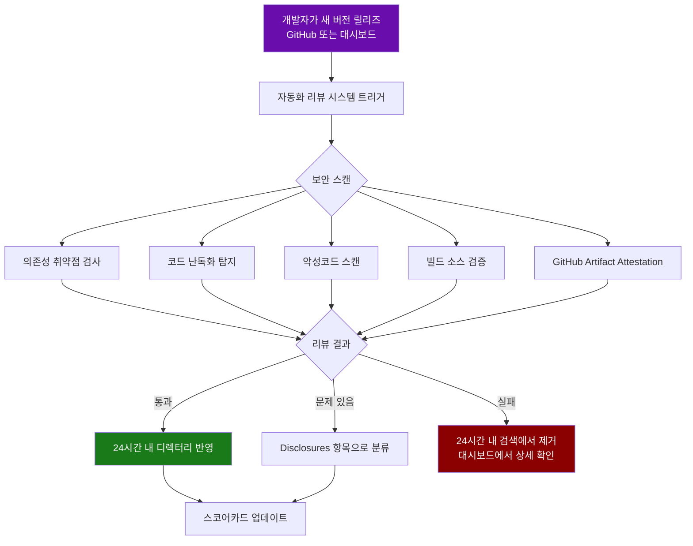
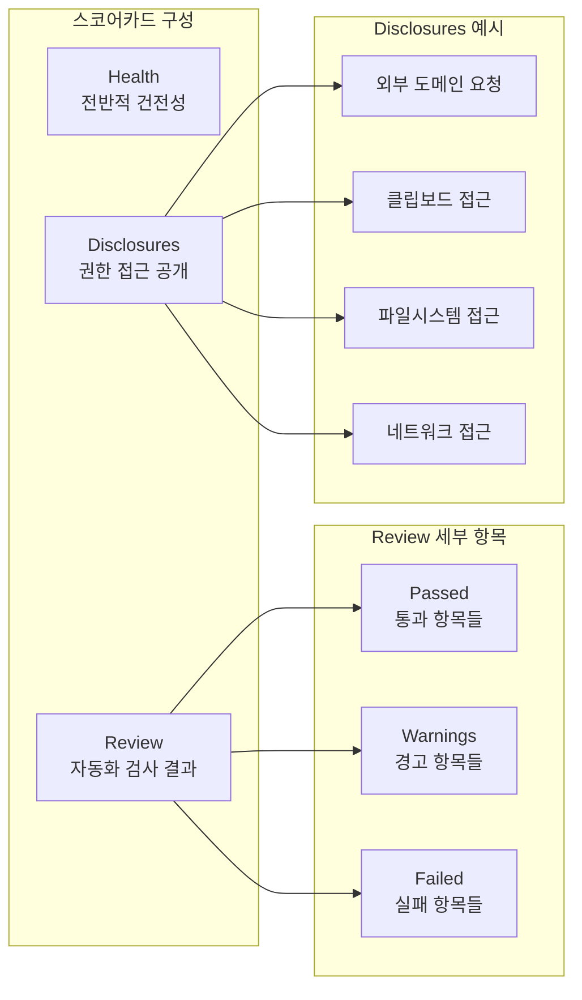
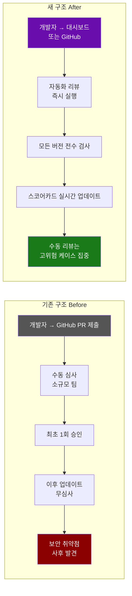

> **출처:** [obsidian.md/blog/future-of-plugins](https://obsidian.md/blog/future-of-plugins/) | 작성자: [kepano](https://x.com/kepano) | 공개일: 2025년 5월 12일


---

## 개요

2026년 5월 12일, Obsidian 팀은 커뮤니티 플러그인 및 테마 생태계를 근본적으로 재설계하는 대규모 발표를 단행했다. 핵심은 **Obsidian Community**라는 새로운 공식 디렉터리 및 개발자 대시보드의 전면 출시다. 이는 단순한 UI 개편이 아니라, 플러그인 생태계의 보안 체계, 개발자 워크플로우, 팀 도구 전반을 아우르는 구조적 전환이다.

Obsidian은 2020년 공개 API를 출시한 이후 커뮤니티 개발자들이 4,000개 이상의 플러그인과 테마를 만들었으며, 누적 다운로드 수는 1억 2천만 건을 돌파했다. 이 규모에 비해 기존의 심사 체계는 GitHub 기반의 수동 리뷰에 의존하고 있었고, 팀의 역량만으로 감당하기 어려운 상황이 되었다. 거기에 코딩 에이전트의 확산으로 플러그인 제출 속도가 더욱 빨라지면서, Obsidian 팀은 새로운 자동화 기반 인프라가 불가피하다는 판단을 내렸다.

---

## 1. Obsidian Community 사이트: 탐색 경험의 전면 개편

새로운 [community.obsidian.md](https://community.obsidian.md)는 기존 GitHub 기반 브라우징 방식을 완전히 대체한다. 이전까지 플러그인 탐색은 앱 내 내장 브라우저나 GitHub 리포지터리를 직접 뒤지는 방식에 의존했지만, 이제는 독립적인 웹 디렉터리에서 수십 개의 카테고리별 필터링, 정렬, 검색이 가능해졌다.

제공되는 카테고리 예시로는 Integrations(외부 서비스 연동), Bases(데이터베이스/테이블), Charts(시각화), AI, Automation, Files, Editing, Commands, Links, Markdown, Navigation, Visualization 등이 있으며, 현재 3,401개의 플러그인과 506개의 테마가 등록되어 있다. 정렬 방식은 이름, 다운로드 수, 인기도, 출시일, 업데이트일 기준으로 선택할 수 있다. 결제 방식에 따라 Free(3,340개), Paid(12개), Optional(49개)로 구분해 필터링할 수 있으며, 공식 Obsidian 플러그인을 별도로 모아볼 수도 있다.

각 플러그인과 테마는 고유한 상세 페이지를 가지며, 개요·업데이트 기록·안전성 스코어카드를 탭으로 확인할 수 있다. 또한 개발자는 자신의 프로필 페이지에 후원 링크, 웹사이트, SNS 계정을 등록해 커뮤니티와의 접점을 넓힐 수 있다.

---

## 2. 개발자 대시보드: 제출 워크플로우의 대폭 간소화

커뮤니티 사이트 안에 통합된 개발자 대시보드는 플러그인/테마 개발자들이 프로젝트를 제출하고, 관리하며, 심사 상태를 추적할 수 있는 일원화된 공간이다. 기존에는 GitHub의 obsidianmd/obsidian-releases 리포지터리에 PR을 올리고, Obsidian 팀의 수동 승인을 기다리는 방식이었다. 이 과정이 수주 또는 수개월씩 지연되는 사례가 빈번했고, 대기 중인 PR이 2,300건 이상 쌓이기도 했다.

새 제출 프로세스는 다음과 같이 대폭 단순해졌다.

```
1. community.obsidian.md에 Obsidian 계정으로 로그인
2. GitHub 계정 연결 및 제출할 리포지터리 선택
3. 대시보드의 안내 단계 완료
4. 제출 즉시 자동화 리뷰 시작 → 보통 수 분 내 결과 확인
5. 통과 시 24시간 이내 앱 디렉터리에 검색 가능
```

기존에 GitHub를 통해 등록된 모든 플러그인과 테마는 새 시스템으로 자동 이전되었다. 개발자는 Obsidian 계정에 GitHub를 연결함으로써 기존 프로젝트의 소유권을 주장(claim)하고, 제목·설명 등을 수정할 수 있다.

기존 GitHub 기반 릴리즈 방식과의 호환성도 유지된다. 즉, GitHub를 통해 새 버전을 배포하더라도 자동으로 리뷰가 트리거되며, 대시보드 사용은 선택 사항이다. 다만 리뷰에서 문제가 발생하면 대시보드를 통해 상세 내역을 확인해야 한다.

---

## 3. 자동화 리뷰 시스템: 보안과 품질의 구조적 전환

이번 발표에서 가장 핵심적인 변화는 자동화 리뷰 시스템의 도입이다. 기존에는 최초 제출 시 한 번만 수동 검토가 이루어졌으며, 이후 버전 업데이트에 대해서는 별도의 리뷰가 없었다. 이는 초기 승인 이후 플러그인에 악성 코드가 추가되더라도 탐지가 어렵다는 구조적 취약점을 내포하고 있었다.

새 자동화 시스템은 **모든 버전 업데이트마다** 전수 검사를 실행한다. 검사 항목은 개발자 정책 준수 여부, 소스코드 베스트 프랙티스, 알려진 취약점 포함 여부, 악성코드 탐지 등이다. 개발자는 대시보드에서 각 프로젝트의 상세 제안 사항, 경고, 실패 플래그를 확인할 수 있다.



수동 리뷰는 완전히 사라지는 것이 아니다. 자동화 시스템이 기본 검증을 처리함으로써, Obsidian 팀은 인기 플러그인, 피처드 플러그인, 커뮤니티 신고가 접수된 플러그인 등 심층 검토가 필요한 케이스에 집중할 수 있게 되었다.

기존에 등록된 모든 플러그인과 테마 역시 새 시스템으로 재검토되었다. 이 과정에서 현행 가이드라인을 충족하지 못하는 오래된 프로젝트들이 다수 발견되었으며, 이들에게는 현재 일시적 예외 처리가 적용되어 있다. 그러나 Obsidian 팀은 이 플러그인들도 결국 새 기준을 통과하지 못하면 공식 디렉터리에서 단계적으로 제거될 것임을 명시했다. 구체적인 기한은 아직 정해지지 않았으며, 커뮤니티 개발자들과 긴밀히 협의하면서 전환 일정을 정할 예정이다.

---

## 4. 플러그인 안전성 스코어카드

각 플러그인의 상세 페이지에는 안전성 스코어카드가 표시된다. 스코어카드는 크게 세 영역으로 구성된다.

**Health(상태)** 지표는 플러그인의 전반적인 유지 관리 및 빌드 건전성을 나타낸다. **Review(리뷰)** 지표는 자동화 검사 통과 여부를 보여주며, Passed/Satisfactory/Failed 등으로 표기된다. 현재 공개된 스코어카드 예시를 보면 다음과 같은 항목들이 포함된다.

- 알려진 취약한 의존성 없음 (No known vulnerable dependencies)
- 코드 난독화 미감지 (No obfuscated code detected)
- 소스 대비 빌드 검증 (Build verified against source)
- `main.js` 릴리즈 에셋의 GitHub Artifact Attestation 검증
- `styles.css` 릴리즈 에셋의 GitHub Artifact Attestation 검증

**Disclosures(공개 항목)** 섹션에는 플러그인이 접근하는 시스템 리소스가 열거된다. 예를 들어 외부 도메인 5개에 요청을 보낼 수 있다거나, 시스템 클립보드를 읽고 쓸 수 있다는 정보가 표시된다. 이 공개 항목은 현재 Satisfactory 등급을 받은 플러그인에서도 이슈로 카운트된다. 즉, 반드시 버그나 악성 행위가 아닌, 사용자가 인지해야 할 권한 접근 정보를 투명하게 알리는 목적이다.



향후 스코어카드는 개인정보 라벨, Artifact Attestation, 수동 리뷰 결과, 앱 기능 채택 현황 등을 추가로 반영하며 지속적으로 발전할 예정이다. Obsidian 팀은 스코어카드가 새로 도입된 만큼 오탐(false positive)이나 미탐(false negative)이 존재할 수 있음을 인정하며, 오류 발견 시 Discord의 `#plugin-dev` 채널을 통해 신고할 수 있다.

---

## 5. 앞으로 추가될 안전성 강화 기능

현재 출시된 기능 외에, Obsidian 팀이 향후 몇 달 내 도입을 예고한 기능들은 다음과 같다.

**Disclosures(공개 선언)**: 플러그인이 어떤 시스템 리소스에 접근하는지를 설치 전에 사용자가 확인할 수 있게 된다. 네트워크, 파일시스템, 클립보드 등 주요 접근 권한이 명시적으로 선언되어야 한다.

**Verified Authors(인증 개발자)**: 추가 검증 절차를 거쳐 신뢰성이 확인된 개발자에게는 별도의 인증 라벨이 부여된다. 이는 플러그인의 출처 신뢰도를 높이는 데 기여할 것이다.

커뮤니티 구성원들도 보안 이슈를 발견하면 Obsidian 팀에 직접 신고할 수 있는 채널이 운영된다.

---

## 6. 팀(Teams) 기능 강화

기업 및 조직 단위로 Obsidian을 사용하는 팀들을 위한 기능도 확대된다. 기존에도 팀 배포 시 플러그인 안전 제어를 설정할 수 있었지만, 앞으로는 다음 두 가지가 추가된다.

첫째, **플러그인 허용 목록 관리**: 조직 내에서 사용 가능한 커뮤니티 플러그인을 관리자가 통제할 수 있는 기능이 강화된다. 둘째, **프라이빗 플러그인 배포**: 외부에 공개하지 않고 내부 팀원들에게만 플러그인을 배포할 수 있는 기능이 도입될 예정이다.

또한 공식 Obsidian 플러그인을 출시하는 팀은 Community 디렉터리에서 **Official 뱃지**를 신청할 수 있다. Official 라벨은 Obsidian 직원만이 부여할 수 있으며, 해당 조건에 부합하는 팀은 Discord를 통해 신청하면 된다.

---

## 7. 결제 방식 라벨링 정책

Obsidian Community는 결제 기능이 내장된 마켓플레이스가 아니다. 그러나 플러그인의 수익화 방식을 사용자에게 투명하게 알리기 위해 세 가지 라벨로 분류하도록 의무화했다.

**Free**: 어떠한 형태의 결제도 없으며, 유료 서비스와 연동되지 않는 플러그인. 후원 링크나 기부 링크는 Free로 분류 가능하다.

**Optional payments**: 추가 기능을 위해 선택적으로 결제하거나, 유료 서비스/API와 연동되는 플러그인. 해당 서비스에 무료 플랜이 있더라도 이 카테고리에 포함된다.

**Paid**: 주요 기능을 사용하기 위해 반드시 결제가 필요한 플러그인. 무료 체험 제공 여부와 무관하다.

이 라벨은 개발자가 직접 수익을 거두는지 여부가 아니라, **사용자가 실제로 지불해야 할 가능성**을 기준으로 분류한다.

---

## 8. 전체 구조 변화 요약



---

## 9. Obsidian CLI와의 연계

Obsidian은 이번 발표와 함께 [Obsidian CLI](https://obsidian.md/cli)의 존재를 함께 언급했다. CLI 도구는 플러그인 개발을 더 쉽게 만들기 위한 공식 지원 도구로, 코딩 에이전트를 활용한 플러그인 자동 생성까지 용이하게 만드는 방향으로 발전하고 있다. Obsidian 팀이 AI 기반 플러그인 제작 가속화를 명시적으로 언급하며 자동화 리뷰의 필요성을 강조한 것은, 이 CLI와의 결합이 향후 생태계 규모를 더욱 확대시킬 것임을 시사한다.

또한 개발자들은 릴리즈 없이도 자동화 리뷰를 사전에 실행해볼 수 있다. 두 가지 방법이 제공된다.

- 공식 [eslint 플러그인](https://github.com/obsidianmd/eslint-plugin)을 사용해 로컬 환경에서 개발자 가이드라인 준수 여부를 사전 점검
- 개발자 대시보드에서 특정 브랜치, 태그, 커밋을 대상으로 프리뷰 스캔 실행

---

## 10. 클로즈드 소스 플러그인 정책 변경

기존에는 일부 클로즈드 소스(비공개 소스코드) 플러그인이 디렉터리에 등록되어 있었다. 새 정책 하에서는 **신규 클로즈드 소스 플러그인의 디렉터리 등록이 불가**하다. 기존 클로즈드 소스 플러그인은 당분간 계속 제공되지만, 향후 새로운 리뷰 시스템을 어떻게 적용할지는 추가 검토 중이다.

---

## 영향 받는 이해관계자별 정리

| 구분 | 주요 변화 |
|------|-----------|
| **일반 사용자** | 커뮤니티 사이트에서 카테고리·결제 방식·안전성 기준으로 필터링 가능. 스코어카드로 플러그인 신뢰도 확인. 얼리액세스 플러그인을 수동 설치할 필요 감소. |
| **플러그인 개발자** | GitHub PR 대기 제거, 수 분 내 리뷰 결과 확인. 모든 버전 자동 스캔. 대시보드에서 프로젝트 상태 관리. eslint로 사전 검증 가능. |
| **테마 개발자** | 플러그인과 동일한 자동화 리뷰 적용. 클로즈드 소스 테마는 기존 것만 유지. |
| **기업/팀** | 관리자 통제 플러그인 허용 목록, 프라이빗 플러그인 배포 예정. Official 뱃지 신청 가능. |
| **Obsidian 팀** | 수동 리뷰 부담 감소. 고위험 플러그인에 집중. 2,300건 밀린 제출 건 처리 완료. |

---

## 마치며

이번 Obsidian Community 출시는 단순한 웹사이트 리뉴얼이 아니다. 코딩 에이전트의 확산으로 플러그인 생성 속도가 급격히 빨라지는 환경에서, 수동 심사 중심의 기존 구조는 더 이상 지속 가능하지 않다는 현실을 정면으로 인정한 결과다. 자동화 리뷰를 기반으로 모든 버전을 전수 검사하고, 스코어카드를 통해 보안 정보를 투명하게 공개하며, 개발자에게는 빠르고 예측 가능한 피드백을 제공하는 방향으로의 전환은 생태계 전반의 신뢰성과 확장성을 동시에 높이는 전략이다.

아직 완성된 시스템은 아니다. 스코어카드 오탐 가능성, 기존 플러그인 전환 기한 미정, 다중 관리자 지원 부재 등 해결해야 할 과제가 남아 있다. 그러나 방향성은 명확하다. Obsidian은 단순한 노트 앱을 넘어, 신뢰 가능한 오픈 플러그인 생태계를 운영하는 플랫폼으로 진화하고 있다.

---

*작성일: 2026년 5월 14일*
