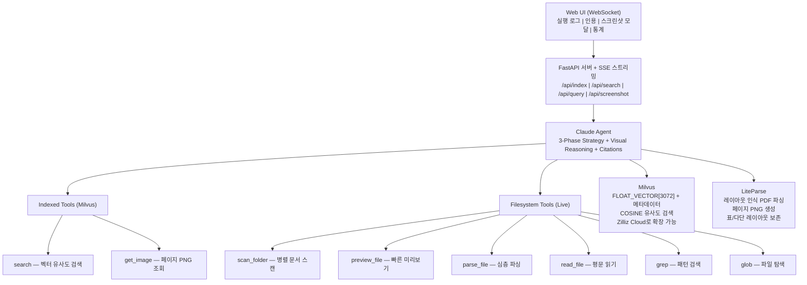
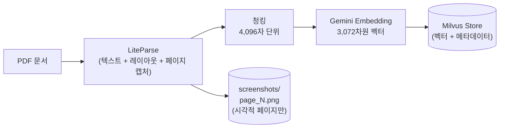
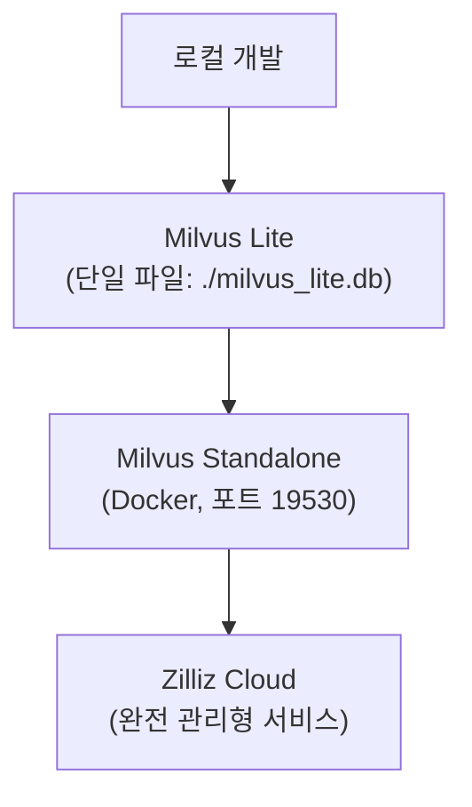
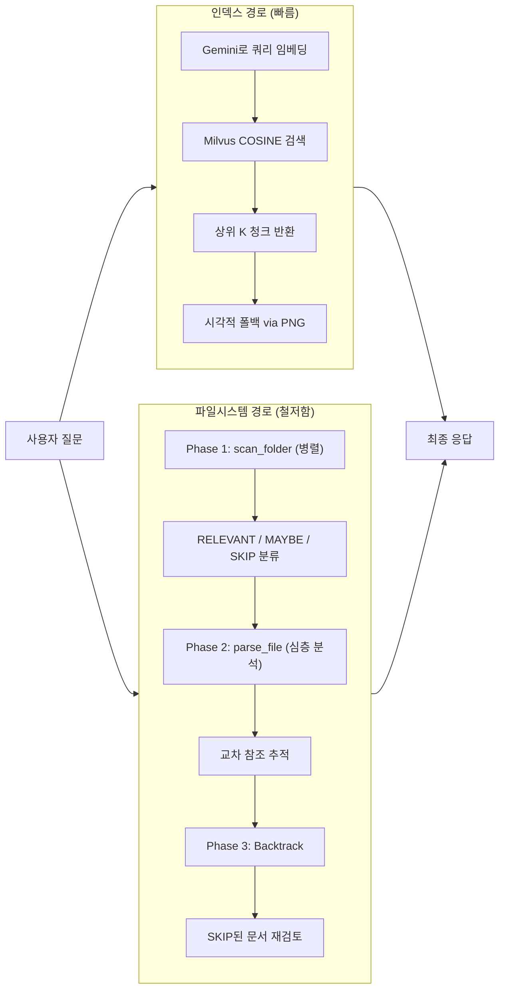

> **출처:** ["RAG is Dead. Again. (Claude Agent SDK + Memory)"](https://www.youtube.com/watch?v=2VL3WtNMm90) — Prompt Engineering (YouTube, 2026년 5월 14일)  
> **GitHub:** https://github.com/PromtEngineer/ParseRAG  
> **핵심 기술:** LiteParse · Milvus · Claude Agent SDK · FastAPI

---

## 목차

1. [배경 및 문제 의식](#1-배경-및-문제-의식)
2. [ParseRAG란 무엇인가](#2-parserag란-무엇인가)
3. [시스템 전체 아키텍처](#3-시스템-전체-아키텍처)
4. [문서 처리의 핵심: LiteParse](#4-문서-처리의-핵심-liteparse)
5. [문서 수집 및 인덱싱 파이프라인](#5-문서-수집-및-인덱싱-파이프라인)
6. [벡터 데이터베이스: Milvus 심층 분석](#6-벡터-데이터베이스-milvus-심층-분석)
7. [에이전트의 8가지 도구](#7-에이전트의-8가지-도구)
8. [이중 검색 전략: 인덱스 경로 vs 파일시스템 경로](#8-이중-검색-전략-인덱스-경로-vs-파일시스템-경로)
9. [3단계 탐색 전략 (3-Phase Strategy)](#9-3단계-탐색-전략-3-phase-strategy)
10. [쿼리-응답 전체 흐름 (RAG Flow)](#10-쿼리-응답-전체-흐름-rag-flow)
11. [Tool Annotation과 병렬화 최적화](#11-tool-annotation과-병렬화-최적화)
12. [실제 사용 예시: 의료 문서 QA](#12-실제-사용-예시-의료-문서-qa)
13. [설치 및 실행 방법](#13-설치-및-실행-방법)
14. [기존 RAG 방식과의 비교](#14-기존-rag-방식과의-비교)
15. [확장 가능성 및 응용](#15-확장-가능성-및-응용)
16. [결론](#16-결론)

---

## 1. 배경 및 문제 의식

전통적인 RAG(Retrieval-Augmented Generation) 시스템은 문서를 일정한 크기의 청크(chunk)로 분할하고, 각 청크를 벡터로 변환해 데이터베이스에 저장한 뒤, 사용자 질문과 가장 유사한 청크를 검색해 LLM에 전달하는 방식이다. 이 방식은 단순하고 빠르지만 실제 복잡한 문서를 다룰 때 세 가지 구조적 한계가 드러난다.

첫째, **청크가 컨텍스트를 잃는다.** 문서를 잘라내면 섹션 간의 관계, 표와 본문 간의 연결, 전후 맥락이 사라진다. LLM이 청크를 받았을 때 "이 표가 어느 섹션에 속하는가", "이 수치가 앞에서 언급한 조건과 어떤 관계인가"를 알기 어렵다.

둘째, **교차 참조(cross-reference)가 보이지 않는다.** 문서 안에 "부록 B 참조", "3장의 표 1을 참고하라"는 식의 내부 참조가 있어도, 벡터 임베딩은 이 논리적 연결을 전혀 인식하지 못한다. 유사도 기반 검색은 의미상 유사한 텍스트를 찾지만, 논리적으로 연결된 정보를 따라가지는 못한다.

셋째, **유사도 ≠ 관련성이다.** 코사인 유사도가 높은 청크가 반드시 정답을 담고 있지는 않다. 질문의 키워드와 표현이 비슷하더라도 실질적인 정보는 전혀 다른 구조의 문서에 있을 수 있다.

이러한 문제를 해결하기 위해 "Prompt Engineering" 채널의 제작자는 **Agentic File Search** 오픈소스 프로젝트에서 얻은 아이디어를 확장해, 벡터 검색과 파일시스템 직접 탐색을 결합한 **이중 메모리 시스템**을 구축했다. 이것이 바로 **ParseRAG**다.

---

## 2. ParseRAG란 무엇인가

ParseRAG는 **LiteParse + Milvus + Claude Agent SDK**를 조합한 Agentic PDF 질의응답 시스템이다. 단순한 임베딩 검색 도구가 아니라, 에이전트가 마치 사람처럼 문서 폴더를 탐색하고, 관련 파일을 특정하며, 필요할 경우 전체 문서를 읽고 교차 검증하는 방식으로 동작한다.

시스템의 주요 특징은 다음과 같다.

- **이중 메모리 구조:** 사전 인덱싱된 벡터 검색(Milvus)과 실시간 파일시스템 탐색을 동시에 활용한다.
- **레이아웃 인식 파싱:** LiteParse가 표, 다단 레이아웃, 이미지가 혼재된 복잡한 PDF를 정확하게 처리한다.
- **3단계 탐색 전략:** 병렬 스캔 → 심층 분석 → 역추적(backtrack)의 순서로 빠짐없이 검색한다.
- **시각적 추론 지원:** 시각적 콘텐츠가 포함된 페이지는 별도의 PNG로 저장되어 멀티모달 추론에 활용된다.
- **인용 기반 응답:** 모든 응답은 출처 문서와 페이지 정보를 포함한다.

---

## 3. 시스템 전체 아키텍처

전체 시스템은 웹 UI, API 서버, Claude 에이전트, 그리고 두 개의 외부 시스템(Milvus와 LiteParse)으로 구성된다.



사용자가 웹 브라우저를 통해 질문을 입력하면, WebSocket을 통해 FastAPI 서버로 전달된다. 서버는 SSE(Server-Sent Events) 스트리밍 방식으로 에이전트의 실시간 실행 로그를 클라이언트에 전송한다. Claude 에이전트는 두 종류의 도구 세트를 활용해 검색을 수행하고, 최종적으로 출처가 명시된 응답을 반환한다.

---

## 4. 문서 처리의 핵심: LiteParse

LiteParse는 LlamaIndex가 공개한 오픈소스(Apache 2.0) 로컬 문서 파서로, 2026년 3월에 공개된 이후 4,300개 이상의 GitHub 스타를 기록했다. ParseRAG에서 문서 파싱의 핵심 역할을 담당한다.

### LiteParse가 특별한 이유

기존의 PDF 파싱 방식에는 두 가지 극단이 있었다. `pypdf`나 `pdfplumber` 같은 라이브러리는 처리 속도는 빠르지만 표 레이아웃을 뭉개고 공간적 맥락을 잃는다. 반대로 클라우드 기반 VLM 서비스들은 정확도는 높지만 API 비용이 발생하고, 네트워크 지연이 생기며, 민감한 문서를 외부로 전송해야 하는 문제가 있다. LiteParse는 이 중간 지점을 채운다.

LiteParse의 핵심 기술은 **공간 그리드 투영(Spatial Grid Projection)** 이다. PDF 파일은 텍스트를 읽기 순서대로 저장하지 않고, 단순히 각 글자의 좌표와 서체 정보를 저장한다. LiteParse는 페이지 내 반복적으로 나타나는 X 좌표를 기준으로 정렬 기준점을 추출하고, 모든 텍스트 요소를 해당 기준점에 스냅시켜 모노스페이스 문자 그리드에 투영한다. 결과적으로 원본 레이아웃의 들여쓰기와 공백이 그대로 보존된다. LLM은 이 공간 구조를 인간이 문서를 읽듯 자연스럽게 해석한다.

표 처리도 독특하다. 일반 파서들이 표의 셀과 행을 재구성하려다 오히려 내용을 뒤섞는 반면, LiteParse는 텍스트의 수평·수직 정렬을 그대로 유지한다. LLM이 직접 이 공간적 구조를 해석하도록 두는 방식이다.

### ParseRAG에서 LiteParse의 역할

ParseRAG는 LiteParse를 두 가지 방식으로 사용한다.

첫 번째는 **텍스트 추출**이다. 문서의 모든 텍스트를 레이아웃을 보존한 채로 추출하며, 이 텍스트는 청킹과 임베딩을 거쳐 Milvus에 저장된다.

두 번째는 **선택적 페이지 캡처**다. LiteParse는 파싱 중에 특정 페이지에 이미지나 그래프가 포함되어 있음을 감지하면, 해당 페이지만 PNG 파일로 저장한다. 이렇게 하면 시각적 콘텐츠가 없는 페이지까지 모두 캡처하는 낭비 없이, 실제로 멀티모달 분석이 필요한 페이지만 효율적으로 관리할 수 있다. 에이전트는 나중에 `get_image` 도구를 통해 이 PNG들을 불러와 시각적 추론에 활용한다.

---

## 5. 문서 수집 및 인덱싱 파이프라인

PDF 문서가 Milvus 벡터 스토어에 저장되기까지의 과정은 다음과 같다.



각 단계를 자세히 살펴보자.

**1단계 — LiteParse 파싱:** PDF가 입력되면 LiteParse가 텍스트와 레이아웃 정보를 추출한다. 이 과정에서 이미지나 그래프가 포함된 페이지는 `screenshots/page_N.png` 형태로 별도 저장된다.

**2단계 — 청킹:** 추출된 텍스트는 4,096자 단위로 잘린다. 이 크기는 텍스트 기반 검색에 충분한 컨텍스트를 유지하면서도 임베딩 연산 비용을 적절하게 관리하는 균형점이다.

**3단계 — Gemini 임베딩:** 각 청크는 Google의 Gemini 임베딩 모델(`gemini-embedding-001`)을 통해 3,072차원 고밀도 벡터로 변환된다. 3,072차원은 의미론적 뉘앙스를 세밀하게 포착할 수 있는 고차원 공간이다.

**4단계 — Milvus 저장:** 벡터와 함께 다음 메타데이터가 Milvus의 `parserag` 컬렉션에 저장된다.

| 필드 | 타입 | 설명 |
|------|------|------|
| id | INT64 (PK, auto) | 자동 증가 기본키 |
| source_file | VARCHAR[1024] | 원본 문서 경로 |
| text | VARCHAR[65535] | 청크 텍스트 |
| vector | FLOAT_VECTOR[3072] | Gemini 임베딩 벡터 |
| image_path | VARCHAR[1024] | 연관 PNG 파일 경로 |
| page_num | INT64 | 페이지 번호 |

인덱스는 FLAT 방식에 COSINE 메트릭을 사용하며, 양자화 없이 완전한 정밀도로 저장된다.

---

## 6. 벡터 데이터베이스: Milvus 심층 분석

Milvus는 Apache 2.0 라이선스로 제공되는 오픈소스 벡터 데이터베이스로, GitHub에서 44,000개 이상의 스타를 보유하고 있다.

### 왜 Milvus인가?

Milvus는 CPU와 GPU 가속을 모두 지원하며, 다음과 같은 세 가지 배포 옵션을 통해 개발 단계부터 프로덕션까지 동일한 API로 확장할 수 있다.



코드 변경 없이 클라이언트 초기화 부분만 바꾸면 된다.

```python
# 로컬 개발
client = MilvusClient("./milvus_lite.db")

# 프로덕션
client = MilvusClient(
    uri="https://...",
    token="..."
)
```

Milvus Lite는 단일 파일로 동작하므로 설치 없이 바로 시작할 수 있다. 프로덕션 환경에서는 Kubernetes 네이티브 분산 아키텍처를 통해 수평 확장이 가능하며, 수십억 개의 벡터에 대해 수만 건의 검색 쿼리를 처리할 수 있다. Zilliz Cloud는 이를 완전 관리형 서비스로 제공한다.

---

## 7. 에이전트의 8가지 도구

Claude 에이전트는 총 8개의 도구를 갖추고 있으며, 크게 두 범주로 나뉜다.

### 범주 1: 인덱스 기반 도구 (Milvus)

| 도구 | 기능 |
|------|------|
| `search` | 쿼리를 Gemini로 임베딩한 뒤 Milvus에서 COSINE 유사도 상위 K개 청크 반환 |
| `get_image` | 특정 청크와 연관된 페이지의 PNG 파일 반환 (시각적 추론용) |

### 범주 2: 파일시스템 기반 도구 (실시간)

| 도구 | 기능 |
|------|------|
| `scan_folder` | 폴더 내 모든 문서를 병렬로 스캔하고 RELEVANT / MAYBE / SKIP으로 분류 |
| `preview_file` | 문서의 앞부분만 빠르게 미리 보기 (전체 파싱 전 판단용) |
| `parse_file` | LiteParse를 사용해 레이아웃 보존 심층 파싱 |
| `read_file` | 문서를 평문(plain text)으로 전체 읽기 |
| `grep` | 문서 내 특정 패턴이나 키워드 검색 |
| `glob` | 파일명 패턴 기반 파일 탐색 |

이 도구들은 Claude Code가 코드베이스를 탐색할 때 사용하는 도구 세트와 개념적으로 동일하다. 에이전트는 코드를 검색하듯 문서를 탐색한다.

---

## 8. 이중 검색 전략: 인덱스 경로 vs 파일시스템 경로

ParseRAG의 가장 핵심적인 설계 결정은 두 가지 검색 경로를 동시에 운용한다는 점이다.



두 경로는 서로 보완한다. 인덱스 경로는 빠른 응답이 필요할 때, 특정 사실 질문에, 이미 인덱싱된 문서 컬렉션에 적합하다. 파일시스템 경로는 인덱싱되지 않은 문서 세트, 문서 간 교차 분석, 탐색적 연구에 적합하다.

실제로는 두 경로가 협력한다. 인덱스 검색으로 관련 청크를 빠르게 찾아 검색 공간을 좁힌 다음, 그 청크가 속한 원본 문서를 파일시스템 도구로 읽어 더 깊이 분석한다. 이 방식은 파일시스템 도구만 사용했을 때의 높은 비용 문제를 해결하면서도 높은 재현율을 유지한다.

---

## 9. 3단계 탐색 전략 (3-Phase Strategy)

에이전트가 복잡한 질문을 처리할 때 따르는 전략은 세 단계로 구성된다.

**Phase 1 — 병렬 스캔(Parallel Scan):** 에이전트는 폴더 내 모든 문서를 병렬로 스캔한다. 각 문서는 질문과의 관련성에 따라 RELEVANT(반드시 읽어야 함), MAYBE(읽을 가치 있음), SKIP(관련 없음)으로 분류된다. 이 단계는 전체 검색 공간을 빠르게 파악하기 위한 것이다.

**Phase 2 — 심층 분석(Deep Dive):** RELEVANT 또는 MAYBE로 분류된 문서들을 `parse_file`로 상세히 파싱하고 읽는다. 에이전트는 교차 참조를 주의깊게 추적하며, 한 문서가 다른 문서를 언급하면 그 문서도 분석 대상에 포함시킨다.

**Phase 3 — 역추적(Backtrack):** Phase 2에서 놓쳤거나 SKIP으로 분류했지만 실제로 관련이 있을 수 있는 문서를 재검토한다. 에이전트가 초기 검색에서 누락된 출처가 있다고 판단하면 자동으로 이 단계가 실행된다. 이 자기수정 능력이 ParseRAG를 일반 RAG와 구별하는 핵심 특성이다.

---

## 10. 쿼리-응답 전체 흐름 (RAG Flow)


사용자 질문이 입력되면 Gemini 임베딩 모델이 3,072차원 벡터를 생성하고, Milvus는 코사인 유사도를 기준으로 가장 관련성 높은 청크들을 반환한다. Claude 에이전트는 이 청크들을 검토하고, 필요하다면 원본 문서를 직접 읽거나 추가 검색을 수행하며, 최종적으로 출처가 명시된 응답을 생성한다.

---

## 11. Tool Annotation과 병렬화 최적화

Claude Agent SDK는 도구에 주석(annotation)을 붙여 병렬 실행 가능 여부를 지정하는 기능을 제공한다. 이는 성능 최적화에 핵심적인 역할을 한다.

```javascript
// 주석 없이 정의된 도구 — 기본적으로 병렬화 불가
tool("search_docs",
    "Search internal docs",
    { query: z.string() },
    async ({ query }) => ({ ... }),
)

// readOnlyHint 주석 추가 — 병렬화 안전
tool("search_docs",
    "Search internal docs",
    { query: z.string() },
    async ({ query }) => ({ ... }),
    { annotations: { readOnlyHint: true } }
)
```

`readOnlyHint: true`를 지정하면 에이전트가 이 도구를 다른 읽기 전용 도구와 동시에 실행할 수 있다. `grep`, `read_file` 같은 도구는 문서를 수정하지 않으므로 병렬 실행이 안전하다. 반면 상태를 변경할 수 있는 도구는 직렬로 실행된다.

이 최적화로 에이전트가 여러 문서를 동시에 스캔하고 읽는 작업의 총 실행 시간이 크게 단축된다.

---

## 12. 실제 사용 예시: 의료 문서 QA

영상에서는 FDA, ADA(미국 당뇨병 협회) 등 여러 기관에서 수집한 16개의 의료 문서를 대상으로 시연이 이루어졌다. 각 문서는 자유 흐름 텍스트, 표, 이미지가 혼재된 복잡한 레이아웃을 갖고 있었다.

**예시 1 — 단순 사실 질문:** "Warfarin의 부작용은 무엇인가?"처럼 특정 의약품의 부작용을 묻는 질문은 의미론적 유사도 검색으로 충분히 해결된다. 에이전트는 쿼리를 분석하고, 관련 표가 포함된 청크를 찾아 정확한 정보를 반환했다.

**예시 2 — 비교 분석 질문:** "FDA 당뇨병 가이드와 ADA 당뇨병 가이드의 차이점을 비교하라." 이런 질문은 일반 RAG 시스템에서는 쿼리 분해(query decomposition) 없이는 처리하기 어렵다. ParseRAG에서 에이전트는 폴더를 스캔해 두 가이드를 특정하고, 각각을 읽은 뒤 추론 루프를 통해 차이점을 도출했다.

**예시 3 — 개방형 질문:** "혈압약을 복용하는 환자가 주의해야 할 음식 상호작용은?" 에이전트는 여러 번의 검색 패스를 수행했으며, 각 패스에서 이전 검색에서 수집된 컨텍스트를 기반으로 쿼리를 변형해 더 넓은 범위의 정보를 포착했다.

**예시 4 — 전체 탐색 질문:** "혈액 희석제와 관련된 문서를 찾아라. 초기 검색 결과에 없는 추가 출처도 폴더에서 찾아라." 에이전트는 먼저 벡터 검색을 수행하고, 이후 파일시스템 도구를 사용해 16개 문서 전체를 순서대로 파싱하며 누락된 정보를 발굴했다. 이 작업은 약 16단계를 거쳤지만 모든 관련 문서를 빠짐없이 다뤘다.

---

## 13. 설치 및 실행 방법

### 사전 준비

- Python 3.12
- Google API 키 (Gemini 임베딩)
- Anthropic API 키 (Claude 에이전트)

### 1단계: 의존성 설치

```bash
python3.12 -m venv venv
source venv/bin/activate
pip install -r requirements.txt
pip install fastapi uvicorn
pip install 'setuptools<81'  # milvus-lite 호환성
```

### 2단계: 환경 변수 설정

```bash
export GOOGLE_API_KEY="your-gemini-api-key"
export ANTHROPIC_API_KEY="your-anthropic-api-key"

# 선택적 설정
export CLAUDE_MODEL="claude-sonnet-4-20250514"
export EMBEDDING_MODEL="gemini-embedding-001"
export EMBEDDING_DIM="3072"
export MILVUS_DB_PATH="./milvus_lite.db"
```

### 3단계: 문서 인덱싱

```bash
# 단일 PDF
python main.py process data/Medication_Side_Effect_Flyer.pdf

# 폴더 전체
python main.py index data/documents
```

### 4단계: CLI로 질문하기

```bash
python main.py agent "What are the side effects of Warfarin?"
python main.py agent "Which medications require regular blood monitoring?"
```

### 5단계: 웹 UI 실행

```bash
uvicorn app:app --reload --port 8000
# http://localhost:8000 접속
```

---

## 14. 기존 RAG 방식과의 비교

| 구분 | 전통적 RAG | ParseRAG |
|------|-----------|----------|
| 검색 방식 | 벡터 유사도만 사용 | 벡터 + 파일시스템 이중 경로 |
| 문서 파싱 | pypdf, pdfplumber 등 | LiteParse (공간 그리드 투영) |
| 표 처리 | 레이아웃 손상 빈번 | 레이아웃 보존 |
| 시각적 콘텐츠 | 무시 | PNG 저장 후 멀티모달 추론 |
| 교차 참조 | 추적 불가 | 에이전트가 논리적 연결 추적 |
| 누락 문서 처리 | 없음 | 3단계 역추적 자동 실행 |
| 확장성 | 청크 품질에 한정 | Milvus 수평 확장 가능 |
| 인덱싱 없는 문서 | 처리 불가 | 파일시스템 경로로 직접 탐색 |

---

## 15. 확장 가능성 및 응용

ParseRAG는 현재 Claude Agent SDK 위에서 동작하지만, 동일한 설계 원칙은 다른 환경에도 적용 가능하다.

**Claude Code 연동:** 시스템 전체를 MCP(Model Context Protocol) 서버로 래핑하면 Claude Code에서 직접 사용할 수 있다. 프로젝트 문서, 기술 사양서, 법적 문서 등에 대한 에이전틱 질의응답이 Claude Code의 코드 작업과 결합된다.

**에이전트 영구 메모리:** 이 시스템은 단순한 문서 검색 도구를 넘어 에이전트의 장기 메모리 시스템으로 활용될 수 있다. 과거 대화, 결정 내역, 학습 내용을 Milvus에 저장하면 에이전트는 세션 간에 컨텍스트를 유지할 수 있다.

**Zilliz Cloud 확장:** 로컬에서 `./milvus_lite.db`로 시작해 프로덕션에서는 코드 변경 없이 Zilliz Cloud의 완전 관리형 서비스로 전환할 수 있다. 수십억 개의 벡터와 수만 건의 초당 쿼리도 처리 가능하다.

---

## 16. 결론

ParseRAG는 "RAG가 죽었다"는 논쟁에 대한 실용적인 응답이다. 벡터 검색 자체를 포기하는 것이 아니라, 벡터 검색의 빠름과 파일시스템 탐색의 철저함을 결합해 서로의 한계를 보완하는 아키텍처를 제시한다.

핵심 통찰은 세 가지다. 첫째, 에이전트에게 자기수정 능력(역추적)을 부여하면 초기 검색의 실패를 자동으로 만회할 수 있다. 둘째, 복잡한 문서에서 레이아웃을 보존하는 파서는 검색 품질에 결정적인 영향을 미친다. 셋째, 동일한 API로 로컬 파일 하나에서 분산 클라우드까지 확장 가능한 벡터 스토어를 사용하면 개발-프로덕션 격차를 최소화할 수 있다.

이 프로젝트는 의료, 법률, 금융처럼 복잡한 구조의 전문 문서를 다루는 모든 도메인에서 즉시 응용 가능한 참조 아키텍처를 제공한다.

---

*작성일: 2026년 5월 15일*  
*참고: GitHub Repo — https://github.com/PromtEngineer/ParseRAG*
