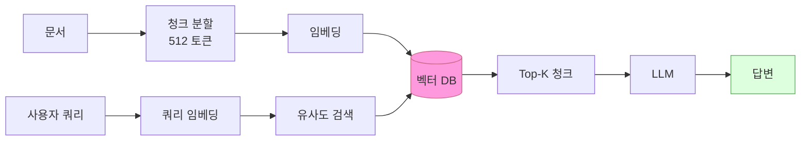
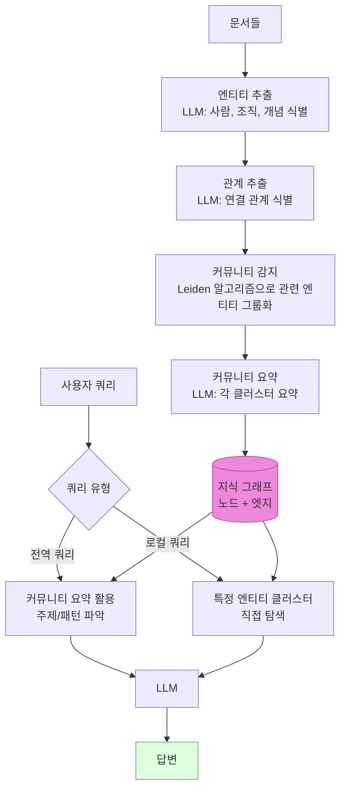
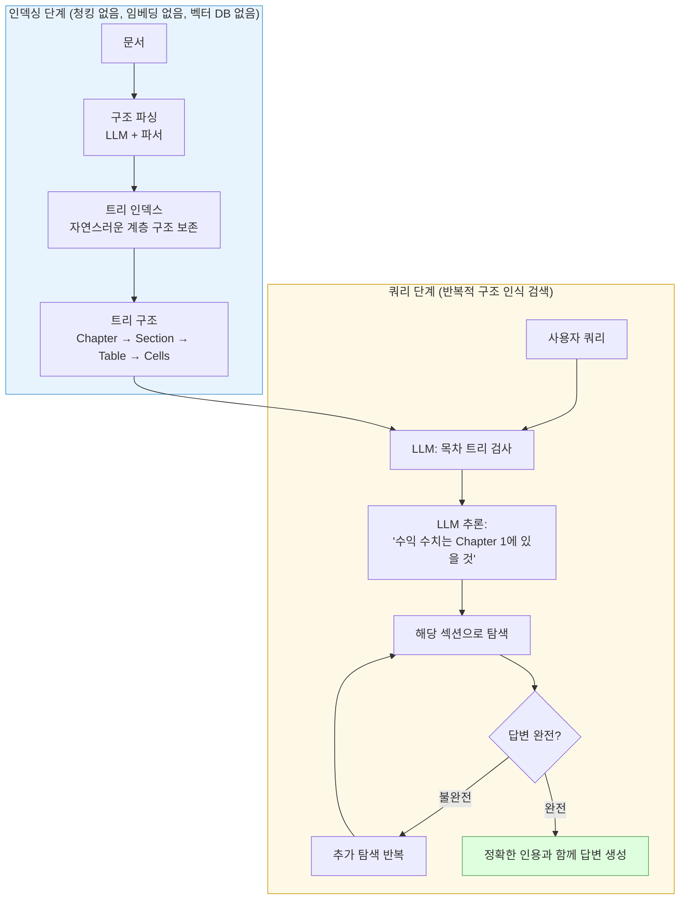
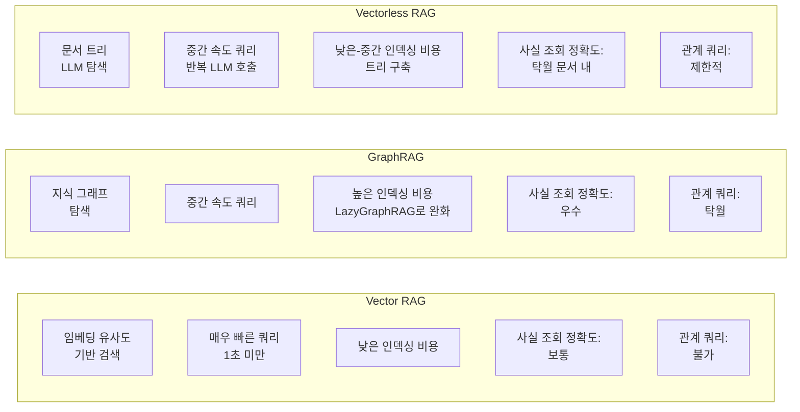
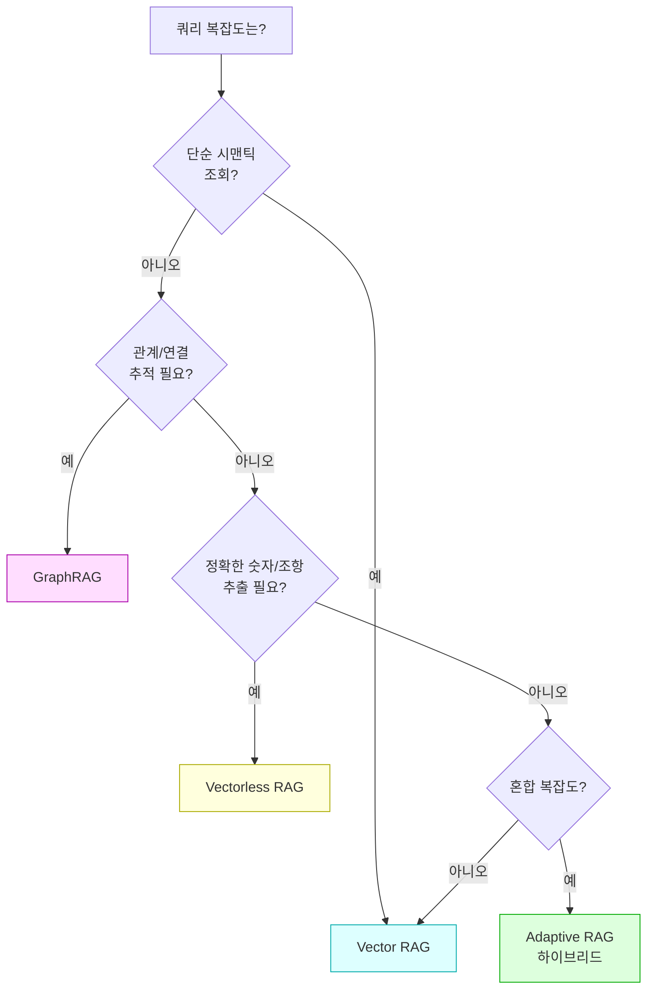
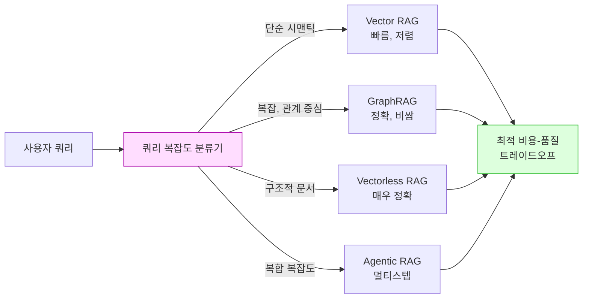

## GraphRAG vs Vectorless RAG vs Vector RAG: 고급 컨텍스트 엔지니어링

> **원문:** Divy Yadav, ["GraphRAG vs Vectorless RAG vs Vector RAG (A 2026 Guide to Advanced Context Engineering)"](https://pub.towardsai.net/graphrag-vs-vectorless-rag-vs-vector-rag-a-2026-guide-to-advanced-context-engineering-e8e9264cab38), *Towards AI*, May 1, 2026

---

## 목차

1. [들어가며: 조용한 실패의 시대](#1-들어가며-조용한-실패의-시대)
2. [전통적인 Vector RAG가 한계에 부딪히는 이유](#2-전통적인-vector-rag가-한계에-부딪히는-이유)
3. [GraphRAG: 관계가 핵심일 때](#3-graphrag-관계가-핵심일-때)
4. [Vectorless RAG: 구조가 유사도를 이긴다](#4-vectorless-rag-구조가-유사도를-이긴다)
5. [세 아키텍처의 심층 비교](#5-세-아키텍처의-심층-비교)
6. [실제 프로덕션 적용 패턴](#6-실제-프로덕션-적용-패턴)
7. [의사결정 프레임워크](#7-의사결정-프레임워크)
8. [2026년 프로덕션 시스템의 현실](#8-2026년-프로덕션-시스템의-현실)
9. [결론: RAG는 이제 하나의 기술이 아니다](#9-결론-rag는-이제-하나의-기술이-아니다)

---

## 1. 들어가며: 조용한 실패의 시대

대부분의 RAG(Retrieval-Augmented Generation) 시스템에서 실제로 일어나는 일을 솔직하게 말하면 이렇다. 검색 단계는 의미적으로 가까운 무언가를 찾아오고, LLM은 그 내용을 바탕으로 자신감 넘치는 문단을 작성한다. 그리고 아무도 그 답이 틀렸다는 사실을 모른다. 6주 후 사용자가 민원을 제기하기 전까지는.

오류 메시지도 없다. 로그 항목도 없다. 그저 매끄럽게 돌아가면서 조용히 사람들을 오도하는 시스템만 있을 뿐이다.

이것이 바로 파라미터 조정으로는 해결할 수 없는 **구조적 실패 모드**다. 그리고 2026년 현재, 두 가지 아키텍처가 완전히 다른 방향에서 이 문제를 돌파하고 있다.

- **GraphRAG**: 엔티티 간 관계를 매핑하는 지식 그래프 레이어를 추가한다.
- **Vectorless RAG**: 벡터 데이터베이스를 완전히 제거하고 LLM이 문서 구조를 직접 추론하게 한다.

어느 쪽도 기존 시스템의 드롭인(drop-in) 대체품이 아니다. 두 방식은 서로 다른 실제 문제를 해결하며, 상대방이 진정으로 해결할 수 없는 문제를 각자 해결한다.

---

## 2. 전통적인 Vector RAG가 한계에 부딪히는 이유

Vector RAG가 표준이 된 이유는 간단하다. 작동하기 때문이다. 문서를 청크로 나누고, 청크를 임베딩하고, 저장하고, 유사도로 검색한다. 단순한 사실 조회에는 빠르고 저렴하며 충분히 훌륭하다.

문제는 질문이 복잡해질 때 시작된다.



### 2.1 Vector RAG의 세 가지 탈출 불가능한 실패 모드

**첫째, 관계(Relationship)의 개념 자체가 없다.**

의미적 유사도 검색은 쿼리와 비슷하게 "들리는" 청크를 찾을 수는 있다. 그러나 "Section 4의 규정이 Appendix C의 예외 조항을 상호 참조한다"는 관계를 따라갈 수는 없다. 두 섹션은 서로를 정의하는 관계임에도 임베딩 공간에서는 멀리 떨어져 있을 수 있으며, 모델은 그 연결을 전혀 파악하지 못한다.

**둘째, 청킹이 문서 구조를 파괴한다.**

재무 보고서를 512토큰 단위로 분할하면 표(table)는 헤더에서 분리되고, 각주는 수치에서 잘려나가며, 다단계 답변은 그 문맥을 잃는다. 셀 안의 숫자는 열 헤더 없이는 의미가 없는데, 청킹이 바로 그것을 제거한다. 이것은 청크 크기의 문제가 아니라 **아키텍처적 한계**다.

**셋째, 복잡한 쿼리에서 정확도가 붕괴한다.**

Diffbot의 벤치마크에 따르면, 지식 그래프 없이 전통적인 Vector RAG를 사용할 경우 쿼리당 엔티티 수가 5개를 초과하면 정확도가 0%로 떨어진다. Metrics & KPIs, Strategic Planning 카테고리 모두에서 스키마 바운드 쿼리에 대해 0%를 기록했다. 낮은 게 아니라 완전히 제로다.

### 2.2 Vector RAG가 여전히 강한 영역

그럼에도 Vector RAG가 여전히 최선인 영역이 분명히 존재한다.

- 비구조적 텍스트가 많은 대규모 컬렉션 (블로그, 이메일 아카이브, 뉴스 기사 등)
- 임베딩 유사도가 충분히 관련 콘텐츠를 찾아주는 단순 시맨틱 검색
- 속도와 비용이 최우선이고 쿼리 복잡도가 낮은 대용량 시스템
- 그래프나 트리 인덱싱의 오버헤드가 아직 정당화되지 않는 초기 단계 시스템

---

## 3. GraphRAG: 관계가 핵심일 때

GraphRAG는 Vector 검색을 대체하지 않는다. 그것은 Vector 검색이 근본적으로 복제할 수 없는 레이어, 즉 **사물들이 어떻게 연결되는지에 대한 지도**를 추가한다.

### 3.1 핵심 아이디어

문서 컬렉션을 청크의 묶음으로 취급하는 대신, GraphRAG는 지식 그래프를 구축한다. 엔티티(사람, 기업, 개념, 규정)는 노드가 되고, 그들 사이의 관계는 엣지가 된다. 이 그래프는 "GDPR 제17조는 유럽 데이터 보호 위원회(EDPB)에 의해 집행된다"는 사실을 벡터 유사도로는 절대 포착할 수 없는 방식으로 저장한다.

### 3.2 GraphRAG 작동 방식



**빌드 타임:** LLM이 모든 문서를 읽고 자동으로 그래프를 구성한다. 미리 만들어진 지식 그래프가 필요하지 않다는 것이 가장 많이 오해되는 지점이다.

**쿼리 타임:** 전역 쿼리(예: "500편의 논문에서 주요 테마가 무엇인가?")에는 커뮤니티 요약이 활용되고, 로컬 쿼리(예: "Article 17과 EDPB 집행 권한의 관계는?")에는 특정 엔티티 클러스터로 직접 탐색한다.

### 3.3 GraphRAG가 탁월한 영역

- **멀티-홉 질문**: "Company A가 이용하는 공급업체 중 Company B 경쟁사에도 납품하는 곳은?"
- **전역 합성**: "500편의 논문에서 공통된 주제는 무엇인가?"
- **관계 쿼리**: 단순 텍스트 유사도가 아닌 연결을 따라가야 하는 쿼리
- **규제 준수 분석**: 상호 참조가 핵심인 규정 분석

GraphRAG는 전통적인 RAG 대비 **72~83%의 포괄성 향상**과 엔터프라이즈 시나리오에서 **3.4배의 정확도 향상**을 달성한다.

### 3.4 비용의 솔직한 현실

**기존 GraphRAG의 비용:** 일반적인 엔터프라이즈 코퍼스 인덱싱에 $20~500가 소요된다. 문서에서 모든 엔티티와 관계를 추출하기 위한 LLM 호출이 필요하기 때문이다.

**LazyGraphRAG (2025년 6월 Microsoft 공개):** Microsoft Research가 2025년 6월에 공개한 LazyGraphRAG는 이 비용 문제를 근본적으로 바꾸었다. 커뮤니티 요약을 쿼리 시점으로 미루는 방식으로 **인덱싱 비용을 기존 GraphRAG의 0.1% 수준**으로 줄였다. 인덱싱 비용은 Vector RAG와 동일하고, 쿼리당 약 0.8초의 지연 시간을 보인다. 전역 쿼리 비용은 기존 GraphRAG 대비 700배 저렴하면서도 동등한 품질을 유지한다. LazyGraphRAG는 현재 Microsoft Discovery와 Azure Local 서비스에 통합되어 운영되고 있다.

### 3.5 GraphRAG가 실패하는 영역

- **단순 사실 조회**: "환불 정책이 어떻게 되나요?"에는 지식 그래프가 필요 없다
- **실시간 지식**: 그래프 인덱싱에 시간이 걸리므로 빠르게 변하는 데이터에는 뒤처진다
- **작고 단순한 문서 컬렉션**: 인프라 비용이 혜택을 초과하는 경우
- **대용량 데이터 확장성**: 연구에 따르면 5~15M 토큰을 넘어서면 성능 향상이 정체된다

> "GraphRAG는 더 나은 RAG가 아니다. 다른 카테고리의 질문을 위한 검색이다."

---

## 4. Vectorless RAG: 구조가 유사도를 이긴다

Vectorless RAG는 더 어려운 길을 택했다. 기존 검색 모델 위에 그래프 레이어를 추가하는 대신, 이런 질문을 던졌다. **"기존 검색 모델 자체가 잘못된 출발점이라면 어떨까?"**

### 4.1 PageIndex: Vectorless RAG의 핵심 프레임워크

PageIndex는 2025년 9월 VectifyAI의 Mingtian Zhang과 Yu Tang이 공개한 Vectorless RAG의 주요 프레임워크다. GitHub에서 23,000개 이상의 스타를 받았다. 핵심 인사이트는 AlphaGo에서 차용했다. 철저한 검색 대신, 학습된 전략을 사용해 검색 공간을 지능적으로 탐색한다는 것이다.

### 4.2 패러다임의 전환

전통적인 RAG는 쿼리와 의미적으로 유사한 청크를 찾는다. PageIndex는 LLM이 **문서 구조에서 답변이 어디에 있을지 추론**하게 한 다음 그곳으로 직접 탐색한다. 마치 인간 전문가가 문서를 실제로 사용하는 방식처럼. 문서를 열고, 목차를 훑어보고, 관련 챕터로 이동하고, 표를 읽는다.

### 4.3 Vectorless RAG 작동 방식



**트리 구조 예시:**

```
├── Chapter 1: Revenue
│   ├── 1.1 Q1 Results
│   │   ├── Table: Revenue by Region
│   │   └── Footnotes: Currency adjustments
│   └── 1.2 Q2 Results
└── Chapter 2: Expenses
    └── ...
```

### 4.4 벤치마크 결과: 격차가 너무 크다

PageIndex 기반의 Mafin 2.5는 FinanceBench에서 **98.7%의 정확도**를 달성했다. 전통적인 Vector RAG는 약 50%, GPT-4o(RAG 없음)는 약 31%, Perplexity는 약 45%였다. Vector RAG 대비 49포인트 차이는 점진적 개선이 아니라 **카테고리가 다른 결과**다.

이 격차가 이렇게 큰 세 가지 이유가 있다.

**첫째, 상호 참조 추적.** PageIndex는 "Appendix G 참조"라는 문구를 트리를 통해 실제로 탐색한다. 벡터 유사도는 문서 참조라는 개념 자체가 없다.

**둘째, 구조 보존.** 표는 헤더, 각주, 셀 관계를 트리 노드로 유지한다. 청킹은 이것을 파괴한다.

**셋째, 멀티스텝 추론.** 두 개의 별개 섹션에서 데이터를 필요로 하는 질문은 반복적 탐색으로 처리된다. 단 한 번의 검색 패스로 처리하지 않는다.

### 4.5 "Vectorless"라는 표현에 대한 솔직한 맥락

"Vectorless"라는 표현은 PageIndex가 "LLM에 대한 반복적이고 재귀적인 호출로 완전히 구현된다"는 이유로 비판을 받기도 했다. 벡터 근사(approximation)를 제거했지만 그 자리에 LLM 추론 근사를 도입한 셈이다. **양쪽 모두 비용이 있다.**

수백만 건의 문서와 단순한 쿼리가 있다면, Vectorless RAG는 의미 있는 정확도 향상 없이 Vector RAG보다 느리고 더 비싸다. 오버헤드는 **정확도가 최우선 제약**인 경우에만 정당화된다.

### 4.6 Vectorless RAG가 실패하는 영역

- 비구조적 텍스트 덩어리 (채팅, 이메일)
- "비슷한 개념 찾기"와 같은 시맨틱 탐색이 필요한 경우
- 엔티티 간 관계가 답변의 핵심인 경우
- 수백 개의 문서에 걸친 전역적 합성이 필요한 경우

---

## 5. 세 아키텍처의 심층 비교



| 비교 차원 | Traditional Vector RAG | GraphRAG | Vectorless RAG |
|---|---|---|---|
| **핵심 메커니즘** | 임베딩 유사도 | 지식 그래프 탐색 | 문서 트리 LLM 탐색 |
| **인덱싱 비용** | 낮음 | 높음 (LazyGraphRAG로 완화) | 낮음~중간 |
| **쿼리 지연** | 매우 빠름 (<1초) | 중간~느림 | 중간 (반복 LLM) |
| **사실 조회 정확도** | 보통 | 우수 | 탁월 (문서 내) |
| **관계 쿼리** | 불가 | 탁월 | 제한적 |
| **문서 간 추론** | 청킹으로 소실 | 부분적 포착 | 문서 내 완전 보존 |
| **구조 보존** | 나쁨 | 중간 | 트리 노드로 완전 보존 |
| **최적 문서 유형** | 비구조적 텍스트, 기사 | 관계 있는 대규모 코퍼스 | 구조적 문서 (보고서, 계약서) |
| **인프라** | 벡터 DB | 벡터 DB + 그래프 DB | 벡터 DB 없음 |
| **확장성** | 탁월 | ~10M 토큰까지 우수 | 중간 |

---

## 6. 실제 프로덕션 적용 패턴

### 6.1 GraphRAG가 압도적으로 유리한 사례

관계가 핵심인 유스케이스에서 GraphRAG는 진가를 발휘한다.

- **경쟁 인텔리전스**: "우리가 평가 중인 물류 공급업체와 동일한 곳을 쓰는 시장 내 기업은?" 이런 질문은 수천 개의 문서에 걸쳐 공급업체-기업 관계를 추적해야 한다.
- **규제 준수 분석**: 여러 국가 법률에서 규정들이 서로를 어떻게 상호 참조하는지 매핑하는 작업. 벡터 유사도로는 포착할 수 없는 구조다.
- **연구 합성**: 어떤 단일 논문도 명시적으로 만들지 않은 수천 편의 논문에 걸친 연결 발견.
- **의료 연구**: Cedars-Sinai의 160만 개 엣지 알츠하이머 연구 그래프가 초기 사례로 언급된다.

### 6.2 Vectorless RAG가 압도적으로 유리한 사례

"충분히 가까운" 답변이 용납되지 않는 정밀도 중심 도메인에서 빛을 발한다.

- **금융 분석**: SEC 공시에서 정확한 수치 추출. Vector RAG의 50% 정확도는 이 영역에서 위험하다.
- **법률 문서 검토**: 문맥 의존성이 핵심인 계약 조항 추출.
- **기술 문서**: 표 관계가 중요한 구조화된 스펙에서의 답변.
- **감사 및 컴플라이언스 문서**: 정확한 출처 인용이 요구되는 경우.

### 6.3 Traditional Vector RAG가 여전히 적합한 사례

- 대규모 비구조적 텍스트 컬렉션 (블로그, 이메일 아카이브)
- 임베딩 유사도가 관련 콘텐츠를 신뢰성 있게 찾는 단순 시맨틱 검색
- 속도와 비용이 지배적인 제약인 고용량, 저복잡도 쿼리
- 그래프나 트리 인덱싱이 아직 정당화되지 않는 프로토타이핑 단계

---

## 7. 의사결정 프레임워크

아키텍처를 선택하기 전에 다음 네 가지 질문에 답하라.



### 4가지 핵심 질문

**Q1. 사용자가 어떤 질문을 하고 있는가?**

- "문서 X에서 Y에 대해 무엇이라고 하나요?" → Vector RAG 또는 Vectorless RAG
- "모든 문서에서 A와 B는 어떤 관계인가?" → GraphRAG
- "이 표에서 정확한 수치를 알려주세요" → Vectorless RAG

**Q2. 정확도가 얼마나 중요한가?**

- "충분히 좋은" 수준이 수용 가능 → Vector RAG
- 오류가 실질적 결과(금융, 법률, 의료)를 초래 → Vectorless RAG 또는 GraphRAG

**Q3. 문서의 구조는 어떠한가?**

- 비구조적 텍스트, 긴 기사, 대화형 콘텐츠 → Vector RAG
- 내부 참조가 있는 구조적 보고서, 계약서 → Vectorless RAG
- 문서 간 상호 연결된 엔티티가 있는 대규모 컬렉션 → GraphRAG

**Q4. 지연 시간과 비용 제약은?**

- 1초 미만 응답, 고용량, 낮은 예산 → Vector RAG
- 중간 지연 허용, 정확도 중요 → Vectorless RAG
- 선행 인덱싱 비용 허용, 복잡한 관계 필요 → GraphRAG

### 의사결정 매트릭스

| 쿼리 유형 | 구조 | 정확도 요구 | 선택 |
|---|---|---|---|
| 시맨틱 조회 ("X에 대해 뭐라고 하나?") | 비구조적 | 보통 | **Vector RAG** |
| 멀티-홉 관계 ("A와 B의 관계?") | 무관 | 높음 | **GraphRAG** |
| 구조적 문서 정확 답변 | 구조적 | 매우 높음 | **Vectorless RAG** |
| 전역 테마 ("500개 논문의 테마?") | 대규모 코퍼스 | 보통 | **GraphRAG** |
| 단순 사실 조회 ("환불 정책은?") | 무관 | 보통 | **Vector RAG** |
| 고엔티티 쿼리 | 무관 | 높음 | **GraphRAG 또는 Vectorless** |
| 상호 참조 탐색 | 구조적 | 매우 높음 | **Vectorless RAG** |
| 혼합 복잡도 | 무관 | 다양 | **Adaptive RAG (하이브리드)** |

---

## 8. 2026년 프로덕션 시스템의 현실

단일 아키텍처가 모든 유스케이스를 지배하지 않는다는 것이 솔직한 답변이다. 최고의 AI 시스템을 구축하는 팀들은 하나를 선택하지 않는다. **라우팅(routing)** 한다.

### 8.1 Adaptive RAG: 2026년의 떠오르는 표준 패턴



쿼리 분류기가 진입점에 위치한다. 단순한 시맨틱 질문은 Vector RAG로 간다. 복잡한 관계 질문은 GraphRAG로 간다. 구조화된 문서 쿼리는 Vectorless RAG로 간다. 각 쿼리는 자신이 실제로 필요로 하는 것에 기반해 올바른 검색 경로를 찾는다.

이것은 단일 파이프라인보다 구축하기 더 복잡하다. 그러나 규모에서 훨씬 더 정확하고 저렴하다. 대부분의 시스템에서 쿼리의 대다수는 단순하고, 단순한 쿼리는 그래프 탐색이나 반복적 LLM 탐색의 오버헤드가 필요 없기 때문이다.

### 8.2 GraphRAG와 Vectorless RAG는 경쟁 관계가 아니다

이것이 대부분의 글이 놓치는 핵심 지점이다.

- **GraphRAG**는 대규모 문서 컬렉션에서 관계를 이해해야 할 때 탁월하다.
- **Vectorless RAG**는 복잡한 문서의 내부 구조에서 정확한 답변이 필요할 때 탁월하다.

PageIndex는 전역 쿼리를 처리할 메커니즘이 없다. "이 코퍼스의 500개 계약에서 반복되는 책임 테마는?"이라는 질문에 PageIndex는 각 문서를 개별적으로 검색해야 하고, LLM 컨텍스트 창은 합성된 답변이 나오기도 전에 소진된다.

반대로 GraphRAG는 단일 문서 내의 정밀한 숫자 추출에는 과도한 인프라다.

### 8.3 RAGFlow의 2025년 연말 리뷰 인사이트

RAGFlow의 2025년 연말 리뷰는 이 맥락에서 의미 있는 방향을 제시한다. TreeRAG와 GraphRAG의 강점을 결합하는 것이 RAG의 고통점을 더 완화할 수 있다고 본다. TreeRAG는 물리적 청킹으로 인한 로컬 시맨틱 단절을 해소하고, GraphRAG는 엔티티-관계 네트워크를 기반으로 원본 문서에서 물리적으로 멀리 떨어진 의미적으로 관련된 콘텐츠를 발견한다.

---

## 9. 결론: RAG는 이제 하나의 기술이 아니다

여기서 계속 돌아오게 되는 핵심은 이것이다. 망가진 RAG 시스템을 출시한 팀들은 나쁜 엔지니어가 아니었다. 그들은 Vector RAG를 올바르게 사용하고 있었다. 다만 그것이 사용자들이 실제로 묻는 질문에 맞는 도구가 아니었을 뿐이다.

RAG는 더 이상 하나의 기술이 아니다. 그것은 같은 이름을 공유하는 세 가지 근본적으로 다른 검색 철학이다.

**Vector RAG: 낙관적 매칭.** 가까운 것을 찾고 그것이 맞기를 희망한다.

**GraphRAG: 구조적 매핑.** 질문이 오기 전에 관계를 파악한다.

**Vectorless RAG: 의도적 탐색.** 유사도 점수에서 추측하는 대신 답변이 어디에 있는지 추론한다.

이 차이를 이해하는 팀들은 검색이 병목점이 되지 않는 시스템을 구축하고 있다. 이해하지 못하는 팀들은 절대 작동할 수 없었던 검색을 커버하기 위해 프롬프트를 반복해서 조정하고 있다.

18개월 후에는 "벡터 RAG를 쓰나요, 아니면 Adaptive RAG를 쓰나요?"라는 질문이 프로덕션 수준 팀과 데모 수준 팀을 구분하는 기준이 될 것이다. "이밸스(evals)가 있나요?"라는 질문이 이미 그 역할을 하고 있는 것처럼.

---

## 참고 자료

- Divy Yadav, *GraphRAG vs Vectorless RAG vs Vector RAG (A 2026 Guide to Advanced Context Engineering)*, Towards AI, May 2026
- Microsoft Research, *LazyGraphRAG: Setting a New Standard for Quality and Cost*, June 2025
- Mingtian Zhang & Yu Tang (VectifyAI), *PageIndex*, September 2025
- RAGFlow, *From RAG to Context: A 2025 Year-End Review of RAG*, December 2025
- Umesh Kushwaha, *GraphRAG vs PageIndex: When Knowledge Graphs Beat Vector Search*, March 2026
- Shubham Vedi, *PageIndex RAG vs Traditional RAG: I Tested Both*, April 2026

---

*이 문서는 공개된 연구 결과와 벤치마크 데이터를 기반으로 작성되었으며, 2026년 5월 기준 최신 정보를 반영합니다.*
