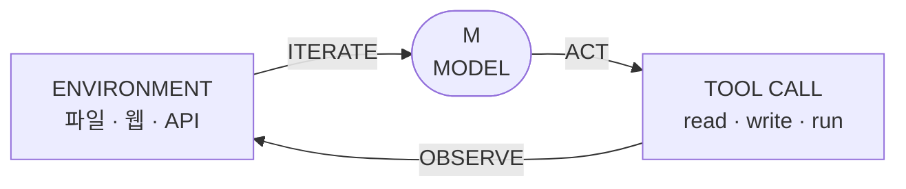
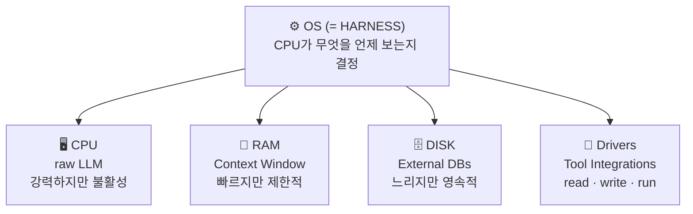
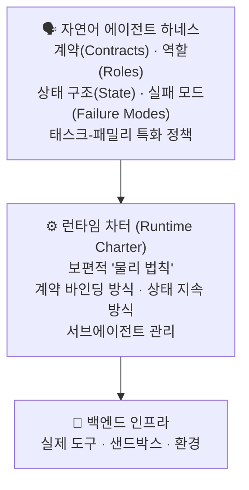
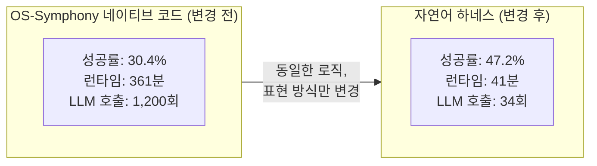
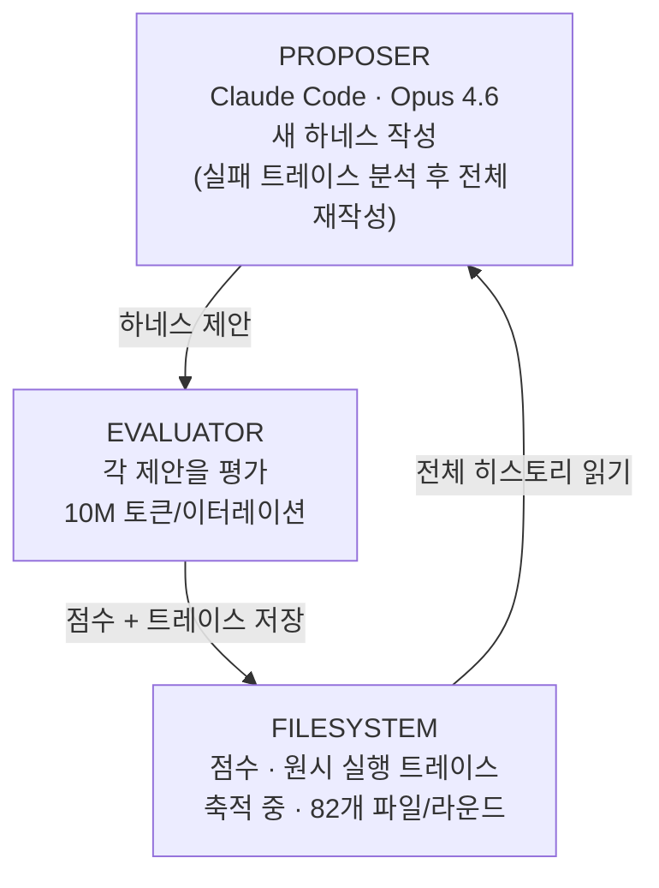
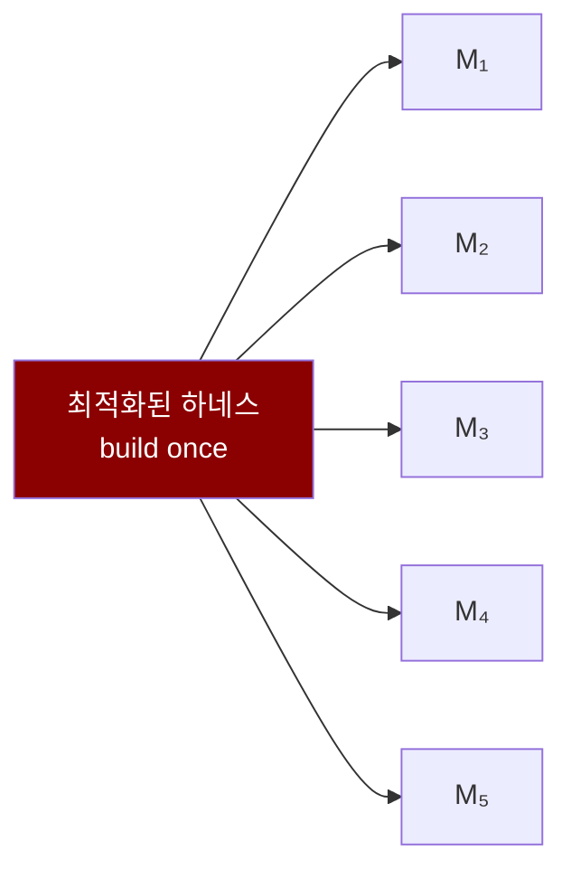
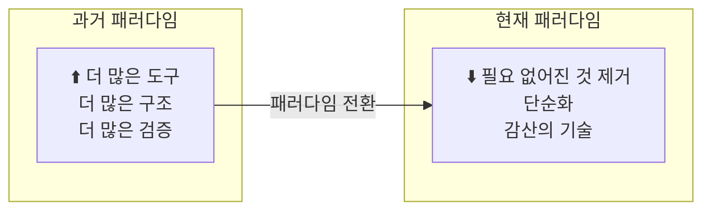
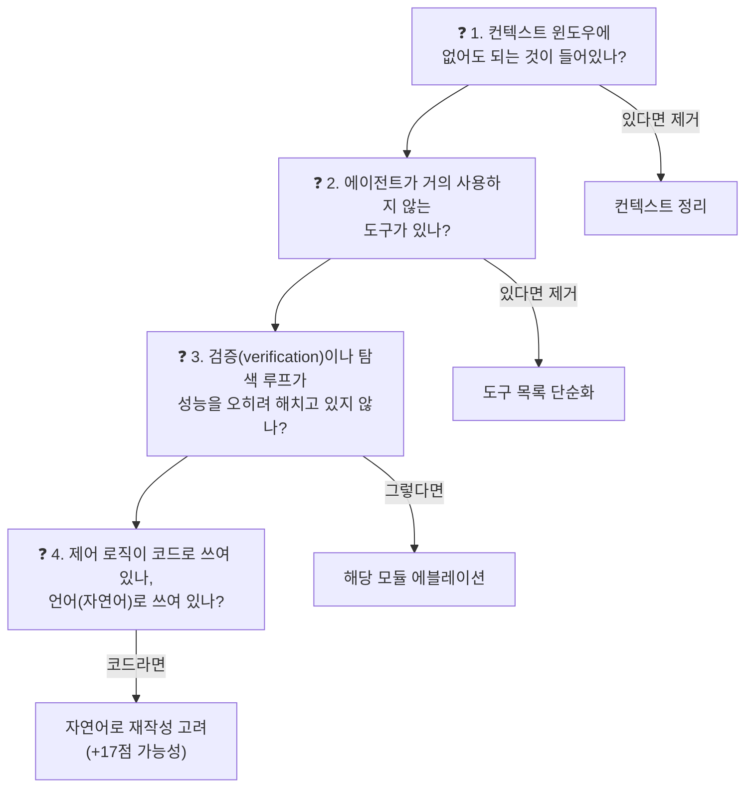
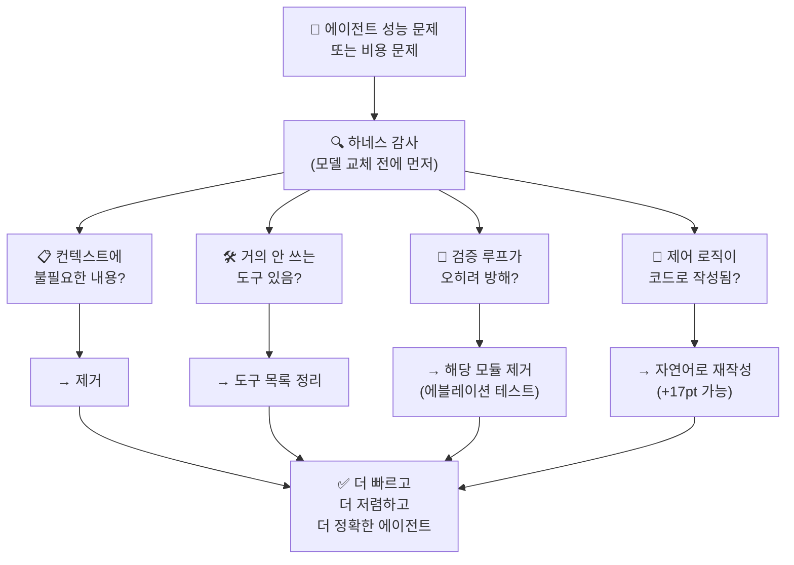

> **원본 영상**: [Rethinking Agents - Harness is All you Need?](https://www.youtube.com/watch?v=A0xu44a1BHE)  
> **채널**: Prompt Engineering  
> **게시일**: 2026년 5월 4일  
> **참조 논문 1 (칭화대)**: [Natural-Language Agent Harnesses, arXiv:2603.25723](https://arxiv.org/abs/2603.25723)  
> **참조 논문 2 (스탠퍼드)**: [Meta-Harness: End-to-End Optimization of Model Harnesses, arXiv:2603.28052](https://arxiv.org/abs/2603.28052)

---

## 목차

1. [핵심 주장 — 하네스가 모델을 이긴다](#1-핵심-주장--하네스가-모델을-이긴다)
2. [하네스란 무엇인가](#2-하네스란-무엇인가)
3. [운영체제 유추로 이해하는 하네스](#3-운영체제-유추로-이해하는-하네스)
4. [오늘날 하네스의 문제점](#4-오늘날-하네스의-문제점)
5. [칭화대 논문 — 자연어 에이전트 하네스(NLAH)](#5-칭화대-논문--자연어-에이전트-하네스nlah)
6. [에블레이션 실험과 컴퓨트 비용](#6-에블레이션-실험과-컴퓨트-비용)
7. [자연어 전환 실험의 결과](#7-자연어-전환-실험의-결과)
8. [스탠퍼드 논문 — 메타 하네스(Meta-Harness)](#8-스탠퍼드-논문--메타-하네스meta-harness)
9. [이전 가능한 하네스 — 모델이 아니라 구조가 자산이다](#9-이전-가능한-하네스--모델이-아니라-구조가-자산이다)
10. [감산 원칙(Subtraction Principle)](#10-감산-원칙subtraction-principle)
11. [에이전트 빌더를 위한 감사 체크리스트](#11-에이전트-빌더를-위한-감사-체크리스트)
12. [전체 흐름 요약 다이어그램](#12-전체-흐름-요약-다이어그램)
13. [결론](#13-결론)

---

## 1. 핵심 주장 — 하네스가 모델을 이긴다

2026년 3~4월, 칭화대학교(Tsinghua University)와 스탠퍼드대학교(Stanford University)에서 각각 발표된 두 편의 논문은 AI 에이전트 개발 커뮤니티에 상당히 도발적인 메시지를 전달했다. 그 핵심은 단순하지만 충격적이다.

**동일한 LLM 모델을 사용하더라도, 그 모델을 감싸는 오케스트레이션 코드(하네스)가 어떻게 설계되어 있느냐에 따라 성능이 최대 6배까지 달라진다.**

지금껏 AI 개발자들이 벌여 온 "어떤 모델이 가장 좋은가?"라는 논쟁은, 사실 근본적으로 잘못된 질문이었을 가능성이 높다. 진짜 변수는 모델의 가중치가 아니라 그 모델을 어떻게 둘러싸고 있는 구조—즉, 하네스—였던 것이다.

실제로 같은 Claude Opus 4.6를 Claude Code 안에서 실행하는 것과, Cursor나 기타 서드파티 하네스 안에서 실행하는 것은 전혀 다른 추론 경로와 토큰 소비, 그리고 성공률을 낳는다. 이것은 마케팅 주장이 아니라, 측정 가능한 실험 결과다.

---

## 2. 하네스란 무엇인가

하네스를 가장 간결하게 정의하면 다음과 같다.

> **하네스(Harness)란, 모델을 에이전트로 변환시키는 아키텍처다.**

LLM 그 자체는 1회성(one-shot) 텍스트 생성기다. 질문을 받고, 답변을 생성하고, 멈춘다. 하네스가 없다면 모델은 외부 세계를 인식하거나 행동을 취하거나 결과를 확인할 수 없다.

하네스가 모델에게 부여하는 능력은 다음과 같다.

- **행동(Act)**: 파일을 읽거나 코드를 실행하거나 API를 호출하는 등 실제 도구를 사용하는 능력
- **관찰(Observe)**: 그 행동의 결과를 인식하는 능력
- **반복(Iterate)**: 문제가 완전히 해결될 때까지 루프를 지속하는 능력

이 세 가지 능력의 구조를 다이어그램으로 표현하면 아래와 같다.



에이전트의 핵심 루프는 단순하다. 환경으로부터 정보를 받아 모델이 판단하고, 도구를 호출하며, 그 결과가 다시 환경으로 돌아간다. 하네스는 이 사이클 전체를 관리한다.

구체적으로 하네스를 구성하는 주요 컴포넌트는 다음과 같다.

| 컴포넌트 | 역할 |
|---|---|
| **While Loop** | act → observe → iterate 사이클을 구동 |
| **Context Management** | 컨텍스트 윈도우에 무엇을 유지하고, 요약하고, 삭제할지 결정 |
| **Tool Registry** | 모델이 접근 가능한 도구 목록 관리 (read · write · run · search) |
| **Permissions** | 어떤 행동을 허용하고 거부하고 사람에게 확인받을지 결정 |

정리하면: **model + harness = agent**

---

## 3. 운영체제 유추로 이해하는 하네스

하네스를 직관적으로 이해하는 가장 깔끔한 방법은 운영체제(OS) 비유다. 이 비유는 단순한 수사가 아니라, 실제로 두 논문이 공유하는 프레임워크이기도 하다.



- **CPU (=raw LLM)**: 강력한 연산 능력을 보유하지만, 그 자체로는 아무것도 하지 못하는 수동적 존재
- **RAM (=Context Window)**: 빠르게 접근할 수 있지만 용량이 제한되어 있음
- **Disk (=External DBs)**: 속도는 느리지만 데이터를 영속적으로 저장
- **Drivers (=Tool Integrations)**: 외부 환경과 연결되는 인터페이스
- **OS (=Harness)**: 이 모든 것을 조율하고 CPU(모델)가 무엇을 언제 보게 할지 결정하는 핵심

칭화대 논문은 이 OS 유추를 더 구체적으로 확장해, 하네스의 구성 요소들을 OS 프리미티브(primitive)에 1:1로 대응시킨다.

| 하네스 구성요소 | OS 프리미티브 |
|---|---|
| While Loop | 스케줄러(Scheduler) |
| Sub-agents | 프로세스 모델(Process Model) |
| Permissions | 접근 제어(Access Control) |
| Lifecycle Hooks | 시그널(Signals) |

---

## 4. 오늘날 하네스의 문제점

이 영상이 던지는 핵심 질문은 이것이다. 왜 동일한 하네스가 어떻게 구조화되어 있느냐에 따라 **최대 6배의 성능 차이**를 만드는가?

그동안 에이전트 빌더들이 저지른 가장 큰 실수는 두 가지다.

첫째, 성능이 나오지 않으면 **모델을 바꾸는** 것이 첫 번째 선택지였다. 그러나 실제로는 하네스가 문제인 경우가 훨씬 많다.

둘째, 하네스를 더 많은 도구와 더 많은 구조를 쌓아올리는 방식으로 개선하려 했다. 그러나 논문들은 **더 많은 구조가 항상 더 좋은 것은 아님**을 수치로 보여준다.

---

## 5. 칭화대 논문 — 자연어 에이전트 하네스(NLAH)

**논문명**: *Natural-Language Agent Harnesses*  
**저자**: Linyue Pan 외 (칭화대학교)  
**arXiv**: [2603.25723](https://arxiv.org/abs/2603.25723)  
**제출일**: 2026년 3월 26일

이 논문이 던진 핵심 질문은 이것이다.

> "에이전트의 제어 로직 전체를 Python이나 YAML 코드가 아닌, **구조화된 자연어**로 작성하면 어떻게 될까?"

논문은 하네스 구조를 세 개의 레이어로 분리한다.



이 분리가 가져다주는 핵심 이점은 **통제된 실험**이다. 런타임을 고정한 채 하네스만 교체할 수 있기 때문에, 하네스 설계의 영향을 독립적으로 측정하는 깔끔한 에블레이션(ablation)이 가능해진다.

논문에서 설명하는 자연어 하네스 실행 방식은, 런타임 루프 안에 LLM을 위치시키는 것이다. 각 스텝에서 LLM은 (i) 하네스 자체, (ii) 현재 상태와 환경, (iii) 런타임 차터를 읽고, 계약과 예산에 맞는 다음 행동을 선택한다.

또한 이 논문은 두 가지 핵심 메커니즘을 제안한다.

**실행 계약 (Execution Contracts)**
에이전트를 위한 함수 시그니처와 같은 개념으로, 각 작업을 실행하기 위한 조건과 한계를 명시한다.

```
contract(call) {
    required_inputs
    budgets
    permissions
    completion_conditions
    output_paths
}
```

**파일 기반 상태 (File-Backed State)**
메모리를 디스크로 외부화해 컨텍스트 잘림(truncation), 재시작, 서브에이전트 위임 후에도 상태가 살아남도록 한다.

```
/state/memory.json
/state/context.json
/state/contracts/
/state/artifacts/
```

이 구조는 다음 세 가지 특성을 갖는다.
- ✅ truncation 후에도 생존
- ✅ 재시작 후에도 생존
- ✅ 위임(delegation) 후에도 생존

---

## 6. 에블레이션 실험과 컴퓨트 비용

칭화대 논문은 GPT-5.4를 최대 추론 설정으로 사용해 SWE-bench Verified 벤치마크에서 실험을 진행했다.

### 풀 하네스 vs. 스트립 버전 비교

결과는 놀라웠다. 풀 하네스와 대폭 줄인 버전의 성공률은 74~76% 범위에서 비슷했지만, 컴퓨트 비용은 **14배 차이**가 났다.

| 지표 | 풀 하네스 | 스트립 버전 |
|---|---|---|
| 토큰 소비 | **16.3M** | 1.2M |
| 도구 호출 횟수 | **642회** | 51회 |
| 런타임 | **32분** | 7분 미만 |
| 성공률 | 74~76% | 74~76% (동일) |

**→ 14배 더 많은 컴퓨트를 쓰고도 결과는 똑같다.**

### 모듈별 에블레이션 결과

논문은 하네스의 각 모듈을 하나씩 제거해가며 성능에 미치는 영향을 측정했다. 결과는 직관에 반하는 경우가 많았다.

```
Self-evolution (자기 진화)  ████████████████  +4.8 / +2.7  ✅ 도움이 됨

Verifier (검증기)           ████████          -0.8 / -8.4  ❌ 오히려 해로움

Multi-candidate search      ███████           -2.4 / -5.6  ❌ 오히려 해로움
```

- **자기 진화(Self-evolution)** 모듈은 일관되게 성능을 향상시켰다.
- **검증기(Verifier)** 는 SWE-bench에서 -0.8, OS World에서 무려 -8.4 포인트를 떨어뜨렸다.
- **다중 후보 탐색(Multi-candidate search)** 도 -2.4 ~ -5.6 포인트의 성능 하락을 가져왔다.

**더 많은 구조가 항상 더 좋은 것은 아니다.** 직관적으로는 검증 단계가 있으면 품질이 높아질 것 같지만, 실제로는 이미 모델이 잘 해낼 수 있는 역할을 하네스가 중복으로 수행하면서 오히려 방해가 된다.

---

## 7. 자연어 전환 실험의 결과

칭화대 논문에서 가장 인상적인 실험 결과는 **코드 하네스를 자연어 하네스로 그대로 재작성했을 때** 나타난 변화다.

대상은 데스크톱 자동화 에이전트인 OS-Symphony로, 기존에는 Python 네이티브 코드로 하네스를 구현했다. 동일한 전략(로직)을 유지하면서 표현 방식만 자연어로 바꿨더니 다음과 같은 결과가 나왔다.



| 지표 | 기존 코드 하네스 | 자연어 하네스 |
|---|---|---|
| 성공률 | 30.4% | **47.2%** (+16.8 pts) |
| 런타임 | 361분 | **41분** (-89%) |
| LLM 호출 횟수 | 1,200회 | **34회** (-97%) |

같은 논리를 자연어로 재작성하는 것만으로 **+16.8 포인트, -97% LLM 호출**이라는 결과가 나왔다. 이는 "표현 방식 자체가 성능을 결정한다"는 강력한 증거다.

자연어 하네스가 더 나은 이유는, LLM이 Python 코드의 if-else 분기보다 자연어로 쓰인 계약과 목표를 훨씬 더 효율적으로 해석하고 처리할 수 있기 때문이다. 코드 기반 하네스는 경직되고 취약한(brittle) 반면, 자연어 하네스는 유연하고 내구성이 높다.

---

## 8. 스탠퍼드 논문 — 메타 하네스(Meta-Harness)

**논문명**: *Meta-Harness: End-to-End Optimization of Model Harnesses*  
**저자**: Yoonho Lee, Roshen Nair, Qizheng Zhang, Kangwook Lee, Omar Khattab, Chelsea Finn  
**소속**: Stanford University, MIT, KRAFTON  
**arXiv**: [2603.28052](https://arxiv.org/abs/2603.28052)  
**제출일**: 2026년 3월 30일

칭화대 논문이 "표현 방식이 중요하다"는 것을 보였다면, 스탠퍼드 논문은 한 걸음 더 나아가 이렇게 묻는다.

> "표현 방식이 이토록 중요하다면, **올바른 하네스를 자동으로 찾을 수 있지 않을까?**"

스탠퍼드 팀은 **Meta-Harness**라는 시스템을 제안했다. 이 시스템은 인간이 손으로 하네스를 설계하는 것이 아니라, 에이전트가 하네스 코드를 스스로 탐색하고 개선한다.

### Meta-Harness 작동 구조



루프는 다음과 같이 작동한다.

1. **제안자(Proposer)**: Claude Code (Opus 4.6)가 파일시스템에서 이전 모든 실행 트레이스, 점수, 소스 코드를 읽는다. 이를 바탕으로 무엇이 왜 실패했는지 진단하고, 완전히 새로운 하네스를 작성한다.
2. **평가자(Evaluator)**: 제안된 하네스를 평가 태스크에서 실행하고 점수를 산출한다. 이터레이션당 약 10M 토큰이 소비된다.
3. **파일시스템**: 제안된 코드, 추론 트레이스, 평가 점수가 새 디렉토리에 저장되고 루프가 반복된다.

### 원시 트레이스의 중요성

Meta-Harness의 가장 중요한 설계 결정 중 하나는 **원시(raw) 실행 트레이스를 압축 없이 전달**하는 것이다. 기존 최적화 방법들(OPRO, TextGrad 등)은 피드백을 지나치게 압축했고, 이것이 성능 병목이 되었다.

Meta-Harness는 이터레이션당 약 400배 더 많은 피드백을 처리하며, 라운드당 약 82개의 파일을 읽는다.

원시 트레이스를 제거하거나 요약으로 대체했을 때의 결과가 이를 명확히 보여준다.

| 조건 | 정확도 |
|---|---|
| 원시 트레이스 전체 제공 | **50%** |
| 트레이스 없음 | 34.6% (-15.4 pts) |
| 요약 트레이스만 제공 | 34.9% (-15.1 pts) |

요약은 원시 트레이스를 대체하지 못한다. **신호는 세부 사항 속에 있기 때문이다.** 이전 실패를 요약해서 모델에게 전달하면, 오히려 에이전트 성능을 크게 해칠 수 있다.

### Terminal Bench 2 리더보드 결과

```
#1  Meta-Harness · Haiku     76.4%   [AUTO-OPT]  ◀ 가장 작은 모델!
#2  Meta-Harness · Opus      73.1%   [AUTO-OPT]
#3  Hand-engineered · Opus   71.8%   [MANUAL]
#4  Hand-engineered · GPT-5  68.4%   [MANUAL]
#5  Hand-engineered · Sonnet 66.2%   [MANUAL]
```

**Haiku (소형 모델) + 자동 최적화 하네스 = 1위.** Opus나 GPT-5 같은 대형 모델을 수동 설계 하네스로 운영하는 것보다 훨씬 높은 성능을 달성했다. 이 결과는 "더 큰 모델이 더 좋다"는 통념을 정면으로 반박한다.

또한 215개 텍스트 분류 태스크에서 Meta-Harness는 최첨단(state-of-the-art) 대비 **7.7 포인트 높은 정확도**를, 그것도 **4배 적은 토큰**으로 달성했다.

---

## 9. 이전 가능한 하네스 — 모델이 아니라 구조가 자산이다

Meta-Harness 논문의 또 다른 중요한 발견은 **하네스의 이전 가능성(transferability)** 이다.

수학 추론(IMO 수준 문제 200개) 태스크에서 하나의 모델을 위해 최적화된 하네스를 5개의 다른 모델에 적용했더니, **5개 모델 모두에서 평균 4.7 포인트의 정확도 향상**이 나타났다.



이것이 의미하는 바는 명확하다. **재사용 가능한 자산은 모델이 아니라 하네스다.** 하네스는 한 번 잘 만들어놓으면 모델 생태계 전반에 적용할 수 있다.

이는 현재의 AI 개발 패러다임을 근본적으로 바꾼다. 새로운 모델이 출시될 때마다 시스템 전체를 재구성할 필요가 없다. 잘 최적화된 하네스는 새 모델에도 성능 향상을 가져올 가능성이 높다.

---

## 10. 감산 원칙(Subtraction Principle)

두 논문과 Anthropic의 실제 개발 경험에서 공통적으로 도출되는 가장 중요한 실용적 교훈은 **감산 원칙**이다.

> **하네스의 모든 컴포넌트는 "모델이 혼자서는 이것을 할 수 없다"는 가정을 인코딩한다. 그리고 그 가정은 모델이 발전함에 따라 만료된다.**

하네스 컴포넌트는 모델의 약점을 보완하기 위해 추가된다. 그런데 모델이 개선되어 그 약점이 사라지면, 해당 컴포넌트는 더 이상 도움이 되지 않는다. 오히려 불필요한 오버헤드와 간섭을 일으킬 수 있다.

실제 사례들이 이를 뒷받침한다.

- **Anthropic**: Opus 4.6이 컨텍스트 리셋 없이도 잘 동작하게 되자, 컨텍스트 리셋 로직을 아예 제거했다.
- **Manus (에이전트 플랫폼)**: 6개월 동안 하네스를 다섯 번 재작성했다.
- **Warel**: 에이전트 도구의 80%를 제거했더니 오히려 성능이 좋아졌다.

이것은 "무엇을 더할 것인가"가 아니라 "무엇을 뺄 것인가"의 문제다.



---

## 11. 에이전트 빌더를 위한 감사 체크리스트

에이전트가 기대만큼 작동하지 않을 때, **가장 먼저 할 일은 모델을 교체하는 것이 아니다.** 하네스를 감사(audit)하라.

다음 네 가지 질문을 순서대로 점검하라.



### 핵심 질문 상세 설명

**① 컨텍스트에 불필요한 내용이 있는가?**  
컨텍스트 윈도우는 RAM이다. 필요하지 않은 정보가 들어있으면 모델의 주의가 분산되고 토큰이 낭비된다. 지금 이 순간 에이전트의 태스크 수행에 직접 필요한 정보만 남겨야 한다.

**② 거의 사용되지 않는 도구가 있는가?**  
Warel의 사례에서 보듯, 도구가 많다고 좋은 것이 아니다. 에이전트가 90% 이상의 경우에 사용하지 않는 도구는 제거 후보다. 도구 목록이 길수록 모델은 잘못된 도구를 선택할 확률도 높아진다.

**③ 검증 루프나 다중 후보 탐색이 오히려 해가 되고 있지는 않은가?**  
칭화대 논문의 에블레이션이 보여주듯, 검증기(-8.4 pts)와 다중 후보 탐색(-5.6 pts)은 오히려 성능을 깎는다. "더블체크"를 넣으면 더 안전할 것 같은 직관은 틀렸다. 모델 자체가 이미 잘 처리할 수 있는 작업에 검증 레이어를 추가하면 간섭이 생긴다.

**④ 제어 로직이 코드인가, 자연어인가?**  
OS-Symphony 실험에서 보듯, 동일한 로직을 자연어로 재작성하는 것만으로 +16.8 포인트, -97% LLM 호출이 가능하다. Python으로 구현된 복잡한 if-else 분기를 자연어 계약으로 재작성해볼 것을 강력히 고려하라.

---

## 12. 전체 흐름 요약 다이어그램



---

## 13. 결론

두 논문이 수렴하는 결론은 하나다. **에이전트 개발의 미래는 더 나은 모델을 선택하는 것이 아니라, 더 나은 하네스를 설계하고 최적화하는 것이다.**

구체적으로 정리하면 다음과 같다.

1. **하네스 엔지니어링은 이미 독립적인 학문 분야다.** OpenAI, Anthropic, 스탠퍼드, 칭화대 모두 이 방향을 향해 수렴하고 있다.

2. **자연어 하네스는 코드 하네스보다 LLM에게 더 잘 맞는다.** 동일한 로직이라도 LLM이 읽고 해석하기 쉬운 방식으로 표현하면 성능과 효율이 모두 올라간다.

3. **원시 실행 트레이스는 대체 불가능한 학습 신호다.** 피드백을 요약하거나 압축하면 최적화의 핵심 정보가 사라진다.

4. **감산이 덧셈만큼, 혹은 그 이상으로 중요하다.** 모델이 발전함에 따라 기존 하네스 컴포넌트는 오히려 장애물이 될 수 있다. 지속적인 정리가 필요하다.

5. **재사용 가능한 자산은 모델이 아니라 하네스다.** 한 번 잘 최적화된 하네스는 다양한 모델에서 성능 향상을 가져올 수 있다.

에이전트를 만들고 있다면, 당신은 이미 하네스 엔지니어다. 지금 당장 "더 좋은 모델로 바꿀까?"가 아니라 "지금 하네스에서 뭘 빼야 할까?"를 먼저 물어보라.

---

## 참고 자료

| 자료 | 링크 |
|---|---|
| 원본 영상 | https://www.youtube.com/watch?v=A0xu44a1BHE |
| 칭화대 논문 (Natural-Language Agent Harnesses) | https://arxiv.org/abs/2603.25723 |
| 스탠퍼드 논문 (Meta-Harness) | https://arxiv.org/abs/2603.28052 |
| Meta-Harness 프로젝트 페이지 | https://yoonholee.com/meta-harness/ |
| Meta-Harness GitHub | https://github.com/stanford-iris-lab/meta-harness |
| 채널 웹사이트 | https://engineerprompt.ai/ |
