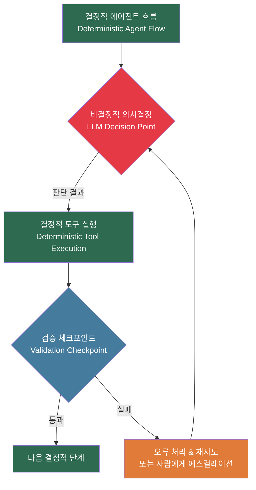
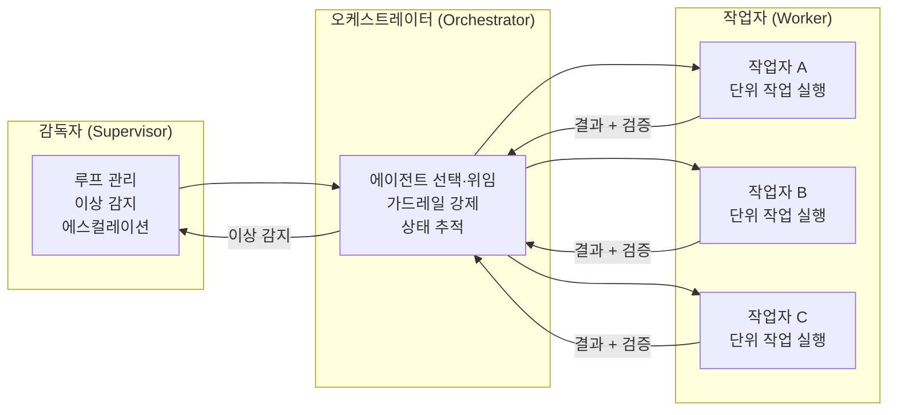
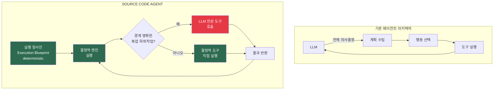
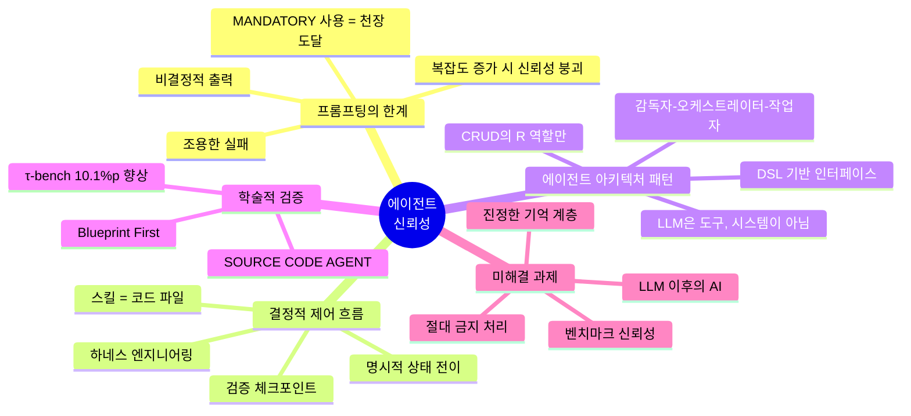
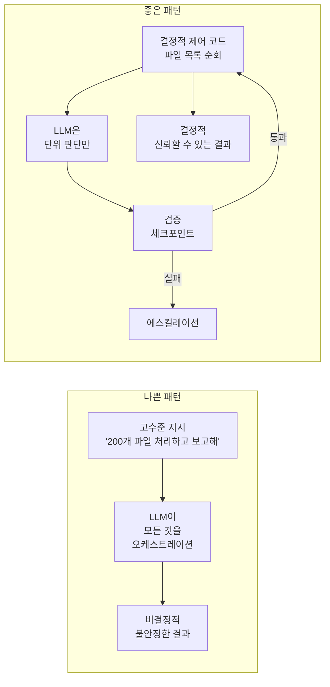
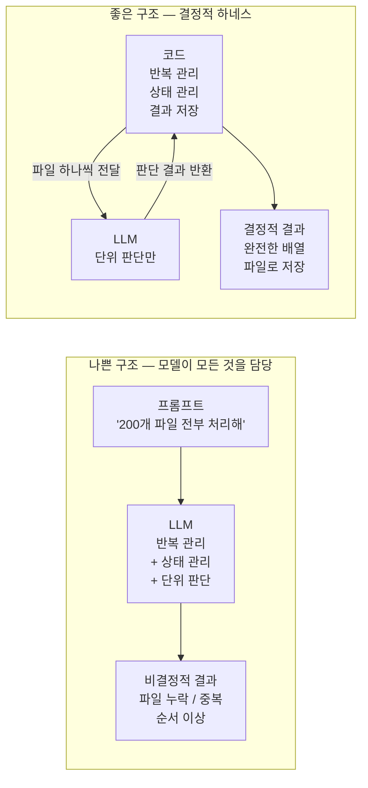
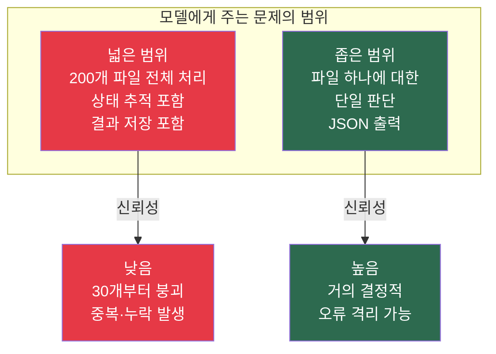

> **출처**: Brian Suh, "agents need control flow, not more prompts" (2026년 5월 7일, bsuh.bearblog.dev)  
> **논의**: Hacker News 토론 스레드 (ycombinator), GeekNews 한국어 요약 (2026년 5월 8일, news.hada.io/topic?id=29296)

---

## 들어가며 — 프롬프트 한계의 신호탄

소프트웨어 엔지니어 Brian Suh가 2026년 5월 7일 자신의 블로그에 올린 짧지만 날카로운 글은 AI 에이전트 개발 커뮤니티에서 즉각 광범위한 공감과 논쟁을 불러일으켰다. 글의 핵심 논제는 단 한 문장으로 요약된다. "복잡한 작업을 안정적으로 처리하는 에이전트에는 더 정교한 프롬프트 체인이 아니라, 소프트웨어에 인코딩된 결정적(deterministic) 제어 흐름이 필요하다."

그는 독자들에게 하나의 진단 기준을 제시한다. 프롬프트 안에 `MANDATORY`나 `DO NOT SKIP` 같은 표현을 쓴 적이 있다면, 그 순간이 바로 프롬프팅의 천장에 부딪힌 지점이라는 것이다. 이 글이 GeekNews를 통해 한국 개발자 커뮤니티에도 소개되었고, Hacker News에는 수십 개의 실전 경험담이 달리면서 이 논제를 둘러싼 입체적인 토론이 형성되었다.

본 문서는 Brian Suh의 원문 논지, Hacker News의 실전 사례들, 그리고 이 주제와 직접 연결되는 학술 연구까지를 종합하여, AI 에이전트 신뢰성 문제의 구조를 상세히 분석한다.

---

## 1. 핵심 논지 — 프롬프트 체인의 구조적 한계

### 1-1. "환각하면서 Success를 반환하는 프로그래밍 언어"

Brian Suh는 프롬프트 체인의 본질적 취약성을 설명하기 위해 강렬한 비유를 사용한다. 문장이 명령이 아니라 제안(suggestion)처럼 작동하고, 함수가 실제로는 환각을 하면서도 "Success"를 반환하는 프로그래밍 언어를 상상해 보라는 것이다. 이런 언어에서는 복잡도가 커질수록 추론이 불가능해지고, 신뢰성이 연쇄적으로 무너진다.

이 비유가 정확하게 포착하는 것은 LLM 기반 에이전트의 근본 특성이다. 전통적인 소프트웨어는 "코드가 하위 계층까지 전부다(code all the way down)"라는 원칙 위에서 예측 가능한 동작을 제공하며, 이를 통해 국소적 추론(local reasoning)이 가능하다. 함수를 호출하면 동일한 입력에 대해 동일한 출력이 나온다는 보장이 있기 때문에, 라이브러리·모듈·함수로 구성되는 재귀적 조합성(recursive composability)을 통해 시스템이 확장될 수 있다.

반면 프롬프트 체인은 이 성질을 갖지 않는다. 좁은 단일 작업에는 유용하지만, 비결정적(non-deterministic)이고 명세가 약하며 검증이 어렵다. 시스템의 복잡도가 증가할수록 프롬프트 체인의 신뢰성은 근본적으로 저하된다.

### 1-2. 결정적 스캐폴드의 요건

Suh가 제안하는 해결 방향은 논리를 자연어 설명(prose)에서 꺼내 런타임(runtime)으로 옮기는 것이다. 그가 말하는 "결정적 스캐폴드(deterministic scaffold)"는 다음 두 가지 요소를 포함한다.

첫째, 명시적 상태 전이(explicit state transitions)다. 에이전트가 어떤 상태에서 어떤 조건을 만족할 때 다음 상태로 이동하는지를 코드로 명확히 정의해야 한다는 뜻이다. LLM이 "다음에 무엇을 할지"를 매번 확률적으로 결정하게 내버려 두어서는 안 된다.

둘째, 검증 체크포인트(validation checkpoints)다. 각 단계의 출력이 다음 단계의 입력으로 들어가기 전에 프로그램적으로 검증되어야 한다. 이를 통해 에이전트는 시스템 전체가 아닌 하나의 구성요소(component)로 다루어진다.

### 1-3. 결정적 오케스트레이션만으로는 충분하지 않다 — 조용한 실패의 문제

Suh의 논지에서 특히 중요한 통찰이 있다. 결정적 오케스트레이션이 신뢰성 확보의 절반에 불과하다는 점이다. LLM 기반 시스템은 "조용한 실패(silent failure)"에 취약하다. 다시 말해, 내부적으로 잘못된 경로를 택하거나 틀린 결론에 도달했음에도 겉으로는 아무런 오류 신호를 내지 않을 수 있다.

따라서 공격적인 오류 감지(aggressive error detection) 없이는 에이전트가 결국 잘못된 결론에 매우 빠르게 도달하는 수단이 될 뿐이다. 프로그램적 검증이 부재할 때 개발자에게 남는 선택지를 그는 세 가지로 정리했다.

```
1. 감시자(Babysitter)   : 사람이 루프 안에 상주하며 오류가 전파되기 전에 잡는다.
2. 감사자(Auditor)      : 실행 완료 후 전체 결과를 사후 검증한다.
3. 기도(Prayer)         : 분위기상(vibe) 출력을 수용한다.
```

이 세 번째 선택지인 "기도"는 농담처럼 들리지만, 실제로 많은 에이전트 시스템이 이 상태에서 운영되고 있다는 점을 꼬집는 것이다.

---

## 2. Hacker News 커뮤니티의 현장 증언들

Hacker News에 달린 댓글들은 이 논제를 추상적 논의에서 구체적인 현장 경험의 영역으로 끌어내렸다. 아래에서는 논의의 흐름을 주제별로 재구성한다.

### 2-1. 200개 파일 QA 에이전트 붕괴 사례

가장 많은 공감을 받은 댓글은 한 개발자의 직접 경험이었다. 그는 브라우저 세션에서 요구사항 Markdown 파일 200개를 순회하며 각 파일별로 앱이 요구사항을 만족하는지 확인하는 QA 에이전트를 구축했다. 초기에는 팀 효율을 크게 높여주는 좋은 시스템이었다.

그런데 고수준 제어 흐름을 모델에게 맡겼을 때 30개쯤부터 시스템이 무너지기 시작했다. 파일을 빠뜨리거나, 특정 파일 묶음을 세 번씩 중복 테스트해 3분이면 끝날 작업을 10분으로 늘리거나, 한 파일의 오류 때문에 이전 파일 4개를 이유 없이 재테스트하는 현상이 반복됐다. 주목할 것은 이 문제가 Opus 4.6과 GPT 5.4는 물론이고 Opus 4.7과 GPT 5.5에서도 동일하게 나타났다는 점이다. 즉 이것은 특정 모델의 결함이 아니라 아키텍처 수준의 문제다.

해결책은 모델 주변에 극도로 단순한 결정적 하네스(deterministic harness)를 만드는 것이었다. 각 테스트 케이스마다 모델을 호출해 테스트하고, 결과를 배열에 저장한 뒤 파일로 쓰는 명시적 루프를 코드로 작성했더니 신뢰성이 압도적으로 개선됐다. 반복문, 상태 관리, 결과 저장이라는 제어 흐름을 모두 코드가 담당하고, 모델은 오직 단위 판단에만 집중하게 한 것이다.

그는 Cursor Cloud Agents나 Anthropic 같은 관리형 에이전트 플랫폼들이 "에이전트가 전부 실행해야 한다"는 생각에 너무 집착하고 있어서, 적절한 지점에 약간의 결정성을 넣는 것이 얼마나 가치 있는지를 이해하지 못하는 것 같다고 비판했다.

이어지는 부 댓글에서는 흥미로운 정치경제학적 분석도 나왔다. 과거에는 플랫폼 업체들이 토큰 비용에서 수익을 얻지만 사용자가 만든 스캐폴딩에서는 돈을 못 받기 때문에 프롬프트 중심 워크플로를 밀어붙인다고 생각했지만, 지금은 그보다 더 심층적인 이유가 있어 보인다는 것이다. 스캐폴딩이 필요하다는 사실을 인정하는 순간, "AI가 전체 사람과 전체 워크플로를 대체한다"는 주장에 찬물을 끼얹게 되기 때문이다.

### 2-2. `apply_patch`에 컴파일·테스트 검증을 결합한 사례

다른 개발자는 `apply_patch` 도구에 `check_compilation`과 `run_unit_tests`를 결합하는 방식으로 에이전트 성공률을 약 80%에서 거의 결정적 수준까지 끌어올린 경험을 공유했다. 도구의 이름은 여전히 `apply_patch`이지만, 이제 패치 적용 성공 시 빌드 및 테스트에 관한 추가 정보도 반환한다. 핵심은 프롬프트에 "컴파일하고 단위 테스트를 실행해라"라고 설명할 필요 없이, 도구 자체가 의존 조건을 실행하고 그 결과를 반환하도록 만들었다는 것이다.

이 사례는 Brian Suh의 논지를 구체적으로 구현한 예이기도 하다. 검증 로직을 프롬프트 안에 두는 것이 아니라, 도구의 동작 자체에 내장한 것이다.

이 개발자는 또한 선불 토큰(prepaid tokens)과 커스텀 하네스를 오래전부터 사용해왔으며 잘 작동한다고 덧붙이며, "Copilot류 도구가 더 이상 필요 없는 코드베이스도 있고, 같은 GPT 5.4 기반 모델을 사용하는데도 성능 차원이 아예 달라지는 경우가 있다"고 강조했다.

### 2-3. "오케스트레이션 프롬프트를 컴파일하라" — SKILL.md 패턴

한 커뮤니티 참여자는 핵심 비결이 "오케스트레이션 프롬프트를 컴파일하는 것"이라고 표현했다. 프롬프트를 코드로 바꾸면, 그 코드가 에이전트를 실행하거나 다른 코드를 실행하거나 둘 다 할 수 있어 결정성 문제가 해소된다는 것이다.

특히 Claude Code의 `SKILL.md` 패턴을 언급하며, 많은 개발자들이 `SKILL.md` 파일만 두고 코드는 없는 방식을 사용하는 경향이 있다고 지적했다. `SKILL.md` 옆에 `skill.py`를 함께 두면 특정 동작을 보장할 수 있는데, 다들 프롬프트 작성에만 집중하는 경향이 있다는 것이다. CLI를 별도로 만들 필요도 없이, 작업 로직을 담은 단순한 `skill.py` 파일 하나면 충분하고, `claude -p`를 호출하는 헬퍼도 넣을 수 있다.

### 2-4. "실행 시점이 아닌 설계 시점에 소프트웨어를 작성하라"

취지에는 동의하지만 결론이 다르다는 반론도 나왔다. 프롬프트의 한계에 부딪혔을 때, 실행 시점에 LLM으로 작업을 수행하려 하기보다 **작업을 수행할 소프트웨어 자체를 LLM으로 작성하게 해야 한다**는 것이다. 이 관점에서 실행 시점의 LLM 역할은 사용자가 엄격한 비즈니스 규칙이 내장된 소프트웨어 시스템에 맞는 입력을 고르도록 돕는 번역기 수준으로 축소된다.

이를 실험한 개발자는 첫 주에는 프롬프트가 계속 커지고 성능이 떨어지는 경험을 했고, 둘째 주에는 방향을 전환했다. 노트, 작업, 프로젝트, 사람 같은 도메인 객체를 명확히 정의하고 그 객체들에 대해 잘 정의된 메서드를 구현하는 데 집중했더니, 에이전트 인터페이스는 자연어를 명령과 인자로 변환하는 얇은 번역 계층으로 줄어들었다고 보고했다.

### 2-5. 하드웨어-모바일 인터페이스 라이브러리 자동화 사례

또 다른 개발자는 하드웨어 제어 서버와 모바일 앱 사이의 인터페이스 라이브러리 생성을 자동화한 사례를 상세히 공유했다. 하드웨어팀의 문서·스프레드시트 명세를 TSV로 변환하고, 이를 Claude에 보내 사람이 작성한 명세의 미묘한 뉘앙스를 유지하는 TSV 파서를 작성하게 하는 과정에서 150회가 넘는 반복이 필요했다. 이후 Claude가 Apollo 위에 커스텀 접착 코드를 얹어 모바일 앱용 코드 생성기를 만드는 데 기여했다.

이 파이프라인은 GitHub Actions에 통합되어 있으며, 라이브러리 검증기가 실패할 때만 Claude를 호출한다. 실패 시 Claude가 문제를 진단하고 해결책을 제안하며 PR을 생성하고, 사람이 검토·수정·병합하는 구조다. 이 전체 과정에 든 비용은 총 350달러 미만이었다고 한다.

이 사례는 LLM을 상시 작동하는 오케스트레이터로 두는 것이 아니라, 특정 조건(검증 실패)에서만 호출되는 전문 도구로 배치하는 하이브리드 패턴을 잘 보여준다.

### 2-6. 도메인 특화 언어(DSL)를 에이전트 인터페이스로

한 팀은 처음에 에이전트에게 데이터 구조를 조작할 수 있는 도구 목록을 제공했지만 너무 취약하다는 것을 발견했다. 현재는 작은 도메인 특화 언어(DSL)와 단일 도구를 사용하고, 에이전트가 그 언어로 작성한 스크립트를 입력으로 받는다. 더 동적인 사용 사례를 처리할 수 있고, 잘못된 문법은 파서가 잡아내 에이전트에 피드백을 돌려줄 수 있다는 장점이 있다.

이 패턴은 에이전트의 자유도를 적절히 제한하면서도 유연성을 유지하는 정교한 균형점이다. 에이전트가 "무엇이든 할 수 있는" 상태에서 "이 언어의 문법 안에서 무엇이든 할 수 있는" 상태로 범위가 제한되는 것이다.

### 2-7. NoSQL의 역사가 반복되는가

한 참여자는 흥미로운 기술 역사적 유추를 제시했다. 몇 년 뒤에도 사람들이 LLM을 쓰긴 하지만 결국 배워야 하는 통제된 어휘와 문법을 통해서만 쓰게 된다면 웃긴 상황이 될 것이라고 했다. 15년 전 모두가 NoSQL로 이동하더니 곧바로 JSON 안에 스키마를 다시 만든 것과 같은 패턴이라는 것이다.

자유도가 지나치게 높으면 시스템이 불안정해지고, 결국 그 자유도를 다시 구조로 제약하는 방향으로 수렴한다는 역사적 반복을 지적하는 통찰이다.

### 2-8. 2023년 Auto-GPT의 교훈

2023년 Auto-GPT 당시를 기억하는 한 참여자는 그때도 이미 같은 패턴이 보였다고 회상했다. 사람들이 GPT에게 "운전"을 시켰지만, 실제로 필요했던 것의 대부분은 `import duckduckgo`와 `import llm` 두 줄로 시작하는 Python 10줄짜리 코드와 몇 번의 `llm()` 호출이었다. 반면 당시의 에이전트 방식은 같은 작업을 가장 비싸고, 느리고, 신뢰성 낮은 방식으로 실행했다. 몇 시간씩 돌다가 산만해지거나 원래 목적을 잊어버리기도 했다.

현재 모델들은 그때보다 훨씬 나아졌지만, 핵심 교훈은 그대로다. 부실하게 명세된 제어 흐름을 가능한 한 가장 비싼 방식으로 실행하는 것은 여전히 나쁜 설계라는 것이다.

### 2-9. 감독자-오케스트레이터-작업자 3계층 구조

"건너뛰지 마라(DO NOT SKIP)"가 실패하는 이유는 에이전트가 너무 많은 책임을 지고 있고, 문맥 내의 다른 내용들이 해당 지침에서 주의를 빼앗기 때문이라는 분석도 있었다. 그렇다고 지침 강제를 담당하는 에이전트가 작업을 담당하는 에이전트와 동일할 필요는 없다. 이 참여자는 결정적 제어 흐름에 지능적 의사결정을 인코딩하는 방법론을 시험해봤지만, 너무 경직되면 작동하지 않고 너무 복잡하면 에이전트를 쓰는 것보다 설정·유지보수 비용이 더 들었다고 밝혔다.

그 결과 그가 도달한 구조는 세 종류의 에이전트가 각자의 역할을 분담하는 계층이다. 루프를 관리하고 문제 발생 시 적절한 처리를 가동하는 **감독자(Supervisor)**, 적절한 에이전트에 위임하고 가드레일을 강제하는 **오케스트레이터(Orchestrator)**, 그리고 실제 작업 단위를 실행하는 **작업자(Worker)** 다.

### 2-10. 벤치마크 신뢰성에 대한 의문

짧지만 중요한 지적도 있었다. 일부 에이전트 성능 벤치마크는 동일한 문제에 여러 번 시도하게 한 뒤 단 한 번이라도 성공하면 그 결과만 채택하고 실패율은 무시한다는 것이다. 이런 평가 방식은 실제 배포 환경에서의 신뢰성과 큰 괴리를 만들며, "모델 성능이 좋아지고 있으니 지금의 아키텍처 문제도 곧 해결될 것"이라는 낙관론의 근거를 부풀리는 결과를 낳는다.

### 2-11. AI의 근본적 한계에 대한 심층 논의

가장 철학적인 논의는 LLM이 본질적으로 필요로 하는 다음 세대의 개선에 관한 것이었다. 한 참여자는 LLM이 "절대 X 하지 마라"는 지시를 많은 작업 끝에도 "제발 X 해라"처럼 받아들이는 현상이 동작 방식의 근본에 가깝다고 지적했다. 이는 프롬프트 엔지니어링의 문제가 아니라 아키텍처의 문제다.

그가 희망하는 구조는 두 가지다. "절대 X 하지 마라"를 인간처럼 처리하는 구조, 그리고 "컨텍스트 창" 대신 인간과 유사한 기억 계층을 갖는 구조다. 현재의 기억 시스템은 AI가 스스로 써두고 매번 확인하는 포스트잇 체계에 가까울 뿐, 학습을 가능하게 하고 유연하게 발동되는 통합적 기억 시스템은 아니라는 것이다.

### 2-12. 선언형 패러다임 논쟁

한 참여자는 Brian Suh의 "함수가 환각하면서 Success를 반환하는 언어" 묘사가 본질적으로 선언형 프로그래밍에 가깝다는 흥미로운 분석을 제시했다. SQL처럼 무엇을 원하는지를 명시하고 어떻게 할지는 엔진에 맡기는 방식이 에이전트와 유사하다는 것이다.

이에 대한 반론도 빠르게 나왔다. SQL의 선언성은 관계 대수라는 수학적 기반 위에 있기 때문에 매번 동일한 결과를 반환한다. 반면 LLM은 쿼리 자체가 매 실행마다 다르게 해석될 수 있다. 찾고자 하는 것은 선언형성(declarativeness)이 아니라 **결정성(determinism)** 이며, 비결정적 LLM에 선언형으로 "이 최종 상태로 데려가라"고 지시하면 궤도를 벗어날 가능성이 오히려 더 커진다는 것이다.

"서사형 프로그래밍(narrative programming)"이라는 신조어를 제안한 참여자도 있었다. 실제로 우리는 AI에게 목표를 해석시키는 것이 아니라, 인간 대역 캐릭터가 컴퓨터 캐릭터와 대화하는 이야기 문서를 만들고, LLM이 그 이야기를 더 응집력 있게 이어가면서 유용한 것을 캐내기를 바라는 구조라는 것이다.

---

## 3. 아키텍처 패턴의 정리

Hacker News 논의에서 등장한 패턴들을 구조화하면 다음과 같다.

### 3-1. 조직 내 도입 경로의 진화

대부분의 조직에서 LLM 활용의 진화는 세 단계를 거친다고 한 참여자는 정리했다.

```
1단계: llm → prompt → result
       (LLM이 모든 판단과 실행을 담당)

2단계: llm → prompt + prompt encoded as skill → result
       (스킬이 프롬프트 형태로 존재, 여전히 비결정적)

3단계: llm → prompt + deterministic code encoded as skill → result
       (스킬이 실행 가능한 코드로 구현, 결정성 확보)
```

이 진화 경로에서 핵심 전환점은 스킬이 프롬프트에서 코드로 바뀌는 2단계에서 3단계로의 이동이다. 1단계에서 코드 생성을 프롬프트로 시키면 결정적 코드로 가는 길을 단축할 수는 있지만, 여전히 비결정적 래퍼 안에 결정적 코드가 들어 있는 형태다.

### 3-2. 이상적인 아키텍처 — 결정성과 비결정성의 층위

가장 강력한 패턴으로 검증된 구조는 비결정적 LLM 판단이 결정성 계층 사이에 끼는 형태다.



녹색 박스가 결정적(deterministic) 영역이고, 빨간 박스가 비결정적(non-deterministic) LLM 영역이다. 비결정적 판단은 결정적 계층 사이에 샌드위치처럼 끼어 있으며, 각 판단의 결과는 검증 체크포인트에서 프로그램적으로 확인된다.

### 3-3. 감독자-오케스트레이터-작업자 3계층 아키텍처



### 3-4. 에이전트의 올바른 역할 범위 — CRUD 비유

한 참여자의 비유가 명쾌하다. AI가 프로덕션 시스템에서 API를 직접 호출해 무언가를 변경하는 것은 나쁜 패턴이다. 에이전트의 적절한 역할 범위는 기존 CRUD 앱의 "R(Read)"을 대체하는 것, 즉 읽기와 분류다. 같은 AI 기반 엔드포인트로 "C(Create)", "U(Update)", "D(Delete)" 폼을 자동으로 채우는 것은 괜찮지만, 사람이 검토하기 전에 실제 변경이 실행되어서는 안 된다.

이 원칙을 일반화하면, 에이전트는 **행동을 제안(suggest)할 수 있지만 직접 실행(execute)해서는 안 된다**는 것이다.

---

## 4. 관련 학술 연구 — "Blueprint First, Model Second"

Hacker News 논의에서 인용된 학술 논문 중 가장 직접적으로 관련된 것은 Alibaba Group 연구진이 발표한 **"Blueprint First, Model Second: A Framework for Deterministic LLM Workflow"** (arXiv:2508.02721)다.

### 4-1. SOURCE CODE AGENT 프레임워크

이 논문은 **SOURCE CODE AGENT**라는 새로운 아키텍처 패러다임을 제안한다. 핵심 철학은 워크플로 로직과 생성 모델을 분리하는 것이다. 전문가가 정의한 운영 절차를 먼저 소스코드 기반의 **실행 청사진(Execution Blueprint)** 으로 코드화하고, 이를 결정적 엔진이 실행한다. LLM은 워크플로의 경로를 결정하는 역할을 절대 맡지 않으며, 오직 청사진 안의 경계가 명확한 복잡한 하위 작업을 처리하는 전문 도구로만 전략적으로 호출된다.

Brian Suh의 블로그 논지를 학술적으로 구현하고 검증한 사례라고 볼 수 있다.

### 4-2. 성과 측정

연구진은 복잡한 사용자-도구-규칙 상호작용 시나리오를 위해 설계된 **τ-bench 벤치마크**에서 이 프레임워크를 평가했다. 결과는 다음과 같다.

- 기존 최강 기준선 대비 평균 Pass¹ 점수 **10.1%p 향상**으로 새로운 최고 성능 달성
- 대화 횟수 최대 **66.7% 감소**
- 도구 호출 횟수 최대 **81.8% 감소**

특히 τ-bench에서 **67.7% Pass¹**를 달성해 기존 방법들을 10%p 이상 앞섰다는 점은 결정적 청사진 기반 설계의 효과를 수치로 입증한다.



### 4-3. 현재 에이전트 아키텍처의 근본 문제

이 논문은 현재 에이전트들의 신뢰성 부족이 지능의 결함이 아니라 아키텍처 설계에서 비롯된다고 진단한다. 현재 프레임워크들은 높은 수준의 전략적 추론과 낮은 수준의 행동 선택을 하나의 생성 과정 안에 뒤섞는 경향이 있다. 이 "무엇을(what)"과 "어떻게(how)"의 혼합이 비결정적 실행 경로를 낳고, 절차적 충실성이 요구되는 작업에서 신뢰성 보장을 어렵게 만든다.

---

## 5. 전체 구조 요약 — 개념 지도

지금까지의 논의를 하나의 개념 지도로 정리하면 다음과 같다.



---

## 6. 비판적 시각 — 논의에서 제기된 반론들

Hacker News 논의는 Brian Suh의 논제를 일방적으로 지지하지만은 않았다. 몇 가지 중요한 반론들도 제기됐다.

**"에이전트를 추가하면 된다"는 단순화**: 감독자-오케스트레이터-작업자 구조가 이론적으로 우아하지만, 실제로 구현하면 시스템의 복잡도가 폭발적으로 증가한다는 지적이 있었다. 결정적 제어 흐름을 너무 경직되게 만들면 예외 상황에 대응하지 못하고, 너무 유연하게 만들면 에이전트를 그냥 쓰는 것보다 유지보수 비용이 더 들게 된다.

**경계 사례 처리의 딜레마**: 실제 시스템은 해석이 필요한 경계 사례를 끊임없이 만난다. 그 순간마다 LLM에게 맡기고 싶어지고, 그러다 보면 전체 반복문과 도구 호출까지 LLM에게 귀속되는 경향이 있다. 결정성과 유연성 사이의 균형을 어디서 잡을지는 여전히 공학적 판단의 영역이다.

**에이전트 패러다임의 본질적 가치**: 일부 참여자는 에이전트의 비결정성이 오히려 복잡하고 창의적인 문제에서 강점이 될 수 있다고 주장했다. 모든 것을 결정적 코드로 대체하려는 시도는 에이전트 패러다임이 잘 하는 일까지 빼앗는 것일 수 있다는 것이다.

---

## 7. 실무 적용 원칙 — 현장에서 검증된 패턴

논의 전체를 종합하면, 실무에서 적용 가능한 원칙들을 다음과 같이 정리할 수 있다.

첫째, **제어 흐름(반복, 상태 관리, 결과 집계)은 코드로 작성하라.** LLM에게 "이 디렉터리의 모든 파일을 처리하라"고 맡기지 말고, 파일 목록 순회를 외부 코드가 담당하고 LLM은 각 파일에 대한 단위 판단만 하도록 한다.

둘째, **도구에 검증 로직을 내장하라.** 프롬프트에 "컴파일하고 테스트를 실행해라"라고 쓰는 대신, 도구 자체가 이를 수행하고 결과를 반환하도록 만든다.

셋째, **스킬은 Markdown 설명이 아닌 실행 가능한 코드로 구현하라.** `SKILL.md` 옆에 `skill.py`를 두고, 보장해야 하는 동작은 코드로 인코딩한다.

넷째, **모호한 경계 사례는 에스컬레이션하라.** "모호한 경계 사례를 만나면 나에게 문의하라"를 프롬프트에 명시하고, LLM이 불확실한 상황에서 스스로 판단하는 것을 방지한다.

다섯째, **LLM을 실행 시점의 오케스트레이터가 아닌 설계 시점의 코드 작성자로 활용하라.** 실행 시점에 LLM이 직접 복잡한 작업을 수행하게 하는 것이 한계에 부딪혔다면, 그 작업을 수행할 소프트웨어를 LLM과 함께 설계하는 방향으로 전환한다.



---

## 8. 결론 — 프롬프트에서 하네스 엔지니어링으로

Brian Suh의 블로그 포스트와 이를 둘러싼 커뮤니티 논의는 AI 에이전트 개발의 패러다임 이동을 가리키고 있다. 그 이동의 방향은 프롬프트 엔지니어링에서 하네스 엔지니어링(harness engineering)으로의 전환이다.

프롬프트 엔지니어링이 자연어로 LLM에게 올바른 출력을 유도하는 기술이었다면, 하네스 엔지니어링은 LLM이 실패해도 시스템이 살아남을 수 있는 결정적 구조를 코드로 구축하는 기술이다. LLM은 이 구조 안에서 경계가 명확히 정의된 하위 작업을 담당하는 구성 요소로 자리 잡는다.

Alibaba의 SOURCE CODE AGENT가 τ-bench에서 10.1%p의 성능 향상과 함께 도구 호출을 81.8% 줄이는 효율을 보인 것은, 이 방향의 공학적 타당성을 학술적으로도 뒷받침한다.

물론 모든 문제가 이 패턴으로 해결되는 것은 아니다. 결정성과 유연성 사이의 균형, 경계 사례의 처리, LLM의 진정한 기억 계층 부재 같은 근본적 한계들은 여전히 열려 있는 공학적·연구적 과제다. 하지만 "더 강한 프롬프트"가 답이 아니라는 합의는 이미 현장의 실천적 경험에 의해 충분히 검증되고 있다.

---

## 별첨 — 결정적 하네스(Deterministic Harness)란 무엇인가

### A-1. 문제 상황의 재현 — "모델에게 제어 흐름을 맡겼을 때"

200개 파일을 처리하는 QA 에이전트 사례에서 실패의 핵심 원인은 명령 자체가 아니라 **누가 반복을 관리하느냐**에 있었다. 개발자가 모델에게 건넨 지시는 대략 이런 형태였다.

```
이 디렉터리의 요구사항 파일들을 보고,
각 파일마다 앱이 그 요구사항을 만족하는지 확인하는
할 일 항목을 만들어라.
```

이 한 문장 안에는 사실 세 가지 책임이 뒤섞여 있다. 첫째는 파일 목록을 파악하고 하나씩 순회하는 **반복 관리**, 둘째는 어느 파일을 처리했고 어느 파일이 남았는지 추적하는 **상태 관리**, 셋째는 각 파일에 대한 실제 판단인 **단위 평가**다. 모델은 이 세 가지를 동시에 맡는다.

모델이 이 세 가지를 동시에 잘 수행하는 것처럼 보이는 이유는, 짧은 작업에서는 실제로 잘 작동하기 때문이다. 10개, 20개 파일까지는 문제없이 동작한다. 그러나 30개를 넘어서면 컨텍스트가 길어지면서 앞서 처리한 파일들의 목록과 현재 위치가 뒤섞이고, 모델이 상태를 잃기 시작한다. 파일을 건너뛰거나 같은 파일을 중복 처리하거나, 한 파일에서 오류가 발생했을 때 이전 파일들을 이유 없이 재처리하는 현상이 나타난다. 이것은 모델이 나빠서가 아니라, **LLM의 컨텍스트 창이 신뢰할 수 있는 상태 추적 메커니즘이 아니기 때문**이다.

### A-2. 결정적 하네스의 개념 — 책임의 분리

해결책은 세 가지 책임을 다시 분리하는 것이다. 반복 관리와 상태 관리는 코드가 맡고, 모델은 단위 평가에만 집중하게 한다. 이 구조를 가리켜 **결정적 하네스(deterministic harness)** 라고 부른다. 하네스(harness)는 말의 마구처럼 힘을 올바른 방향으로 제어하는 틀이라는 뜻이다. 모델의 추론 능력이라는 힘을 낭비 없이 단위 판단에만 집중시키는 틀이 바로 결정적 하네스다.



### A-3. 코드로 본 구조적 차이

**나쁜 패턴 — 제어 흐름을 프롬프트에 담는 경우**

```python
# 모델이 반복, 상태, 판단을 모두 처리하게 맡기는 방식
prompt = """
/requirements 디렉터리에 있는 모든 Markdown 파일을 열어서
각 파일의 요구사항을 현재 앱이 충족하는지 확인하고
결과를 requirements_report.json에 저장해라.
빠뜨리지 말고 전부 처리해라.
"""

result = call_llm(prompt)  # 모델이 알아서 처리하기를 기도
```

이 코드에는 반복 횟수를 보장하는 로직이 없다. 모델이 실제로 200개를 전부 처리했는지 확인하는 수단이 없다. 오류가 발생했을 때 어느 지점에서 멈췄는지 알 수 없다.

**좋은 패턴 — 결정적 하네스**



```python
import os
import json
from pathlib import Path

def check_requirement(file_path: str, file_content: str) -> dict:
    """
    모델에게 단 하나의 파일에 대한 단위 판단만 요청한다.
    제어 흐름(순회, 상태 추적)은 이 함수 밖에 있다.
    """
    prompt = f"""
    다음 요구사항 파일의 내용을 보고,
    현재 앱이 이 요구사항을 충족하는지 판단해라.
    반드시 JSON으로 답해라: {{"satisfied": true/false, "reason": "..."}}

    ---
    파일: {file_path}
    내용:
    {file_content}
    """
    response = call_llm(prompt)
    return json.loads(response)


def run_qa_harness(requirements_dir: str, output_path: str):
    """
    결정적 하네스: 반복, 상태 관리, 결과 저장을 코드가 담당한다.
    """
    results = []   # 결과를 저장하는 배열 — 코드가 관리
    errors  = []   # 오류 목록 — 코드가 관리

    # 파일 목록을 코드가 직접 수집 (모델에게 맡기지 않음)
    files = sorted(Path(requirements_dir).glob("*.md"))
    total = len(files)

    for i, file_path in enumerate(files):
        print(f"처리 중: {i+1}/{total} — {file_path.name}")

        try:
            content = file_path.read_text(encoding="utf-8")

            # 모델은 이 한 줄에서만 호출됨 — 단위 판단만 담당
            judgment = check_requirement(str(file_path), content)

            results.append({
                "file": file_path.name,
                "satisfied": judgment["satisfied"],
                "reason": judgment["reason"],
            })

        except Exception as e:
            # 오류가 발생해도 전체 루프는 계속됨 — 코드가 보장
            errors.append({"file": file_path.name, "error": str(e)})
            print(f"  오류 발생: {e} — 계속 진행")

    # 결과 저장 — 코드가 직접 수행 (모델에게 위임하지 않음)
    output = {"total": total, "results": results, "errors": errors}
    Path(output_path).write_text(json.dumps(output, ensure_ascii=False, indent=2))
    print(f"\n완료: {total}개 처리, {len(errors)}개 오류")
    return output


# 실행
run_qa_harness("/requirements", "qa_report.json")
```



두 패턴의 차이를 한 문장으로 요약하면, **코드는 항상 200번 반복한다. 모델은 그것을 보장할 수 없다.**

### A-4. 결정적 하네스가 보장하는 것들

코드로 제어 흐름을 가져오면 다음 네 가지를 확실히 보장할 수 있다.

**완전성(Completeness)**: 파일 목록을 코드가 수집하므로 어떤 파일도 누락되지 않는다. 모델의 컨텍스트가 길어져도 파일 순회는 영향받지 않는다.

**멱등성(Idempotency)**: `for` 루프는 같은 파일을 두 번 처리하지 않는다. 중복 처리 문제가 구조적으로 불가능해진다.

**오류 격리(Error Isolation)**: `try/except` 블록이 하나의 파일에서 발생한 오류가 나머지 처리를 중단시키지 않도록 막는다. 오류가 전파되지 않는다.

**검증 가능성(Verifiability)**: 처리한 파일 수, 성공 수, 오류 수를 코드가 직접 집계하므로 실행 결과를 프로그램적으로 검증할 수 있다. `len(results) == total`인지 확인하면 된다.

### A-5. 모델의 역할을 더 좁게 만들수록 신뢰성이 올라간다

결정적 하네스의 핵심 통찰은 모델에게 주어지는 문제의 범위가 좁을수록 출력의 신뢰성이 높아진다는 것이다. 위의 `check_requirement` 함수가 모델에게 묻는 것은 단 하나다. "이 파일의 요구사항을 앱이 충족하는가?" 이 질문에는 컨텍스트가 짧고, 기대되는 출력 형식이 명확하며(`{"satisfied": ..., "reason": ...}`), 판단 실패 시 영향 범위가 오직 해당 파일 하나로 제한된다.



이 구조에서 모델의 실패는 전체 파이프라인의 실패가 아니라 특정 파일 하나의 판단 오류로 국소화된다. 오류를 `errors` 배열에 수집해 두고 이후에 재처리하거나 사람이 검토하면 된다. 반면 나쁜 패턴에서는 모델이 어느 지점에서 무엇을 실패했는지조차 알기 어렵다.

### A-6. "프롬프트 컴파일"의 의미

HN 댓글에서 "오케스트레이션 프롬프트를 컴파일하라"는 표현이 나왔는데, 이것이 바로 결정적 하네스를 만드는 행위를 다르게 표현한 것이다. 자연어로 작성된 고수준 지시를 — "200개 파일을 전부 처리해라" — 실행 가능한 코드로 변환(컴파일)하면, 그 코드가 반복과 상태를 담당하고 모델은 코드 안에서 좁은 범위의 판단자로 동작한다.

```
컴파일 전 (자연어 프롬프트):
  "이 디렉터리의 요구사항 파일을 모두 처리하고 보고서를 만들어라"

컴파일 후 (결정적 하네스):
  for file in files:              ← 반복: 코드가 보장
      result = llm(file)          ← 판단: 모델이 담당
      results.append(result)      ← 상태: 코드가 보장
  write(results, "report.json")   ← 저장: 코드가 보장
```

한 참여자가 `SKILL.md` 옆에 `skill.py`를 두라고 강조한 것도 같은 맥락이다. Markdown으로 작성된 스킬 설명이 "프롬프트 상태"의 스킬이라면, 함께 있는 Python 파일이 "컴파일된 상태"의 스킬이다. 보장해야 하는 동작이 있다면 반드시 코드로 인코딩해야 한다.

### A-7. 한계와 주의사항

결정적 하네스가 만능은 아니다. 몇 가지 전제 조건과 한계를 분명히 해둘 필요가 있다.

**모델의 단위 판단은 여전히 비결정적이다.** 하네스가 보장하는 것은 200번의 반복과 결과 저장이지, 각 판단의 정확성이 아니다. 개별 판단의 품질은 여전히 모델 성능과 프롬프트 품질에 달려 있다.

**경계 사례는 에스컬레이션 경로가 필요하다.** 모델이 "판단 불가"를 반환하거나 JSON 파싱이 실패하는 경우를 코드가 처리해야 한다. 이때 무조건 재시도하거나 기본값을 쓰는 것은 조용한 실패를 만드는 위험한 패턴이다. 불확실한 경우는 별도 큐에 쌓아 사람이 검토하는 경로를 두는 것이 올바르다.

**작업이 진정으로 순차 의존적일 때는 별도 설계가 필요하다.** 파일 A의 결과가 파일 B의 판단에 영향을 주는 경우, 단순한 독립 루프로는 처리하기 어렵다. 상태 그래프나 의존성 DAG 같은 더 정교한 구조가 요구된다.

그럼에도 불구하고, 독립적인 단위 판단이 반복되는 작업 — 문서 분류, 코드 리뷰, 요구사항 검증, 데이터 레이블링 등 — 에서 결정적 하네스는 가장 즉각적이고 효과적인 신뢰성 향상 수단이다.

---

## 참고 자료

- Brian Suh, "agents need control flow, not more prompts" (2026.05.07) — https://bsuh.bearblog.dev/agents-need-control-flow/
- GeekNews 한국어 요약 및 HN 토론 번역 (2026.05.08) — https://news.hada.io/topic?id=29296
- Hacker News 원문 토론 — https://news.ycombinator.com/item?id=48051562
- Libin Qiu et al., "Blueprint First, Model Second: A Framework for Deterministic LLM Workflow" (2025.08) — arXiv:2508.02721

---

*작성일: 2026년 5월 14일*
