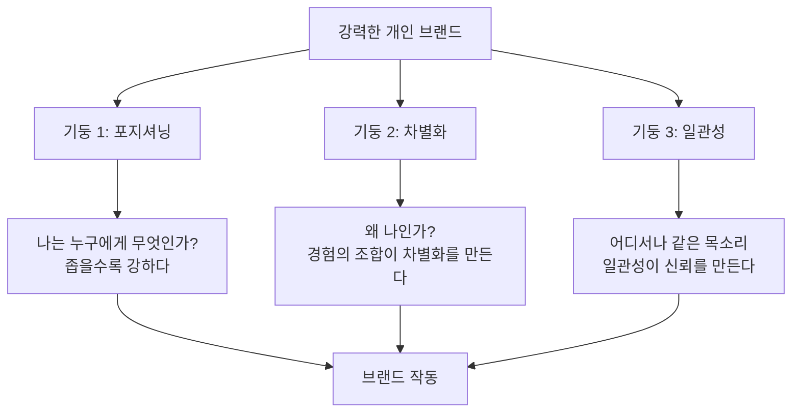
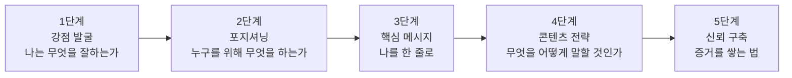
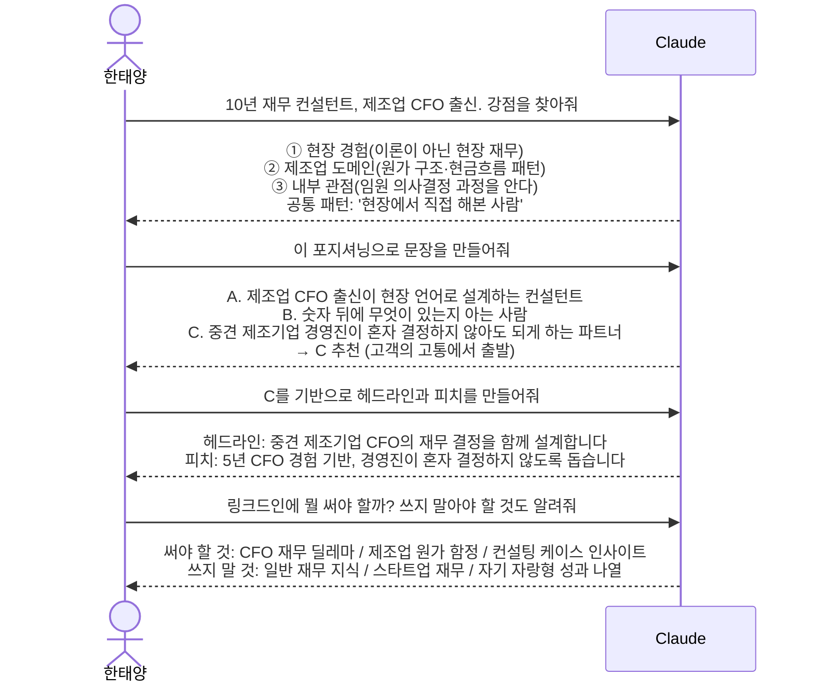
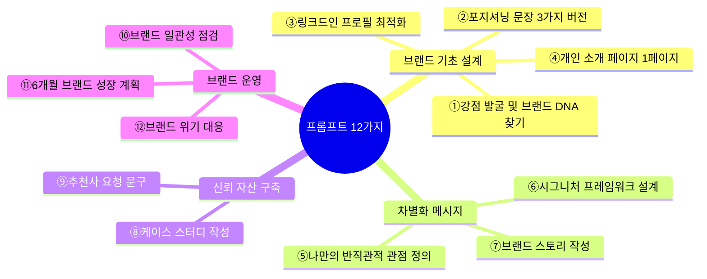
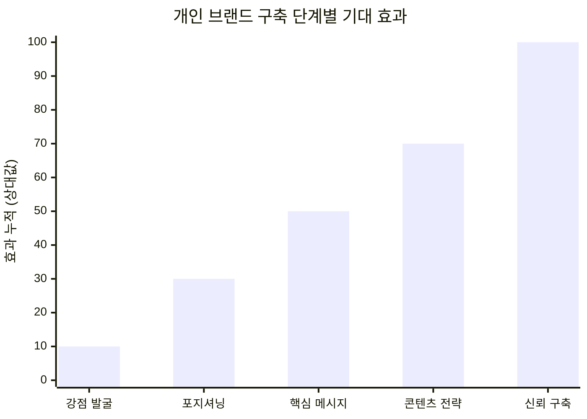

> **원문**: David Han, 브런치(Brunch), 2026년 5월 7일 발행  
> **시리즈**: *Claude, 나는 이렇게 쓴다* 【실행 편 17편】 — PART 4: 개인 브랜딩과 성장 · 두 번째 편  
> **URL**: https://brunch.co.kr/@a2424c82fc944a6/185

---

## 1. 글의 전체 개요와 맥락

이 글은 David Han이 브런치에 연재 중인 25편 시리즈 「Claude, 나는 이렇게 쓴다」의 17번째 편이다. 시리즈 전체는 Anthropic의 AI 모델인 Claude를 실제 업무와 개인 성장에 어떻게 활용하는지를 구체적인 사례와 프롬프트 중심으로 풀어내는 실용서 성격의 콘텐츠다. 17편은 그 중 PART 4 '개인 브랜딩과 성장' 파트의 두 번째 편으로, Claude를 개인 브랜드 설계 도구로 활용하는 방법을 집중적으로 다룬다.

제목이 시사하듯, 이 글의 핵심 명제는 하나다. **개인 브랜드는 AI 도구와의 대화를 통해 체계적으로 설계될 수 있다.** 저자는 이를 추상적인 이론으로 설명하는 대신, '한태양'이라는 가상의 재무 컨설턴트 인물을 통해 실제 대화 흐름을 그대로 보여주는 방식을 택했다. 프롬프트를 입력하고 Claude가 답하며, 그 답을 기반으로 다음 단계로 넘어가는 구체적인 과정이 단계별로 서술된다.

글의 출발점은 제프 베조스(Jeff Bezos)의 유명한 언명이다. "브랜드는 당신이 없을 때 사람들이 당신에 대해 하는 말이다." 이 문장은 단순한 인용이 아니라 글 전체의 논리 구조를 관통하는 핵심 전제다. 브랜드를 '내가 만드는 것'이 아니라 '타인의 머릿속에 형성되는 인식'으로 규정함으로써, 저자는 그 인식을 '의도적으로 설계'하는 것이 가능하다는 논리적 공간을 열어낸다.

---

## 2. 문제 제기: 실력과 인지도의 괴리

글은 한태양(44세)이라는 인물의 이야기로 시작한다. 서울 강남구에서 재무 컨설팅을 하는 그는 10년 경력의 전문가다. 그러나 어느 날 동기와 자신을 비교하며 불편한 사실을 마주한다. 링크드인에 1년간 꾸준히 글을 올린 동기는 팔로워 8,000명을 확보했고, 강연 요청과 책 출간 제안까지 받았다. 반면 한태양은 더 많은 프로젝트를 수행하고 더 깊은 전문성을 보유하고 있었음에도 세상에 알려지지 않았다.

저자가 이 장면을 통해 제기하는 핵심 질문은 단순하다. 왜 실력이 더 뛰어난 사람이 덜 알려지는가. 그 답 역시 단순하다. 알리는 행위를 하지 않았기 때문이다. 그러나 저자는 여기서 한 걸음 더 나아간다. 단순히 "글을 써라"가 아니라, 어떤 방향으로 어떤 내용을 써야 하는지, 즉 **브랜드 전략을 먼저 설계해야 한다**는 것이다.

한태양이 Claude에게 도움을 요청하자, Claude는 즉각 방향을 전환시키는 핵심 통찰을 제시한다.

> "브랜드는 '유명해지는 것'이 아닙니다. 특정 분야에서 특정 사람들에게 가장 먼저 떠오르는 이름이 되는 것입니다."

이 문장은 많은 사람들이 개인 브랜딩에 대해 갖는 오해, 즉 '팔로워를 많이 모아야 한다'거나 '유명인이 되어야 한다'는 인식을 정면으로 해체한다. 8,000명이 아니라, 재무 컨설팅이 필요한 중견기업 CFO가 고민하는 순간 '한태양'이 먼저 떠오르는 것. 이것이 브랜드의 본질이라는 것이다.

---

## 3. 개인 브랜드가 없으면 생기는 네 가지 패턴

저자는 개인 브랜드가 없는 전문가에게 반복적으로 나타나는 네 가지 구조적 문제를 명확히 정리한다.

첫째, 기회가 지인 네트워크에만 한정된다. 세상이 나를 모르면 모르는 사람의 기회는 원천적으로 차단된다. 아는 사람만이 연락하고, 그 아는 사람의 범위가 곧 기회의 범위가 된다.

둘째, 가격 협상에서 약자가 된다. 자신이 얼마나 뛰어난지를 알릴 수단이 없으면 시장의 평균 가격을 받을 수밖에 없다. 전문성이 알려질수록 가격 결정권이 자신에게로 이동한다.

셋째, 본인이 직접 영업하지 않으면 일감이 오지 않는다. 브랜드가 구축되면 브랜드 자체가 영업을 대신한다. 즉, 자는 동안에도 브랜드가 일한다.

넷째, 비슷한 경력의 경쟁자들과 차별화가 불가능하다. 무엇이 다른지를 설명할 언어와 구조가 없으면 선택받기 어렵다.

저자는 이 네 가지를 열거한 뒤, 중요한 단서를 붙인다. 개인 브랜드는 포장이 아니라는 것이다. 실력과 진정성이 없는 브랜드는 지속되지 못한다. Claude는 실력이 더 잘 보이도록 구조를 설계하는 도구일 뿐이고, 그 안에 담기는 진정성은 전적으로 본인의 몫이다.

---

## 4. 개인 브랜드의 세 가지 기둥

저자는 강력한 개인 브랜드가 서 있는 세 가지 기둥을 제시한다. 이 세 가지가 모두 명확할 때 비로소 브랜드가 작동한다고 설명한다.



**포지셔닝**은 '나는 누구에게 무엇인가'라는 질문에 대한 답이다. 저자는 "모든 사람에게 모든 것이 되려 하면 아무에게도 아무것도 되지 않는다"고 단언한다. '재무 컨설턴트'라는 넓은 포지션보다 '중견기업 CFO의 재무 전략을 전문으로 하는 컨설턴트'가 훨씬 강력하다. 좁을수록 강하다는 것이 이 기둥의 핵심 원리다.

**차별화**는 '왜 나인가'라는 질문에 대한 답이다. 단순히 경력 연수가 차별화가 되지는 않는다. 관점의 차이, 접근 방식의 차이, 경험의 조합이 차별화를 만든다. '10년 경력'이 아니라 '제조업 CFO 출신이 설계하는 재무 전략'이 진정한 차별화다.

**일관성**은 모든 채널에서 같은 핵심 메시지를 유지하는 것이다. 브런치에서 말하는 나, 링크드인에서 말하는 나, 실제 대면에서 말하는 나가 같아야 한다. 일관성이 신뢰를 만들고, 신뢰가 브랜드를 완성한다.

---

## 5. 개인 브랜드 설계의 5단계

이 섹션은 글의 실질적 핵심이자 가장 구체적인 실용 정보가 담긴 부분이다. Claude와 함께 개인 브랜드를 처음 설계할 때 밟는 다섯 단계가 순서대로 제시되며, 각 단계마다 바로 사용 가능한 프롬프트 템플릿이 포함된다.



### 1단계: 강점 발굴

많은 사람들이 자신의 강점을 잘 모른다. 너무 익숙해서 특별하지 않다고 느끼기 때문이다. 저자가 제시하는 원칙은 간단하다. "남에게는 어렵지만 나에게는 쉬운 것이 강점이다." 이 단계에서는 직업과 경력, 주변 사람들이 자주 물어보는 것, 자신에게는 당연하지만 남들이 어려워하는 것, 가장 자랑스러운 성과 세 가지를 Claude에게 제공하고 핵심 강점 세 가지, 강점들의 공통 패턴, 그 강점으로 도울 수 있는 사람을 도출하도록 요청한다.

### 2단계: 포지셔닝

강점이 확인되면 그것을 누구를 위해 사용할지를 결정한다. 타깃이 좁을수록 메시지가 강해진다. 이 단계의 프롬프트는 핵심 강점, 가장 잘 돕는 대상, 그들의 핵심 고통이나 욕구, 경쟁자와의 차이를 입력 변수로 삼아 '타깃을 위한, 핵심 가치를 제공하는, 나'라는 형식의 포지셔닝 문장 세 가지 버전을 생성하도록 설계된다.

### 3단계: 핵심 메시지

소개가 필요한 순간은 언제나 갑자기 찾아온다. 이 단계에서는 포지셔닝 문장을 기반으로 30초 엘리베이터 피치, 링크드인 헤드라인(60자), SNS 바이오(150자), 명함 한 줄 문구를 각각 세 가지 버전씩 생성한다. 다양한 상황에서 즉시 활용 가능한 언어 자산을 미리 설계해두는 것이다.

### 4단계: 콘텐츠 전략

브랜드는 단 한 번의 선언으로 만들어지지 않는다. 꾸준히 같은 방향으로 말하는 것이 브랜드를 형성한다. 이 단계에서는 브랜드를 강화하는 콘텐츠 카테고리 서너 가지, 각 카테고리에서 다뤄야 할 핵심 주제, 브랜드를 희석시키는 콘텐츠 유형(쓰지 말아야 할 것), 6개월 후 어떤 사람으로 기억되길 원하는지를 설계한다.

### 5단계: 신뢰 구축

브랜드는 말이 아니라 증거다. 케이스 스터디, 추천사, 결과물이 쌓일수록 브랜드는 강해진다. 이 단계에서는 성과를 케이스 스터디로 변환하는 법, 소셜 프루프 수집 방법, 포트폴리오 구성 요소, 6개월 내 확보 가능한 신뢰 증거 세 가지를 도출한다.

---

## 6. 실전 대화: 한태양의 브랜드가 만들어지는 과정

이 섹션은 글에서 가장 구체적이고 실감나는 부분이다. 위의 5단계 프레임워크가 실제로 어떻게 적용되는지를 한태양과 Claude 사이의 4턴 대화로 시뮬레이션한다.



이 대화 흐름에서 주목할 점이 두 가지 있다.

첫째, Claude는 단순히 아이디어를 나열하는 것이 아니라 **우선순위를 제시**한다는 점이다. 포지셔닝 문장 세 가지를 제안한 뒤 "C가 가장 강합니다. 고객의 고통에서 출발하기 때문입니다"라고 명확하게 선택 근거를 설명한다. 이는 AI가 단순 생성 도구가 아닌 전략적 사고 파트너로 기능함을 보여준다.

둘째, 쓰지 말아야 할 것을 함께 정의한다는 점이다. 브랜드 전략에서 '하지 말 것'은 '할 것'만큼 중요하다. 일반 재무 지식을 다루거나 스타트업 재무 이야기를 쓰면 포지션이 희석된다는 지적은 선택과 집중의 원리를 구체적으로 적용한 것이다.

이 대화의 결과로 한태양이 쓴 첫 번째 링크드인 글 제목은 "제조업 CFO가 가장 자주 혼자 결정하는 것들"이었다. 그 글은 중견 제조기업 대표의 댓글("이 글 쓴 분 만나고 싶어요")을 불러왔다.

---

## 7. 상황별 프롬프트 12가지: 실용 도구 모음

저자는 대화 사례에 이어 즉시 복사해서 사용할 수 있는 프롬프트 12가지를 제공한다. 이 부분이 이 글의 또 다른 핵심 가치다. 이론과 사례를 이해한 뒤, 실제로 무엇을 입력해야 하는지를 모르는 독자들을 위한 구체적 도구다.



이 12가지는 네 개의 영역으로 구분된다. **브랜드 기초 설계**(①~④)는 처음 브랜드를 만들 때 필요한 기본 재료를 발굴하는 프롬프트다. **차별화 메시지**(⑤~⑦)는 경쟁자와 자신을 구별 짓는 핵심 언어와 이야기를 만드는 프롬프트다. **신뢰 자산 구축**(⑧~⑨)은 주장을 뒷받침하는 증거를 만드는 프롬프트다. **브랜드 운영**(⑩~⑫)은 이미 구축된 브랜드를 점검하고 성장시키며 위기를 관리하는 프롬프트다.

특히 주목할 것은 ⑥ **시그니처 프레임워크 설계**다. 저자는 전문 지식을 나만의 프레임워크로 만드는 것이 브랜드의 '핵심 지적 자산'이 된다고 설명한다. 예컨대 '3R 재무 전략'이나 '5단계 조직 설계'처럼, 자신의 사고방식에 이름을 붙이고 체계화하면 단순한 전문가를 넘어 해당 방법론의 창안자로 포지셔닝될 수 있다는 것이다.

⑫ **브랜드 위기 대응**도 흥미로운 항목이다. 대부분의 개인 브랜딩 콘텐츠가 다루지 않는 부분인데, 저자는 온라인 비판이나 결과물 실패 같은 부정적 상황이 생겼을 때의 대응 원칙으로 "방어가 아닌 진정성으로 대응"을 제시한다. 단기 대응과 장기 회복 전략을 함께 설계하는 것이 브랜드의 지속가능성을 높인다는 관점이다.

---

## 8. 6개월 후의 변화: 결과가 말해주는 것

글의 후반부는 한태양이 6개월 후 경험한 실질적 변화를 보여준다. 링크드인 팔로워는 412명에서 2,100명으로 증가했다. 그러나 저자가 강조하는 것은 숫자 자체가 아니다. 

"혹시 재무 관련 조언 좀 구할 수 있을까요?"에서 "중견 제조업 재무 전략 파트너를 찾고 있는데, 선생님이 딱 맞는 것 같아서요"로 변화한 문의의 질이 핵심이다. 이 차이는 단순한 표현의 차이가 아니다. 전자는 아직 선택 전이고, 후자는 이미 선택이 끝난 상태다. 브랜드가 명확해지면 상대방이 먼저 적합성을 판단하고 찾아온다.

한태양의 말 중 가장 인상적인 것은 이것이다. "가장 놀라운 건, 내가 전혀 모르는 사람이 내 글을 보고 연락해 왔다는 거예요. 처음으로 브랜드가 일한다는 느낌을 받았습니다." '내가 자는 동안에도 브랜드가 영업한다'는 앞서의 명제가 실제 경험으로 확인된 것이다.

---

## 9. 글의 구조적 특징과 글쓰기 전략 분석

이 글은 단순한 정보 전달문이 아니다. 저자가 의도적으로 설계한 서술 구조가 있다.

**사례 중심 서술**: 추상적인 이론보다 구체적인 인물('한태양')의 이야기를 앞세운다. 독자는 이론을 배우기 전에 먼저 공감하게 된다. '10년 경력인데 아무도 나를 모른다'는 상황은 많은 전문가들이 실제로 경험하는 감각이다.

**실전 대화 시뮬레이션**: Claude와의 실제 대화 흐름을 그대로 보여줌으로써, 독자는 추상적 개념이 아닌 구체적 실행 방법을 획득한다. '이렇게 물으면 이런 답이 나온다'는 방식이다.

**즉시 활용 가능한 프롬프트 제공**: 이해에서 끝나지 않고 [ ] 안만 바꾸면 바로 사용할 수 있는 12개의 프롬프트를 제공한다. 실천의 마찰(friction)을 최소화하는 설계다.

**결과로 마무리**: 이론 설명 뒤 곧바로 6개월 후의 실제 변화를 제시함으로써 설득력을 높인다.

---

## 10. 현재 시점의 개인 브랜딩 환경: 보충 맥락

이 글이 다루는 개인 브랜딩 전략은 2026년 현재의 플랫폼 환경 변화와도 긴밀하게 연결된다.

2026년 기준으로 LinkedIn은 ChatGPT Search, Perplexity, Google AI Mode 등 AI 검색 엔진에서 두 번째로 많이 인용되는 도메인으로 부상했다. 전체 AI 응답의 11%에 LinkedIn이 등장한다. 이는 LinkedIn 알고리즘이 단순히 피드 노출을 결정하는 것을 넘어, AI 검색 엔진이 누군가를 전문가로 인용할지 여부까지 결정하는 시대가 도래했음을 의미한다.

2026년 LinkedIn 알고리즘은 일관된 용어 사용을 중시한다. 예를 들어 '지속 가능한 건축'으로 알려지길 원한다면, 어느 날은 '친환경 건물', 다음 날은 '에코 프렌들리'처럼 용어를 달리해서는 안 된다. 일관된 언어를 사용해야 AI가 해당 인물을 특정 전문가로 인식한다.

이는 David Han이 강조하는 '일관성' 기둥의 중요성이 2026년 현재 단순한 신뢰 구축 차원을 넘어 AI 가시성(visibility) 차원에서도 결정적임을 보여준다.

AI 인용 게재 비율을 보면, 원본 콘텐츠가 전체 AI 인용의 95%를 차지하는 반면 리셰어 콘텐츠는 5%에 불과하다. 또한 인용된 저자의 75%가 월 5회 이상 게시한다. 즉, 많이 올리는 것보다 꾸준히 원본 콘텐츠를 올리는 것이 훨씬 중요하다. 이 역시 저자가 주장하는 '꾸준한 방향성'과 정확히 일치한다.

LinkedIn의 2024년 B2B 사고 리더십 영향 보고서에 따르면, 의사결정권자의 89%가 사고 리더십 콘텐츠가 해당 개인에 대한 신뢰를 높인다고 응답했다. 개인 브랜드와 전문가 콘텐츠의 효과는 단순한 인지도 상승이 아니라 의사결정자와의 신뢰 구축으로 직결된다는 것이다.

2026년 LinkedIn 프로필 최적화의 실용적 스택으로는 헤드라인에 헤드라인 생성기, About 섹션 재작성에 Claude 또는 LinkedIn 자체 AI 어시스턴트를 활용하는 방식이 권장되고 있다. 이는 Claude가 개인 브랜드 설계 도구로서 갖는 실용적 위치를 외부 자료가 별도로 확인해주는 것이기도 하다.

---

## 11. 시리즈의 흐름 속에서의 위치

이 글은 시리즈 내에서 독립적으로도, 시리즈의 일부로도 읽힌다.

[**직전 편(16편)**](https://brunch.co.kr/@a2424c82fc944a6/184) 은 HR 컨설턴트 정아영 씨의 사례를 통해 콘텐츠 시스템을 구축하는 방법을 다뤘다. 아이디어 뱅크, 빠른 초안, 발행 캘린더, 콘텐츠 스톡의 네 요소가 핵심이었다. 즉, 16편이 '무엇을 얼마나 자주 낼 것인가(How to produce)'를 다뤘다면, 17편은 '어떤 방향으로 낼 것인가(What direction)'를 다룬다. 콘텐츠 생산 시스템을 갖추기 전에 브랜드 방향이 먼저 정해져야 한다는 점에서 순서가 자연스럽다.

[**다음 편(18편)**](https://brunch.co.kr/@a2424c82fc944a6/187) 은 커리어 설계를 다룰 예정이다. 브랜드가 구축되면, 그 브랜드가 실제 커리어 경로와 연결되어야 한다는 논리로 이어진다.

---

## 12. 이 글의 한계와 유의점

이 글을 실용적으로 활용하기 위해 몇 가지 사실을 분명히 해두는 것이 좋다.

우선, 글 속의 한태양 사례와 결과(6개월에 412명 → 2,100명)는 저자가 구성한 시나리오로 보인다. 실제 데이터임이 명시되지 않았으므로, 구체적 수치보다는 전략적 방향성을 참고하는 것이 적절하다.

또한 참고 문헌 목록 중 일부, 특히 "Anthropic, Claude Personal Branding Guide (2025, claude.ai/docs)"라는 항목은 공식 문서로서의 실재가 확인되지 않는다. 저자가 전거를 보충하기 위해 추가한 것으로 보이며, 독자가 해당 URL에서 내용을 찾으려 할 경우 혼란이 생길 수 있다. LinkedIn Personal Branding Report 2025, HBR, Stanford GSB의 연구들도 실제 보고서의 수치를 직접 인용했는지 원문을 별도로 확인할 필요가 있다.

마지막으로, 이 글이 제안하는 프롬프트들은 시작점이지 완성품이 아니다. Claude가 생성하는 포지셔닝 문장이나 핵심 메시지는 반드시 본인의 언어로 다듬어져야 한다. 도구가 방향을 잡아주되, 그 언어가 자신의 것이어야 오래 지속되는 브랜드가 만들어진다.

---

## 13. 핵심 요약



이 글의 핵심 논점은 세 문장으로 압축된다.

첫째, 개인 브랜드는 유명세가 아니라 특정 사람들에게 먼저 떠오르는 이름이 되는 것이다. 둘째, 그 이름이 먼저 떠오르게 만드는 세 가지 기둥은 포지셔닝·차별화·일관성이며, 이 세 가지는 Claude와의 구조화된 대화를 통해 체계적으로 설계될 수 있다. 셋째, 브랜드는 선언이 아니라 꾸준한 방향성의 누적이며, 설계한 방향을 일관되게 유지할 때 비로소 '브랜드가 일하는' 상태에 도달한다.

---

## 참고 원문 정보

| 항목 | 내용 |
|------|------|
| 제목 | Claude로 개인 브랜드를 설계하는 법 |
| 부제 | 지식 브랜딩 완전 정복 — 내가 없어도 일하는 세상을 만드는 법 |
| 저자 | David Han |
| 발행일 | 2026년 5월 7일 |
| 플랫폼 | 브런치(Brunch) |
| URL | https://brunch.co.kr/@a2424c82fc944a6/185 |
| 시리즈 | Claude, 나는 이렇게 쓴다 【실행 편 시리즈 17편】 |

---

*작성일: 2026년 5월 15일*

## 첨부

[https://docsbot.ai/prompts/business/personal-branding-guide](https://docsbot.ai/prompts/business/personal-branding-guide)

```
You are a social media manager seeking to build your personal brand across Instagram, Twitter (including X), LinkedIn, and Facebook. You need assistance in creating a clear and compelling brand overview that will serve as a foundation for preparing your content calendar.

Provide a detailed step-by-step guide on how to develop an effective personal branding overview specifically tailored for a social media manager. Include guidance on defining your unique value proposition, target audience, tone and style, key messaging, and visual identity elements relevant to social media.

Also, suggest how to align the brand overview with content themes and calendar planning for consistent and engaging posts across the specified platforms.

Encourage reasoning by asking reflective questions about the user's skills, experience, and goals to inform the brand overview.

# Steps

1. Define your unique value proposition: What makes you stand out as a social media manager?
2. Identify your target audience: Who do you want to reach and influence?
3. Establish your brand tone and style: How do you want to communicate? (e.g., professional, friendly, authoritative)
4. Determine key messaging: What core messages do you want to convey?
5. Outline visual identity elements: Colors, logos, fonts consistent with your brand.
6. Connect the brand overview to content themes: Suggest topics and post types that reflect your brand.
7. Plan your content calendar: Frequency, platform-specific strategies, and engagement goals.

# Output Format

Provide the brand overview in a structured format, including sections for unique value proposition, target audience, tone and style, key messaging, and visual identity. Then, include recommendations for content themes and a suggested content calendar framework tailored to each platform.

# Examples

Unique Value Proposition: "Helping small businesses grow their social presence through data-driven strategies and creative content."

Target Audience: "Entrepreneurs and startups looking to enhance their online visibility."

Tone and Style: "Professional yet approachable, with an emphasis on actionable advice."

Key Messaging: "Social media is a powerful growth tool; tailored strategies lead to success."

Visual Identity: "Blue and white color scheme, clean sans-serif fonts, consistent logo placement."

Content Themes: "Social media tips, industry trends, case studies, personal insights."

Content Calendar Framework: "Post 3 times a week on Instagram and LinkedIn, daily tweets with engagement polls on Twitter/X, weekly Facebook live Q&A sessions."

# Notes

Ensure all advice is customized for building a personal brand as a social media manager and accounts for best practices on each platform mentioned.

```

