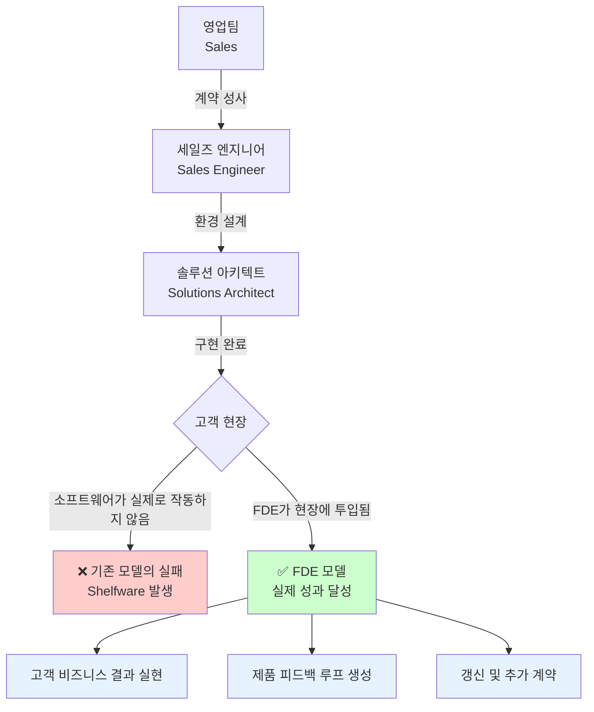
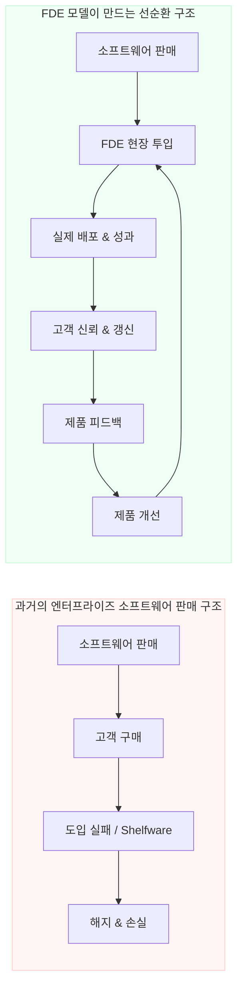
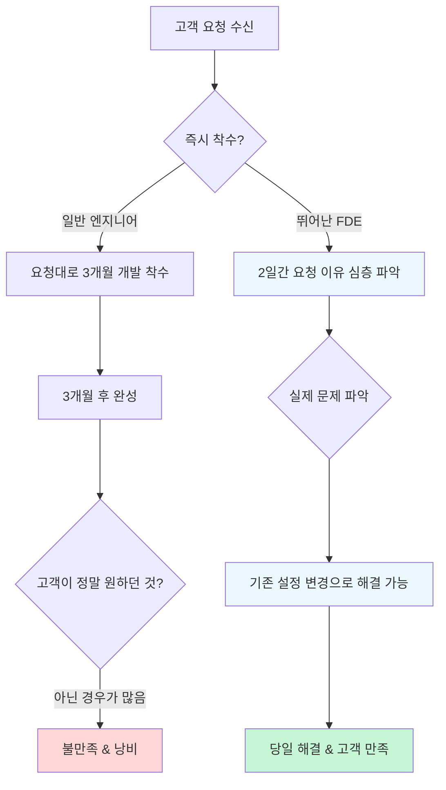
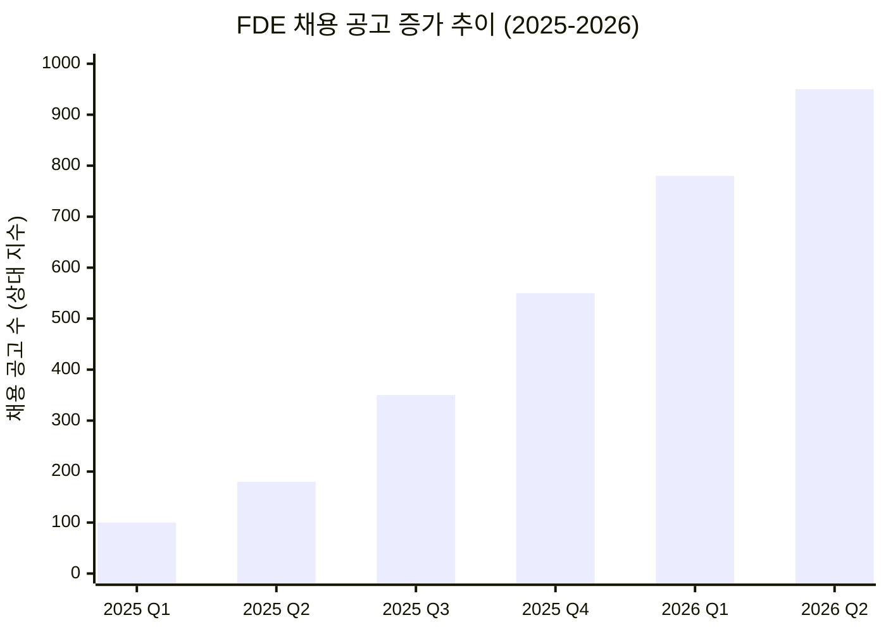

> **원문 출처:** Vinoo Ganesh, "The Definitive Guide to Forward Deployed Engineering" (Next Play Newsletter, 2026.02.06)  
> **참고 자료:** Ewan Mak, "The Forward Deployed Engineer Is No Longer Just a Customer-Facing Coder" (Medium, 2026.05.12)  
> **참고 자료:** "Tech's secret complete 2026 guide to the forward deployed engineer" (Hashnode, 2026.02.13)

## 관련글

[**😮<실리콘밸리가 찾는 엔지니어, FDE(Forward Deployed Engineer)>**](https://www.facebook.com/share/18iMhSah93/)

---

## 들어가며: 왜 지금 FDE인가

요즘 AI 기업들의 채용 공고를 유심히 들여다보면 하나의 공통된 포지션이 눈에 띈다. 단순히 코드를 짜는 개발자가 아니다. 고객의 현장에 직접 투입되어 소프트웨어가 실제로 작동하게 만드는 개발자, 바로 **Forward Deployed Engineer(FDE)**, 줄여서 FDE라 불리는 직군이다.

이 역할을 처음 체계화한 Palantir는 현재 시가총액 약 380조 원(2026년 기준)에 달하는 거대 기업으로 성장했다. Palantir의 FDE 양성 프로그램 출신들은 지금 OpenAI, xAI, Anduril, Hex 등 세계 최고 AI 기업 곳곳에서 핵심 역할을 맡고 있다. 이것은 결코 우연이 아니다.

2025년 1월부터 9월 사이, FDE 관련 채용 공고는 무려 **800% 이상** 증가했다. 2026년 초 기준으로 OpenAI, Anthropic, Cohere, Databricks, Ramp, Rippling, Intercom, Adobe 등 주요 AI 기업들이 공식적으로 FDE 팀을 운영하고 있다. FDE는 더 이상 Palantir만의 독특한 실험이 아니라, 엔터프라이즈 AI 시대의 표준적인 직군으로 자리 잡고 있다.

---

## 1. FDE의 탄생: Palantir의 회색 재킷 신화

### 검은 재킷과 회색 재킷

Palantir에는 독특한 입사 문화가 있다. 신입 직원이 들어오면 검은색 트랙 재킷을 받는다. 그런데 이 회사에는 돈을 내고도 살 수 없는 또 하나의 재킷이 있었다. 바로 **회색 재킷**이다.

회색 재킷은 현장을 수없이 오가다 검은색이 바랬다는 사내 신화에서 비롯되었다고 전해진다. 실제로는 리더십이 현장에서 탁월하게 검증된 엔지니어에게만 특별히 수여하는 인정의 상징이었다. 엔지니어들이 "FDE가 되려면 어떤 자격증이나 조건이 필요한가요?"라고 물으면, FDE 프로그램을 설계하고 이끈 Vinoo Ganesh의 대답은 언제나 같았다. "재킷은 상징이고, 진짜 중요한 건 그 안에서 일어나는 변화다."

이 이야기는 FDE라는 직군의 본질을 단적으로 보여준다. FDE는 직함이 아니라, 고객 현장에서 몸으로 익힌 경험과 판단력의 산물이라는 것이다.

### Palantir의 역사: Delta에서 FDE로

Palantir가 이 역할을 처음 만든 것은 2003년경이다. 당시에는 이들을 **Delta(델타)** 라고 불렀다. 이 엔지니어들은 군사 기지와 기업 고객의 사무실로 직접 파견되어, 파편화된 데이터 환경과 정치적으로 복잡한 조직 내부에서 일했다. 2016년 이전까지 Palantir는 핵심 소프트웨어 엔지니어보다 Delta 엔지니어의 수가 더 많았다고 알려져 있다.

그러나 이 모델은 오랫동안 Palantir만의 독특한 방식으로 머물렀다. 세상이 바뀐 건 AI 에이전트의 등장과 함께다. 제품은 점점 강력해졌지만, 동시에 배포와 실제 도입이 훨씬 더 복잡해졌다. 엔터프라이즈 고객들은 복잡한 AI 시스템을 스스로 운용하기가 어려워졌고, 레거시 시스템과의 통합, 규제 준수, 보안 인증 문제 등이 실제 구현의 80%를 차지하게 되었다. 멋진 데모는 나머지 20%에 불과했다.

---

## 2. FDE란 정확히 무엇인가

### 핵심 정의

FDE는 한마디로 **고객의 성과(outcome)를 직접 책임지는 소프트웨어 엔지니어**다. 고객과의 관계를 관리하거나 만족도 점수를 높이는 게 목표가 아니다. 고객이 소프트웨어를 통해 달성하려는 실제 결과, 즉 비즈니스 성과 그 자체를 자신의 것처럼 끌어안는 사람이다.

기존 직군과의 차이를 명확히 이해하는 것이 중요하다.

- **세일즈 엔지니어(Sales Engineer):** 계약을 성사시키는 데 집중한다. 딜이 클로징되면 역할이 끝난다.
- **솔루션 아키텍트(Solutions Architect):** 기술 환경을 설계하고 청사진을 그린다. 실제 구현은 다른 팀의 몫이다.
- **FDE:** 고객이 실제로 이기게 만드는 것이 일이다. 계약이 끝난 뒤가 진짜 시작이며, 소프트웨어가 현장에서 작동해 비즈니스 결과를 만들어낼 때까지 자리를 지킨다.

### FDE는 채용으로 만들 수 없다

FDE 조직을 구성하는 데 있어 가장 큰 오해 중 하나가 "좋은 개발자를 뽑으면 FDE가 된다"는 생각이다. 현실은 그렇지 않다.

전통적인 소프트웨어 개발 직무에서는 FDE에게 필요한 핵심 역량이 길러지지 않는다. 코드를 짜고, 배포하고, 다음 티켓으로 넘어가는 반복 루프 속에서 개발자는 자신이 만든 코드에 고객이 어떤 무게를 걸고 있는지 직접 느낄 기회가 없다. 고객의 좌절, 현장의 혼란, 비즈니스 맥락의 복잡함을 체득하지 못한 채로는 FDE가 될 수 없다.

그래서 Palantir의 해답은 채용이 아니라 **양성(cultivating)** 이었다. Vinoo Ganesh가 설계한 **Project Frontline** 프로그램이 바로 그것이다. 이 프로그램을 통해 250명 이상의 내부 엔지니어들을 실제 고객 현장으로 보냈고, 그 졸업생들이 지금 OpenAI, xAI, Anduril, Hex 등 최고의 AI 기업에서 활동하고 있다.

---

## 3. 왜 지금 FDE가 필수가 되었는가: 세 가지 구조적 변화

### 첫 번째: AI가 주니어 개발자의 일을 대체하고 있다

AI 코딩 도구들이 빠르게 발전하면서 단순 코드 생성, 반복적 구현 작업은 AI가 대신하는 시대가 열렸다. 이 흐름 속에서 살아남는 엔지니어는 AI가 할 수 없는 일을 하는 사람이다. 고객 앞에 직접 앉아서 진짜 문제를 짚어내고, 그 결과를 책임지는 능력은 AI가 대체할 수 없는 인간 고유의 역량이다.

역설적이게도, AI 도구는 FDE의 하위 레벨 통합 작업(integration work)을 대신해 주면서 FDE가 더 높은 수준의 비즈니스 판단에 집중할 수 있게 만들고 있다. AI는 FDE를 대체하는 것이 아니라, FDE가 더 전략적인 역할로 올라설 수 있도록 뒷받침하고 있다.

### 두 번째: 방위 산업 테크의 폭발적 성장

Anduril, Shield AI 같은 방산 테크 기업들의 고객인 군과 정부 기관은 배포 실패를 절대 용납하지 않는다. 헬프데스크 티켓을 열고 답변을 기다리는 방식이 통하지 않는 환경이다. 소프트웨어가 현장에서 작동하지 않으면 직접적인 피해가 발생한다. 이런 환경에서는 현장에 직접 투입되어 문제를 해결할 수 있는 엔지니어가 반드시 필요하다.

### 세 번째: 엔터프라이즈 구매자들이 더 똑똑해졌다

수십 년간 기업들은 비싼 소프트웨어를 구입하고도 제대로 활용하지 못하는 경험을 반복해 왔다. 이른바 **Shelfware(선반 위의 소프트웨어)** 문제다. 사용하지 않는 소프트웨어에 수억 원을 쓴 기억이 있는 구매 담당자들은 이제 다르게 행동한다. 단순히 제품을 사는 것이 아니라, 실제 구현과 성과를 보장하는 벤더를 선택한다. 배포를 책임지는 회사가 이기는 구조로 시장이 전환되고 있다.

---

## 4. FDE가 만드는 비즈니스 가치: 왜 이게 돈이 되는가

### 소프트웨어 도입 실패는 기술 문제가 아니다

엔터프라이즈 소프트웨어 대부분이 가치를 제대로 내지 못하는 이유는 기술적 결함이 아니다. 제대로 도입되지 않아서다. 조직의 맥락을 무시한 채 기능만 훌륭한 소프트웨어는 현실 세계에서 외면받는다. FDE는 바로 이 간극을 메우는 사람이다.

### Palantir의 수치가 증명한다

Palantir는 상위 20개 고객으로부터만 연간 11억 달러(약 1.5조 원) 이상의 매출을 올리고 있다. 이것이 가능한 이유는 제품이 경쟁사보다 조금 더 나아서가 아니다. 엔지니어가 고객의 결과를 자신의 것처럼 책임지기 때문이다.

### FDE가 만드는 선순환 플라이휠

FDE의 역할은 단순히 고객 현장에서 문제를 해결하는 데 그치지 않는다. 그들은 제품의 가장 강력한 피드백 소스이기도 하다. 한 현장에서 50개 이상의 파이프라인을 모니터링하는 것이 악몽처럼 불편했던 경험을 직접 겪은 FDE 몇 명이 모여 새로운 모니터링 도구를 만들었고, 이것이 여러 고객 사이트에 배포되는 실질적인 제품 개선으로 이어졌다. 이처럼 FDE는 고객의 고통을 몸으로 느끼기 때문에, 가장 의미 있는 제품 인사이트를 만들어낼 수 있다.

### 2026년 FDE의 시장 가치

FDE는 단순히 인기 직군이 아니라, 시장이 희소성을 인정하고 그에 상응하는 보상을 제공하는 직군이다.

| 회사 | FDE 연봉(총 보상, TC) |
|------|----------------------|
| Palantir FDSE | 중간값 $215,000 (범위: $171,000 ~ $415,000) |
| OpenAI FDE | $350,000 ~ $550,000 |
| Anthropic Applied AI Engineer | $350,000 ~ $550,000 |
| Databricks AI FDE | $250,000 ~ $450,000 |
| Salesforce FDE | $200,000 ~ $400,000 |
| 전체 평균 TC | $238,000 (Staff급: $630,000+) |

*(출처: Levels.fyi, FDE Academy, 2026년 5월 기준)*

이처럼 높은 보상이 가능한 이유는 명확하다. 강력한 엔지니어링 실력과 높은 공감 능력, 수십억 원 규모의 고객 관계를 동시에 관리할 수 있는 사람이 극히 드물기 때문이다.

---

## 5. 뛰어난 FDE의 여섯 가지 특징

훌륭한 FDE는 타고나는 것이 아니라 길러진다. Vinoo Ganesh가 정리한 뛰어난 FDE의 핵심 특징 여섯 가지를 살펴보자.

### ① 고객 세계에 대한 집요한 호기심

뛰어난 FDE는 고객의 업무 방식, 조직 문화, 의사결정 구조, 암묵적 우선순위에 깊은 관심을 갖는다. 기술적 해결책을 들이밀기 전에 "왜 이 문제가 생겼는가", "이 사람들은 어떻게 일하는가"를 먼저 이해하려 한다. 이 호기심이 없으면 고객이 실제로 필요한 것과 말로 표현한 것 사이의 간극을 발견할 수 없다.

### ② 엔지니어링 세기(intensity) 조절 능력

FDE가 흔히 빠지는 함정이 있다. 고객의 단순한 요청에 과도하게 정교한 솔루션을 만들어 오는 것이다. 중복 데이터 제거 요청에 2주를 들여 정교한 엔진을 개발했는데, 막상 고객에게 필요했던 건 한 번만 쓰면 되는 SQL 쿼리 하나였다는 식이다. 뛰어난 FDE는 이 상황에 필요한 적절한 수준의 엔지니어링을 정확하게 판단한다. 때로는 간단할수록 좋고, 때로는 정교해야 한다.

### ③ 청중별 언어 전환 능력

같은 기술적 문제를 두 가지 언어로 말할 수 있어야 한다. CTO에게는 "15년치 엣지 케이스가 분기 이사회 리포트를 무너뜨릴 수 있습니다"라고 말하고, 엔지니어링 리드에게는 "12개 테이블, 847개 컬럼, 문서화되지 않은 상호 의존성, 암묵적 타입 변환이 있습니다"라고 말할 수 있는 사람이 FDE다. 청중의 맥락에 맞게 기술적 복잡성을 번역하는 능력은 고객 조직 내에서 신뢰를 쌓는 핵심 도구다.

### ④ 위기 상황에서의 침착함

고객사 CEO 앞에서 데모 중 시스템이 다운된다. 이런 순간에 어떻게 반응하느냐가 FDE를 가른다. 뛰어난 FDE는 당황하지 않고 즉각적으로 문제를 파악하고, 최소한의 리소스로 최단 시간 내에 복구한다. 전화 한 통으로 4분 만에 시스템을 복구했다는 사례가 실제로 전해진다. 위기를 위기처럼 보이지 않게 처리하는 능력이 고객의 신뢰를 결정적으로 높인다.

### ⑤ 공식 권한 없이도 결과를 만드는 능력

내부 팀에서 우선순위를 확보하는 것은 FDE가 반드시 마스터해야 할 기술이다. "이 버그 좀 봐주세요"라고 하는 것과 "이 고객은 연매출 400만 달러 규모이고, 계약 갱신이 6주 남았으며, 임원 스폰서가 이 버그를 최우선 불만으로 언급하고 있습니다"라고 말하는 것의 차이는 엄청나다. 뒤의 방식으로 말한 FDE는 이틀 만에 버그 수정을 이끌어냈다. 맥락을 비즈니스 언어로 번역해 팀을 움직이는 것, 이것이 공식 권한 없이 결과를 만드는 기술이다.

### ⑥ 고객 요청을 되돌릴 수 있는 판단력

고객이 3개월짜리 커스텀 기능을 요청했다고 해서 바로 착수하는 것이 좋은 FDE가 아니다. 뛰어난 FDE는 요청 즉시 답하지 않고 며칠을 들여 요청의 이유를 깊이 파악한다. 실제 사례에서, 3개월짜리 개발이 필요해 보였던 요청이 기존 제품의 설정 변경만으로 해결 가능했고, 고객은 그날 바로 작동하는 것을 훨씬 더 좋아했다. 고객의 표면적 요청 뒤에 있는 진짜 필요를 발견하고, 더 나은 대안을 제안할 수 있는 판단력이 FDE를 차별화한다.

---

## 6. FDE가 직면하는 세 가지 구조적 딜레마

2026년 4월, South Park Commons가 뉴욕에서 OpenAI, Ramp, Nominal, Dataland의 FDE 리더들을 모아 진행한 패널 토론에서 흥미로운 공통점이 드러났다. 제품도, 단계도, 고객군도 모두 다른 네 회사가 동일한 구조적 긴장 관계를 이야기했다.

### 딜레마 1: 대형 엔터프라이즈 vs. 제품 일관성

대형 엔터프라이즈 계약은 상당한 수익을 가져다주지만, 각 고객은 저마다의 독특한 요구를 가지고 있다. 이 요청들을 모두 핵심 제품 로드맵에 반영하다 보면 어느 순간 특정 고객 한 명이 제품의 방향을 결정하는 사태가 발생한다. Ramp의 FDE 팀은 이를 "칼과 방패" 비유로 설명한다. FDE는 엔터프라이즈 계약을 따내는 칼이자, 핵심 제품팀이 개별 고객 요구에 끌려다니지 않도록 보호하는 방패다.

### 딜레마 2: 깊은 고객 밀착 vs. 컨설팅 회사화

고객의 워크플로우 깊숙이 들어가지 않으면 가치를 만들 수 없다. 그러나 그 가치가 제품 자체가 아니라 특정 FDE 개인에게 귀속되기 시작하면, 소프트웨어 기업이 아닌 서비스 기업처럼 운영되는 위험이 생긴다. 특정 FDE가 빠지는 순간 고객 관계가 무너진다면, 그것은 제품이 아니라 사람을 판 것이다.

### 딜레마 3: 정보 단절의 고리 끊기

Ramp가 확인한 엔터프라이즈 소프트웨어 회사들의 반복적 실패 패턴이 있다. 영업팀이 고객 요구사항을 PM에게 전달하고, PM이 이를 스펙으로 변환해 엔지니어링팀에 넘기는 과정에서 원래의 문제가 여러 번의 핸드오프를 거치며 왜곡된다. FDE는 이 사슬을 끊는다. 고객의 비즈니스 맥락과 자사 코드베이스를 동시에 이해하는 엔지니어가 직접 개입함으로써 정보 손실 없이 진짜 문제를 해결할 수 있다.

---

## 7. FDE가 맞지 않는 사람

FDE는 매력적인 역할이지만, 누구에게나 맞는 것은 아니다. 아래 유형에 해당한다면 FDE가 아닌 다른 경로를 고려하는 것이 현명하다. 이것은 약점이 아니라, 단순히 맞지 않는다는 의미다.

- **깊은 몰입 시간이 생명인 사람:** FDE의 일상은 끊임없는 인터럽트의 연속이다. 하루에도 수십 번 맥락 전환이 일어난다. 오랫동안 하나에 집중해야 최고 성과를 내는 스타일이라면 FDE는 맞지 않는다.

- **모호함을 견디지 못하는 사람:** FDE는 항상 불완전한 정보 속에서 판단을 내려야 한다. 명확한 스펙과 요구사항이 주어진 환경을 선호한다면 현장의 혼돈이 괴롭게 느껴질 것이다.

- **한 분야를 깊이 파고드는 것이 목표인 사람:** FDE는 태생적 제너럴리스트다. 특정 기술 스택의 전문가가 되는 것에서 보람을 찾는다면, 폭넓게 다양한 문제를 다루는 FDE 방식이 불만족스러울 수 있다.

- **고객의 불만을 개인적으로 받아들이는 사람, 경계를 세우지 못하는 사람:** 고객 현장에서의 스트레스와 압박을 자신의 문제처럼 받아들이다 보면 번아웃이 빠르게 찾아온다. 명확한 심리적 경계를 유지하는 능력이 FDE의 지속 가능성을 결정한다.

---

## 8. FDE 열풍의 현재: 2026년의 풍경

FDE는 이제 몇몇 AI 스타트업만의 이야기가 아니다. 2026년 기준으로 이 직군이 산업 전반으로 확산되고 있다는 구체적인 수치가 있다.

- **지리적 변화:** FDE 채용 공고에서 뉴욕이 전체의 35%를 차지해, 11%에 그친 샌프란시스코를 제치고 최대 허브로 부상했다.
- **대기업의 진입:** 2026년 4월, Ernst & Young(EY)이 영국·아일랜드에 FDE 전문 사업부를 공식 출범시키며 대형 컨설팅 기업 최초로 이 모델을 정식 채택했다. Adobe는 "Forward Deployed AI Engineer"를 고용해 고객이 Firefly AI 모델을 활용할 수 있도록 지원하고 있다.
- **OpenAI와 Ramp의 성장:** OpenAI의 FDE 조직은 1년 만에 2명에서 10명 이상으로 성장했다. Ramp의 FDE 팀은 18개월 만에 2명에서 16명으로 확대되었다.
- **Salesforce의 대규모 투자:** Salesforce는 Agentforce 관련 역할로 1,000명을 채용하겠다고 공언했으며, 2026년 4분기 기준 Agentforce ARR은 8억 달러를 돌파했다.
- **Deloitte의 움직임:** 글로벌 컨설팅 기업 Deloitte도 Palantir와 협력해 FDE 역할을 정식 채용하고 있으며, GenAI 기반 솔루션을 엔터프라이즈 고객에게 직접 배포하는 역할을 담당시키고 있다.

---

## 9. 한국 시장에 주는 시사점

FDE라는 개념은 한국에서 아직 낯설다. 그러나 이 직군이 던지는 핵심 메시지는 어느 시장에나 동일하게 적용된다.

**개발팀은 고객을 모르고, 영업팀은 기술을 모른다.** 이 두 세계 사이의 간극에서, 양쪽을 모두 이해하고 연결할 수 있는 사람은 극도로 희소하다. 그 희소성이 곧 시장 가치다.

초기 스타트업의 관점에서 보면, 사실 모든 창업 멤버가 FDE 마인드셋을 가져야 한다. 고객 현장에 나가본 적 없는 엔지니어가 만든 제품은 기능적으로 완벽해도 현실에서 외면받는 "예쁜 쓰레기"가 될 수 있다. 반대로, 고객의 현실을 몸으로 아는 엔지니어가 만든 제품은 완벽하지 않아도 현장에서 쓰인다.

엔터프라이즈 B2B 시장에서 경쟁하려는 한국 기업들에게도 FDE 모델은 강력한 참고점이 된다. 소프트웨어를 팔고 끝내는 것이 아니라, 고객의 성과를 함께 책임지는 엔지니어를 현장에 보낼 수 있는 회사가 장기적으로 이기는 구조가 되고 있기 때문이다.

---

## 마치며: FDE가 상징하는 것

FDE는 하나의 직군 이름이 아니다. 그것은 소프트웨어가 어떻게 만들어지고, 어떻게 전달되며, 어떻게 가치를 창출해야 하는지에 대한 철학이다. 멋진 기능을 만들어 배포 버튼을 누르는 것으로 엔지니어의 역할이 끝나던 시대는 지났다. 소프트웨어가 실제 세계에서 작동하고, 사람들의 삶과 비즈니스를 바꾸는 순간까지 함께하는 것, 그것이 FDE가 가리키는 방향이다.

Palantir의 회색 재킷이 상징하는 것은 결국 이것이다. 현장에서 얼마나 많은 시간을 보내며, 얼마나 많은 문제를 직접 해결했으며, 얼마나 많은 고객의 성공을 자신의 것처럼 끌어안았는지. 그 경험이 쌓이면, 재킷의 색이 바래는 것은 자연스러운 결과다.

---

## 주요 참고 자료

- Vinoo Ganesh, "The Definitive Guide to Forward Deployed Engineering", Next Play Newsletter, 2026.02.06  
  https://nextplayso.substack.com/p/the-definitive-guide-to-forward-deployed
- Ewan Mak, "The Forward Deployed Engineer Is No Longer Just a Customer-Facing Coder", Medium, 2026.05.12  
  https://medium.com/@tentenco/the-forward-deployed-engineer-is-no-longer-just-a-customer-facing-coder-f55ec7c7ded0
- "Tech's secret complete 2026 guide to the forward deployed engineer", Hashnode, 2026.02.13  
  https://hashnode.com/blog/a-complete-2026-guide-to-the-forward-deployed-engineer
- "Forward Deployed Engineer vs Applied AI Engineer (2026)", FDE Academy  
  https://fde.academy/blog/forward-deployed-engineer-vs-applied-ai-engineer
- Levels.fyi 보상 데이터, 2026년 5월 기준

---

*작성일: 2026년 5월 15일*
