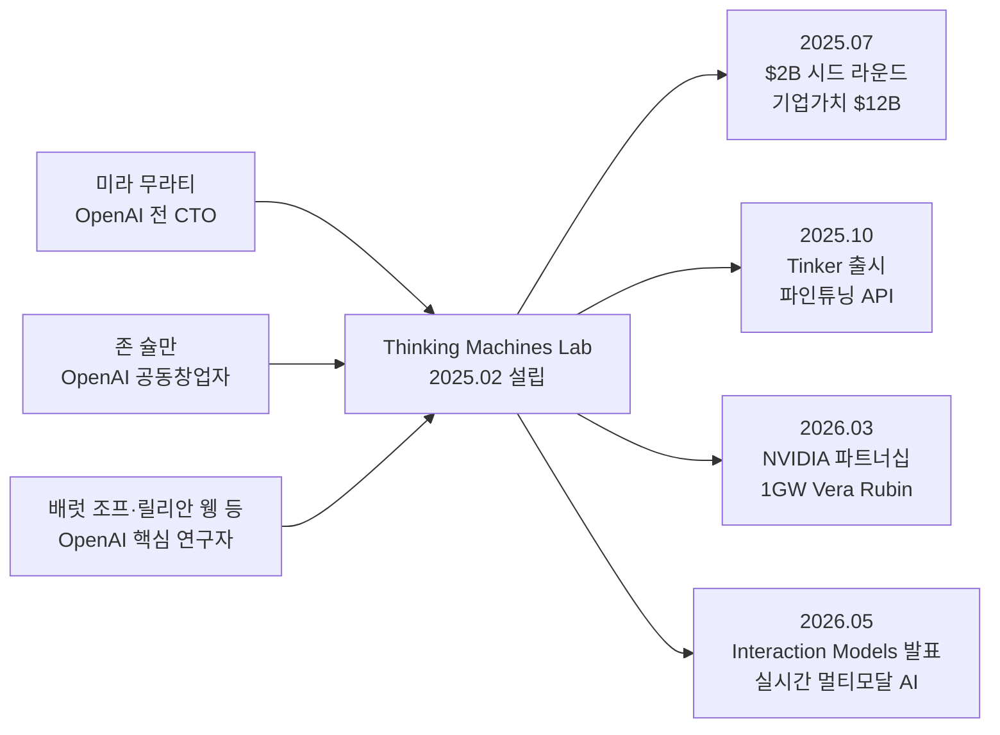
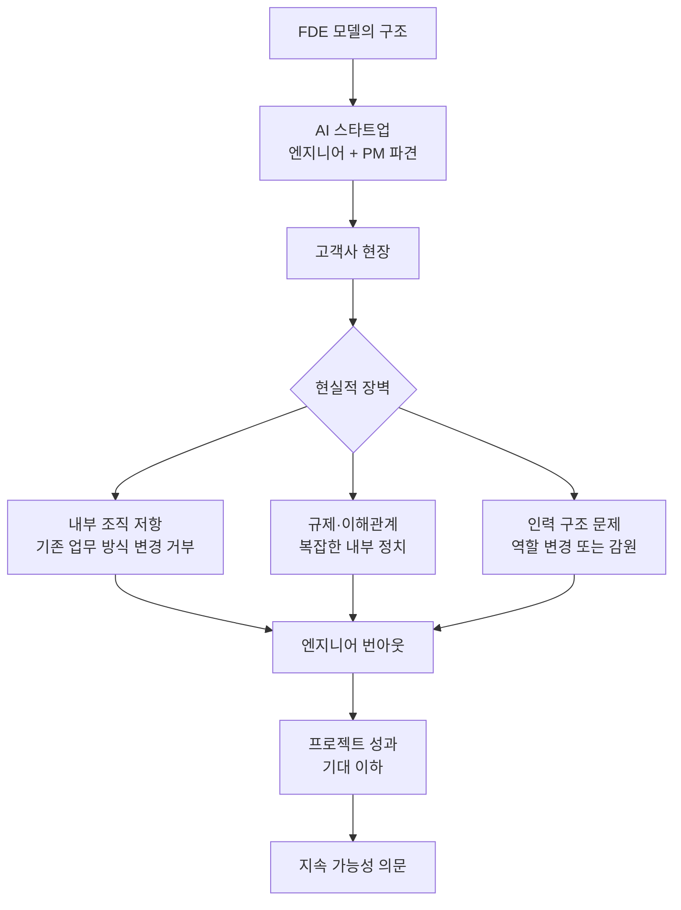
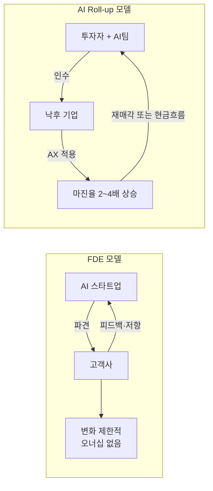
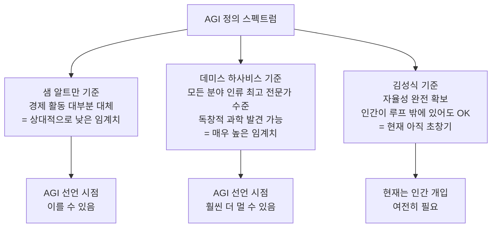

> **원문 출처**: [브런치 — 클래미, 2026년 5월 12일](https://brunch.co.kr/@hiclemi/173)  
> **참고 인터뷰**: [비즈까페 — 딥마인드·xAI·TML 엔지니어 김성식님과 대화](https://bzcf.io/dibmaindeu-xai-tml-ennijieo-gimseongsignimgwa-daehwa/)

## 관련글

[**FDE(Forward Deployed Engineer): 실리콘밸리가 찾는 새로운 엔지니어의 탄생**](https://k82022603.github.io/posts/fde(forward-deployed-engineer)-%EC%8B%A4%EB%A6%AC%EC%BD%98%EB%B0%B8%EB%A6%AC%EA%B0%80-%EC%B0%BE%EB%8A%94-%EC%83%88%EB%A1%9C%EC%9A%B4-%EC%97%94%EC%A7%80%EB%8B%88%EC%96%B4%EC%9D%98-%ED%83%84%EC%83%9D/)

---

## 들어가며 — 이 글이 탄생한 맥락

이 글은 Claude Bloom이라는 한국의 Anthropic 클로드 커뮤니티를 운영하는 필자 클래미가, 실리콘밸리 최전선에서 일한 한국계 미국인 엔지니어 김성식 씨를 연사로 초청해 나눈 대화를 정리한 것이다. Claude Bloom은 2026년 4월 14일에 첫 행사를 열었으며, 개발자 커뮤니티가 아닌 비개발자 시각에서 AI 산업의 해외 동향, 특히 공개된 뉴스 이면의 이너서클 이야기를 소개하는 것을 지향한다.

김성식 씨는 구글 딥마인드 → 크루즈 → xAI → Thinking Machines Lab(TML)으로 이어지는, 실리콘밸리 AI 산업 최전선을 직접 경험한 인물이다. 이 대화는 공개 정보와 본인의 개인적 견해를 바탕으로 이루어졌다.

---

## 1부. 김성식이라는 인물 — 실리콘밸리 최전선의 커리어

### 구글 딥마인드에서의 출발

김성식 씨의 커리어는 구글 딥마인드에서 시작된다. 그곳에서 그는 현재 제미나이(Gemini)의 전신이 된 언어 모델 개발에 참여했다. 딥마인드는 구글이 2014년 인수한 영국 기반 AI 연구소로, 알파고를 만든 곳으로 유명하며, 이후 구글 브레인과 합병해 Google DeepMind라는 이름으로 Gemini 모델 개발을 주도하고 있다. 이 시기에 김성식 씨는 AI 포스트 트레이닝(post-training) 영역, 즉 기초 모델을 인간의 지시에 맞게 조율하는 작업의 핵심 노하우를 습득했다.

### 크루즈 — 결혼과 이직의 우연한 교차점

딥마인드 재직 중 그는 결혼을 앞두고 배우자와 함께 시카고에서 살기를 원했다. 회사에 공식적으로 이전 요청을 하지 않고 조용히 시카고로 이주했다가 발각됐고, 다시 샌프란시스코로 돌아가야 하는 상황에 처했다. 프러포즈 직후의 일이었다. 이 상황에서 재택근무가 가능했던 GM의 자율주행 자회사 크루즈(Cruise)로 이직했다. 그런데 입사 후 불과 한두 달 만에 GM이 크루즈에 대한 펀딩을 중단하면서 회사가 사실상 문을 닫게 됐다. (크루즈는 2023년 로봇택시 사고 이후 운영을 중단하고 GM의 구조조정 대상이 됐다.) 당시엔 불운처럼 보였지만, 그 시점에 회사가 망하지 않았다면 AI 포스트 트레이닝 분야로 돌아오지 못했을 것이라고 회고한다.

### xAI — 극한의 강도와 번아웃

크루즈 퇴사 후 그는 일론 머스크가 2023년 설립한 AI 회사 xAI에 합류했다. xAI는 Grok이라는 언어 모델을 만든 회사로, 2025년 머스크가 SpaceX와 합병해 SpaceXAI라는 이름으로 통합됐다. xAI에서의 일상은 하루 다섯 시간 수면, 오전 10시부터 오후 6시까지 미팅 연속, 그 이후 밤 8~9시부터 새벽까지 개인 개발 작업, 사무실에서 숙박하는 날이 많았던 극한의 근무 환경이었다. 그는 처음부터 매니저를 자처한 것이 아니라, 창업자(머스크)가 말도 없이 매니저로 임명했다고 한다. 최대 14명까지 관리했으며, 인터뷰·원온원·팀 미팅을 하루 종일 소화하면서도 밤에는 직접 개발 작업을 병행했다. 일론 머스크는 팀과 거의 매일 직접 대면 미팅을 진행했으며, 이는 테슬라·SpaceX와 동일한 방식이었다. 이 극한의 페이스를 일정 기간 유지한 끝에 심각한 번아웃을 겪었고, 이후 Thinking Machines Lab으로 이직했다.

### Thinking Machines Lab — 자유로운 연구 환경

Thinking Machines Lab(TML)은 OpenAI의 전 CTO 미라 무라티(Mira Murati)와 OpenAI 공동창업자 중 한 명인 존 슐만(John Schulman), 그리고 OpenAI 출신 연구자들이 2025년 2월에 설립한 AI 프론티어 랩이다. 김성식 씨는 초기 멤버로 합류했다. xAI의 극한적인 페이스와 대비되는, 더 자유롭고 연구 중심적인 환경에서 일하고 있다.

---

## 2부. Thinking Machines Lab — 실리콘밸리가 주목하는 신생 AI 프론티어 랩

### 설립 배경과 핵심 인물

Thinking Machines Lab은 미라 무라티가 2024년 9월 OpenAI를 돌연 퇴사한 직후 설립을 준비해, 2025년 2월 공식 출범한 회사다. 공동 창업팀은 OpenAI 출신 핵심 연구자들로 구성됐다. 배럿 조프(Barret Zoph, 전 OpenAI 포스트트레이닝 부사장), 릴리안 웽(Lilian Weng, 전 OpenAI 부사장), 존 슐만(John Schulman, OpenAI 공동창업자이자 RLHF의 선구자), 앤드류 툴록(Andrew Tulloch), 루크 메츠(Luke Metz) 등이 창업 멤버였다. 출범 시점에 이미 30명 규모의 연구자·엔지니어 팀을 구성했으며, OpenAI·Meta AI·Mistral AI 등 주요 AI 랩 출신 인재들이 합류했다.

미라 무라티는 회사의 의결권 구조에서 이사회 결정을 단독으로 좌우할 수 있는 가중치를 부여받았으며, 창업 멤버 주주들도 일반 주주보다 100배 높은 의결권을 갖는다. 이는 외부 투자자의 경영 개입을 원천 차단하는 구조다. 회사는 Anthropic처럼 공익법인(Public Benefit Corporation) 형태로 설립됐다.

### 사상 최대 규모의 시드 라운드

TML은 출범 5개월 만인 2025년 7월, a16z(Andreessen Horowitz)가 주도하는 라운드에서 약 20억 달러(약 2조 8천억 원)를 조달했다. 기업 가치 평가액은 120억 달러(약 16조 8천억 원)였으며, NVIDIA, AMD, Cisco, Accel, ServiceNow, Jane Street 등이 참여했다. 알바니아 정부(무라티의 고국)도 1,000만 달러를 투자해 해당 연도 예산 개정까지 진행했다. 이는 실리콘밸리 역사상 가장 큰 규모의 시드 라운드 중 하나였다.

원문에서 김성식 씨가 "설립 이후 시드 라운드 3조 원, 밸류에이션 18조 원"이라고 언급한 수치는 원화 환율 기준으로 대략적으로 언급한 것으로, 공식적인 외부 보도는 $2B 조달 / $12B 밸류에이션으로 확인된다. 이후 2025년 11월 블룸버그 보도에 따르면 TML은 500억 달러(약 70조 원) 밸류에이션으로 추가 50억 달러 조달을 논의 중이라고 알려졌다.

2026년 3월에는 NVIDIA와 전략적 파트너십을 체결해, Vera Rubin 컴퓨팅 1기가와트 규모의 다년간 계약을 발표했다.

### TML이 만들려는 것 — GenAI UI와 Interaction Models

원문에서 김성식 씨가 언급한 "GenAI UI"는 AI의 응답을 텍스트 형태로 출력하는 것에서 벗어나, 인터랙티브한 리치 웹 UI 형태로 직접 생성하는 개념이다. 사용자가 요청하면 그 결과물이 곧 인터페이스 자체가 되는 방향을 지향한다. 이 개념이 실현되면, 앱을 별도로 설치하고 실행하는 행위 자체가 불필요해지는 소프트웨어 패러다임의 전환이 일어날 수 있다.

실제로 TML은 2025년 10월 첫 제품 Tinker를 출시했다. Tinker는 연구자와 스타트업이 언어 모델을 특정 용도에 맞게 파인튜닝할 수 있도록 하는 API로, 분산 훈련의 복잡성과 비용 없이 모델의 알고리즘과 데이터를 직접 제어할 수 있게 해준다. 2026년 5월 13일에는 "Interaction Models"라는 새로운 제품군을 발표했다. 이는 실시간 인간-AI 협업을 위한 네이티브 멀티모달 아키텍처로, AI가 말하는 동중에도 계속 듣는 구조를 갖춰 경직된 턴 기반 대화를 벗어나는 방향을 목표로 한다.

---

## 3부. FDE란 무엇인가 — 그리고 왜 한계가 있는가

### FDE의 정의와 부상 배경

FDE(Forward Deployed Engineer, 전진 배치 엔지니어)는 AI 스타트업의 엔지니어가 고객사 현장에 직접 파견되어 AI 시스템을 구현·통합·운영하는 역할을 맡는 직군이다. 이 모델은 원래 데이터 분석 플랫폼 기업 팰런티어(Palantir)가 2010년대 초에 처음 도입했다(당시엔 'Deltas'라고 불렀으며, 2016년 이전까지 엔지니어보다 FDE가 더 많았다). 팰런티어의 논리는 단순했다. 정부기관이나 대형 금융기관 같은 고객은 더 많은 기능이 필요한 것이 아니라, 기존 복잡한 환경에서 제품이 실제로 작동하도록 만들어 줄 엔지니어가 필요하다는 것이었다.

2025년부터 FDE 역할에 대한 수요가 폭발적으로 증가했다. Financial Times 보도에 따르면 2025년 1월 이후 FDE 관련 채용 공고가 800% 이상 증가했다. OpenAI, Anthropic, Databricks, Salesforce, Cohere 등 주요 AI 기업들이 모두 FDE 조직을 구성하거나 확장하고 있다. Salesforce는 FDE 1,000명 채용을 공개적으로 약속했고, Anthropic은 고객 대응 팀을 5배로 확장할 계획이라고 밝혔다. 2026년 3월에는 Accenture가 Microsoft와 파트너십을 맺어 엔터프라이즈 AI 환경 확산을 위한 전담 FDE 조직을 출범시켰으며, 2026년 4월에는 EY가 영국·아일랜드 FDE 조직을 공식 설립했다.

FDE 역할이 이렇게 주목받는 이유는 "AI 라스트 마일(last mile) 문제" 때문이다. 대부분의 엔터프라이즈 AI 실패는 모델 자체의 문제가 아니라, 복잡한 내부 워크플로우·레거시 인프라·단절된 데이터·규제 환경과 맞닥뜨렸을 때 발생한다. FDE는 바로 이 현실과 기술 사이의 간격을 메우는 역할을 한다.

한국에서도 많은 AI 스타트업이 PM과 엔지니어가 짝을 이루어 대기업에 파견되어 현장 문제를 AI로 개선하는 방식을 택하고 있다. 사실상 파견직이다.

### FDE의 구조적 한계

그런데 김성식 씨는 FDE 모델이 생각보다 효율적이지 않다고 지적한다. 문제는 여러 층위에서 발생한다.

첫째, 고객사의 변화 저항이다. AI로 무언가를 바꾸라고 외부에서 요구하는 행위 자체가 조직 내부에서 극심한 저항을 만난다. 탑다운으로 의사결정권자가 강제로 밀어붙이더라도, 실무 담당자들의 업무 방식을 바꾸거나, 심한 경우 일부 인력을 내보내야 하는 상황이 생긴다. 이는 규제, 내부 정치, 이해관계자 간의 복잡한 역학 속에서 매우 어려운 일이다.

둘째, 관계자 모두가 힘들어지는 구조다. 파견된 엔지니어 본인은 낯선 환경에서 변화를 강요해야 하는 역할로 극도의 스트레스를 받는다. 고객사의 의사결정권자는 내부 저항과 외부 파견팀 관리를 동시에 해야 한다. 현장 직원들은 갑작스럽게 외부에서 들어온 사람들이 자신들의 일을 바꾸려 한다는 것에 반감을 느낀다. 결국 삼각 구도 모두에서 불협화음이 발생한다.

셋째, FDE는 고객사 조직의 근본적인 체질을 바꾸는 것이 아니라, 특정 프로젝트를 구현하는 데 그치는 경우가 많다. 파견이 끝나면 변화가 지속되기 어렵다.

실제로 FDE 업무의 40~60%가 실제 엔지니어링 작업이 아닌 이해관계자 소통·보고·문서화 같은 비개발 행정 업무에 쓰인다는 분석도 있다. FDE가 파견되는 엔지니어의 몸값의 몇 배에 달하는 프로젝트 수수료를 청구할 수 있음에도 불구하고, 실질적인 변화를 만들어내는 데 한계가 있다는 것이다.

---

## 4부. AI Roll-up — FDE를 넘어서는 대안 전략

### Roll-up의 개념

FDE 모델의 한계를 인식한 김성식 씨가 한때 창업을 고민했던 아이디어가 'AI Roll-up'이다. AI Roll-up은 사모펀드(Private Equity, PE) 방식에서 차용한 개념으로, 자본을 끌어와 낙후된 산업의 기업들을 인수한 뒤, 강도 높은 AI 전환(AX, AI Transformation)을 적용해 마진을 끌어올리거나 재매각하는 전략이다.

FDE와의 결정적인 차이는 소유권이다. FDE는 고객사의 조직 문화와 이해관계에 눈치를 봐야 하지만, Roll-up은 회사를 직접 인수하기 때문에 원하는 방향으로 운영할 수 있다. 조직을 뜯어고치는 데 내부 저항이 생겨도 오너십이 있기 때문에 밀어붙일 수 있다.

비즈니스 논리를 단순화하면 이렇다. 전통적인 서비스 기업은 마진율이 5~15%대에 머물러 있다. 여기에 AI를 적용해 반복적인 업무의 30~70%를 자동화하면, 마진율을 두 배 이상 끌어올릴 수 있다. 이 변화된 수익 구조로 기업을 재매각하거나 보유하면서 현금흐름을 확보하는 것이 Roll-up의 핵심 논리다.

### 미국에서는 이미 현실이 된 전략

이 전략은 한국에서는 아직 실험적이지만, 미국에서는 이미 상당한 규모로 실행되고 있다. General Catalyst가 "Creation Strategy"라는 이름으로 약 15억 달러를 이 전략에 배치했고, Thrive Capital은 OpenAI의 지분 참여까지 이끌어내며 포트폴리오 기업에 엔지니어링 팀을 직접 파견하는 Thrive Holdings를 설립했다.

구체적인 성과 사례도 나오고 있다. General Catalyst가 인큐베이팅한 주택관리 회사 Long Lake는 2년 이내에 EBITDA 1억 달러를 달성했고, AI 네이티브 콜센터 플랫폼 Crescendo는 기존 콜센터 대비 4배의 마진율로 5억 달러 밸류에이션을 받았다. Thrive Capital이 지원하는 회계 네트워크 Crete는 2025년 한 해에만 10개 이상의 회계 법인을 인수하며 3억 달러 이상의 연간 매출을 달성했다.

2026년 AI Roll-up 투자자 설문에 따르면, 응답자의 90% 이상이 AI Roll-up이 향후 12~18개월 안에 투자자들의 주요 관심 대상이 될 것이라고 전망했다.

한 가지 중요한 맥락은, 프론티어 AI 기업들도 직접 이 방향에 뛰어들고 있다는 점이다. 원문에서 언급된 것처럼 Anthropic과 OpenAI가 글로벌 사모펀드, McKinsey 같은 대형 컨설팅과 조인트 벤처를 설립해 엔터프라이즈 AI 전환을 직접 수행하기 시작했다. 이들은 규모가 큰 대기업(엔터프라이즈)을 우선 타깃으로 하기 때문에, 스타트업이나 소규모 플레이어들이 들어갈 수 있는 공간은 매출 500억 원 미만의 중소기업, 특히 제조업 중심의 지방 기업들이 될 수 있다는 시각이 대화에서 제시됐다.

단, Roll-up 전략의 현실적인 장벽도 명확하다. 자본을 조달하는 것 자체가 어렵다. VC는 "롤업이면 PE한테 가라"고 하고, PE는 "기술 전환은 VC한테 가라"고 한다. 이 둘 사이 어딘가에 있는 하이브리드 전략이기 때문에 적합한 투자자를 찾기가 쉽지 않다. 한국의 경우 테헤란로 빌딩 한 채를 사서 안정적인 월세를 받는 것이 더 리스크가 적다는 논리를 반박하기가 현실적으로 어렵다는 점도 솔직하게 인정됐다.

---

## 5부. 머스크가 Anthropic에 컴퓨팅을 제공한 이유 — 기술적 계산

### 예상치 못한 거래

2026년 5월 6일, 실리콘밸리에 이례적인 소식이 전해졌다. 일론 머스크가 트위터(現 X)에서 Anthropic을 공개적으로 비판하며 "사악하다(evil)"고 불렀던 지 불과 3개월 만에, SpaceXAI(구 xAI가 SpaceX에 합병된 이후의 새 이름)가 Anthropic과 컴퓨팅 파트너십 계약을 체결했다. SpaceXAI의 멤피스 데이터센터 Colossus 1의 전체 용량(300메가와트 이상, NVIDIA GPU 22만여 개)을 Anthropic이 사용하도록 하는 내용이다. Anthropic은 이를 통해 Claude Pro 및 Claude Max 구독자의 서비스 용량을 직접 개선할 계획이며, 향후 우주 기반 AI 컴퓨팅 개발 협력에도 관심을 표명했다.

Anthropic CEO 다리오 아모데이는 2026년 1분기 기준 매출과 사용량이 전년 대비 80배 성장했으나, 당초 10배만 대비했다가 컴퓨팅이 크게 부족한 상황이 됐다고 인정했다. 이 거래를 통해 Anthropic이 Claude Code 유료 플랜의 사용량 제한을 두 배로 늘리고 피크 시간대 제한을 해제했다.

### 김성식 씨의 해석 — 감정이 아닌 기술적 계산

왜 머스크가 태도를 바꿨을까? 김성식 씨의 해석은 감정적 화해보다 냉철한 기술적 계산에 가깝다고 본다. 코딩 모델이 계속 좋아지다 보면 어느 시점에서 모델이 스스로를 학습시킬 수 있는 수준에 도달한다. 이 지점을 넘으면 경쟁이 사실상 불가능해진다. 먼저 그 임계점에 도달한 회사가 판을 가져간다. 만약 Anthropic이 그 임계점에 근접하고 있다고 판단한다면, 적이 되기보다 투자하거나 협력 관계를 맺어 같은 편이 되는 것이 합리적인 수다.

분석가들은 SpaceX 입장에서도 이 거래가 재무적으로 타당하다고 본다. xAI의 Colossus 1 데이터센터는 제품 수요(Grok의 사용자 기반)가 인프라 규모를 따라오지 못해 유휴 자산으로 남아있었다. 이를 Anthropic에 임대함으로써 연간 30~40억 달러의 매출, 25억 달러 이상의 현금 이익을 창출할 수 있게 됐다. SpaceX의 IPO(2026년 6월 예정)를 앞두고 AI 클라우드 인프라 사업의 주요 고객을 확보한다는 의미도 있다.

한편 머스크는 X 게시물에서 "Anthropic의 AI가 인류에게 해를 끼치는 행동을 할 경우 컴퓨팅을 회수할 권리를 유보한다"고 밝혔는데, 이 조항이 계약서에 포함되는지 여부는 불명확하다. 이는 공급망 리스크라는 새로운 해석을 낳기도 한다.

---

## 6부. AGI 정의 논쟁 — 사람마다 다른 기준선

이 대화에서 가장 철학적인 주제 중 하나는 AGI(Artificial General Intelligence, 인공일반지능)를 어떻게 정의할 것인가였다.

### 샘 알트만의 정의 — 경제적 활동 대체

OpenAI CEO 샘 알트만은 인간이 수행하는 거의 모든 경제적 활동을 AI가 대체할 수 있는 수준을 AGI로 본다. 이는 경제적 생산성이라는 현실적인 기준으로, OpenAI가 "AGI에 가까워지고 있다"고 자주 언급하는 맥락에서 사용하는 정의다.

### 데미스 하사비스의 정의 — 최고 수준의 전문성

Google DeepMind CEO 데미스 하사비스의 기준은 훨씬 높다. 아인슈타인이 살았던 시대와 같은 정보가 주어졌을 때, AI가 스스로 상대성이론을 도출할 수 있어야 한다. 그리고 모든 학문 분야에서 인류 최고 수준의 전문가와 동등한 기준을 동시에 충족해야 비로소 AGI라는 입장이다. 이는 노벨상·필즈상 수준의 독창적 발견을 AI가 독립적으로 해낼 수 있어야 한다는 뜻이다.

### 스케일링 법칙의 한계와 현재 위치

스케일링 법칙(Scaling Law)은 AI 모델에 투입하는 데이터와 컴퓨팅 파워를 늘리면 성능이 향상된다는 경험적 법칙이다. 그런데 그 성능 향상은 로그 곡선을 따른다. 즉 초기에는 급격히 올라가지만 특정 지점부터는 같은 투자 대비 얻는 리턴이 점점 줄어든다. 현재 AI 업계가 이 곡선의 어디에 위치해 있는지는 전문가들 사이에서도 논쟁 중이다.

### 김성식 씨의 개인적 정의 — 자율성

김성식 씨 본인의 정의는 자율성(autonomy)에 초점을 맞춘다. 코딩 에이전트를 예로 들면, 아직은 사람이 루프(loop) 안에 있어야 하는 지점들이 존재한다. AI가 스스로 판단하고 실행하는 전 과정에서 인간의 개입 없이도 안전하고 신뢰할 수 있게 작동하는 수준에 아직 도달하지 못했다는 것이다. 그런 의미에서 현재는 AGI를 향한 "초창기"에 해당한다고 봤다.

---

## 7부. AI는 격차를 줄이지 않는다 — 민주화 신화에 대한 반론

AI가 기술의 민주화 도구라는 이야기는 자주 들린다. 누구나 AI를 쓰면 전문가 수준의 도움을 받을 수 있다는 낙관론이다. 그러나 김성식 씨의 시각은 이와 다르다.

AI는 현재 비싼 기술이다. 에이전트 여러 개를 돌리거나, 이를 비즈니스와 연결하려면 상당한 자본이 필요하다. 토큰 사용량 분포는 파워 법칙(power law)을 따른다. 소수의 헤비 유저가 수십억 토큰을 사용하고, 나머지 대다수는 무료 버전을 한 달에 몇 번 사용하는 수준에 그친다. 결국 꼭대기에 있는 사람들의 역량을 더욱 높이는 기술이지, 아래와의 격차를 줄이는 기술이 되기 어렵다는 것이다.

이는 AI 투자 방식에도 반영된다. 한국과 미국의 차이를 그는 펀딩 구조에서 찾는다. 유니콘(기업가치 10억 달러 이상 스타트업)의 기업가치는 결국 펀딩 규모에 의해 결정된다. 미국에서는 스탠퍼드 1학년 학생 두세 명이 만든 회사가 5억 달러(약 7,000억 원) 밸류에이션을 받는 일이 실제로 일어난다. 실제 사례로 Standard Intelligence가 언급됐는데, 이 회사는 20대 초반의 두 공동창업자(Galen Mead와 Devansh Pandey)가 대학을 중퇴하고 세운 6인 스타트업으로, 2026년 시퀀셔 캐피털(Sequoia Capital)과 스파크 캐피털(Spark Capital)로부터 7,500만 달러를 조달하며 5억 달러 밸류에이션을 인정받았다. 이들이 만든 FDM-1은 텍스트 스크린샷이 아닌 1,100만 시간 분량의 컴퓨터 사용 동영상으로 훈련된 AI 모델이다. 이런 투자 생태계의 밀도와 속도 자체가 한국과는 본질적으로 다르다.

---

## 8부. 한국의 치열함 vs. 베이 에어리어의 치열함

대화에서 흥미로운 문화적 비교가 나왔다. 한국도 치열하고, 베이 에어리어도 치열하다. 그런데 치열함의 방향이 다르다.

베이 에어리어의 치열함은 더 잘하고, 더 높이 올라가려는 방향이다. 오늘보다 내일 더 나은 기술을 만들고, 더 큰 문제를 해결하려는 경쟁이다. 반면 한국의 치열함에는 사회적 지위(Social Status) 경쟁이 더 많이 섞여 있다.

이 차이의 구조적 원인으로 물리적 거리가 언급됐다. 미국에서 오클라호마 사람은 뉴욕의 라이프스타일을 직접 보고 비교할 기회가 없다. 거리가 멀어서 비교 자체가 이루어지기 어렵다. 하지만 한국은 다르다. 강남이 지하철로 갈 수 있는 거리에 있고, 한강 뷰 70억짜리 아파트가 눈에 보이는 거리에 존재한다. 비교 가능한 거리에 있기 때문에 비교가 일어나고, 그 비교에서 오는 경쟁이 생산성보다 지위 지향적인 방향으로 흐르는 경향이 있다는 것이다.

---

## 9부. LLM은 인류의 뇌다 — 그리고 인간은 프론트엔드인가

대화의 가장 철학적인 대목이다.

일론 머스크는 트위터(X)를 인수할 때 "인류의 아고라(광장)를 산다"고 표현했다. 그렇다면 LLM(대규모 언어 모델)은 무엇인가? 이 대화에서 나온 비유는 "인류의 뇌"다. 각 개인이 가진 생물학적 뇌가 있고, LLM은 컴퓨팅으로 구동되는 또 다른 뇌다. 어느 임계점을 넘으면 전 도메인에서 자기 재귀적으로(self-recursively) 작동하고, 하드웨어가 그 뇌의 근육이 된다. 그 뇌를 먼저 완성하는 쪽이 게임을 끝낸다는 것이다.

비즈까페 운영진이 이 비유에 반응해 "그렇다면 인간은 프론트엔드다"라는 명제를 제시했다. 우리가 겪는 경험들, 이 자리에서 나누는 대화 자체도 결국 데이터셋이 된다. 그 맥락을 모델에 넘겨주면 모델이 처리한다. 그 구조에서 본다면 인간은 AI 시스템의 입출력 인터페이스, 즉 프론트엔드에 해당한다는 도발적인 해석이다.

이 연장선에서 김성식 씨가 xAI 시절 구상했던 아이디어도 소개됐다. xAI가 개발한 AI 컴패니언 서비스의 보이스 모델과 애니메이션 품질이 상당했는데, 거기에 케이팝 아바타를 결합해 엔터테인먼트 시장으로 가면 거대한 시장이 될 수 있겠다는 구상이었다고 한다. 실행에는 이르지 못했지만, 방향 자체는 지금도 유효하다고 봤다.

---

## 10부. 회사를 사버리면 된다 — 비즈까페의 시장 전략 프레임

비즈까페 운영진이 시장 전략을 정리한 방식이 이 대화의 핵심 논리 중 하나다.

**돈을 버는 방법은 두 가지다.**

하나는 이미 뜨거운 시장에서 1등이 되는 것이다. 테크 산업에서는 1등 아니면 큰 의미가 없다. 다른 하나는 아무도 없는 미지근한 시장에 혼자 들어가 뜨거운 사람이 되는 것이다. 프론티어 AI 기술을 들고 아직 아무도 진입하지 않은 전통 산업으로 가는 것이 바로 이 두 번째 길이다.

FDE의 한계 — 고객사가 바뀔 것이라는 가정 자체가 성립하기 어렵다는 현실 — 를 인정한다면, 남은 선택지는 회사를 컨설팅하는 게 아니라 직접 인수하는 것이다. 소유권이 있으면 원하는 방식으로 바꿀 수 있다. 이것이 PE(사모펀드) 모델의 핵심 논리다.

물론 이 기회가 1~2년 만에 끝나는 게임이 아니라는 점도 함께 언급됐다. 제조업이 강한 한국의 지방 중소기업들, 아직 AI 전환이 이루어지지 않은 전통 산업들이 잠재적인 타깃이 될 수 있다. 하지만 이 비전에 공감하는 펀드를 찾기가 쉽지 않다는 현실적인 어려움도 동시에 인정됐다.

---

## 종합 정리 — 이 대화가 담은 온도 차이

이 대화 전체를 관통하는 주제는 온도 차이다. 프론티어 AI 랩 내부에서 일한 사람이 보는 세계의 온도와, 한국에서 그 기술로 무언가를 해보려는 사람들이 보는 세계의 온도 사이에는 분명한 간격이 있다.

아래 표는 이 대화에서 다뤄진 핵심 주제들을 정리한 것이다.

| 주제 | 핵심 내용 | 시사점 |
|------|-----------|--------|
| **FDE 모델** | 파견 구조 특성상 고객사 내부 저항 불가피 | 엔지니어링보다 변화관리가 더 어려운 문제 |
| **AI Roll-up** | 인수 후 AX로 마진 재구성, 재매각 또는 현금흐름 확보 | 한국 중소 제조업에 적용 가능성 있으나 펀딩 구조 난제 |
| **TML의 방향** | GenAI UI — 응답이 곧 인터페이스가 되는 소프트웨어 패러다임 | 앱 설치·실행 개념 자체를 대체할 수 있음 |
| **머스크-Anthropic 거래** | 감정이 아닌 기술적 계산과 재무적 이해관계 | 경쟁과 협력의 경계가 유동적인 AI 산업 |
| **AGI 정의** | 사람마다 기준이 다르며 현재는 아직 초창기 | 어떤 정의를 쓰느냐에 따라 타임라인이 완전히 달라짐 |
| **AI와 격차** | 토큰 사용량은 파워 법칙을 따름, 격차 확대 가능 | AI는 민주화 도구가 아닐 수 있음 |
| **한국 vs. 실리콘밸리** | 치열함의 방향성이 다름 | 비교 가능한 물리적 거리가 사회적 지위 경쟁을 강화 |

---

## 덧붙이며 — 지금 이 시기에만 가능한 장면

김성식 씨는 현재 Thinking Machines Lab에서 xAI 시절보다 자유로운 연구 환경에서 일하고 있다. 극한의 페이스에서 한 걸음 물러나 생각할 수 있는 공간을 찾은 것이다. 그런 인물이 한국에 잠깐 들러, 이런 내용을 공유한 것 자체가 특정 시기에만 가능한 장면이다.

이 대화가 특별한 이유는 두 세계 사이의 온도 차이를 직접 체감할 수 있다는 점이다. 프론티어 안에서 모델의 자기 재귀적 학습 가능성을 기술적 계산으로 논하는 사람이 있는 반면, 한국에서는 FDE로 대기업 현장에 파견되는 것이 AI로 돈 버는 방법으로 가장 화제가 되고 있다. 이 간극이 좁아지려면 더 많은 대화와 더 큰 시야가 필요하다.

---

*작성일: 2026년 5월 15일*
