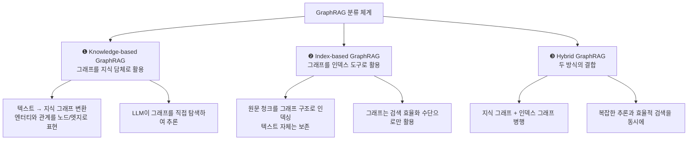
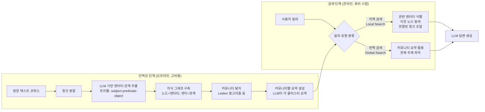
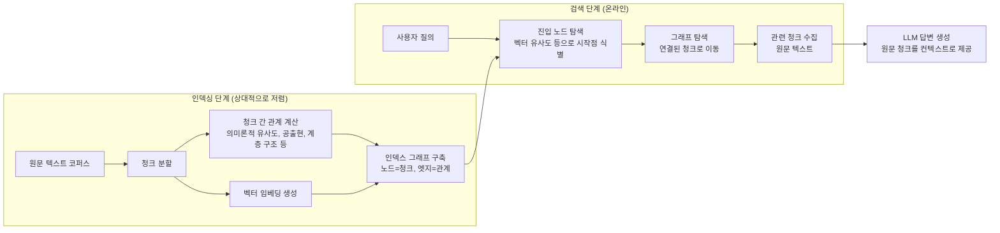
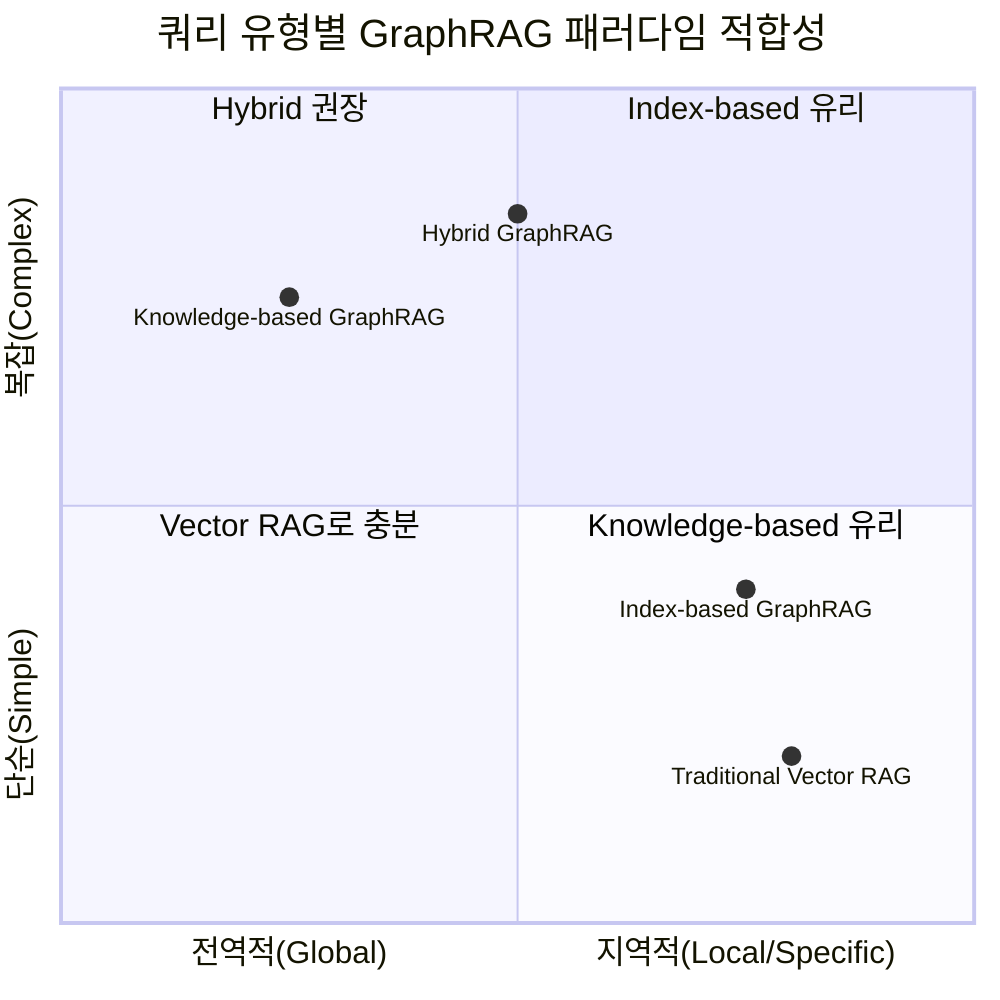
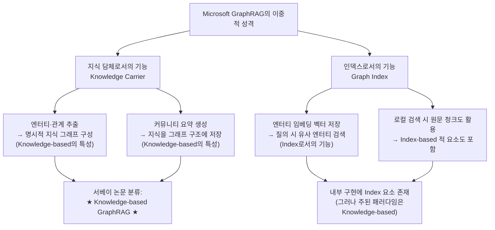
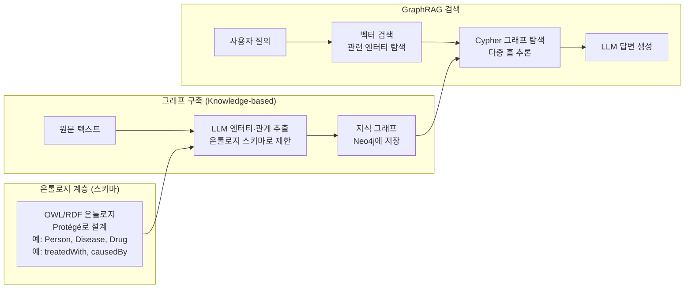
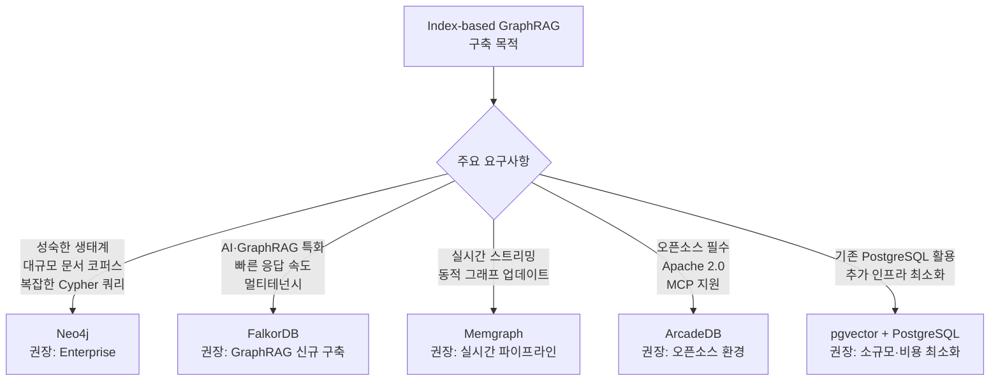

## 그래프 기반 검색증강생성의 두 가지 핵심 패러다임

> **근거 및 출처 안내**  
> 이 문서는 홍콩폴리텍대학교(The Hong Kong Polytechnic University)와 지린대학교(Jilin University) 공동 연구팀이 2025년 1월 발표한 서베이 논문 *"A Survey of Graph Retrieval-Augmented Generation for Customized Large Language Models"* (arXiv:2501.13958)에서 공식 제안·정의된 분류 체계를 중심으로 작성되었습니다. 이 두 용어—**Knowledge-based GraphRAG**와 **Index-based GraphRAG**—는 해당 논문에서 GraphRAG 방법론을 분류하는 세 가지 주요 범주 중 두 가지로 명확히 정의·사용된 실제 학술 용어입니다.

---

## 1. 배경: 왜 GraphRAG가 필요한가

### 전통적인 RAG의 한계

RAG(Retrieval-Augmented Generation)는 대형 언어 모델(LLM)이 외부 지식 베이스에서 관련 정보를 검색하여 더 정확한 답변을 생성하도록 돕는 기법입니다. 기본 원리는 단순합니다. 텍스트를 일정 크기의 청크(chunk)로 분할하고, 각 청크를 벡터로 임베딩하여 벡터 데이터베이스에 저장한 뒤, 사용자 질의와 가장 유사한 청크를 검색해 LLM의 컨텍스트로 제공합니다.

그러나 이 방식은 세 가지 근본적인 문제를 안고 있습니다.

첫째, **복잡한 질의 이해(Complex Query Understanding)** 문제입니다. 여러 문서에 걸쳐 관계를 추론해야 하는 다중 홉(multi-hop) 질의나 "이 코퍼스 전체에서 반복되는 주제는 무엇인가?"와 같은 전역적(global) 질의에 벡터 유사도 검색은 효과적으로 대응하지 못합니다. 벡터 검색은 개별 청크를 독립적으로 취급하므로, 청크들 사이의 관계나 전체적 맥락을 파악하는 데 구조적 한계가 있습니다.

둘째, **분산된 도메인 지식(Distributed Domain Knowledge)** 문제입니다. 하나의 사실이 여러 문서에 분산되어 있거나, 도메인 지식이 문서 전체에 암묵적으로 내포된 경우, 특정 청크 하나만으로는 완전한 답변을 도출할 수 없습니다.

셋째, **효율성과 확장성(Efficiency and Scalability)** 문제입니다. 수십만 개의 문서를 처리해야 하는 기업 환경에서는 단순 벡터 검색만으로는 응답 품질의 일관성을 유지하기 어렵습니다.

GraphRAG는 바로 이 한계를 극복하기 위해 등장했습니다. 그래프 자료구조를 활용하여 엔터티(entity) 간의 관계와 도메인 계층구조를 명시적으로 포착함으로써, 단순한 유사도 기반 검색을 넘어 관계 기반 추론(relational reasoning)을 가능하게 합니다.

---

## 2. GraphRAG의 분류 체계

앞서 언급한 서베이 논문(arXiv:2501.13958)에 따르면, 기존 GraphRAG 방법론은 **그래프 구조를 어떻게 활용하는가**에 따라 크게 세 가지로 분류됩니다.



이 문서에서는 **Knowledge-based GraphRAG**와 **Index-based GraphRAG**의 차이를 중점적으로 설명합니다.

---

## 3. Knowledge-based GraphRAG

### 3.1 핵심 철학: 그래프를 "지식 담체"로

Knowledge-based GraphRAG의 근본 사상은 **비구조적 텍스트를 명시적인 구조적 지식 그래프로 변환**하는 것입니다. 이 접근 방식에서 그래프는 단순한 검색 도구가 아니라, 도메인 지식 자체를 담는 그릇(carrier)입니다. 노드는 도메인 개념이나 엔터티를 나타내고, 엣지는 그 사이의 의미론적 관계를 포착합니다.

서베이 논문은 이를 다음과 같이 정의합니다.

> *"Knowledge-based GraphRAG focuses on transforming unstructured textual documents into explicit and structured KGs, where nodes represent domain concepts and edges capture semantic relationships between entities."*

즉, 원문 텍스트는 전처리 과정에서 그래프로 재구성되며, 이후 LLM은 이 그래프를 탐색·추론함으로써 답변을 생성합니다. 원문보다 그래프에 담긴 관계 정보가 더 중심적인 역할을 합니다.

### 3.2 핵심 파이프라인

Knowledge-based GraphRAG의 전형적인 파이프라인은 다음과 같습니다.



#### (1) 엔터티·관계 추출 (Entity & Relationship Extraction)

텍스트 청크를 LLM에게 제공하여 명명된 엔터티(인명, 지명, 기관명, 개념 등)와 그 사이의 관계를 추출합니다. 예를 들어 "Apple의 창업자인 스티브 잡스는 1976년 Wozniak과 함께 회사를 설립했다"는 문장에서 `(Steve Jobs, founded, Apple)`, `(Steve Jobs, partnered_with, Steve Wozniak)`, `(Apple, founded_in, 1976)` 같은 트리플이 추출됩니다.

Microsoft GraphRAG(Edge et al., 2024)는 이 단계에서 LLM을 적극 활용하여 엔터티와 관계에 풍부한 자연어 설명을 부여합니다. 이는 전통적인 지식 그래프가 간결한 트리플만을 사용하는 것과 구별되는 특징입니다. 즉, Microsoft GraphRAG의 지식 그래프 노드는 단순한 엔터티 이름이 아니라, LLM이 생성한 서술형 설명을 포함합니다.

#### (2) 지식 그래프 구축 (Knowledge Graph Construction)

추출된 트리플로 그래프를 구성합니다. 같은 엔터티가 여러 청크에서 등장하면 하나의 노드로 합쳐지고, 관계들은 엣지로 연결됩니다. 이 과정에서 엔터티 해소(entity resolution), 즉 "Jobs"와 "Steve Jobs"가 동일 인물임을 인식하는 작업이 필요합니다.

#### (3) 커뮤니티 탐지 (Community Detection)

Leiden 알고리즘(Traag et al., 2019)과 같은 커뮤니티 탐지 알고리즘을 사용하여 밀접하게 연결된 엔터티들을 클러스터로 묶습니다. 이렇게 형성된 커뮤니티는 "주제" 또는 "테마"를 나타냅니다. Microsoft GraphRAG에서는 이를 계층적으로 구성하여, Level 0에서는 수천 개의 소규모 클러스터가, Level 2에서는 수십 개의 광범위한 주제 영역이 형성됩니다.

#### (4) 커뮤니티 요약 생성 (Community Summary Generation)

각 커뮤니티에 속한 엔터티와 관계를 LLM에게 제공하여, 해당 커뮤니티가 어떤 주제를 다루는지 자연어 요약을 생성합니다. 이 요약들이 이후 전역 질의(global query)에 응답하는 핵심 재료가 됩니다.

### 3.3 검색 방식: 로컬 검색 vs. 전역 검색

Microsoft GraphRAG는 두 가지 검색 모드를 제공합니다.

**로컬 검색(Local Search)** 은 특정 엔터티에 관한 질의에 적합합니다. 질의에서 관련 엔터티를 식별하고, 해당 엔터티와 연결된 이웃 노드 및 관계를 탐색한 뒤, 연결된 원문 텍스트 단위와 함께 LLM에게 제공합니다. "카모마일의 약효 성분은 무엇인가?"와 같은 구체적 질문에 적합합니다.

**전역 검색(Global Search)** 은 전체 데이터셋에 대한 추상적 질의에 대응합니다. "지난 2주간의 업데이트 내용을 요약해 달라"처럼 코퍼스 전체의 이해가 필요한 질의에서, 커뮤니티 요약들을 종합하여 답변을 생성합니다. 이는 전통적인 벡터 기반 RAG가 전혀 처리하지 못하는 영역입니다.

### 3.4 대표적인 구현 사례

- **Microsoft GraphRAG** (Edge et al., 2024, arXiv:2404.16130): 가장 영향력 있는 Knowledge-based GraphRAG 구현체로, 2024년 4월 논문 발표 후 7월 오픈소스화되어 GitHub에서 수만 개의 스타를 기록했습니다.
- **LightRAG** (Guo et al., 2024): 엔터티와 관계 추출을 기반으로 하되, 로컬·전역 검색 모드를 함께 지원하며 비용 효율성을 개선했습니다.
- **KAG** (Knowledge Augmented Generation, Liang et al., 2024): 전문 도메인(법률, 의료, 금융)에 특화된 KG 기반 접근 방식으로, 도메인 온톨로지와 LLM을 결합합니다.
- **OG-RAG** (Ontology-Grounded RAG): 온톨로지를 기반으로 지식 그래프를 구성하여 더 엄밀한 도메인 표현을 추구합니다.
- **DALK**: 의학 지식 그래프(예: UMLS)를 활용하여 임상 문서에서 정확한 의학적 추론을 지원합니다.

### 3.5 장점과 한계

**장점:**
- 엔터티 간의 복잡한 다중 홉(multi-hop) 추론이 가능합니다. 즉 A→B→C 형태로 여러 관계를 연쇄적으로 탐색할 수 있습니다.
- 전체 코퍼스에 대한 전역적 질의(global query)—"전반적인 주제가 무엇인가?", "모든 계약서에 공통으로 등장하는 책임 조항은?"—에 대응할 수 있습니다.
- 지식 표현이 명시적이므로 답변의 추적가능성(traceability)과 설명가능성(explainability)이 높습니다. 어떤 노드와 엣지를 통해 답변이 도출되었는지 경로를 제시할 수 있습니다.
- 지식이 구조화되어 있어, 모순되거나 오래된 정보를 업데이트하거나 삭제하기 용이합니다.

**한계:**
- **인덱싱 비용이 매우 높습니다.** 모든 청크에 대해 LLM 호출이 필요하므로, Microsoft 자체 보고(2024)에 따르면 대규모 엔터프라이즈 데이터셋의 경우 인덱싱 비용이 수만 달러(약 33,000달러)에 달할 수 있습니다. 3만 2천 단어 분량의 단행본 한 권을 인덱싱하는 데 약 7달러가 소요됩니다.
- **원문 정보의 손실 가능성**이 있습니다. LLM이 추출한 트리플이 원문의 미묘한 뉘앙스나 맥락을 완전히 담아내지 못할 수 있습니다.
- **엔터티 해소(entity resolution)의 어려움:** 동일 엔터티가 다양한 표현으로 등장할 때 이를 하나로 합치는 과정에서 오류가 발생할 수 있습니다.
- LLM 추출 과정에서 노이즈가 포함될 수 있어, 지식 그래프의 품질이 LLM의 성능에 크게 의존합니다.

---

## 4. Index-based GraphRAG

### 4.1 핵심 철학: 그래프를 "인덱스 도구"로

Index-based GraphRAG는 Knowledge-based GraphRAG와 근본적으로 다른 철학을 취합니다. 이 접근 방식에서 **그래프는 원문 텍스트를 대체하지 않고, 원문을 더 효율적으로 검색하기 위한 인덱스 구조로만 활용**됩니다.

서베이 논문(arXiv:2501.13958)은 이를 다음과 같이 정의합니다.

> *"Index-based GraphRAG methods utilize graph structures to index and retrieve relevant raw text chunks, which are then fed into LLMs for knowledge injection and contextual comprehension."*

즉, 텍스트 청크 자체는 그대로 보존됩니다. 그래프는 청크들 사이의 의미론적 유사도나 도메인 특화 관계를 반영하여 연결 구조를 형성하고, 질의 시점에 이 구조를 탐색하여 관련 청크를 효율적으로 찾아냅니다. LLM에게는 그래프 자체가 아니라 원문 텍스트가 제공됩니다.

### 4.2 핵심 파이프라인



Knowledge-based와 달리, 전처리 단계에서 LLM 호출이 최소화됩니다. 청크 간 관계는 주로 임베딩 유사도, 공출현(co-occurrence), 또는 문서 구조적 관계(계층적 요약)를 통해 계산됩니다.

### 4.3 인덱스 그래프의 유형

Index-based GraphRAG에서 그래프를 구성하는 방식은 크게 세 가지입니다.

#### (1) 청크 그래프 (Passage/Chunk Graph)

가장 기본적인 형태로, 텍스트 청크를 노드로 삼고 청크 간의 의미론적 유사도나 공출현 관계를 엣지로 연결합니다. Min et al.(2019)은 이미 공출현 관계를 기반으로 한 청크 그래프가 질의응답 성능을 향상시킨다는 것을 보였습니다. 단, 이 방식은 문서 경계를 넘는 의미론적 연결을 포착하기 어렵다는 한계가 있습니다.

#### (2) 계층적 트리 그래프 (Hierarchical Tree / RAPTOR 방식)

RAPTOR(Sarthi et al., ICLR 2024)는 대표적인 Index-based GraphRAG 구현체입니다. 원문 청크를 리프 노드로 두고, LLM이 생성한 요약을 상위 노드로 구성하는 트리 구조를 형성합니다. 구체적으로, 텍스트를 사전 클러스터링하고 각 클러스터의 요약을 생성한 뒤, 이 요약들을 다시 클러스터링하여 더 추상적인 상위 요약을 만드는 방식으로 계층을 구성합니다.

질의 시에는 트리의 어느 수준에서 검색할지를 선택하거나, 여러 수준을 동시에 활용합니다. 상세한 사실 질의에는 리프 노드(원문 청크)를, 광범위한 주제 질의에는 상위 요약 노드를 사용합니다.

#### (3) 엔터티 링크 그래프 (Entity-linked Graph / HippoRAG 방식)

HippoRAG(Gutiérrez et al., NeurIPS 2024)는 신경생물학적 해마(hippocampus) 기억 모델에서 영감을 받은 방식입니다. 엔터티를 추출하여 그래프의 허브로 활용하되, LLM에 제공하는 최종 결과는 원문 청크입니다. 즉, 그래프는 어떤 청크를 검색할지 안내하는 내비게이션 구조이고, 실제 지식은 원문 텍스트에 남아 있습니다.

HippoRAG2(ICML 2025)는 이를 더 발전시켜, 엔터티 링크 그래프를 통해 관련 엔터티를 먼저 탐색한 뒤 연결된 텍스트 청크를 수집하는 방식으로 검색 품질을 개선했습니다. 이 경우 "그래프가 청크 검색의 보조 구조이지 주된 검색 대상이 아니다"라는 점이 Knowledge-based GraphRAG와의 핵심 차이입니다.

### 4.4 대표적인 구현 사례

- **RAPTOR** (Sarthi et al., ICLR 2024): 계층적 트리 구조로 텍스트를 인덱싱하는 방식. 다양한 추상화 수준에서 정보를 검색할 수 있어, 세부 질의와 광범위한 질의 모두에 대응합니다.
- **HippoRAG** (Gutiérrez et al., NeurIPS 2024) / **HippoRAG2** (ICML 2025): 엔터티 링크 그래프를 인덱스로 활용하여 청크 검색을 안내합니다.
- **KET-RAG** (Huang et al., arXiv:2502.09304, 2025): 멀티-그래뉼러(multi-granular) 인덱싱 프레임워크로, 키워드 그래프와 골격 그래프를 결합하여 비용 효율성을 개선했습니다.
- **GraphRAG-V**: 텍스트 청크 커뮤니티를 활용하여 빠른 다중 홉 검색을 지원하는 인덱스 기반 방식입니다.
- **GraphAnchor** (NEUIR 연구팀, arXiv:2601.16462): 반복적 검색 과정에서 그래프를 점진적으로 업데이트하는 동적 인덱스 방식으로, 주요 엔터티와 관계를 앵커로 활용하여 LLM이 지식 충분성을 평가하고 후속 하위 질의를 구성하도록 안내합니다.

### 4.5 장점과 한계

**장점:**
- **인덱싱 비용이 낮습니다.** LLM 호출이 최소화되므로, Knowledge-based 방식에 비해 인덱싱 비용이 표준 벡터 RAG 수준에 가깝습니다.
- **원문 텍스트를 그대로 보존**하므로, LLM이 원문의 세부 내용을 정확하게 참조할 수 있습니다. 특히 답변이 원문에서 직접 추출되어야 하는 질의응답(QA) 태스크에서 유리합니다.
- 기존 벡터 RAG 인프라에 그래프 레이어를 추가하는 방식으로 점진적 적용이 가능합니다.
- 질의 응답 속도가 빠릅니다(HippoRAG 기준 약 0.8초).

**한계:**
- **전역 질의(global query)에 대응하기 어렵습니다.** "500개 계약서 전체에서 반복되는 책임 조항은 무엇인가?"와 같은 질의에서는 그래프 탐색만으로는 전체 코퍼스에 대한 통합적 이해를 제공하기 어렵습니다.
- 그래프가 원문을 가리키는 인덱스일 뿐이므로, LLM 컨텍스트 창이 제한되어 있을 경우 수많은 청크를 동시에 처리하는 데 한계가 있습니다.
- 엔터티 간의 복잡한 의미론적 관계를 완전히 표현하기 어렵습니다.

---

## 5. 두 패러다임의 핵심 비교

두 방식의 차이는 하나의 근본적인 질문으로 요약됩니다. **"그래프가 지식 자체인가, 아니면 지식을 찾아가는 길잡이인가?"**

| 비교 항목 | Knowledge-based GraphRAG | Index-based GraphRAG |
|---|---|---|
| **그래프의 역할** | 지식 담체(Knowledge Carrier): 지식 자체를 표현 | 인덱스 도구(Index Tool): 검색 경로 안내 |
| **원문 텍스트 처리** | 그래프로 변환·추상화; 원문은 부차적 | 원문 청크 그대로 보존; 그래프는 보조 |
| **LLM에 제공되는 것** | 그래프 노드·엣지·커뮤니티 요약 | 원문 텍스트 청크 |
| **인덱싱 비용** | 매우 높음 (모든 청크에 LLM 호출 필요) | 상대적으로 낮음 (임베딩 중심) |
| **쿼리 응답 속도** | 전역 검색 시 상대적으로 느림 | 빠름 (~0.8초 수준) |
| **전역 질의(global query)** | 강력 (커뮤니티 요약 활용) | 제한적 |
| **다중 홉 추론** | 매우 강력 (그래프 탐색) | 제한적 |
| **세부 사실 질의** | 원문 손실 가능성으로 불리할 수 있음 | 유리 (원문 보존) |
| **설명가능성** | 높음 (경로 추적 가능) | 중간 |
| **적용 도메인** | 의료, 법률, 금융 등 복잡한 전문 도메인 | 일반 문서 검색, 비용 민감 환경 |
| **대표 구현체** | Microsoft GraphRAG, LightRAG, KAG, OG-RAG | RAPTOR, HippoRAG, KET-RAG, GraphAnchor |

---

## 6. 쿼리 유형별 적합성

두 패러다임의 장단점은 **어떤 종류의 질의를 처리하는가**에 따라 명확하게 구분됩니다.



**Knowledge-based GraphRAG가 유리한 경우:**
- "이 의학 논문 전체에서 어떤 치료법이 가장 많이 언급되는가?"
- "모든 계약서에서 반복되는 면책 조항 패턴을 분석해 달라."
- "A 기업의 주요 파트너사들과 그 파트너사들의 경쟁 관계를 추론해 달라." (다중 홉)

**Index-based GraphRAG가 유리한 경우:**
- "BERT 논문에서 어텐션 메커니즘을 설명하는 구절은 어디인가?"
- "이 기술 문서에서 API 엔드포인트 설명을 찾아 달라."
- "특정 판례에서 판사가 내린 결론은 무엇인가?"

---

## 7. Hybrid GraphRAG: 두 방식의 결합

실제 운용 환경에서는 두 방식의 장점을 결합한 **Hybrid GraphRAG**가 점점 더 주목받고 있습니다. 서베이 논문(arXiv:2501.13958)은 이를 세 번째 주요 범주로 분류합니다.

대표적인 하이브리드 전략으로는 다음과 같은 것들이 있습니다.

**KG-Retriever**(2024 말)는 지식 그래프와 원문 데이터를 결합하여 다양한 세밀도(granularity)에서 검색할 수 있는 다중 레벨 그래프 인덱스 구조를 구현했습니다. Knowledge-based의 관계 표현력과 Index-based의 원문 보존성을 동시에 활용합니다.

**DIGIMON**(2025)은 통합·모듈형 그래프 기반 RAG 프레임워크로, 다양한 그래프 구성 방식과 검색 전략을 플러그인 형태로 조합할 수 있습니다.

**Microsoft GraphRAG의 로컬 검색**도 사실상 하이브리드에 가깝습니다. 전역 검색에서는 Knowledge-based 방식(커뮤니티 요약)을 활용하고, 로컬 검색에서는 지식 그래프와 원문 청크를 함께 조합하기 때문입니다.

---

## 8. 비용과 성능의 실제 수치

이 분야의 연구들이 보고한 실제 벤치마크 수치들은 두 패러다임의 트레이드오프를 직관적으로 이해하는 데 도움을 줍니다.

**성능 측면:**
- Microsoft GraphRAG(Knowledge-based)는 전역 질의에서 전통적인 벡터 RAG 대비 72~83% 더 높은 포괄성(comprehensiveness)을 달성했습니다(Microsoft Research, 2024).
- 복잡한 다중 홉 추론에서는 Knowledge-based 방식이 전통적 RAG 대비 3.4배 정확도 향상을 보였습니다(Diffbot KG-LM Benchmark, 2023).
- 일반적인 질의응답에서는 Index-based 방식이 원문 보존 덕분에 더 정확한 세부 사실 답변을 제공하는 경향이 있습니다.

**비용 측면:**
- 전체 Knowledge-based GraphRAG 인덱싱은 전통적 벡터 RAG 대비 100~1000배 비용이 더 든다고 알려져 있습니다.
- Index-based GraphRAG의 인덱싱 비용은 표준 벡터 RAG와 유사한 수준입니다.
- 2025년 6월, Microsoft Research는 **LazyGraphRAG**를 발표하여 Knowledge-based 방식의 인덱싱 비용을 기존의 0.1% 수준으로 대폭 절감하면서도 품질을 유지하는 접근법을 제시했습니다. 이는 두 패러다임의 비용 격차를 좁히는 중요한 발전입니다.

---

## 9. 실제 적용 사례

### Knowledge-based GraphRAG 적용 사례

**의료 분야:** Cedars-Sinai Medical Center는 160만 개의 엣지를 포함한 알츠하이머 연구 지식 그래프를 구축하여, 방대한 의학 문헌에서 유전자·단백질·질환 간의 복잡한 관계를 추론하는 데 활용했습니다(Memgraph, 2024). Precina Health는 당뇨 관리에서 Knowledge-based GraphRAG를 활용하여 월 HbA1c 1% 감소를 달성했는데, 이는 표준 치료 대비 12배 빠른 속도입니다.

**법률 분야:** 수백 개의 계약서에 걸쳐 반복되는 면책 조항, 배상 조항 패턴을 전역 질의로 분석하는 데 Knowledge-based 방식이 적합합니다.

### Index-based GraphRAG 적용 사례

**기술 문서 검색:** 수천 페이지의 API 문서나 기술 매뉴얼에서 특정 함수나 설정 옵션을 정확히 찾는 데, 원문 보존이 중요한 Index-based 방식이 유리합니다.

**다중 홉 QA 벤치마크:** HippoRAG는 MuSiQue, 2WikiMultiHopQA 등 다중 홉 질의응답 벤치마크에서 전통적 RAG 대비 일관된 성능 향상을 보였으며, 특히 사실 검증(fact verification) 태스크에서 강점을 보였습니다.

---

## 10. 결론: 어떤 방식을 선택해야 하는가

Knowledge-based GraphRAG와 Index-based GraphRAG는 서로 경쟁하는 방식이 아니라, 서로 다른 문제를 해결하기 위해 설계된 상호 보완적 패러다임입니다.

**Knowledge-based GraphRAG를 선택해야 하는 상황:**
- 도메인 지식 구조(엔터티 간 관계, 계층 구조)가 질의 응답에 핵심적인 경우
- 전체 코퍼스를 아우르는 전역적·주제적 질의가 주된 경우
- 다중 홉 추론이 자주 요구되는 경우
- 비용보다 품질이 우선시되는 엔터프라이즈 환경

**Index-based GraphRAG를 선택해야 하는 상황:**
- 원문의 정확한 내용이 중요한 경우 (법적 효력이 있는 조항 등)
- 인덱싱 비용을 최소화해야 하는 경우
- 질의 응답 속도가 중요한 경우
- 전통적인 벡터 RAG 인프라를 점진적으로 개선하고자 하는 경우

2024~2025년의 연구 흐름은 이 두 패러다임을 결합한 Hybrid GraphRAG와, 비용을 대폭 절감하면서도 Knowledge-based 방식의 성능을 유지하는 LazyGraphRAG 같은 방향으로 수렴하고 있습니다. 동시에 에이전틱 AI(agentic AI)와 결합한 GraphRAG 연구도 빠르게 성장하고 있으며, NeurIPS 2025 워크숍 "Knowledge Graphs & Agentic Reasoning (NORA)"의 개최는 이 방향이 이미 주류 연구 분야로 자리잡았음을 보여줍니다.

---

## 참고 문헌

1. **Zhang, Q. et al.** (2025). *A Survey of Graph Retrieval-Augmented Generation for Customized Large Language Models.* arXiv:2501.13958. The Hong Kong Polytechnic University & Jilin University. — **본 문서의 핵심 분류 체계 출처.**

2. **Edge, D. et al.** (2024). *From Local to Global: A Graph RAG Approach to Query-Focused Summarization.* Microsoft Research. arXiv:2404.16130. — **Microsoft GraphRAG 원논문.**

3. **Sarthi, P. et al.** (2024). *RAPTOR: Recursive Abstractive Processing for Tree-Organized Retrieval.* ICLR 2024. — **Index-based GraphRAG의 대표 구현체.**

4. **Gutiérrez, B. J. et al.** (2024). *HippoRAG: Neurobiologically Inspired Long-Term Memory for Large Language Models.* NeurIPS 2024. — **Index-based GraphRAG의 대표 구현체.**

5. **Huang, Y., Zhang, S., & Xiao, X.** (2025). *KET-RAG: A Cost-Efficient Multi-Granular Indexing Framework for Graph-RAG.* arXiv:2502.09304.

6. **Microsoft Research.** (2024). *GraphRAG: Improving Global Search via Dynamic Community Selection.* Microsoft Research Blog. — LazyGraphRAG 관련 발표 포함.

7. **GitHub.** *DEEP-PolyU/Awesome-GraphRAG.* https://github.com/DEEP-PolyU/Awesome-GraphRAG — 관련 논문 및 오픈소스 프로젝트 목록.

8. **RAG vs. GraphRAG: A Systematic Evaluation and Key Insights.** (2025). arXiv:2502.11371. — KG-based vs Community-based GraphRAG 비교 평가.

9. **GraphAnchor.** *Graph-Anchored Knowledge Indexing for Retrieval-Augmented Generation.* NEUIR. arXiv:2601.16462.

---

---

# 별첨 A. Microsoft GraphRAG는 Knowledge-based인가? — 분류 혼란의 원인과 정확한 답

## A.1 왜 답변이 달라지는가

Microsoft GraphRAG를 어느 범주에 속하는지 물으면 일관되지 않은 답변을 듣는 이유는 간단합니다. **Microsoft GraphRAG 원논문(Edge et al., arXiv:2404.16130)과, 이를 분류한 서베이 논문(arXiv:2501.13958)이 서로 다른 언어와 개념 틀을 사용하기 때문입니다.** 여기에 더해 GraphRAG라는 용어 자체가 "Microsoft의 특정 구현체"를 가리키기도 하고 "그래프를 활용한 RAG 방법론 전반"을 가리키기도 하는 이중적 사용 관행이 혼란을 가중시킵니다.

아래에서 이 혼란을 단계적으로 해소합니다.

## A.2 Microsoft 원논문이 스스로를 어떻게 설명하는가

Microsoft Research가 2024년 4월 발표한 원논문의 제목은 *"From Local to Global: A Graph RAG Approach to Query-Focused Summarization"* 입니다. 이 논문에서 Edge et al.은 자신들의 접근 방식을 다음과 같이 설명합니다.

> *"Our approach uses an LLM to build a graph index in two stages: first, to derive an entity knowledge graph from the source documents, then to pregenerate community summaries for all groups of closely related entities."*

즉, Microsoft 원논문은 자신들의 시스템을 **"graph index"를 구축하는 방식**으로 소개합니다. "knowledge graph"라는 표현도 사용하지만, 논문 내에서 이를 "graph index"와 혼용하거나 심지어 구분 짓기도 합니다. 결정적으로, 원논문 자체에서 다음과 같이 명시합니다.

> *"These qualities also differentiate our graph index from typical knowledge graphs, which rely on concise and consistent knowledge triples (subject, predicate, object) for downstream reasoning tasks."*

이 문장은 매우 중요합니다. Microsoft 스스로가 자신들의 그래프를 "전형적인 지식 그래프(knowledge graph)"와 **다른 것**으로 설명하고 있습니다. 전통적 지식 그래프는 간결하고 일관된 트리플(subject-predicate-object)에 기반하는 반면, Microsoft GraphRAG의 그래프 노드는 LLM이 생성한 풍부한 자연어 서술(descriptive text)을 담고 있습니다. Microsoft가 선택한 공식 명칭은 "knowledge graph"이지만, 그 성격은 전통적 KG와 다릅니다.

## A.3 서베이 논문은 Microsoft GraphRAG를 어떻게 분류하는가

서베이 논문(arXiv:2501.13958)의 분류 기준에 따르면 Microsoft GraphRAG는 **Knowledge-based GraphRAG**에 속합니다. 그 근거는 다음과 같습니다.

첫째, Microsoft GraphRAG는 비구조적 텍스트를 LLM을 통해 엔터티와 관계로 추출하여 명시적 그래프 구조를 구성합니다. 이것이 Knowledge-based의 핵심 정의인 "그래프를 지식 담체(knowledge carrier)로 활용"에 해당합니다.

둘째, 전역 검색(global search)에서 LLM에 제공되는 컨텍스트는 원문 텍스트 청크가 아니라 **그래프의 커뮤니티 요약**입니다. 즉, 지식의 표현이 그래프 구조(커뮤니티)에 담겨 있고, 원문은 보조 역할을 합니다.

셋째, 서베이 논문의 저자들은 MS-GraphRAG를 Knowledge-based의 대표 구현체로 명시적으로 인용합니다.

## A.4 그렇다면 왜 "Index"라는 단어를 쓰는가

Microsoft 원논문, GitHub 저장소, 공식 문서에는 "knowledge graph"와 "graph index"라는 표현이 혼재합니다. 이는 개념적 혼란이 아니라 **Microsoft가 자신들의 시스템이 두 가지 기능을 동시에 수행한다는 점을 인식하고 있기 때문**입니다.



Microsoft가 "graph index"라는 표현을 사용하는 것은, 자신들의 시스템이 LLM 추론을 위한 구조화된 인덱스 역할을 한다는 의미에서 사용하는 것이지, arXiv:2501.13958의 분류 체계에서 말하는 "Index-based"(원문 청크를 보존하고 그래프는 안내 역할만 함)를 의미하는 것이 아닙니다.

## A.5 결론: Microsoft GraphRAG의 정확한 분류

| 질문 | 답변 |
|---|---|
| Microsoft GraphRAG는 Knowledge-based인가? | **그렇다.** 서베이 논문(arXiv:2501.13958)의 분류 기준에 따르면 Knowledge-based GraphRAG에 속한다. |
| Microsoft GraphRAG는 순수한 전통적 KG인가? | **아니다.** 전통적 KG의 간결한 트리플 대신, LLM이 생성한 풍부한 서술형 텍스트를 노드에 담는 점에서 구별된다. Microsoft 원논문 스스로도 이 점을 명시한다. |
| Microsoft GraphRAG는 Index 기능을 전혀 갖지 않는가? | **아니다.** 엔터티 벡터 임베딩을 통한 인덱싱, 로컬 검색 시 원문 청크 활용 등 Index-based적 요소를 내부적으로 포함한다. 그러나 주된 패러다임과 설계 철학은 Knowledge-based다. |
| 왜 답변이 계속 달라지는가? | Microsoft 원논문이 "graph index"와 "knowledge graph"를 혼용하고, "GraphRAG"라는 단어가 특정 구현체와 방법론 전반을 동시에 가리키기 때문이다. |

## A.6 Neo4j, 온톨로지와의 관계

### Neo4j와 Knowledge-based GraphRAG

Neo4j는 **Knowledge-based GraphRAG의 그래프 저장소로 가장 널리 사용되는 그래프 데이터베이스**입니다. Microsoft GraphRAG의 지식 그래프를 Neo4j에 저장하고 운영하는 패턴은 현재 매우 성숙한 형태로 정착되어 있으며, Neo4j 공식 블로그에서 직접 다루고 있습니다(*"Implementing 'From Local to Global' GraphRAG with Neo4j and LangChain"*, 2024).

Neo4j가 Knowledge-based GraphRAG에 적합한 이유는 세 가지입니다.

**그래프 네이티브 저장 구조:** Neo4j는 노드와 엣지를 포인터 기반으로 직접 연결하는 인덱스-프리 인접성(index-free adjacency) 구조를 채택하고 있습니다. 이 덕분에 3홉 이상의 복잡한 그래프 탐색이 관계형 데이터베이스의 조인 연산보다 훨씬 효율적입니다.

**Cypher 쿼리 언어:** 그래프 패턴을 직관적인 ASCII-art 문법으로 표현할 수 있어, LLM이 자연어 질의를 Cypher로 변환(Text-to-Cypher)하는 데 적합합니다. Neo4j는 LangChain, LlamaIndex와의 통합을 공식 지원하며, Text-to-Cypher 파이프라인을 내장합니다.

**벡터 인덱스 내장:** Neo4j 5.x 이후부터 벡터 인덱스를 네이티브로 지원하여, 그래프 탐색(Cypher)과 벡터 유사도 검색을 하나의 쿼리에서 결합하는 하이브리드 검색이 가능합니다. 이는 Knowledge-based GraphRAG의 로컬 검색에서 "엔터티 벡터 검색 → 그래프 탐색 → 관련 커뮤니티 및 청크 수집"의 파이프라인을 단일 데이터베이스 내에서 처리할 수 있게 합니다.

### 온톨로지와 Knowledge-based GraphRAG

온톨로지(Ontology)는 Knowledge-based GraphRAG와 긴밀하게 연결되는 개념입니다. 온톨로지는 도메인의 개념(클래스), 속성, 관계를 형식적으로 정의한 스키마입니다. 웹 온톨로지 언어(OWL/RDF) 형식으로 표현되며, Protégé 같은 도구로 구축합니다.

온톨로지가 Knowledge-based GraphRAG에 관여하는 방식은 두 가지입니다.

**그래프 구축의 스키마로 활용:** LLM이 텍스트에서 엔터티와 관계를 추출할 때, 온톨로지를 스키마로 제공하면 추출의 정확성과 일관성이 높아집니다. Neo4j의 공식 `neo4j-graphrag` 파이썬 패키지는 RDF 온톨로지 기반의 지식 그래프 구축 파이프라인을 직접 지원합니다. 이를 통해 LLM은 임의의 엔터티·관계를 추출하는 것이 아니라, 온톨로지에서 정의한 타입(예: `Person`, `Organization`, `Disease`)과 관계 유형(예: `treatedWith`, `foundedBy`)만을 추출하도록 제한됩니다. 이는 **OG-RAG(Ontology-Grounded RAG)** 의 핵심 아이디어이기도 합니다.

**기존 지식 베이스의 활용:** 이미 OWL/RDF 형태로 구축된 도메인 온톨로지(예: 의학 분야의 SNOMED CT, 생물학의 Gene Ontology)를 Neo4j로 가져와 Knowledge-based GraphRAG의 지식 그래프로 직접 사용하는 방식입니다. Protégé에서 온톨로지를 설계한 뒤 Neo4j로 내보내는 플러그인도 오픈소스로 개발되어 있습니다.



### Neo4j와 Microsoft GraphRAG의 실제 통합

Neo4j와 Microsoft GraphRAG를 통합하는 방식은 크게 두 가지입니다.

**방식 1 - Neo4j를 백엔드 스토어로:** Microsoft GraphRAG의 인덱싱 파이프라인이 생성한 엔터티, 관계, 커뮤니티 요약을 Neo4j에 저장합니다. 이후 질의 시에는 Neo4j의 Cypher 쿼리와 벡터 인덱스를 활용하여 관련 서브그래프를 탐색합니다. Neo4j 공식 블로그(2024)에서 이 통합 패턴의 전체 구현 예시를 공개하고 있습니다.

**방식 2 - neo4j-graphrag Python 패키지 활용:** Neo4j가 공식 제공하는 `neo4j-graphrag` 파이썬 패키지(2024~2025 적극 개발 중)는 비구조적 텍스트에서 Neo4j 지식 그래프를 구축하는 전체 파이프라인을 제공합니다. 엔터티 추출, 해소, 저장, 벡터 검색, 그래프 탐색 기반 RAG를 통합합니다.

---

---

# 별첨 B. Index-based GraphRAG를 Neo4j로 구축할 수 있는가

## B.1 핵심 답변

**Neo4j로 Index-based GraphRAG를 구축하는 것은 가능합니다.** 다만, Index-based 방식은 Knowledge-based 방식에 비해 그래프 데이터베이스의 역할이 제한적입니다. 그 이유와 구체적인 구현 방식, 그리고 Neo4j보다 유리할 수 있는 대안 솔루션을 차례로 설명합니다.

## B.2 Index-based GraphRAG의 인프라 요구사항 재확인

Index-based GraphRAG에서 그래프는 **원문 청크를 연결하는 탐색 구조**입니다. 청크(노드)와 청크 간 관계(엣지)를 저장하고, 질의 시 관련 청크로 이어지는 경로를 탐색하는 것이 핵심입니다. 이 때문에 Index-based 방식의 인프라 요구사항은 다음과 같습니다.

- 텍스트 청크를 노드로, 유사도/관계를 엣지로 저장하는 그래프 구조
- 초기 진입점 탐색을 위한 벡터 유사도 검색
- (선택적) 그래프 알고리즘(PageRank, BFS 등)으로 관련 노드 탐색

이 요구사항을 Neo4j가 모두 충족할 수 있는지를 각 대표 구현체별로 살펴봅니다.

## B.3 구현체별 Neo4j 적용 가능성 분석

### RAPTOR (계층적 트리 인덱스)

RAPTOR의 구조는 텍스트 청크(리프 노드)와 그 요약(상위 노드)으로 이루어진 트리입니다. Neo4j로 이를 구현하는 방법은 다음과 같습니다.

```
(:TextChunk {content: "...", embedding: [...]})-[:SUMMARIZED_BY]->(:Summary {content: "...", level: 1})-[:SUMMARIZED_BY]->(:Summary {content: "...", level: 2})
```

청크와 요약을 노드로, 요약 관계를 엣지로 Neo4j에 저장하면 계층적 탐색이 가능합니다. 질의 시 벡터 인덱스로 관련 노드를 찾은 뒤, Cypher로 상위/하위 수준을 탐색합니다. **Neo4j로 구현 가능하며, 공식적으로도 LlamaIndex의 `Neo4jPropertyGraphIndex`를 통해 RAPTOR와 유사한 계층적 인덱싱이 지원됩니다.**

### HippoRAG (엔터티 링크 그래프)

HippoRAG는 엔터티를 허브 노드로 두고, 각 엔터티가 출현하는 원문 청크와 연결되는 구조입니다. 그래프 탐색 알고리즘으로는 Personalized PageRank(PPR)를 사용합니다.

```
(:Entity {name: "Steve Jobs"})-[:APPEARS_IN]->(:TextChunk {content: "..."})
(:Entity {name: "Apple"})-[:APPEARS_IN]->(:TextChunk {content: "..."})
(:Entity {name: "Steve Jobs"})-[:CO_OCCURS]->(:Entity {name: "Apple"})
```

Neo4j는 APOC 라이브러리와 Graph Data Science(GDS) 플러그인을 통해 PageRank 알고리즘을 지원합니다. 따라서 HippoRAG의 PPR 기반 탐색도 Neo4j에서 구현할 수 있습니다. 다만, GDS 플러그인은 Neo4j Enterprise에서 완전한 기능을 제공하며, Community Edition에서는 일부 기능이 제한됩니다.

**Neo4j로 구현 가능하며**, Neo4j Labs 페이지에서도 HippoRAG를 GraphRAG 구현 참고 자료로 소개하고 있습니다.

### GraphAnchor (동적 인덱스 방식)

GraphAnchor는 반복적 검색 과정에서 그래프를 점진적으로 업데이트하는 동적 방식입니다. 각 검색 라운드마다 새 노드·엣지가 추가됩니다. Neo4j의 트랜잭션 기반 쓰기가 이를 지원할 수 있지만, 빈번한 업데이트로 인한 쓰기 오버헤드가 발생할 수 있습니다. **가능하나 실시간 업데이트 빈도가 높으면 성능에 주의가 필요합니다.**

## B.4 Neo4j로 Index-based GraphRAG를 구축할 때의 고려사항

Neo4j는 Index-based GraphRAG 구축에 활용될 수 있지만, 몇 가지 실질적인 고려사항이 있습니다.

**장점:**
- Cypher 쿼리로 그래프 탐색, 벡터 검색, 필터링을 하나의 쿼리에서 결합할 수 있습니다.
- LangChain, LlamaIndex와의 공식 통합이 잘 정비되어 있습니다.
- 방대한 생태계와 문서, 커뮤니티가 존재합니다.

**한계:**
- Community Edition은 클러스터링(수평 확장)을 지원하지 않아, 대규모 코퍼스에서 확장성이 제한됩니다.
- JVM 기반 구조로 인해 콜드 스타트 지연(90ms)이 있고, 초기 메모리 사용량이 높습니다(4GB 힙 사전 할당).
- Enterprise Edition의 라이선스 비용이 높습니다(연간 $150K 이상 수준).
- Graph Data Science(GDS) 플러그인의 일부 알고리즘은 Enterprise 전용입니다.

## B.5 Neo4j 대안 솔루션

Index-based GraphRAG 구축 시 목적에 따라 Neo4j보다 더 적합한 솔루션이 존재합니다.

### FalkorDB — AI/GraphRAG 특화

FalkorDB는 RedisGraph를 계승한 그래프 데이터베이스로, **GraphRAG에 특화된 목적 설계**가 강점입니다. 2023년 출범한 비교적 새로운 프로젝트입니다.

특징으로는 Redis의 인메모리 아키텍처를 기반으로 하여 쿼리 응답 속도가 매우 빠릅니다(벤치마크 기준 Neo4j 대비 콜드 스타트 1.1ms vs. 90ms). `GraphRAG-SDK`를 공식 제공하며, 비구조적 데이터에서 온톨로지와 지식 그래프를 자동 생성하는 기능을 내장합니다. 벡터 검색을 Cypher 쿼리에 네이티브로 통합하여 그래프 탐색과 시맨틱 검색을 단일 쿼리에서 수행할 수 있습니다. LangChain, LlamaIndex 통합도 공식 지원합니다.

다만, 단일 스레드 기반 Redis 아키텍처로 인해 쓰기 집중 워크로드에서 병목이 발생할 수 있으며, 소스 공개(source-available) 라이선스로 오픈소스(OSI 정의)는 아닙니다.

### Memgraph — 실시간 스트리밍 그래프

Memgraph는 C++ 기반 인메모리 그래프 데이터베이스로, **실시간 스트리밍 데이터**와 결합한 동적 그래프 인덱스 업데이트에 강점이 있습니다.

Kafka, Pulsar와 네이티브 통합을 지원하여, 실시간으로 새로운 문서가 추가될 때 인덱스 그래프를 자동 업데이트하는 파이프라인 구성이 가능합니다. Neo4j와 Cypher 문법이 95% 이상 호환되어 마이그레이션 장벽이 낮습니다. Community Edition은 무제한 스토리지를 무료로 제공합니다. 계층적 커뮤니티 탐지(Leiden 알고리즘)를 MAGE 모듈을 통해 지원하며, Memgraph 3.0부터 이를 공식 지원합니다. GraphAnchor처럼 동적으로 업데이트되는 Index-based 구조에 적합합니다.

단, 그래프 크기가 RAM을 초과하면 성능이 급격히 저하되고, Enterprise 라이선스 비용이 연간 $25,000 이상입니다.

### LlamaIndex + pgvector (PostgreSQL 기반)

PostgreSQL에 pgvector 확장을 추가하는 방식은 **그래프 데이터베이스 없이** Index-based GraphRAG를 구현하는 현실적인 대안입니다. RAPTOR와 같이 계층적 요약 구조를 PostgreSQL 테이블과 외래키 관계로 표현하고, pgvector로 벡터 검색을 수행합니다. LlamaIndex는 이 패턴을 공식 지원하며, 기존 PostgreSQL 인프라가 있는 조직에서 추가 비용 없이 Index-based GraphRAG를 도입할 수 있습니다.

### ArcadeDB — 오픈소스(Apache 2.0)

ArcadeDB는 Apache 2.0 라이선스의 순수 오픈소스 멀티모델 그래프 데이터베이스입니다. 2026년 기준 Neo4j 대안 중 OSI 인증 오픈소스 라이선스를 유지하는 몇 안 되는 솔루션 중 하나입니다. MCP(Model Context Protocol) 서버가 내장되어 LLM과의 직접 연동을 지원하며, 네이티브 벡터 검색 기능도 포함합니다. Neo4j 데이터베이스 파일을 직접 임포트하는 기능이 있어 마이그레이션 비용이 낮습니다.

## B.6 솔루션 비교 요약



| 솔루션 | 라이선스 | GraphRAG 생태계 | 벡터 검색 | 실시간 업데이트 | 특이사항 |
|---|---|---|---|---|---|
| Neo4j | Community(무료)/Enterprise(유료) | 매우 성숙 | 5.x 이후 네이티브 | 가능(쓰기 오버헤드) | GDS 플러그인 일부 Enterprise 전용 |
| FalkorDB | Source-Available | GraphRAG-SDK 내장 | 네이티브(Cypher 통합) | 빠름 | 인메모리, 단일 스레드 한계 |
| Memgraph | BSL 1.1 | MAGE 모듈 | 지원 | 최강(Kafka/Pulsar 네이티브) | RAM 상한 이슈 |
| ArcadeDB | Apache 2.0 | 개발 중 | 네이티브 | 가능 | MCP 서버 내장 |
| pgvector | Apache 2.0 | LlamaIndex 통합 | pgvector | 가능 | 그래프 탐색 기능 제한 |

## B.7 정리

Index-based GraphRAG를 Neo4j로 구축하는 것은 기술적으로 **충분히 가능**합니다. RAPTOR 형태의 계층적 트리 인덱스, HippoRAG 형태의 엔터티 링크 그래프 모두 Neo4j의 Cypher와 벡터 인덱스를 조합하여 구현할 수 있으며, LangChain·LlamaIndex와의 통합도 잘 정비되어 있습니다.

그러나 **AI·GraphRAG 신규 구축**이 목적이라면 FalkorDB의 GraphRAG-SDK가 더 특화된 기능을 제공합니다. **실시간 문서 스트리밍**이 필요하다면 Memgraph가 유리하며, **순수 오픈소스**가 요구사항이라면 ArcadeDB가 현실적인 선택입니다. 기존 PostgreSQL 인프라가 있고 규모가 크지 않다면 pgvector 기반 접근도 실용적입니다.

---

## 참고 문헌 (별첨 추가분)

10. **Edge, D. et al.** (2024). *From Local to Global: A Graph RAG Approach to Query-Focused Summarization.* arXiv:2404.16130. — 원논문에서 "graph index"와 "knowledge graph" 혼용 확인.

11. **Neo4j.** *Implementing 'From Local to Global' GraphRAG with Neo4j and LangChain.* Neo4j Developer Blog, 2024.

12. **Neo4j.** *neo4j-graphrag Python Package.* https://neo4j.com/docs/neo4j-graphrag-python/

13. **Neo4j.** *Ontology-Driven Knowledge Graph for GraphRAG.* Deepsense.ai Notebook, 2025.

14. **FalkorDB.** *GraphRAG-SDK Documentation.* https://www.falkordb.com/ — GraphRAG 특화 그래프 데이터베이스.

15. **Gutiérrez, B. J. et al.** (2024). *HippoRAG: Neurobiologically Inspired Long-Term Memory.* arXiv:2405.14831. — PPR 기반 Index-based 구현.

16. **ArcadeDB Blog.** (2026). *Neo4j Alternatives in 2026: A Fair Look at the Open-Source Options.* — 라이선스 현황 및 대안 솔루션 비교.

17. **Graph Database Benchmark: Neo4j vs FalkorDB vs Memgraph.** AIM Multiple, 2026. — 성능 벤치마크 수치.

---

*최종 업데이트: 2026년 5월*  
*본 문서는 공개된 학술 논문 및 연구 블로그를 기반으로 작성되었으며, 추측이나 미확인 정보를 포함하지 않습니다.*
