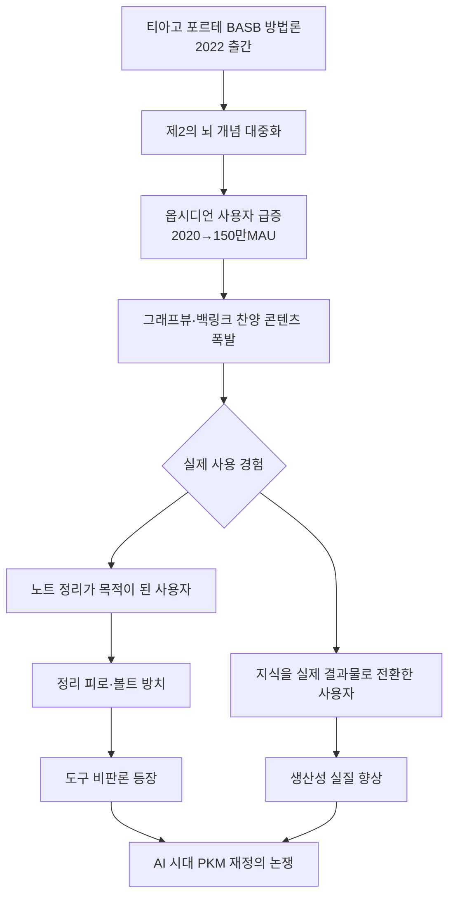
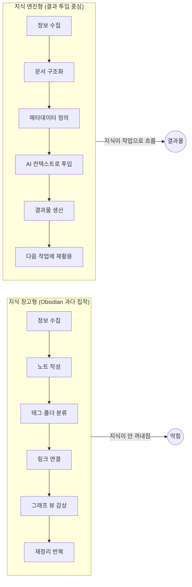
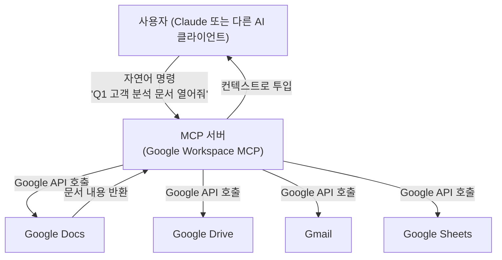
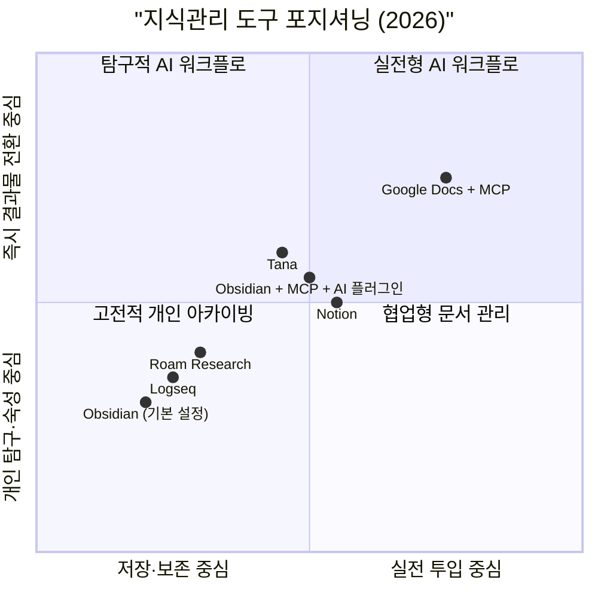
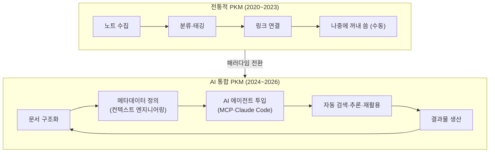

---

## 들어가며: 왜 지금 이 논쟁인가

2026년 현재, 생산성 커뮤니티와 소셜 미디어에는 "제2의 뇌(Second Brain)"를 구축하라는 콘텐츠가 넘쳐난다. 유튜브를 열면 옵시디언(Obsidian)의 그래프 뷰가 화면을 가득 채우고, 링크드인에는 수백 개의 노트가 아름다운 거미줄처럼 연결된 볼트(Vault) 구조가 자랑처럼 공유된다. 티아고 포르테(Tiago Forte)가 2022년 출간한 『Building a Second Brain』이 불을 붙인 이 흐름은, 이제 하나의 문화적 현상이 되었다.

그러나 최근 이 흐름에 정면으로 반기를 드는 목소리들이 등장하고 있다. 한국의 비즈니스 커뮤니티를 중심으로, "옵시디언으로 정말 일이 잘 되었는가"를 묻는 현실적인 질문이 쏟아지기 시작했다. 이 글은 그 질문들의 구조를 해부하고, PKM(Personal Knowledge Management, 개인 지식관리)이라는 개념이 AI 시대에 어떻게 재편되어야 하는지를 진지하게 살펴본다.

---

## 1. 옵시디언이란 무엇인가

옵시디언은 2020년 3월, 캐나다의 두 개발자가 출시한 로컬 기반 마크다운 노트 앱이다. 앱의 핵심 철학은 단순하다. 사용자의 노트는 평문(Plain Text) 마크다운 파일로 사용자의 기기에 저장되며, `[[쌍괄호]]` 문법으로 노트끼리 양방향 링크(Backlink)를 형성하면 그래프 뷰(Graph View)에서 지식의 연결망이 시각적으로 펼쳐진다.

이 단순한 아이디어가 폭발적인 반향을 일으켰다. 출시 이후 꾸준히 성장해 2026년 2월 기준 월간 활성 사용자(MAU) 약 150만 명을 돌파했으며, 연간 매출은 약 200만 달러에 달한다. 18명의 팀이 벤처캐피탈 없이 부트스트랩으로 운영하는 회사치고는 이례적인 성과다. 커뮤니티 플러그인은 2,700개를 넘어섰고, 공식 디스코드 서버에는 7만 명 이상이 참여하고 있다.

기술적 특성을 정리하면 다음과 같다.

- **로컬 퍼스트(Local-First)**: 모든 노트는 사용자 기기의 폴더에 `.md` 파일로 저장된다. 클라우드에 데이터를 강제로 업로드하지 않는다.
- **양방향 링크(Bidirectional Linking)**: A 노트에서 B를 언급하면, B 노트의 백링크 패널에도 A가 자동으로 표시된다.
- **그래프 뷰**: 노트 간 연결 관계를 네트워크 다이어그램으로 시각화한다. 노트가 많아질수록 복잡한 지식 지도가 그려진다.
- **마크다운 기반**: 벤더 종속(Vendor Lock-in) 없이 어떤 텍스트 편집기로도 읽고 편집할 수 있다.
- **플러그인 생태계**: Dataview, Templater, Excalidraw, Smart Connections 등 수천 개의 커뮤니티 플러그인으로 기능을 무한히 확장할 수 있다.

이러한 특성들이 프라이버시를 중시하는 연구자, 개발자, 작가 집단에게 강하게 어필했다. 특히 제텔카스텐(Zettelkasten) 방법론을 실천하려는 사용자들에게 옵시디언은 사실상 표준 도구가 되었다.

---

## 2. 제2의 뇌 운동의 부상과 옵시디언의 결합

옵시디언의 인기는 단독으로 형성된 것이 아니다. 티아고 포르테의 BASB(Building a Second Brain) 방법론과 맞물리면서 폭발적으로 커졌다.

포르테의 핵심 주장은 이렇다. 인간의 뇌는 아이디어를 저장하는 데 적합하지 않고 아이디어를 처리하는 데 적합하다. 따라서 모든 지식을 외부 디지털 시스템에 저장하고, 이를 CODE 프레임워크(Capture → Organize → Distill → Express)와 PARA 구조(Projects, Areas, Resources, Archives)로 관리하면 창의적 생산성이 극적으로 높아진다는 것이다.

BASB 방법론은 출시 이후 2만 5천 명 이상의 유료 수강생을 모았다. 포르테 본인도 2025년 연간 리뷰에서 AI 중심으로 커리큘럼을 전면 피벗하겠다고 선언하면서, 2026년에는 "AI 퍼스트 세컨드 브레인" 프로그램을 새롭게 출시할 계획임을 밝혔다. 이는 역설적으로 기존 BASB 방법론만으로는 AI 시대에 충분하지 않다는 사실을 포르테 자신도 인정하는 신호로 읽힌다.

문제는 BASB와 옵시디언의 결합이 일종의 **생산성 컬트(Productivity Cult)** 를 형성했다는 점이다. 유튜브에는 "완벽한 볼트 구조", "그래프 뷰를 아름답게 만드는 법", "수천 개의 노트를 관리하는 나만의 시스템" 같은 콘텐츠가 넘쳐나기 시작했다. 정작 그 지식으로 어떤 결과물을 만들었는지에 대한 이야기보다, 시스템 자체를 정교하게 만드는 과정이 콘텐츠의 주인공이 되어 버린 것이다.

---

## 3. 비판의 핵심: "정리 취함(Organizational Intoxication)"

Threads의 해당 게시글과 댓글들이 집중적으로 지적하는 문제는 하나의 개념으로 요약할 수 있다. 그것은 **정리 행위 자체에 도취되어 정작 지식을 써야 할 실제 작업에 기여하지 못하는 상태**다.

이를 단계별로 살펴보면 다음과 같다.

### 3-1. 초기 단계: 유사 생산성의 쾌감

옵시디언을 처음 설치하고 볼트를 만드는 과정에는 분명한 쾌감이 있다. 폴더 구조를 설계하고, 태그 체계를 잡고, 첫 번째 노트들을 연결하면 그래프 뷰에 나만의 지식 지도가 펼쳐진다. 마치 내 머릿속이 정돈된 것 같은 느낌, 일이 잘 되고 있다는 착각이 찾아온다.

심리학적으로 이 현상은 "완료 편향(Completion Bias)"과 관련이 있다. 노트를 만들고 연결하는 행위 자체가 뇌에서 작은 보상 신호를 만들어낸다. 실제로 어떤 결과를 만들어내지 않아도, 준비하고 정리하는 행위만으로도 도파민이 분비된다. 이것이 옵시디언 사용 초기에 많은 사람들이 "이제 제대로 된 시스템을 갖췄다"는 착각에 빠지는 이유다.

### 3-2. 중기 단계: 메타 작업의 증식

시간이 지나면서 노트가 쌓이기 시작하면 새로운 문제가 등장한다. "이 노트는 어느 폴더에 넣어야 하는가", "어떤 태그를 달아야 적절한가", "이 개념은 어떤 노트와 연결해야 하는가" 같은 결정들이 무한정 쌓인다. 지식을 관리하는 데 필요한 **메타 작업(Meta-work)** 이 본 작업을 잠식하기 시작하는 것이다.

한 사용자가 2025년 11월에 작성한 글에서도 비슷한 경험이 소개된다. BASB 방법론을 1년 반 동안 실천하다가 2023년 말부터 볼트가 지나치게 비대해졌다는 느낌을 받기 시작했고, 결국 링크와 연결에 집착할수록 목적보다 수단에 매몰된다는 결론에 도달했다는 것이다. 진짜 창의적 돌파구는 체계적인 링크 설계에서 오는 것이 아니라, 예상치 못한 우연한 연결에서 온다는 관찰도 덧붙였다.

### 3-3. 후기 단계: 지식 창고와 지식 엔진의 분리

가장 심각한 문제는 옵시디언 볼트가 결국 **잘 꾸며진 지식 창고**로 끝난다는 것이다. 콘텐츠를 쓸 때, 기획서를 만들 때, 고객 제안서를 작성할 때, AI와 대화할 때 — 막상 꺼내 쓰려고 하면 옵시디언에서 직접 검색하고 복붙하는 과정이 여전히 필요하다. 지식이 "연결된 것처럼 보이는 것"과 지식이 "실제 작업으로 투입되는 것"은 완전히 다른 차원의 문제다.

---

## 4. 옵시디언이 진짜 잘 맞는 사람들

비판론이 강하다고 해서 옵시디언이 나쁜 도구라는 뜻은 아니다. 어떤 도구든 용도와 사용자 유형이 맞아야 빛을 발한다. 옵시디언이 실질적으로 강점을 보이는 맥락은 다음과 같다.

**연구자와 학자**: 논문 하나를 읽고 개념을 노트로 정리한 뒤, 그것을 수십 개의 다른 논문 노트와 연결하면서 이론적 틀을 쌓아가는 작업에는 양방향 링크가 큰 도움이 된다. 인문학, 철학, 이론 사회과학 분야처럼 개념 간의 관계를 오랜 시간에 걸쳐 숙성시켜야 하는 영역에서 특히 그렇다.

**개인 사유와 독서 노트**: 책을 읽고 인상적인 구절과 생각을 기록하면서 자신만의 지적 여정을 문서화하는 용도로는 옵시디언이 탁월하다. 이 경우 지식이 즉시 결과물로 전환될 필요가 없기 때문에, 느린 숙성의 과정 자체가 가치 있다.

**깊은 탐구를 즐기는 사람**: 특정 주제를 몇 달에 걸쳐 파고드는 사람, 생각을 오래 발효시키는 사람에게는 로컬 기반의 프라이버시 보호와 평문 마크다운의 내구성이 강점이다. 벤더 종속 없이 20년 후에도 파일을 읽을 수 있다는 사실 자체가 중요한 가치다.

**AI와 결합한 고급 워크플로**: 2026년 현재, 옵시디언은 MCP(Model Context Protocol)를 통해 Claude Code가 볼트를 직접 읽고 쓸 수 있는 구조를 지원한다. `mcp-obsidian` 레포지토리(GitHub 별 3,600개)나 `obsidian-claude-code-mcp` 플러그인을 통해 Claude가 노트를 검색하고 추론할 수 있는 환경이 갖춰지고 있다. 이렇게 되면 옵시디언 볼트는 단순한 저장소에서 AI가 읽을 수 있는 컨텍스트 기반으로 진화한다.

그러나 이 마지막 사례, 즉 "AI와 연결된 옵시디언"은 역설적으로 이 글의 비판과 궤를 같이한다. AI에게 투입될 수 있게 구조화된 문서라면, 굳이 옵시디언의 복잡한 그래프와 링크 체계를 갖추지 않아도 된다는 의미이기 때문이다.

---

## 5. 구글 독스 + MCP 조합의 현실 논리

게시글의 핵심 대안 주장은 명쾌하다. 사업을 하거나, 콘텐츠를 만들거나, 고객 프로젝트를 반복하거나, AI를 업무에 연결하려는 사람이라면 구글 독스가 더 실전적이라는 것이다. 그 이유를 구체적으로 분석해보자.

### 5-1. MCP란 무엇인가

MCP(Model Context Protocol)는 Anthropic이 개발하고 오픈소스로 공개한 표준 프로토콜로, AI 모델이 외부 도구와 데이터 소스에 접근할 수 있게 해주는 "범용 어댑터"다. Claude, Cursor, Windsurf 등 MCP를 지원하는 AI 클라이언트는 이 프로토콜을 통해 구글 독스, 구글 드라이브, 지메일, 슬랙, 노션 등 수십 가지 외부 서비스와 연동할 수 있다.

2025년 초 출시된 구글 워크스페이스 MCP 서버는 특히 주목할 만하다. OAuth 2.1 기반의 인증, 멀티유저 지원, Claude Desktop용 원클릭 설치(DXT 포맷) 기능을 갖추고 있으며, Gmail, Drive, Calendar, Docs, Sheets 등을 자연어 명령으로 제어할 수 있다. 기존에 30분이 걸리던 JSON 설정 작업이 더블클릭 한 번으로 줄어든 것이다.

### 5-2. 왜 구글 독스 문서가 AI 작업에 더 실전적인가

옵시디언 볼트의 마크다운 파일은 로컬에 존재하기 때문에, AI에게 투입하려면 파일을 직접 열거나 MCP 서버를 별도로 구성해야 한다. 반면 구글 독스는 이미 클라우드에 존재하며, 명확한 제목과 구조를 갖춘 문서는 구글 드라이브 MCP를 통해 AI가 즉시 검색하고 읽을 수 있다.

핵심 차이는 **문서의 재사용 경로**에 있다. 구글 독스에 "2025년 4분기 A사 고객 분석" 문서를 잘 작성해두면, 그 문서 하나가 다음 경로로 재활용될 수 있다.

고객 미팅 전 브리핑 → 제안서 초안 작성 → 랜딩페이지 카피 작성 → SEO 글 작성 → GPT/Claude 시스템 프롬프트 설계 → 강의 자료 제작

이 모든 경로에서 AI는 구글 드라이브 MCP를 통해 해당 문서를 불러와 컨텍스트로 삼을 수 있다. 별도의 복붙이 필요 없고, 링크 체계를 설계할 필요도 없다. 문서 제목과 구조가 명확하기만 하면 된다.

게시글의 한 댓글이 정확히 지적했듯이, 옵시디언이 제공하는 것은 "폴더를 그래프로 보여주는 시각화 레이어"에 가깝다. 사람이 지식을 설계하고, 품질을 검토하고, 실제 작업 흐름 안으로 집어넣는 판단력이 없으면 아무리 정교한 링크 구조도 "용량만 잡아먹는 빅데이터"가 될 뿐이다.

---

## 6. 지식관리의 두 가지 철학적 패러다임

이 논쟁의 밑바닥에는 지식관리에 대한 두 개의 근본적으로 다른 철학이 존재한다.

### 6-1. 라이브러리 패러다임 (Library Paradigm)

지식을 최대한 잘 분류하고 연결해서 나중에 꺼낼 수 있게 보존하는 것이 목적이다. 니클라스 루만(Niklas Luhmann)의 제텔카스텐, 바네바 부시(Vannevar Bush)의 메멕스(Memex) 구상, 그리고 옵시디언의 그래프 뷰가 이 철학의 연장선에 있다. 이 관점에서 이상적인 PKM 시스템은 마치 훌륭한 도서관처럼, 어떤 지식이든 빠르게 찾아낼 수 있는 분류 체계를 갖추는 것이다.

### 6-2. 파이프라인 패러다임 (Pipeline Paradigm)

지식의 가치는 그것이 다음 행동으로 얼마나 빠르게 전환되느냐에 있다. 아카이빙 자체보다 **재사용 가능한 판단 기준의 축적**을 목표로 삼는다. 어제 정리한 고객 분석이 오늘의 제안서가 되고, 오늘 만든 프레임워크가 내일의 AI 지침이 되는 구조다. 이 관점에서 좋은 지식관리 시스템은 지식이 일의 흐름 안으로 자동적으로 투입되도록 설계된 파이프라인이다.

물론 이 두 패러다임은 상호 배타적이지 않다. 그러나 대부분의 옵시디언 찬양 콘텐츠가 라이브러리 패러다임에만 집중하면서, 파이프라인 패러다임의 중요성을 간과하고 있다는 것이 비판의 요점이다.

---

## 7. AI 시대 PKM의 구조적 전환

2025~2026년을 기점으로 PKM 생태계에는 구조적 변화가 일어나고 있다. 개인 지식관리 AI 시장 규모는 2025년 기준 약 16억 5천만 달러에 달하며, 2030년까지 연평균 30.3% 성장해 61억 5천만 달러에 이를 전망이다. 이 성장의 핵심 동력은 AI와의 통합이다.

변화의 핵심은 PKM 시스템의 역할이 "수동적 저장소"에서 "능동적 AI 컨텍스트 레이어"로 이동한다는 것이다. 이 전환을 몇 가지 흐름으로 정리할 수 있다.

### 7-1. LLM 위키(LLM Wiki) 패턴의 부상

Andrej Karpathy가 제안하고 개발자 커뮤니티에서 빠르게 확산된 LLM 위키 패턴은 RAG(Retrieval-Augmented Generation, 검색 증강 생성) 없이도 LLM이 개인 지식을 효율적으로 활용할 수 있게 하는 구조다. 핵심은 소스 문서를 벡터 DB에 넣는 것이 아니라, LLM이 직접 읽고 유지관리할 수 있는 마크다운 파일로 "컴파일"하는 것이다. 이렇게 하면 LLM이 매 대화마다 컨텍스트를 처음부터 구성하는 "세션 기억상실" 문제를 해소할 수 있다.

`claude-obsidian` 오픈소스 프로젝트(GitHub 358 별)는 이 패턴을 옵시디언 위에 구현한 사례다. 소스 문서를 수집하면 AI가 자동으로 위키 페이지를 작성하고, 새 정보가 기존 페이지와 충돌하면 자동으로 `[!contradiction]` 표시를 생성한다. 매 쿼리당 5,000 토큰 이하로 컨텍스트를 유지하는 구조도 갖췄다.

### 7-2. CLAUDE.md 프로토콜

Claude Code를 비롯한 AI 에이전트들은 볼트 루트에 `CLAUDE.md` 파일이 있으면 그것을 읽어 볼트 구조와 탐색 방식을 이해하는 관례가 형성되고 있다. 이는 "AI가 읽을 수 있는 지식 저장소"를 설계하는 새로운 규범으로 자리잡는 중이다.

### 7-3. 컨텍스트 엔지니어링의 등장

단순히 노트를 연결하는 것이 아니라, AI가 정확한 컨텍스트를 검색할 수 있도록 태그, 링크, 메타데이터를 구조화하는 "컨텍스트 엔지니어링(Context Engineering)"이 2026년 지식 노동자의 핵심 역량으로 부상하고 있다. 이는 옵시디언이든 구글 독스든 어떤 도구를 쓰든 적용되는 원칙이다.

---

## 8. 두 도구의 솔직한 비교

비판론이 옳고 찬양론이 그른 것도, 반대도 아니다. 도구의 특성과 사용자의 목적을 냉정하게 비교하는 것이 더 유익하다.

| 비교 항목 | 옵시디언 | 구글 독스 + MCP |
|---|---|---|
| **데이터 소유권** | 완전한 로컬 소유 | 구글 서버 저장 |
| **프라이버시** | 최상 | 구글 정책에 의존 |
| **AI 투입 용이성** | MCP 설정 필요 | MCP 원클릭 연동 |
| **협업** | 제한적 | 실시간 협업 강점 |
| **재활용 경로** | 수동 복붙 필요 | 자연어로 즉시 불러오기 |
| **학습 곡선** | 높음 (플러그인·설정) | 낮음 |
| **장기 보존성** | 마크다운으로 영구 보존 | 구글 서비스 의존 |
| **최적 사용자** | 연구자·개발자·작가·철학적 탐구자 | 사업가·콘텐츠 크리에이터·컨설턴트 |
| **최적 용도** | 개념 탐구·논문 정리·개인 사유 | 고객 분석·제안서·콘텐츠 파이프라인 |

댓글에서 한 사용자가 Logseq을 언급한 것도 흥미롭다. Logseq은 옵시디언과 유사한 로컬 마크다운 기반이지만, 아웃라이너(Outliner) 구조를 채택해 하루하루의 일지를 중심으로 지식을 쌓는 방식이다. 이 사용자는 공책과 펜으로 시작해 Logseq으로 이동했고, 데일리 저널에 기록하되 태그만 붙이는 방식으로 시스템을 단순화했다. "링크에 신경 쓸수록 수단에 집착하게 된다"는 그의 관찰은 이 글의 핵심 논점과 정확히 일치한다.

---

## 9. 진짜 지식이 쌓이는 조건

옵시디언이든 구글 독스든, 어떤 도구를 쓰든 상관없이 지식이 실제로 쌓이기 위한 조건은 동일하다. 게시글의 한 댓글이 이것을 가장 잘 표현했다.

> "지식을 쌓는다고 해서 기분은 좋을 수 있으나, 뒤에 액션이 없으면 안 쌓는 것과 큰 차이도 없다."

이를 더 구체적으로 풀어보면 다음과 같다.

**첫째, 저장이 아니라 판단의 결정체를 만들어야 한다.** 수백 개의 노트보다, 특정 상황에서 어떤 결정을 내려야 하는지를 담은 판단 기준 문서 하나가 훨씬 가치 있다. "A라는 상황에서 나는 왜 B라고 판단하는가"를 기록한 문서는, 비슷한 상황이 다시 왔을 때 즉시 꺼내 쓸 수 있다.

**둘째, 지식은 사용될 때만 진짜가 된다.** 수백만 개의 지식을 그래프로 연결해도, 그 지식을 적재적소에 쓰는 지혜(wisdom)가 없으면 아무 소용이 없다는 지적이 댓글에서도 나왔다. 저장된 정보와 실행에 투입된 지식은 본질적으로 다른 층위에 있다.

**셋째, 시스템 설계는 최소화해야 한다.** 완벽한 폴더 구조, 빈틈없는 태그 체계, 모든 노트의 연결을 추구할수록 시스템 유지 비용이 기하급수적으로 늘어난다. 찾을 수 있으면 충분하다. 나중에 검색했을 때 나오기만 하면 된다. 그 이상의 정교함은 자기만족에 가깝다.

**넷째, AI 시대에는 구조화된 문서가 곧 컨텍스트다.** 잘 쓰인 구글 독스 문서 하나는 AI에게 투입되는 순간 그 자체로 지식이 된다. 링크 없이도, 그래프 없이도, 명확한 제목과 구조만으로 AI는 그 문서에서 필요한 정보를 추출하고 다음 작업에 적용할 수 있다.

---

## 10. 결론: 도구가 아니라 목적의 문제

이 논쟁을 통해 드러나는 핵심은 도구의 우열이 아니다. 같은 도구를 쓰더라도 목적의 명확성이 있는 사람과 없는 사람 사이에는 엄청난 차이가 생긴다.

옵시디언 그 자체는 훌륭한 도구다. 3월 2026년 기준으로 Taskade 팀이 정리한 옵시디언 역사 문서에 따르면, 옵시디언은 "노트-백링크"라는 정밀하고 이길 수 있는 명제를 내세워 PKM 틈새 시장을 장악했다. 150만 이상의 월간 활성 사용자, 약 2,500만 달러의 연간 반복 매출, 그리고 18명의 팀이 만들어낸 이 성과는 옵시디언의 도구적 가치를 충분히 증명한다.

문제는 도구가 아니라 그 도구를 둘러싼 **문화**다. 그래프 뷰를 예쁘게 만드는 데 시간을 쏟는 것, 태그 체계가 완벽한지 걱정하는 것, 수백 개의 노트가 쌓이는 것 자체에 만족감을 느끼는 것 — 이 모든 것은 도구가 나쁜 것이 아니라 도구를 쓰는 목적이 흐려진 것이다.

결국 지식관리의 질문은 이 하나로 귀결된다.

> **"내가 쌓아둔 이 지식이, 내일의 내 작업을 더 잘하게 만드는가?"**

이 질문에 "예"라고 대답할 수 있는 시스템이라면, 그것이 옵시디언이든 구글 독스든 아날로그 공책이든 상관없다. 그리고 이 질문에 대답하기 어렵다면, 아무리 아름다운 그래프 뷰를 가진 볼트라도 다시 설계할 필요가 있다.

제2의 뇌를 만드는 것이 목적이 아니다. 내 일을 더 잘하게 만드는 것이 목적이다. 지식관리는 저장소를 만드는 일이 아니라, 내가 일할 때 다시 꺼내 쓸 수 있는 구조를 만드는 일이다.

---

*작성일: 2026년 5월 15일*

*참고: 본 글은 Threads [@webfit.ceo](https://www.threads.com/@webfit.ceo/post/DYUnQGkkyQD) 게시글 및 댓글을 기반으로, 2026년 5월 기준 공개된 PKM 관련 연구 및 커뮤니티 자료를 참조하여 작성되었습니다.*
