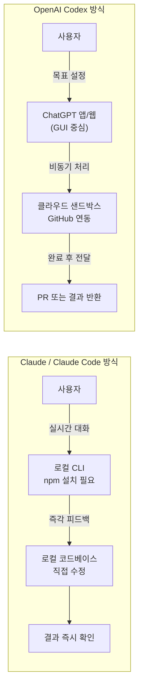
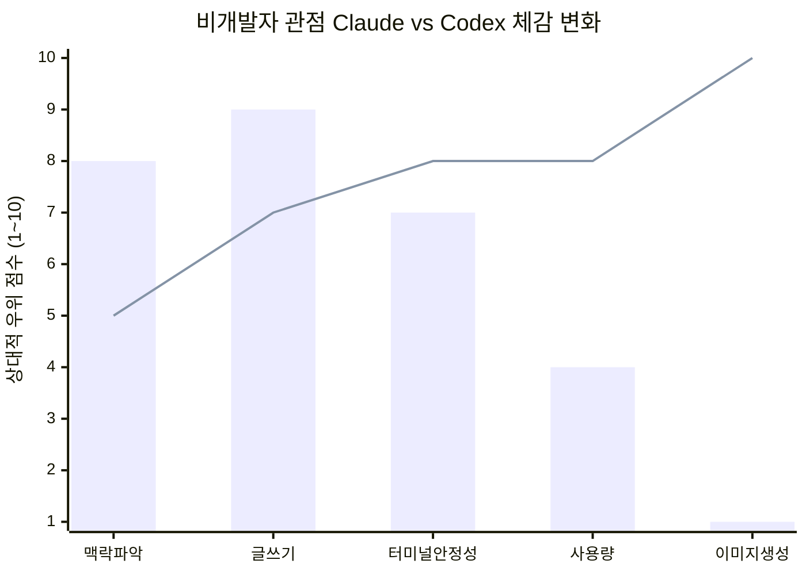

> Threads [`@byungwook.an`]( https://www.threads.com/@byungwook.an/post/DYWG2zwExJE) 게시물 분석 — Claude Max ($100) + ChatGPT Pro ($200/Codex) 동시 구독자의 실사용 관찰

---

## 1. 게시물의 맥락: 누가, 무엇을 썼는가

이 글은 Windows 환경에서 일하는 비개발자가 Claude Max 플랜($100/월)과 ChatGPT Pro 플랜($200/월)을 동시에 구독하며 두 도구를 비교한 개인 후기다. 작성자는 스스로를 "비개발 50%, 개발 50%"로 규정했으며, 그 개발 작업도 문서 작성, 리서치, 반복 업무 자동화가 주를 이룬다고 밝혔다. 즉, 전통적인 의미의 소프트웨어 엔지니어가 아닌, AI 도구를 업무 생산성 도구로 활용하는 실무자의 시각이다.

핵심 주장은 간결하다. **"클로드 토큰이 남는다"** 는 것이다. 이 문장은 표면적으로 단순해 보이지만, 그 함의는 상당히 깊다. 과거에는 Claude Max의 토큰 한도가 너무 빨리 소진되어 리셋을 기다렸고, Codex를 열어도 결국 Claude로 돌아갔다. 그런데 지금은 반대로 Claude를 열어도 금방 Codex로 이동한다는 것이다. 사용 습관의 중심이 완전히 역전된 상황을 묘사하고 있다.

---

## 2. 클로드를 선택했던 3가지 이유, 그리고 그것이 모두 뒤집힌 이유

작성자는 비개발자로서 클로드를 써온 이유를 세 가지로 정리했다. 그리고 2025년 4월 전후를 기점으로 그 세 가지가 모두 역전되었다고 주장한다.

### 2-1. "알잘딱깔센" — 맥락 파악 능력

첫 번째 이유는 길게 설명하지 않아도 맥락을 잡아주는 능력이었다. 이 표현("알아서 잘 딱 깔끔하고 센스 있게")은 Claude가 유저의 의도를 명시적으로 지시하지 않아도 파악하는 특성을 가리킨다. 그러나 작성자는 지금은 클로드에게 하나하나 디테일을 짚어줘야 하는 상황이 되었다고 토로한다. 댓글 참여자(`lee_s.h1020`)도 같은 경험을 공유했다: "자꾸 하나하나 디테일하게 짚어줘야 하다 보니 피곤해서 잘 안 잡게 되네요."

이 현상의 배경에는 Anthropic이 2025년 4월 말 공식적으로 인정한 성능 변화가 있다. Claude Code 제품을 이끄는 임원 보리스 체르니는 각 요청 처리 시 기본 노력 수준(effort level)을 '높음(high)'에서 '중간(medium)'으로 낮췄다고 밝혔다. 명분은 "이전에 작업마다 토큰을 너무 많이 소모한다는 사용자 피드백"이었다. 그러나 많은 사용자들은 이 변화가 충분한 사전 공지 없이 적용되었으며, 실제 응답 품질의 현저한 하락을 체감했다고 반발했다. 일각에서는 제품 채택 급증 이후 컴퓨팅 자원이 부족해진 Anthropic이 토큰 절감을 위해 의도적으로 성능을 조정하는 것 아니냐는 의혹도 제기되었다.

### 2-2. 글쓰기 = 클로드 — 문서·글 작업에서의 우위

두 번째 이유는 글쓰기였다. 문서로 의사소통하는 비개발 업무에서 Claude는 오랫동안 사실상의 표준으로 여겨졌다. 논리적 구성, 어조 조절, 맥락에 맞는 표현 선택 등에서 강점이 뚜렷했다. 그러나 작성자는 GPT-5.5 이후 Codex(혹은 ChatGPT 기반)가 글쓰기에서도 클로드에 필적하거나 때로는 앞선다는 인상을 받게 되었다고 밝혔다.

실제로 OpenAI는 2025년 들어 GPT-4o 이후 모델에서 글쓰기 능력을 대폭 강화했고, GPT-5 계열로 넘어오면서 자연어 생성 품질이 이전 세대와 비교해 눈에 띄게 향상되었다는 평가가 많다. 절대적인 우열보다는 "클로드만이 유일한 선택지"라는 인식이 희석된 것이 더 정확한 표현일 것이다.

### 2-3. 터미널 안정성 — CLI 환경에서의 실용성

세 번째 이유는 터미널 환경에서의 안정성이었다. 초기 Codex CLI는 표 렌더링이 깨지는 등 실용성 측면에서 아쉬운 점이 있었다. 반면 Claude는 터미널에서도 안정적인 출력을 제공했다. 그러나 현재 작성자는 터미널보다 Codex 앱 환경이 더 편하며, 표 출력 문제도 개선되었다고 평가한다.

이는 도구의 성숙도 문제다. 2025년 5월 처음 에이전트 기반 Codex(o3 파인튜닝 모델 기반)가 출시된 이후, OpenAI는 웹 인터페이스, 데스크탑 앱, CLI, iOS 앱 등 다양한 접근 경로를 빠르게 보강했다. 특히 비개발자를 배려한 GUI 중심의 경험이 강화되면서, 터미널에 익숙하지 않은 사용자들에게는 Codex의 접근성이 더 높아졌다.

---

## 3. 추가된 두 가지 결정적 요소

이 게시물이 단순한 선호 변화 이상의 무게를 갖는 이유는 두 가지 추가 요소에 있다.

### 3-1. 토큰 제공량의 현저한 차이

작성자는 Codex가 체감상 클로드 대비 2~4배 많은 사용량을 제공한다고 느낀다고 밝혔다. 이것이 작성자가 "클로드 토큰이 남는다"고 말하는 역설의 핵심이다. 절대적인 성능 차이 이전에, 같은 비용에서 얼마나 많은 작업을 막힘 없이 처리할 수 있는가의 문제다.

실제로 OpenAI는 2026년 5월 기준, Pro $100 플랜 사용자에게 한시적으로 2배 사용량 프로모션(10× Plus, 2026년 5월 31일까지)을 제공하고 있으며, Pro $200 플랜은 20× Plus 사용량을 지속 제공한다. Claude Max 5x($100)와 비교할 때, 동일 가격대에서 Codex 측의 사용량이 관대하다는 평가가 실사용자들 사이에서 꾸준히 나오고 있다. 한 비교 분석에 따르면 GPT-5 Codex 모델은 Claude Sonnet 대비 처리 비용이 절반 수준으로 효율적이며, 이것이 구독 포함 사용량의 체감 차이로 이어진다.

### 3-2. 이미지 생성 능력의 압도적 차이

작성자는 "gpt2 이미지는 압도적이다"라고 짧게 언급했다. 여기서 'gpt2 이미지'는 GPT-2가 아니라 ChatGPT에 탑재된 최신 이미지 생성 기능(DALL-E 3 및 이후 개선 버전, 또는 GPT-4o 네이티브 이미지 생성)을 가리킨다. Claude는 현재 텍스트 전용 모델이며, 자체 이미지 생성 기능을 제공하지 않는다. 비개발자의 실무에서 이미지 생성 필요성은 적지 않으며, 이 영역에서는 경쟁 자체가 성립하지 않는 구조다.

---

## 4. 댓글 생태계가 보여주는 공명

게시물 본문보다 댓글들이 더 넓은 층에서의 공감을 보여준다.

**`lee_s.h1020`**: "원래도 클로드 토큰이 부족한 일은 없긴 했는데, 자꾸 하나하나 디테일하게 짚어줘야 하다 보니 피곤해서 잘 안 잡게 되네요. 그냥 코덱스에 goal 물려놓게 되는 ㅋㅋㅋ" — 토큰 한도가 아니라 사용 피로도 때문에 Codex로 이동하는 패턴을 보여준다. 목표(goal)를 설정해두면 Codex가 자율적으로 처리하는 비동기 에이전트 방식이 더 편하다는 의미다.

**`aimaster3658`**: "클로드 반성하고 토큰 2.5배쯤 제공하면 돌아갈 의향 있음" — 이 댓글에는 3개의 좋아요가 달렸다. 품질에 대한 실망이 아니라 사용량 구조에 대한 불만이다. Anthropic이 사용량 정책을 조정하면 돌아오겠다는 뜻으로, 이탈이 완전한 포기가 아님을 시사한다.

**`byungwook.an`(작성자 본인의 댓글 답변)**: "전에는 비싸도 좋으니까 참으면서 썼는데... 요즘은 잘 안 열게 되더라구요." — 과거에는 가격 대비 성능에서 Claude가 우위였기 때문에 비용을 감수했다는 의미다. 그 프리미엄 정당성이 약해졌다는 것이다.

---

## 5. 두 도구의 구조적 차이: 같아 보이지만 다른 철학

이 후기를 정확히 이해하려면 Claude(Code)와 Codex의 구조적 차이를 파악해야 한다.

Claude Code는 터미널에서 실시간으로 대화하며 코드를 수정하는 **대화형 로컬 에이전트**다. 탐색적 디버깅, 복잡한 맥락 이해, 반복적인 수정 과정에 강하다. 반면 OpenAI Codex는 목표를 설정하면 클라우드에서 비동기로 처리하고 결과(PR 등)를 돌려주는 **위임형 클라우드 에이전트**다. 여러 작업을 병렬로 처리하거나 백그라운드 실행이 필요한 상황에 유리하다.

비개발자 입장에서는 후자가 훨씬 접근하기 쉽다. "실행하고 기다리면 결과가 온다"는 경험은 터미널 명령어를 익혀야 하는 진입 장벽보다 훨씬 낮다.

---

## 6. 가격 구조 비교

| 항목 | Claude Max 5x | ChatGPT Pro |
|------|--------------|-------------|
| 월 구독료 | $100 | $200 |
| 코딩 에이전트 | Claude Code (CLI) | Codex (앱/CLI/웹) |
| 이미지 생성 | 없음 | 포함 (DALL-E/GPT-4o) |
| 동작 방식 | 실시간 대화형 | 비동기 위임형 |
| 주 사용층 | 개발자 | 개발자 + 비개발자 |
| 접근성 | 터미널 숙련 필요 | GUI 중심 |

작성자는 이 두 서비스를 동시에 구독하며 실사용에 기반한 비교를 했다. $100 vs $200이라는 가격 차이가 있음에도, 작성자는 Codex가 포함된 ChatGPT Pro 쪽으로 사용 빈도가 쏠렸다고 밝힌다. 이는 절대 가격보다 **단위 가격당 체감 가치**가 역전되었다는 의미로 읽힌다.

---

## 7. Claude 측의 배경: 무엇이 달라졌나

### 7-1. 기본 노력 수준 하향 조정

Anthropic은 2025년 4월을 전후해 Claude의 기본 처리 effort를 낮추었다. 이는 각 요청에 소모되는 토큰 수를 줄여 인프라 비용을 절감하려는 목적으로 해석되었다. Anthropic 측은 이 변화가 사용자 피드백에 기반하며 체인지로그에 기재되어 있었다고 해명했으나, 많은 사용자들은 사전 고지가 불충분했다고 반발했다.

이후 Anthropic은 Teams 및 Enterprise 사용자에게 기본적으로 '높은 노력(high effort)' 설정을 적용하는 방안을 시험하겠다고 밝혔다. 그러나 개인 Max 플랜 사용자들에게는 여전히 체감 성능 개선이 충분하지 않다는 불만이 이어지고 있다.

### 7-2. 프롬프트 캐시 버그 문제

Claude Code에서는 프롬프트 캐시를 깨뜨리는 버그도 발견되었다. 한 사용자의 리버스 엔지니어링을 통해 특정 문자열(과금, 토큰 관련)이 포함될 경우 캐시가 통째로 무효화되는 구조가 확인되었다. 캐시가 깨지면 매번 전체 컨텍스트를 처음부터 처리해야 하므로 토큰 소비가 최대 10~20배까지 뛸 수 있다. 프롬프트 캐시의 기본 유효 시간이 5분이라는 점도, 작업 흐름이 약간만 끊겨도 비용이 급등하는 구조를 만들었다.

---

## 8. 이 후기의 의미: 단순 선호 변화인가, 구조적 신호인가

이 게시물과 댓글들이 보여주는 패턴은 단순한 개인 취향의 변화 이상이다.

첫째, **비개발자 시장에서 Claude의 포지션이 흔들리고 있다**는 신호다. Claude는 오랫동안 "글쓰기와 맥락 이해에 강한 모델"로 비개발자들 사이에서 높은 충성도를 유지해왔다. 그런데 그 두 가지 강점이 동시에 약화되는 시점이 Codex의 성숙과 맞물렸다.

둘째, **가격 대비 사용량이라는 현실적인 기준이 품질 평가보다 앞서고 있다**. 댓글에서 aimaster3658이 "토큰 2.5배 주면 돌아가겠다"고 한 것은, 여전히 Claude를 선호하지만 현실적인 사용량 제약 때문에 이탈하고 있음을 보여준다. 이는 Anthropic에게 기술적 개선보다 정책적 조정이 더 급할 수 있음을 시사한다.

셋째, **비동기·위임형 에이전트 패러다임이 비개발자에게 더 자연스럽다**는 점이 확인된다. "목표를 설정해두고 Codex에 맡긴다"는 방식은 기존의 채팅형 AI 사용 패턴과는 다르다. 실시간으로 응답을 보며 대화하는 방식보다, 구체적인 결과물을 기다리는 방식이 업무 흐름에 더 잘 맞는 사용자 집단이 존재한다.

---

## 9. 이 게시물이 담지 않은 것

작성자는 이것이 "Windows + 비개발자 + 개인 기준"의 후기임을 명시했으며, "다음 달엔 또 뭘로 바뀔지 모른다"고 덧붙였다. 즉 이 비교는 특정 시점, 특정 사용 맥락에서의 관찰이다.

Linux/macOS 기반 개발자 환경, 로컬 코드베이스 탐색이 주인 작업, 보안이 중요한 환경에서는 Claude Code가 여전히 강력한 선택지로 꼽힌다. 또한 Claude Code는 로컬 실행 구조로 인해 기업 보안 환경에서의 채택 사례가 늘고 있으며, VS Code 확장, 웹 IDE 등 접근성 개선도 지속되고 있다.

---

## 10. 요약

> 막대(bar): 과거 Claude 체감 점수 / 선(line): 현재 Codex 체감 점수  
> (작성자 주관적 평가를 기반으로 재구성한 시각화)

이 게시물은 하나의 개인 후기이지만, AI 도구 시장의 현재 역학을 압축적으로 보여준다. 과거에는 품질 우위가 가격과 사용량 제약을 상쇄했다. 지금은 품질 격차가 좁혀지고, 사용량·접근성·부가 기능의 차이가 전면에 부상했다. 비개발자 사용자에게 AI 코딩 보조 도구의 선택 기준이 "어느 모델이 더 똑똑한가"에서 "어느 도구가 더 편하고 더 많이 쓸 수 있는가"로 옮겨가고 있다는 것이 이 게시물의 핵심 메시지다.

---

*작성일: 2026년 5월 15일*
