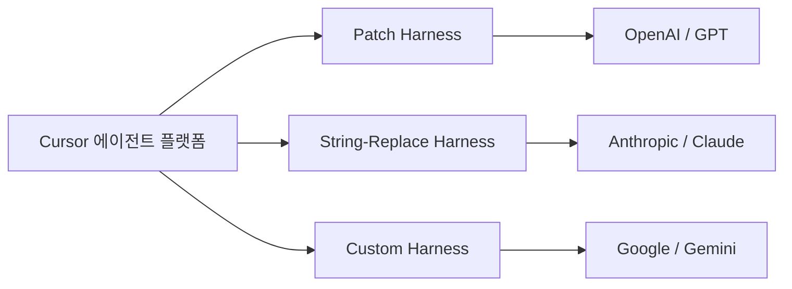
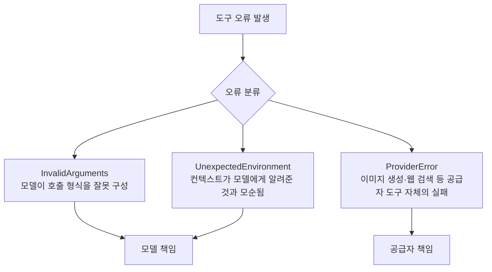
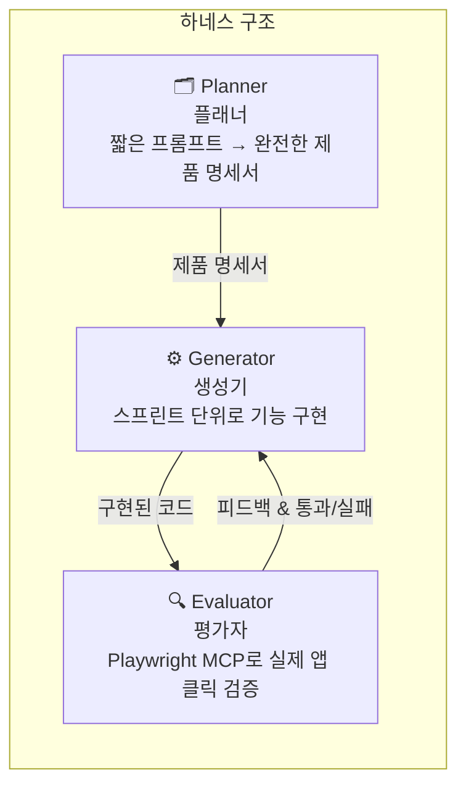
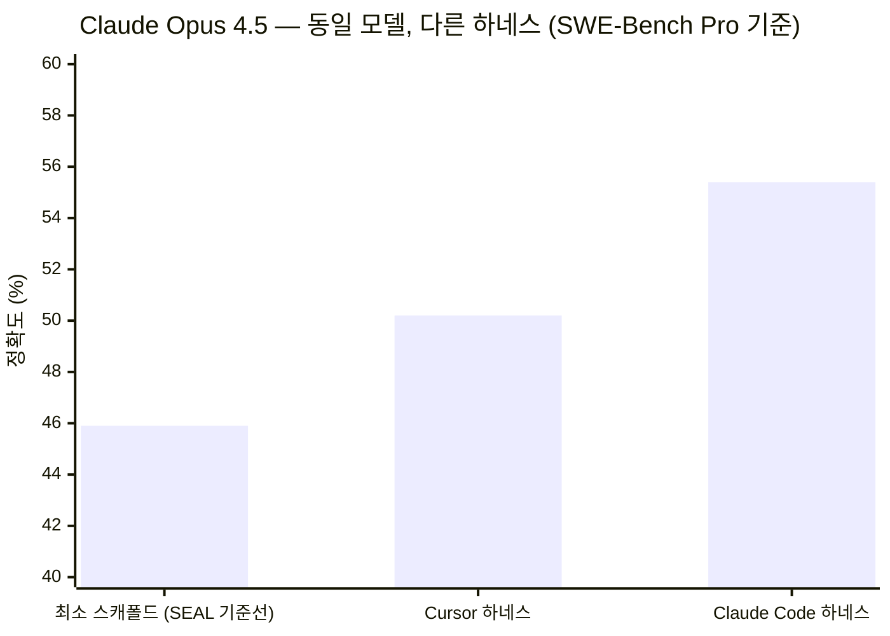
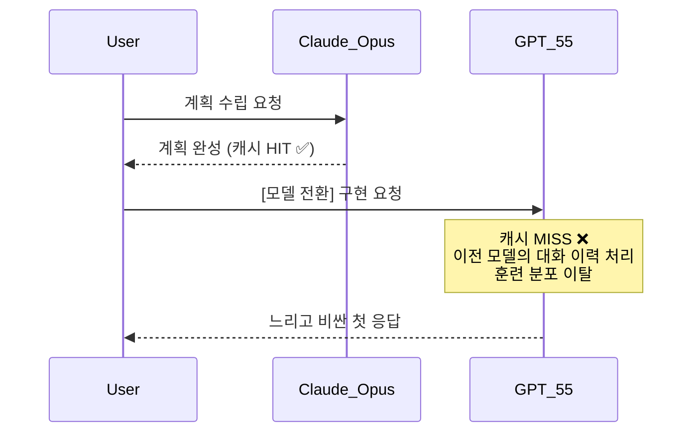
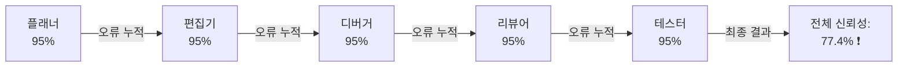
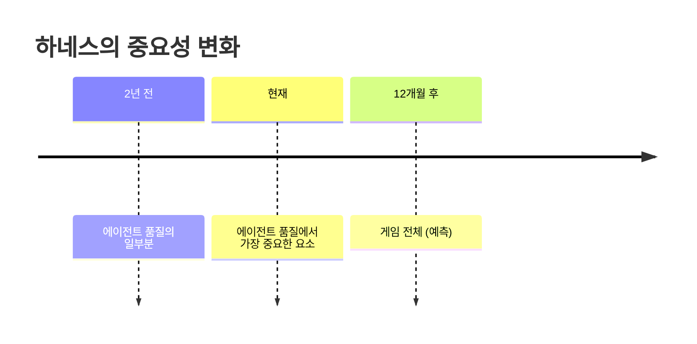

>- **원본 영상:** [Broken Agents? It's Not the Model. It's the Harness.](https://www.youtube.com/watch?v=uY9tMU-KS4A) — Prompt Engineering 채널 (2026년 5월 16일 공개)  
>- **참조 원문:** [Cursor 블로그 — Continually Improving Our Agent Harness (2026년 4월 30일)](https://cursor.com/blog/continually-improving-agent-harness) / [Anthropic 엔지니어링 블로그 — Harness Design for Long-Running Application Development (2026년 3월 24일)](https://www.anthropic.com/engineering/harness-design-long-running-apps)

---

## 목차

1. [왜 모델 전환은 실패하는가](#1-왜-모델-전환은-실패하는가)
2. [편집 포맷의 불일치 문제 — Patch vs. String Replace](#2-편집-포맷의-불일치-문제--patch-vs-string-replace)
3. [하네스 커스터마이제이션 격차](#3-하네스-커스터마이제이션-격차)
4. [좋은 하네스를 만드는 세 가지 핵심 요소](#4-좋은-하네스를-만드는-세-가지-핵심-요소)
5. [Anthropic의 멀티 에이전트 하네스 사례 연구](#5-anthropic의-멀티-에이전트-하네스-사례-연구)
6. [벤치마크가 드러낸 하네스의 영향력 — SWE-Bench Pro](#6-벤치마크가-드러낸-하네스의-영향력--swe-bench-pro)
7. [대화 중간에 모델을 바꾸면 어떤 일이 생기는가](#7-대화-중간에-모델을-바꾸면-어떤-일이-생기는가)
8. [멀티 에이전트 시스템의 신뢰성 수학](#8-멀티-에이전트-시스템의-신뢰성-수학)
9. [2026년 현재 하네스의 위상](#9-2026년-현재-하네스의-위상)
10. [세 가지 핵심 결론](#10-세-가지-핵심-결론)

---

## 1. 왜 모델 전환은 실패하는가

많은 개발자들이 코딩 에이전트를 사용할 때 특정한 패턴을 따른다. 계획 단계에서는 Claude Opus처럼 추론 능력이 뛰어난 모델을 쓰고, 실제 구현 단계에서는 GPT-5.5 같은 빠른 모델로 전환하는 방식이다. 직관적으로는 합리적인 선택처럼 보인다. 하지만 2026년 4월 30일 Cursor 팀이 발행한 블로그 포스트는 이 전략이 오히려 에이전트 성능을 저하시킬 수 있다는 점을 구체적인 공학 데이터와 함께 제시했다.

문제의 핵심은 **모델 자체**가 아니라 모델을 둘러싼 **하네스(harness)** 에 있다. 하네스란 에이전트가 실제로 작동하는 방식을 결정하는 모든 구조적 장치 — 프롬프트 형식, 도구 정의, 컨텍스트 관리 전략, 오류 처리 로직, 오케스트레이션 방식 — 를 통칭하는 개념이다. 모델이 아무리 뛰어나도, 하네스가 그 모델의 특성에 맞게 설계되지 않으면 성능은 크게 저하된다.

---

## 2. 편집 포맷의 불일치 문제 — Patch vs. String Replace

Cursor 팀은 블로그에서 서로 다른 제공사의 모델이 파일 편집에 서로 다른 포맷으로 학습되어 있다는 점을 명확히 설명한다.

| 제공사 | 편집 포맷 | 방식 설명 |
|--------|-----------|-----------|
| **OpenAI (GPT)** | Patch 기반 | Git diff 스타일로 변경 내역을 기술 |
| **Anthropic (Claude)** | String Replace | "이 텍스트를 찾아서 저 텍스트로 교체하라"는 방식 |
| **Google (Gemini)** | 전체 파일 재작성 | 매번 파일 전체를 다시 작성 |

이 차이가 왜 중요한가? Cursor 팀의 설명에 따르면, 각 모델이 자신에게 **낯선 포맷**의 도구를 받으면 두 가지 부작용이 발생한다.

첫째, 추가적인 추론 토큰이 소모된다. 모델이 익숙하지 않은 형식으로 출력을 구성하기 위해 더 많은 계산을 하기 때문이다. 둘째, 실수가 늘어난다. 자신이 훈련받은 방식이 아닌 포맷으로 작업하면 정확도가 떨어진다.

```
Claude에게 Patch 포맷 → 추론 토큰 낭비 + 오류 증가
GPT에게 String Replace → 동일한 문제가 역방향으로 발생
```

이는 단순한 이론적 우려가 아니다. Cursor는 모델 별로 완전히 별도의 하네스를 구축하고 A/B 테스트를 통해 이를 검증했다. OpenAI 모델에는 Patch 하네스를, Anthropic 모델에는 String Replace 하네스를, Google 모델에는 별도의 커스텀 하네스를 사용한다.



---

## 3. 하네스 커스터마이제이션 격차

Cursor는 각 모델에 맞춰 수 주에 걸쳐 하네스를 커스터마이징한다. 새 모델에 조기 접근권이 주어지면, 그 모델의 강점과 특이사항에 맞게 하네스를 조율하여 동일한 모델이라도 전용 하네스 안에서 훨씬 빠르고, 스마트하며, 효율적으로 동작하도록 만든다.

그러나 대부분의 서드파티 코딩 에이전트들은 이런 여유가 없다. 자원이 제한적이므로 하나의 범용 포맷을 모든 모델에 적용하는 경우가 많다. 그 결과, 동일한 모델이 어떤 도구에서는 탁월하게 느껴지고 다른 도구에서는 평범하게 느껴지는 현상이 생긴다. 모델이 바뀐 것이 아니라, 모델을 감싸는 하네스가 달라진 것이다.

> "같은 모델인데 왜 이 도구에서는 잘 작동하고 저 도구에서는 엉망인가?"라는 질문의 답은 대부분 하네스에 있다.

---

## 4. 좋은 하네스를 만드는 세 가지 핵심 요소

Cursor 팀은 포맷 커스터마이제이션 외에도 하네스가 갖춰야 할 세 가지 요소를 제시했다.

### 4-1. 동적 컨텍스트 로딩 (Dynamic Context)

기존의 하네스들은 에이전트가 필요로 할 수 있는 모든 정보를 미리 불러왔다. 하지만 이 방식에는 근본적인 트레이드오프가 존재한다.

- **너무 적게 불러오면:** 모델이 필요한 정보를 볼 수 없어 파일 누락, 오래된 참조, 잘못된 가정, 환각(hallucination) 등의 문제가 발생한다.
- **너무 많이 불러오면:** 불필요한 토큰이 소모되어 비용이 높아지고, 응답이 느려지며, 컨텍스트 오염(context bloat)이 생긴다.

Cursor의 접근법은 이 딜레마를 해결한다. 에이전트가 **작업하면서 스스로 필요한 컨텍스트를 판단하여 불러올 수 있도록** 가드레일을 낮추고 동적 컨텍스트 페칭 능력을 부여한다. 모델이 더 많은 자율성을 가지고 필요한 정보를 능동적으로 탐색한다.

### 4-2. 도구 오류 추적 (Tool Error Tracking)

Cursor는 모든 도구 호출 오류를 세 가지 범주로 분류한다.



이 분류 체계를 통해 어떤 오류가 모델의 실수인지, 어떤 오류가 인프라 문제인지를 명확히 구분할 수 있다. 이를 바탕으로 Cursor 팀은 집중적인 스프린트를 통해 **동일한 모델에서 예상치 못한 도구 호출 오류를 10배 줄이는 성과**를 달성했다. 모델을 바꾼 것이 아니라, 하네스를 튜닝한 결과였다.

### 4-3. 유지율(Keep Rate) 측정

성능을 어떻게 측정할 것인가의 문제는 흔히 간과된다. Cursor는 **유지율(keep rate)** 이라는 독자적인 지표를 사용한다.

에이전트가 생성한 코드 변경 사항 중 일정 시간이 지난 후 사용자의 코드베이스에 **그대로 남아 있는 비율**이 바로 유지율이다. 사용자가 에이전트의 코드를 그대로 유지하면 유지율이 올라가고, 삭제하거나 다시 작성하면 유지율이 떨어진다.

이것이 프로덕션 수준의 에이전트 측정 방식이 어떤 모습인지를 보여준다. 허영적인 벤치마크 숫자가 아니라, **실제 사용에서 에이전트의 작업이 살아남는 비율**을 추적하는 것이다.

---

## 5. Anthropic의 멀티 에이전트 하네스 사례 연구

Anthropic은 2026년 3월 24일 엔지니어링 블로그에서 동일한 문제를 다른 각도로 접근한 사례를 발표했다. 제목은 "장시간 실행 애플리케이션 개발을 위한 하네스 설계(Harness Design for Long-Running Application Development)"다.

### 솔로 에이전트의 한계

Anthropic은 먼저 단일 에이전트에게 전체 작업을 맡기는 방식, 즉 **솔로 접근법**을 시도했다. 에이전트에게 레트로 게임 메이커 앱을 만들어 달라는 과제를 부여했다.

- **소요 시간:** 20분
- **비용:** $9
- **결과:** 출력물이 겨우 작동하는 수준

### GAN 구조에서 영감을 받은 멀티 에이전트 하네스

돌파구를 찾기 위해 Anthropic은 생성적 적대 신경망(GAN)에서 영감을 얻어 세 역할로 분화된 멀티 에이전트 구조를 설계했다.



각 에이전트의 역할을 상세히 살펴보면 다음과 같다.

**플래너(Planner)** 는 짧은 제품 프롬프트를 받아 전체적인 제품 명세서로 확장한다. 세부적인 기술 구현 방법을 지나치게 구체화하지 않도록 설계되었는데, 이는 플래너가 잘못된 세부 사항을 명시하면 그 오류가 이후 구현 전체로 전파될 수 있기 때문이다. 대신 플래너는 생산되어야 할 결과물을 명확히 하고, 세부 구현 경로는 하위 에이전트들이 스스로 결정하게 한다.

**생성기(Generator)** 는 스프린트 방식으로 작동하며, 한 번에 하나의 기능만을 담당한다. 각 스프린트는 독립적으로 검증 가능한 단위가 된다.

**평가자(Evaluator)** 는 Playwright MCP를 활용하여 실제로 실행 중인 앱을 클릭하고 탐색하며 검증한다. 실제 사용자처럼 버튼을 누르고 폼을 채우는 방식으로, 코드 자체가 아닌 **동작하는 소프트웨어**를 기준으로 평가한다.

### 비용 대비 성과

결과는 명확한 트레이드오프를 보여준다.

| 방식 | 소요 시간 | 비용 | 결과 품질 |
|------|-----------|------|-----------|
| 솔로 에이전트 (단일 모델) | 20분 | $9 | 겨우 작동하는 수준 |
| 멀티 에이전트 하네스 (동일 모델) | 4시간 | $124 | 현저히 높은 품질 |

비용은 약 20배 이상 증가하지만, 출력물의 품질 차이는 즉각적으로 명확했다고 Anthropic 팀은 밝혔다. 핵심은 모델을 바꾸지 않았다는 점이다. 동일한 모델을 사용했지만, 그 모델을 감싸는 **스캐폴딩(scaffolding)을 변경한 것만으로** 결과가 완전히 달라졌다.

> 이 접근법의 아름다움은 정량화가 가능하다는 것이다. 동일한 모델로 서로 다른 하네스를 벤치마킹하면 극적으로 다른 결과가 나온다.

---

## 6. 벤치마크가 드러낸 하네스의 영향력 — SWE-Bench Pro

### 기존 벤치마크의 문제점

대부분의 코딩 벤치마크는 각 에이전트가 자체 하네스를 가져올 수 있도록 허용한다. 즉, 스코어는 **모델의 능력**과 **하네스의 품질**이 뒤섞인 결과다. SWE-Bench Verified에서 Claude Opus 4.5가 80.9%를 기록했다고 해서, 그것이 순수한 모델 능력을 반영한다고 볼 수 없는 이유가 여기에 있다.

실제로 OpenAI는 모든 최전선 모델들이 SWE-Bench Verified 일부 문제에 대한 훈련 데이터 오염(contamination) 증거를 보인다는 사실을 발견한 뒤, Verified 점수 보고를 중단하고 SWE-Bench Pro를 더 적합한 지표로 권장했다.

### SWE-Bench Pro의 차별점

SWE-Bench Pro는 이 문제를 해결하기 위해 설계되었다. 이 벤치마크는 모든 모델에게 동일한 최소 수준의 스캐폴드를 강제한다.

- **bash-only 도구** (화려한 편집 도구 없음)
- **고정된 턴 제한** (무한 재시도 없음)
- **커스텀 최적화 없음** (에이전트 트릭 없음)
- **표준화된 프롬프트** (모두 동일한 조건)

이를 통해 하네스 장인성과 별개로 **순수한 모델 능력**을 분리하여 측정할 수 있다. 과제 역시 훨씬 어렵다. 평균적으로 4.1개 파일에 걸쳐 107줄의 변경이 필요한 장기적(long-horizon) 멀티 파일 과제들로 구성된다.

### 동일 모델, 다른 하네스의 점수 차이



동일한 Claude Opus 4.5 모델에 서로 다른 하네스를 적용했을 때의 결과다.

- **최소 스캐폴드 (기준선):** 45.9%
- **Cursor 하네스:** 50.2%
- **Claude Code 하네스:** 55.4%

같은 모델, 같은 과제 세트에서 하네스만 다르게 했을 때 약 10점의 점수 차이가 발생했다. Anthropic이 "하네스에 엔지니어링 노력을 쏟는다"고 말할 때 이것이 바로 그 의미다.

> 2026년 5월 현재 최신 리더보드 기준으로, SWE-Bench Pro에서는 Claude Mythos Preview가 77.8%로 선두를 달리고 있으며, Claude Opus 4.7이 64.3%, GPT-5.5가 58.6%로 뒤를 잇고 있다. 이 수치들 역시 각 모델이 어떤 하네스와 함께 테스트되었는가에 따라 크게 달라진다.

---

## 7. 대화 중간에 모델을 바꾸면 어떤 일이 생기는가

많은 사용자들이 일상적으로 실천하는 워크플로가 있다. Claude Opus로 계획을 세우고, GPT-5.5로 구현을 하는 방식이다. 언뜻 합리적으로 보이지만, Cursor 팀은 이 패턴의 숨겨진 비용을 상세히 분석했다.

### 핵심 문제 1: 출력 분포의 불일치

Cursor 팀의 설명에 따르면, 서로 다른 모델은 서로 다른 행동 방식, 프롬프트 형식, 도구 형태를 가진다. 모델을 전환하면, 새로운 모델은 **자신이 아닌 다른 모델이 만들어낸 대화 이력**을 기반으로 도구를 호출해야 한다. 이는 훈련 분포를 벗어난(out-of-distribution) 상황이다.

### 핵심 문제 2: 캐시 무효화

프롬프트 캐시는 **제공사별, 모델별로** 분리되어 존재한다. 모델을 전환하는 순간 캐시 미스(cache miss)가 발생한다. 전환 후 첫 번째 턴은 느리고, 더 비싸진다.



### Cursor의 해결책

Cursor는 모델 전환 시 새 모델에게 다음과 같은 경고 지침을 자동으로 삽입한다: "방금 다른 모델로부터 인계받았습니다. 대화 이력에 있는 일부 도구는 당신의 것이 아닙니다. 그것들을 호출하지 마세요."

이 한 문장의 엔지니어링 작업이, 모든 제공사가 "클릭 한 번"처럼 보이게 포장한 기능 뒤에 숨어 있다.

> **Cursor 팀의 공식 권고:** 특별한 이유가 없다면, 하나의 대화 내에서는 모델을 바꾸지 말 것. 이는 Cursor에만 해당되는 이야기가 아니며, Claude Code에서도 Opus와 Sonnet, Haiku 간의 대화 중간 전환을 권장하지 않는 이유가 동일하다.

---

## 8. 멀티 에이전트 시스템의 신뢰성 수학

멀티 에이전트 시스템의 미래 비전은 매력적이다. Cursor 팀은 앞으로 시스템이 계획, 빠른 편집, 디버깅 등을 각각 담당하는 전문화된 에이전트들에게 작업을 위임하게 될 것이라고 예측한다.

그러나 이 비전에는 간과하기 쉬운 수학적 현실이 있다.

### 신뢰성 복합 감소 문제

단일 에이전트의 신뢰성이 95%라고 가정하자. 이는 꽤 훌륭한 수치처럼 보인다. 그런데 이런 에이전트 다섯 개를 연쇄적으로 연결하면 어떻게 될까?

```
전체 신뢰성 = 0.95 × 0.95 × 0.95 × 0.95 × 0.95 = 0.774 (약 77.4%)
```



개별 에이전트는 모두 95%라는 높은 신뢰성을 자랑하지만, 체인의 끝에서는 네 번에 한 번꼴로 실패한다. 처음에는 잘 돌아가는 것처럼 보이던 멀티 에이전트 시스템이 프로덕션 환경에서 무너지기 시작하는 이유가 바로 여기에 있다.

### 하네스가 해결책이다

Cursor 팀의 결론은 명확하다. 이 문제를 해결하는 것은 근본적으로 **하네스 과제**다. 시스템은 다음 세 가지를 알아야 한다.

1. **어떤 에이전트를 보낼 것인가** — 적절한 에이전트 라우팅
2. **각 에이전트의 강점에 맞게 작업을 어떻게 구성할 것인가** — 과제 포맷팅
3. **결과를 일관성 있는 워크플로로 어떻게 연결할 것인가** — 오케스트레이션

이 오케스트레이션 로직은 단일 에이전트 안에 있지 않다. **하네스** 안에 있다. 그리고 하네스는 끊임없이 진화하는 소프트웨어 시스템으로서 다루어져야 한다.

---

## 9. 2026년 현재 하네스의 위상

Cursor 팀과 Anthropic 모두 같은 방향을 가리키고 있다. 하네스가 에이전트 품질에서 차지하는 비중이 급격히 커지고 있다.



실제로 2026년 현재 Cursor는 여러 중요한 움직임을 보이고 있다. 4월 29일에는 Cursor SDK를 공개 베타로 출시하여, 개발자들이 Cursor 데스크탑 앱, CLI, 웹 앱을 구동하는 것과 동일한 에이전트 런타임, 하네스, 모델을 TypeScript 몇 줄로 활용할 수 있게 했다. 이는 하네스 자체가 하나의 제품이 되고 있음을 보여주는 상징적인 사건이다.

새로운 모델이 출시될 때마다 하네스 감사(harness audit)가 필요하다는 시각도 등장하고 있다. 새 모델이 이전의 하네스 구성요소 중 일부 모델 한계를 극복했다면, 그 구성요소는 단순화하거나 제거할 수 있다. Anthropic은 Opus 4.6으로 전환하면서 플래너 + 생성기 + 실행 중 평가자라는 복잡한 구조에서 플래너 + 생성기 + 실행 후 평가자라는 단순화된 구조로 이동했으며, 동일한 출력 품질을 유지하면서도 복잡성을 크게 줄였다.

---

## 10. 세 가지 핵심 결론

이 모든 내용이 에이전트를 구축하거나 사용하는 사람에게 무엇을 의미하는가? Prompt Engineering 채널은 세 가지 핵심 결론을 제시한다.

### 결론 1: 하네스를 진지한 제품으로 대우하라

에이전트를 구축한다면, 프롬프트와 도구를 단순한 "글루 코드"로 취급하는 것을 멈춰야 한다. 하네스를 버전 관리하고, 측정하고, A/B 테스트를 실행하고, 유지율(keep rate)이나 이에 상응하는 지표를 추적하라. 하네스는 하나의 실제 제품이 되어가고 있다.

### 결론 2: 헤드라인 벤치마크를 신뢰하지 마라

모델을 선택할 때 헤드라인 벤치마크 숫자를 그대로 믿어서는 안 된다. 반드시 이 질문을 하라: **어떤 하네스가 그 숫자를 만들어냈는가?** 동일한 Claude Opus 4.5가 어떤 벤치마크에서는 80.9%를 기록하고, 다른 벤치마크에서는 45.9%를 기록한다. 같은 모델, 다른 하네스이기 때문이다. 숫자는 컨텍스트 없이는 아무것도 말해주지 않는다.

### 결론 3: 당신의 진짜 경쟁 우위는 하네스 장인성에 있다

가장 중요한 결론이다. 모델 접근성은 더 이상 차별화 요소가 아니다. 누구나 동일한 모델에 접근할 수 있다. 진짜 경쟁 우위는 **하네스 장인성(harness craft)** 에서 나온다. 오케스트레이션 로직, 컨텍스트 전략, 오류 처리, 각 제공사별 도구 포맷 선택 — 이것들이 2026년에 에이전트 품질을 결정하는 요소다.

2년 전에는 하네스가 에이전트 품질의 작은 일부였다. 지금은 가장 중요한 요소다. 그리고 앞으로는 게임 전체가 될 것이다.

---

## 부록: 주요 개념 요약

| 개념 | 정의 |
|------|------|
| **하네스 (Harness)** | 에이전트를 감싸는 모든 구조적 장치 — 프롬프트, 도구, 컨텍스트 관리, 오류 처리, 오케스트레이션 |
| **Patch 포맷** | Git diff 스타일의 파일 편집 포맷 (OpenAI 모델에 최적화) |
| **String Replace 포맷** | 특정 텍스트를 찾아 교체하는 파일 편집 포맷 (Anthropic 모델에 최적화) |
| **유지율 (Keep Rate)** | 에이전트가 생성한 코드 중 일정 시간 후 사용자의 코드베이스에 살아남은 비율 |
| **동적 컨텍스트** | 에이전트가 작업 중 스스로 필요한 정보를 판단하여 불러오는 방식 |
| **SWE-Bench Pro** | 모든 모델에 동일한 최소 스캐폴드를 강제하여 순수 모델 능력을 측정하는 벤치마크 |
| **신뢰성 복합 감소** | 직렬 연결된 에이전트들의 전체 신뢰성이 개별 신뢰성의 곱으로 감소하는 현상 |
| **캐시 미스 (Cache Miss)** | 모델 전환 시 이전 모델의 캐시를 재사용할 수 없어 발생하는 성능/비용 저하 |

---

*이 문서는 Prompt Engineering 채널의 유튜브 영상(2026년 5월 16일), Cursor 블로그(2026년 4월 30일), Anthropic 엔지니어링 블로그(2026년 3월 24일)를 기반으로 작성되었습니다.*
