## 같은 이름, 완전히 다른 접근법

> **아키텍처팀 기술 세미나 — 별첨 자료**  
> 상위 문서: [Microsoft GraphRAG — 지식 그래프 기반 차세대 RAG 시스템](https://k82022603.github.io/posts/microsoft-graphrag-%EC%A7%80%EC%8B%9D-%EA%B7%B8%EB%9E%98%ED%94%84-%EA%B8%B0%EB%B0%98-%EC%B0%A8%EC%84%B8%EB%8C%80-rag-%EC%8B%9C%EC%8A%A4%ED%85%9C/)


---

## 목차

1. [두 가지가 존재하는 이유 — 먼저 개념부터](#1-두-가지가-존재하는-이유--먼저-개념부터)
2. [제공 주체와 성격](#2-제공-주체와-성격)
3. [핵심 철학의 차이 — 무엇을 기반으로 지식을 표현하는가](#3-핵심-철학의-차이--무엇을-기반으로-지식을-표현하는가)
4. [인덱싱 파이프라인 비교](#4-인덱싱-파이프라인-비교)
5. [Microsoft GraphRAG가 진정으로 뛰어난 것들](#5-microsoft-graphrag가-진정으로-뛰어난-것들)
6. [검색 방식 비교 — 질의를 어떻게 처리하는가](#6-검색-방식-비교--질의를-어떻게-처리하는가)
7. [저장소 구조 비교](#7-저장소-구조-비교)
8. [Neo4j GraphRAG의 검색기 종류](#8-neo4j-graphrag의-검색기-종류)
9. [통합 가능성 — 둘이 함께 쓸 수 있는가](#9-통합-가능성--둘이-함께-쓸-수-있는가)
10. [성능과 비용 비교](#10-성능과-비용-비교)
11. [언제 어느 것을 선택하는가](#11-언제-어느-것을-선택하는가)
12. [결론](#12-결론)

---

## 1. 두 가지가 존재하는 이유 — 먼저 개념부터

"GraphRAG"라는 단어를 검색하면 두 개의 서로 다른 시스템이 등장합니다. **Microsoft GraphRAG**와 **Neo4j GraphRAG**입니다. 이름이 비슷해서 혼동하기 쉽지만, 탄생 배경과 작동 방식이 근본적으로 다릅니다.

사람들이 "GraphRAG"라고 말할 때 의미하는 것이 두 가지입니다.

- **Microsoft가 정의한 GraphRAG**: LLM으로 문서 전체를 처리하여 커뮤니티 구조와 계층적 요약을 만드는 Knowledge-based 접근법 (MS는 내부적으로 "graph index"라고도 부름)
- **그래프 DB를 활용한 GraphRAG**: 지식 그래프에 엔터티와 관계를 저장하고 Cypher 탐색으로 검색하는 Knowledge-based 접근법

Neo4j GraphRAG는 주로 두 번째 의미입니다. 즉, Neo4j를 그래프 저장소로 삼아 관계 기반 검색을 수행하는 방식입니다.

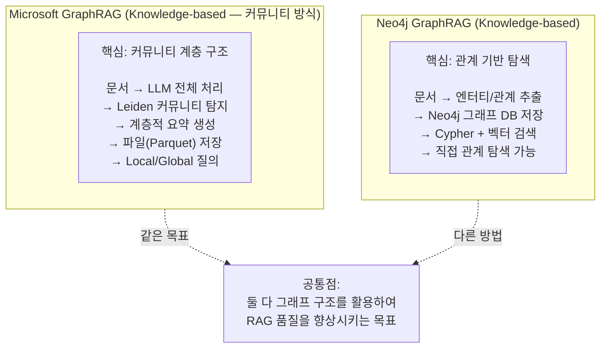

---

## 2. 제공 주체와 성격

두 시스템은 만든 주체부터 다릅니다.

| 항목 | Microsoft GraphRAG | Neo4j GraphRAG |
|---|---|---|
| **개발 주체** | Microsoft Research | Neo4j (그래프 DB 회사) |
| **패키지명** | `graphrag` | `neo4j-graphrag` |
| **설치** | `pip install graphrag` | `pip install neo4j-graphrag` |
| **라이선스** | MIT (오픈소스) | Apache 2.0 (오픈소스) |
| **공식 지원** | 연구 프로젝트 (비공식 지원) | **1st-party 공식 지원** (Neo4j 직접 유지) |
| **Github** | github.com/microsoft/graphrag | github.com/neo4j/neo4j-graphrag-python |
| **저장소** | Parquet 파일 (기본) | Neo4j Graph DB (필수) |
| **처음 공개** | 2024년 7월 | 2024년 (neo4j-genai → neo4j-graphrag 개명) |

Neo4j GraphRAG는 Neo4j가 직접 제공하는 1st-party 라이브러리로서, 강력하고 기능이 풍부하며 고성능 솔루션을 제공하고, Neo4j에서 직접 장기 지원 및 유지보수를 보장합니다.

반면 Microsoft GraphRAG는 LLM 출력을 향상하기 위해 지식 그래프 메모리 구조를 사용하는 방법론을 제시하는 데모 목적의 코드이며, Microsoft의 공식 지원 제품이 아님을 명시하고 있습니다.

---

## 3. 핵심 철학의 차이 — 무엇을 기반으로 지식을 표현하는가

이것이 두 시스템의 가장 근본적인 차이입니다.

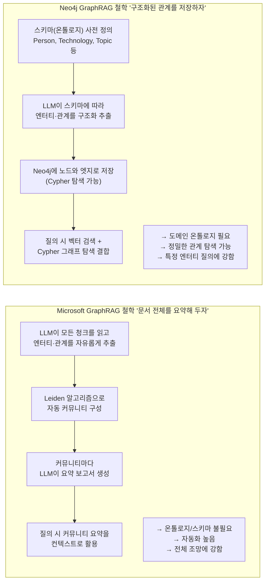

Microsoft의 시스템은 전체 코퍼스에 대해 LLM을 실행하여 엔터티와 관계를 추출하고, 지식 그래프를 구축하며, Leiden 커뮤니티 탐지 알고리즘을 적용하여 관련 엔터티를 그룹화하고, 여러 계층 수준에서 요약을 미리 생성합니다. 반면 Neo4j 구현은 Cypher 그래프 쿼리와 텍스트 청크 검색을 결합합니다. 에이전트가 사용자 질문에서 핵심 엔터티를 식별하고, 그래프에서 N홉 내의 연결된 엔터티를 조회하며, 해당 엔터티와 연관된 텍스트 청크를 가져와 결합된 컨텍스트를 LLM에 전달합니다.

---

## 4. 인덱싱 파이프라인 비교

문서를 처리하는 방식이 어떻게 다른지 단계별로 비교합니다.

```mermaid
flowchart TB
    DOC["원본 문서"]

    subgraph MS_PIPE["Microsoft GraphRAG 인덱싱 (graphrag index)"]
        direction TB
        MS1["① 텍스트 청크 분할\n(기본 1,200 토큰)"]
        MS2["② LLM 자유 엔터티/관계 추출\n(스키마 없음, 모든 청크 처리)"]
        MS3["③ Leiden 커뮤니티 자동 탐지\n(계층 구조 생성)"]
        MS4["④ LLM 커뮤니티 요약 생성\n(레벨별 보고서)"]
        MS5["⑤ 임베딩 생성 + 저장\nParquet 파일 출력"]
        MS1 --> MS2 --> MS3 --> MS4 --> MS5
        MS_OUT["📁 Parquet 파일들\n(entities, relationships,\ncommunity_reports 등)"]
        MS5 --> MS_OUT
    end

    subgraph NEO_PIPE["Neo4j GraphRAG 인덱싱 (SimpleKGPipeline)"]
        direction TB
        NE1["① 스키마 정의\n(Person, Technology, USES 등)"]
        NE2["② 텍스트 청크 분할\n(chunk_size 설정)"]
        NE3["③ LLM 스키마 기반 추출\n(정의된 엔터티/관계만 추출)"]
        NE4["④ 엔터티 중복 제거\n(FuzzyMatch / Semantic)"]
        NE5["⑤ 임베딩 생성 + Neo4j 저장\n(노드/엣지/벡터 인덱스)"]
        NE1 --> NE2 --> NE3 --> NE4 --> NE5
        NEO_OUT["🗄️ Neo4j Graph DB\n(Document, Chunk, Entity 노드\n+ MENTIONS, RELATED_TO 관계)"]
        NE5 --> NEO_OUT
    end

    DOC --> MS_PIPE
    DOC --> NEO_PIPE
```

### 4.1 인덱싱의 가장 큰 차이 — 커뮤니티 요약의 자동화

Microsoft GraphRAG의 인덱싱에서 가장 독창적이고 비용이 많이 드는 부분은 커뮤니티 탐지와 요약 생성 단계입니다. LLM이 수백~수천 개의 커뮤니티마다 포괄적인 요약 보고서를 생성합니다. 이 요약이 나중에 Global Search를 가능하게 합니다.

한 가지 중요한 사실을 짚고 넘어가야 합니다. **Neo4j 자체에 커뮤니티 개념이 없는 것은 아닙니다.** Neo4j는 Graph Data Science(GDS) 라이브러리를 통해 Leiden, Louvain 등 커뮤니티 탐지 알고리즘을 공식 지원합니다. Cypher 한 줄로 실행할 수 있습니다.

```cypher
-- Neo4j GDS로 Leiden 커뮤니티 탐지 실행
CALL gds.leiden.write('my-graph', { writeProperty: 'community' })
YIELD communityCount, modularity
```

차이는 **자동화 수준**에 있습니다. `neo4j-graphrag` Python 패키지는 커뮤니티 탐지와 LLM 요약 생성을 인덱싱 파이프라인에 포함하지 않습니다. 사용자가 직접 GDS를 실행하고 LLM 요약을 별도로 구성해야 합니다. 반면 Microsoft GraphRAG는 `graphrag index` 명령 하나로 이 모든 과정을 자동으로 수행합니다.

| 구분 | Microsoft GraphRAG | Neo4j GraphRAG (패키지) |
|---|---|---|
| 커뮤니티 탐지 알고리즘 | ✅ 자동 (Leiden 내장) | ⚙️ GDS로 가능하나 수동 |
| LLM 커뮤니티 요약 생성 | ✅ 자동 | ❌ 패키지 미지원 (직접 구현) |
| Global Search 내장 | ✅ 있음 | ❌ 없음 |
| 파이프라인 자동화 | ✅ 완전 자동 | ⚙️ 단계별 수동 구성 |

---

## 5. Microsoft GraphRAG가 진정으로 뛰어난 것들

Neo4j도 커뮤니티 탐지가 가능하다면, Microsoft GraphRAG가 진정으로 우월한 부분은 무엇인지 명확히 짚어야 합니다. 핵심은 **기능의 유무**가 아니라 **자동화의 완성도**와 **설계 사상의 차별성**에 있습니다.

### 5.1 스키마 없이도 작동하는 완전 자동 파이프라인

Neo4j GraphRAG로 지식그래프를 구축하려면 도메인 전문가가 온톨로지를 먼저 설계해야 합니다. "어떤 엔터티를 추출할 것인가(Person, Technology, Project…)", "어떤 관계를 정의할 것인가(USES, BELONGS_TO…)"를 사람이 결정해야 파이프라인이 그 기준에 따라 움직입니다.

Microsoft GraphRAG는 이 과정이 필요 없습니다. 도메인 지식 없이도 `graphrag index` 명령 하나로 문서 전체를 분석하고, LLM이 스스로 의미 있는 엔터티와 관계를 추출하며, Leiden 알고리즘이 자동으로 커뮤니티를 탐지하고, LLM이 각 커뮤니티의 요약 보고서를 생성합니다. **처음 보는 도메인에서도 빠르게 지식 구조를 발견**할 수 있습니다.

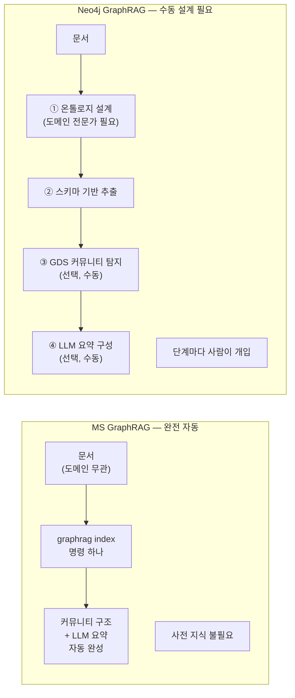

### 5.2 Global Search — 대체 불가능한 전체 조망 질의

Global Search는 Microsoft GraphRAG만이 제공하는 고유 기능입니다. "이 문서 집합 전체의 주요 주제는?", "이 데이터에서 반복되는 패턴은?" 같은 질의는 일부 청크를 검색하거나 특정 노드를 탐색하는 방식으로는 구조적으로 답하기 어렵습니다. 전체 데이터를 조망해야 합니다.

Global Search는 미리 생성된 커뮤니티 요약들을 Map-Reduce 패턴으로 병렬 처리하여, 전체 코퍼스를 한 번도 빠뜨리지 않고 질의에 대응합니다. Microsoft의 연구 결과 Global Search는 포괄성과 다양성 지표에서 기존 RAG 대비 약 70~80%의 승률을 기록했습니다.

### 5.3 DRIFT Search — 글로벌 맥락 + 로컬 정밀도의 융합

2024년 10월 추가된 DRIFT Search는 Global Search의 포괄성과 Local Search의 정밀도를 결합합니다. 커뮤니티 요약으로 전체 맥락을 파악한 뒤, LLM이 팔로업 질문을 자동 생성하고 반복적 로컬 탐색으로 답을 정교화합니다. 이 패턴은 neo4j-graphrag 패키지에 상당한 커스텀 작업 없이는 구현하기 어렵습니다.

### 5.4 LazyGraphRAG — 인덱싱 비용의 혁신

2024년 11월 발표된 LazyGraphRAG는 인덱싱 단계에서 LLM 호출을 거의 제거합니다. NLP로 명사구를 추출하고 커뮤니티를 탐지하되, 커뮤니티 요약은 질의 시점에 온디맨드로 생성합니다. 이 방식으로 인덱싱 비용을 Standard GraphRAG 대비 **0.1% 수준**으로 낮추면서도 동등한 질의 품질을 달성합니다.

### 5.5 사전 질문 없이 테마를 발견한다

Neo4j GraphRAG는 "어떤 것을 찾겠다"는 의도가 있어야 합니다. 스키마를 설계한다는 것 자체가 이미 어떤 엔터티와 관계가 중요한지 알고 있다는 전제를 담습니다.

Microsoft GraphRAG는 반대입니다. 어떤 질문을 해야 할지 모르는 상태에서도 커뮤니티 구조가 데이터의 전체 의미 지형을 미리 드러냅니다. 연구 논문 모음, 회의록 아카이브, 판례 데이터베이스처럼 **미리 알 수 없는 패턴을 발견해야 하는 탐색적 분석**에서 독보적입니다.

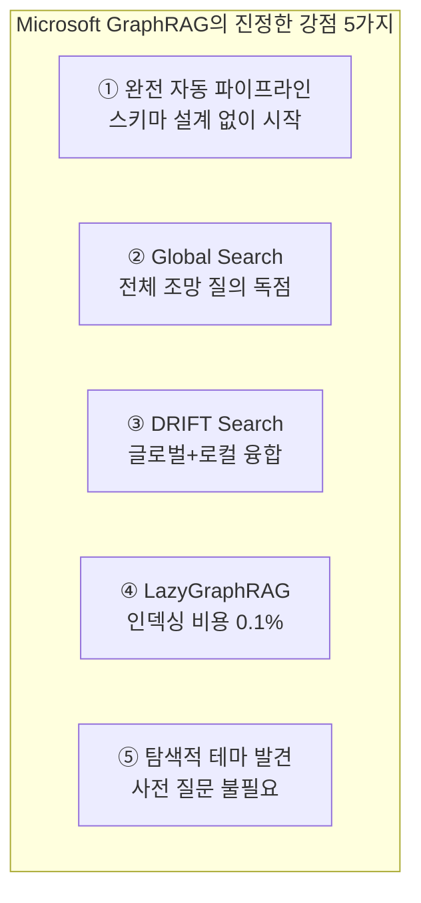

---

## 6. 검색 방식 비교 — 질의를 어떻게 처리하는가

```mermaid
flowchart TB
    Q["사용자 질의"]

    subgraph MS_QUERY["Microsoft GraphRAG 질의"]
        direction TB

        subgraph LOCAL_Q["Local Search"]
            LS1["질의 임베딩\n→ 관련 엔터티 탐색"]
            LS2["엔터티 주변 정보 수집\n(청크, 커뮤니티 요약, 관계, 공변량)"]
            LS3["LLM 답변 생성"]
            LS1 --> LS2 --> LS3
        end

        subgraph GLOBAL_Q["Global Search"]
            GS1["커뮤니티 요약 전체 처리\n(Map 단계 — 병렬)"]
            GS2["중요도 기반 통합\n(Reduce 단계)"]
            GS3["LLM 전체 조망 답변"]
            GS1 --> GS2 --> GS3
        end

        subgraph DRIFT_Q["DRIFT Search (신규)"]
            DR1["HyDE로 커뮤니티 검색\n+ 팔로업 질문 생성"]
            DR2["반복 Local 탐색"]
            DR3["계층적 답변 통합"]
            DR1 --> DR2 --> DR3
        end
    end

    subgraph NEO_QUERY["Neo4j GraphRAG 질의"]
        direction TB

        subgraph VR_Q["VectorRetriever"]
            VR1["질의 임베딩\n→ 벡터 유사도 검색\n→ 청크 반환"]
        end

        subgraph VCR_Q["VectorCypherRetriever"]
            VC1["벡터 검색으로 진입점 탐색\n→ Cypher로 그래프 확장\n→ 관련 노드/관계 수집"]
        end

        subgraph HCR_Q["HybridCypherRetriever"]
            HC1["벡터 + 전문검색(BM25)\n→ Cypher 그래프 탐색\n→ 하이브리드 결과"]
        end

        subgraph T2C_Q["Text2CypherRetriever"]
            TC1["자연어 → LLM이 Cypher 생성\n→ Neo4j에서 직접 실행\n→ 정확한 관계 조회"]
        end
    end

    Q --> MS_QUERY
    Q --> NEO_QUERY
```

### 6.1 Microsoft GraphRAG만 가능한 것

**Global Search**는 Microsoft GraphRAG 고유의 기능입니다. "이 문서 집합 전체의 주요 주제는 무엇인가?"처럼 전체 데이터를 아우르는 질의는 커뮤니티 요약 기반 Map-Reduce 없이는 구조적으로 처리하기 어렵습니다. Neo4j GraphRAG 패키지에는 이에 상응하는 내장 기능이 없습니다. Neo4j GDS로 커뮤니티를 탐지하고 LLM 요약을 직접 구성하면 유사한 효과를 낼 수 있지만, 상당한 커스텀 작업이 필요합니다.

**DRIFT Search** 역시 MS GraphRAG 고유입니다. 글로벌 커뮤니티 맥락에서 출발하여 팔로업 질문을 자동 생성하고 반복 로컬 탐색으로 정교화하는 패턴입니다.

### 6.2 Neo4j GraphRAG만 가능한 것

**정밀한 관계 탐색**은 Neo4j GraphRAG의 고유 영역입니다. "A가 B를 통해 C와 연결되는 경로는?"처럼 구체적인 Cypher 쿼리로 그래프를 탐색하는 것은 Microsoft GraphRAG로는 직접 수행할 수 없습니다.

**Text2Cypher**는 자연어를 Cypher 쿼리로 변환하여 Neo4j를 직접 질의합니다. 정형화된 관계 질의에서 매우 유용합니다.

---

## 7. 저장소 구조 비교

두 시스템이 내부적으로 어떤 데이터 구조를 사용하는지가 크게 다릅니다.

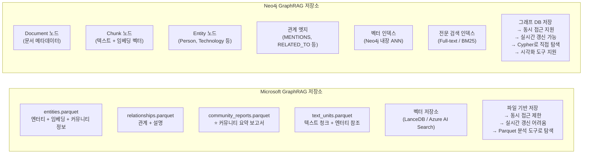

### 7.1 저장소 선택이 운영에 미치는 영향

Microsoft GraphRAG의 Parquet 파일 기반 저장은 데이터 분석과 일괄 처리에 적합하지만, 운영 시스템에서 실시간으로 데이터를 추가하거나 변경하는 것이 어렵습니다. 새 문서가 추가되면 전체 또는 부분 재인덱싱이 필요합니다.

Neo4j는 그래프 데이터베이스이므로 노드와 관계를 실시간으로 추가·수정·삭제할 수 있습니다. 운영 중인 시스템에서 문서가 증가해도 증분 업데이트가 자연스럽습니다.

---

## 8. Neo4j GraphRAG의 검색기 종류

공식 Neo4j GraphRAG Python 패키지는 다양한 검색기를 제공합니다. 각 검색기의 특성을 이해하면 질의 유형에 맞는 최적의 검색기를 선택할 수 있습니다.

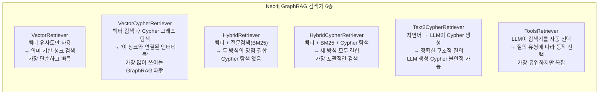

VectorCypherRetriever는 벡터 기반 유사도 검색과 그래프 탐색 기법을 결합하여 Neo4j의 그래프 기능을 완전히 활용합니다. 쿼리 임베딩을 처리하여 지정된 벡터 인덱스에 대한 유사도 검색을 수행하고, 관련 노드를 검색한 다음, Cypher 쿼리를 실행하여 이 노드를 기반으로 그래프를 탐색합니다.

---

## 9. 통합 가능성 — 둘이 함께 쓸 수 있는가

가장 흥미로운 부분입니다. 두 시스템은 경쟁이 아니라 **통합해서 사용할 수 있습니다**.

### 9.1 Microsoft GraphRAG 결과물을 Neo4j에 저장하기

Microsoft GraphRAG가 생성한 Parquet 파일의 노드와 커뮤니티 데이터를 Neo4j에 가져올 수 있습니다. Neo4j에 저장하면 Local과 Global 검색기를 LangChain이나 LlamaIndex에 통합할 수 있습니다.

이 통합 구성에서 Neo4j는 두 가지 역할을 동시에 수행합니다. MS GraphRAG의 커뮤니티 계층과 요약을 저장하는 저장소 역할과, Cypher 그래프 탐색을 위한 그래프 DB 역할입니다. MS GraphRAG가 생성한 Community 노드, CommunityReport 노드가 Neo4j에 그대로 적재되므로, Neo4j 안에서 커뮤니티 개념이 완전히 살아있게 됩니다.

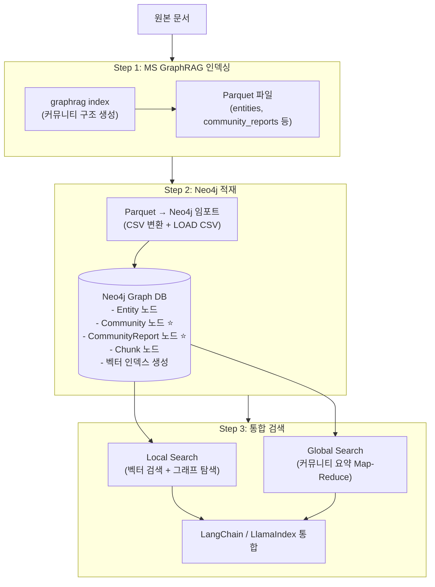

### 9.2 Neo4j GraphRAG에 커뮤니티 요약을 직접 추가하기

반드시 MS GraphRAG를 먼저 거칠 필요는 없습니다. Neo4j GraphRAG로 구축한 그래프 위에서도 커뮤니티를 구성할 수 있습니다.

Neo4j GDS(Graph Data Science) 라이브러리가 Leiden, Louvain 등 커뮤니티 탐지 알고리즘을 공식 지원합니다. GDS로 커뮤니티를 탐지한 뒤, 각 커뮤니티의 엔터티·관계 정보를 수집하여 LLM에 전달하면 커뮤니티 요약 노드를 직접 생성할 수 있습니다.

```cypher
-- Neo4j GDS로 Leiden 커뮤니티 탐지 실행
CALL gds.leiden.write('my-graph', {
  writeProperty: 'community',
  maxLevels: 10
})
YIELD communityCount, modularity, levels
```

이 방식은 MS GraphRAG의 완전 자동화 파이프라인에 비해 상당한 수동 작업이 필요하지만, 이미 Neo4j에 운영 중인 그래프가 있다면 재인덱싱 없이 커뮤니티 기능을 추가할 수 있다는 장점이 있습니다.

---

## 10. 성능과 비용 비교

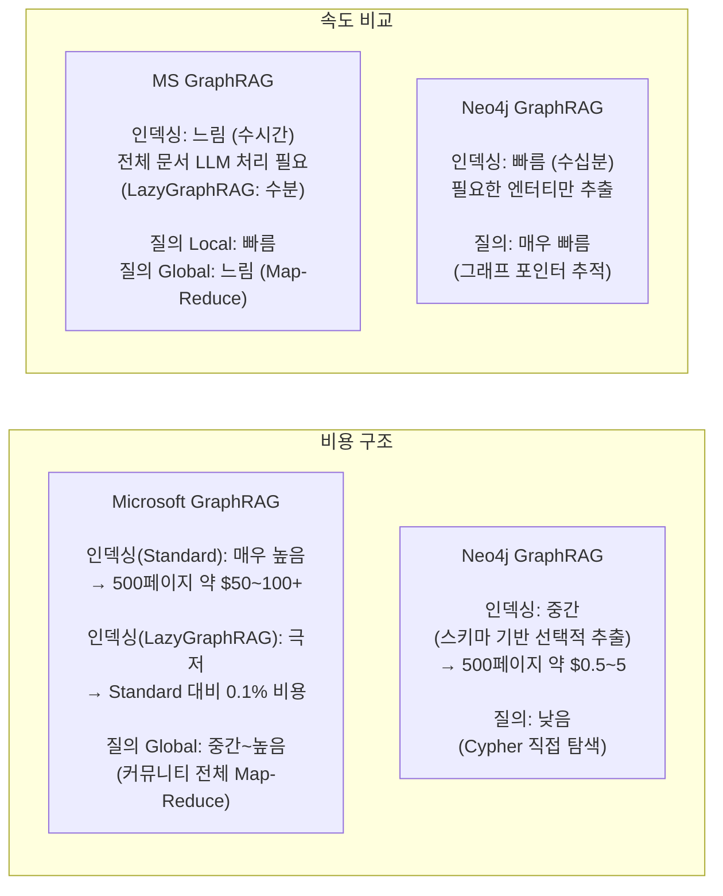

동일한 500페이지 코퍼스를 인덱싱하는 데 Neo4j 방식은 약 3분이 소요되고 비용은 약 $0.50입니다. 품질 벤치마크에서는 GraphRAG 성능의 70-90%를 1/100의 비용으로 달성합니다. 그러나 neo4j-graphrag 패키지 자체에 커뮤니티 요약 파이프라인이 없어 전체 조망 질의("모든 문서의 주요 주제는?")에서는 성능이 크게 떨어집니다.

Microsoft GraphRAG는 Standard 방식의 비용이 높지만, 2024년 11월 발표된 LazyGraphRAG를 사용하면 Standard 대비 0.1% 비용으로 동등한 질의 품질을 달성할 수 있습니다.

---

## 11. 언제 어느 것을 선택하는가

### 11.1 결정 트리

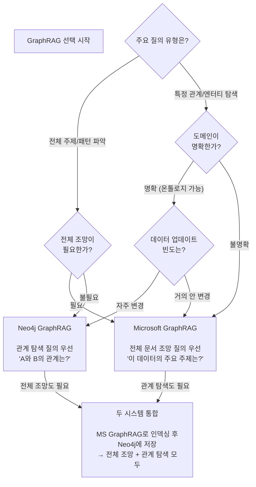

### 11.2 상황별 추천

| 상황 | 추천 | 이유 |
|---|---|---|
| "이 보고서들의 핵심 패턴을 파악하고 싶다" | **MS GraphRAG** | Global Search가 전체 조망에 최적 |
| "A 기술이 B 프로젝트에서 어떻게 쓰이는지 추적" | **Neo4j GraphRAG** | Cypher로 정밀한 관계 탐색 |
| "장애 보고서 전체에서 반복 패턴 분석" | **MS GraphRAG** | 글로벌 수준 자동 분석 |
| "시스템 취약점 영향도 분석" | **Neo4j GraphRAG** | 멀티홉 관계 탐색 |
| "도메인이 잘 정의된 기업 지식 관리" | **Neo4j GraphRAG** | 스키마 기반 정밀 추출 |
| "처음 보는 도메인, 어떤 주제가 있는지 모름" | **MS GraphRAG** | 자동 테마 발견 |
| "인덱싱 비용을 최소화하고 싶다" | **MS LazyGraphRAG** | Standard 대비 0.1% 비용 |
| "운영 시스템에 실시간 지식 추가" | **Neo4j GraphRAG** | 증분 업데이트 + GDS 커뮤니티 |
| "두 유형의 질의가 모두 필요" | **통합 구성** | MS GraphRAG → Neo4j 저장 |

---

## 12. 결론

두 시스템은 경쟁 관계가 아니라 **각자 잘하는 영역이 다른 상호보완적 도구**입니다.

**Microsoft GraphRAG의 강점**: 도메인 지식이나 온톨로지 없이도 대규모 비정형 문서에서 주제와 패턴을 자동으로 발견합니다. Global Search로 전체 데이터를 조망하는 질의에서 독보적입니다. LazyGraphRAG로 인덱싱 비용을 0.1% 수준으로 낮출 수 있으며, DRIFT Search로 글로벌 맥락과 로컬 정밀도를 융합합니다. 단, 표준 방식의 인덱싱 비용이 높고 실시간 업데이트가 어렵습니다.

**Neo4j GraphRAG의 강점**: 도메인 스키마를 정의하면 정밀하고 추적 가능한 관계 탐색이 가능합니다. 운영 시스템에 통합하기 쉽고, 실시간 데이터 추가가 자연스럽습니다. Neo4j GDS로 커뮤니티 탐지 자체는 가능하지만, neo4j-graphrag 패키지가 Global Search 수준의 자동화된 전체 조망 기능을 내장하지는 않습니다.

실무에서 가장 강력한 구성은 두 접근법을 결합하는 것입니다. Microsoft GraphRAG로 인덱싱하고 결과를 Neo4j에 저장하면, 커뮤니티 기반 글로벌 조망과 Cypher 기반 정밀 관계 탐색을 하나의 시스템에서 모두 활용할 수 있습니다.

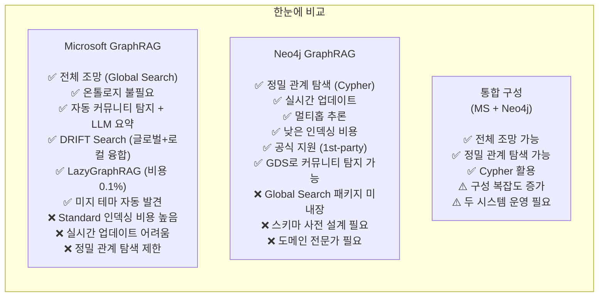

---

*작성일: 2026-05-18*  
*아키텍처팀*  
*상위 문서: Microsoft GraphRAG — 지식 그래프 기반 차세대 RAG 시스템*
