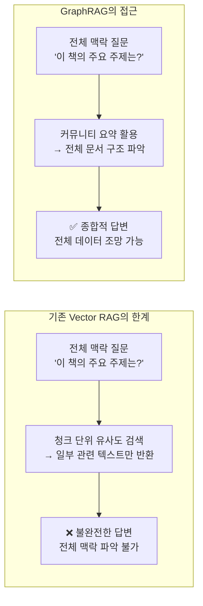
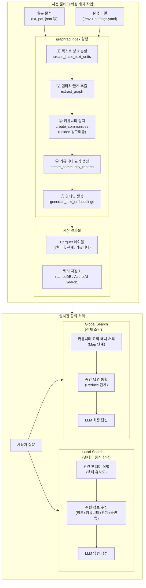
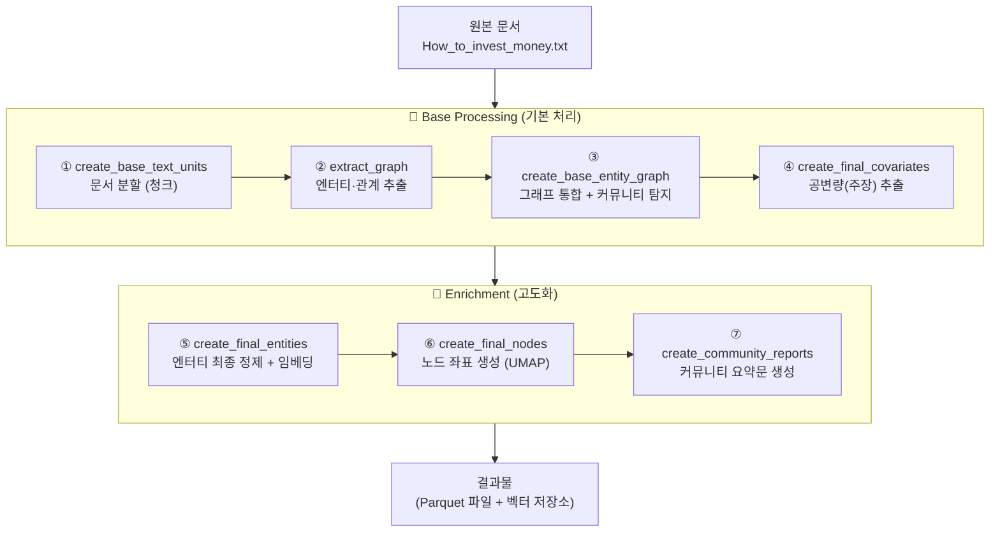
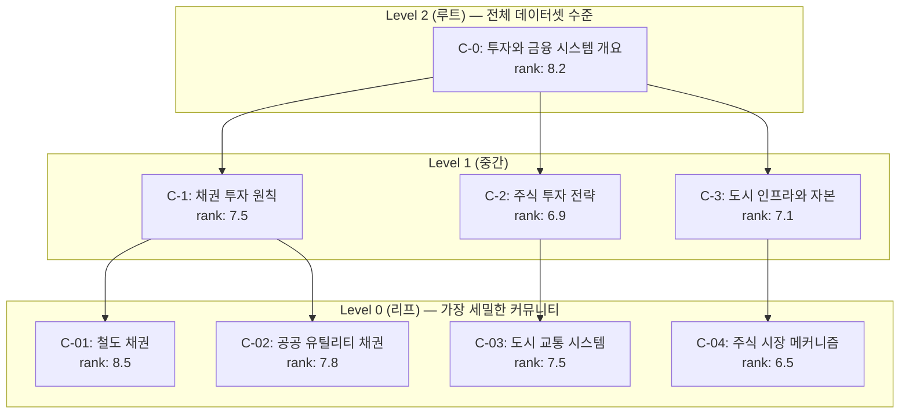
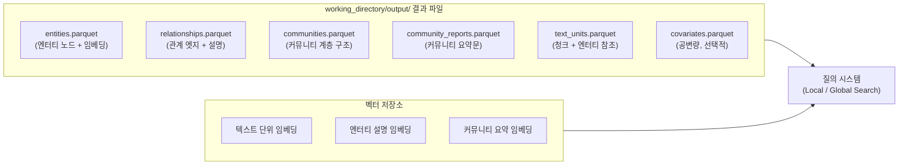
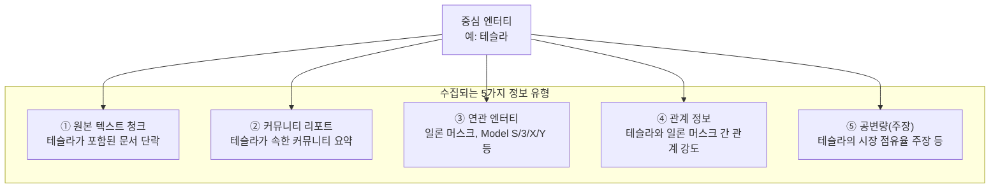
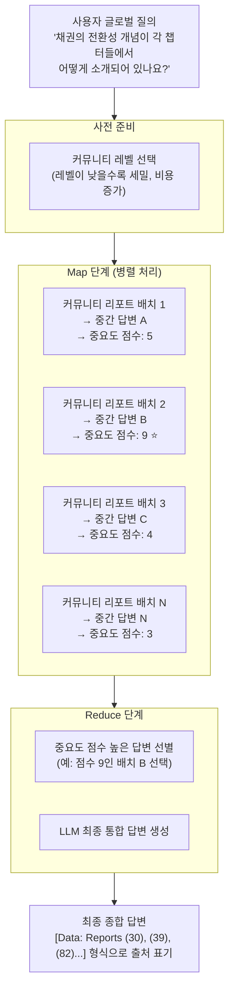
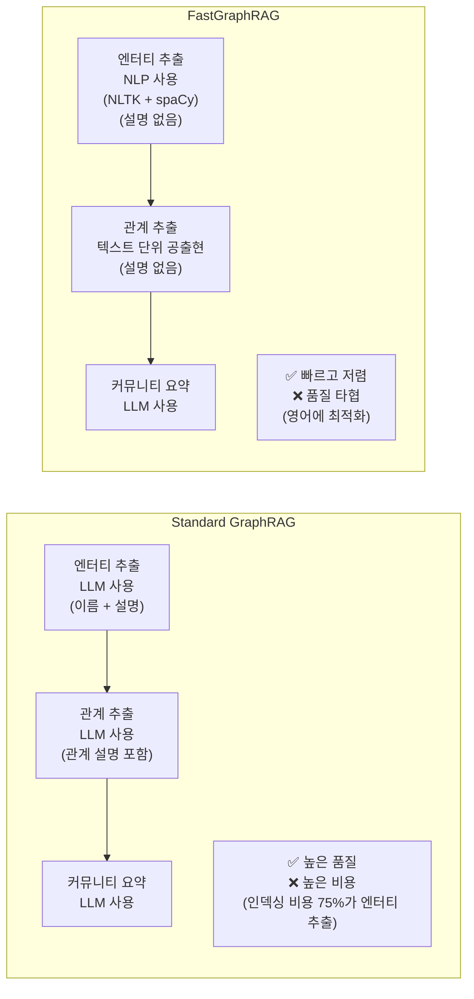
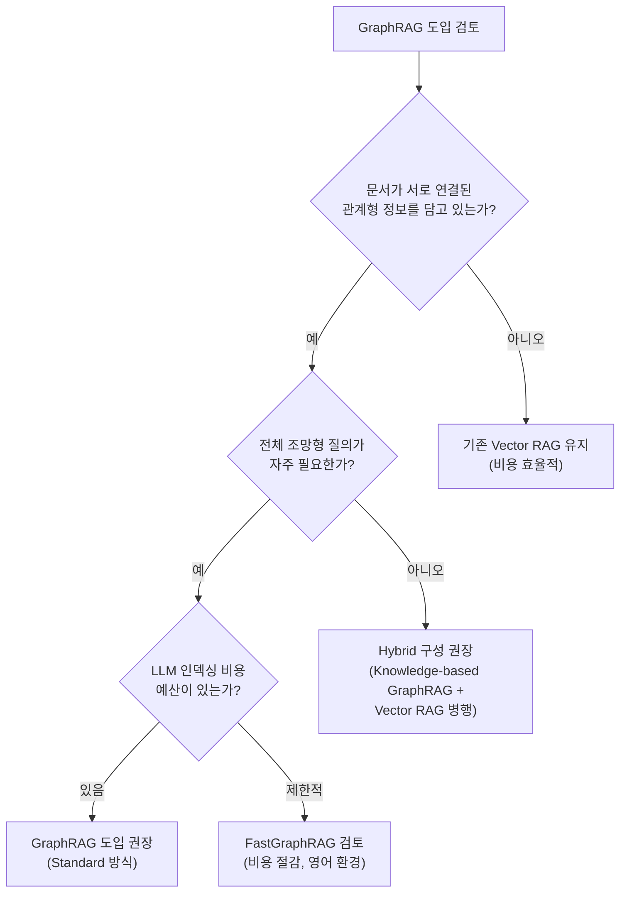

## 그래프 DB 구축부터 질의까지 완전 이해하기

> **아키텍처팀 기술 세미나**  
> 작성일: 2026-05-18  
> 대상: RAG 기술에 처음 입문하는 분들 포함, 아키텍처팀 전체

---

## 목차

1. [왜 일반 RAG로는 부족한가 — 문제 인식](#1-왜-일반-rag로는-부족한가--문제-인식)
2. [Microsoft GraphRAG란 무엇인가](#2-microsoft-graphrag란-무엇인가)
3. [전체 시스템 아키텍처 — 큰 그림 먼저](#3-전체-시스템-아키텍처--큰-그림-먼저)
4. [환경 설정 — 시작 전 준비 사항](#4-환경-설정--시작-전-준비-사항)
5. [설정 파일 상세 분석 — settings.yaml](#5-설정-파일-상세-분석--settingsyaml)
6. [그래프 DB 구축 과정 — 7단계 워크플로우 완전 해설](#6-그래프-db-구축-과정--7단계-워크플로우-완전-해설)
7. [그래프 DB 구축 결과물 — 어떤 데이터가 만들어지는가](#7-그래프-db-구축-결과물--어떤-데이터가-만들어지는가)
8. [GraphRAG 질의 — Local Search vs Global Search](#8-graphrag-질의--local-search-vs-global-search)
9. [Local Search 동작 원리 상세](#9-local-search-동작-원리-상세)
10. [Global Search 동작 원리 상세](#10-global-search-동작-원리-상세)
11. [Standard vs FastGraphRAG — 비용과 품질의 트레이드오프](#11-standard-vs-fastgraphrag--비용과-품질의-트레이드오프)
12. [결론 — 언제 GraphRAG를 선택할 것인가](#12-결론--언제-graphrag를-선택할-것인가)

---

## 1. 왜 일반 RAG로는 부족한가 — 문제 인식

### 1.1 기존 RAG 시스템의 한계

일반적인 RAG(Retrieval-Augmented Generation) 시스템은 사용자 질문이 들어오면 관련 문서 청크를 검색하고 LLM에게 전달하여 답변을 생성합니다. 이 방식은 명확하고 구체적인 질문에는 효과적이지만, 다음 유형의 질문에는 구조적인 한계를 드러냅니다.

"**이 책 전반에 걸쳐 나타나는 투자 철학의 변화 양상은 무엇인가요?**"

이 질문에 답하려면 책의 일부 청크를 찾는 것이 아니라, 책 전체를 아우르는 종합적인 이해가 필요합니다. 어떤 인물이 어떤 개념을 주장했고, 그 개념들이 챕터를 넘어 어떻게 연결되는지를 파악해야 합니다. 기존 벡터 유사도 검색은 이런 **전체적 맥락(Global Context)** 을 포착하는 데 취약합니다.



### 1.2 GraphRAG가 해결하는 문제

Microsoft Research가 2024년 발표한 GraphRAG는 이 문제를 **지식 그래프(Knowledge Graph)** 와 **커뮤니티 기반 요약** 두 가지 핵심 기술로 해결합니다. 단순히 문서를 검색하는 것이 아니라, 문서에서 엔터티(사람, 장소, 개념)와 그 관계를 추출하여 그래프를 구성하고, 유사한 엔터티들을 커뮤니티로 묶어 계층적 요약을 미리 만들어 둡니다.

---

## 2. Microsoft GraphRAG란 무엇인가

### 2.1 개요

GraphRAG는 LLM의 능력을 활용하여 비정형 텍스트에서 의미 있고 구조화된 데이터를 추출하도록 설계된 데이터 파이프라인이자 변환 도구 모음입니다. 오픈소스 프로젝트로 GitHub에 공개되어 있습니다.

GraphRAG의 핵심 원리는 두 단계로 구성됩니다. 첫 번째는 **인덱싱(Indexing)** — 문서를 지식 그래프로 변환하는 사전 준비 작업입니다. 두 번째는 **질의(Querying)** — 구축된 그래프를 기반으로 사용자 질문에 답하는 실시간 처리입니다.

### 2.2 기존 RAG와 GraphRAG 핵심 차이

| 구분 | 기존 Vector RAG | Microsoft GraphRAG |
|---|---|---|
| **지식 표현** | 텍스트 청크 (단편) | 엔터티 + 관계 + 커뮤니티 (구조화) |
| **검색 방식** | 벡터 유사도 | Local(엔터티 중심) + Global(커뮤니티) |
| **전체 문서 이해** | 어려움 | 커뮤니티 요약으로 가능 |
| **관계 탐색** | 불가 | 그래프 탐색으로 가능 |
| **비용** | 낮음 | 높음 (인덱싱에 LLM 집중 사용) |

---

## 3. 전체 시스템 아키텍처 — 큰 그림 먼저

GraphRAG 시스템을 이해하는 가장 좋은 방법은 전체 흐름을 먼저 파악하는 것입니다. 크게 세 구역으로 나뉩니다.



---

## 4. 환경 설정 — 시작 전 준비 사항

### 4.1 필수 요건

GraphRAG를 실행하기 위해서는 Python 3.10 이상의 버전이 필요합니다. 이는 GraphRAG가 활용하는 비동기 처리와 최신 타입 힌트 기능이 Python 3.10에서 안정화되었기 때문입니다.

### 4.2 설치 및 초기화 단계

GraphRAG 환경 구성은 다음 네 단계로 이루어집니다.

**1단계 — GraphRAG 라이브러리 설치**

Microsoft가 제공하는 공식 GraphRAG Python 패키지를 pip으로 설치합니다.

```bash
pip install graphrag
```

**2단계 — 작업 디렉터리 생성**

Python의 pathlib 라이브러리를 사용하여 GraphRAG가 사용할 작업 공간을 생성합니다. `parents=True` 옵션은 부모 디렉터리가 없어도 자동으로 생성하고, `exist_ok=True`는 이미 존재하더라도 오류 없이 넘어갑니다.

```python
from pathlib import Path

working_dir = Path('working_directory')
working_dir.mkdir(parents=True, exist_ok=True)
```

**3단계 — GraphRAG 초기화**

작업 디렉터리가 준비되면 GraphRAG를 초기화합니다. 이 명령을 실행하면 두 개의 설정 파일이 자동으로 생성됩니다.

```bash
graphrag init --root ./working_directory
```

초기화가 완료되면 다음 구조가 만들어집니다.

```
working_directory/
├── prompts/          ← LLM에 전달할 프롬프트 템플릿들
├── .env              ← API 키 등 환경 변수 (숨김 파일)
└── settings.yaml     ← 전체 파이프라인 설정
```

**4단계 — API 키 입력**

생성된 `.env` 파일에 LLM의 API 키를 입력합니다. 기본 설정은 OpenAI API를 사용합니다.

```
GRAPHRAG_API_KEY=여러분의_실제_API_키
```

> **주의**: GraphRAG 인덱싱은 비용이 상당히 발생할 수 있습니다. Microsoft 공식 문서에서도 경고하고 있으며, 처음에는 반드시 작은 문서로 시작하는 것을 권장합니다.

---

## 5. 설정 파일 상세 분석 — settings.yaml

`settings.yaml`은 GraphRAG 파이프라인의 모든 동작을 제어하는 핵심 설정 파일입니다. 주요 섹션별로 의미를 살펴봅니다.

### 5.1 LLM 모델 설정 (models)

```yaml
models:
  api_key: ${GRAPHRAG_API_KEY}    # .env에서 불러온 API 키
  type: openai_chat               # 또는 azure_openai_chat
  model: gpt-4-turbo-preview      # 사용할 LLM 모델
```

`type` 필드에서 `openai_chat`은 OpenAI API를 직접 사용하는 것이고, `azure_openai_chat`은 Microsoft Azure를 통해 배포된 OpenAI 모델을 사용하는 것입니다. 기업 환경에서는 데이터 보안과 규정 준수를 위해 Azure 옵션을 선택하는 경우가 많습니다.

### 5.2 문서 분할 설정 (chunks)

```yaml
chunks:
  size: 300           # 청크 하나의 최대 토큰 수
  overlap: 100        # 청크 간 겹치는 토큰 수
  group_by_columns: [id]  # 이 컬럼 기준으로 그룹화
```

청크 크기는 검색 품질에 직접 영향을 미칩니다. `size`가 너무 크면 LLM이 한 번에 너무 많은 정보를 처리해야 해서 추출 정확도가 떨어지고, 너무 작으면 맥락이 잘려 의미 파악이 어렵습니다. `overlap`은 청크 경계에서 정보가 잘리는 것을 방지합니다. 앞 청크 끝의 100토큰이 다음 청크 앞에 반복 포함되어 연속성을 유지합니다.

> **참고**: Microsoft의 최신 공식 문서(2026년 기준)에서 기본 청크 크기는 1,200 토큰으로 설정되어 있습니다. 책의 실습에서는 300 토큰으로 더 세밀하게 설정했는데, 작은 청크는 더 정밀한 엔터티 추출에 유리하지만 처리할 청크 수가 많아져 비용이 늘어납니다.

### 5.3 엔터티 추출 설정 (extract_graph)

```yaml
extract_graph:
  prompt: "prompts/extract_graph.txt"
  entity_types: [organization, person, geo, event]
  max_gleanings: 1
```

`entity_types`는 LLM이 추출할 엔터티의 종류를 제한합니다. 여기에 나열된 유형만 추출하도록 LLM에 지시합니다. 도메인에 따라 이 목록을 조정할 수 있습니다. 예를 들어 IT 기술 문서라면 `[organization, person, technology, system, vulnerability]`처럼 확장할 수 있습니다.

`max_gleanings`는 LLM을 반복 호출하여 누락된 엔터티를 보완하는 Gleaning 횟수입니다. 1이면 최초 추출 후 1회 추가 확인을 수행합니다. 값이 클수록 추출 정확도가 높아지지만 비용도 증가합니다.

### 5.4 커뮤니티 요약 설정 (community_reports)

```yaml
community_reports:
  model_id: default_chat_model
  graph_prompt: "prompts/community_report_graph.txt"
  text_prompt: "prompts/community_report_text.txt"
  max_length: 2000
  max_input_length: 8000
```

`max_length`는 생성되는 커뮤니티 요약문의 최대 토큰 수이고, `max_input_tokens`는 요약 생성 시 LLM에 전달할 컨텍스트 윈도우 크기입니다. 커뮤니티가 매우 크면 `max_input_length`를 초과하는 경우가 있어, 이 값을 적절히 설정하는 것이 중요합니다.

---

## 6. 그래프 DB 구축 과정 — 7단계 워크플로우 완전 해설

모든 설정이 완료되면 다음 명령 하나로 전체 인덱싱 파이프라인이 실행됩니다.

```bash
graphrag index --root ./working_directory
```

이 파이프라인은 원본 문서를 GraphRAG 지식 모델로 변환하는 여러 단계로 구성되며, 각 단계를 자세히 이해하는 것이 중요합니다.

파이프라인은 크게 두 국면으로 나뉩니다. **Base Processing(기본 처리)** 은 문서를 청크로 나누고 엔터티를 추출하여 초기 그래프를 만드는 단계입니다. **Enrichment(고도화)** 는 초기 그래프를 정제하고 커뮤니티 탐지, 요약 생성, 임베딩 작업을 수행하는 단계입니다.



### 6.1 1단계 — 문서 분할 (create_base_text_units)

가장 먼저 수행되는 작업은 원본 문서를 처리 가능한 크기의 **텍스트 단위(TextUnit)** 로 쪼개는 것입니다. 이때 분할 기준은 settings.yaml의 `chunks.size` 설정(토큰 수)을 따릅니다.

TextUnit은 그래프 추출 기법에 사용되는 텍스트 청크이며, 추출된 지식 항목들이 원본 텍스트로 역추적(provenance)할 수 있도록 소스 참조 역할도 합니다.

실제로 이 단계를 거치면 다음처럼 분할됩니다.

```
원문: "The Project Gutenberg eBook of How to Invest Money..."

결과:
- 청크 1: "The Project Gutenberg eBook..." (300 토큰)
- 청크 2: "...eBook of How to Invest Money..." (300 토큰, 이전 100 토큰 포함)
- 청크 3: ... (계속)
```

각 청크에는 고유한 ID가 부여되어 이후 모든 단계에서 이 ID로 추적됩니다.

### 6.2 2단계 — 엔터티와 관계 추출 (extract_graph)

이 단계에서 각 텍스트 단위를 처리하여 엔터티와 관계를 추출합니다. LLM에게 각 텍스트 단위에서 명명된 엔터티를 추출하고 설명을 제공하도록 지시합니다.

`max_gleanings` 설정에 따라 LLM이 추가 패스를 수행합니다. Gleaning은 "이미 이것들을 찾았는데, 혹시 빠뜨린 것이 있는가?"라는 방식으로 LLM에게 재질문하여 놓친 엔터티를 보완하는 기법입니다.

추출 결과의 예는 다음과 같습니다.

```json
// 텍스트 청크에서 추출된 엔터티 예시
{
  "엔터티": "PROJECT GUTENBERG",
  "유형": "ORGANIZATION",
  "설명": "무료 전자책을 제공하는 디지털 도서관"
}
```

엔터티와 관계는 모든 텍스트 단위에서 병합됩니다. 같은 제목과 유형을 가진 엔터티는 설명이 목록으로 합쳐집니다. 즉, 문서 여러 곳에서 "PROJECT GUTENBERG"가 등장하면 각각 추출된 설명들이 하나로 통합됩니다.

### 6.3 3단계 — 그래프 통합과 커뮤니티 탐지 (create_base_entity_graph)

이 단계는 세 가지 중요한 작업을 수행합니다.

**그래프 통합**: 각 텍스트 청크에서 독립적으로 추출된 서브그래프들을 하나의 통합된 전체 그래프로 병합합니다.

**커뮤니티 탐지**: Leiden 알고리즘을 사용하여 그래프에 계층적 커뮤니티 탐지를 적용합니다. 이 방식은 커뮤니티 크기 임계값에 도달할 때까지 재귀적으로 커뮤니티 클러스터링을 수행합니다.

Leiden 알고리즘은 서로 강하게 연결된 엔터티들을 같은 커뮤니티로 묶고, 커뮤니티 간 연결은 약하게 유지하도록 그래프를 분할합니다. 이 과정이 계층적으로 반복되어 레벨 0(가장 세밀)부터 루트 레벨(가장 광범위)까지의 계층 구조가 만들어집니다.

**그래프 임베딩 생성**: 그래프의 구조적 특성을 벡터로 표현하는 그래프 임베딩을 생성합니다. 이는 텍스트를 임베딩하는 것과 달리, 노드들 사이의 연결 패턴과 위치 관계를 수치화합니다.

이 단계 결과의 예를 보면 각 엔터티에 다음 정보가 추가됩니다.

```json
{
  "id": "GEORGE GARR HENRY",
  "data": {
    "type": "PERSON",
    "description": "George Garr Henry was the Vice-President of Guaranty Trust Company of New York and author of 'How to Invest Money' published in 1908...",
    "cluster": "5",     ← 속한 커뮤니티 번호
    "level": "1",       ← 커뮤니티 계층 레벨
    "degree": "10"      ← 이 엔터티와 연결된 다른 엔터티의 수
  }
}
```

`degree`는 해당 엔터티가 그래프에서 몇 개의 다른 엔터티와 연결되어 있는지를 나타냅니다. 이 값이 높을수록 해당 엔터티가 그래프에서 중심적인 역할을 한다는 의미로, 중요도와 영향력을 간접적으로 알 수 있습니다.

### 6.4 4단계 — 공변량 추출 (create_final_covariates)

**공변량(Covariate)** 은 통계나 머신러닝에서 독립 변수를 의미하지만, GraphRAG에서는 엔터티와 관련된 사실적 주장(Claim)을 가리킵니다.

공변량 추출은 선택적으로 실행 가능하며 기본적으로 비활성화되어 있습니다. 이는 공변량 추출이 유용하려면 일반적으로 프롬프트 조정(Prompt Tuning)이 필요하기 때문입니다.

예를 들어 "조지 개리 헨리는 1908년 'How to Invest Money'를 출판했다"는 내용은 조지 개리 헨리라는 엔터티에 대한 공변량(시간 한정 사실)이 됩니다. 이 정보는 이후 Local Search에서 엔터티 관련 추가 컨텍스트로 활용됩니다.

### 6.5 5단계 — 최종 엔터티 데이터 생성 (create_final_entities)

앞선 단계들에서 만들어진 초기 엔터티 데이터를 최종 형태로 정제합니다. 이 단계에서 세 가지 작업이 수행됩니다.

**엔터티 데이터 정제**: 중복 제거, 빈 값 필터링, 일관성 확보를 수행합니다. 같은 엔터티가 여러 청크에서 조금씩 다른 형태로 추출됐을 때 통합합니다.

**임베딩 생성**: 각 엔터티의 이름과 설명에 대한 텍스트 임베딩을 생성합니다. 이 임베딩은 그래프 임베딩(구조 기반)과는 다릅니다. 텍스트 임베딩은 엔터티가 의미적으로 무엇을 나타내는지를, 그래프 임베딩은 해당 엔터티가 그래프에서 어떤 위치에 있는지를 수치화합니다. 이 임베딩은 Local Search에서 엔터티 기반 검색에 사용됩니다.

**데이터 구조 개선**: 칼럼명 변경 및 데이터 정리를 통해 이후 분석에 적합한 형태로 구조를 개선합니다.

### 6.6 6단계 — 최종 노드 데이터와 그래프 레이아웃 계산 (create_final_nodes)

이 단계의 핵심은 그래프를 **시각화하기 위한 2D 좌표를 계산**하는 것입니다. 수백 차원의 그래프 임베딩 벡터를 2차원 평면의 x, y 좌표로 축소합니다.

이때 사용하는 기법이 **UMAP(Uniform Manifold Approximation and Projection)** 입니다. UMAP은 고차원 데이터의 구조를 최대한 보존하면서 저차원으로 변환합니다. 가까운 노드들은 2D 공간에서도 가깝게, 먼 노드들은 멀게 배치합니다.

이 단계의 결과물을 보면 각 노드가 다음과 같은 정보를 갖습니다.

```json
{
  "title": "PROJECT GUTENBERG",
  "type": "ORGANIZATION",
  "description": "Project Gutenberg is ... (이하 생략)",
  "community": "10",        ← 속한 커뮤니티 번호
  "degree": 23,             ← 연결 수
  "size": 23,               ← 노드 크기 (연결 수와 동일)
  "graph_embedding": [-0.0424..., ...],  ← 그래프 임베딩 벡터
  "x": 16.868...,           ← 시각화용 x 좌표
  "y": 8.587...             ← 시각화용 y 좌표
}
```

`size` 값은 그래프 시각화에서 노드의 크기를 결정합니다. 연결이 많은 중요한 엔터티일수록 더 큰 원으로 표시됩니다. 그래프 시각화를 원한다면 반드시 그래프 임베딩이 활성화되어 있어야 합니다.

### 6.7 7단계 — 커뮤니티 요약문 생성 (create_community_reports)

GraphRAG의 가장 독창적이고 중요한 단계입니다. 앞서 탐지된 각 커뮤니티에 대해 LLM이 **포괄적인 요약 보고서**를 생성합니다.

각 커뮤니티 리포트에는 다음 정보가 포함됩니다. 커뮤니티를 설명하는 제목(Title), 커뮤니티가 무엇을 나타내는지에 대한 개요(Summary), 0~10 사이의 영향 심각도 평가(Rating), 평가에 대한 단문 설명(Rating Explanation), 핵심 인사이트 목록(Findings)입니다.

실제 생성된 커뮤니티 요약 결과를 보면 이렇습니다.

```json
{
  "community": "0",
  "level": 0,
  "rank": 7.5,
  "title": "Traction Systems and Urban Growth in American Cities",
  "rank_explanation": "The impact severity rating is high due to the critical role of traction systems in urban infrastructure...",
  "summary": "The community is centered around traction systems in major American cities...",
  "findings": [
    {
      "explanation": "Traction systems in New York and Chicago are experiencing...",
      "summary": "Financial challenges of traction systems"
    },
    {
      "explanation": "The rapid growth of population...",
      "summary": "Impact of urban growth on traction systems"
    }
  ]
}
```

`rank`(중요도 점수)는 이후 Global Search에서 어떤 커뮤니티 요약을 우선 참조할지를 결정하는 기준이 됩니다.

커뮤니티는 계층 구조를 가집니다. 루트 레벨은 전체 데이터셋에 대한 최상위 요약이고, 하위 레벨로 내려갈수록 더 세밀하고 구체적인 커뮤니티 요약이 존재합니다.



---

## 7. 그래프 DB 구축 결과물 — 어떤 데이터가 만들어지는가

7단계 파이프라인이 완료되면 `working_directory/output` 폴더에 다수의 Parquet 파일이 생성됩니다. 파이프라인의 출력물은 기본적으로 Parquet 테이블로 저장되며, 임베딩은 설정된 벡터 저장소에 기록됩니다.



---

## 8. GraphRAG 질의 — Local Search vs Global Search

그래프 DB 구축이 완료되면 실제로 질의를 수행할 수 있습니다. GraphRAG는 서로 다른 유형의 질의에 맞춤화된 두 가지 질의 워크플로우를 제공합니다. Global Search는 커뮤니티 요약을 활용하여 전체 데이터에 관한 총체적 질문을 처리하고, Local Search는 특정 엔터티로 팬아웃하여 연관된 개념들을 탐색합니다.

```bash
# 글로벌 검색 (전체 맥락 질문에 적합)
graphrag query \
  --root ./ \
  --method global \
  --query "채권의 전환성 개념이 각 챕터들에서 어떻게 소개되어 있나요?"

# 로컬 검색 (특정 엔터티/사실 질문에 적합)
graphrag query \
  --root ./ \
  --method local \
  --query "채권의 전환성 개념이 각 챕터들에서 어떻게 소개되어 있나요?"
```

### 8.1 질의 유형 선택 가이드

| 질의 특성 | 권장 방식 | 예시 |
|---|---|---|
| 특정 인물/개념에 대한 구체적 정보 | **Local Search** | "일론 머스크와 연관된 제품은?" |
| 문서 전체를 아우르는 주제 파악 | **Global Search** | "이 책의 주요 투자 원칙은?" |
| 챕터 전반의 개념 변화 추적 | **Global Search** | "전환성 개념이 어떻게 발전했나?" |
| 두 엔터티의 관계 확인 | **Local Search** | "테슬라와 일론 머스크의 관계는?" |

---

## 9. Local Search 동작 원리 상세

Local Search는 특정 엔터티를 중심으로 관련 정보를 수집하여 답변을 생성합니다. 세 단계로 이루어집니다.

### 9.1 1단계 — 관련 엔터티 식별

사용자의 질문을 임베딩하고, 그래프 DB에 저장된 엔터티들의 임베딩과 유사도를 계산하여 가장 관련성이 높은 엔터티들을 선정합니다. 예를 들어 "테슬라의 최근 전기차 판매량은 어떻게 되나요?"라고 질문하면, 시스템은 질문의 임베딩을 기반으로 그래프 DB에서 '테슬라', '전기차' 등의 관련 엔터티를 찾아냅니다.

### 9.2 2단계 — 관련 정보 수집 (5가지 유형)

식별된 엔터티와 연관된 다섯 가지 유형의 정보를 수집합니다.



### 9.3 3단계 — 우선순위화 및 답변 생성

수집된 방대한 정보 중 실제로 질문과 관련된 정보만 선별합니다. LLM이 각 정보의 원래 질문과의 관련도를 평가하고, 가장 관련성 높은 정보들을 최종 컨텍스트로 구성하여 답변을 생성합니다.

---

## 10. Global Search 동작 원리 상세

Global Search는 전체 데이터셋을 아우르는 질문에 답하기 위해 **Map-Reduce 패턴**을 사용합니다.



Map 단계에서는 커뮤니티 요약들을 섞고 균일한 크기의 블록으로 나눕니다. 각 블록은 LLM이 처리하여 중간 답변을 생성하고 도움도 점수(0~100)가 부여됩니다. Reduce 단계에서는 점수가 가장 높은 중간 답변들이 결합되어 새로운 컨텍스트 윈도우를 구성하고, LLM이 최종 전체적 답변을 생성합니다.

Global Search 결과에서 `[Data: Reports (30)]` 형식의 표기가 등장하는데, 이는 해당 내용이 커뮤니티 리포트 번호 30에서 왔다는 출처 표기입니다. 답변의 근거를 추적할 수 있게 해줍니다.

---

## 11. Standard vs FastGraphRAG — 비용과 품질의 트레이드오프

GraphRAG는 Standard와 FastGraphRAG 두 가지 인덱싱 방법을 제공합니다. Standard는 모든 추론 작업에 언어 모델을 사용하며, FastGraphRAG는 일부 언어 모델 추론을 전통적인 자연어 처리(NLP) 방법으로 대체합니다.



Standard GraphRAG는 실세계 엔터티와 관계에 대한 풍부한 설명을 제공하지만 FastGraphRAG보다 비용이 높습니다. 그래프 추출이 인덱싱 비용의 약 75%를 차지합니다. 고품질 엔터티와 그래프 탐색이 중요한 경우라면 전통적인 GraphRAG를 권장합니다.

한국어 환경에서는 NLTK와 spaCy 기반의 FastGraphRAG가 영어에 최적화되어 있어 품질이 더욱 저하될 수 있습니다. 한국어 문서를 처리할 때는 Standard 방식을 사용하거나, 한국어를 지원하는 NLP 도구로 커스터마이징이 필요합니다.

---

## 12. 결론 — 언제 GraphRAG를 선택할 것인가

### 12.1 GraphRAG가 빛나는 상황

GraphRAG는 다음 조건에서 기존 RAG 대비 명확한 장점을 발휘합니다.

**전체 문서 조망이 필요한 경우**: "이 문서 모음 전체에서 반복되는 주요 테마는?", "저자의 전반적인 투자 철학은?" 같은 질문은 일부 청크가 아니라 전체 데이터를 아울러야 답할 수 있습니다.

**관계 탐색이 필요한 경우**: "A라는 인물과 B라는 기업이 어떻게 연결되는가?", "이 기술이 어느 프로젝트에서 어떻게 활용됐는가?" 같은 관계형 질의에서 강점을 보입니다.

**근거 추적이 중요한 경우**: 커뮤니티 리포트 번호 형태로 출처가 명시되어 답변의 근거를 역추적할 수 있습니다.

### 12.2 GraphRAG 사용 시 주의사항

**비용**: GraphRAG 인덱싱은 비용이 많이 드는 작업입니다. 모든 문서를 이해하고 항상 작은 규모로 시작하세요. 대형 문서 집합에 처음 적용할 때는 반드시 소규모 샘플로 먼저 테스트하고 비용을 예측한 후 전체 적용 여부를 결정해야 합니다.

**인덱싱 시간**: 문서가 많을수록 인덱싱 시간이 길어집니다. 비동기 처리와 병렬 실행으로 최적화되어 있지만, 대규모 문서 집합은 수 시간이 소요될 수 있습니다.

**버전 변화**: Microsoft GraphRAG는 활발히 개발 중인 패키지입니다. 마이너 버전 업그레이드 사이에는 반드시 `graphrag init --root [path] --force`를 실행하여 최신 설정 형식을 유지하고, 메이저 버전 업그레이드 시에는 제공되는 마이그레이션 노트북을 실행하세요.

### 12.3 아키텍처팀 관점의 도입 전략



GraphRAG는 기존 RAG를 대체하는 것이 아니라 **보완하는 기술**입니다. 일반적인 문서 검색에는 기존 Vector RAG가 효율적이고, 전체 맥락 파악이나 관계 탐색이 필요한 복잡한 질의에 GraphRAG를 활용하는 하이브리드 접근이 현실적인 선택입니다.

---

*작성일: 2026-05-18*  
*아키텍처팀*
