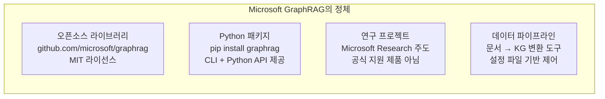
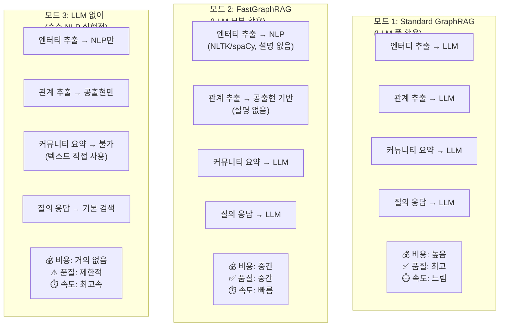
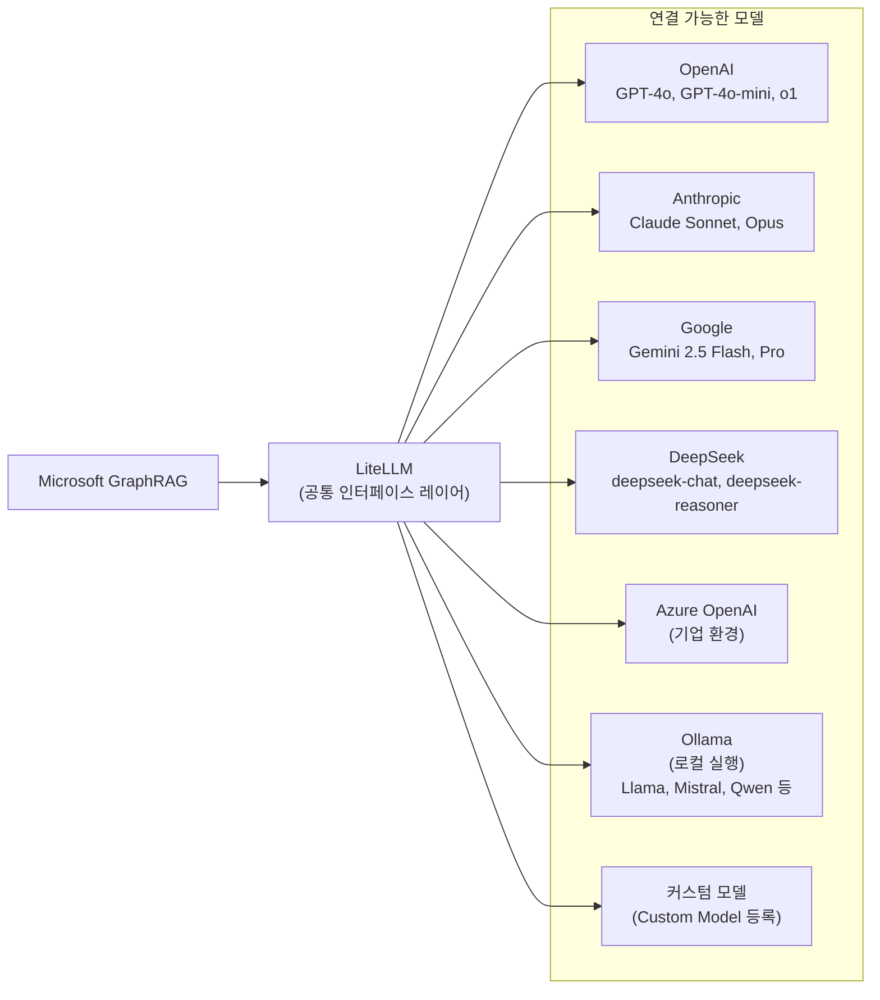
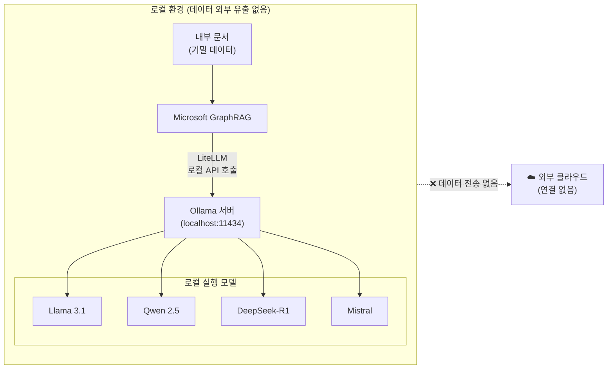
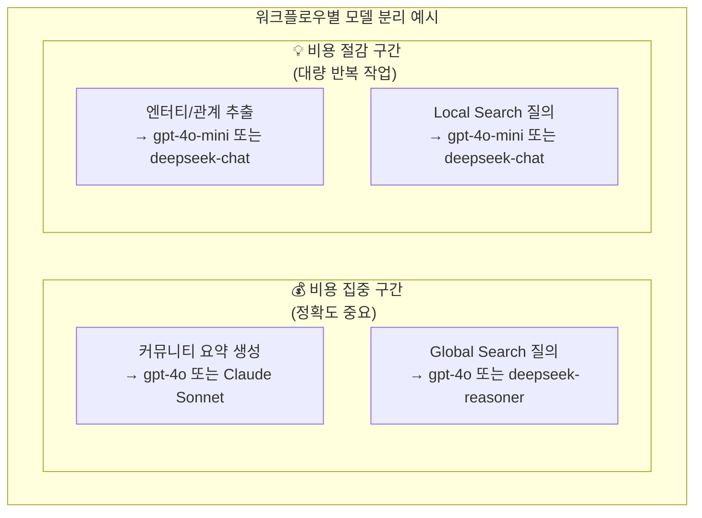
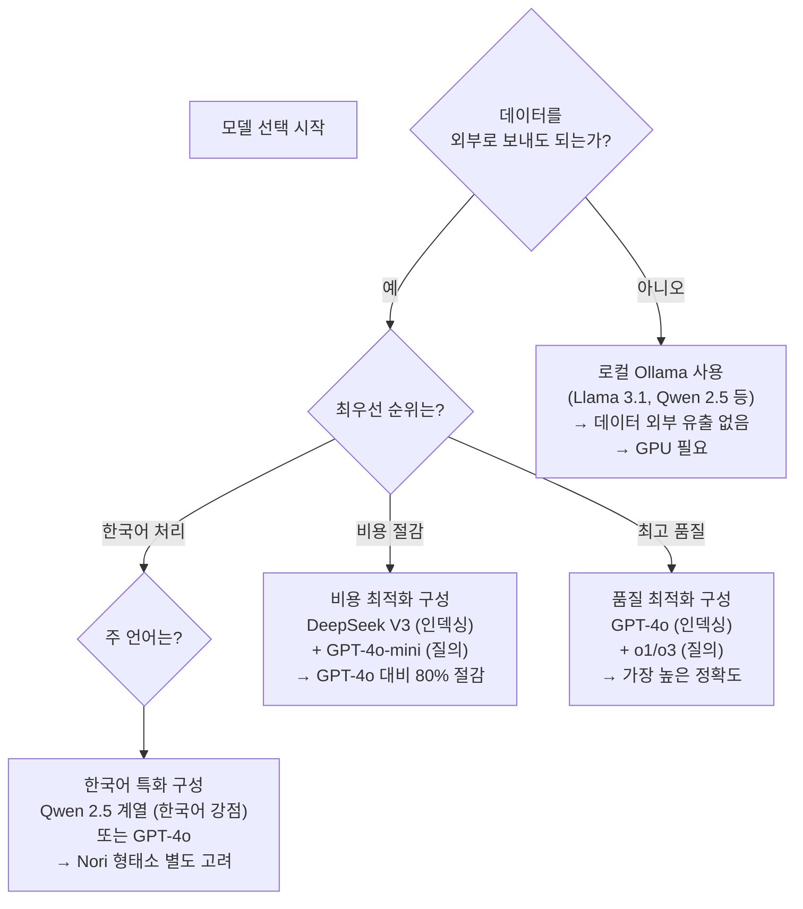

## 오픈소스인가? LLM이 반드시 필요한가? DeepSeek을 쓸 수 있는가?

> **아키텍처팀 기술 세미나 — 별첨 자료**  
> 상위 문서: [Microsoft GraphRAG — 지식 그래프 기반 차세대 RAG 시스템](https://k82022603.github.io/posts/microsoft-graphrag-%EC%A7%80%EC%8B%9D-%EA%B7%B8%EB%9E%98%ED%94%84-%EA%B8%B0%EB%B0%98-%EC%B0%A8%EC%84%B8%EB%8C%80-rag-%EC%8B%9C%EC%8A%A4%ED%85%9C/)


---

## 목차

1. [Microsoft GraphRAG는 무엇인가 — 성격과 정의](#1-microsoft-graphrag는-무엇인가--성격과-정의)
2. [LLM은 반드시 필요한가 — 세 가지 모드](#2-llm은-반드시-필요한가--세-가지-모드)
3. [어떤 LLM을 쓸 수 있는가 — 모델 선택 자유도](#3-어떤-llm을-쓸-수-있는가--모델-선택-자유도)
4. [DeepSeek 연결 방법 — 구체적 설정](#4-deepseek-연결-방법--구체적-설정)
5. [Ollama로 로컬 LLM 연결하기](#5-ollama로-로컬-llm-연결하기)
6. [역할별 모델 분리 전략 — 비용 최적화](#6-역할별-모델-분리-전략--비용-최적화)
7. [모델 선택 시 반드시 알아야 할 제약](#7-모델-선택-시-반드시-알아야-할-제약)
8. [LiteLLM이 지원하는 주요 모델 목록](#8-litellm이-지원하는-주요-모델-목록)
9. [결론 — 선택 기준 정리](#9-결론--선택-기준-정리)

---

## 1. Microsoft GraphRAG는 무엇인가 — 성격과 정의

### 1.1 오픈소스 라이브러리 + 데이터 파이프라인

Microsoft GraphRAG 프로젝트는 LLM의 힘을 활용하여 비정형 텍스트에서 의미 있고 구조화된 데이터를 추출하도록 설계된 데이터 파이프라인 및 변환 도구 모음입니다. 상업적 제품이나 서비스가 아니라 연구 목적의 오픈소스 코드베이스입니다.

세 가지 키워드로 성격을 정의할 수 있습니다.

| 키워드 | 의미 |
|---|---|
| **오픈소스** | MIT 라이선스로 공개, GitHub에서 누구나 열람·수정·배포 가능 |
| **Python 라이브러리** | `pip install graphrag`로 설치, 코드로 직접 제어 가능 |
| **데이터 파이프라인** | 문서 → 지식그래프 변환 워크플로우 도구 모음 |



### 1.2 공식 지원 제품이 아님을 주의

이 저장소는 LLM 출력을 향상하기 위해 지식 그래프 메모리 구조를 사용하는 방법론을 제시합니다. 제공된 코드는 데모 목적으로 제공되며 Microsoft의 공식 지원 제품이 아님을 유의하세요.

즉, 버그가 생겨도 Microsoft 고객 지원팀에 티켓을 넣을 수 없습니다. 커뮤니티와 GitHub Issues가 지원 채널입니다. 기업 환경에서 운영 시스템에 도입한다면 이 점을 고려해야 합니다.

### 1.3 Microsoft Discovery로의 발전

GraphRAG와 LazyGraphRAG 기술은 현재 Azure에서 구축된 과학 연구용 에이전틱 플랫폼인 Microsoft Discovery를 통해 이용할 수 있습니다. 완전 관리형 서비스로 사용하려면 Azure 환경에서 Microsoft Discovery를 통하는 경로도 있습니다.

---

## 2. LLM은 반드시 필요한가 — 세 가지 모드

핵심 질문입니다. 답은 "**반드시는 아닙니다. 단, 쓸수록 품질이 올라갑니다.**"

GraphRAG는 LLM 사용 비중에 따라 세 가지 모드로 운영할 수 있습니다.



### 2.1 Standard GraphRAG — LLM 풀 활용 (기본값)

`graphrag index --method standard` 명령으로 실행합니다. 엔터티 추출, 관계 추출, 설명 요약, 커뮤니티 리포트 생성까지 모든 단계에 LLM이 사용됩니다. 그래프 추출이 인덱싱 비용의 약 75%를 차지합니다. 가장 풍부하고 정확한 지식그래프를 만들지만 비용이 높습니다.

### 2.2 FastGraphRAG — LLM 부분 활용

`graphrag index --method fast` 명령으로 실행합니다. FastGraphRAG는 언어 모델 추론의 일부를 전통적인 자연어 처리(NLP) 방법으로 대체합니다. 엔터티는 NLTK와 spaCy 같은 NLP 라이브러리를 사용하여 추출된 명사구이며 설명이 없고, 관계는 엔터티 쌍 사이의 텍스트 단위 공출현으로 정의되며 설명이 없습니다.

커뮤니티 요약과 질의 응답에는 여전히 LLM이 필요합니다. 비용과 속도 면에서 유리하지만 품질이 낮아집니다.

### 2.3 LLM 없이 — 그래프 추출 생략 옵션

언어 모델을 전혀 사용하지 않는 또 다른 옵션은 그래프 추출에 NLP를 사용하는 빠른 인덱싱 방법을 쓰는 것입니다. 단, 커뮤니티 요약이 없으면 Global Search 품질이 크게 떨어지고, 사실상 기본 벡터 RAG와 유사한 수준이 됩니다.

---

## 3. 어떤 LLM을 쓸 수 있는가 — 모델 선택 자유도

### 3.1 LiteLLM — 100개 이상 모델의 공통 인터페이스

GraphRAG는 내부적으로 **LiteLLM**을 사용하여 LLM을 호출합니다. LiteLLM은 OpenAI, Anthropic, Google, DeepSeek, Ollama 등 100개 이상의 모델을 단일 인터페이스로 호출할 수 있게 해주는 Python 라이브러리입니다.



GraphRAG는 LiteLLM을 사용하여 언어 모델을 호출합니다. LiteLLM은 100개 이상의 모델을 지원하지만, 모델을 선택할 때 JSON 스키마를 준수하는 구조화된 출력(structured outputs)을 반환할 수 있어야 한다는 점이 중요합니다.

### 3.2 공식적으로 가장 잘 지원되는 모델

GraphRAG는 OpenAI 모델을 사용하여 구축되고 테스트되었으므로, 이것이 기본적으로 지원하는 모델 세트입니다. 이것이 제한이나 품질 한계를 의미하는 것은 아니며, 단지 프롬프팅, 튜닝, 디버깅 측면에서 가장 익숙한 모델 세트라는 의미입니다.

실질적으로 GPT-4o, GPT-4o-mini, o1 시리즈가 가장 안정적으로 동작하고, 문제가 생겼을 때 커뮤니티 지원을 받기 쉽습니다.

### 3.3 다른 모델 사용 시 주의 사항

다른 모델을 사용할 수 있지만, **JSON 형식 응답**을 안정적으로 반환할 수 있어야 한다는 조건이 있습니다. 엔터티 추출 단계에서 GraphRAG는 LLM에게 특정 JSON 스키마를 따르는 응답을 요구합니다. 모델이 이를 제대로 지원하지 않으면 파싱 오류가 발생합니다.

프록시를 통해 다른 모델 제공자로 기본 모델 HTTP 호출을 우회하는 방법을 많은 사용자가 사용하고 있습니다. 이는 합리적으로 작동하지만, 잘못된 형식의 응답(특히 JSON)에서 자주 문제가 발생하므로, 이 방법을 사용한다면 모델이 GraphRAG가 기대하는 특정 응답 형식을 안정적으로 반환할 수 있어야 합니다.

---

## 4. DeepSeek 연결 방법 — 구체적 설정

DeepSeek은 LiteLLM을 통해 완전히 지원됩니다. DeepSeek API를 사용하는 방법과 Ollama로 로컬에서 실행하는 방법 두 가지가 있습니다.

### 4.1 DeepSeek API 사용 (클라우드)

DeepSeek은 OpenAI 호환 API를 제공하므로 LiteLLM에서 `deepseek/` 접두사로 바로 사용할 수 있습니다.

**.env 파일 설정:**

```
DEEPSEEK_API_KEY=여러분의_DeepSeek_API_키
```

**settings.yaml 설정:**

```yaml
completion_models:
  # 인덱싱용 모델 (비용 효율)
  indexing_model:
    model_provider: deepseek
    model: deepseek-chat        # DeepSeek-V3 계열
    auth_method: api_key
    api_key: ${DEEPSEEK_API_KEY}

  # 질의용 모델 (고품질)
  query_model:
    model_provider: deepseek
    model: deepseek-reasoner    # DeepSeek-R1 추론 모델
    auth_method: api_key
    api_key: ${DEEPSEEK_API_KEY}

embedding_models:
  default_embedding_model:
    # ⚠️ DeepSeek은 임베딩 모델을 제공하지 않음
    # 임베딩은 OpenAI 또는 다른 제공자를 사용해야 함
    model_provider: openai
    model: text-embedding-3-small
    auth_method: api_key
    api_key: ${GRAPHRAG_API_KEY}

# 각 워크플로우에 모델 연결
extract_graph:
  completion_model_id: indexing_model    # 인덱싱에 deepseek-chat 사용

global_search:
  completion_model_id: query_model       # 질의에 deepseek-reasoner 사용
```

### 4.2 DeepSeek 모델 선택 가이드

| 모델명 | 특징 | GraphRAG 권장 용도 |
|---|---|---|
| `deepseek-chat` (V3) | GPT-4o급 성능, 매우 저렴 | 인덱싱 전 단계 (엔터티 추출, 요약) |
| `deepseek-reasoner` (R1) | 추론 특화, 더 높은 비용 | 질의 응답 단계 |

**비용 참고**: DeepSeek V3는 GPT-4o 대비 약 1/15 수준의 비용으로 알려져 있습니다. 대규모 인덱싱 작업에서 비용을 크게 줄일 수 있습니다.

### 4.3 DeepSeek Reasoner(R1) 사용 시 주의

DeepSeek-R1은 추론(Chain-of-Thought) 과정을 응답에 포함하는 추론 모델입니다. GraphRAG가 기대하는 JSON 형식 응답을 안정적으로 반환하는지 먼저 소규모로 테스트한 후 전체 인덱싱에 적용하는 것을 권장합니다.

---

## 5. Ollama로 로컬 LLM 연결하기

### 5.1 왜 로컬 LLM인가

데이터 보안이 중요한 환경(기업 내부 문서, 개인정보 포함 문서)에서는 외부 API로 데이터를 전송하는 것 자체가 문제가 될 수 있습니다. Ollama를 사용하면 LLM을 로컬 서버에서 실행하고 GraphRAG를 연결할 수 있어, 데이터가 외부로 나가지 않습니다.



### 5.2 Ollama 설치 및 모델 준비

```bash
# Ollama 설치 (Linux/macOS)
curl -fsSL https://ollama.com/install.sh | sh

# 사용할 모델 다운로드
ollama pull llama3.1:8b      # Meta Llama 3.1 8B
ollama pull qwen2.5:7b       # Alibaba Qwen 2.5 (한국어 지원 양호)
ollama pull deepseek-r1:8b   # DeepSeek R1 로컬 버전
ollama pull mistral:7b       # Mistral 7B

# 임베딩 모델 (별도 필요)
ollama pull nomic-embed-text  # 오픈소스 임베딩 모델
```

### 5.3 GraphRAG settings.yaml — Ollama 연결 설정

```yaml
completion_models:
  default_completion_model:
    model_provider: ollama          # Ollama 지정
    model: llama3.1:8b              # 사용할 모델
    api_base: http://localhost:11434  # Ollama 서버 주소
    auth_method: none               # 인증 불필요

embedding_models:
  default_embedding_model:
    model_provider: ollama
    model: nomic-embed-text         # 임베딩 모델
    api_base: http://localhost:11434
    auth_method: none
```

### 5.4 로컬 LLM 사용 시 현실적 고려 사항

로컬 LLM은 외부 API 대비 몇 가지 현실적 한계가 있습니다.

**컨텍스트 길이 문제**: 일부 소형 로컬 모델은 컨텍스트 길이(Context Length)가 짧습니다. GraphRAG의 커뮤니티 요약 단계에서는 긴 컨텍스트가 필요한데, 모델의 기본 `num_ctx`가 짧으면 정보가 잘립니다. 필요하다면 Modelfile로 컨텍스트 길이를 확장해야 합니다.

**JSON 응답 안정성**: 소형 로컬 모델은 대형 클라우드 모델에 비해 JSON 형식을 정확히 따르는 능력이 떨어질 수 있습니다. GraphRAG는 엔터티 추출 단계에서 JSON 파싱을 수행하기 때문에, 모델이 잘못된 형식의 JSON을 반환하면 오류가 발생합니다.

**속도**: GPU가 없는 환경에서 7B 파라미터 모델을 CPU로 실행하면 매우 느립니다. 대용량 문서 인덱싱에는 현실적으로 어렵습니다.

---

## 6. 역할별 모델 분리 전략 — 비용 최적화

GraphRAG의 강력한 기능 중 하나는 **워크플로우별로 서로 다른 모델을 지정**할 수 있다는 것입니다. 무거운 작업에는 강력한 모델을, 가벼운 반복 작업에는 저렴한 모델을 할당하여 비용을 최적화합니다.



**settings.yaml 역할별 분리 설정 예시:**

```yaml
completion_models:
  # 비용 효율적 모델 (대량 반복 작업용)
  cheap_model:
    model_provider: deepseek
    model: deepseek-chat          # GPT-4o급 성능, 1/15 비용
    auth_method: api_key
    api_key: ${DEEPSEEK_API_KEY}

  # 고성능 모델 (중요한 추론 작업용)
  quality_model:
    model_provider: openai
    model: gpt-4o
    auth_method: api_key
    api_key: ${OPENAI_API_KEY}

  # 추론 특화 모델 (복잡한 질의용)
  reasoning_model:
    model_provider: openai
    model: o1-mini
    auth_method: api_key
    api_key: ${OPENAI_API_KEY}

# 각 단계별 모델 할당
extract_graph:
  completion_model_id: cheap_model      # 대량 호출 → 저렴한 모델

community_reports:
  completion_model_id: quality_model    # 요약 품질 중요 → 고성능 모델

global_search:
  completion_model_id: reasoning_model  # 전체 조망 질의 → 추론 모델

local_search:
  completion_model_id: cheap_model      # 간단한 질의 → 저렴한 모델
```

---

## 7. 모델 선택 시 반드시 알아야 할 제약

### 7.1 필수 조건 — JSON 구조화 출력 지원

GraphRAG가 LLM에서 요구하는 가장 중요한 기능은 **JSON Schema를 준수하는 구조화된 출력**을 반환하는 능력입니다. 엔터티 추출 단계에서 LLM은 다음과 같은 형식의 JSON을 반환해야 합니다.

```json
{
  "entities": [
    {
      "name": "PROJECT GUTENBERG",
      "type": "ORGANIZATION",
      "description": "무료 전자책을 제공하는 디지털 도서관"
    }
  ],
  "relationships": [
    {
      "source": "PROJECT GUTENBERG",
      "target": "GEORGE GARR HENRY",
      "description": "출판사와 저자의 관계"
    }
  ]
}
```

소형 모델이나 일부 오픈소스 모델은 이 형식을 안정적으로 따르지 못해 파싱 오류를 일으킬 수 있습니다.

### 7.2 o-시리즈(추론 모델) 사용 시 특별 주의

OpenAI의 o1, o3 같은 추론 모델은 일반 GPT 모델과 다른 파라미터 체계를 가집니다. GraphRAG 2.2.0 이상에서는 o-시리즈 모델을 지원하지만, `max_tokens` 대신 `max_completion_tokens`를 사용하는 등 설정 방식이 다릅니다. o-시리즈 모델은 속도가 훨씬 느리고 비용도 높습니다.

### 7.3 임베딩 모델은 별도 고려

텍스트 임베딩에도 별도 모델이 필요합니다. DeepSeek는 임베딩 모델을 제공하지 않기 때문에, DeepSeek을 주 LLM으로 사용하더라도 임베딩은 OpenAI `text-embedding-3-small` 또는 오픈소스 임베딩 모델(`nomic-embed-text`, `bge-m3` 등)을 별도로 설정해야 합니다.

---

## 8. LiteLLM이 지원하는 주요 모델 목록

GraphRAG에서 LiteLLM을 통해 연결 가능한 주요 모델과 제공자 목록입니다.

| 제공자 | 모델 예시 | model_provider 설정값 | 비고 |
|---|---|---|---|
| **OpenAI** | gpt-4o, gpt-4o-mini, o1, o3 | `openai` | 가장 검증된 조합 |
| **Anthropic** | claude-sonnet-4-5, claude-opus | `anthropic` | 긴 컨텍스트 강점 |
| **Google** | gemini-2.5-flash, gemini-pro | `gemini` | 비용 효율 |
| **DeepSeek** | deepseek-chat, deepseek-reasoner | `deepseek` | 가성비 최강 |
| **Azure OpenAI** | gpt-4o (Azure 배포) | `azure` | 기업 환경 |
| **Ollama** | llama3.1, qwen2.5, mistral 등 | `ollama` | 완전 로컬 |
| **Groq** | llama3-groq-70b 등 | `groq` | 초고속 추론 |
| **AWS Bedrock** | claude, llama 등 | `bedrock` | AWS 환경 |
| **커스텀** | 자체 개발 모델 | 코드로 등록 | 고급 사용자 |

---

## 9. 결론 — 선택 기준 정리



**핵심 정리 세 줄:**

첫째, Microsoft GraphRAG는 MIT 라이선스 오픈소스 Python 라이브러리로, LLM을 중심으로 설계됐지만 FastGraphRAG 모드로 LLM 의존도를 크게 줄일 수 있습니다.

둘째, DeepSeek을 포함한 100개 이상의 모델을 LiteLLM을 통해 연결할 수 있습니다. 단, JSON 구조화 출력을 안정적으로 반환할 수 있는 모델이어야 합니다.

셋째, 비용 최적화를 위해 인덱싱 단계(대량 반복 호출)에는 DeepSeek-chat 같은 저렴한 모델을, 질의 단계에는 고성능 모델을 분리 적용하는 역할별 모델 분리 전략이 효과적입니다.

---

*작성일: 2026-05-18*  
*아키텍처팀*  
*상위 문서: Microsoft GraphRAG — 지식 그래프 기반 차세대 RAG 시스템*
