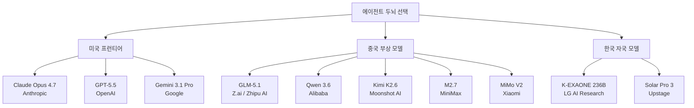
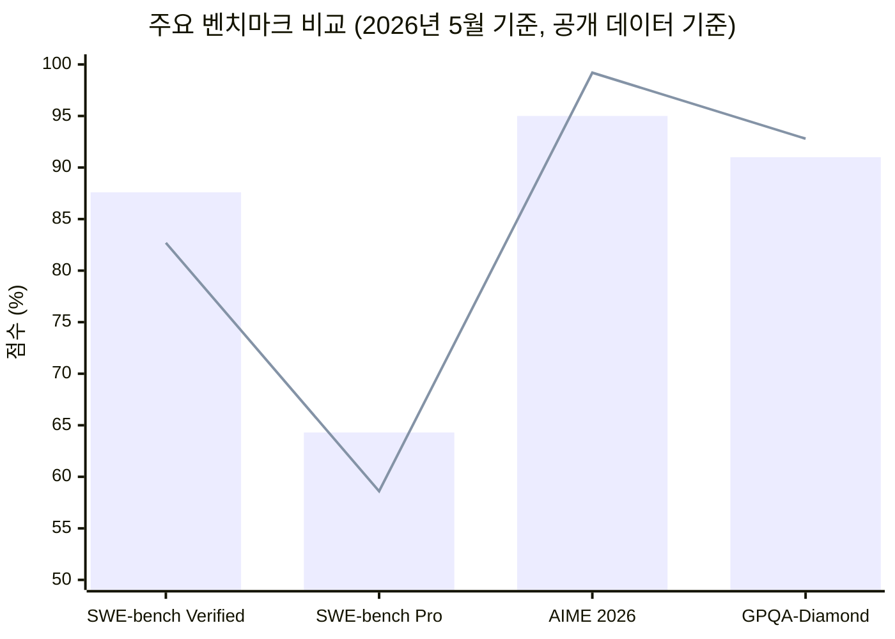
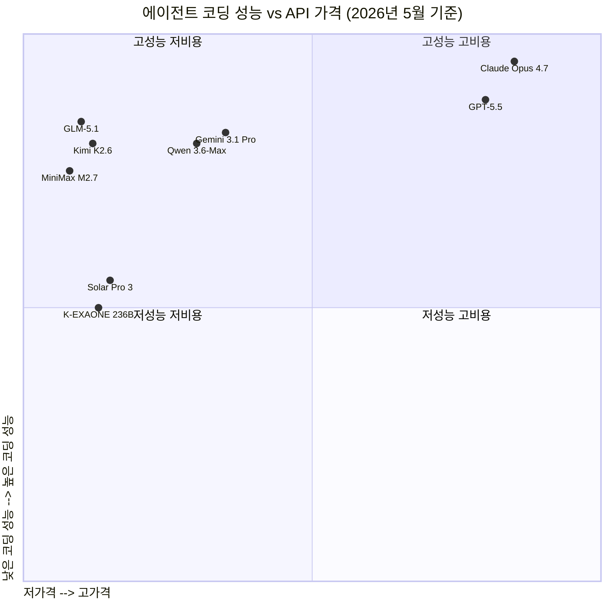

> 에이전트 시대의 모델 선택은 단순한 성능 비교를 넘어, 오픈소스와 프로프라이어터리, 미국과 중국, 한국의 독자 노선이 교차하는 복합적인 전략적 결정이 되었다.

---

## 목차

1. [에이전트 시대의 두뇌 선택](#1-에이전트-시대의-두뇌-선택)
2. [2강 체제: Claude Opus 4.7과 GPT-5.5](#2-2강-체제-claude-opus-47과-gpt-55)
3. [제3의 축: Google Gemini 3.1 Pro](#3-제3의-축-google-gemini-31-pro)
4. [중국산 모델의 급부상](#4-중국산-모델의-급부상)
   - 4-1. [Z.ai GLM-5.1](#41-zai-glm-51)
   - 4-2. [Alibaba Qwen 3.6](#42-alibaba-qwen-36)
   - 4-3. [Moonshot AI Kimi K2.6](#43-moonshot-ai-kimi-k26)
   - 4-4. [MiniMax M2.7](#44-minimax-m27)
   - 4-5. [Xiaomi MiMo V2 계열](#45-xiaomi-mimo-v2-계열)
5. [영상 생성 모델: 중국이 장악한 시장](#5-영상-생성-모델-중국이-장악한-시장)
   - 5-1. [ByteDance Seedance 2.0과 CapCut](#51-bytedance-seedance-20과-capcut)
6. [한국의 도전: LG K-EXAONE와 Upstage Solar Pro 3](#6-한국의-도전-lg-k-exaone와-upstage-solar-pro-3)
   - 6-1. [LG AI Research K-EXAONE 236B](#61-lg-ai-research-k-exaone-236b)
   - 6-2. [Upstage Solar Pro 3](#62-upstage-solar-pro-3)
7. [벤치마크로 본 2026년 서열 지형](#7-벤치마크로-본-2026년-서열-지형)
8. [전략적 시사점: 무엇을 두뇌로 써야 하는가](#8-전략적-시사점-무엇을-두뇌로-써야-하는가)

---

## 1. 에이전트 시대의 두뇌 선택

AI 에이전트를 구성할 때 핵심 결정 중 하나는 "어떤 LLM을 두뇌(Brain)로 사용할 것인가"이다. 에이전트의 두뇌는 단순히 질문에 답하는 것을 넘어 도구를 호출하고, 계획을 수립하며, 수십 단계에 걸친 복잡한 작업을 자율적으로 수행해야 한다. 그렇기 때문에 에이전트 프레임워크에 연결 가능한 API 형태의 모델들이 실용적으로 중요해졌다.

2026년 현재, 에이전트 두뇌로 선택 가능한 API 모델은 크게 세 가지 진영으로 나뉜다. 첫째는 미국의 프런티어 모델 진영으로 Anthropic의 Claude, OpenAI의 GPT, Google의 Gemini가 이에 해당한다. 둘째는 중국에서 급속도로 부상한 오픈소스 및 프로프라이어터리 모델들로, Z.ai(구 Zhipu AI)의 GLM, Alibaba의 Qwen, Moonshot AI의 Kimi, MiniMax, Xiaomi의 MiMo 등이 포함된다. 셋째는 한국을 비롯한 기타 국가의 자국 모델들이다.

주목할 만한 점은, 일반적으로 "2강"으로 꼽히는 GPT-5.5와 Claude Opus 4.7의 성능은 그 이하 모델들과 체감상 큰 차이를 만든다는 것이다. 그러나 중국 모델들은 이제 그 격차를 현저히 좁혀, Claude Sonnet 4.6에 근접하거나 일부 영역에서는 이를 넘어서는 수준까지 도달했다는 평가가 나오고 있다.

---

## 2. 2강 체제: Claude Opus 4.7과 GPT-5.5

### Claude Opus 4.7 (Anthropic)

Claude Opus 4.7은 2026년 4월 16일 Anthropic이 공개한 플래그십 모델이다. Opus 4.6 대비 소프트웨어 엔지니어링 전반에서 유의미한 성능 향상을 보였으며, 특히 가장 난이도 높은 코딩 작업에서의 개선이 두드러진다. Anthropic에 따르면, 이전에는 긴밀한 감독이 필요했던 복잡한 엔지니어링 작업을 Opus 4.7에게 자율적으로 위임할 수 있다는 피드백이 얼리 액세스 테스터들로부터 나오고 있다.

주요 특징을 살펴보면, 우선 코딩 성능 면에서 SWE-bench Verified 87.6%, SWE-bench Pro 64.3%를 기록했다. 이는 이전 Opus 4.6 대비 93개 태스크 코딩 벤치마크에서 해결률을 13% 끌어올린 수치이며, Opus 4.6도 Sonnet 4.6도 해결하지 못했던 4개의 태스크를 추가로 해결하는 데 성공했다. 또한 비전 능력이 크게 향상되어 더 높은 해상도의 이미지를 처리할 수 있으며, 비즈니스 문서, 슬라이드, 프로토타입 등 전문적인 결과물의 품질도 향상되었다는 평가다.

추론 제어 측면에서는 새로운 `xhigh` 노력 수준이 추가되었다. 기존의 `high`와 `max` 사이에 위치하는 이 옵션을 통해 개발자는 추론 깊이와 응답 속도 사이의 균형을 더 세밀하게 조절할 수 있다. 아울러 "태스크 버짓(task budgets)" 기능도 테스트 중인데, 이를 통해 개발자는 Claude가 장기 실행 작업에서 추론을 수행하는 방식을 더 세밀하게 제어할 수 있다.

보안 측면에서도 주목할 변화가 있다. Anthropic이 공개한 Claude Mythos Preview는 주요 운영체제와 브라우저 전반에서 제로데이 취약점을 탐지할 수 있는 수준의 사이버 보안 역량을 갖추었지만, 안전상의 이유로 일반에게는 공개되지 않고 있다. Opus 4.7은 이 Mythos Preview보다는 사이버 역량이 낮게 설계되어 있으며, 금지되거나 고위험성 사이버 보안 사용을 자동으로 탐지하고 차단하는 보호 장치를 탑재했다.

가격은 Opus 4.6과 동일한 입력 토큰 100만 개당 5달러, 출력 토큰 100만 개당 25달러이나, 새 토크나이저 적용으로 동일한 텍스트 처리 시 최대 35%까지 토큰이 더 소비될 수 있다.

### GPT-5.5 (OpenAI)

GPT-5.5는 OpenAI가 2026년 4월 24일 출시한 현재 최상위 모델이다. OpenAI는 이를 "가장 스마트하고 직관적인 모델"이라 소개하며, 특히 장기 에이전트 작업에 특화되어 있다고 밝혔다.

GPT-5.5의 특징은 무엇보다 에이전트 역량에 있다. 단일 지시로 여러 단계를 자율적으로 계획하고 실행할 수 있으며, 코드 작성·디버깅, 온라인 리서치, 데이터 분석, 문서·스프레드시트 작성, 소프트웨어 조작 등 복잡한 작업을 수행할 수 있다. 코딩 영역에서 Artificial Analysis의 Intelligence Index 기준으로 경쟁 프런티어 코딩 모델의 절반 비용으로 최고 수준의 성능을 달성했다고 OpenAI는 주장한다.

수학 벤치마크인 AIME 2025에서 81.2%를 기록해 이전 모델(65.4%)보다 크게 향상되었으며, MMMU-Pro 멀티모달 추론 벤치마크에서도 76점으로 GPT-5.4(69.2점)를 상회한다.

GPT-5.5 Instant 버전은 웹 검색 도구를 활용해 과거 대화, 파일, Gmail 등을 참조함으로써 더 개인화된 답변을 제공하는 기능을 갖추고 있으며, ChatGPT Plus 및 Pro 구독자에게 제공된다.

### 양대 모델의 비교 포지션

사용자 체감 측면에서 두 모델 모두 "그 이하 모델들을 쓰기 싫어질 정도"의 품질 차이를 만든다는 평가가 현장에서 자주 나온다. Axios의 보도에 따르면, Anthropic이 Opus 4.7 발표 자료에서 Opus 4.7이 Opus 4.6, GPT-5.4, Google Gemini 3.1 Pro 등 다수 벤치마크에서 앞선다는 비교를 직접 제시했다.

> 막대: Claude Opus 4.7 / 선: GPT-5.5 (공개 벤치마크 수치 기반, 일부 추정치 포함)

---

## 3. 제3의 축: Google Gemini 3.1 Pro

Gemini 3.1 Pro는 Google DeepMind가 2026년 2월 19일 출시한 가장 진보된 Gemini 모델이다. Gemini 3 시리즈의 업데이트 버전으로, 이전의 `.5` 명명 방식 대신 `.1`로 표기하는 변화가 있었는데, 이는 추론 및 에이전트 성능에서의 상당한 능력 도약을 반영한 것이라고 Google은 설명한다.

Gemini 3.1 Pro의 두드러진 특징 중 하나는 멀티모달 처리 능력이다. 텍스트, 이미지, 오디오, 영상, PDF, 전체 코드 저장소를 단일 프롬프트 내에서 처리할 수 있으며, 컨텍스트 윈도우는 100만 토큰에 달한다. 추론 역량 면에서는 ARC-AGI-2 벤치마크에서 77.1%를 기록해 GPT-5.4(73.3%)를 앞섰으며, GPQA Diamond에서 94.3%, MCP Atlas 도구 협조 벤치마크에서 69.2%를 기록했다.

소프트웨어 엔지니어링 측면에서 Gemini 3.1 Pro의 SWE-bench Verified 통과율은 80.6%이며, LiveCodeBench Pro Elo 점수는 2887점으로 GPT-5.2를 상회하는 수준이다. BrowseComp 자율 웹 리서치 벤치마크에서는 85.9%로, 이는 Claude Opus 4.6의 84.0%보다 높은 수치다.

가격 측면에서 Gemini 3.1 Pro는 입력 토큰 100만 개당 2달러, 출력 토큰 100만 개당 12달러로, Claude Opus 4.7(5달러/25달러)에 비해 상당히 저렴하다. 이 가격 경쟁력이 Gemini의 주요 차별화 요소 중 하나다.

체감 성능 측면에서 Gemini 3.1 Pro는 수학적 추론 영역에서 특히 강세를 보이는 것으로 평가된다. 일부 수학 관련 작업에서는 Claude나 GPT-5.4에 앞서는 결과를 보여주기도 한다.

---

## 4. 중국산 모델의 급부상

2026년 상반기 AI 업계에서 가장 주목받는 현상 중 하나는 중국 AI 모델들의 급격한 품질 향상이다. 이들은 단순히 "따라잡기" 수준을 넘어, 특정 벤치마크에서는 서방 프런티어 모델을 앞서는 성과를 보이기 시작했다.

체감 성능 측면에서 이들 중국 모델들은 Claude Sonnet 4.6 또는 GPT-5.4에 근접한다는 평가가 나오고 있다. Gemini 3.1에 가장 가깝거나, 특히 수학 및 코딩 영역의 일부 태스크에서는 이를 넘어서는 경우도 있다. 오픈소스로 공개된 모델들이 많아 자체 서버에 배포하여 사용할 수 있다는 점도 기업 관점에서 매력적이다.

### 4-1. Z.ai GLM-5.1

GLM-5.1은 청화대학교 출신 연구자들이 설립한 베이징 소재 AI 기업 Z.ai(구 Zhipu AI, 지푸 AI)가 2026년 4월 7일 공개한 오픈소스 플래그십 모델이다. Z.ai는 2026년 1월 홍콩 증권거래소에 상장하며 약 5580억 원(4억 3500만 홍콩달러)을 조달했고, 이는 세계 최초의 상장 파운데이션 모델 기업이라는 타이틀을 획득한 사건이었다.

GLM-5.1의 기술적 핵심은 Mixture-of-Experts(MoE) 아키텍처 기반 754억 파라미터 모델이라는 점이다. MIT 라이선스로 Hugging Face에 오픈소스로 공개되어 있어 상업적 사용, 수정, 파인튜닝이 자유롭다.

성능 측면에서 GLM-5.1은 실제 소프트웨어 개발 환경에 가장 가까운 벤치마크로 평가받는 SWE-Bench Pro에서 58.4%를 기록해 당시 기준으로 전체 1위를 달성했다. 이는 Claude Opus 4.6(57.3%), GPT-5.4(57.7%)를 앞선 수치다. CyberGym 벤치마크에서 68.7%, BrowseComp에서 68.0%를 기록했다.

특히 주목할 만한 점은 GLM-5.1이 단일 태스크에서 최대 8시간 연속으로 자율적으로 작업할 수 있다는 것이다. 이는 단순히 긴 컨텍스트 윈도우가 아니라, 장기 실행 중 목표 정렬을 유지하고 전략 표류와 오류 누적을 최소화하는 역량을 의미한다. Z.ai는 GLM-5.1이 리눅스 데스크톱 환경을 처음부터 구축하는 데 655번의 반복 작업을 수행하며 벡터 데이터베이스 쿼리 처리량을 초기 버전 대비 6.9배까지 끌어올렸다는 데모를 보여주었다.

또 하나의 상징적 의미는 GLM-5.1이 미국 엔비디아 칩 없이 중국 Huawei의 Ascend 910B 칩 10만 개로 훈련되었다는 것이다. 이는 미국의 반도체 수출 규제 속에서도 프런티어급 AI 훈련이 가능하다는 것을 실증적으로 보여주었다.

다만 수학 추론 및 일반 지식 영역에서는 여전히 서방 모델들에 다소 뒤처지는 부분이 있다. NL2Repo 벤치마크에서 Claude Opus 4.6(49.8%)에 비해 42.7%로 낮고, BrowseComp with Context Management에서도 Claude Opus 4.6(84.0%)이나 Gemini 3.1 Pro(85.9%)보다 낮은 79.3%를 기록했다. 따라서 "장시간 코딩 에이전트"로서는 뛰어나지만, 범용 지식이나 추론 측면에서는 여전히 차이가 존재한다.

### 4-2. Alibaba Qwen 3.6

알리바바의 Qwen 팀은 2026년 상반기에도 빠른 속도로 모델을 업데이트하고 있다. Qwen 3.5(2026년 2월), Qwen 3.6-35B-A3B(2026년 4월 초), Qwen 3.6-27B(2026년 4월 22일) 순으로 출시되었으며, 5월에는 Qwen 3.6-Max-Preview가 공개되었다.

Qwen 3.6-27B는 27B 파라미터를 갖춘 고밀도 오픈소스 모델로, 아키텍처 면에서 Gated DeltaNet 선형 어텐션과 전통적인 자기 어텐션을 혼합한 64개 레이어 구조를 채택했다. 코드 생성 벤치마크인 QwenWebBench에서 1487점을 기록해, 이전 최고 모델보다 약 39% 향상된 성능을 보였다.

Qwen 3.6-Max-Preview는 Alibaba가 공개한 가장 강력한 독점 클라우드 모델로, 256K 토큰 컨텍스트 윈도우를 지원하며 6개 주요 코딩·에이전트 벤치마크에서 1위를 달성했다고 알리바바는 밝혔다. Artificial Analysis의 독립 벤치마킹에서는 Muse Spark에 이어 전체 2위를 기록했다. 이 모델은 Qwen Studio 및 Alibaba Cloud Model Studio API를 통해 접근 가능하며, OpenAI 및 Anthropic API 사양과의 호환성을 갖추고 있어 기존 파이프라인에 손쉽게 통합할 수 있다.

주목할 시장 변화는 알리바바가 Qwen 3.6-Max-Preview부터 독점 모델 전략으로 전환하기 시작했다는 점이다. 하위 모델들은 여전히 오픈소스이지만, 최상위 모델은 API 접근만 허용하는 방향으로 전략이 변화하고 있다. 중국 오픈 모델의 전 세계 사용 비중은 2024년 말 약 1.2%에서 2025년 말 약 30%까지 급증했으며, 그 중심에 Qwen이 있었다. Qwen 3.6-Max-Preview는 이 시장 지위를 바탕으로 OpenAI와 Anthropic의 최상위 모델과 직접 경쟁하겠다는 포지셔닝이다.

Qwen 3.5-397B-A17B 모델은 파라미터 수 면에서 GPT나 Claude에 필적하는 세계 3위권 오픈소스 모델로 평가받고 있으며, SWE-bench Verified에서 78.8%를 기록해 클로즈드 소스 플래그십 모델에 근접한 성능을 보여주고 있다.

### 4-3. Moonshot AI Kimi K2.6

Kimi K2.6은 베이징 소재 AI 기업 Moonshot AI가 2026년 4월 20일 공개한 플래그십 오픈소스 모델이다. Modified MIT 라이선스로 공개되었으며, 1조 파라미터 Mixture-of-Experts 아키텍처로 구성되어 추론 시 토큰당 320억 파라미터를 활성화한다. 컨텍스트 윈도우는 262,144 토큰(약 26만 2천 토큰)이다.

Kimi K2.6의 가장 독특한 특징은 "에이전트 스웜(Agent Swarm)" 아키텍처다. 이전 버전 K2.5에서 처음 도입된 개념으로, K2.6에서는 최대 300개의 서브 에이전트가 4,000개의 협조 단계를 거쳐 하나의 목표를 향해 병렬로 실행될 수 있다. 이는 단일 에이전트가 처리하기 어려운 12시간짜리, 수천 번의 도구 호출이 필요한 장기 자율 작업에서 큰 이점을 제공한다.

성능 벤치마크를 보면, SWE-Bench Pro에서 58.6%를 기록해 GPT-5.4(57.7%), Claude Opus 4.6 최대 노력 적용 시(53.4%), Gemini 3.1 Pro(54.2%)를 모두 앞섰다. SWE-Bench Verified에서는 80.2%를 기록했으며, Humanity's Last Exam with tools 벤치마크에서는 54.0%로 비교 모델 중 최고를 기록했다.

K2.6은 K2.5와 동일한 아키텍처를 사용하지만, 장기 안정성, 지시 이행, 스웜 협조 등에 집중한 추가 사후 훈련을 거쳤다. 네이티브 영상 입력이 새로 추가되어 이미지뿐 아니라 영상(mp4, mov, avi, webm 등)도 처리할 수 있다.

비용 측면에서는 입력 토큰 100만 개당 약 0.73달러, 출력 토큰 100만 개당 약 3.49달러로, Claude Opus 4.7(5달러/25달러)에 비해 현저히 저렴하다. 이는 비용 효율적인 에이전트 파이프라인을 구성하려는 개발자들에게 매력적인 선택지가 된다.

다만 순수 수학 추론 분야에서는 GPT-5.4에 뒤처지는 것으로 나타났다. AIME 2026에서 96.4%로 GPT-5.4(99.2%)에 미치지 못했으며, GPQA-Diamond에서도 90.5%로 GPT-5.4(92.8%)보다 낮다.

### 4-4. MiniMax M2.7

MiniMax M2.7은 상하이 소재 AI 기업 MiniMax(稀宇科技)가 2026년 3월 18일 처음 출시한 독점 모델로, 이후 4월 12일 오픈소스로도 공개했다. MiniMax는 2026년 1월 홍콩 증권거래소에 상장하며 약 6억 2000만 달러를 조달했다.

M2.7의 가장 주목할 특징은 "자기 진화(Self-Evolving)" 훈련 방식이다. M2.7 훈련 과정에서 이전 버전의 모델이 데이터 파이프라인 실패 감지, 훈련 불안정 처리, 평가 오류 수정, 체크포인트 이상 시 재실행 등 일반적으로 인간 ML 엔지니어가 수행하던 작업의 30~50%를 자율적으로 처리했다. 즉 모델이 자신의 훈련 과정을 부분적으로 감독하고 최적화하는 재귀적 자기 개선 방식을 채택했다.

소프트웨어 엔지니어링 성능 면에서 SWE-Pro에서 56.22%를 기록해 당시 기준 경쟁 모델들과 동등한 수준을 보였으며, 전문 오피스 작업 Elo 점수인 GDPval-AA에서 1495점으로 오픈소스 접근 가능 모델 중 최고라고 MiniMax는 주장한다. 할루시네이션 감소 면에서도 AA-Omniscience 인덱스에서 M2.5 대비 대폭 향상되었다.

중요한 맥락은, MiniMax가 M2.7부터 오픈소스 전략에서 독점 모델 전략으로 전환했다는 점이다. M2와 M2.5는 MIT 라이선스로 완전 오픈소스였으나, M2.7은 처음에 독점 모델로 출시되었다가 이후 오픈소스로도 공개했다. 이는 Z.ai가 GLM-5 Turbo를 독점 모델로 출시한 것과 유사한 흐름으로, 중국 AI 기업들이 오픈소스 전략에서 점진적으로 독점 모델 수익화 전략으로 이행하고 있음을 보여준다.

비용 면에서는 입력 0.30달러/100만 토큰, 출력 1.20달러/100만 토큰으로 여전히 미국 프런티어 모델 대비 매우 저렴하다.

한 가지 주의할 점은, MiniMax(稀宇科技)는 상하이 소재 AI 스타트업으로, 스마트폰 제조사 Xiaomi(小米)와는 전혀 다른 회사다. 두 이름이 비슷하게 들릴 수 있지만 혼동해서는 안 된다.

### 4-5. Xiaomi MiMo V2 계열

Xiaomi(小米)는 스마트폰 제조사로 잘 알려져 있지만, 2026년에는 AI 모델 분야에서도 주목할 만한 행보를 보이고 있다. Xiaomi의 MiMo V2 계열은 2026년 OpenRouter에서 상당한 트래픽을 유지하고 있으며, 특히 MiMo V2 Pro가 OpenRouter 전체 트래픽의 약 21.1%를 점유해 OpenAI의 약 3배 수준을 기록했다는 보고도 있다.

MiMo V2 Omni는 텍스트, 이미지, 영상, 오디오를 단일 통합 아키텍처에서 처리하는 옴니모달 모델로, 별도의 모달리티 인코더를 볼트-온 방식으로 연결하는 것이 아니라 사전 훈련 단계부터 네이티브로 멀티모달을 처리한다는 점이 차별화 요소다. 262K 토큰의 컨텍스트 윈도우를 갖추고 있으며, 가격은 입력 0.40달러/100만 토큰, 출력 2.00달러/100만 토큰이다.

PinchBench 에이전트 벤치마크에서 81.0 평균(전체 3위)을 기록했으며, ClawEval에서 61.5로 Claude Opus의 66.3에 근접한 수준이다.

---

## 5. 영상 생성 모델: 중국이 장악한 시장

텍스트·코딩 기반 언어 모델과 달리, 영상 생성 AI 분야에서 2026년 현재 가장 주목받는 모델들은 대부분 중국에서 나오고 있다.

### 5-1. ByteDance Seedance 2.0과 CapCut

ByteDance(바이트댄스)의 Seedance 2.0은 정확한 명칭으로 "Dreamina Seedance 2.0"이며, 2026년 2월 중국 내에서 출시된 후 3월 26일부터 영상 편집 플랫폼 CapCut을 통해 글로벌 시장에 순차 출시되고 있다. 출시 배경에는 흥미로운 시장 동향이 있다. OpenAI가 하루 1500만 달러에 달하는 GPU 비용 대비 약 37만 달러의 월 매출이라는 비경제적 구조를 견디지 못하고 2026년 3월 24일 Sora 앱을 종료한 바로 이틀 후, ByteDance는 Seedance 2.0을 CapCut에 통합하며 출시했다.

Seedance 2.0의 기술적 특징은 Dual-Branch Diffusion 아키텍처를 통해 영상과 오디오를 동시에 생성한다는 점이다. 텍스트 프롬프트, 이미지, 참고 영상 등 멀티모달 입력을 조합해 최대 15초 길이, 6가지 화면 비율의 클립을 생성할 수 있으며, 프로젝트당 최대 9개의 이미지, 3개의 영상, 3개의 오디오 파일을 참고 자료로 사용할 수 있다. 인물의 시각적 일관성을 유지하는 기능이 특히 강력해, 광고나 시리즈 콘텐츠 제작에 유리하다.

CapCut은 이미 전 세계에서 약 2억 명의 월간 활성 사용자를 보유하고 있으며, 모바일 영상 편집 앱으로서 Adobe Premiere보다 사용량이 많다는 평가를 받고 있다. 즉 Seedance 2.0은 기술적 우위뿐 아니라, 이미 수억 명이 사용하는 앱에 통합됨으로써 분산망 측면에서 경쟁사를 압도하고 있다.

다만 글로벌 출시에는 IP(지적재산권) 이슈가 걸림돌이 되고 있다. Seedance 2.0이 처음 공개되었을 때 배우 Tom Cruise와 Brad Pitt를 묘사한 무단 AI 영상이 생성되면서 미국영화협회(MPA)와 디즈니, 파라마운트, 워너브라더스, 넷플릭스 등으로부터 강한 반발을 받았다. 이에 ByteDance는 실제 인물 얼굴 영상 생성 차단, 무단 IP 생성 필터, 제3자 레드팀 테스트, C2PA 워터마크 적용 등 안전 장치를 강화한 후 재출시했다. 현재는 브라질, 인도네시아, 말레이시아, 멕시코, 필리핀, 태국, 베트남 등 시장에서 우선 제공되고 있으며, 미국·유럽 시장 진출은 법적 리스크 해소 후 단계적으로 추진될 예정이다.

2026년 영상 AI 시장의 주요 플레이어로는 Seedance 2.0(ByteDance), Kling 3.0(Kuaishou), Veo 3.1(Google) 세 개 모델이 꼽히며, 이 중 두 개가 중국 기업 제품이다.

---

## 6. 한국의 도전: LG K-EXAONE와 Upstage Solar Pro 3

### 6-1. LG AI Research K-EXAONE 236B

K-EXAONE(K-EXAONE 236B-A23B)는 LG AI Research가 2025년 12월 31일 기술 보고서를 발표하고 2026년 1월 12일 공식 공개한 대규모 다국어 언어 모델이다. 총 2360억 파라미터를 갖추되 추론 시에는 230억 파라미터만 활성화하는 MoE 아키텍처를 채택했으며, 한국, 영어, 스페인어, 독일어, 일본어, 베트남어의 6개 언어를 지원한다.

K-EXAONE의 기술적 특징을 살펴보면, 먼저 혼합 어텐션 메커니즘이 주목할 만하다. 세밀한 분석을 위한 "슬라이딩 윈도우 어텐션"과 폭넓은 컨텍스트 처리를 위한 "글로벌 어텐션"을 결합한 3:1 하이브리드 방식을 채택해, EXAONE 4.0 대비 메모리 및 연산 요구량을 70% 절감했다. 컨텍스트 윈도우는 256K 토큰을 지원하며, 다중 토큰 예측(MTP, Multi-Token Prediction)을 활용한 자기 추론 디코딩(self-speculative decoding)으로 추론 처리량을 약 1.5배 향상시켰다.

성과 측면에서 K-EXAONE는 한국 정부의 국가 AI 파운데이션 모델 프로젝트 1단계 평가 기준의 13개 벤치마크 중 10개에서 1위를 달성하며 참여 5개 컨소시엄 모델 중 평균 72점으로 최고점을 기록했다. 오픈 가중치 AI 모델 글로벌 Top 10에서 미국과 중국을 제외한 국가의 유일한 모델이라는 점도 의미가 있다.

에이전트 역량 면에서 K-EXAONE는 멀티 에이전트 전략을 통한 도구 사용 및 검색 능력이 강점으로 평가받고 있다. 또한 다른 글로벌 모델들이 종종 간과하는 한국 문화적·역사적 맥락을 안전성 및 윤리 설계에 반영했다는 점이 차별화 요소다.

다만 LG AI Research 측도 "현재 버전은 출발점"이라고 명시하고 있다. 사용 가능한 데이터의 약 절반만 사용해 인프라와 시간 제약 내에서 개발된 초기 버전이며, 향후 프런티어급 모델을 향해 지속적으로 고도화할 계획이라는 입장이다.

### 6-2. Upstage Solar Pro 3

Upstage는 한국의 AI 스타트업으로, 글로벌 AI 모델 서비스 플랫폼인 OpenRouter를 통해 Solar 모델 시리즈를 제공하고 있다. Solar Pro 3(solar-pro3-260323)는 2026년 3월 24일 공개된 최신 버전으로, 전작 Solar Pro 2 대비 약 3배 이상 큰 102B 파라미터를 갖추되, 추론 시에는 12B 파라미터만 활성화하는 MoE 아키텍처를 채택해 동일한 비용과 처리 속도를 유지하면서 성능을 크게 향상시켰다.

Solar Pro 3의 핵심 성과는 에이전트 워크플로우 전반에서의 개선이다. 다단계 태스크를 위한 도구 호출, 복잡한 지시 이행, 에이전트 종합 성능 벤치마크인 Tau2-all에서 72.3점을 기록해 전작(36점)의 두 배를 달성했다. 코딩 영역에서도 Terminal Bench 2와 SWE Bench 성능이 전작 대비 두 배 이상 향상되었다. 이러한 향상은 Upstage 독자 개발의 강화학습 기법인 SnapPO의 적용에 힘입은 것이다.

한국어 특화 성능 측면에서 Solar Pro 3는 한국어 사용자 선호도 벤치마크(Ko-Arena-hard-v2)에서도 유의미한 향상을 보였으며, 한국어, 영어, 일본어 지원에 최적화되어 있다. OpenRouter를 통해 무료 및 유료 모두 사용 가능하며, 기존 Solar Pro 2 사용자는 설정 변경 없이 바로 Solar Pro 3로 전환 가능하다. Solar Pro 3 출시 이후 OpenRouter를 통해 이미 수십억 토큰 처리가 이루어졌다는 보고가 있다.

---

## 7. 벤치마크로 본 2026년 서열 지형

아래 표는 2026년 5월 현재 공개된 주요 벤치마크 데이터를 취합한 것이다. 모든 벤치마크가 동일한 평가 조건에서 측정된 것이 아님을 유의해야 하며, 특히 각 AI 기업이 자체 발표한 수치는 독립 기관의 재검증과 다를 수 있다.

| 모델 | 출시일 | SWE-bench Verified | SWE-bench Pro | AIME 2026 | GPQA-Diamond | 라이선스 |
|------|--------|-------------------|---------------|-----------|--------------|---------|
| Claude Opus 4.7 | 2026.04.16 | 87.6% | 64.3% | ~95% | ~91% | 독점 API |
| GPT-5.5 | 2026.04.24 | ~82.7% | ~58.6% | 99.2% | 92.8% | 독점 API |
| Gemini 3.1 Pro | 2026.02.19 | 80.6% | 54.2% | — | 94.3% | 독점 API |
| Z.ai GLM-5.1 | 2026.04.07 | ~85% | 58.4% | 95.3% | 86.2% | MIT (오픈소스) |
| Kimi K2.6 | 2026.04.20 | 80.2% | 58.6% | 96.4% | 90.5% | Mod. MIT |
| Qwen 3.6-Max | 2026.05 (Preview) | ~78.8% | 56.6% | — | — | 독점 API |
| MiniMax M2.7 | 2026.03.18 | — | 56.2% | — | — | 오픈소스(이후 공개) |
| K-EXAONE 236B | 2026.01.12 | — | — | — | — | 독점(비공개) |
| Solar Pro 3 | 2026.03.24 | — | — | — | — | 독점 API |

> 주: 일부 수치는 각 기업의 자체 발표 기준이며 독립적 재검증과 차이가 날 수 있음. "—"는 공식 발표된 수치 없음.

---

## 8. 전략적 시사점: 무엇을 두뇌로 써야 하는가

### 용도별 모델 선택 가이드

에이전트 두뇌로 모델을 선택할 때는 단순히 성능 순위표를 따르기보다 구체적인 사용 맥락을 고려해야 한다.

**최고 품질의 복잡한 엔지니어링 에이전트**를 구축한다면 Claude Opus 4.7이 현재 최선의 선택이다. 자체 검증 능력, xhigh 추론 수준, MCP 연동(MCP-Atlas 77.3%), 장기 실행 태스크 안정성 측면에서 가장 검증된 모델이다. 다만 비용이 가장 높다.

**비용과 성능의 균형**을 추구한다면 GPT-5.5도 매력적이다. 특히 터미널 기반 작업(Terminal-Bench 82.7%)에서는 Claude를 앞서는 경우도 있으며, OpenAI의 광범위한 생태계를 활용할 수 있다.

**저비용 고성능 오픈소스 에이전트**를 원한다면 Z.ai GLM-5.1 또는 Kimi K2.6을 검토할 만하다. 특히 GLM-5.1은 MIT 라이선스로 자체 서버에 배포 가능하다는 점이 기업 입장에서 벤더 종속성을 피할 수 있는 큰 이점이다. 다만 자체 서버 운영에 필요한 하드웨어 투자(GLM-5.1은 1.51TB에 달하는 가중치 파일)와 운영 역량을 감안해야 한다.

**멀티모달 에이전트**를 구축할 때는 Gemini 3.1 Pro가 텍스트·이미지·오디오·영상을 포함한 멀티모달 처리에서 강점을 보이며, 100만 토큰 컨텍스트를 합리적인 가격에 제공한다.

**한국어 특화 에이전트**를 만든다면 Upstage Solar Pro 3나 K-EXAONE 236B를 함께 평가해볼 필요가 있다. 두 모델 모두 한국어 특화 훈련을 거쳤으며, 한국 문화적 맥락에 대한 이해도가 더 높다고 평가받는다. 다만 전반적인 범용 성능 측면에서는 글로벌 프런티어 모델들과 여전히 격차가 있어, 실제 서비스 도입 전 충분한 평가가 필요하다.

### 중국 모델의 지정학적 고려

중국산 모델을 에이전트 두뇌로 채택할 때는 기술 성능 외에도 몇 가지 추가 고려 사항이 있다. 미국 의회에서 중국 AI 기업의 미국 내 운영에 영향을 미칠 수 있는 입법이 검토 중이며, 규정 준수 요건이 있는 기업들은 중국 기업에 대한 데이터 노출을 제한하는 내부 정책을 갖고 있을 수 있다. 또한 오픈소스 모델을 자체 서버에 배포하더라도, 해당 모델의 훈련 데이터나 잠재적 백도어에 대한 독립적 검증이 어렵다는 점도 고려해야 한다.

### 오픈소스 전략의 전환: 앞으로의 변화

2026년 상반기에 나타난 중요한 트렌드는 중국 AI 기업들이 오픈소스에서 독점 모델 수익화로 점진적으로 이행하고 있다는 점이다. Z.ai가 GLM-5.1 오픈소스 공개와 동시에 가격을 인상하고, MiniMax가 M2.7을 처음에 독점 모델로 출시했으며, Alibaba도 최상위 Qwen 모델을 API 전용으로 전환하고 있다. 오픈소스의 "공짜 점심"이 영원하지 않을 수 있으며, 오픈소스 모델에 의존하는 개발자들은 이 전환을 지속적으로 모니터링해야 한다.

### 에이전트 생태계 전체를 보라

마지막으로, 에이전트의 두뇌 선택은 전체 에이전트 스택의 일부일 뿐이다. 실제 에이전트 성능은 두뇌 모델 외에도 오케스트레이션 프레임워크, 도구 정의의 품질, 프롬프트 엔지니어링, 메모리 관리, 에러 복구 전략 등 다양한 요소에 의해 결정된다. 최고의 두뇌를 갖추더라도 이를 잘 활용하는 하네스(harness)가 없다면 성능이 제대로 발휘되지 않는다.

2026년의 LLM 지형도는 "미국이 최고, 그 외는 열등"의 단순 구조에서 벗어나 훨씬 복잡해졌다. 각 모델이 강점을 갖는 영역이 다르고, 비용·라이선스·지정학적 요인까지 고려해야 하는 복잡한 선택의 시대가 되었다. 핵심은 자신의 사용 사례에 맞는 최적 조합을 지속적으로 실험하고 평가하는 것이다.

---

*작성일: 2026년 5월 17일*

---

### 참고 출처

- Anthropic 공식 블로그, "Introducing Claude Opus 4.7" (2026.04.16)
- OpenAI 공식 블로그, "Introducing GPT-5.5" (2026.04.24)
- Google DeepMind, "Gemini 3.1 Pro Model Card" (2026.02.19)
- Z.ai 개발자 문서, "GLM-5.1 Overview" (2026.04.07)
- Moonshot AI / Kimi K2.6 공식 페이지 (2026.04.20)
- Alibaba Cloud, "Qwen 3.6" GitHub 및 공식 블로그 (2026.04)
- MiniMax 공식 사이트, M2.7 (2026.03-04)
- TechCrunch, "ByteDance's Dreamina Seedance 2.0 comes to CapCut" (2026.03.26)
- LG AI Research, "K-EXAONE Technical Report" arXiv:2601.01739 (2026.01)
- Upstage 공식 블로그, "Solar Pro 3" (2026.03.24)
- Axios, "Anthropic releases Claude Opus 4.7" (2026.04.16)
- VentureBeat, "MiniMax M2.7" (2026.03.19)
- WaveSpeed AI Blog, "GLM-5.1 vs Claude, GPT, Gemini" (2026.03.30)
