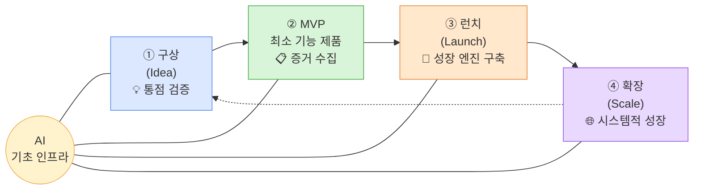
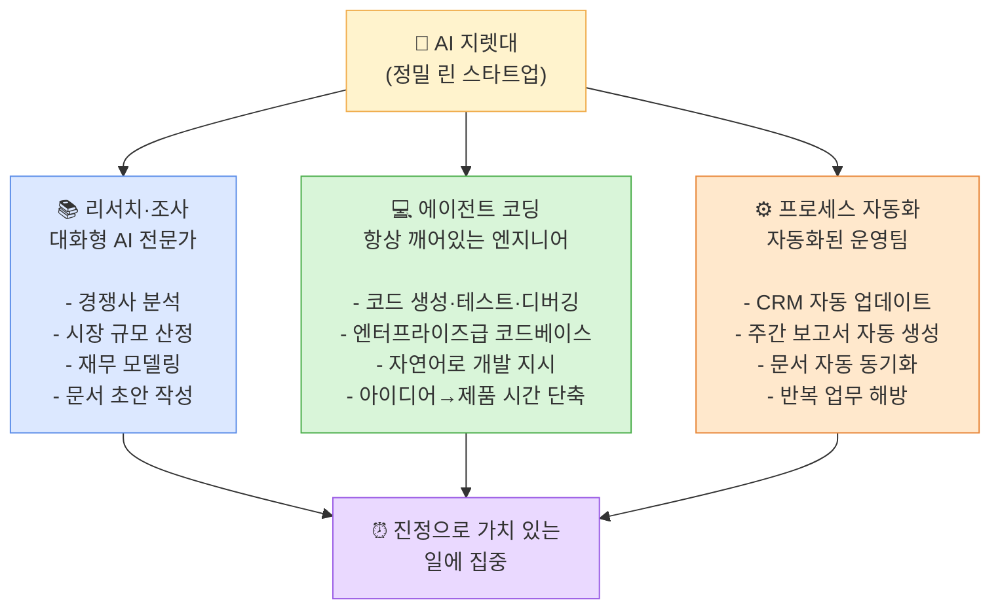
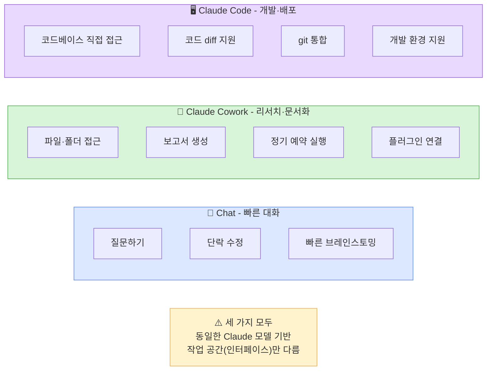
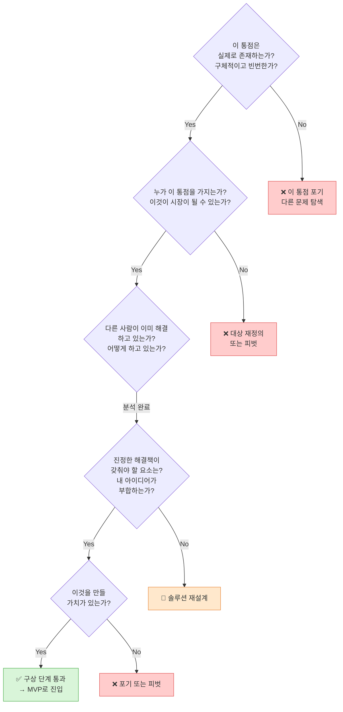
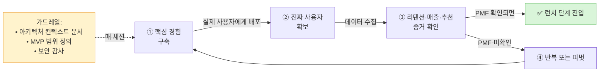
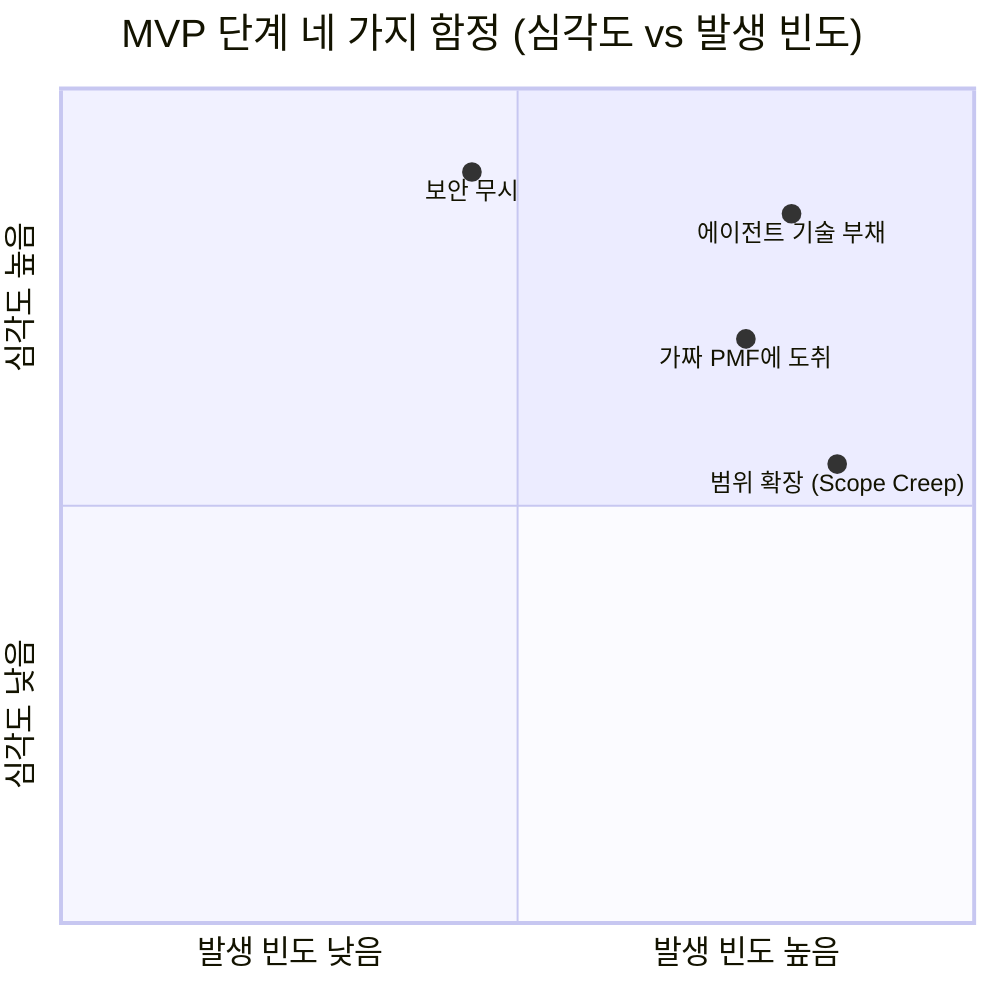
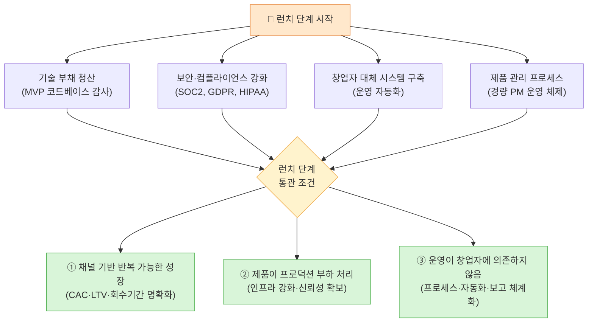
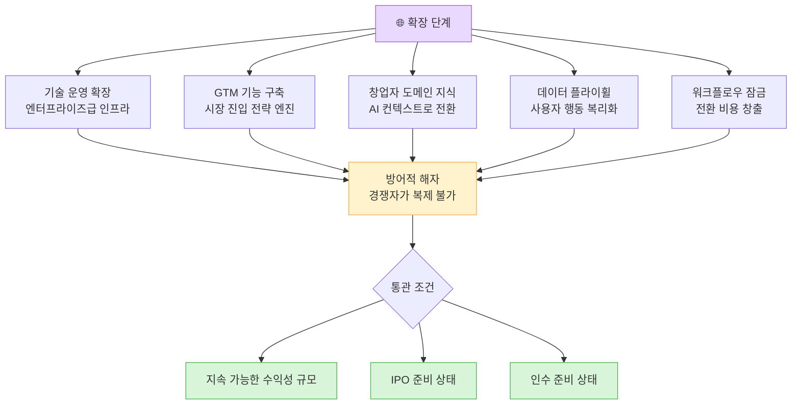
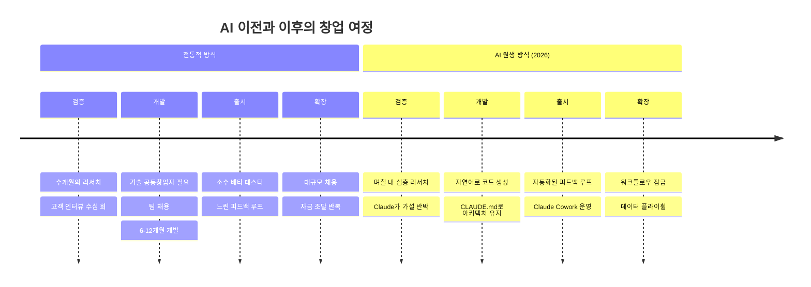

> **원문 출처:** [The Founder's Playbook: Building an AI-native startup](https://claude.com/blog/the-founders-playbook)  
> Anthropic Claude 공식 블로그 · 2026년 5월 14일 게재  
> X(트위터) 번역/소개: [@dotey](https://x.com/dotey/status/2055819034671604048)

---

## 들어가며: 왜 지금 이 플레이북인가

2026년 현재, AI는 스타트업이 탄생하는 방식 자체를 근본적으로 바꾸고 있다. 단 한 줄의 코드도 써본 적 없는 창업자가 실제로 동작하는 프로덕션 앱을 출시하고, 팀원을 채용하기도 전에 매출을 만들어내며, 반복적인 업무를 자동화하는 도구를 직접 구축한다. 창업자의 역할은 직접 실행하는 개인 기여자에서, AI 에이전트와 시스템을 지휘하는 오케스트레이터로 이동하고 있다.

Anthropic이 공개한 이 플레이북은 바로 그 변화를 정면으로 다룬다. 전통적인 스타트업 발전 경로—구상, MVP, 런치, 확장—를 AI가 핵심 인프라인 2026년의 현실에 맞게 재해석한 실전 지침서다. 실제 창업자들이 Claude를 각 단계에서 어떻게 쓰는지를 구체적인 연습 과제, 프레임워크, 프롬프트와 함께 공유한다.

이 문서는 그 플레이북의 내용을 한국어로 상세하게 풀어낸다.

---

## 1. 전체 구조: AI 원생 창업 4단계

스타트업의 여정은 변하지 않았다. 진짜 문제를 찾아내고, 그것을 해결하는 제품을 만들고, 의미 있는 회사로 키워내는 것. 바뀐 건 그 여정을 걷는 속도와 방식이다.

이 4단계 각각에서 AI는 다른 역할을 수행한다. 구상 단계에서는 리서치 파트너로, MVP에서는 엔지니어링 팀으로, 런치에서는 운영 시스템으로, 확장에서는 기업급 인프라 구축자로. 핵심은 **AI가 단순한 도구가 아니라 조직의 핵심 기초 인프라**라는 점이다.

그리고 모든 단계를 관통하는 규칙은 하나다: **"목표는 변하지 않았다. 규칙만 바뀌었다."**

---

## 2. 창업자 정의의 진화

### 기술 창업자 vs 비기술 창업자의 구분이 사라진다

과거에는 창업자의 정체성이 스킬로 정의됐다. 코드를 쓸 수 있으면 기술 창업자, 영업과 비즈니스에 강하면 비기술 창업자. 그 구분이 AI로 인해 허물어지고 있다.

공학 배경이 전혀 없는 사람도 실제 프로덕션 소프트웨어를 개발할 수 있다. 반대로 기술은 강하지만 비즈니스 감각이 없는 창업자도 시장 진입 전략(GTM), 재무 모델링, 투자자 피치덱을 AI의 도움으로 뚝딱 만들어낼 수 있다.

### 역할의 전환: 실행자에서 오케스트레이터로

역사적으로 창업자들은 실행에 막대한 시간을 쏟았다. 코드 작성, 팀 관리, 일상적인 잡무 처리. AI 원생 회사에서 창업자의 역할은 달라진다. 전문화된 AI 에이전트—문서를 읽고, 명령을 실행하고, 코드를 돌리고, 웹을 검색하는—를 지휘하는 지휘자가 된다. 덕분에 창업자의 주의와 에너지는 더 높은 수준의 작업으로 해방된다: 좋은 아이디어를 내고, 그 아이디어를 실현할 시스템(AI 에이전트, 도구, 소규모 팀)을 지휘하는 일.

### AI 원생 스타트업이 열어주는 가능성

AI를 핵심 인프라로 삼았을 때 가장 혁명적인 결과는, **업계를 아는 비기술 창업자의 완전한 해방**이다. 공학 배경을 가진 사람들만의 클럽이었던 창업의 문이 활짝 열린다. 기술 업계가 전혀 신경 쓰지 않았거나 알아채지도 못했던 실제 문제들을 해결하는 다양한 배경의 창업자들이 등장한다.

---

## 3. 정밀 린 스타트업을 위한 세 가지 AI 지렛대

AI 원생 스타트업이 전통적 스타트업과 다른 가장 큰 차이는, 처음부터 극도로 정밀하게 린(Lean)하다는 점이다. 창업자 혼자거나 서너 명의 소규모 팀이 AI를 핵심 인프라로 활용해, 팀을 늘리기 전에 제품 검증, 초기 매출, 심지어 흑자 달성까지 해낼 수 있다.

이를 가능케 하는 세 가지 AI 지렛대가 있다.

### ① 리서치·조사: 모든 분야의 상시 대기 전문가

창업 첫해에 창업자가 직면하는 수많은 과제—급여 처리 방법, 제품 개발 스프린트 계획, 투자자 메모 작성—에 대해 AI는 즉각적인 전문가 역할을 한다. 경쟁사 분석, 시장 규모 산정, 재무 모델링부터 피치덱, 투자자 메모, PRD 초안까지 처리한다. 더 나아가 악마의 변호인 역할을 자처해 사전 부검(pre-mortem)과 시나리오 플래닝까지 도와준다.

### ② 에이전트 코딩: 항상 온라인 상태인 엔지니어

과거에는 기술 공동창업자를 구하거나, 외주 개발팀을 고용하거나, 엔지니어 팀을 먹여 살릴 런웨이가 있어야만 첫 번째 프로덕션 코드를 쓸 수 있었다. 이제 에이전트 코딩 도구를 사용하면, 무엇을 원하는지 자연어로 설명하는 것만으로 AI가 엔지니어 팀의 속도와 규모로 코드를 생성, 테스트, 디버깅, 리팩터링한다.

### ③ 프로세스 자동화: 필요할 때마다 소환되는 운영팀

창업자가 리서치도 하고, 코드도 짤 수 있다 해도 잡무는 끝없이 쌓인다. 미팅 조율, CRM 업데이트, 주간 보고서 작성, 문서 최신화 유지, 콘텐츠 배포, 컴플라이언스 관리. AI 프로세스 자동화는 창업자를 이 모든 잡무에서 해방시킨다. 거래가 진전되면 CRM이 자동 업데이트되고, 한 주가 끝나면 보고서가 자동 생성되며, 제품이 변경되면 문서가 자동 동기화된다.

---

## 4. Claude 세 가지 인터페이스: 어떤 작업에 무엇을 쓸까

Anthropic은 Claude를 세 가지 인터페이스로 제공하며, 각각 다른 목적에 최적화되어 있다.

**Chat**은 현재 앱을 벗어나지 않고 빠른 소통이 필요할 때 쓴다. 긴 투자자 메모에서 핵심 문장 추출, 이사회 전 발언 검증, 팀의 긴 슬랙 메시지 요약 같은 용도다.

**Claude Cowork**는 진정으로 시간이 필요한 지식 작업—여러 소스에서 정보를 모아 논리적으로 정리하고, 문서·PPT·스프레드시트 형태의 완성된 결과물을 만드는 작업—에 적합하다. 고객 인터뷰 녹음을 주제별 분석 리포트로 정리하거나, 경쟁사 웹사이트 수십 곳을 훑어 경쟁 구도 분석을 만들거나, 매주 월요일 아침 연결된 도구에서 데이터를 가져와 KPI 요약을 자동 생성하는 것들이다.

**Claude Code**는 팀의 엔지니어를 위한 에이전트 코딩 환경이다. 코드베이스에 직접 접근하고, 플랜 모드(Plan Mode)가 있으며, git이 통합되어 있고, 로컬·IDE·샌드박스 클라우드 환경을 지원한다. 소규모 팀이 계속 커지는 코드베이스에 새 기능을 추가하고, MVP 단계의 레거시 코드를 이전하고, 신규 채용 없이도 프로토타입에서 프로덕션으로 매끄럽게 전환할 수 있게 해준다.

---

## 5. 1단계: 구상 (Idea Stage)

### 이 단계의 핵심 임무

모든 창업자는 같은 출발점에서 시작한다. 떨쳐낼 수 없는 문제 하나. 구상 단계에서 그 아이디어는 현실과 충돌한다. 2026년에 성공하려면 한 가지 절제가 필요하다: **확고한 증거 없이는 절대 개발을 시작하지 않는다는 것.**

이 단계의 핵심 임무는 깊은 리서치, 고객 발굴(customer discovery), 경쟁사 분석, 그리고 자신의 아이디어에 반하는 부정적 증거와 솔직하게 마주하는 것이다.

### 구상 단계의 통관 조건: 문제-솔루션 적합도

구상 단계를 떠나도 되는 시점은, **문제-솔루션 적합도(Problem-Solution Fit)** 를 찾았을 때다. 개발을 시작하기 전, 실제 사용자와의 소통에서 나온 정성적 증거를 통해 진짜 사람들의 진짜 통점을 해결하고 있다는 것을 확인해야 한다.

세 가지 질문에 모두 "예"라고 답할 수 있을 때 구상 단계를 떠날 수 있다.

첫째, 통점이 실제이고 구체적인가? "예"란, 누가 이 통점을 겪는지, 얼마나 자주, 얼마나 심하게 겪는지, 지금 어떻게 임시방편으로 해결하고 있는지를 정확히 말할 수 있다는 뜻이다. 둘째, 내 솔루션이 실제 통점을 해결하는가? 처음 상상한 것이 아니라, 리서치에서 발견한 진짜 통점이다. 셋째, 개발을 시작할 충분한 신호가 있는가? 100% 확실성은 불가능하지만—확실성을 기다리는 것도 실패 방식이다—MVP를 만드는 것이 맹목적 도박이 아닌 신중한 결정이 되기에 충분한 정성적 증거가 필요하다.

### 구상 단계의 세 가지 함정

**① 개발을 검증으로 착각하는 것**

기술 장벽이 사라지면서, 열정 넘치는 창업자들이 창업의 가장 중요한 단계—아이디어가 정말 사람들이 필요로 하고 사용할 솔루션인지 검증하는 것—를 건너뛰기 쉬워졌다. 에이전트 코딩 이전에도 42%의 스타트업이 "아무도 원하지 않는 것을 만들어서" 실패했다. Claude Code 같은 에이전트 코딩 솔루션이 아이디어에서 제품까지의 거리를 대폭 단축하면서, 이 실패율은 더 높아질 수 있다. 동작하는 프로토타입은 실제 문제를 해결한다는 착각을 만들 뿐이다. 프로토타입의 진짜 역할은 잠재 고객과 대화할 때 압력 테스트 도구로 쓰는 것이다.

**② 너무 이른 확장**

검증되지 않은 길에서 과속하는 것. AI 시대에 창업자들은 모르는 사이에 이 함정에 빠지기 더 쉽다. 에이전트 코딩 도구가 워낙 강력해서, 시장 적합도를 검증하지도 않은 채 실행 규모를 맹목적으로 키우게 된다.

**③ 객관성 상실: AI를 확증 편향의 연구 엔진으로 만들기**

AI 도구로 이미 굳게 믿는 주장을 지지하는 증거를 찾으라고 시키면, AI는 반드시 찾아낸다. AI는 창업자가 시키는 대로 간다. 의미하는 바는, 날카로운 질문 없이는 창업자가 형편없는 아이디어를 위해 마치 철저히 조사된 것처럼 보이는 사업 논리를 그 어느 때보다 쉽게 포장할 수 있다는 것이다. 해결책은 같은 도구를 거꾸로 쓰는 것이다: AI는 아이디어를 증명할 때만큼이나 열심히 아이디어를 반박하는 작업도 해준다.

### 구상 단계에서 Claude 활용법

**문제 가설 검증:** Claude와 함께 문제 진술을 가다듬어 테스트 가능한 가설로 만들어야 한다. "계약서 검토가 너무 느리다"는 테스트할 수 없다. "중간 규모 기업의 사내 법무팀이 계약 검토 주기마다 3일 이상을 소비하는 이유는, 버전 관리 문서가 아닌 이메일 레드라인 왕복에 의존하기 때문이다"는 테스트할 수 있다.

그런 다음, Claude에게 아이디어에 반하는 부정적 증거—부정적 시장 신호, 실패한 경쟁사, 잠재적 고객 행동 패턴, 낙관적일 때 무시하기 쉬운 구조적 장벽—를 찾으라고 시킨다. 결과적으로, 고객 조사를 시작하기 전부터 가설이 가장 강력한 반론의 포화를 맞게 된다.

**경쟁사 분석:** '경쟁사 맹점(competitor neglect)'—창업자가 같은 분야 다른 사람들의 노력을 습관적으로 과소평가하는 현상—을 극복하기 위해 Claude에게 경쟁사 입장에서 왜 그들이 성공하고 자신은 실패할지 가장 강력한 논거를 제시하라고 시킨다. 직접 경쟁사, 간접 경쟁사, 잠재 인수자, 언제든 뛰어들 수 있는 주변 플레이어로 분류하고, 각각이 왜 실질적인 생존 위협인지를 분석한다.

**고객 발굴 계획:** 정확한 목표 사용자 프로필이 긴 연락처 목록보다 훨씬 가치 있다. 직책, 회사 유형, 팀 구조, 통점이 가장 심한 직급까지 구체화하고, Claude를 활용해 올바른 시점에 올바른 질문을 하는 인터뷰 프레임워크를 구축한다. 초보 창업자가 가장 자주 범하는 실수가 있다. "이런 제품을 사용하시겠어요?"처럼 미래 지향적이고 열린 질문을 던지는 것, "지난번에 이 문제가 생겼을 때 어떻게 하셨나요?"처럼 관련된 과거를 정확하게 탐색하는 것이 아니라.

**경량 프로토타입 제작:** 검증된 가설과 반복적으로 압력 테스트를 거친 솔루션 개념을 갖춘 후에야 무언가를 만들기 시작한다. 이 시점에 Claude Code가 등장한다. 이것은 완전한 제품이 아니다. 고객과 투자자에게 보여주기 위한 솔루션의 '경험 샘플'이다. 실제 사용자가 눈에 보이고 만질 수 있는 것과 상호작용하게 하면, 10번의 통점 발굴 인터뷰보다 훨씬 많은 인텔리전스를 가져다준다.

---

## 6. 2단계: MVP (Minimum Viable Product)

### MVP 단계의 본질: 증거 수집

많은 창업자가 MVP 단계를 순수한 건설 기간으로 보지만, 본질적으로는 여전히 '증거 수집' 연습이다. 이제 수집하는 것은 통점 공간에 대한 증거가 아니라, 솔루션에 대한 증거다. 즉, 내 제품이 충분히 가치 있어서 계속 사용하고(리텐션), 돈을 내고(매출), 추천할 의향이 있는 특정 사람들의 명확한 그룹이 존재하는가에 대한 증거.

### MVP 단계의 목표

AI 원생 스타트업 창업자로서, 목표는 검증된 통점을 실제 사용자가 실제로 사용하는 작동하는 제품으로 전환하는 것이다. 로드맵에 있는 모든 기능을 담을 필요는 없다. 핵심 경험만 최소한으로 집중적으로 제공하면 된다.

동시에, MVP 단계에는 동등하게 중요한 두 번째 목표가 있다. 빠르게 움직이면서도, 의미 있는 수의 실제 사용자가 유입되면 반드시 갚아야 하는 종류의 '기술 부채'를 쌓지 않는 것이다.

### MVP 단계의 네 가지 함정

**① 에이전트 기술 부채 (Agentic Technical Debt)**

AI가 코드 배포를 가로막는 모든 자연적 병목을 거의 제거했기 때문에, '속도'는 보장된다. 하지만 창업자가 속도만을 MVP 구축의 유일한 변수로 삼으면, 갚기 매우 어려운 기술 부채가 쌓인다. AI 기술 부채는 복리로 불어난다. 잘 작성된 규격과 아키텍처 제약이 없으면, AI는 매 세션마다 기저 논리를 처음부터 역추론하고, 이 결정들은 필연적으로 표류하게 된다. 결국 영혼도 프레임워크도 없는 코드베이스가 만들어진다—코드 조각들이 애초에 서로 맞도록 의도되지 않았기 때문에.

**② 가짜 PMF에 도취**

AI 도구들은 매우 인상적인 초기 지표를 만들어낼 수 있다. 하지만 그것이 시장이 제품을 실제로 필요로 한다는 의미는 아니다. 제품 출시 초기의 열기는 일반적으로 찰나적인 힘에 기반한다—창업자의 지인들, 투자자들이 데려온 잠재 구매자들, 해커뉴스에 우연히 오른 것. 6주나 12주 후 초기 열기가 사라지고 나면, 이것들은 이후를 안정적으로 예측하지 못한다.

**③ 범위 확장 (Scope Creep)**

개발 코드가 완전히 손쉽고 거의 비용이 들지 않게 되면서, "또 하나의 기능을 추가해도 괜찮겠지"라고 느끼게 된다. 과거에는 이런 충동을 막아주는 강제 브레이크—실질적인 엔지니어링 시간 비용—가 있었다. 이제 그 저항이 사라졌다. 처방책은 개발을 시작하기 전에 범위 정의를 문서화하는 것이다: 이 제품이 하는 것, 절대로 하지 않는 것, 새로운 기능을 추가할 자격을 주는 구체적인 사용자 증거.

**④ 보안 무시**

AI 도구로 앱을 급하게 시장에 출시하면서 기본 보안 원칙을 이해하지 못한 창업자들은 결국 사용자를 완전히 예방 가능한 위험에 노출시킨다. 에이전트 코딩 도구는 '동작하는' 코드를 생성하지, '타고나게 안전한' 코드를 생성하는 것이 아니다. 실제 사용자에게 MVP를 배포하기 전 보안 검토는, 대중에 대한 최소한의 책임이다.

### MVP 단계에서 Claude 활용법

**개발 전 아키텍처 정의:** Claude Code에 첫 번째 프로덕션 코드를 작성시키기 전에, Claude를 활용해 이 단계에서 따라야 할 아키텍처 결정을 정의하고 문서화한다. 어떤 패턴을 따를지, 어떤 의존성을 피할지, 어떤 트레이드오프를 했는지, 그 이유는 무엇인지. 이 결과물은 핵심 아키텍처 컨텍스트 문서가 되어 Claude Code의 런타임 가드레일 역할을 한다.

이를 `CLAUDE.md` 마크다운 파일로 저장한다. 이 파일은 Claude Code에게 주는 프로젝트 수준 지시사항으로, 해당 디렉토리에서 실행하면 에이전트 SDK가 자동으로 읽는다. 기능적으로, 이것은 프로젝트의 영구 '기억'이다.

**MVP 범위 엄격히 집행:** 범위가 없는 확장은 AI 시대 MVP의 가장 대표적인 실패 패턴이다. 아키텍처를 정의하고 문서화해야 하는 것처럼, 어떤 기능도 쓰기 전에 MVP 범위를 정의해야 한다.

**데이터 지표 프레임워크 사전 구축:** PMF를 초기 트래픽으로 착각하는 창업자들은 보통 출시 후에야 지표를 보기 시작하고, 선택한 지표도 "우리가 잘하고 있다"를 증명하기 위한 것이지 "무엇이 잘못됐는지"를 발견하기 위한 것이 아니다. 처방책은 첫 번째 사용자가 나타나기 전에 측정 프레임워크를 수립하는 것이다.

**PMF를 판단하는 두 가지 테스트:**

숀 엘리스 테스트(The Sean Ellis Test): 활성 사용자에게 "만약 앞으로 이 제품을 더 이상 사용할 수 없게 된다면 어떻게 느끼시겠습니까?"라고 묻는다. 40% 이상이 "매우 실망스럽다"고 답한다면, 이것은 의미 있는 PMF 지표다.

노력 강도 테스트: PMF 이전에는 리텐션을 유지하기 위해 지속적인 개입이 필요하다—자주 접촉하고, 인센티브를 제공하고, 개인적으로 팔로업하고, 창업자의 막대한 에너지가 있어야 사용자 참여가 유지된다. PMF 이후에는 제품 자체가 이 일을 한다. 자신이 '밀고' 있던 것에서 시장이 '당기는' 것으로 바뀔 때, 이것은 무언가 진짜가 달라졌다는 가장 명확한 신호 중 하나다.

---

## 7. 3단계: 런치 (Launch Stage)

### 런치 단계의 패러다임 전환

MVP 단계가 제품이 존재할 가치가 있다는 것을 증명하는 것이라면, 런치 단계는 기업이 성장할 가치가 있다는 것을 증명하는 것이다. 초기 모멘텀을 반복 가능하고 지속 가능한 성장 엔진으로 전환해야 한다.

### 런치 단계의 통관 조건

세 가지 요소가 모두 충족되어야 런치 단계를 떠날 수 있다.

**첫째, 성장이 반복 가능하고 채널 기반이다.** 사용자를 유지할 뿐 아니라, 특정 채널을 통해 예측 가능하게 획득한다. 단위 경제학이 명확하다: 고객 획득 비용(CAC), 고객 생애 가치(LTV), 투자 회수 기간이 알고 있고 설명할 수 있는 숫자들이다.

**둘째, 제품이 프로덕션 부하를 처리한다.** 인프라가 강화되고, 보안과 컴플라이언스 정비가 완료되며, 자신이 테스트한 조건뿐만 아니라 실제 프로덕션 조건에서 신뢰성이 유지된다.

**셋째, 운영이 더 이상 창업자에 의해 막히지 않는다.** 프로세스가 존재하고, 자동화가 완료되어 있다. 자신이 직접 지원을 처리하고, 작업을 분배하고, 스프린트를 계획하고, 보고서를 작성하는 사람이 아니다.

### 런치 단계의 주요 함정

**기술 부채 만기 도래:** MVP 코드베이스는 제품이 작동함을 증명하기에 충분히 잘 돌아갔지만, 프로덕션 트래픽과 새 기능, 증가하는 복잡성이 이제 그 지름길들을 드러낸다.

**창업자가 최대 병목이 되는 것:** MVP 단계에서 직접 모든 것을 챙기는 것은 자산이었다. 런치 단계에서는 고객 서비스 요청이 늘고, 제품 결정이 쌓이고, 운영 복잡성이 배가되면서, 같은 본능이 오히려 제약이 된다. 이 단계에서의 가장 어려운 전환 중 하나가, 구체적인 일을 직접 실행하는 것에서 일을 실행할 수 있는 시스템을 설계하는 것으로의 이동이다.

**보안·컴플라이언스 대응 불가:** MVP에서 보안과 컴플라이언스 조치를 단순하게 유지하는 것은 괜찮았다. 이제 실제 사용자, 실제 데이터가 있고, 테이블 위에는 엔터프라이즈 계약서도 놓여있을 수 있다. 그것이 부채가 된다.

### 런치 단계에서 Claude 활용법

**기술 부채 조기 청산:** Claude Code를 활용해 코드베이스의 구조적 약점, 유지 비용이 높은 지름길, 테스트 커버리지가 취약한 부분을 찾아내는 전면적인 아키텍처 감사를 실시한다. 그 결과를 Claude에게 먹여 수정 우선순위를 정한다. MVP 단계에서 내렸지만 미처 적어두지 못한 아키텍처 결정들을 지금 CLAUDE.md에 문서화한다.

**창업자 주의를 대체하는 시스템 구축:** Claude Cowork를 활용해 현재 운영 부하를 구조화해 감사한다—모든 반복 작업, 창업자 책상에 떨어지는 모든 결정, 창업자가 직접 기억할 때만 발생하는 모든 프로세스. 그런 다음 이것들을 세 범주로 분류한다: 완전히 자동화 가능한 것, 사람의 개입이 필요하지만 반드시 창업자일 필요는 없는 것, 그리고 진정으로 창업자의 판단이 필요한 것.

**경량 제품 관리 운영 체제 도입:** 런치 단계는 창업자 개입 없이 트리거되거나 실행될 수 있는 경량의 반복 가능한 프로세스가 필요하다. Claude를 활용해 제품 일정과 작업 주기 구조를 설계하고, Claude Cowork를 활용해 운영 레이어를 구축하고 실행한다.

---

## 8. 4단계: 확장 (Scale Stage)

### 확장 단계의 패러다임

확장 단계에서 창업자의 역할은 빌더에서 공공 임원으로 전환된다. 제품은 여전히 핵심이지만, 창업자 개인의 일상 업무는 점점 더 회사 자체의 운영에 관한 것이 된다.

AI 원생 스타트업에게 확장 단계의 목표는 명확한 방향으로 계속 구축함으로써 **누적된 깊이를 통한 방어적 해자(moat)를 구축**하는 것이다. 이 깊이는 제품에 주입된 전문 지식, 사용자들이 의존하는 다른 도구나 플랫폼과의 깊은 통합, 독점적인 시스템 데이터와 비즈니스 흐름에서 나온다.

### 확장 단계의 통관 조건

확장 단계의 출구 조건은 단일 이정표가 아닌 문턱 이벤트다: 창업자가 점점 더 일상 운영을 직접 관리하지 않아도 회사가 지속 가능하게 운영된다는 것. 시스템적 성장을 증명했고, 가장 까다로운 외부 감사관의 요구를 충족하는 조직 거버넌스와 컴플라이언스 인프라를 구축했으며, "자금력이 풍부한 기존 거대 기업이 오늘 제품을 복제한다면, 사용자들이 남을 것인가?"라는 질문에 확고한 답을 줄 수 있다.

실제로 이 문턱은 세 가지 형태 중 하나를 취한다: 외부 자금 없이 지속 가능한 수익성 규모 달성, IPO 준비 상태, 또는 인수 가능 상태.

### 확장 단계의 핵심 전략

**① 운영 레이어 위임**

확장 단계의 운영 시스템은 모니터링 없이 신뢰성 있게 실행되어야 한다. 런치 단계의 작업이 시스템을 만드는 것이었다면, 확장 단계는 그 시스템이 완전히 신뢰할 수 있을 때까지 성숙시키고, 그런 다음 정말로 신뢰하는 것이다.

**② GTM(시장 진입) 기능 구축**

유기적 성장에는 한계가 있고, 대부분의 확장 단계 창업자들은 진정한 GTM 기능을 구축하기 전에 그 한계에 부딪힌다. 징후에는 사용자 곡선이 평평해지고, 고객 획득 비용이 오르고, 창업자가 직접 개입할 때만 파이프라인이 움직이는 것이 포함된다.

Claude는 GTM 무기고를 처음부터 구축하는 것을 도울 수 있다: 세분 시장, 메시지 아키텍처, 애널리스트 관계 전략, 세일즈 런북, 그리고 공개 투자자·기업 구매자·월가 애널리스트를 대면할 때 매우 중요한 투자자 내러티브.

**③ 도메인 전문 지식을 AI 컨텍스트로 전환**

많은 초정밀 스타트업 창업자들은 직접 경험했거나 관찰한 특정 도메인 내의 실제 통점을 위한 고도로 특화된 앱이나 도구를 구축한다. Claude를 통해 창업자의 경험을 포착하고 정리하며 추출해, 그 전문 지식을 제품이 접근할 수 있는 곳에 배치한다. 업계 용어, 규정 준수 함정, 극단적 엣지 케이스, 사용자의 좌절감, 겉보기에 단순해 보이는 답이 왜 작동하지 않는지를 구조화된 검색 가능한 컨텍스트로 변환한다.

**④ 데이터 플라이휠: 복리화 방어 우위**

사용자들이 제품 내에서 상호작용할 때, 그들은 행동 신호(어떤 출력을 수락했고 거부했는지)를 남긴다. 이것이 제품 로드맵을 직접 안내한다. 시간이 지남에 따라, 특정 사용자 세그먼트의 독특한 패턴, 선호도, 극단적 사용법을 숙지하게 된다. 이것이 복리 가치다: 각 최적화가 제품을 더 유용하게 만들고, 이것이 더 많은 사용을 유도하고, 더 많은 피드백을 만들고, 더 많은 최적화를 이끈다. 이 데이터는 시간에 잠겨 있고 맥락에 매우 특화되어 있어, 복제자들이 절대 재현할 수 없다.

**⑤ 워크플로우 잠금(Workflow Lock-in) 구축**

복리 데이터 네트워크 효과가 제품을 복제하기 어렵게 만든다면, 사용자 수준의 워크플로우 잠금은 제품을 포기하기 어렵게 만든다. 사용자들이 일상 운영에서 제품을 실행하는 시간이 길어질수록, 그것은 실제 업무 방식에 더 깊이 내장된다. 그들은 제품 위에 자동화를 구축하고, 팀을 훈련시키는 데 비용을 지출하고, 데이터 소스와 다른 도구들을 연결했다. 이 시점에서 전환은 단순히 소프트웨어를 교체하는 것에서 대규모 시스템 운영 수술로 바뀐다.

---

## 9. 실전 사례: AI 원생 스타트업들의 성공 스토리

Anthropic이 소개한 실제 사례들을 통해, 이 플레이북이 어떻게 적용되는지 확인할 수 있다.

**HumanLayer, Ambral, Vulcan Technologies (YC 스타트업들):** Claude Code를 활용해 프로토타입을 시장에 급속히 배포하고, 에이전트 코딩 워크플로우를 통해 AI 플랫폼을 확장했다.

**GC AI:** 도메인 전문성과 Claude를 결합해 반응형 법무 플랫폼을 구축했다. 사내 통제 매뉴얼 이해, 부서간 이해관계자 관리, 가변적 리스크 허용도 조정 같은 법무팀의 실제 통점을 다뤘다.

**Carta Healthcare:** Claude 기반의 임상 추출 플랫폼으로 연간 22,000건의 수술 케이스를 처리하면서 데이터 추출 시간을 66% 단축했다.

**Anything:** 150만 명의 비개발자 사용자가 머릿속 아이디어를 실제 소프트웨어로 만들 수 있게 도왔다. 기술 배경이 전혀 없는 창업자도 완전한 채용 플랫폼을 구축하고 수익화하는 것이 가능했다.

**Kindora:** 비영리 단체 임원이 직접 Claude Sonnet을 활용해 기부자와 수혜자를 지능적으로 매칭하는 플랫폼을 구축했다. 수천 개의 매칭 가능 대상에서 실제 가능성 있는 극소수만 필터링하고, MCP 커넥터를 통해 비영리 단체들이 Claude 인터페이스 내에서 바로 사용할 수 있게 했다.

**Wordsmith:** 변호사 출신 CTO가 창업해, 사내 법무팀을 위한 AI 기반 법무 기술을 개발했다. Claude가 핵심 추론 레이어를 담당하고, 스타트업의 개발팀 자체도 Claude Code를 통해 플랫폼을 구축하고 개발했다.

---

## 10. 핵심 통찰: 무엇이 달라졌는가

플레이북이 주는 핵심 메시지는 명확하다.

**목표는 변하지 않았다.** 실제 통점을 찾고, 그것을 해결하는 제품을 만들고, 의미 있는 회사로 키우는 것. 변한 것은 그 목적지에 이르는 경로다.

**시간 압축이 일어났다.** 구상에서 확장까지 이 4단계에서, AI는 과거 '분기' 단위로 측정되던 주기를 '주' 단위로 압축했다. 검증 루프를 돌리는 데 수개월이 필요했던 것이 이제 몇 번의 오후면 된다. 동작하는 프로토타입을 만드는 데 기술에 능통한 공동창업자가 필요하지 않다. 출시 전의 혼돈스러운 스프린트가 연속적인 워크플로우 작업으로 압축된다.

**병목이 이동했다.** 오늘날 병목은 더 이상 "무엇을 만들 수 있느냐"가 아니다. "무엇을 만들기로 선택하느냐"에 달려 있다.

이것이 AI 원생 창업자에게 부여된 진짜 과제다: 압도적으로 빨라진 실행 속도에서 옳은 방향을 선택하는 판단력.

---

## 참고 자료

- [원문 플레이북 (PDF)](https://cdn.prod.website-files.com/6889473510b50328dbb70ae6/69fe2a55b93bb0732b1fe33c_The-Founders-Playbook-05062026_v3%20(1).pdf) — Anthropic, 2026년 5월
- [Anthropic 스타트업 프로그램](https://claude.com/programs/startups) — VC 파트너사와 협업하는 스타트업 대상 무료 API 크레딧 및 특별 지원
- [Claude Code 공식 문서](https://platform.claude.com/docs) — 설치부터 복잡한 에이전트 워크플로우까지
- [Claude Cowork](https://claude.com/product/cowork) — 팀 운영을 위한 Claude 워크스페이스
- [Claude 커뮤니티](https://claude.com/community) — 개발자·빌더를 위한 토론 포럼

---

*작성일: 2026년 5월 17일*  
*원본 출처: Anthropic Claude 공식 블로그 (2026.05.14)*
