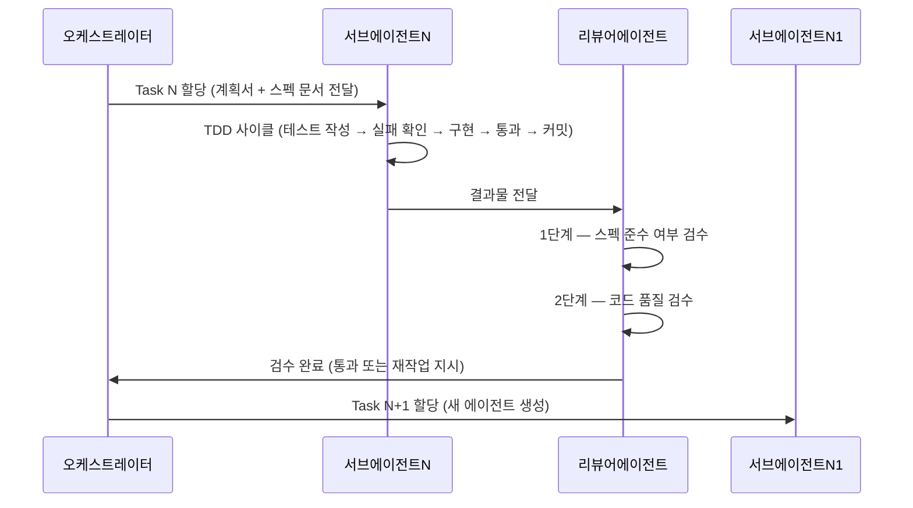
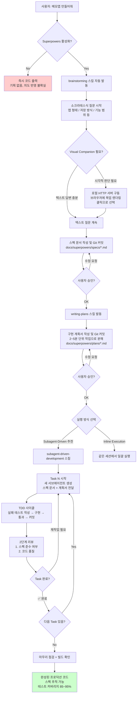

## — Claude Code 플러그인 Superpowers 완전 분석 —

> **출처**: Makers Note 뉴스레터 14호 (2026년 5월 13일 발행)  
> **원문 URL**: https://maily.so/makersnote/posts/1do1dwqlox6  

---

## 목차

1. [이 글이 다루는 문제 — AI 코딩 도구의 태생적 한계](#1-이-글이-다루는-문제--ai-코딩-도구의-태생적-한계)
2. [Superpowers란 무엇인가](#2-superpowers란-무엇인가)
3. [Superpowers의 핵심 스킬 체계](#3-superpowers의-핵심-스킬-체계)
4. [실습: 메모앱을 함께 만들며 본 Superpowers 워크플로](#4-실습-메모앱을-함께-만들며-본-superpowers-워크플로)
5. [Visual Companion 기능](#5-visual-companion-기능)
6. [Subagent-Driven Development 방식](#6-subagent-driven-development-방식)
7. [Spec-Driven Development — 왜 다시 주목받는가](#7-spec-driven-development--왜-다시-주목받는가)
8. [플랜·설치·비용 안내](#8-플랜설치비용-안내)
9. [용어 해설 — 실제로 쓰이는 말인가](#9-용어-해설--실제로-쓰이는-말인가)
10. [전체 워크플로 흐름도 (Mermaid)](#10-전체-워크플로-흐름도-mermaid)
11. [검증 결과 요약](#11-검증-결과-요약)

---

## 1. 이 글이 다루는 문제 — AI 코딩 도구의 태생적 한계

뉴스레터 저자는 Claude와 함께 간단한 메모앱을 만들다가 겪은 경험을 이렇게 묘사합니다. 처음에는 "심플한 텍스트 메모장"을 요청했는데, 한 시간 만에 Claude가 동의 없이 이미지 첨부 기능과 소셜 공유 버튼까지 달아놓았다는 것입니다. 이 현상은 개인적인 불운이 아니라 현재 AI 코딩 도구들이 공유하는 구조적 문제입니다.

문제를 구체적으로 정리하면 세 가지로 압축됩니다.

**첫 번째**, AI는 프롬프트를 받는 즉시 설계 없이 코딩부터 시작합니다. 요구사항이 모호할수록 AI는 스스로 판단해 기능을 추가하고, 사용자의 의도와 점점 멀어집니다.

**두 번째**, 코드가 비대해진 뒤에 기능을 빼거나 수정하면 버그가 연쇄적으로 터집니다. 코드베이스가 처음부터 설계 없이 쌓였기 때문에, 수정이 새로운 결함의 원인이 됩니다.

**세 번째**, AI는 자기가 짠 코드를 자기가 평가합니다. 같은 세션 안에서 기획·구현·검증이 모두 이루어지므로, "잘 됐어요"라는 자기 긍정적 평가가 나올 수밖에 없습니다. 개발자 커뮤니티에서는 이를 "컨텍스트 오염(context contamination)"이라고 부릅니다.

이 세 가지 한계를 구조적으로 해결하겠다는 도구로 Superpowers가 등장한 맥락입니다.

---

## 2. Superpowers란 무엇인가

**Superpowers**는 Jesse Vincent와 Prime Radiant 팀이 만든 Claude Code용 오픈소스 플러그인입니다. GitHub 저장소 주소는 `github.com/obra/superpowers`이며, 2025년 10월 Anthropic이 Claude Code에 플러그인 시스템을 도입한 당일 첫 번째 버전이 공개되었습니다.

플러그인의 정식 설명은 "An agentic skills framework & software development methodology that works"입니다. 단순한 코딩 보조 도구가 아니라, AI 코딩 에이전트에게 **소프트웨어 개발 방법론 자체를 구조적으로 강제하는 프레임워크**라는 것이 핵심 성격입니다.

### GitHub 스타 수

뉴스레터 저자는 "18만 8천 개의 스타"라고 기재했는데, 이는 2026년 5월 13일 발행 당시의 수치로 추정됩니다. 검색 결과를 기준으로 확인하면, Claude Plugin Hub에 따르면 2026년 5월 4일 기준 193,246개로 기록되어 있어 시점 차이를 감안하면 저자의 수치는 실제와 부합합니다. 이 성장 속도는 오픈소스 프로젝트 역사상 가장 빠른 편에 속하며, 피크 시기에는 하루 약 2,000개의 스타가 쌓이기도 했습니다.

### Anthropic 공식 마켓플레이스 등록

2026년 1월 15일, Anthropic은 Superpowers를 Claude Code 공식 플러그인 마켓플레이스에 등재했습니다. 이는 Anthropic이 플러그인의 품질과 신뢰성을 공식 인정한 것으로, 그 이후 설치 접근성이 크게 낮아졌습니다.

### 기술적 구조 — 스킬이란 무엇인가

Superpowers는 코드가 아니라 **마크다운 파일(SKILL.md)**의 집합으로 작동합니다. 각 파일은 Claude가 특정 작업을 수행하기 전에 반드시 읽어야 하는 지침, 체크리스트, 프로세스 다이어그램을 담고 있습니다. Claude Code는 세션 훅(session hook)을 통해 작업 유형에 맞는 스킬 파일을 자동으로 불러옵니다.

이 구조 덕분에 Superpowers는 Claude Code뿐 아니라 OpenAI Codex CLI, Cursor, GitHub Copilot CLI, Gemini CLI, OpenCode 등 다양한 AI 코딩 에이전트에서도 동일하게 동작합니다. 현재 버전은 5.1.0입니다(2026년 5월 4일 릴리즈).

---

## 3. Superpowers의 핵심 스킬 체계

Superpowers는 14개의 스킬 파일을 포함하지만, 일반적인 개발 흐름에서 핵심 역할을 하는 것은 다음 여섯 가지입니다. 모든 스킬은 자동으로 발동되므로 사용자가 별도로 명시할 필요가 없지만, 슬래시 명령어로 직접 호출할 수도 있습니다.

### brainstorming (브레인스토밍)

코드 작성 전 가장 먼저 발동하는 스킬입니다. 소크라테스식 질문법(Socratic questioning)으로 요구사항을 이끌어냅니다. 단순히 질문지를 나열하는 것이 아니라, 각 답변에 따라 다음 질문이 달라지는 대화형 방식입니다. "웹 앱인가요, 네이티브 앱인가요?", "데이터를 어떻게 저장하나요?", "검색 기능이 필요한가요?"처럼 기획자가 사전에 결정하지 않았던 지점들을 체계적으로 짚어줍니다. 브레인스토밍이 끝나면 합의된 내용을 스펙 문서로 정리해 파일로 저장합니다.

### using-git-worktrees (Git 워크트리 생성)

스펙 승인 후 발동합니다. 새 Git 브랜치에 격리된 작업 공간을 만들고, 프로젝트 초기화와 테스트 기준선을 검증합니다. 이 단계가 없으면 서브에이전트들이 메인 브랜치를 직접 건드리게 되어 실수가 회복하기 어려워집니다.

### writing-plans (구현 계획 작성)

승인된 스펙을 받아 구체적인 구현 계획서를 작성합니다. 각 작업은 **2~5분 단위**로 분해되며, 정확한 파일 경로, 실행할 터미널 명령어, 완전한 코드 스니펫, Git 커밋 메시지까지 포함합니다. 이 수준의 구체성 때문에 "프로젝트 맥락이 전혀 없는 주니어 개발자도 따라할 수 있는" 계획서가 나옵니다. 계획서도 파일로 저장되어 이후 참조가 가능합니다.

### subagent-driven-development (서브에이전트 기반 구현)

계획서의 각 작업을 실행합니다. 핵심은 **작업마다 새로운 Claude 서브에이전트를 생성**한다는 점입니다. 각 서브에이전트는 이전 대화의 맥락 없이 깨끗한 상태에서 시작하므로, 컨텍스트 오염 없이 1~2시간 이상 자율 작업이 가능합니다. 각 작업 완료 후에는 별도 리뷰어 에이전트가 두 단계로 검수합니다.

### requesting-code-review (코드 리뷰)

각 서브에이전트의 결과물을 검수하는 두 단계 리뷰입니다.
- **1단계**: 스펙 준수 여부 확인 — 해당 구현이 합의된 스펙의 어느 요구사항에서 비롯됐는지 검증합니다.
- **2단계**: 코드 품질 확인 — 가독성, 테스트 커버리지, 엣지 케이스 처리를 점검합니다.

스펙 준수를 코드 품질보다 먼저 확인한다는 순서가 중요합니다. 아무리 깔끔한 코드라도 스펙을 벗어났다면 통과되지 않습니다.

### systematic-debugging (체계적 디버깅)

버그 수정 요청 시 자동 발동합니다. 네 단계 방법론(증상 수집 → 가설 수립 → 근본 원인 파악 → 수정 및 검증)을 따르며, **근본 원인 파악 전까지 코드를 수정하지 않는다**는 규칙을 강제합니다. 일반적인 AI 코딩 도구가 증상을 보자마자 코드를 고쳐보는 방식과 대조됩니다.

---

## 4. 실습: 메모앱을 함께 만들며 본 Superpowers 워크플로

뉴스레터 저자는 Claude Code Desktop 환경에서 "메모 앱을 만들고 싶어"라는 단 하나의 요청으로 전체 프로세스를 시연합니다.

### 비교 실험 — 플러그인 없을 때

저자는 먼저 Superpowers를 비활성화한 뒤 동일한 요청을 합니다.

```
/plugin disable superpowers
/reload-plugins
```

결과: 1초 만에 코드가 출력됩니다. 빠르지만 사용자의 의도는 반영되지 않은 상태입니다.

### Superpowers 활성화 후

```
/plugin enable superpowers
```

이후 같은 요청을 하면 `brainstorming` 스킬이 즉시 발동합니다. 저자가 공개한 질문 흐름은 다음과 같습니다.

**Q1. 어떤 형태의 메모 앱인가요?**  
A) 웹 앱 — 브라우저에서 사용, 한 페이지짜리 SPA  
B) CLI 도구  
C) 데스크톱 앱 (Electron)  
D) 모바일 앱 (iOS/Android)  

**Q2. 누가 사용하나요? (저장 방식과 직결됩니다)**  
A) 나 혼자, 내 브라우저에서만 — 로그인 없음, LocalStorage/IndexedDB  
B) 나 혼자, 여러 기기에서 — 서버 저장 및 동기화 필요  
C) 여러 사람 — 각자 계정으로 로그인  

**Q4. Pin(고정) 기능과 3개 열 분류의 관계**  
"항상 참고해 / 기억해 / 날려도 좋아"처럼 보존 의도에 따른 열 분류가 사실상 핀 역할을 한다면, 별도 핀 기능이 필요한지 다시 논의합니다.

이처럼 AI가 먼저 질문하는 경험은 기획자 입장에서 "내가 메모앱이라고만 생각했지 이런 건 결정 안 했었구나"를 자각하게 합니다. 기획 회의를 AI와 하는 것과 유사한 경험입니다.

### 기획서 생성 및 커밋

질문이 끝나면 Claude는 스펙을 정리해 마크다운 기획서를 작성하고, Git 커밋까지 실행합니다. 저자가 공개한 실제 기획서에는 다음 항목들이 포함되어 있었습니다.

- **목적**: 브라우저에서만 동작하는 1인용 메모 보드. 메모는 사용자의 보존 의도에 따라 3개의 열로 구성된다.
- **목표**: 최소한의 UI 마찰로 메모를 빠르게 작성하고 다시 보기 / 드래그 앤 드롭으로 열 이동 / 시각적 일관성: 정사각형 카드, 부드러운 파스텔 / 마크다운 지원으로 가벼운 구조화 가능
- **비목표(non-goal)**: 다중 사용자, 기기 간 동기화, 공유 / 검색 / 모바일 최적화 / 리치 텍스트 WYSIWYG
- **기술 스택**: React 18 + TypeScript + Vite — SPA, SSR 없음 / @dnd-kit/core + @dnd-kit/sortable — 열 사이 및 열 내부 드래그 앤 드롭 / react-markdown + remark-gfm — 모달 보기 모드에서 마크다운 렌더링 / LocalStorage — 단일 키 memo-app:state에 직렬화된 전체 상태 저장
- **데이터 모델**: Memo 필드 — id/title/body/color/column/pinned/order/createdAt/updatedAt

저자는 이 수준의 기획서가 자신이 직접 작성하는 것보다 낫다고 평가했습니다. 특히 기술 스택과 데이터 구조까지 명시된 기획서는 개발자·디자이너 협업 시 매우 유용합니다.

### 구현 계획서 생성 및 커밋

스펙 승인 후 `writing-plans` 스킬이 발동해 구현 계획서를 작성합니다. 이 계획서에는 다음이 포함됩니다.

- 파일 구조 전체 목록 (루트 설정 파일부터 컴포넌트까지)
- 각 작업의 순서와 예상 소요 시간 (2~5분 단위)
- TDD 사이클: 테스트 작성 → 실패 확인 → 구현 → 테스트 통과 → 커밋 → 리팩토링
- 스펙 문서 경로 참조 (spec-driven 추적 가능성 확보)

저자는 "기획자로서 AI로부터 '어떤 순서로 만드는지', '어느 파일에 어떤 코드가 들어가는지'를 처음으로 명확하게 설명받았다"고 표현합니다.

---

## 5. Visual Companion 기능

브레인스토밍 중 Claude가 "시각적으로 보여드리는 게 낫겠다" 판단하면 **Visual Companion** 기능을 제안합니다. 이 기능은 Superpowers의 `brainstorming` 스킬에 내장된 부속 기능입니다.

### 작동 원리

기술적으로는 로컬에 작은 HTTP 서버를 구동하고, Claude가 HTML 파일을 작성하면 해당 파일이 브라우저로 자동 서빙되는 구조입니다. 저자의 경우 `http://localhost:64816`에서 확인 가능했으며, Claude Code Desktop의 Launch preview 패널에서도 동시에 볼 수 있었습니다.

### 사용자 경험

저자의 케이스에서는 디자인 방향 세 가지가 실제 메모앱 목업 형태로 브라우저에 렌더링되었습니다.

- **A) Soft Mist — 밝고 가벼움**: 흰 배경, 얇은 보더, 모던 산세리프
- **B) Warm Cream — 따뜻하고 아늑함**: 크림 배경, 살구/로즈/세이지, 둥근 코너
- **C) Cool Modern — 얼은 회색, 차분한 더스티블루/라벤더, 세련됨**

사용자는 텍스트로 선호를 설명할 필요 없이, 브라우저에서 원하는 목업을 **클릭 하나로 선택**하면 됩니다. PM이 디자이너와 시안을 고르는 방식 그대로 AI와 작업할 수 있다는 점에서, 비개발 직군에게 특히 유용한 기능입니다.

### Superpowers의 설계 철학

Visual Companion은 Superpowers의 핵심 철학을 잘 보여줍니다. 기존 AI 코딩 도구들이 "AI가 더 빠르게"를 추구한다면, Superpowers는 "AI가 사람과 더 잘 협업하도록"을 목표로 합니다.

---

## 6. Subagent-Driven Development 방식

구현 단계에서 저자는 두 가지 방식 중 **Subagent-Driven** 방식을 선택합니다.

| 방식 | 특징 |
|------|------|
| **Subagent-Driven** (추천) | 작업마다 새 서브에이전트 생성, 사이사이에 리뷰 삽입, 빠른 반복과 컨텍스트 격리 |
| **Inline Execution** | 같은 세션에서 작업을 일괄 실행하고 체크포인트마다 리뷰 |

Subagent-Driven 방식의 실제 진행은 다음과 같습니다.



저자의 사례에서는 Task 8(MemoModal)부터 Task 17(마무리 점검 + 빌드 확인)까지 각 작업이 체계적으로 완료되었습니다. 각 Task 완료 시 ✅ 표시가 찍히며, 발견된 이슈(예: `:focus-visible` 추가 요청, Task 13 리뷰에서 발견된 정렬 위치 이슈)는 다음 Task에 반영되거나 즉시 수정됩니다.

### 장단점

**장점**  
- 컨텍스트 격리로 인해 장시간(1~2시간) 자율 작업이 가능  
- 스펙에서 벗어나는 드리프트(drift) 방지  
- 각 작업의 책임이 명확하여 디버깅이 용이  

**단점**  
- 시간이 오래 걸립니다. 저자도 "솔직히 시간은 오래 걸려요"라고 명시  
- 토큰 소모가 큽니다. 각 서브에이전트가 스펙 문서 + 계획서를 매번 다시 읽기 때문  

---

## 7. Spec-Driven Development — 왜 다시 주목받는가

저자는 Superpowers의 의미를 "Spec-Driven Development(스펙 주도 개발)의 AI 구현"으로 해석합니다.

### 개념 정의

Spec-Driven Development는 **스펙(명세서)을 진실의 원본(source of truth)으로 삼고, 코드를 거기서 파생되는 산출물로 취급**하는 개발 방식입니다. 전통적으로는 코드가 진실이고 문서는 나중에 정리하는 부산물이었던 관계를 뒤집는 접근입니다. 이 개념 자체는 새로운 것이 아닙니다. 1990~2000년대의 스펙 퍼스트(spec-first) 방법론, 최근의 API-First Design, OpenAPI Specification 같은 접근들이 모두 같은 맥락 위에 있습니다.

### 왜 지금 다시 주목받는가

저자는 "바이브 코딩(vibe coding)" 시대의 반작용으로 이 개념이 재부상하고 있다고 봅니다. 바이브 코딩이란 AI에게 막연한 요청을 던지면 알아서 만들어준다는 방식으로, 2024~2025년에 유행했습니다. 그러나 실서비스 적용 단계에서 "합의 안 된 기능이 끼어 있고, 왜 이렇게 만들어졌는지 추적이 안 되고, 기획이 조금 바뀌면 와르르 망가지는" 문제가 드러났습니다.

동시에 AI 코딩 도구의 능력이 올라갈수록, 병목은 "코드를 얼마나 빠르게 작성하는가"에서 "무엇을 만들지 정확히 정의하는 일"로 이동합니다. 이것이 원래 기획자·PM의 영역이라는 점에서, 저자는 AI 시대에 기획자의 역할이 오히려 중요해진다고 주장합니다.

### Superpowers가 기획자에게 주는 세 가지 실용적 가치

**1. AI가 합의 없이 폭주하지 않는다**  
스펙에 명시된 것만, 명시된 만큼 만들기 때문에 기획자가 "내가 통제하고 있다"는 감각을 유지할 수 있습니다. 일반 AI 코딩 도구에서는 요청하지 않은 기능이 끼어들거나 합의된 기능이 빠지는 일이 빈번합니다.

**2. "왜 이렇게 만들었어?"가 추적 가능하다**  
구현된 모든 항목이 스펙의 특정 요구사항과 연결되어 있어, 나중에 "이 기능 왜 들어갔지?"라는 질문에 스펙의 어느 라인에서 비롯됐는지 즉시 답할 수 있습니다.

**3. 코드를 한 줄도 안 읽고도 품질 검증이 가능하다**  
검증을 스펙 레벨에서 할 수 있습니다. "이 스펙 요구사항이 충족됐는지"를 확인하면 되므로, 비개발 PM도 검수 과정에 실질적으로 참여할 수 있습니다.

---

## 8. 플랜·설치·비용 안내

### 설치 방법

Anthropic 공식 마켓플레이스를 통한 설치가 가장 간단합니다.

```bash
/plugin install superpowers@claude-plugins-official
```

설치 확인:

```bash
/plugin
# superpowers가 enabled 상태인지 확인
```

특정 작업에 사용할 스킬을 확인하거나 직접 호출하고 싶을 때:

```bash
/superpowers:brainstorm     # 브레인스토밍 시작
/superpowers:write-plan     # 구현 계획서 작성
/superpowers:execute-plan   # 계획 실행 (서브에이전트 방식)
/superpowers:debug          # 체계적 디버깅
/superpowers:code-review    # 코드 리뷰
```

단, 스킬은 대화 맥락에 따라 자동으로 발동하므로 별도 명령이 필수는 아닙니다.

### Claude Code 플랜 요구 사항

뉴스레터에서 저자는 "Claude Code Desktop을 사용하려면 Max 플랜 이상이 필요하다"고 언급했습니다. 공식 문서와 검색 결과를 교차 확인한 결과, **Claude Code 자체는 Pro 플랜($20/월)부터 터미널, 웹, 데스크톱 환경 모두에서 사용 가능합니다.** 다만 다음 두 가지 사항은 구분이 필요합니다.

| 구분 | Pro ($20/월) | Max 5x ($100/월) | Max 20x ($200/월) |
|------|-------------|-----------------|------------------|
| Claude Code 기본 접근 | ✅ | ✅ | ✅ |
| Auto 모드 (연구 프리뷰) | ❌ | ✅ | ✅ |
| 사용량 한도 | 5시간 롤링 윈도우 내 쿼터 | Pro의 5배 | Pro의 20배 |
| Superpowers 실용성 | 토큰 소모 커서 한도에 빠르게 도달 | 일상적 사용에 적합 | 헤비 사용자용 |

저자가 Max 플랜이 "필요하다"고 표현한 것은, Superpowers의 서브에이전트 방식이 토큰을 많이 소모하기 때문에 Pro 플랜으로는 사용 중 한도에 자주 도달한다는 실용적 이유에서 비롯된 것으로 해석됩니다. 기술적으로 접근 자체는 Pro 플랜에서도 가능합니다.

### Claude Code Desktop이란

저자가 후반부 시연에서 사용한 "Claude Code Desktop"은 기존 CLI 기반의 Claude Code를 네이티브 데스크톱 앱 GUI로 감싼 환경입니다. Claude Code Desktop의 특징은 다음과 같습니다.

- 터미널 없이 Claude Code를 시각적으로 사용 가능
- 파일 변경 사항을 시각적 diff로 표시
- Launch preview 패널로 로컬 웹 서버 결과물을 바로 확인
- GitHub 연동 PR 생성 기능 내장
- 동일한 Claude 계정으로 터미널 CLI와 병행 사용 가능

---

## 9. 용어 해설 — 실제로 쓰이는 말인가

뉴스레터에 등장하는 주요 용어들이 실제 소프트웨어 업계에서 통용되는 개념인지 검증합니다.

### 소크라테스식 질문법 (Socratic questioning)

실제 교육학 및 철학적 개념입니다. 상대방의 대답을 이끌어가는 질문의 연속으로 결론에 도달하는 방식으로, AI 브레인스토밍 방법론으로서 Superpowers 문서에서도 명시적으로 사용됩니다. 뉴스레터의 사용이 정확합니다.

### TDD (Test-Driven Development, 테스트 주도 개발)

1990년대 후반 Kent Beck이 체계화한 개발 방법론으로, 업계 표준 용어입니다. Red → Green → Refactor 사이클을 의미합니다.
- **Red**: 아직 없는 기능에 대한 테스트를 먼저 작성해 실패시킴
- **Green**: 테스트를 통과시키는 최소한의 코드를 작성
- **Refactor**: 테스트를 유지하면서 코드 구조를 개선

Superpowers는 "코드보다 먼저 작성된 테스트가 없으면 해당 코드를 삭제한다"는 엄격한 규칙으로 TDD를 강제합니다.

### YAGNI (You Aren't Gonna Need It)

Extreme Programming(XP)에서 나온 원칙으로, "지금 당장 필요하지 않은 기능은 만들지 말라"는 뜻입니다. AI 에이전트가 요청하지 않은 기능을 추가하는 경향을 막는 데 특히 효과적입니다. Superpowers 공식 문서에 명시된 핵심 원칙입니다.

### DRY (Don't Repeat Yourself)

소프트웨어 개발의 기본 원칙으로, 동일한 로직이나 코드가 여러 곳에 중복되어서는 안 된다는 의미입니다. 1999년 Andy Hunt와 Dave Thomas의 저서 "The Pragmatic Programmer"에서 정립되었습니다.

### CLI (Command-Line Interface)

터미널에서 명령어를 입력해 프로그램을 조작하는 방식입니다. 뉴스레터 각주 3번에 "터미널에 명령어를 쳐서 프로그램을 쓰는 방식"이라고 정확하게 풀어 설명되어 있습니다.

### SPA (Single Page Application)

페이지 이동 없이 한 HTML 파일 안에서 JavaScript로 화면을 동적으로 갱신하는 웹 앱 구조입니다. React, Vue, Angular로 만들어진 대부분의 현대 웹앱이 SPA입니다.

### LocalStorage

웹 브라우저에 내장된 클라이언트 측 키-값 저장소입니다. 서버 없이 데이터를 브라우저에 영구적으로 저장할 수 있으며, 도메인마다 약 5~10MB 용량을 제공합니다. 저자가 만든 메모앱은 단일 키 `memo-app:state`에 전체 상태를 직렬화해 저장합니다.

### 컨텍스트 격리 (Context Isolation)

Superpowers의 서브에이전트 방식에서 각 에이전트가 이전 에이전트의 대화 이력을 물려받지 않고 깨끗한 상태에서 시작한다는 의미입니다. 긴 대화 이력이 누적되면 AI의 판단이 흔들리거나 메모리가 한정된 범위를 넘어서는 문제를 방지합니다.

### 컨텍스트 오염 (Context Contamination)

같은 세션에서 기획, 구현, 검증을 모두 수행할 때, 앞선 대화의 맥락이 뒤의 판단에 편향을 주는 현상입니다. "자기가 짠 코드를 자기가 평가하니 잘 됐다고만 한다"는 저자의 표현이 이를 잘 포착합니다. AI 에이전트 설계에서 실제로 다뤄지는 개념입니다.

### 바이브 코딩 (Vibe Coding)

2024~2025년에 AI 코딩 커뮤니티에서 유행한 비공식 용어로, 구체적인 스펙이나 계획 없이 직관적인 프롬프트만으로 AI에게 코드를 짜게 하는 방식을 가리킵니다. OpenAI의 Andrej Karpathy가 2025년 초 이 표현을 대중화했습니다.

---

## 10. 전체 워크플로 흐름도 (Mermaid)



---

## 11. 검증 결과 요약

이 뉴스레터를 분석하면서 확인한 사실관계 검증 결과입니다.

| 항목 | 뉴스레터 내용 | 검증 결과 |
|------|-------------|----------|
| GitHub 스타 수 | 18만 8천 개 | **대체로 정확**. 5월 4일 기준 19만 3천 개로 시점 차이 내에서 일치 |
| 제작자 | (명시 없음) | Jesse Vincent, Prime Radiant 팀 |
| 현재 버전 | (명시 없음) | 5.1.0 (2026.05.04 릴리즈) |
| Anthropic 공식 마켓 등록 | (언급 없음) | 2026년 1월 15일 등록 사실 확인됨 |
| brainstorming → writing-plans → executing-plans 흐름 | ✅ | 공식 문서에서 확인 |
| 스펙 문서 파일 저장 | ✅ | 실제로 `docs/superpowers/specs/` 경로에 저장됨 |
| 2단계 리뷰 (스펙 준수 → 코드 품질) | ✅ | 공식 README 및 복수 외부 리뷰에서 확인 |
| 작업 단위 2~5분 분해 | ✅ | writing-plans 스킬 공식 문서에서 확인 |
| Visual Companion 로컬 HTTP 서버 구조 | ✅ | 기술적으로 정확한 설명 |
| Claude Code Desktop — Max 필요 | **부분적으로 부정확** | Desktop 기본 접근은 Pro부터 가능. 다만 Superpowers의 토큰 소모 특성상 Max가 실용적으로 필요한 것은 사실 |
| TDD, YAGNI, DRY | ✅ | 실제 소프트웨어 개발 업계 용어 |
| 소크라테스식 질문 | ✅ | Superpowers 공식 문서에서 사용되는 표현 |

---

*이 문서는 2026년 5월 16일 기준으로 검색된 공식 문서, GitHub 저장소, 복수의 독립적 개발자 리뷰를 교차 검증해 작성되었습니다.*
