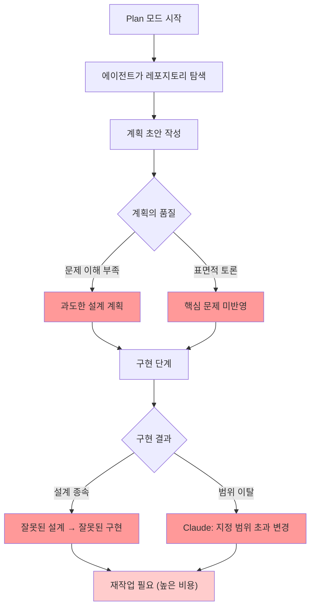
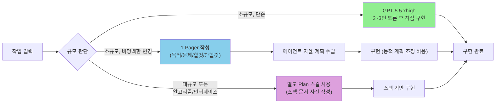
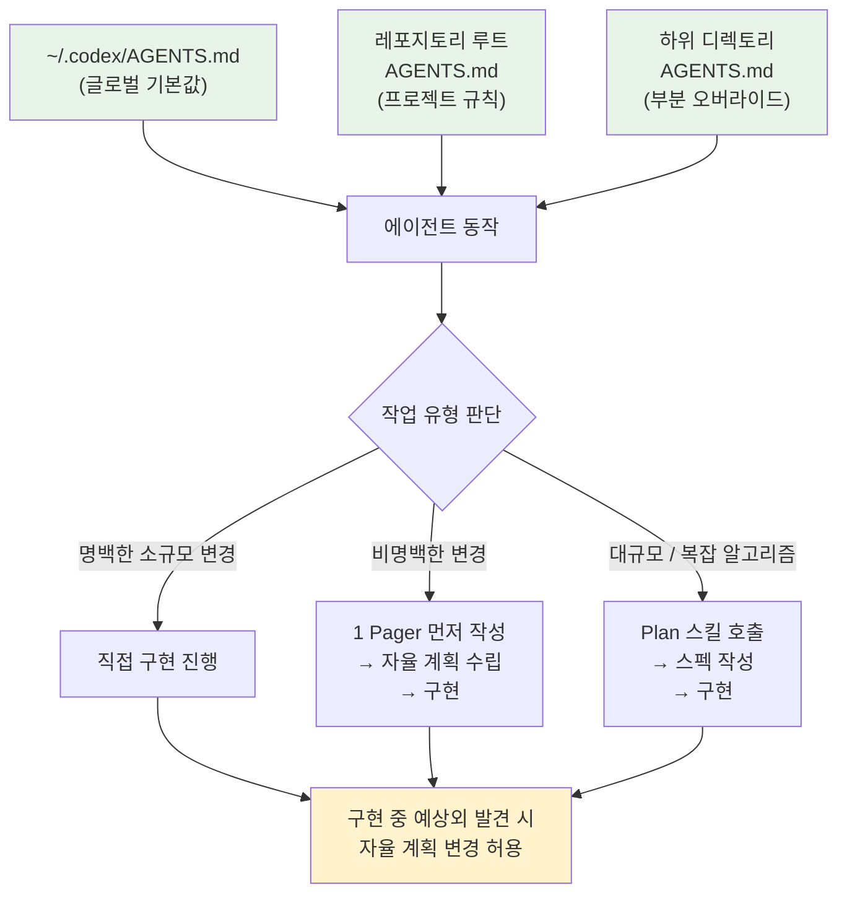
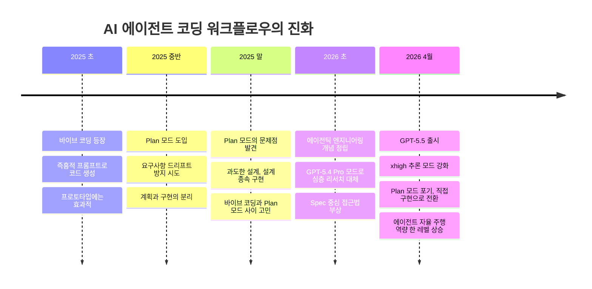
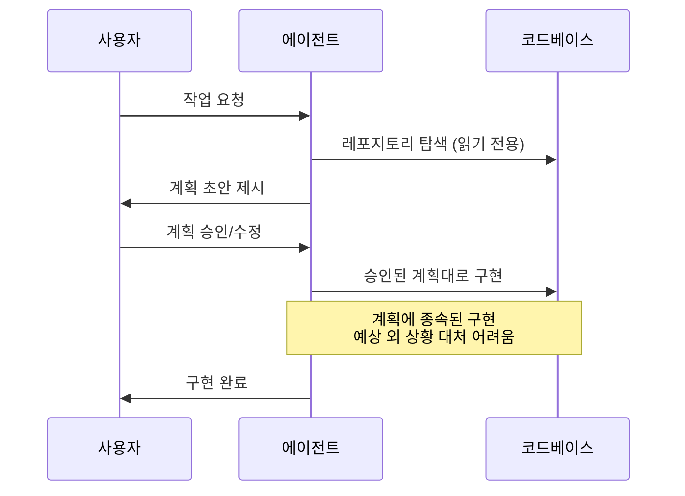
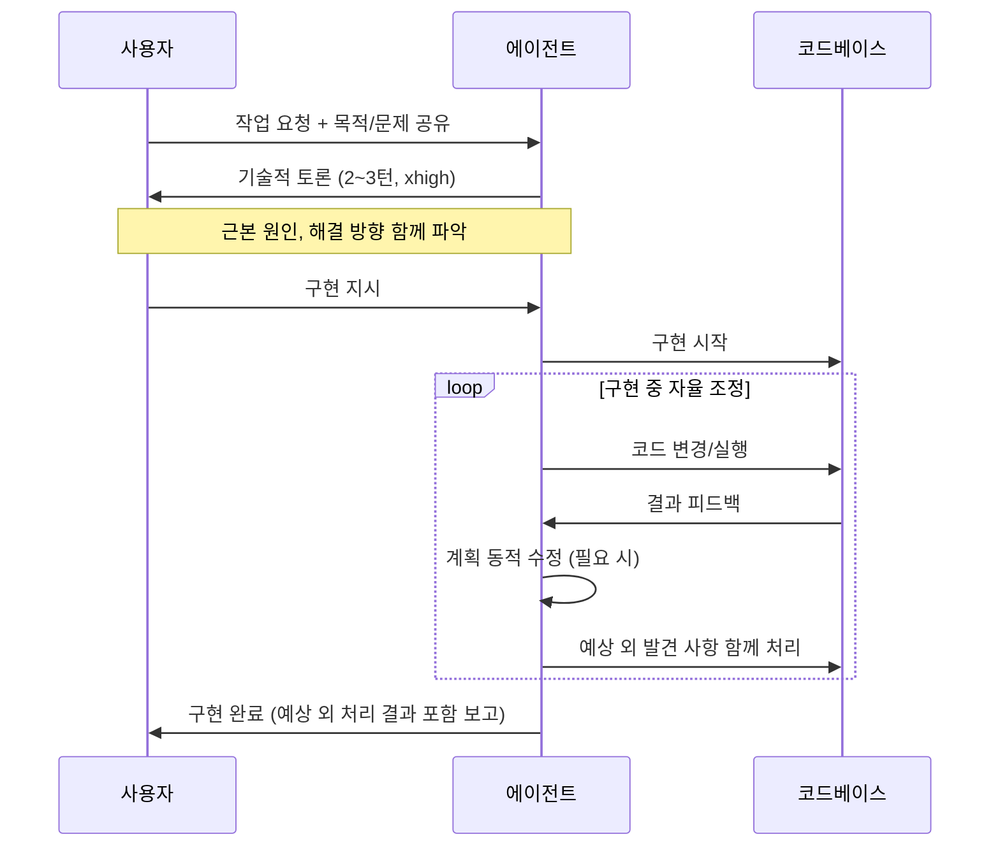

> "GPT-5.5로 올라오면서부터 에이전트의 자율 주행 역량이 한 레벨 올라간 느낌."

---

## 관련글 

[**GPT-5.5로 온 뒤 내 작업 과정에서 변한점 중의 하나는 더 이상 Plan 모드를 사용하지 않는다는 것**](https://www.facebook.com/share/p/1AC5PFJsjJ/)

---

## 목차

1. [배경: 무엇이 바뀌었는가](#1-배경-무엇이-바뀌었는가)
2. [GPT-5.5와 xhigh 추론 모드](#2-gpt-55와-xhigh-추론-모드)
3. [Plan 모드란 무엇인가](#3-plan-모드란-무엇인가)
4. [Plan 모드의 구조적 문제들](#4-plan-모드의-구조적-문제들)
5. [새로운 워크플로우: 소규모 작업](#5-새로운-워크플로우-소규모-작업)
6. [새로운 워크플로우: 중간 규모 작업 (1 Pager 전략)](#6-새로운-워크플로우-중간-규모-작업-1-pager-전략)
7. [새로운 워크플로우: 대규모 작업 (Plan 스킬)](#7-새로운-워크플로우-대규모-작업-plan-스킬)
8. [AGENTS.md의 역할](#8-agentsmd의-역할)
9. [유사한 패턴: 심층 리서치 → Pro 모드](#9-유사한-패턴-심층-리서치--pro-모드)
10. [반응과 공감: 댓글이 드러내는 업계 흐름](#10-반응과-공감-댓글이-드러내는-업계-흐름)
11. [더 넓은 맥락: 바이브 코딩에서 에이전틱 엔지니어링으로](#11-더-넓은-맥락-바이브-코딩에서-에이전틱-엔지니어링으로)
12. [워크플로우 아키텍처 비교](#12-워크플로우-아키텍처-비교)
13. [결론: 자율성의 임계점](#13-결론-자율성의-임계점)

---

## 1. 배경: 무엇이 바뀌었는가

2026년 4월 23일, OpenAI는 GPT-5.5를 출시했다. GPT-5.4가 나온 지 불과 6주 만의 일이었다. 모델 릴리스 주기가 극도로 짧아진 현실 속에서도 이 출시가 주목받는 이유는 단순히 벤치마크 점수 때문이 아니다. 모델 하나가 현장 실무자의 실제 작업 방식을 구체적으로 바꾸는 수준에 도달했기 때문이다.

이 글에서 분석하는 것은 정확히 그 변화다. GPT-5.5라는 모델이 등장한 이후, AI 에이전트를 이용한 코딩 작업 흐름에서 어떤 실질적인 변화가 일어났는가. 구체적으로는, 에이전트 워크플로우에서 오랫동안 권장되어 온 "Plan 모드"를 더 이상 사용하지 않게 된 이유와, 그것을 대체하는 접근법이 무엇인지를 다룬다.

이는 단순한 개인 취향의 변화가 아니다. 모델의 자율 추론 역량이 특정 임계점을 넘었을 때, 이전에 필요했던 워크플로우 단계가 오히려 품질을 저하시키는 마찰이 될 수 있다는 실질적인 관찰이다.

---

## 2. GPT-5.5와 xhigh 추론 모드

### 모델 개요

GPT-5.5는 2026년 4월 23일 ChatGPT와 Codex를 통해 동시 출시되었다. Plus, Pro, Business, Enterprise 플랜에서 기본 모델로 교체되었다. API에서는 `gpt-5.5`와 `gpt-5.5-pro` 두 가지 ID로 접근할 수 있으며, Responses API와 Chat Completions API 모두에서 지원된다.

컨텍스트 윈도우는 API 기준으로 최대 100만 토큰(최대 922K 입력 + 128K 출력)이고, Codex 환경에서는 40만 토큰으로 제한된다.

### xhigh 추론 레벨

GPT-5.5의 핵심 특징 중 하나는 추론 노력 수준(reasoning effort)의 세분화다. 모델은 `none`, `low`, `medium`, `high`, `xhigh` 다섯 단계를 지원하며, 각 단계는 추론의 깊이와 속도를 트레이드오프한다.

OpenAI의 공식 문서에 따르면 각 레벨의 적합한 용도는 다음과 같다:

- **low**: 효율적인 추론이 필요한 경우
- **medium**: 레이턴시와 성능의 균형점 (기본값)
- **high**: 복잡한 에이전틱 작업, 레이턴시보다 품질이 중요할 때
- **xhigh**: 가장 어려운 비동기 에이전틱 작업, 또는 모델 지능의 한계를 시험하는 평가에 적합

xhigh 설정은 모델이 깊고 다단계적인 계획, 자율적인 반복, 그리고 빈번한 진행 상황 보고를 수행하도록 강제한다. 이 모드는 더 느리고 더 비싸지만, 깊은 추론이 진정으로 필요한 문제에서 가장 높은 품질의 결과를 만들어낸다.

GPT-5.5의 주요 벤치마크 점수는 다음과 같다 (xhigh 기준):

| 벤치마크 | GPT-5.5 | 비교 |
|---|---|---|
| Terminal-Bench 2.0 | 82.7% | Claude Opus 4.7: 69.4%, Gemini 3.1 Pro: 68.5% |
| SWE-Bench Pro | 58.6% | Claude Opus 4.7가 64.3%로 여전히 우위 |
| Expert-SWE (내부) | 73.1% | GPT-5.4 대비 4.6%p 향상 |

Terminal-Bench는 모델이 다단계 CLI 워크플로우를 계획하고, 실행하고, 오류를 식별한 후 인간 개입 없이 스스로 수정하는 능력을 직접 측정한다. 이 점수가 의미하는 바는 명확하다. 모델이 계획-실행-검증의 루프를 스스로 돌릴 수 있는 역량이 실질적으로 높아졌다는 것이다.

---

## 3. Plan 모드란 무엇인가

### Codex에서의 Plan 모드

Codex CLI에서는 두 가지 핵심 모드가 있다. 하나는 **Edit 모드(에디트 모드)** 로, 에이전트가 직접 파일을 수정하고 명령어를 실행하며 작업을 진행하는 방식이다. 다른 하나는 **Plan 모드(플랜 모드)** 로, 에이전트가 파일을 변경하지 않고 무엇을 해야 할지를 먼저 계획만 수립하는 방식이다.

Codex에서 Plan 모드는 `/plan [설명]` 슬래시 명령어로 진입하거나, CLI에서 Shift+Tab으로 전환할 수 있다. 이 모드에서는 모델이 레포지토리를 탐색하고, 질문을 하고, 접근법을 구성한 뒤, 실제 코드를 건드리지 않고 계획을 먼저 제시한다. 사용자가 계획을 승인하면 그 다음에 구현으로 진행한다.

Claude Code에도 유사한 구조가 존재하며, 브레인스토밍과 설계 분리를 위한 계획 단계를 지원한다.

### Plan 모드가 등장한 배경

Plan 모드가 권장된 이유는 분명했다. 에이전트가 즉시 코드를 작성하기 시작하면 요구사항을 잘못 이해한 채로 대규모 변경을 가해버리는 이른바 "요구사항 드리프트" 문제가 자주 발생했기 때문이다. Plan 모드는 이 문제를 프로세스 분리로 해결하려 했다. 계획 단계에서 무엇을 할 것인지, 무엇을 하지 않을 것인지, 단계와 검증 기준을 미리 확정한 뒤, 실행 단계에서는 계획에 따라서만 구현하는 방식이다.

이 구조적 논리는 타당하다. 그러나 실제 운용에서는 상당한 문제들이 드러났다.

---

## 4. Plan 모드의 구조적 문제들

### 문제 1: 목적과 문제를 정확히 이해하지 못한 채 설계

Plan 모드에서 에이전트에게 계획을 수립하도록 시키면, 에이전트는 목적과 문제를 충분히 이해하지 못한 상태에서 설계를 진행하는 경우가 많다. 이는 Plan 모드의 근본적인 구조적 한계에서 비롯된다. 계획을 먼저 확정하는 단계와 구현 단계를 인위적으로 분리하다 보니, 계획 단계에서의 대화가 진정한 기술적 토론으로 이어지기 어렵다.

구현을 직접 시작하는 과정에서 자연스럽게 드러나는 문제들, 즉 코드 실행 결과를 보면서 발견되는 엣지 케이스나 설계상의 모순들이 Plan 모드에서는 가시화되지 않는다. 결과적으로 계획은 겉으로는 그럴듯해 보이지만 실제 구현 시 맞닥뜨릴 현실을 반영하지 못한다.

### 문제 2: 토론이 제대로 안 됨 → 바이브(가챠) 코딩으로 전락

Plan 모드에서 에이전트와 나누는 대화는 진정한 엔지니어링 토론이 되기 어렵다. 진짜 문제의 근본 원인을 함께 파고드는 것이 아니라, 계획서 형식에 맞춰 표면적인 내용을 채우는 방향으로 흐른다.

이렇게 되면 Plan 모드를 통해 나온 계획이 "엔지니어링"이 아닌 "바이브", 즉 슬롯머신 혹은 가챠(gacha) 방식이 되어버린다. 운이 좋으면 좋은 계획이 나오고, 아니면 겉으로는 그럴듯하지만 실제 구현에서 문제가 터지는 계획이 나온다. 이는 Claude와 Codex 모두에서 동일하게 관찰된 현상이다.

### 문제 3: 과도한 설계 (Over-Engineering) 경향

Plan 모드의 또 다른 핵심 문제는 과도한 설계 경향이다. 에이전트에게 계획을 세우도록 하면, 실제로 필요한 범위를 초과하는 복잡한 구조를 제안하는 경우가 많다. 이는 에이전트가 주어진 맥락에서 "충분히 좋은" 해결책보다는 "포괄적으로 정제된" 해결책을 제시하려는 경향에서 비롯된다.

### 문제 4: 설계에 종속된 구현 (설계의 오류가 그대로 구현됨)

이것이 가장 큰 문제다. Plan 모드를 통해 계획을 확정하고 나면, 이후 구현 단계에서 에이전트는 그 계획을 따라가는 방향으로 동작한다. 계획이 설령 잘못되어 있더라도, 에이전트는 잘못된 계획에 맞춰 구현을 완성해버리는 경향이 있다. 계획이 가이드가 아닌 족쇄가 되는 것이다.

### 문제 5: Claude Code에서의 추가 문제 — 범위 이탈

Claude Code의 경우, Plan 모드를 통해 계획이 수립된 뒤 구현 단계에서 지정된 범위를 벗어나는 변경을 가하는 문제가 관찰되었다. 요청하지 않은 리팩토링, 계획에 없던 파일 수정, 또는 명시적으로 제외하기로 한 영역에 대한 개입이 발생한다. 계획에서 합의된 경계가 구현 과정에서 지켜지지 않는 것이다.

---

## 5. 새로운 워크플로우: 소규모 작업

### GPT-5.5 xhigh를 활용한 2~3턴 사전 토론

소규모 작업에 대해 새롭게 채택된 방식은 다음과 같다. Plan 모드를 통한 공식적인 계획 수립 단계를 거치지 않는 대신, GPT-5.5 xhigh 모드를 활용해 구현 전에 2~3턴의 집중적인 사전 대화를 진행한다.

이 사전 대화의 목적은 두 가지다:
1. **목적 달성을 위한 설계 검토**: "무엇을 어떻게 만들 것인가"에 대한 접근 방식 확인
2. **문제의 근본 원인과 해결책 검토**: 단순 증상이 아닌 문제의 본질에 대한 공동 이해

이 과정이 공식적인 Plan 모드와 다른 점은, 에이전트가 계획서를 작성하는 것이 아니라 실제 기술적 토론을 하는 것이라는 점이다. xhigh 추론 모드는 모델이 더 깊은 사고의 연쇄(chain-of-thought)를 통해 문제를 파악하게 하므로, 짧은 턴 수로도 질 높은 토론이 가능하다.

### 사전 토론 이후 직접 구현

2~3턴의 사전 토론을 통해 방향이 정립되면, 별도의 계획 문서 없이 직접 구현으로 진행한다. 이 시점에서 에이전트는 이미 문제의 본질을 충분히 이해한 상태이므로, 구현 도중에 예상치 못한 상황을 만나도 자체적으로 판단해서 처리할 수 있다.

핵심 차이는 구현 중의 유연성이다. Plan 모드에서는 계획이 확정된 이후 구현이 그 계획에 종속되지만, Plan 모드 없이 직접 구현할 때는 에이전트가 필요한 경우 계획을 스스로 변경하거나, 중간에 예상치 못했던 문제를 발견하고 그것까지 함께 해결하며 진행한다.

---

## 6. 새로운 워크플로우: 중간 규모 작업 (1 Pager 전략)

### 명백하지 않은 변경에 대한 구조적 접근

소규모 중에서도 단순하지 않은 경우, 즉 목적과 범위가 명확히 정의되어야 하는 변경에 대해서는 별도의 접근법이 사용된다. 구현에 들어가기 전에 반드시 1 Pager를 먼저 작성하는 것이다.

이 1 Pager에는 다음 요소들이 포함된다:
- **목적/문제**: 이 작업을 통해 달성하려는 것, 또는 해결하려는 문제
- **근본 원인**: 문제가 발생한 이유에 대한 분석
- **할 것 (In-scope)**: 이번 구현에서 명시적으로 포함하는 것
- **안 할 것 (Out-of-scope)**: 이번 구현에서 명시적으로 제외하는 것

### AGENTS.md를 통한 자동화

이 1 Pager 작성 요구사항은 AGENTS.md에 직접 지시사항으로 등록되어 있다. 따라서 에이전트는 특정 유형의 작업을 받았을 때, 구현에 들어가기 전에 자율적으로 1 Pager를 먼저 작성하고, 그것을 기반으로 스스로 계획을 수립한 뒤 구현을 진행한다.

이 방식의 효과는 Plan 모드가 목표했던 것과 동일하지만, 접근 방식이 근본적으로 다르다. Plan 모드에서는 계획이 구현을 선행하고 구현을 통제한다. 1 Pager 방식에서는 명확한 의도와 범위를 정의한 뒤, 계획과 구현이 사실상 통합되어 진행된다. 에이전트는 1 Pager를 읽고 스스로 최선의 접근 방식을 판단하므로, 계획이 구현 현실에 맞게 동적으로 조정될 수 있다.

---

## 7. 새로운 워크플로우: 대규모 작업 (Plan 스킬)

### Plan 모드가 여전히 필요한 상황

모든 작업에서 Plan 모드가 불필요한 것은 아니다. 다음 두 가지 유형의 작업에서는 구현 이전에 스펙을 먼저 작성하는 과정이 여전히 필수적이다:

1. **스펙이 한 페이지 이상인 큰 규모의 작업**: 범위가 넓고 여러 컴포넌트에 걸친 변경이 필요한 경우
2. **분명한 의도를 가진 알고리즘 또는 인터페이스 구현**: 특정 설계 결정이 전체 구조에 영향을 미치는 경우

### 별도 Plan 스킬의 구성

그러나 이 경우에도 기본 내장된 Plan 모드 대신 별도로 제작한 Plan 스킬을 사용한다. 이 스킬은 단순히 계획서를 작성하는 것이 아니라, 스펙(Spec) 문서를 체계적으로 작성하는 과정을 안내한다.

차이는 미묘하지만 중요하다. 내장 Plan 모드는 에이전트 주도로 계획이 생성되며, 사용자의 역할은 이를 승인하거나 수정하는 것에 그친다. 별도 Plan 스킬에서는 사용자가 능동적으로 스펙 내용을 결정하고, 에이전트는 그것을 구조화하고 완성하는 보조 역할을 한다.

이렇게 작성된 스펙은 이후 구현 과정에서의 기준 문서가 되며, 에이전트는 구현 중 스펙을 참조하며 자율적으로 진행한다.

---

## 8. AGENTS.md의 역할

### AGENTS.md란

AGENTS.md는 Codex가 작업을 시작하기 전에 읽는 지시사항 파일이다. OpenAI는 이 파일을 통해 프로젝트별, 디렉토리별로 에이전트의 동작 방식을 세밀하게 제어할 수 있도록 설계했다.

파일은 계층적으로 적용된다. 글로벌 설정(`~/.codex/AGENTS.md`)은 모든 프로젝트에 적용되고, 레포지토리 루트의 `AGENTS.md`는 해당 프로젝트 전체에, 하위 디렉토리의 `AGENTS.md`는 해당 디렉토리에만 적용된다. 더 깊은 경로에 있는 파일이 상위 경로의 설정을 오버라이드한다.

### 워크플로우 자동화 도구로서의 AGENTS.md

이번 워크플로우 변화에서 AGENTS.md가 하는 역할은 크게 두 가지다:

첫째, **1 Pager 작성 조건의 자동화**다. 어떤 유형의 작업에서 1 Pager를 먼저 작성해야 하는지, 어떤 형식으로 작성해야 하는지를 지시사항으로 등록해두면, 에이전트는 해당 조건이 충족될 때 자율적으로 1 Pager를 먼저 작성하고 구현에 들어간다.

둘째, **구현 중 자율적 계획 변경 허용**이다. AGENTS.md에 명시적으로 "필요한 경우 계획을 스스로 변경하고 진행하라"는 지시가 있기 때문에, 에이전트는 구현 도중 예상치 못한 문제를 발견했을 때 자의적으로 계획을 수정하며 진행할 수 있다. 이것이 Plan 모드의 계획 종속적 구현과 근본적으로 다른 점이다.

---

## 9. 유사한 패턴: 심층 리서치 → Pro 모드

### 유사한 전환의 역사

이 워크플로우 변화는 과거에도 유사한 패턴이 있었다. ChatGPT에 심층 리서치(Deep Research) 모드가 처음 도입되었을 때는 이것을 매우 자주 활용했다. 복잡한 주제를 조사할 때 웹 검색을 자동화하고 결과를 종합해주는 이 기능은 당시로서는 획기적이었다.

그러나 GPT-5.4가 출시된 이후로는 심층 리서치 모드를 거의 사용하지 않게 되었다. 대신 Pro 모드만을 사용하게 된 것이다. 이유는 간단하다. 모델 자체의 기반 역량이 충분히 높아지자, 별도의 보조 모드 없이도 기본 대화에서 원하는 품질의 결과를 얻을 수 있게 된 것이다.

### 패턴의 반복

Plan 모드의 포기는 심층 리서치 포기와 정확히 같은 구조를 따른다.

| 구분 | 이전 도구 | 전환 계기 | 새로운 방식 |
|------|-----------|-----------|-------------|
| 리서치 | 심층 리서치 모드 | GPT-5.4 출시 | Pro 모드 직접 활용 |
| 코딩 계획 | Plan 모드 | GPT-5.5 출시 | xhigh 토론 + 직접 구현 |

두 경우 모두, 기존 보조 기능이 생긴 이유는 모델의 기본 역량이 특정 과제에 불충분했기 때문이다. 모델이 충분히 강력해지면 그 보조 기능은 불필요해지거나 오히려 방해가 된다. 보조 기능이 추가하는 구조적 제약이 모델의 자율적 판단을 제한하기 때문이다.

---

## 10. 반응과 공감: 댓글이 드러내는 업계 흐름

### 댓글 1: Plan 모드의 두 의미에 대한 질문

원글에 달린 댓글 중 하나는 "Plan 모드를 사용하지 않는다"는 말의 의미를 명확히 하기 위해 두 가지 해석을 제시했다:

1. **Codex의 에디트/플랜 모드** 중 플랜 모드를 사용하지 않는다는 의미
2. **brainstorm → spec → plan → implementation** 전체 흐름에서 plan 단계를 건너뛰고 spec만 하고 바로 구현한다는 의미

원글이 말하는 것은 두 가지 모두에 해당하는 내용이다. Codex의 내장 Plan 모드도 사용하지 않으며, 전통적인 순차적 계획 수립 프로세스도 GPT-5.5 이후로는 필요성이 크게 줄었다.

### TDD에 관한 질문: 토큰 비용의 현실

같은 댓글에서 TDD(Test-Driven Development)에 대한 언급도 있었다. 하네스를 써서 spec → implement 과정을 그대로 따라가는데, TDD는 토큰을 많이 소비하기 때문에 생략하는 경우도 있다는 것이다. GPT-5.5 이후로는 에이전트가 너무 잘 작동해서 TDD가 필요 없는 경우도 꽤 있다는 관찰도 함께 제기되었다.

이는 중요한 현실적 관찰이다. 모델의 역량이 높아질수록 테스트 우선 방식이 제공하는 안전망의 필요성이 줄어들 수 있다. 하지만 이것이 TDD를 포기해도 된다는 의미는 아니다. 다만 에이전트와의 협업에서 TDD의 역할과 비용-효율을 재검토할 시점이 왔다는 것이다.

### 댓글 2: 공감의 증거

또 다른 댓글에서는 "저도 plan 모드는 대체적으로 불만족스러웠다"는 공감을 표현했다. 이는 개인적인 워크플로우 변화가 아니라, Plan 모드에 대한 광범위한 불만이 커뮤니티 안에 존재했음을 보여준다.

---

## 11. 더 넓은 맥락: 바이브 코딩에서 에이전틱 엔지니어링으로

이 워크플로우 변화는 2026년 초 업계 전체를 관통하는 더 큰 흐름과 맞닿아 있다.

### 바이브 코딩의 한계

2025년 초, Andrej Karpathy가 "바이브 코딩(vibe coding)"이라는 용어를 만들었다. 자연어로 원하는 것을 설명하면 AI가 코드를 만들어주고, 실행해보고, 문제가 생기면 다시 설명하는 방식이다. 빠르고 즐거웠다. 프로토타입과 해커톤 데모에는 효과적이었다.

그러나 실제 프로덕션 환경에서의 문제가 드러나기 시작했다. 코드가 표면적으로는 동작하지만 에러 처리, 보안, 유지보수성이 취약한 소위 "AI 슬롭(slop)"이 만연했다. Amazon은 2025년 3분기에 AI 코딩 어시스턴트와 연관된 사고들로 인해 90일간의 코드 배포 통제 리셋을 단행하기도 했다.

### 에이전틱 엔지니어링의 부상

2026년 2월, Karpathy는 바이브 코딩 1주년을 맞아 새로운 용어를 제안했다. "에이전틱 엔지니어링(agentic engineering)"이다. 그는 이 용어를 두 부분으로 풀었다.

"Agentic"은 코드를 직접 작성하는 것이 아니라 코드를 작성하는 에이전트를 오케스트레이션하며 감독하는 것이 새로운 기본 방식이 되었다는 의미다. "Engineering"은 여기에 예술과 과학, 그리고 전문성이 요구된다는 점을 강조한다. 배워서 더 잘하게 될 수 있는, 깊이가 있는 다른 종류의 숙련이라는 것이다.

Claude Code 수장인 Boris Cherny는 2026년 초 자신의 프로덕션 코드 100%가 AI에 의해 생성되며, 2025년 10월 이후로 한 줄의 코드도 직접 작성하지 않았다고 밝혔다. 그러면서 "바이브 코딩"이라는 용어는 부주의함, 비영구성, 엄밀함의 결여를 암시하기 때문에 적극적으로 반대한다고 했다.

### 이번 워크플로우 변화의 위치

이번에 분석하는 워크플로우 변화는 에이전틱 엔지니어링의 구체적인 실천 방법론으로 볼 수 있다. 바이브 코딩처럼 계획 없이 즉흥적으로 접근하는 것도 아니고, Plan 모드처럼 계획을 과도하게 형식화하고 분리하는 것도 아니다. 대신:

- 사람이 문제의 본질과 범위를 명확히 정의하고
- 에이전트에게 진짜 기술적 토론을 통해 이해를 공유하며
- 구현에서는 에이전트의 자율성과 적응성을 신뢰하는

방식이다. 이것이 모델 역량이 임계점을 넘은 이후의 자연스러운 워크플로우 진화다.

---

## 12. 워크플로우 아키텍처 비교

### 이전 방식 (Plan 모드 중심)

### 현재 방식 (GPT-5.5 이후)

### 작업 규모별 접근법 요약

| 작업 유형 | 사전 단계 | 계획 방식 | 구현 유연성 |
|-----------|-----------|-----------|-------------|
| 소규모, 단순 | xhigh 2~3턴 토론 | 없음 (토론으로 대체) | 최대 |
| 소규모, 비명백한 변경 | 1 Pager 작성 | 에이전트 자율 계획 | 높음 |
| 대규모 / 복잡 알고리즘 | Plan 스킬 사용 | 사용자 주도 스펙 작성 | 중간 |
| ~~Plan 모드~~ | ~~에이전트 계획 제시~~ | ~~계획 승인 후 종속 구현~~ | ~~낮음~~ |

---

## 13. 결론: 자율성의 임계점

이 워크플로우 변화의 핵심에는 하나의 근본적인 통찰이 있다. AI 에이전트의 역량에는 임계점이 있으며, 그 임계점을 넘으면 이전에 필요했던 구조적 보조 수단이 오히려 제약이 된다는 것이다.

Plan 모드는 에이전트의 이해력과 자율 판단 역량이 아직 충분하지 않을 때, 인간이 그 부족함을 구조적으로 보완하기 위해 설계된 도구였다. 에이전트가 문제를 잘못 이해하더라도 계획 단계에서 교정할 수 있고, 범위를 벗어나더라도 계획의 경계가 제어할 수 있도록. 그 시도 자체는 합리적이었다.

그런데 GPT-5.5가 등장하면서, 특히 xhigh 추론 모드에서, 에이전트는 짧은 사전 대화만으로도 문제의 본질을 파악하고, 구현 중 예상치 못한 상황에 자율적으로 대응하며, 필요하면 스스로 계획을 수정하며 진행하는 역량을 보여주기 시작했다. 계획이라는 형식적 구조 없이도 의도에 맞는 구현이 가능해진 것이다.

이것은 모델의 "자율 주행 역량이 한 레벨 올라간" 상태다. 바이브 코딩(무계획)과 Plan 모드(과도한 계획)의 두 극단 사이에서, GPT-5.5는 새로운 균형점을 만들어냈다. 목적과 맥락을 공유하면 에이전트 스스로가 적절한 수준의 계획과 구현을 통합해서 수행한다.

심층 리서치가 GPT-5.4에서 Pro 모드에 흡수되었듯이, Plan 모드가 GPT-5.5에서 에이전트의 기본 역량으로 흡수되고 있다. 이것이 2026년 AI 에이전트 워크플로우가 실제 현장에서 진화하는 방향이다.

---

## 참고 및 맥락 자료

- GPT-5.5 출시 발표 및 기능 명세: OpenAI (2026년 4월 23일)
- Codex Plan 모드 공식 문서: developers.openai.com/codex
- AGENTS.md 공식 가이드: developers.openai.com/codex/guides/agents-md
- Andrej Karpathy, "에이전틱 엔지니어링" 개념 제안 (X/Twitter, 2026년 2월)
- Boris Cherny (Claude Code 수장), Anthropic 개발자 컨퍼런스 발언 (2026년 초)
- SWE-Bench Pro, Terminal-Bench 2.0 벤치마크 결과 (2026년 4월 기준)

---

*작성일: 2026년 5월 18일*
