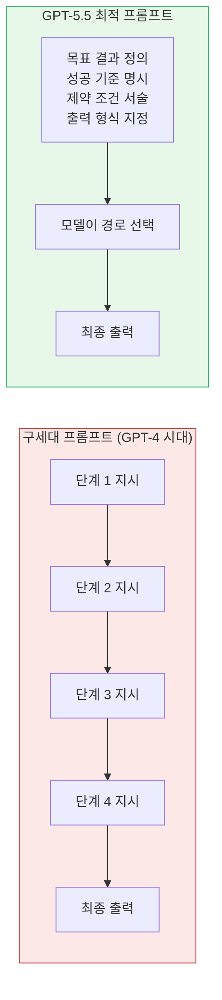
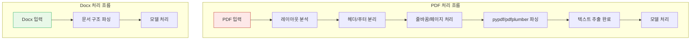
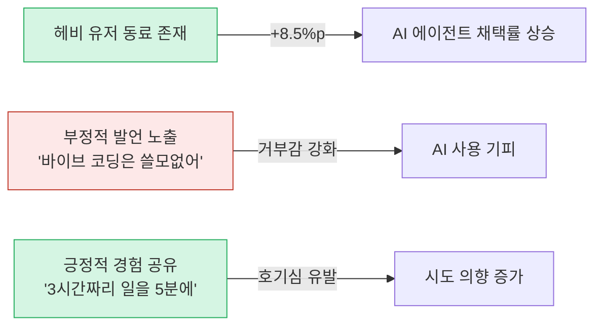
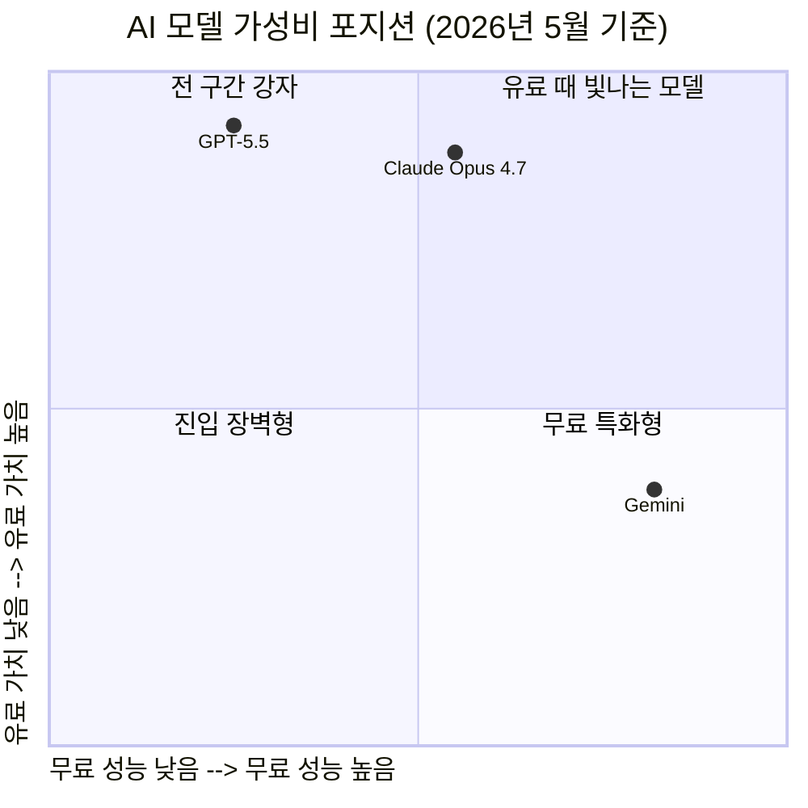
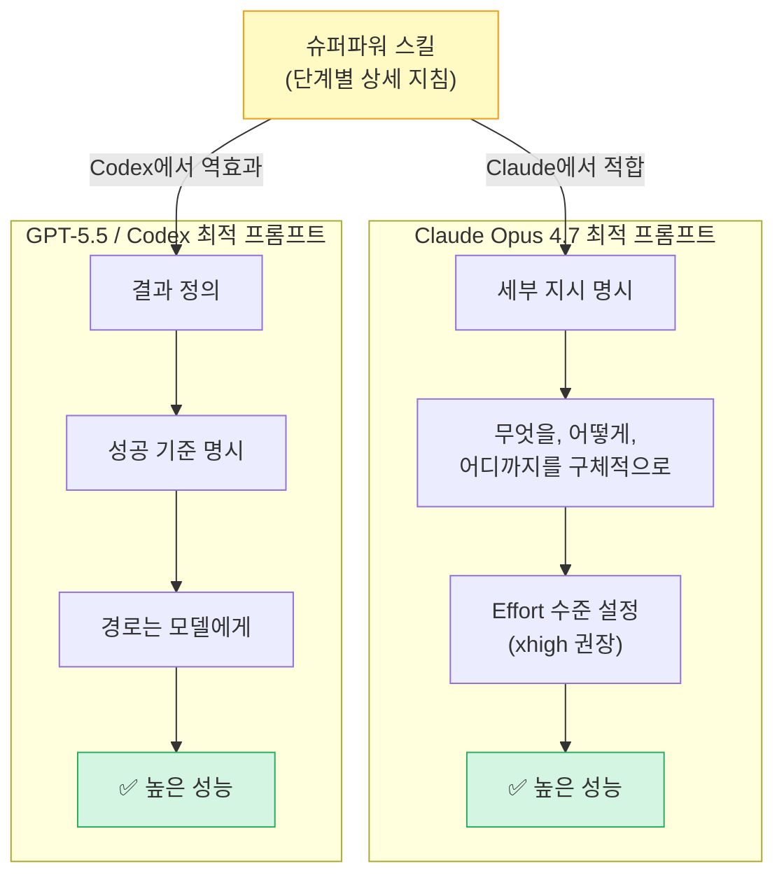
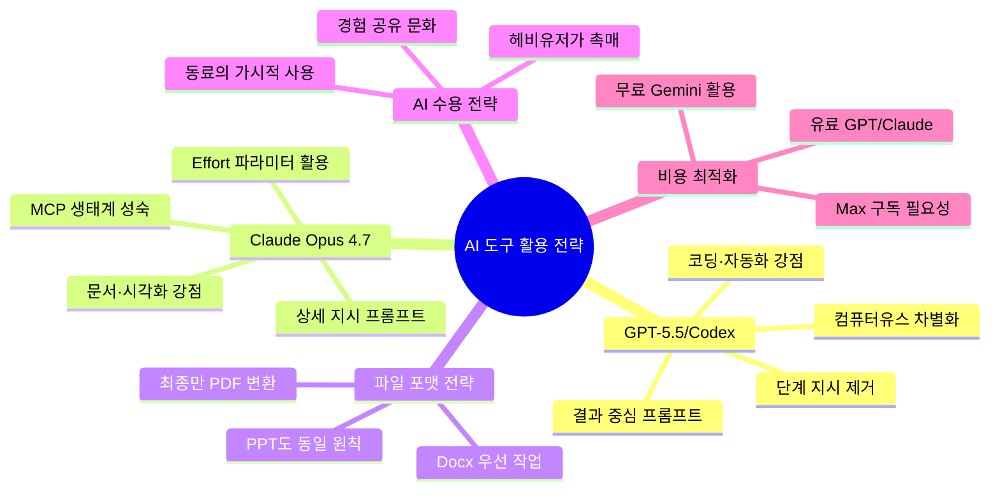

> 출처: OpenAI 공식 프롬프팅 가이드, Anthropic 공식 문서, HBR/Microsoft 연구, [@hochul_shin__](https://www.threads.com/@hochul_shin__/post/DYZbnrZkR-D) Threads 시리즈

---

## 1. GPT-5.5의 프롬프팅 철학 전환: "과정"에서 "결과"로

2026년 4월 말, OpenAI가 공개한 GPT-5.5 공식 프롬프팅 가이드는 단순한 버전 노트가 아니다. 이것은 AI와 인간이 협업하는 방식의 근본적인 패러다임 전환을 선언하는 문서다.

핵심 명제는 간결하다. GPT-5.5는 프롬프트가 목표 결과(target outcome)를 정의하고, 모델이 효율적인 해결 경로를 스스로 선택할 여지를 남길 때 가장 강력하게 작동한다. 이전 모델들과 비교하면, 더 짧고 결과 중심적인 프롬프트를 사용할 수 있다. 좋은 결과가 어떤 모습인지, 어떤 제약 조건이 중요한지, 어떤 증거가 활용 가능한지, 그리고 최종 답변이 무엇을 포함해야 하는지를 서술하는 것으로 충분하다.

이 변화가 실무적으로 갖는 의미를 이해하려면, 2023년부터 2025년 초반까지 지배했던 프롬프트 엔지니어링의 관행을 떠올려야 한다. 당시의 모범 사례는 "먼저 이걸 하고, 다음엔 저걸 분석하고, 그다음엔 비교한 뒤 결론을 내려라"는 방식의 단계적 지시였다. 이른바 Chain-of-Thought(사고의 연쇄) 기법이다. 이 방식은 당시 모델들이 스스로 복잡한 추론 경로를 설계하지 못했기 때문에 유효했다. 인간이 추론의 발판을 제공해야 했던 것이다.

그런데 GPT-5.5의 내부 추론 엔진은 이미 그 발판을 내재화했다. OpenAI 공식 문서는 이 점을 명확히 표현하고 있다. 모델에게 경로를 과잉 명시하면, 즉 "먼저 A를 하고, B를 확인하고, C를 비교한 뒤 D를 출력하라"고 강요하면, 오히려 모델의 능력을 제약하게 된다. 모델이 더 나은 경로로 탐색할 수 있는 문제 공간을 인위적으로 좁혀버리는 것이다.

### 결과 중심 프롬프트의 실제 구조

OpenAI 공식 가이드가 제시하는 GPT-5.5에 최적화된 프롬프트는 다음 네 가지 요소로 구성된다.

**첫째, 목표 결과(Outcome):** 달성하려는 최종 상태를 구체적으로 서술한다. "고객 문제를 처음부터 끝까지 해결하라"처럼 목적지를 명확히 한다.

**둘째, 성공 기준(Success criteria):** 어떤 조건이 충족되면 작업이 완료된 것인지를 정의한다. "정책 및 계정 데이터에서 자격 결정이 이루어지면", "허용된 조치가 응답 전에 완료되면"처럼 구체적인 완료 조건을 제시한다.

**셋째, 제약 조건(Constraints):** 절대적인 불변 규칙—안전 규정, 필수 출력 필드, 절대 해서는 안 되는 행동—에만 ALWAYS, NEVER, MUST 같은 절대적 표현을 사용한다. 판단이 필요한 상황에서는 이러한 절대 규칙 대신 조건부 의사결정 규칙으로 대체하는 것이 권장된다.

**넷째, 출력 형태(Output shape):** 최종 답변이 무엇을 담아야 하는지를 명시한다. 구조화된 출력이 필요할 경우 프롬프트 내 스키마 정의 대신 Structured Outputs API를 활용하도록 권고한다.

주목할 점은 GPT-5.5가 현재 UTC 날짜를 자체적으로 인식하므로, 시스템 프롬프트에 날짜를 별도로 삽입할 필요가 없다는 것이다. 이처럼 프롬프트를 군더더기 없이 유지하는 것이 GPT-5.5 시대의 기본 원칙이다.

### 창작 작업에서의 사실 보호 가이드라인

GPT-5.5 프롬프팅 가이드에서 특별히 눈여겨볼 항목 중 하나는 마케팅 문서, 보고서 등 창작적 초안 작업에 대한 경고다. GPT-5.5는 문서를 세련되게 만들려다 검증되지 않은 구체적 사실을 창작할 가능성이 있다. 이를 방지하기 위해 공식 가이드는 프롬프트에 사실(fact)과 표현(expression)의 경계를 명확히 구분해줄 것을 권고한다.

고객명, 지표, 로드맵 상태, 경쟁사 현황 같은 구체적 사실 주장은 반드시 제공되거나 검색된 증거에 기반해야 하며, 이를 뒷받침할 출처가 없는 경우 "플레이스홀더"를 사용하거나 가정으로 명확히 표시된 일반적 초안을 작성해야 한다.

---

## 2. 토큰을 지키는 실용 팁: 파일 포맷 전략

GPT-5.5나 Claude를 실무에서 활용할 때, 특히 사무 환경에서 하루에도 수십 건의 문서를 다루는 직장인에게 토큰 소모 최적화는 절대 사소한 문제가 아니다. 이와 관련해 매우 단순하지만 실효성 높은 팁이 있다.

**PDF를 바로 AI에게 건네지 말고, 가능한 한 Docs 또는 Docx 형태로 작업한 뒤 최종 단계에서만 PDF로 변환하라.**

이 팁의 근거는 AI 모델의 내부 문서 처리 방식에 있다. Docx 파일은 문서 구조가 단순하다. 모델은 텍스트와 구조만 파악하면 되므로 분석이 빠르고 토큰 소모도 적다.

반면 PDF는 이야기가 다르다. PDF는 시각적 레이아웃을 먼저 파악해야 한다. 모델은 레이아웃 분석, 헤더·푸터 처리, 줄바꿈 해석, 페이지 구분, 다단 레이아웃 분리 등 대단히 많은 전처리 작업을 수행해야 한다. AI 내부적으로는 `pypdf`, `pdfplumber` 같은 Python 라이브러리가 동원되며, 이 처리 과정 자체가 토큰을 추가로 소비한다.

PPT(PowerPoint)도 동일한 맥락이다. AI에게 슬라이드 내용 작업을 맡길 때는 먼저 텍스트와 구조를 Docs나 일반 텍스트로 작업한 뒤, 검토와 수정이 끝난 마지막 단계에서 PPT 변환을 요청하는 것이 토큰 효율 관점에서 유리하다.

실무에 적용하는 방법은 간단하다. 고객사에서 PDF로 자료를 받았더라도, AI에게 분석이나 편집을 맡길 때는 먼저 내용을 Docx나 Google Docs로 옮기거나, 텍스트 형태로 붙여넣어 작업하고, 완성된 결과물만 PDF로 내보내면 된다. 이 순서 하나만으로도 누적 토큰 소모를 의미 있게 줄일 수 있다.

---

## 3. AI 수용을 가르는 결정적 변수: 주변 사람

2026년 3월, Harvard Business Review에 발표된 연구는 기업의 AI 도입 전략에 대한 통념을 정면으로 뒤흔들었다. Microsoft 연구원 Nancy Baym, Eleanor Dillon, Sonia Jaffe가 수행한 이 연구는 557명의 미국 정보 노동자를 대상으로 한 설문을 기반으로 한다.

연구의 핵심 발견은 도구의 성능이나 교육 프로그램의 질보다 **주변 동료가 AI를 어떻게 사용하는지가 개인의 AI 수용에 더 큰 영향을 미친다**는 것이다. 기업들이 AI 도입에 실패하는 이유가 기술의 문제가 아니라 사회적 가시성(social visibility)의 문제임을 이 연구는 보여준다.

동료들이 AI를 공개적으로 실험하고, 성과를 공유하고, 무엇이 효과적인지 대화할 때 AI 수용은 자연스럽게 확산된다. 반대로, 조직 내에서 AI 사용이 눈에 띄지 않으면 아무리 훌륭한 도구를 제공해도 외면받는다.

수치로 보면 그 영향은 더욱 구체적이다.

- AI에 두려움이나 거부감을 느끼는 구성원일수록 AI 사용량이 낮고, 에이전트 실험 비율도 낮았다.
- 이들 중 약 12%는 아예 AI를 언급조차 하지 않았다.
- 반대로, 주변에 AI 헤비 유저가 있는 경우 Claude, Codex 같은 AI 에이전트를 사용할 확률이 **8.5퍼센트 포인트** 상승했다.

8.5%포인트는 수치상 작아 보일 수 있다. 하지만 기술 도입 초기 단계에서 동료 한 명의 존재가 팀 전체의 활용 방향을 바꿀 수 있다는 의미로 해석하면, 이는 결코 작은 수치가 아니다.

이 연구 결과는 AI 도입을 "top-down 메시지와 일회성 교육"으로 추진하는 기존 방식이 왜 효과적이지 않은지를 설명해준다. 진짜 확산은 동료의 실제 사용을 목격하고, 대화를 나누고, 심리적 안전감을 확보할 때 일어난다.

이를 개인 수준의 스펙트럼으로 분류하면, AI에 개방적인 사람, 중립적인 사람, 비관적인 사람의 비율은 대략 10 : 80 : 10으로 추정된다. 대다수가 중간 지대에 있다는 뜻인데, 이들이 어느 방향으로 기울지는 주변에 어떤 사람이 있느냐에 따라 크게 달라진다. 인간은 생각보다 훨씬 강력한 사회적 동물이다. 기업의 AI 전략가들이 주목해야 할 지점이 바로 여기에 있다.

---

## 4. 무료 vs 유료: GPT · Claude · Gemini 3파전 정리

AI 도구 선택에서 예산은 현실적인 제약이다. 무료 티어와 유료 티어에서 각 모델이 어떤 포지션을 차지하는지 솔직하게 정리하면 아래와 같다.

### 무료 티어: 제미나이의 독주

무료 환경에서는 Gemini가 가장 두드러진다. 기본 제공되는 사고(Thinking) 모델, 시간 제한이 있지만 Pro 모델 접근, 빠른 응답 속도, 무제한에 가까운 즉각 응답(Instant) 모드, 나노바나나(Imagen 기반)의 넉넉한 이미지 생성 한도가 조합된 결과다.

Claude의 무료 Sonnet은 과거 Opus 계열을 경량화한 수준의 성능을 무료로 제공한다. 추론 모드도 사용 가능하고, 대화 세션을 전환하면서 활용하면 무료 구간에서도 상당한 작업이 가능하다. 시각화 품질은 특히 인상적이다.

GPT의 무료 버전은 세 모델 중 가장 제한적이다. 추론을 최대한 생략하는 경향이 있고, 무료에서는 Codex를 전혀 사용할 수 없기 때문에 유료 티어와의 격차가 매우 크다.

### 유료 티어: GPT와 Claude의 공동 선두

유료로 넘어오면 판도가 완전히 바뀐다.

GPT는 Plus부터 급격히 달라지고, Pro 수준에서는 다른 세계가 열린다고 느껴질 만큼 도약이 크다. 웹 인터페이스에서 Thinking 모드를 켜면 응답의 질이 비약적으로 향상되며, Codex를 활용하기 시작하면 코딩 작업의 새로운 가능성이 열린다.

Claude는 유료 Pro 구독 시 사용량이 다소 확장되고 Claude Code를 일부 사용할 수 있다. 그러나 Claude의 진정한 가치를 끌어내기 위해서는 Max 5x 이상의 플랜이 필요하다는 점이 실용적 한계로 지적된다. 토큰 정책이 상당히 타이트하기 때문이다.

Gemini는 유료 전환 시 가장 아쉽다. GPT의 Thinking 모드나 Claude의 추론 모드와 실질적인 경쟁이 어렵고, Gemini CLI는 Claude Code나 Codex에 비해 완성도 면에서 차이가 있다.

요약하면, **무료 구간: Gemini > Claude >> GPT**, **유료 구간: GPT ≥ Claude >>>> Gemini**다.

---

## 5. Claude와 Codex: 최적화된 프롬프트 전략이 다르다

Claude와 OpenAI Codex를 모두 깊이 사용해본 사람이라면 한 가지 불편한 경험을 했을 가능성이 높다. Claude에서 잘 먹히던 프롬프트를 Codex에 그대로 가져갔더니 기대에 훨씬 못 미치는 결과가 나온 것이다. 혹은 그 반대의 경우도 있다.

이 현상의 원인은 두 모델의 설계 철학이 서로 다른 방향에서 수렴하고 있기 때문이다.

### Claude Opus 4.7: 명시적 지시에 더 충실해졌다

Anthropic이 2026년 4월 16일 출시한 Claude Opus 4.7은 "지시를 문자 그대로 따른다"는 특성이 훨씬 강화되었다. 공식 마이그레이션 가이드는 이 점을 명확히 경고한다. 4.7은 "지시를 묵시적으로 일반화하지 않는다." 한 항목에 대한 지시를 나머지 항목에 자동으로 적용하지 않으며, 명시적으로 요청하지 않은 것은 하지 않는다.

이와 함께 Opus 4.7은 새로운 Effort(추론 노력) 파라미터 시스템을 도입했다. low, medium, high, xhigh(extra high), max 다섯 단계로 세분화되며, Anthropic은 코딩 및 에이전트 작업에는 xhigh를, 고지능 요구 작업에는 최소 high를 권장한다. Claude Code의 기본값도 xhigh로 상향 조정되었다.

중요한 함의는 이것이다. Effort가 낮을수록 모델은 지시한 것만 정확히 수행한다. 즉, "슈퍼파워(SuperPower)" 같은 상세하고 구조화된 지침 프롬프트는 Claude에서 더욱 효과적이다. 세밀하게 규정할수록 Opus 4.7은 그 규정에 충실하게 움직인다.

또한 Opus 4.7은 새로운 토크나이저를 적용해 입력당 토큰 수가 이전 대비 1.0~1.35배 증가했다. 기존 4.6 기반 워크플로를 그대로 4.7로 전환하면 추가 비용이 발생할 수 있으므로, 실제 운영 환경에서의 비용 테스트가 필수적이다.

### GPT-5.5 (Codex): 결과만 명확하게, 경로는 모델에게

GPT-5.5는 정반대의 방향을 취한다. 앞서 설명한 것처럼 결과를 명확히 정의하고 경로는 모델이 스스로 선택하게 할 때 최고의 성능이 나온다. 세부 단계를 빽빽하게 나열하는 프롬프트는 오히려 모델을 제약한다.

따라서 "슈퍼파워" 같은 스킬은 Claude에서는 힘을 발휘하지만, Codex에서는 독이 될 수 있다.

실무 결론은 명쾌하다. Claude를 쓴다면 상세한 지침 프롬프트를 적극 활용하고 Effort를 높이 설정할 것. Codex를 쓴다면 결과와 제약 조건만 간결하게 서술하고 경로는 모델에게 맡길 것. 스킬을 한쪽에서 그대로 가져다 쓰지 말고, 반드시 직접 테스트해보고 판단해야 한다.

---

## 6. GPT 5.5 vs Claude Opus 4.7: 직접 비교 평가

두 모델을 실제로 집중적으로 사용해본 결과를 바탕으로 한 비교 평가다.

### GPT 5.5 (Codex): 코딩과 자동화의 강자

GPT 5.5의 코딩 능력은 9.4~9.6점 수준으로 평가할 만하다. 한다고 한 일을 하지 않는 경우가 거의 없다는 것이 가장 큰 강점이다. 특히 터미널 환경에서 이미지를 대량으로 동시에 생성하는 능력은 인상적이다. GPT Image 2를 활용해 이미지를 먼저 생성하고 그것을 기준으로 레이아웃을 구성하는 내부 메커니즘이 프론트엔드 코딩 품질을 크게 높였다.

Codex 데스크톱 앱에 통합된 컴퓨터 유스(Computer Use)는 현시점에서 가장 강력한 차별화 포인트다. 단순히 코드를 작성하는 것을 넘어 실제 OS 환경을 제어하며 작업을 완수할 수 있다는 점에서 에이전틱 작업의 새 기준을 제시한다.

GPT 5.5 Pro 수준에서 리서치를 수행하면, 이전에 20~40분이 걸리던 작업이 5~7분으로 단축된다. 이 수준의 리서치 결과를 시각 자료로 변환하면 고품질 보고서나 프레젠테이션 초안이 완성된다.

GPT 5.5는 또한 대화 톤이 기존 모델에 비해 크게 부드러워졌다. MBTI 비유를 빌리자면 T에서 F 성향으로 전환된 것처럼 느껴지며, 한국어 대응 능력도 눈에 띄게 향상되었다.

**단점:** 잘 알려진 앱이나 유틸리티의 경우 한 번에 완성도 높은 결과를 내지만, 덜 알려진 것들은 참고 자료를 제공하며 추가 안내가 필요하다. 백엔드나 복잡한 비즈니스 로직에서의 안정성은 추가 검증이 필요하다.

### Claude Opus 4.7: 사무 환경과 문서 품질의 전문가

Claude Opus 4.7의 강점은 사용자 편의성과 문서 품질에 있다. 비개발자 사무직 종사자들이 사용하기에 최적화된 경험을 제공한다. 보고서와 문서가 깔끔하게 생성되며, MCP와 스킬(Skill) 생태계를 먼저 주도한 덕분에 외부 서비스와의 연동 인프라가 상당히 성숙해 있다.

2D 시각화 능력이 매우 우수하고, UI나 프론트엔드 결과물도 Codex와 비교해 미묘하게 더 세련된 감각을 보여준다. 코딩 작업에서도 SWE-bench Verified 87.6%, CursorBench 70%(Opus 4.6 대비 +12%p)를 기록하며 강력한 성능을 입증했다.

**단점:** 한다고 한 작업을 완수하지 않는 경우가 간헐적으로 발생한다. 사용량 정책이 매우 타이트하여, Pro 구독만으로는 활용 가능한 양이 제한적이며 Max 5x 이상의 구독에서 진정한 활용이 가능하다.

```mermaid
xychart-beta
    title "GPT 5.5 vs Claude Opus 4.7 비교"
    x-axis ["코딩", "사무문서", "시각화", "에이전트", "편의성", "생태계"]
    y-axis "점수" 0 --> 10
    bar [9.5, 7.5, 7.5, 9.0, 7.0, 7.5]
    bar [8.5, 9.5, 9.0, 8.0, 8.5, 9.0]
```

**요약:** 개발자나 기술 친화적 사용자라면 Codex, 비개발자 또는 문서·보고서 중심의 사무 환경이라면 Claude가 더 적합하다.

---

## 7. GPT 5.5와 Blender: 3D 창작의 가능성

GPT 5.5를 Blender와 MCP로 연결해 3D 모델을 생성하는 실험이 진행되었다. 결과물의 품질은 예상보다 상당히 높았다. 현재는 텍스트 기반 지시로 간단한 요청을 전달하면 기본적인 3D 오브젝트가 생성되는 수준이지만, 2026년 말이나 2027년 수준에서는 고품질 3D 결과물이 자동 생성되는 미래가 현실화될 것으로 전망된다.

이 방향은 단순한 텍스트-이미지 생성의 연장이 아니다. AI가 직접 3D 소프트웨어를 조작하고, 전문가 수준의 모델링 작업을 자동화할 수 있다는 가능성의 단초다. Blender MCP 생태계와 Codex의 컴퓨터 유스 기능이 결합되면, 디자인과 3D 콘텐츠 제작 영역에서도 패러다임 전환이 일어날 것으로 보인다.

---

## 8. 경쟁이 소비자에게 가져다주는 것

Claude Code의 한도가 예상치 못한 시점에 초기화된 일이 있었다. 이 변화의 배경에는 OpenAI GPT 5.5의 급격한 성능 향상, GPT Image 2.0 출시, Codex 앱의 가파른 개선이 Anthropic에 상당한 압박으로 작용했을 가능성이 있다.

기업의 입장에서 독점은 이윤을 극대화하는 구조다. 그러나 소비자의 입장에서는 경쟁이 가장 강력한 혜택 창출 메커니즘이다. 두 거대 AI 기업 간의 치열한 경쟁이 Claude Code 한도 정책 조정이라는 형태로 사용자에게 직접적인 혜택으로 돌아온 이 사례는, AI 산업의 경쟁 구도가 개인 사용자에게 어떤 방식으로 실익을 가져다주는지를 잘 보여준다.

---

## 종합 시사점

GPT-5.5와 Claude Opus 4.7은 각자 뾰족하게 강한 영역이 다르며, 두 모델의 최적 프롬프트 전략은 설계 철학의 차이를 반영해 서로 다른 방향을 취한다. 프롬프트 엔지니어링의 시대에서 컨텍스트 엔지니어링의 시대로 전환이 가속화되는 지금, 도구를 선택하는 것만큼 그 도구에 맞는 언어로 소통하는 법을 익히는 것이 중요해졌다.

AI 수용은 결국 사람의 문제다. 기술이 아무리 뛰어나도, 주변의 신뢰할 수 있는 동료가 먼저 사용하고 경험을 나누지 않으면 확산은 더디다. 조직의 AI 전략은 도구 배포보다 사람 간의 가시적 경험 공유에 더 집중해야 한다.

---

