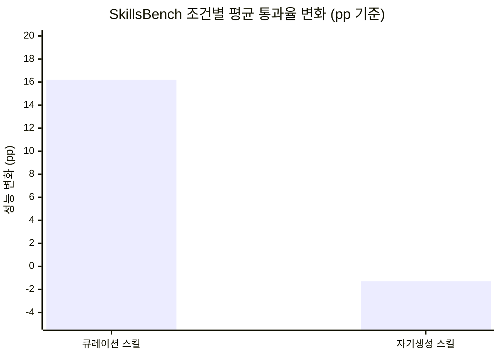
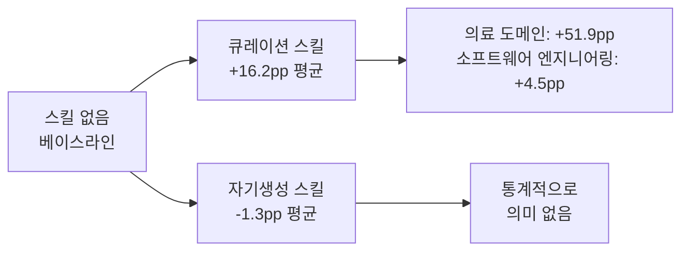
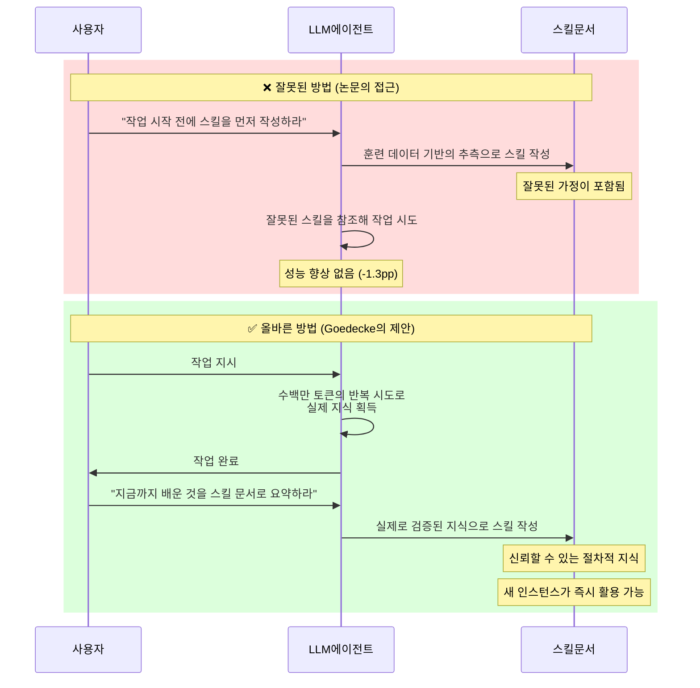
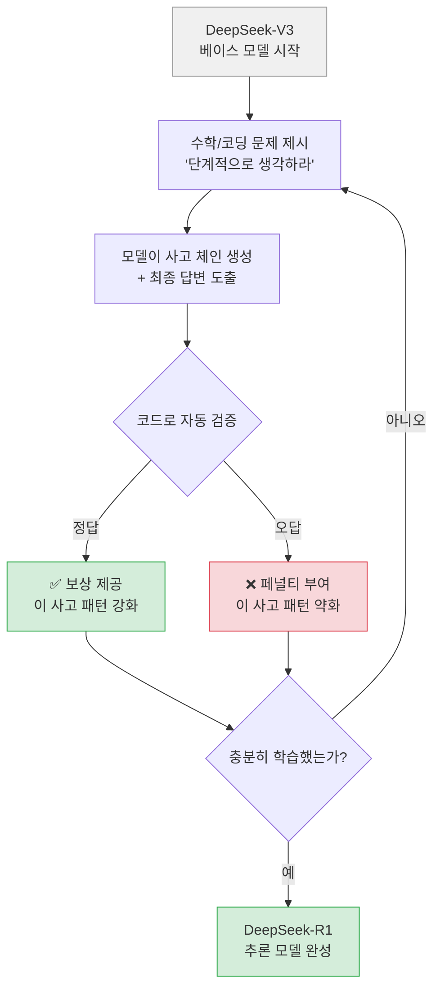
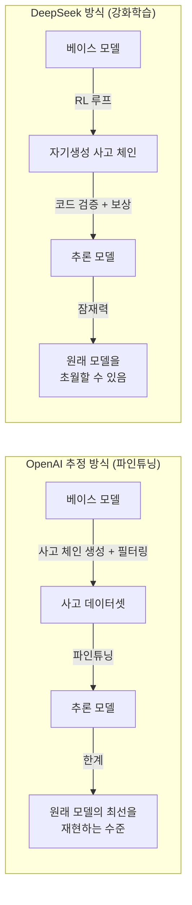
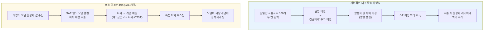
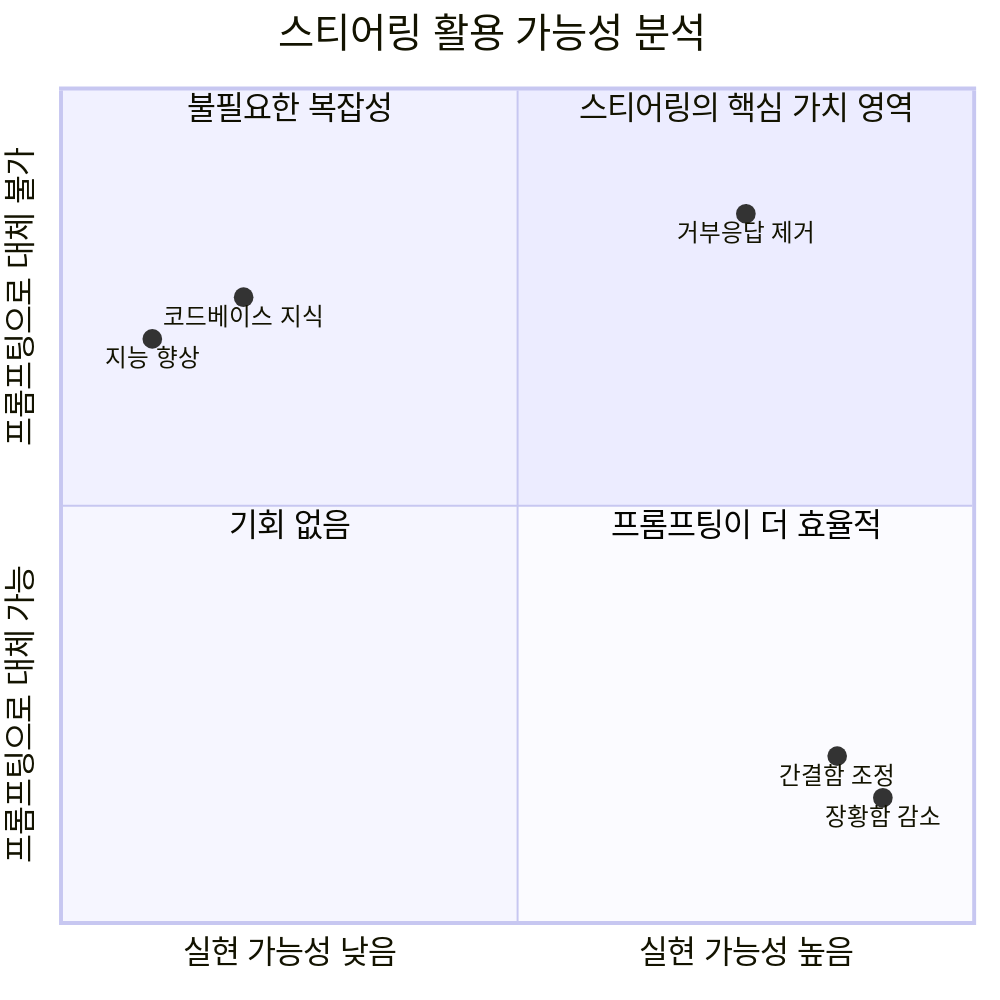
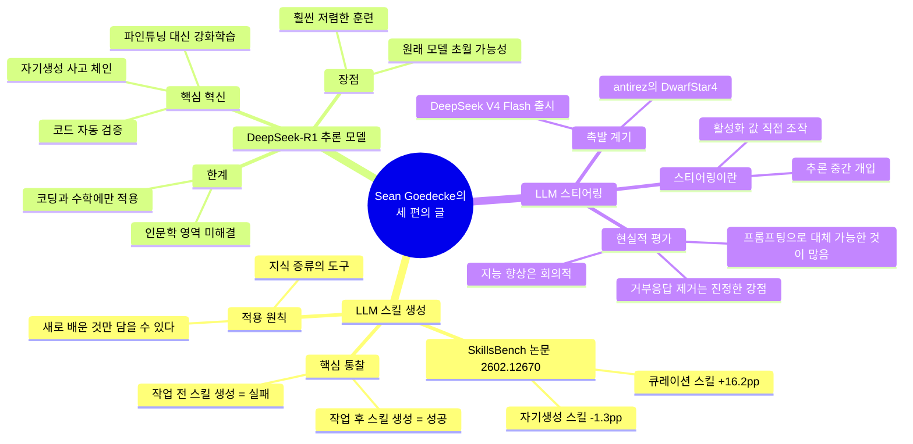

## Sean Goedecke의 AI 심층 분석 3편

> Sean Goedecke는 GitHub에서 AI 제품을 담당하는 엔지니어로, 기술적 깊이와 실용적 관점을 결합한 AI 분석 블로그(seangoedecke.com)를 운영하고 있다. 이 문서는 그의 세 편의 글을 통합적으로 정리하고 최신 정보를 보완한 것이다.

---

## 목차

1. [LLM이 스킬을 생성하는 올바른 순서 — 먼저가 아닌 나중에](#1-llm이-스킬을-생성하는-올바른-순서--먼저가-아닌-나중에)
2. [DeepSeek-R1이 발견한 것 — 강화학습으로 추론 모델 만들기](#2-deepseek-r1이-발견한-것--강화학습으로-추론-모델-만들기)
3. [DeepSeek V4 Flash와 LLM 스티어링의 귀환](#3-deepseek-v4-flash와-llm-스티어링의-귀환)
4. [세 편의 글이 말하는 것 — 통합적 시각](#4-세-편의-글이-말하는-것--통합적-시각)

---

## 1. LLM이 스킬을 생성하는 올바른 순서 — 먼저가 아닌 나중에

*원문: ["LLM-generated skills work, if you generate them afterwards"](https://www.seangoedecke.com/generate-skills-afterwards/) — February 17, 2026*

### 스킬(Skill)이란 무엇인가

LLM 에이전트 생태계에서 "스킬(Skill)"이란 특정 작업을 수행하기 위한 절차적 지식을 담은 짧은 설명 문서다. 보통 마크다운 형식으로 작성되며, 해당 작업에 필요한 도메인 지식, API 사용법, 코드 예시, 설치 방법 등을 포함한다. Anthropic의 Claude Code가 사용하는 SKILL.md 시스템이 대표적인 사례이며, OpenAI의 Codex CLI, Google의 Gemini CLI도 유사한 개념을 채용하고 있다.

스킬이 왜 유용한가? 모델의 기본 역량에는 한계가 있고, 특정 도메인(예: 특정 회사의 API, 특수 라이브러리, 독자적 코드베이스 관례)에 대한 지식은 사전학습 데이터에 포함되어 있지 않을 수 있다. 스킬은 이 간극을 메우는 역할을 한다. 일종의 "즉석 매뉴얼"로, 모델이 작업을 시작하기 전에 참조할 수 있도록 컨텍스트 창에 삽입된다.

### SkillsBench 논문이 드러낸 충격적인 결과

2026년 2월, arXiv에 게재된 SkillsBench 논문(논문 번호 2602.12670)은 LLM 스킬의 효과를 체계적으로 측정한 첫 번째 대규모 벤치마크다. 연구팀은 11개 도메인에 걸쳐 86개 과제를 설계하고, 7가지 에이전트-모델 조합으로 총 7,308개의 실행 궤적을 평가했다. 실험은 세 가지 조건으로 나뉘었다: 스킬 없음, 전문가가 직접 작성한 큐레이션 스킬, 그리고 모델이 스스로 생성한 스킬.

결과는 명확했다. 전문가가 작성한 큐레이션 스킬은 평균 통과율을 16.2 퍼센트포인트(pp) 끌어올렸다. 의료(Healthcare) 도메인에서는 무려 51.9pp가 향상되었다. 그런데 모델이 직접 생성한 스킬의 결과는 어떠했는가? 평균적으로 -1.3pp, 즉 사실상 효과가 없었다. 스킬이 없는 경우와 비교해도 통계적으로 의미 있는 차이가 없었다. 모델은 자신이 소비했을 때 도움이 되는 절차적 지식을, 스스로 신뢰성 있게 작성할 수 없었다.

부가적으로 흥미로운 발견도 있었다. 2~3개의 모듈로 구성된 집중적인 스킬이 방대한 종합 문서보다 효과적이었고, 스킬이 있는 소형 모델이 스킬 없는 대형 모델의 성능을 따라잡을 수 있었다.

### 논문이 사용한 방법의 문제점

Sean Goedecke는 논문 자체의 결론에 동의하면서도, 논문이 스킬을 생성하는 방식이 근본적으로 잘못되었다고 지적한다. 논문에서 모델에게 스킬을 생성하라고 지시한 프롬프트는 다음과 같다:

> "이 작업을 시작하기 전에, 다음 단계를 따르십시오: 1. 작업 요구사항을 분석하고 필요한 도메인 지식, API, 기법을 파악하십시오. 2. 이 작업을 해결하는 데 도움이 될 1~5개의 모듈식 스킬 문서를 작성하십시오..."

이 방법의 핵심 문제는 모델이 실제로 문제를 풀어보기 **전에** 스킬을 작성하도록 요구한다는 데 있다. 이는 본질적으로 "먼저 계획을 세워라" 혹은 "단계별로 생각하라"는 프롬프팅 전략의 기이한 변형에 불과하다. 그리고 현재의 추론 모델들은 이미 작업을 시작하기 전에 스스로 신중하게 생각하는 능력을 갖추고 있기 때문에, 이 방식이 추가적인 이점을 제공하지 못하는 것은 놀라운 일이 아니다.

모델이 작업을 시작하기 전에 스킬을 작성하면, 그 스킬에는 아직 발견하지 못한 잘못된 가정들이 그대로 담긴다. 모델이 이미 알고 있는 것, 즉 훈련 데이터에서 습득한 일반적인 지식만을 반영할 뿐이다.

### 올바른 접근법 — 사후 스킬 생성

Goedecke가 제안하는 해법은 단순하지만 강력하다. 스킬은 작업을 **완료한 후**에 생성해야 한다는 것이다.

그는 SAE(Sparse Autoencoder)와 오픈소스 모델의 피처 클램핑 실험을 직접 진행한 사례를 예로 든다. Codex를 사용해 8B 파라미터 모델이 특정 주제(예: "영화관 가기")에 집착하도록 강제하는 실험이었다. 이 과정에서 Codex가 수백만 개의 토큰에 달하는 반복 시도를 통해 파악한 핵심 지식들이 있었다:

- 피처를 추출할 때 마지막 레이어정규화(LayerNorm)는 너무 늦다 — 그 단계에서 추출하면 추론 중 샘플링 시 개별 로짓을 직접 높이는 것과 다를 바 없다
- 유용하게 클램핑할 수 있는 피처를 얻으려면 모델 레이어의 대략 중간 지점에서 추출해야 한다
- SAE를 약 1만 개의 활성화 값으로 훈련하는 것은 유용한 피처를 얻기에 두 자릿수 배(two orders of magnitude)나 부족하다 — 피처가 분산의 50% 이상을 설명할 때까지 훈련을 계속해야 한다

이 모든 것을 파악한 이후, Goedecke는 Codex에게 이 과정을 에이전트 스킬 문서로 요약해달라고 요청했다. 결과는 훌륭했다. 새로운 Codex 인스턴스가 그 스킬을 참조해 다른 8B 모델에서 즉시 클램핑을 구현할 수 있었다. 그러나 만약 처음에 스킬을 작성했다면, 잘못된 가정들(마지막 LayerNorm에서의 추출 등)이 그대로 문서화되었을 것이다.

### 스킬 생성의 본질적 목적

이 통찰이 중요한 이유는 LLM이 생성한 스킬의 본래 목적에 대한 재정의를 요구하기 때문이다. LLM이 생성한 스킬의 가치는 모델이 이미 훈련 데이터에서 알고 있는 것을 문서화하는 데 있는 것이 아니다. 그 가치는 모델이 수백만 개의 토큰에 달하는 반복적 시도를 통해 어렵게 획득한 지식을 증류(distillation)하는 데 있다. 이 구분을 이해하지 못하면, 사전 스킬 생성이 아무런 효과가 없다는 논문의 결론을 보고 "LLM은 스킬을 잘 생성하지 못한다"는 잘못된 결론을 내리게 된다.

실제로 LLM은 스킬을 잘 생성할 수 있다. 단지 올바른 순서로 해야 할 뿐이다.

---

## 2. DeepSeek-R1이 발견한 것 — 강화학습으로 추론 모델 만들기

*원문: ["What did DeepSeek figure out about reasoning with DeepSeek-R1?"](https://www.seangoedecke.com/deepseek-r1/) — January 26, 2025*

### 추론 모델이란 무엇인가

일반적인 LLM은 프롬프트를 받아 다음 토큰을 예측하는 방식으로 작동한다. 모델이 "생각"하는 데 걸리는 시간, 즉 행렬 연산에 소요되는 계산량은 토큰 하나를 생성할 때마다 동일하다. 그 결과, 모델이 더 많은 말을 생성할수록 더 많은 "생각 시간"을 갖게 되고, 결과적으로 더 나은 답변이 나오는 경향이 있다. "단계별로 생각하라"거나 "추론 과정을 먼저 서술하라"는 프롬프팅 기법이 효과적인 이유가 바로 여기에 있다.

추론 모델은 이 행동 방식을 모델 자체에 내재화하려는 시도다. 모델에게 별도로 단계적 사고를 요청하지 않아도, 항상 심층적인 추론 과정을 거치도록 훈련된 모델이다.

### OpenAI식 접근법의 추정 과정

OpenAI가 자사의 o1 시리즈를 어떻게 훈련했는지는 영업 비밀이다. Goedecke는 이를 인정하면서도 가능한 접근 방식을 추정한다. 그의 추정에 따르면 OpenAI의 접근 방식은 다음과 같은 단계를 포함할 가능성이 높다.

먼저 GPT-4o와 같은 강력한 베이스 모델에서 출발한다. 그 다음, 다양한 문제에 대해 "단계별로 생각하라"는 지시와 함께 수십억 개에 달하는 사고 체인(chain-of-thought)을 생성한다. 이 사고 체인들 중 잘못된 답변을 내놓는 것들을 필터링한다(다른 모델을 통해, 혹은 자동화된 검증 방식으로). 마지막으로 이 방대한 데이터로 베이스 모델을 파인튜닝해, 항상 사고 체인을 통해 응답하도록 만든다.

이 방식의 약점은 비용이다. 파인튜닝 자체도 대규모 훈련이지만, 그보다 앞선 사고 체인 생성 및 필터링 단계가 막대한 자원을 소비한다. 고성능 모델에 대한 무제한적 접근이 필요하고, 대용량의 고품질 데이터를 생성하기 위한 충분한 시간이 필요하다.

### DeepSeek-R1의 핵심 혁신 — 강화학습

DeepSeek의 접근 방식은 근본적으로 다르다. 이들은 파인튜닝 방식을 사용하지 않고, 강화학습(Reinforcement Learning, RL) 루프를 채택했다. 기술적으로 정확히 말하면, 이것은 DeepSeek-R1-Zero라는 중간 모델을 설명하는 것이지만, 핵심 혁신의 본질은 동일하다.

DeepSeek의 과정은 다음과 같다. DeepSeek-V3와 같은 강력한 베이스 모델에서 시작한다. 이 모델에게 수학 문제를 단계별로 생각하면서 풀도록 요청한다. 그 답이 맞는지 **코드로 직접 검증한다** — 다른 모델을 사용하지 않고, 답을 파싱해 자동으로 확인한다. 답이 맞으면 모델에게 보상을 주고, 틀리면 페널티를 준다. 이 과정을 오랫동안 반복한다.

이 방식이 혁신적인 이유는 두 가지다. 첫째, 사전에 대규모 사고 체인 데이터셋을 구축할 필요가 없다 — 모델이 훈련하면서 스스로 사고 체인을 생성한다. 둘째, 답변의 정확성을 검증하는 데 다른 비싼 모델이 필요 없다 — 수학이나 코딩 문제는 코드로 자동 검증이 가능하기 때문이다.

### 비용 우위와 품질 우위의 가능성

DeepSeek-R1 논문에서 Goedecke가 가장 중요하다고 판단하는 지점은 이 강화학습 접근법이 단순히 저렴할 뿐 아니라 **잠재적으로 더 높은 품질을 달성할 수 있다는 가능성**이다.

OpenAI의 추정된 파인튜닝 방식은 원래 베이스 모델이 보인 최선의 순간을 재현하는 데 그친다. 모델은 이미 존재하는 추론 단계들을 학습해 예측하는 것이기 때문이다. 반면 DeepSeek의 강화학습 방식에서 모델은 계속 학습하면서 오직 결론의 품질만으로 평가받는 완전히 새로운 추론 체인을 스스로 생성할 수 있다. 이론적으로 이 방식은 원래 베이스 모델의 역량을 훨씬 뛰어넘는 추론 능력을 달성할 수 있다. 체스의 AlphaZero가 인간의 기보를 학습하는 대신 자기 대국을 통해 인간을 초월한 방식과 유사하다.

### 한계와 미해결 과제

Goedecke는 DeepSeek 방식이 무조건 우월하다고 주장하지 않는다. 이 방식의 본질적 제약은 코드로 자동 검증 가능한 문제에만 적용할 수 있다는 것이다. 수학 문제나 코딩 과제는 답의 정오를 기계적으로 판별할 수 있지만, 법률 분석, 논리 퀴즈, 인문학적 추론, 창의적 글쓰기 같은 영역은 그렇지 않다.

이 제약이 중요하지 않을 수도 있다는 이론적 가능성은 있다 — 수학과 코딩에서의 초지능이 다른 영역으로 전이될 수 있다는 것이다. 일반 모델에서는 코드 학습이 비코드 영역의 성능도 개선하는 현상이 실제로 관찰된 바 있다. 그러나 이것이 추론 모델에서도 마찬가지로 성립한다는 것은 아직 실험적으로 증명되지 않았다.

또한 이 접근법이 지금 시점에서야 가능해진 이유에 대해 Goedecke는 흥미로운 분석을 제시한다. 가장 설득력 있는 설명은 베이스 모델의 추론 능력이 강화학습을 통해 추론 모델로 발전시킬 수 있을 만큼 충분히 성숙해진 것이 최근의 일이라는 것이다. 일 년 전이라면 베이스 모델 자체가 충분하지 않았을 것이다.

---

## 3. DeepSeek V4 Flash와 LLM 스티어링의 귀환

*원문: ["DeepSeek-V4-Flash means LLM steering is interesting again"](https://www.seangoedecke.com/steering-vectors/) — May 16, 2026*

### 스티어링이란 무엇인가

Golden Gate Claude 실험(Anthropic, 2024)에서 세상에 처음 드라마틱하게 소개된 "스티어링(steering)"은 LLM의 추론 과정 중간에 모델의 내부 활성화 값을 직접 조작함으로써 출력을 특정 방향으로 유도하는 기법이다.

Golden Gate Claude 실험에서 Anthropic의 연구자들은 Claude가 모든 대화를 샌프란시스코의 금문교 이야기로 끌어당기도록 모델의 내부를 조작했다. 모델은 인식하지도 못한 채 마치 강박적인 집착처럼 끊임없이 금문교를 언급했다. 이 실험은 스티어링이 프롬프팅과 완전히 다른 차원의 개입이라는 것을 생생하게 보여주었다.

### 스티어링의 두 가지 방법

스티어링 벡터를 만드는 방법은 크게 두 가지가 있다.

**기본적인 대조 활성화 방식**이 첫 번째다. 동일한 100개의 프롬프트를 두 번씩 모델에 입력한다. 한 번은 원래 프롬프트 그대로, 다른 한 번은 "간결하게 응답하라"는 지시를 덧붙인 채로. 그런 다음 각 프롬프트 쌍에서 모델의 활성화 값 차이를 측정한다(한 활성화 행렬에서 다른 것을 빼는 방식으로). 이것이 "스티어링 벡터"다. 이론적으로 이 벡터를 어떤 프롬프트에서든 동일한 활성화 레이어에 더하면 같은 효과(간결하게 응답하는 것)를 얻을 수 있다.

**희소 오토인코더(Sparse Autoencoder, SAE) 방식**이 두 번째다. 이것은 모델의 활성화 값에서 "피처(feature)"를 추출하는 별도의 모델을 훈련하는 방식으로, 함께 나타나는 행동 패턴을 포착한다. 그런 다음 이 피처들을 개별 개념에 다시 매핑하고 같은 방식으로 부스팅한다. Anthropic이 해석 가능성(interpretability) 연구에서 사용하는 SAE 방식이 이것이다. 기본 방식과 원리는 같지만, 훨씬 더 깊은 패턴을 포착할 수 있다. 대신 시간, 연산, 전문 지식이 훨씬 많이 필요하다.

### 왜 스티어링이 매력적인가

스티어링은 마치 치트키처럼 들린다. 특정 방향의 훈련 데이터셋을 조심스럽게 조립하는 대신, 왜 직접 모델의 뇌 속에 있는 "지능" 다이얼을 찾아 오른쪽으로 끝까지 돌리지 않는가? 모델의 말투를 조정하는 데 있어서도, 프롬프트에 한정어를 덧붙이는 대신 "간결함/장황함"이나 "신중함/속도"와 같은 슬라이더 컨트롤 패널을 두고 직접 조절할 수 있다면 얼마나 우아하겠는가?

그리고 스티어링은 그냥 **흥미롭다**. Golden Gate Claude가 모든 문장을 금문교로 끌어당기는 모습을 보면, 올리버 색스의 신경학적 임상 사례를 읽을 때와 비슷한 매혹과 불안함을 동시에 느끼게 된다. 당신 자신의 정신이 이런 방식으로 조작된다면 그것은 여전히 당신이라고 할 수 있을까?

### 왜 스티어링이 지금까지 제대로 활용되지 않았는가

그렇다면 ChatGPT나 Claude Code에는 왜 이미 스티어링 컨트롤 패널이 없는 것인가? Goedecke는 스티어링이 불행하게도 AI 연구에서 "중산층" 아이디어에 속한다고 설명한다.

대형 AI 연구소들에게 스티어링은 굳이 할 필요가 없는 일이다. 이들은 추론 중간에 어색한 뇌수술을 하는 것보다 모델을 직접 훈련하는 방식으로 원하는 행동을 만들어낼 수 있다. Anthropic은 스티어링 관련 연구를 하고 있지만, 주로 해석 가능성(interpretability)과 안전성의 관점에서다.

반대로 일반 AI 사용자들에게는 스티어링이 너무 멀리 있는 일이다. API를 통해 LLM을 사용하는 사람들은 모델 가중치나 활성화 값에 접근할 수 없다. GPT-5.5의 스티어링 벡터를 식별하거나 노출할 수 있는 것은 OpenAI뿐이다. 오픈소스 모델에서는 스티어링이 가능하지만, 최근까지는 이 작업이 의미 있을 만큼 강력한 오픈소스 모델이 존재하지 않았다.

무엇보다, 대부분의 기본적인 스티어링 적용 사례는 그냥 모델에게 요청하는 것(프롬프팅)으로 더 간단히 해결된다. "간결하게 응답하라"는 스티어링 벡터를 적용하는 것이나, "간결하게 응답하라"고 프롬프트에 쓰는 것이나 결과에서 큰 차이가 없다면, 굳이 복잡한 스티어링을 할 이유가 없다.

### DeepSeek V4 Flash — 게임 체인저의 등장

이 모든 상황을 바꾸고 있는 것이 2026년 4월 24일에 출시된 DeepSeek V4 Flash다.

DeepSeek V4는 MoE(Mixture of Experts) 아키텍처의 두 가지 모델로 구성된다. V4 Pro는 총 1.6조 파라미터(활성 490억 파라미터)의 플래그십 모델이고, V4 Flash는 총 2,840억 파라미터(활성 130억 파라미터)의 경량 모델이다. 두 모델 모두 100만 토큰의 컨텍스트 창을 지원하며 MIT 라이선스로 공개되었다. 가격 면에서 Flash는 입력 100만 토큰당 $0.14, 출력 100만 토큰당 $0.28로 대형 프론티어 모델 대비 약 90배 저렴하다.

Goedecke가 V4 Flash에 주목하는 이유는 그것이 아마도 많은 엔지니어들이 기다려온 것, 즉 **에이전트 코딩에서 프론티어 모델의 하위 수준과 경쟁할 수 있는 로컬 모델**이기 때문이다. 스티어링은 로컬 모델이 필요한 기술이다. V4 Flash의 등장으로 많은 엔지니어들이 처음으로 스티어링을 실질적으로 시도할 수 있게 되었다.

이 맥락에서 antirez(Redis 창시자 Salvatore Sanfilippo)의 DwarfStar 4(DS4) 프로젝트가 중요하다. DS4는 DeepSeek V4 Flash만을 위해 최적화된 llama.cpp의 경량 포크로, 스티어링이 핵심 기능으로 내장되어 있다. 2026년 5월 초에 공개된 이 프로젝트는 Metal(Apple Silicon)과 CUDA 두 백엔드를 지원하도록 진화했으며, 스티어링 벡터를 추론 중 다양한 시점에 적용할 수 있는 기능을 구현했다.

### 프롬프팅으로 대체할 수 없는 것들

Hacker News에서의 토론(게시물 ID: 48160807)에서 antirez를 포함한 여러 댓글러들이 Goedecke의 원고 이후 발표한 중요한 추가 관점이 있다. 스티어링이 프롬프팅으로 할 수 없는 영역이 있다는 것이다 — 바로 모델에 학습으로 내재화된 행동(예: 거부 응답, refusal)을 제거하는 것이다.

모델의 거부 행동은 훈련을 통해 깊이 내재화된 것으로, 프롬프팅으로는 제거할 수 없다. 그러나 스티어링으로는 이것이 가능하다. 실제로 오픈소스 모델에서 "검열 해제(uncensoring)" 혹은 "abliteration"이라 불리는 작업이 이미 스티어링 방식으로 이루어지고 있다고 한다(기존에는 LoRA 파인튜닝으로 이루어진다고 알려졌으나, 스티어링 방식이 실제 활용되고 있었음이 드러났다). 그리고 antirez는 가중치를 직접 수정하는 방식보다 런타임 스티어링이 모델 역량 손상을 덜 일으킨다고 지적했다. 필요한 순간에만 적용할 수 있기 때문이다.

### 스티어링의 한계 — 냉정한 평가

Goedecke는 스티어링에 매혹되어 있으면서도 냉정한 평가를 유지한다. 그는 두 가지 잠재적으로 유용한 스티어링 시나리오를 분석하고 모두 회의적인 결론을 내린다.

첫째, "지능" 스티어링 벡터를 찾을 수 있는가라는 질문이다. 프롬프팅으로는 더 이상 효과가 없는 이 개념을 스티어링으로 찾아낼 수 있을까? Goedecke는 회의적이다. "지능"처럼 복잡한 개념에 해당하는 스티어링 벡터는 모델의 전체 가중치 집합과 거의 동일한 범위를 차지할 가능성이 높고, 따라서 이를 식별하는 것은 "스마트한 모델을 훈련하는 문제"를 해결하는 것으로 귀결된다.

둘째, 스티어링이 데이터 압축 도구로 기능할 수 있는가라는 질문이다. 예컨대 "내 코드베이스에 대한 지식" 개념을 스티어링 벡터로 만들 수 있다면, 컨텍스트 창을 크게 절약할 수 있다. 그러나 이 역시 "코드베이스 파인튜닝"의 수준에 해당하는 복잡도를 요구할 것으로 예상되어 현실적이지 않을 가능성이 높다.

Goedecke의 전반적인 결론은 신중한 낙관론에 가깝다기보다 합리적 회의론에 가깝다. 대부분의 스티어링 적용 사례는 프롬프팅으로 더 효율적으로 재현될 수 있으며, 더 야심 찬 스티어링 목표는 모델 훈련이나 파인튜닝으로 더 효율적으로 달성될 수 있다. 그러나 오픈소스 커뮤니티가 스티어링에 본격적으로 달려들기 시작했으며, V4 Flash의 등장으로 그 가능성의 진위가 앞으로 6개월 안에 판명될 것이라고 그는 전망한다.

---

## 4. 세 편의 글이 말하는 것 — 통합적 시각

세 편의 글은 서로 다른 주제를 다루고 있지만, 관통하는 하나의 사유가 있다.

### "무엇을 아느냐"보다 "어떻게 배우느냐"

스킬 생성의 논점은 모델이 훈련 데이터에서 이미 알고 있는 것의 가치가 아니라, 반복적 시도를 통해 새로 획득한 지식의 가치에 있다. DeepSeek-R1의 혁신도 사전에 준비된 사고 체인 데이터셋이 아니라, 모델이 스스로 생성한 새로운 추론 체인의 가치에 있다. 스티어링에 대한 회의론도, 모델이 이미 알고 있는 것에 접근하는 방식의 한계를 지적하는 것이다.

세 편의 글은 모두 LLM의 알고 있는 것과 발견하는 것 사이의 긴장에 대한 이야기다.

### 오픈소스 생태계가 열어가는 가능성

DeepSeek V4 Flash는 단순한 모델 출시 이상의 의미를 갖는다. 강력한 로컬 추론 모델의 등장은 스티어링 연구를 대형 AI 연구소의 전유물에서 커뮤니티 전체의 탐구 영역으로 바꾸어놓는다. SkillsBench 논문이 보여준 것처럼, 스킬 시스템의 설계 방식도 커뮤니티 차원의 표준화와 최적화 여지가 크다. DeepSeek-R1이 증명한 강화학습 방식의 추론 모델 훈련도, 오픈소스 베이스 모델의 역량이 충분히 성숙했을 때 비로소 가능해진 것이다.

세 가지 주제 모두, 오픈소스 생태계의 역량 성숙이 새로운 가능성의 문을 열고 있다는 것을 가리키고 있다.

---

## 부록 — 주요 용어 정리

**LLM 스킬(Skill)**: 에이전트가 특정 작업을 수행할 때 참조하는 마크다운 형식의 절차적 지식 문서. 도메인 지식, 코드 예시, API 사용법 등을 포함한다.

**사고 체인(Chain-of-Thought, CoT)**: 최종 답변에 도달하기 전에 단계별로 추론 과정을 서술하는 방식. 모델의 성능을 향상시키는 것으로 알려져 있다.

**강화학습(Reinforcement Learning, RL)**: 모델이 행동을 취하고 그 결과에 따라 보상 또는 페널티를 받으며 스스로 학습하는 방식. DeepSeek-R1의 핵심 훈련 방법이다.

**희소 오토인코더(Sparse Autoencoder, SAE)**: 모델의 내부 활성화 값에서 의미 있는 패턴(피처)을 추출하도록 훈련된 별도의 작은 모델.

**스티어링 벡터(Steering Vector)**: 특정 개념이나 행동 방향에 해당하는 모델 내부의 방향 벡터. 추론 중에 활성화 값에 더해져 모델의 출력을 특정 방향으로 유도한다.

**MoE(Mixture of Experts)**: 모델의 전체 파라미터 중 일부만 각 토큰 생성 시 활성화되는 아키텍처. 전체 파라미터 수 대비 실제 계산량을 크게 줄일 수 있다.

**피처 클램핑(Feature Clamping)**: SAE로 추출한 특정 피처의 값을 강제로 높이거나 낮추어 모델의 행동을 특정 방향으로 고정하는 기법.

---
