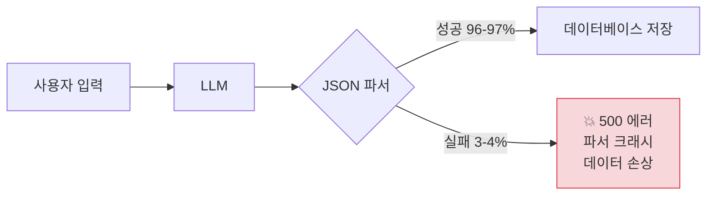
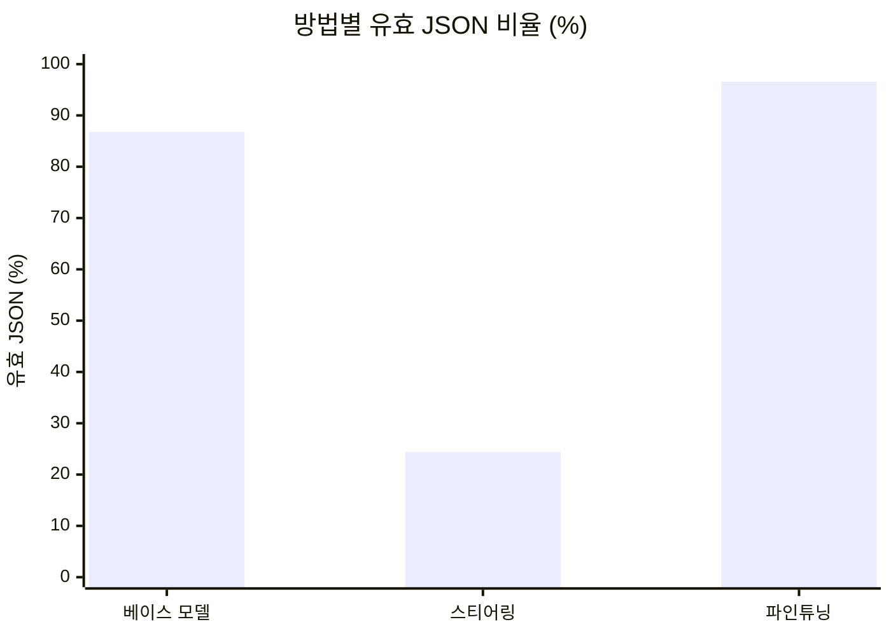
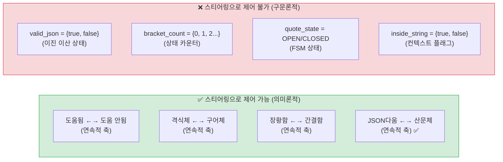
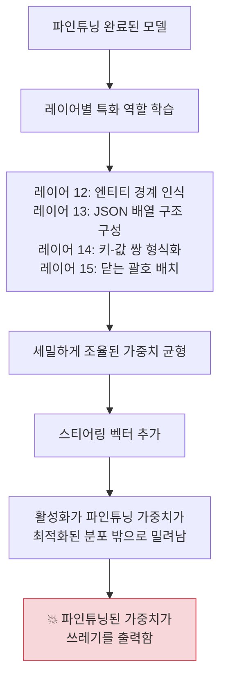
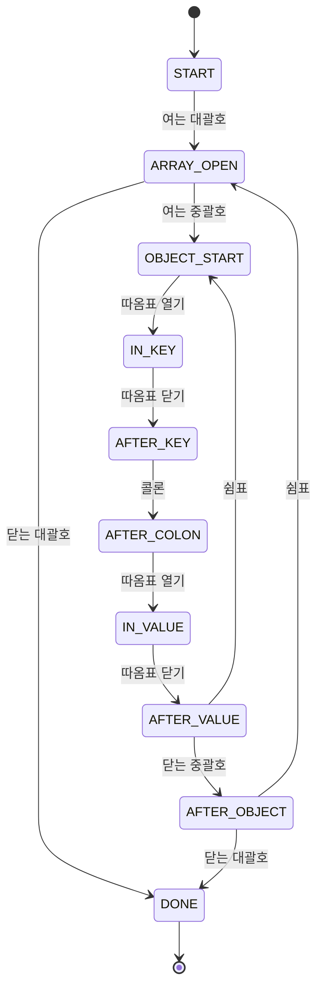
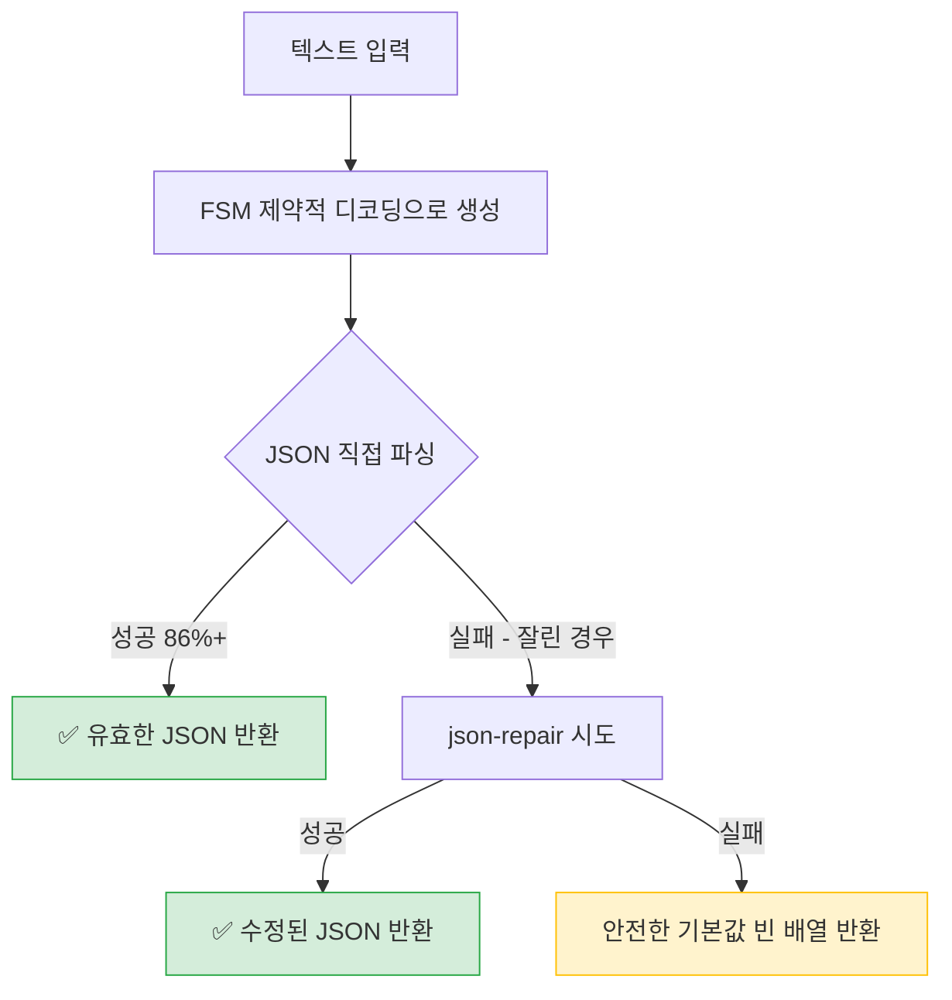
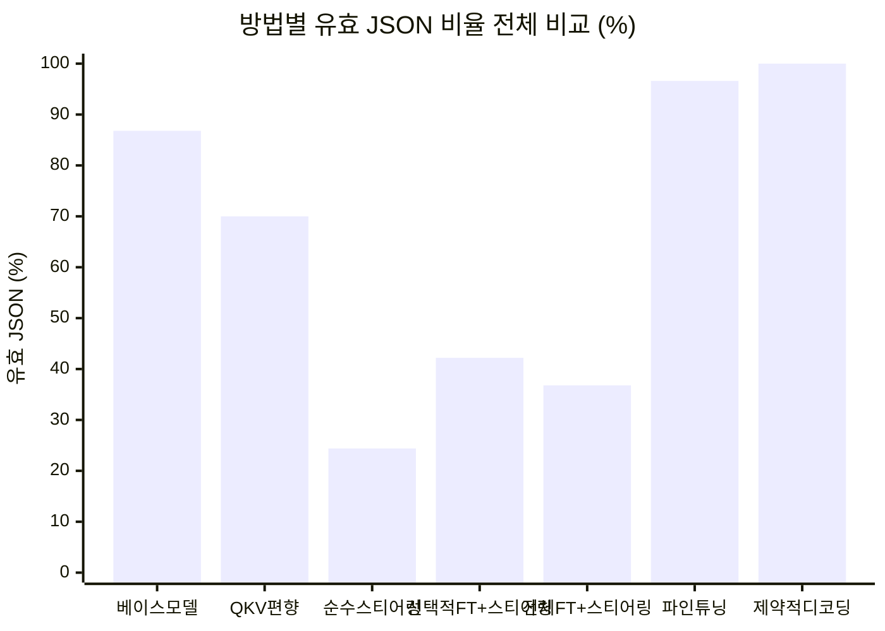
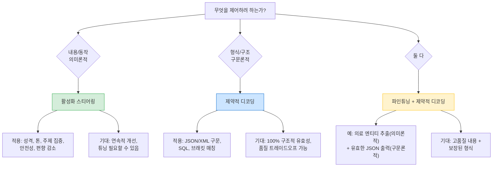

## Maziyar Panahi의 6가지 실험 — 86.8%에서 24.4%로의 추락, 그리고 100% 달성까지

> Maziyar Panahi는 Hugging Face에서 활동하는 머신러닝 엔지니어다. 이 글은 그가 2026년 2월 7일 Hugging Face 블로그에 공개한 커뮤니티 아티클을 상세하게 분석한 것으로, 공개된 원문과 관련 최신 자료를 바탕으로 작성되었다.
> 
> 원문: https://huggingface.co/blog/MaziyarPanahi/sae-steering-json

---

## 목차

1. [이 실험이 다루는 핵심 질문](#1-이-실험이-다루는-핵심-질문)
2. [배경 — 스티어링이란 무엇이고, 왜 매력적으로 보였는가](#2-배경--스티어링이란-무엇이고-왜-매력적으로-보였는가)
3. [실험 설계 — 과제와 베이스라인](#3-실험-설계--과제와-베이스라인)
4. [실험 1 — QKV 프로젝션 편향 조작 (주의 집중 제어 시도)](#4-실험-1--qkv-프로젝션-편향-조작-주의-집중-제어-시도)
5. [실험 2 — 파인튜닝으로 상한선 파악](#5-실험-2--파인튜닝으로-상한선-파악)
6. [실험 3 — 순수 스티어링만 적용한 결과 (재앙)](#6-실험-3--순수-스티어링만-적용한-결과-재앙)
7. [왜 Anthropic의 스티어링은 성공하고 JSON 생성은 실패했는가](#7-왜-anthropic의-스티어링은-성공하고-json-생성은-실패했는가)
8. [실험 4 — 파인튜닝과 스티어링을 결합하면?](#8-실험-4--파인튜닝과-스티어링을-결합하면)
9. [실험 5 — 실제로 작동한 것 (제약적 디코딩)](#9-실험-5--실제로-작동한-것-제약적-디코딩)
10. [실험 6 — 의미론적 작업에서는 스티어링이 작동하는가?](#10-실험-6--의미론적-작업에서는-스티어링이-작동하는가)
11. [전체 결과 비교 및 교훈](#11-전체-결과-비교-및-교훈)
12. [2026년 현재의 구조화 출력 생태계](#12-2026년-현재의-구조화-출력-생태계)

---

## 1. 이 실험이 다루는 핵심 질문

Anthropic이 Claude를 "Golden Gate Claude"로 만든 SAE 스티어링 기법이 있다. 이 기법은 모델의 내부 활성화 값을 직접 조작해 모델이 금문교에 집착하게 만들었다. 더 나아가 모델의 안전성 행동, 편향, 성격을 조절하는 데도 활용되었다.

그렇다면 같은 기법을 사용해 LLM이 항상 유효한 JSON을 생성하도록 만들 수 있을까?

Maziyar Panahi는 이 질문을 가지고 6가지 실험을 설계했다. 결론부터 말하면, 스티어링은 JSON 생성에 처참하게 실패했다. 아무것도 하지 않은 베이스 모델(86.8% 유효 JSON)보다 훨씬 나쁜 24.4%까지 떨어뜨렸다. 그러나 이 실패의 원인을 파악하는 과정에서, LLM을 제어하는 두 가지 근본적으로 다른 접근법의 차이가 명확하게 드러났다.

---

## 2. 배경 — 스티어링이란 무엇이고, 왜 매력적으로 보였는가

### 활성화 스티어링의 원리

LLM은 입력 토큰을 받아 여러 레이어를 거치며 내부 표현(활성화 값, activation)을 변환하고 최종적으로 다음 토큰의 확률 분포를 출력한다. 활성화 스티어링은 이 레이어들 사이를 흐르는 내부 표현을 추론(inference) 도중 직접 조작하는 기법이다. 가중치(파인튜닝)를 바꾸거나 입력 텍스트(프롬프팅)를 수정하는 것이 아니라, 정보가 네트워크를 통과하는 중간 과정에 개입하는 것이다.

수학적으로는 매우 단순하다.

```
h̃ = h + α · v_steer

h     = 특정 레이어의 원래 활성화 벡터
v_steer = 스티어링 방향 벡터 (예시 쌍에서 계산)
α     = 스티어링 강도 (스칼라 배수)
```

스티어링 벡터를 구하는 가장 기본적인 방법은 **대조 활성화(contrastive activation)** 방식이다. 동일한 프롬프트를 두 가지 조건(예: 원래 프롬프트 / "간결하게 응답하라"를 붙인 프롬프트)으로 모델에 입력해 활성화 값의 차이를 측정한다. 이 차이가 스티어링 벡터가 된다.

Anthropic은 이보다 정교한 희소 오토인코더(Sparse Autoencoder, SAE) 방식을 사용해 Claude 3 Sonnet의 활성화에서 약 3,400만 개의 해석 가능한 피처를 추출했다. "Golden Gate Bridge"라는 개념에 해당하는 피처를 최대로 활성화시키자 Claude는 모든 대화를 금문교로 연결하기 시작했다.

### 왜 JSON 생성에 적용하려 했는가

이 기법은 다음과 같은 이유에서 JSON 생성의 문제를 해결할 완벽한 도구처럼 보였다. 파인튜닝 없이 모델 동작을 바꿀 수 있고, 여러 스티어링 벡터를 조합할 수 있으며, 추론 시점에 강도를 조절할 수 있다. "JSON처럼 구조적으로 응답하라"는 방향으로 스티어링하면 되지 않을까?

---

## 3. 실험 설계 — 과제와 베이스라인

### 과제 설정

Panahi가 선택한 과제는 텍스트에서 개인 식별 정보(Personally Identifiable Information, PII)를 추출해 엄격한 JSON 형식으로 출력하는 것이었다.

- **모델**: Qwen/Qwen2.5-0.5B (4억 9,400만 파라미터, 디코더 전용 아키텍처)
- **데이터셋**: Nemotron-PII (30,000개 샘플, 이메일·이름·주소·SSN·의료기록 등 55가지 PII 엔티티 유형)
- **목표 출력 형식**: 아래와 같은 배열 형태의 JSON

```json
[
  {"text": "john@example.com", "label": "email"},
  {"text": "John Doe", "label": "name"},
  {"text": "555-1234", "label": "phone_number"}
]
```

- **목표**: 유효 JSON 비율 ≥ 99.9%, 높은 F1 점수 유지

### 베이스라인 성능 (훈련되지 않은 모델)

| 지표 | 결과 |
|------|------|
| 유효 JSON 비율 | 86.8% |
| Micro F1 | 7.7% |

훈련 없이도 86.8%의 유효 JSON이 나온다는 점이 중요하다. 이 모델은 사전학습 데이터에서 JSON 구조를 어느 정도 익히고 있다.

### 왜 3~4%의 실패율이 문제인가

프로덕션 시스템에서 LLM의 출력은 자동으로 파싱된다. 3~4%의 실패율은 단순히 "가끔 이상한 답"이 아니다. 파서 크래시, API 호출 실패, 데이터 조용한 손상(silent corruption)을 의미한다. 이것이 새벽 3시에 온콜 엔지니어를 깨우는 원인이 된다.



---

## 4. 실험 1 — QKV 프로젝션 편향 조작 (주의 집중 제어 시도)

### 아이디어

주의(Attention) 레이어의 편향(bias) 파라미터를 영구적으로 수정해 "JSON다움" 방향을 모델에 구워 넣으면 어떨까? 추론 시점에 오버헤드 없이, 항상 JSON에 유리한 방향으로 동작하게 만드는 것이다.

구체적으로 24개 레이어 중 중간 부분인 12~15번 레이어의 쿼리(Query), 키(Key), 값(Value) 프로젝션 편향을 수정했다. 좋은 JSON과 불량 JSON 예시 쌍에서 스티어링 벡터를 추출하고, 그 차이를 편향에 추가하는 방식이다.

```
b̃_proj = b_proj + W_proj @ v · α
```

α(스티어링 강도)는 {0.1, 0.5, 1.0, 2.0}으로 테스트했다.

### 결과

유효 JSON 비율 약 70%(추정), Micro F1 약 20%(추정). 베이스라인보다 나쁜 결과가 나왔다.

### 왜 실패했는가

**첫째, 프로젝션 행렬 희석(Projection Matrix Dilution)** 문제다. 스티어링 벡터가 프로젝션 행렬 W_proj와 곱해지면서 32개의 주의 헤드 전체에 신호가 분산된다. "JSON 구조"라는 집중된 방향이 희석된 의미론적 잡음으로 변해버린다.

**둘째, 잘못된 제어 대상(Wrong Substrate)** 문제다. 주의 편향은 모델이 입력의 어느 부분에 집중하는지를 제어한다. 출력을 어떻게 형식화할지를 제어하지 않는다. JSON 문법 오류를 고치려고 주의력을 조정하는 것은, 글쓰기 문법을 교정하려고 시선이 가는 방향을 바꾸는 것과 같다.

**셋째, 정적 해법과 동적 문제의 불일치(Static vs. Dynamic)** 문제다. JSON 생성은 맥락에 따라 달라지는 결정이 필요하다. "여기에 쉼표를 추가해야 하는가?"는 배열 안의 현재 위치에 달려 있다. "닫는 괄호가 필요한가?"는 중첩 깊이에 달려 있다. 정적인 편향 수정은 이런 상태 의존적 결정을 내릴 수 없다.

---

## 5. 실험 2 — 파인튜닝으로 상한선 파악

더 복잡한 스티어링 실험에 시간을 쏟기 전에, 먼저 근본적인 질문을 확인했다. **이 모델이 이 작업을 학습할 능력이 있는가?**

### 방법

표준 지도 학습 파인튜닝을 적용했다.

- Nemotron-PII에서 1,000개 훈련 샘플 사용
- 전체 파라미터 파인튜닝 (4억 9,400만 개 파라미터 전체)
- 3 에포크, 학습률 2e-5
- NVIDIA A100 GPU 단일 장비에서 약 30분 소요

스티어링 없음. 트릭 없음. 순수한 경사 하강법.

### 결과

| 지표 | 점수 |
|------|------|
| 유효 JSON 비율 | 96.6% |
| Micro Precision | 0.944 |
| Micro Recall | 0.867 |
| **Micro F1** | **0.912** |
| Macro F1 | 0.819 |

모델은 충분한 학습 능력을 갖추고 있음이 확인되었다.

이 결과가 중요한 것은 세 가지를 동시에 증명하기 때문이다. 모델이 JSON 형식을 학습할 수 있다는 것, PII 엔티티를 정확하게 추출할 수 있다는 것, 그리고 4억 9,400만 파라미터가 이 작업에 충분한 용량이라는 것이다.

그런데 이 결과가 오히려 중요한 의문을 제기한다. 파인튜닝이 이렇게 잘 작동한다면, 왜 스티어링이 필요한가?

---

## 6. 실험 3 — 순수 스티어링만 적용한 결과 (재앙)

### 아이디어

훈련을 완전히 건너뛰고 순수하게 추론 시점의 활성화 조작만 사용한다면 어떨까? 스티어링의 가장 순수한 테스트다.

### 방법

100개의 대조 예시 쌍을 수집했다.

- 긍정(Positive): 올바르게 형성된 JSON + 정확한 PII 추출
- 부정(Negative): 잘못된 JSON 또는 부정확한 추출

스티어링 벡터를 계산한다.

```python
v_steer = mean(activations_positive) - mean(activations_negative)
```

추론 중 12~15번 레이어의 잔차 스트림에 벡터를 추가한다.

```python
h̃ = h + α · v_steer
```

α ∈ {0.5, 1.0, 2.0, 5.0}으로 테스트했다. 훈련 없음. 순수한 활성화 조작만.

### 결과

| 방법 | 유효 JSON | Micro F1 | Macro F1 | 판정 |
|------|-----------|----------|----------|------|
| 베이스 모델 | 86.8% | 7.7% | 0.5% | 기준선 |
| **스티어링** | **24.4%** | **1.5%** | **0.2%** | **재앙적 실패** |
| 파인튜닝 | 96.6% | 91.2% | 81.9% | 우수 |

**스티어링은 유효 JSON 비율을 62.4 퍼센트포인트 하락시켰다.** 효과가 없는 수준이 아니라 적극적으로 해로운 결과였다.



### 실패 양상 분석

실제 출력 결과를 비교해보면 차이가 극명하다.

**베이스 모델 출력** (훈련 없이 86.8% 유효):
```json
[{"text": "john@example.com", "label": "email"}, {"text": "John Doe", "label": "name"}
```
대부분 올바르다. 가끔 마지막 괄호가 빠지지만 구조는 유지된다.

**스티어링 출력** (24.4% 유효):
```json
[{"text: john@example.com, label": email}, {text": John Doe, "label: name}
```
완전한 구조 붕괴다. 여는 따옴표 누락, 일관성 없는 따옴표 배치, 잘못된 위치의 쉼표, 혼용된 따옴표 유형. JSON에 대해 들어는 봤지만 실제로 본 적은 없는 것처럼 출력된다.

### 왜 이렇게 됐는가

**첫째, 새로운 작업 학습의 불가능성.** 스티어링은 새로운 작업을 가르칠 수 없다. 기존의 행동을 조절할 수 있을 뿐이다. 훈련되지 않은 모델은 사전학습에서 약한 JSON 경향성을 가지고 있었는데, 스티어링은 그것을 강화하지 못하고 오히려 왜곡했다.

**둘째, 의미론적 편향과 구조적 이해의 혼동.** 스티어링 벡터는 활성화를 "JSON다움"이라는 의미론적 개념 방향으로 밀었다. 그런데 "JSON다움"이라는 의미론적 방향은 "JSON 유효성"이라는 구문론적 제약과 다르다. "똑똑하게 들리도록 말하기"와 "논리적으로 사고하기"가 다른 것과 같다.

**셋째, 베이스라인 역량의 교란.** 훈련되지 않은 모델은 일반적인 언어 이해 능력을 사용해 어느 정도 유효한 JSON을 생성하고 있었다. 스티어링은 그 베이스라인 역량을 교란시켜 아무것도 하지 않는 것보다 나쁜 결과를 만들었다.

---

## 7. 왜 Anthropic의 스티어링은 성공하고 JSON 생성은 실패했는가

이것이 이 실험에서 가장 중요한 통찰이다.

### Anthropic의 스티어링 성공 사례들

Anthropic의 SAE 스티어링이 실제로 달성한 것들을 살펴보면 공통된 패턴이 있다.

**Golden Gate Bridge 집착 실험**: "Golden Gate Bridge"에 해당하는 피처(Feature ID: 34M_20646)를 최대로 활성화시키자 Claude는 모든 주제를 금문교와 연결하기 시작했다. 이것은 **의미론적 개념**이며, **연속적 척도**(더 많거나 적게 집착하는)를 갖는다.

**코드 품질 및 보안**: "버그 있는 코드", "백도어", "보안 취약점"에 해당하는 피처를 낮추면 악성 코드 생성이 줄어든다. 이것 역시 **행동 패턴**이며, **연속적 척도**를 갖는다.

**편향 감소**: 성별 편향, 정치적 견해, 고정관념적 언어에 해당하는 피처 조작이 편향을 줄인다. 마찬가지로 **행동 특성**이며, **연속적 척도**를 갖는다.

### JSON 생성이 근본적으로 다른 이유

이제 JSON 유효성 요구사항을 보자.

- 여는 `{`는 반드시 닫는 `}`와 짝을 이루어야 한다
- 문자열 값은 반드시 `"` 로 묶어야 한다
- 배열 원소는 반드시 쉼표로 구분되어야 한다 (단, 후행 쉼표는 금지)
- 키는 반드시 따옴표로 묶인 문자열이어야 한다

이것들은 **구조적 제약**이고, **이진 상태**(유효/무효, 중간 없음)이며, **상태 추적 규칙**(중첩 깊이, 따옴표 상태를 기억해야 함)이다.



### 핵심 결론 — 스티어링은 볼륨 노브, JSON은 상태 기계

**스티어링은 의미론적 표현에 작용한다. JSON 유효성은 의미론적 개념이 아니다. 그것은 상태 기계(State Machine)다.**

모델이 "JSON에 대해 더 많이 이야기"하거나 "구조적 출력을 선호"하도록 만들 수 있다. 그러나 "괄호 중첩 깊이를 추적"하거나 "문자열이 열려 있는지 기억"하게 하는 것은 활성화 조작만으로는 불가능하다.

| 차원 | Anthropic의 작업 (의미론적) | JSON 생성 |
|------|--------------------------|-----------|
| 성격 | 고수준 개념, 행동 | 저수준 구문 규칙 |
| 제약 | 부드러운, 연속적 (더/덜 X) | 강한, 이진 (유효/무효) |
| 성공 기준 | 주관적, 점진적 | 객관적, 이산적 |
| 예시 | "더 도움되게 해라" | "`}`가 `{`와 짝을 이루게 해라" |
| 메커니즘 | 의미론적 표현 조작 | 상태 기계 실행 |

이것이 Anthropic이 안전성 스티어링에서 성공하고, Panahi가 JSON 스티어링에서 실패한 이유를 설명한다. 그리고 스티어링이 파인튜닝된 모델도 성능을 저하시킨 이유도 설명한다 — 학습된 구문 패턴을 교란시켰기 때문이다.

---

## 8. 실험 4 — 파인튜닝과 스티어링을 결합하면?

순수 스티어링이 실패한 후, Panahi는 생각을 바꿨다. "스티어링이 혼자 실패하는 것은 모델에게 먼저 작업 지식이 필요하기 때문일지도 모른다. 파인튜닝으로 작업을 가르치고, 스티어링으로 출력 형식을 정제하면 어떨까?"

### 4가지 변형 테스트

**변형 1**: 선택적 레이어 파인튜닝 (스티어링 없음)
12~15번 레이어를 제외한 모든 레이어를 동결하고 JSON 형식 학습을 위해 해당 레이어만 파인튜닝한다.

**변형 2**: 선택적 파인튜닝 + 추론 시점 스티어링
훈련 후 추론 시점에 스티어링 벡터를 추가한다.

**변형 3**: 전체 파인튜닝 + 추론 시점 스티어링
모든 파라미터를 파인튜닝한 후 스티어링을 추가한다.

**변형 4**: 훈련 시점 스티어링 포함 전체 파인튜닝
스티어링을 훈련 루프 내에 직접 통합한다. 추론 시점 스티어링(훈련 완료 후 벡터를 추가)과 달리, 이 방식은 역전파(backpropagation) 중 활성화를 조작한다. 모델이 스티어링된 상태에서 올바른 출력을 생성하도록 학습한다면, 작업 지식과 스티어링 방향을 동시에 내재화할 수 있을 것이라는 아이디어다.

훈련 시점 스티어링은 공동 적응(co-adaptation), 표적 역량 주입, 다른 능력 보존 등의 이론적 장점이 있어 흥미로운 접근법이다.

### 결과

| 방법 | 유효 JSON | 기준 대비 변화 |
|------|-----------|--------------|
| 선택적 레이어 파인튜닝 (스티어링 없음) | 67.4% | 기준 |
| 선택적 파인튜닝 + 추론 스티어링 | 42.2% | **-25.2pp ❌** |
| 전체 파인튜닝 + 추론 스티어링 | 36.8% | **-30.6pp ❌** |
| 전체 파인튜닝 + 훈련 시점 스티어링 | 31.6% | **-35.8pp ❌** |

**모든 스티어링 변형이 성능을 저하시켰다. 스티어링이 공격적일수록 결과가 나빴다.**

### 왜 파인튜닝과 스티어링의 조합이 더 나쁜가



파인튜닝은 경사 하강법을 통해 각 레이어가 특정 역할을 갖도록 정밀한 가중치 구성을 학습한다. 이 가중치들은 섬세한 균형을 이루고 있다. 스티어링 벡터를 추가하면 활성화가 파인튜닝된 가중치가 제대로 작동하도록 최적화된 영역 밖으로 밀려난다.

피아니스트가 쇼팽을 연주하도록 훈련된 후, 연주 도중 손의 위치를 무작위로 조정하는 것과 같다. 훈련이 그런 상황을 상정하지 않았기 때문에 아무것도 제대로 작동하지 않는다.

---

## 9. 실험 5 — 실제로 작동한 것 (제약적 디코딩)

4번의 실패 후 Panahi는 활성화 조작을 완전히 포기하고 근본적으로 다른 접근법을 시도했다. **토큰 수준에서 구문을 강제하는 것**이다.

### 제약적 디코딩(Constrained Decoding)이란

제약적 디코딩은 모델의 생성 과정을 "어떤 토큰이든 예측"에서 "공식 문법에 따라 유효한 토큰만 예측"으로 전환한다. LLM은 각 단계에서 어휘 전체에 대한 확률 분포를 출력하는데, 제약적 디코딩은 문법적으로 허용되지 않는 토큰의 확률을 0(또는 -inf)으로 마스킹해 유효한 토큰만 선택될 수 있도록 한다.

Panahi는 JSON 구조를 토큰 수준에서 강제하는 커스텀 FSM(Finite State Machine, 유한 상태 기계) 기반 `LogitsProcessor`를 구현했다.

### FSM의 상태 전이



각 생성 단계에서 현재 FSM 상태를 확인하고, 그 상태에서 유효하지 않은 토큰은 확률을 -inf로 마스킹한다. 이렇게 하면 물리적으로 유효하지 않은 JSON을 생성하는 것이 불가능해진다.

### 핵심 구현

```python
class JSONArrayLogitsProcessor(LogitsProcessor):
    def __call__(self, input_ids, scores):
        valid_tokens = self._get_valid_tokens()  # 현재 FSM 상태의 유효 토큰
        
        mask = torch.full_like(scores, float('-inf'))  # 전부 -inf로 초기화
        for token_id in valid_tokens:
            mask[:, token_id] = 0  # 유효한 토큰만 0으로 복원
        
        return scores + mask  # 유효하지 않은 토큰은 선택 불가
```

### 2단계 방어 심층 전략

**1단계 (기본)**: 커스텀 FSM 기반 생성
86% 이상의 샘플이 직접 파싱 가능한 JSON을 생성한다.

**2단계 (폴백)**: json-repair 라이브러리
max_new_tokens 한계에 도달해 잘린(truncated) 출력을 처리한다. 복구 가능한 형식 오류를 수정한다.




### 몇 시간을 잡아먹은 버그 — FSM 상태 오염

초기 테스트에서 이상한 실패 패턴이 나타났다.

```
샘플 1 (일반 텍스트):   ✅ 성공 (540자의 유효한 JSON)
샘플 2 (마크다운 표):  ❌ 빈 문자열
샘플 3 (YAML):          ❌ 빈 문자열
샘플 4 (일반 텍스트):  ❌ 빈 문자열
```

문제는 `LogitsProcessor`가 생성 간 내부 FSM 상태를 유지한다는 것이었다. 샘플 간에 재사용하면 이전 생성의 오래된 상태가 후속 샘플에 영향을 미친다.

```python
# ❌ 잘못된 방법 — 오염된 상태가 축적됨
processor = JSONArrayLogitsProcessor(tokenizer)
for sample in dataset:
    output = model.generate(input_ids, logits_processor=[processor])

# ✅ 올바른 방법 — 각 샘플마다 새로 초기화
for sample in dataset:
    processor = JSONArrayLogitsProcessor(tokenizer)  # 매번 새로 생성
    output = model.generate(input_ids, logits_processor=[processor])
```

수정 후: 모든 입력 유형에서 100% 성공률.

### 결과

| 지표 | 파인튜닝 기준선 | 제약적 디코딩 | 변화 |
|------|--------------|-------------|------|
| **유효 JSON 비율** | 98.0% | **100.0%** | +2.0pp ✅ |
| 무효 출력 수 | 10 | **0** | -10 ✅ |
| Micro F1 | 0.8995 | 0.8581 | -0.0414 ⚠️ |
| Micro Recall | 0.8763 | 0.8055 | -0.0708 ⚠️ |
| Macro F1 | 0.8312 | 0.6618 | -0.1694 ⚠️ |
| 지연시간 (ms) | 2,518 | 4,585 | +82.1% ⚠️ |
| 수정(Repair) 비율 | - | 13.8% | 허용 가능 ⚠️ |

**100% 유효 JSON 달성.** 무효 출력 0건.

### 트레이드오프

성과는 분명하지만 비용도 있다. F1이 약 4.6% 떨어졌는데, 엄격한 FSM 제약이 엣지 케이스에서 모델의 표현력을 제한하기 때문으로 보인다. 지연시간이 82.1% 증가했는데, 토큰마다 FSM 검증을 수행하기 때문이다. 13.8%의 샘플이 max_new_tokens=512 한계 도달로 인한 잘림 때문에 json-repair 폴백을 필요로 했다.

### 왜 제약적 디코딩이 작동하는가

제약적 디코딩은 올바른 추상화 수준에서 작동하기 때문이다.

모든 생성된 토큰이 FSM에 대해 검증된다. 유효하지 않은 토큰은 확률 0을 받는다. 물리적으로 유효하지 않은 JSON을 생성하는 것이 불가능하다. FSM은 중첩 깊이, 문자열/배열/객체 내부 여부, 다음에 유효한 토큰을 추적한다. 이것이 정확히 스티어링이 할 수 없는 것이다 — 생성 전반에 걸쳐 상태를 유지하는 것.

그리고 이것은 휴리스틱이 아니다. 구성 방식에 의해 출력이 반드시 문법에 맞아야 한다.

**스티어링은 모델이 유효한 JSON을 출력하도록 *원하게* 만들려 한다. 제약적 디코딩은 유효하지 않은 JSON을 출력하는 것이 *불가능*하게 만든다.**

---

## 10. 실험 6 — 의미론적 작업에서는 스티어링이 작동하는가?

제약적 디코딩 성공 후, Panahi는 여전히 한 가지를 확인하고 싶었다. JSON 실패가 스티어링 기법 자체의 문제인가, 아니면 잘못된 유형의 작업에 적용했기 때문인가?

### 3가지 의미론적 스티어링 작업 설계

**격식체(Formality)**: 스티어링으로 모델이 더 격식 있는 언어를 생성하게 할 수 있는가?
대조 쌍: 형식적 학술 텍스트 vs. 일상적 속어
측정: Flesch-Kincaid 가독성 점수

**주제 집중(Topic Focus)**: 도메인 특화 용어 사용 방향으로 스티어링할 수 있는가?
대조 쌍: 기술적 ML 내용 vs. 일반 산문
측정: 기술 어휘 밀도

**도움도(Helpfulness)**: 더 도움이 되고 상세한 응답을 생성하도록 스티어링할 수 있는가?
대조 쌍: 도움이 되는 포괄적 답변 vs. 간단한 거절
측정: 인간 평가 점수 (1~5점)

각 작업에 대해 100쌍의 대조 예시에서 스티어링 벡터를 계산하고, α ∈ {0.0, 0.5, 1.0, 2.0, 5.0}으로 테스트하고, 통계적 엄밀성을 위해 paired t-test와 Cohen's d를 사용했다.

### 결과

| 작업 | 지표 | 기준 (α=0) | 최고 스티어링 결과 | p값 | Cohen's d | 판정 |
|------|------|-----------|-----------------|-----|----------|------|
| 격식체 | Flesch-Kincaid 점수 | 11.78 ± 1.34 | 11.82 ± 1.17 | 0.870 | 0.033 | ❌ 유의미하지 않음 |
| 주제 집중 | 기술 어휘 밀도 | 0.016 ± 0.026 | 0.016 ± 0.024 | 0.846 | 0.040 | ❌ 유의미하지 않음 |
| 도움도 | 인간 평가 (1-5) | 1.84 ± 0.76 | 2.18 ± 0.87 | **0.042** | **0.416** | ✅ 유의미함 |

**도움도만 통계적으로 유의미한 효과(p < 0.05)를 보였다. 효과 크기는 중간 수준(Cohen's d = 0.42)으로, 18%의 향상이다.**

### 비단조적 패턴

흥미로운 발견이 있었다. 스티어링 강도는 "많을수록 좋다"는 규칙을 따르지 않는다. α = 5.0에서 스티어링은 오히려 스티어링 없는 기준선보다 도움도를 낮췄다. 적당한 강도는 도움이 되지만, 너무 많은 스티어링은 일관된 생성을 방해한다.

### 왜 도움도만 효과가 있었는가

도움도는 사전학습 데이터에서 매우 두드러지게 나타난다(지시 조정된 모델은 "도움도"를 강하게 인코딩한다). 명확한 대조 신호를 가지고 있으며, 문체적이라기보다 행동적이다.

격식체와 주제 집중은 의미론적임에도 불구하고 실패했다. 이들의 "방향"은 많은 피처에 분산되어 있어 단일 스티어링 벡터로 포착하기 어렵다. 측정 기준도 더 표면적이며, 베이스 모델의 표현 공간에 덜 강하게 인코딩되어 있다.

### 이 결과가 의미하는 것

가설이 부분적으로 검증되었다. 스티어링은 올바른 방식으로 적용할 때 의미론적 차원에서 효과를 낼 수 있다. JSON 실패는 구현 오류가 아니라 도구의 잘못된 적용이었다.

**세밀화된 이해**: 스티어링은 다음을 만족하는 의미론적 차원에서 작동한다. (1) 모델의 활성화 공간에 강하게 표현되어 있고, (2) 단일 방향으로 포착하기에 충분히 일관성이 있으며, (3) 적당한 강도로 적용되는 경우.

---

## 11. 전체 결과 비교 및 교훈

### 방법별 최종 비교



### 어떤 기법을 언제 사용해야 하는가



### 세 가지 기법의 비유

**파인튜닝**은 컴파일러를 다시 작성하는 것과 같다. 코드가 처음부터 생성되는 방식을 바꾼다. 의미론과 구문 모두에 영향을 줄 수 있다.

**스티어링**은 활성화에 린터(linter)를 실행하는 것과 같다. 고수준 패턴을 감지하고 조정한다. 의미론적 문제에 좋지만, 구문 오류를 고칠 수 없다.

**제약적 디코딩**은 문법 안내 파서(grammar-guided parser)와 같다. 생성 중 공식 문법을 강제한다. 구문론적 유효성을 보장하지만, 의미론적 품질에는 관여하지 않는다.

### 핵심 교훈 6가지

**1. 먼저 작업의 성격을 파악하라.** 기법을 선택하기 전에, 의미론적 문제인지 구문론적 문제인지 파악하라. 성공이 연속적 척도로 측정되는가, 아니면 합격/불합격으로 측정되는가? 상태 추적이 필요한가? Panahi의 실수는 "모델 출력 제어"를 보고 작업의 실제 성격을 고려하지 않고 스티어링으로 뛰어든 것이었다.

**2. 기법은 도메인 간에 무료로 전이되지 않는다.** Anthropic의 SAE 스티어링은 인상적이다. 그러나 AI 안전성에서의 성공이 다른 곳에서의 성공을 예측하지는 않는다. 어떤 것이 **왜** 작동하는지 이해하고, 단순히 **작동한다**는 것만 이해하지 마라.

**3. 모델 용량과 기법 적합성은 다르다.** 파인튜닝이 모델이 작업을 학습할 수 있음을 증명했다(96.6% 유효 JSON). 스티어링은 여전히 실패했다(24.4%). 모델이 무언가를 **학습할 수 있다**는 것이 모든 제어 방법이 거기에 도달할 것을 의미하지 않는다.

**4. 기법 결합이 상황을 더 나쁘게 만들 수 있다.** 파인튜닝 + 스티어링이 두 접근법의 최선을 모을 것이라고 생각했지만, 파인튜닝 단독보다 25~36pp 나빴다. 파인튜닝은 특정 활성화 분포에 대해 가중치를 최적화한다. 스티어링은 활성화를 그 분포 밖으로 밀어낸다.

**5. 구조적 보장에는 올바른 도구를 사용하라.** JSON, XML, SQL 구문, 코드 생성, 정규식 패턴: 제약적 디코딩을 사용하라. 이것들은 공식 문법이다. FSM은 공식 문법을 완벽하게 강제할 수 있다.

**6. 프로덕션을 위해 방어를 겹겹이 쌓아라.** 2단계 접근법(커스텀 FSM + json-repair 폴백)이 허용 가능한 지연시간 오버헤드로 100% 유효 JSON을 달성했다. 1차: 제약적 디코딩. 폴백: 수정 라이브러리. 최종 폴백: 안전한 기본값.

---

## 12. 2026년 현재의 구조화 출력 생태계

이 실험이 수행된 2026년 초 시점에서, 제약적 디코딩은 이미 프로덕션 LLM 애플리케이션의 표준 접근법으로 자리잡고 있다.

### 주요 API 제공자들의 구조화 출력 지원

2026년 현재 OpenAI(2024년 8월부터), Google Gemini(2024년, 2026년 확장), Anthropic(2025년 11월 베타, 2026년 초 정식 출시), Cohere, xAI(Grok) 모두 네이티브 구조화 출력을 지원한다. 로컬 측에서는 Ollama, vLLM, SGLang이 문법 기반 제약적 디코딩을 통해 이를 지원한다.

JSON Schema가 유한 상태 기계(FSM)로 컴파일되어 구조화 출력이 이루어지며, 구조화 출력(엄격 모드)은 제약적 디코딩을 통해 완전한 스키마 준수를 보장한다. JSON Mode가 구문적으로 유효한 JSON을 보장하지만 스키마를 강제하지 않는 것과 달리, 구조화 출력은 모든 필드, 유형, 제약 조건이 충족됨을 100% 보장한다.

가장 강력한 제약적 디코딩은 공식 문법을 사용해 유효한 출력을 지정하며, 문맥 자유 문법(CFG)은 JSON, XML, SQL, 프로그래밍 언어 등 대부분의 구조화 형식의 구문을 표현할 수 있다. 단순한 정규식 제약에서는 오버헤드가 최소이지만, 복잡한 문법이나 JSON 스키마의 경우 각 단계에서의 제약 확인이 병목이 될 수 있다.

### Outlines와 XGrammar 등 오픈소스 구현

구조화 출력은 LLM을 예측 불가능한 텍스트 생성기에서 신뢰할 수 있는 소프트웨어 컴포넌트로 전환시켰다. Outlines 라이브러리는 JSON 스키마를 인덱스 구조로 컴파일해 단계당 O(1) 유효 토큰 조회를 가능하게 하며, XGrammar는 반복 스키마 시나리오에서 효과적인 캐싱 덕분에 성능 우위를 보인다.

### 이 실험이 2026년 실무에 주는 함의

Panahi의 실험은 단순히 "스티어링은 JSON에 안 맞는다"는 발견 이상의 의미를 갖는다. 이것은 LLM 제어 기법의 적용 범위에 대한 명확한 분류 체계를 제공한다.

의미론적 제어가 필요할 때는 프롬프트 엔지니어링을 먼저 시도하고, 그 다음 활성화 스티어링, 마지막으로 LoRA를 사용한 파인튜닝을 고려한다.

구조적 유효성 보장이 필요할 때는 공식 문법 혹은 스키마를 사용한 제약적 디코딩을 사용하고, 잘림(truncation) 케이스를 위한 수정 폴백을 추가한다.

내용 품질과 형식 보장이 모두 필요할 때는 내용 품질을 위해 파인튜닝하고, 구조를 위해 제약적 디코딩을 추가한다. Panahi의 최선 결과는 91.2% F1과 100% 유효 JSON이었다.

---

## 부록 — 주요 용어 정리

**활성화 스티어링(Activation Steering)**: 추론 중간에 LLM의 내부 활성화 값을 직접 조작해 출력을 특정 방향으로 유도하는 기법. 가중치를 변경하거나 입력을 수정하지 않고 중간 표현에 개입한다.

**희소 오토인코더(Sparse Autoencoder, SAE)**: 모델 활성화에서 해석 가능한 피처를 추출하도록 훈련된 별도의 작은 모델. Anthropic이 Claude 3 Sonnet에서 3,400만 개의 피처를 추출하는 데 사용했다.

**잔차 스트림(Residual Stream)**: 트랜스포머 아키텍처에서 각 레이어를 통과하며 누적되는 내부 표현 흐름. 스티어링 벡터는 이 스트림에 추가된다.

**제약적 디코딩(Constrained Decoding)**: 생성 과정 중 문법적으로 유효하지 않은 토큰의 확률을 0으로 마스킹해 항상 유효한 구조를 보장하는 기법.

**유한 상태 기계(Finite State Machine, FSM)**: 미리 정의된 상태와 전이 규칙으로 이루어진 계산 모델. JSON 파싱에서 현재 위치(배열 안, 키 안, 값 안 등)를 추적하는 데 사용된다.

**LogitsProcessor**: HuggingFace Transformers 라이브러리에서 생성 시점에 토큰 확률(logits)을 조작할 수 있는 인터페이스. FSM 기반 제약적 디코딩을 구현하는 데 사용된다.

**스티어링 벡터(Steering Vector)**: 대조 활성화 방식으로 계산된 방향 벡터. `v_steer = mean(h_positive) - mean(h_negative)`로 계산되며, 모델의 내부 표현 공간에서 특정 개념의 방향을 나타낸다.

**분포 이동(Distribution Shift)**: 파인튜닝된 모델이 최적화된 활성화 공간과, 스티어링 벡터가 실제로 활성화를 밀어내는 공간의 불일치. 파인튜닝 + 스티어링 조합이 실패하는 핵심 원인이다.

**Cohen's d**: 효과 크기를 측정하는 통계 지표. 0.2는 작음, 0.5는 중간, 0.8 이상은 큰 효과를 나타낸다. 실험 6에서 도움도 스티어링의 Cohen's d는 0.416으로 중간 수준이었다.

---

*작성일: 2026년 5월 20일*
