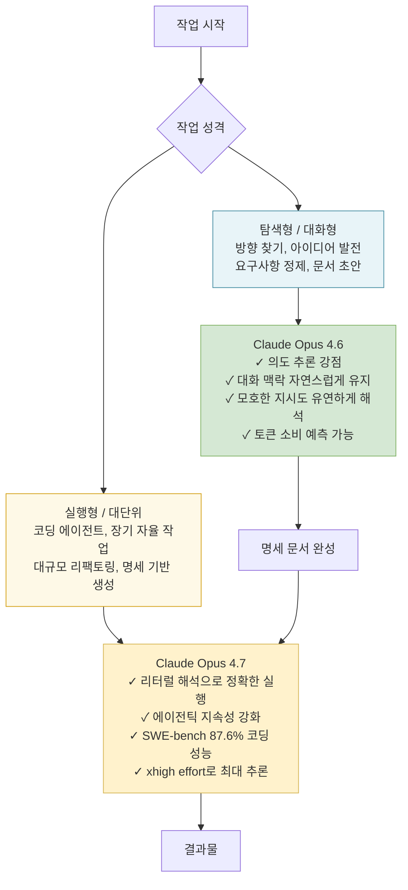

## — "대화형 작업은 4.6이 더 편하고 잘해서"의 기술적 의미

---

## 들어가며

2026년 4월 16일, Anthropic이 Claude Opus 4.7을 출시한 직후 커뮤니티의 반응은 예상 밖이었다. 공식 벤치마크에서 4.7은 SWE-bench Verified 87.6%(4.6 대비 약 7%포인트 상승)를 기록하며 "역대 최강"이라는 수식어를 달았다. 그런데 실제 사용자들 사이에서는 4.7로 갈아타지 않고 4.6을 고수하거나, 두 버전을 용도에 따라 나눠 쓰는 패턴이 등장했다.

Threads의 한 [스레드](https://www.threads.com/@inki1463/post/DYYbLaRk0C1)에서 이 현상이 압축적으로 드러났다. 사용자들이 꼽은 이유는 크게 세 가지였다. 토큰 소비량 급증, 속도 문제, 그리고 **"대화형 작업은 4.6이 더 편하고 잘해서"**. 이 글은 세 번째 이유, 즉 대화형 작업에서 4.6이 왜 체감상 더 낫게 느껴지는지를 기술적으로 상세하게 설명한다.

---

## 1. Claude Opus 4.7은 무엇이 달라졌는가

### 1.1 공식적으로 선언된 변화

Anthropic의 공식 문서는 4.7에서 달라진 핵심 동작 방식을 다음과 같이 명시한다.

- **명령 해석 방식의 변화**: 4.7은 이전 모델보다 명령을 더 **문자 그대로(literally)** 해석한다. 낮은 effort 레벨에서는 스스로 범위를 확장하거나 의도를 추론하는 행동을 줄였다.
- **도구 호출 빈도 감소**: 기본값 기준으로 툴을 더 적게, 더 신중하게 호출한다.
- **Adaptive Thinking 전면화**: 고정 사고 예산(budget_tokens) 파라미터가 제거되고, 모델이 스스로 사고 깊이를 결정하는 Adaptive Thinking만 남았다. 사고 요약도 기본적으로 숨겨진다.
- **새 토크나이저 v2 도입**: 동일한 텍스트에 대해 최대 35%까지 더 많은 토큰을 소비할 수 있다.
- **xhigh effort 레벨 추가**: 코딩 및 에이전트 작업에서 최대 10만 토큰 사고 예산을 사용하는 최고 강도 옵션이 생겼다. Claude Code에서는 xhigh가 기본값으로 설정되어 있다.

### 1.2 4.7이 특히 강해진 영역

4.7이 실질적으로 크게 개선된 영역은 명확하다. 에이전틱 코딩(agentic coding), 장기 자율 작업(long-horizon autonomous task), 고해상도 비전(2576px, 약 3.75MP), SWE-bench Pro(53.4% → 64.3%)가 대표적이다. 이 모두는 **파이프라인 중심, 자동화 중심, 단일 대형 작업 중심**의 시나리오다.

---

## 2. "알잘딱"의 소멸 — 4.6의 의도 추론 능력

### 2.1 4.6이 대화형 작업에서 잘했던 것

Claude Opus 4.6을 사용해본 사람들이 흔히 쓰던 표현이 "알잘딱"이다. "알아서 잘 딱 맞게 처리한다"는 의미로, 명시적으로 지정하지 않아도 사용자의 의도를 파악해 적절한 범위의 작업을 수행했다는 뜻이다.

기술적으로는 **Intent Inference(의도 추론)** 라고 부를 수 있다. 예를 들어, "이 이메일 좀 다듬어줘"라고만 해도 4.6은 어조 조정, 구조 개선, 사실 확인까지 능동적으로 처리했다. 코드 분석을 요청하면 명시하지 않아도 연관된 테스트 파일, 설정 파일까지 범위를 넓혀 살펴봤다.

대화형 작업에서 이 특성은 특히 빛났다. 다음과 같은 상황에서 4.6의 의도 추론 능력이 실질적인 편의를 제공했다.

- **맥락을 계속 가져가는 대화**: 이전 메시지에서 언급된 제약 조건이나 선호도를 다음 응답에서 자연스럽게 반영
- **모호한 요청의 보완**: "이거 좀 더 자세히"라는 짧은 요청에도 어떤 부분을 어느 방향으로 확장해야 하는지 맥락에서 판단
- **비구조적 협업**: 정해진 형식 없이 아이디어를 주고받으며 발전시키는 과정에서 모델이 능동적 파트너 역할 수행

### 2.2 4.7에서 이 경험이 달라지는 이유

4.7은 의도 추론보다 **명시적 지시 이행**을 우선한다. 이것은 버그가 아니라 설계 결정이다. Anthropic은 자율 에이전트가 오작동하는 주요 원인 중 하나가 모델이 지시받은 것 이상을 임의로 수행하는 "범위 이탈"이었음을 파악하고, 4.7에서는 리터럴 해석(literal interpretation)을 강화했다.

결과적으로 대화형 작업에서는 다음과 같은 변화가 생겼다.

- "이 코드 분석해줘"라고 하면 해당 코드만 분석하고 관련 파일은 건드리지 않는다. 범위를 넓히려면 명시해야 한다.
- 낮은 effort 수준에서는 한 항목에 적용된 지시가 다른 항목에 자동으로 일반화되지 않는다.
- 프롬프트에 쓰인 그대로를 실행하기 때문에 "느슨한" 일상 대화 표현이 예상과 다른 결과를 낼 수 있다.

이 변화는 Claude Code나 에이전트 파이프라인처럼 명확한 프로토콜이 있는 환경에서는 더 높은 정확도로 이어지지만, 자유 형식의 대화형 작업에서는 오히려 번거로움이 된다.

---

## 3. 토큰 소비량 — 숨겨진 비용 구조

### 3.1 새 토크나이저의 실제 영향

4.7의 목록 가격은 4.6과 동일하다(입력 $5/MTok, 출력 $25/MTok). 그러나 새 토크나이저 v2는 동일한 텍스트에 대해 1.0배~1.35배 더 많은 토큰을 사용한다. 영어 중심 텍스트에서는 실제 청구 비용이 12~18% 상승하는 것으로 측정된 사례들이 보고되었다.

멀티턴 대화에서는 이 비용이 누적된다. 매 턴마다 전체 대화 히스토리가 컨텍스트에 포함되는 구조이므로, 대화가 길어질수록 4.7의 토큰 부담이 선형이 아닌 누적적으로 증가한다.

```
[토큰 비용 누적 구조]

대화 1턴: 입력 1,000토큰
대화 2턴: 입력 1,000 + 이전응답(1,500) = 2,500토큰
대화 3턴: 입력 1,000 + 이전히스토리(5,000) = 6,000토큰
          ↑ 여기에 4.7 토크나이저 1.0~1.35배 가중치가 적용됨
```

이런 구조에서, Claude.ai Max Plan의 사용량 제한을 쓰는 사용자 입장에서는 같은 대화량으로 한도를 더 빠르게 소진하게 된다. Threads 스레드에서 "토큰 먹는 거 보면 못쓰겠다"는 표현이 나온 것은 이 현상을 직접 경험한 결과다.

### 3.2 Adaptive Thinking의 토큰 소비

4.7의 Adaptive Thinking은 작업 복잡도를 모델 스스로 판단해 사고 깊이를 결정한다. 대화형 맥락에서 모델이 작업을 "복잡하다"고 판단하면 예상 이상의 사고 토큰을 소비할 수 있다. 4.6에서는 effort 파라미터(low/medium/high/max)로 사용자가 직접 조절할 수 있었고, 대화형 작업에는 medium 또는 low를 지정해 비용을 통제하는 것이 자연스러웠다.

---

## 4. 4.6의 대화형 작업 강점 — 구체적으로 어떤 상황인가

### 4.1 계획 수립 및 반복 협업

사용자가 아이디어를 던지고 모델이 구체화하며, 다시 사용자가 방향을 수정하는 반복적 협업 과정에서 4.6은 각 대화 턴의 맥락과 누적된 의도를 자연스럽게 유지했다. 이 과정에서 별도의 명시 없이도 "우리가 지금 어떤 방향을 탐색하고 있는지"를 모델이 내재화한 것처럼 동작했다.

4.7에서는 새 지시 없이 이전 방향을 자동으로 이어가는 행동이 줄었다. 각 턴마다 맥락을 명시적으로 재환기시켜야 하는 경우가 생기기 때문에, 자유로운 탐색형 대화에서는 사용자의 인지 부담이 증가한다.

### 4.2 문서 작성 및 초안 반복

"이 방향으로 좀 더", "조금 더 격식체로", "앞부분 다시 써줘"처럼 자연어로 방향을 조정하는 문서 작업에서 4.6의 의도 추론은 명확한 장점이었다. 사용자가 쓴 지시의 행간을 읽어 적절한 범위와 방식으로 수정을 수행했다.

4.7은 이 지시들을 더 좁게 해석한다. "앞부분"이 정확히 어디까지인지, "격식체"의 기준이 무엇인지 명시하지 않으면 예상보다 좁은 변경만 이루어지거나 확인을 요청한다. 이것이 에이전트 파이프라인에서는 안전하고 예측 가능한 동작이지만, 사람과의 실시간 대화에서는 답답함으로 이어질 수 있다.

### 4.3 요구사항 정제 및 명세 작업

흥미롭게도 Threads 스레드의 한 사용자는 "4.6으로 작업 전 문서 만들고, 4.7로 작업하는" 패턴을 언급했다. 이는 4.6의 대화형 장점이 가장 두드러지는 영역이 **요구사항 정제 단계**임을 시사한다.

막연한 아이디어에서 구체적인 작업 명세를 만드는 과정은 본질적으로 탐색적이다. "이런 거 하고 싶은데", "그렇게 하면 어떨까", "이 부분은 좀 다르게"처럼 방향을 찾아가는 대화이고, 여기서는 모델이 의도를 적극적으로 추론해서 제안을 풍부하게 만들어주는 것이 유리하다. 그 결과로 만들어진 구체적 명세를 4.7에게 넘기면 4.7은 리터럴 해석의 강점을 발휘해 정확하게 실행한다.

---

## 5. 사용자들이 발견한 최적 조합 패턴

Threads 스레드에서 가장 실용적인 통찰 중 하나는 두 모델을 역할 분담해 쓰는 방식이었다. 이 패턴은 각 모델의 특성을 그 특성이 장점으로 작용하는 영역에 배치한다는 점에서 합리적이다.



이 패턴을 구체적으로 표현하면 다음과 같다.

**1단계 (4.6 담당)**: 작업 목표가 막연할 때, 4.6과 자유로운 대화를 통해 요구사항을 탐색하고 구체화한다. "이런 기능이 필요한데 어떻게 구조화하면 좋을까"부터 시작해, 여러 차례 주고받으며 명확한 작업 명세를 만들어낸다.

**2단계 (4.7 담당)**: 구체화된 명세를 가지고 4.7을 Advisor 모드 또는 직접 실행 모드로 불러온다. 명세가 명확하기 때문에 4.7의 리터럴 해석이 오히려 장점이 되고, 에이전틱 성능도 최대로 활용된다.

Threads 스레드의 한 사용자가 표현한 것처럼, "작업 시작 전에 요구사항 문서 만드는 게 잘되면 중국산 LLM 모델만 가지고도 왠만한 작업은 다 된다"는 논리와도 일치한다. 명세가 명확하면 실행 모델의 지능에 대한 의존도가 낮아지기 때문이다.

---

## 6. 4.7에 대한 사용자 반응을 이해하는 또 다른 시각

### 6.1 "퇴보처럼 느껴지지만 퇴보가 아닌" 이유

4.7 출시 이후 많은 사용자들이 "결과물이 아쉽다", "띨띨해진 느낌"이라고 표현했다. 이에 대해 한 분석은 명확하게 지적했다: 4.7은 퇴보한 것이 아니라, **4.6이 사용자의 불완전한 프롬프트를 능동적으로 보완해주고 있었던 것**이다.

"You use 4.6, it works great. You wait for 4.7. It drops. You try it. Output feels worse. You think it is a downgrade. It is not. Opus 4.7 is stronger. It is also literal. And 4.6 had been carrying your [prompts]."

즉, 4.6은 사용자가 제대로 명시하지 않아도 의도를 파악해 결과를 채워주는 역할을 했고, 4.7은 그 보완 역할을 모델이 아니라 사용자의 명시적 지시에 맡긴다. 사용자 입장에서는 모델이 나빠진 것처럼 느껴지지만, 실제로는 모델에 대한 기대와 책임의 소재가 달라진 것이다.

### 6.2 이 전환이 대화형 작업에서 더 크게 느껴지는 이유

에이전트 파이프라인이나 Claude Code 사용자들은 이미 명확한 지시와 구조화된 프롬프트에 익숙해져 있다. `CLAUDE.md` 파일, 시스템 프롬프트, 구체적인 성공 기준 등을 정의하는 것이 일상적인 작업 흐름이다. 이런 환경에서는 4.7의 리터럴 해석이 더 예측 가능하고 신뢰할 수 있는 동작을 만들어낸다.

반면 대화형 작업 사용자들은 자연어의 모호함을 모델이 맥락으로 채워주는 것에 익숙해져 있다. 이 층의 사용자들에게 4.7의 변화는 체감 품질 저하로 직결된다. Threads 스레드에서 "4.7부터 뭔가 결과물이 아쉬워서"라는 표현이 나온 것은 바로 이 사용 패턴의 차이다.

### 6.3 Anti-Gravity와 같은 서비스가 4.6을 유지하는 맥락

스레드에서 언급된 안티그래비티(Anti-Gravity)처럼 일부 서비스가 여전히 4.6을 제공하는 것은 단순히 업데이트가 느린 것이 아닐 수 있다. 4.7로의 전환이 기존 프롬프트 설계와의 호환성 문제를 일으키거나, 특정 서비스의 핵심 사용 패턴(예: 대화형 인터랙션)에서 4.6이 더 안정적으로 동작한다는 판단이 있을 수 있다.

4.7로 마이그레이션하려면 기존 프롬프트를 재검토하고 명시성을 높여야 한다. 이는 서비스 운영 입장에서 상당한 작업이며, 4.6이 서비스 목적에 충분히 잘 동작하는 동안 전환을 유보하는 것은 합리적인 선택이다.

---

## 7. 어떤 작업에 어떤 모델이 맞는가

아래 표는 각 모델의 특성이 장점으로 작용하는 시나리오를 정리한 것이다.

| 작업 유형 | 권장 모델 | 이유 |
|-----------|-----------|------|
| 자유로운 아이디어 탐색 | **Opus 4.6** | 의도 추론으로 대화 흐름 자연스럽게 유지 |
| 요구사항 정제 및 명세 작성 | **Opus 4.6** | 모호한 입력을 능동적으로 구체화 |
| 반복적 문서 수정 | **Opus 4.6** | 짧은 지시에서도 맥락 기반 판단 |
| 명세 기반 코딩 실행 | **Opus 4.7** | 리터럴 해석으로 범위 이탈 최소화 |
| 장기 자율 에이전트 | **Opus 4.7** | 에이전틱 지속성 및 자기 검증 강화 |
| 대규모 코드 리팩토링 | **Opus 4.7** | SWE-bench 87.6%, 코딩 성능 최고 수준 |
| 비전/UI 자동화 | **Opus 4.7** | 3.75MP 고해상도 처리 가능 |
| 멀티턴 기획 협업 | **Opus 4.6** | 대화형 맥락 누적, 토큰 비용 예측 용이 |
| 최신 지식 필요 작업 | **Opus 4.7** | 지식 컷오프 2026년 1월(4.6은 2025년 5월) |

---

## 8. 실용적 결론

Claude Opus 4.7은 특정 영역에서 명확하게 더 강하다. 코딩 에이전트, 장기 자율 작업, 고해상도 비전 처리에서는 4.6이 따라올 수 없는 성능을 보인다. 그리고 그 설계 방향은 AI가 점점 더 파이프라인의 부품으로 작동하는 방식을 반영한다.

그러나 AI를 "대화 상대"로 쓰는 방식, 즉 아이디어를 함께 발전시키고, 방향을 탐색하고, 모호한 지시를 주고받으며 결과를 만들어가는 상호작용 방식에서는 4.6의 의도 추론 능력이 여전히 실용적 가치를 갖는다.

사용자들이 자연스럽게 찾아낸 최적 패턴은 두 모델을 대립 구도가 아닌 **분업 구도**로 배치하는 것이다. 4.6으로 탐색하고 정제하여 명세를 만들고, 4.7로 실행하는 흐름은 각 모델의 강점이 실제로 작동하는 단계에 배치된다는 점에서 기술적으로도 타당하다.

어떤 모델이 더 낫다는 절대적 답보다, 어떤 작업에서 어떤 모델의 특성이 장점이 되는지를 이해하는 것이 더 중요하다. "대화형 작업은 4.6이 더 편하고 잘해서"라는 표현은 그 이해를 한 문장으로 압축한 것이다.

---

