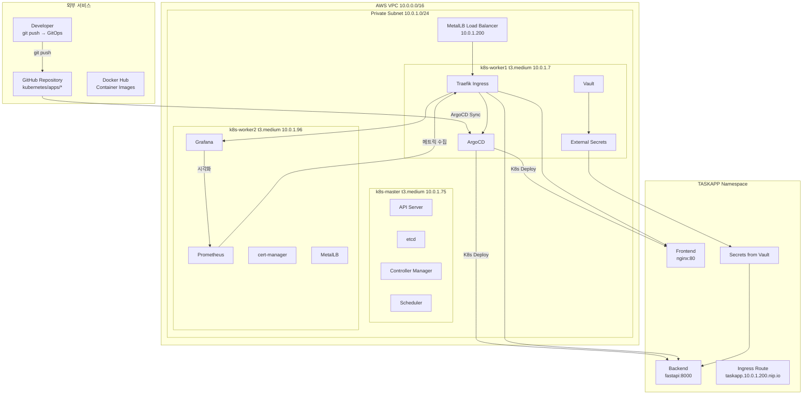
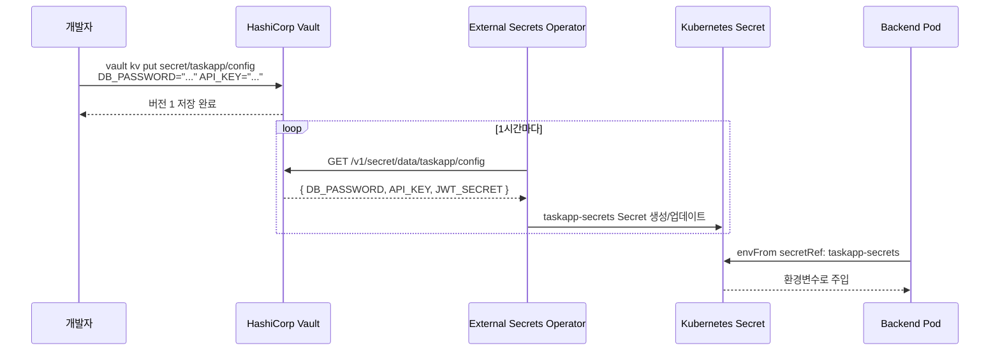
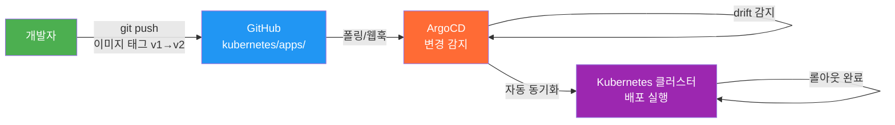
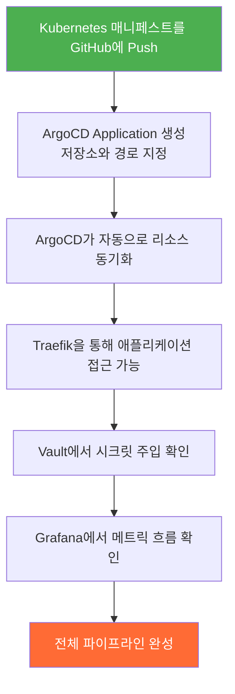
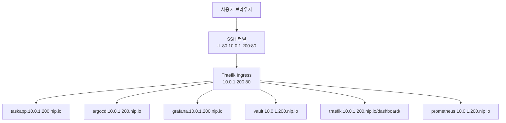

> **원문 출처**: [Medium — Yaw Nana Gyamfi Prempeh (2026년 1월 17일)](https://medium.com/@yawgyamfiprempeh27/i-built-a-production-grade-kubernetes-platform-in-48-hours-db5629fba0e3)  
> **GitHub 저장소**: [NanaGyamfiPrempeh30/k8s-devsecops](https://github.com/NanaGyamfiPrempeh30/k8s-devsecops)  


---

## 개요

이 문서는 DevOps 엔지니어 Yaw Nana Gyamfi Prempeh가 48시간이라는 제한된 시간 안에 AWS 위에서 프로덕션 수준의 Kubernetes DevSecOps 인프라를 처음부터 직접 구축한 경험을 담은 프로젝트에 대한 상세 분석이다. 단순한 튜토리얼 따라하기가 아니라, 실제 기업 환경에서 찾아볼 수 있는 수준의 인프라를 설계·구현·디버깅한 실전 기록이다.

이 프로젝트가 주목받는 이유는 분명하다. DevOps 채용 공고에는 늘 "프로덕션 Kubernetes 경험"이 요구되지만, 실제로 그 경험을 쌓을 기회는 이미 해당 직책에 있어야만 주어진다. 이 모순을 깨기 위해 저자는 스스로 프로덕션 환경을 구축하는 길을 택했다. 그 결과물은 단순한 학습용 프로젝트가 아니라, 실제 면접에서 "내가 설계하고, 디버깅하고, 각 구성 요소가 어떻게 맞물리는지 완전히 이해하는 시스템"으로 제시할 수 있는 포트폴리오가 되었다.

---

## 1. 프로젝트의 동기와 목표

저자가 이 프로젝트를 시작한 근본적인 이유는 DevOps 튜토리얼이 가르치는 내용과 기업이 실제로 요구하는 것 사이의 격차에 대한 답답함이었다. 수많은 온라인 강의는 단일 nginx 파드 하나를 띄우는 수준에서 멈추지만, 실제 기업 환경에서는 GitOps 워크플로우, 중앙화된 시크릿 관리, 완전한 가관측성(Observability), 자동화된 배포 파이프라인이 유기적으로 맞물려 돌아간다.

이 프로젝트의 구체적인 목표는 다음과 같았다:

- **Infrastructure as Code(IaC)**: 인프라의 모든 부분을 코드로 정의하고 재현 가능하게 만들기
- **GitOps 워크플로우**: Git 저장소를 단일 진실의 원천(Single Source of Truth)으로 삼아 배포 자동화하기
- **중앙화된 시크릿 관리**: 어떠한 민감 정보도 Git에 저장하지 않기
- **완전한 가관측성**: 시스템의 모든 부분에서 메트릭을 수집하고 시각화하기
- **매니지드 서비스 없음**: 편의를 위한 클라우드 제공자의 관리형 서비스에 의존하지 않고, 핵심 구성 요소를 직접 설치·운영하기

---

## 2. 전체 아키텍처 설계

프로젝트는 5개의 레이어로 구성된 아키텍처를 목표로 했다.



### 레이어별 구성 요소

**인프라스트럭처 레이어**: AWS EC2 인스턴스 3대(마스터 1대, 워커 2대), 프라이빗 서브넷, 배스천 접근, Terraform으로 모든 리소스 프로비저닝.

**클러스터 레이어**: kubeadm으로 설치한 Kubernetes, Calico CNI(Container Network Interface), MetalLB 로드 밸런서.

**플랫폼 레이어**: Traefik 인그레스 컨트롤러, cert-manager TLS 자동화, HashiCorp Vault 시크릿 관리, External Secrets Operator.

**딜리버리 레이어**: ArgoCD GitOps, 3-tier 커스텀 애플리케이션(프론트엔드·백엔드·데이터베이스).

**가관측성 레이어**: Prometheus 메트릭 수집, Grafana 대시보드.

---

## 3. 사용된 기술 스택 상세 설명

### 3.1 Terraform — 인프라스트럭처 코드화

Terraform은 HashiCorp가 개발한 IaC(Infrastructure as Code) 도구로, AWS VPC, 서브넷, 보안 그룹, EC2 인스턴스 등 모든 인프라 리소스를 선언적으로 정의하고 버전 관리할 수 있게 해준다. 이 프로젝트에서는 `terraform/ec2`와 `terraform/vpc` 디렉토리를 분리하여 네트워킹과 컴퓨팅 리소스를 모듈화했다.

```
terraform/
├── ec2/          # EC2 인스턴스 정의
├── vpc/          # VPC 및 네트워킹
└── variables.tf  # 입력 변수
```

Terraform 실행 후 20분 만에 3대의 EC2 인스턴스, 프라이빗 서브넷, 보안 그룹 설정, 마스터 노드를 통한 SSH 접근이 모두 준비되었다.

### 3.2 Ansible — 구성 관리 자동화

Ansible은 에이전트 없이(agentless) SSH를 통해 원격 서버를 자동으로 구성할 수 있는 구성 관리 도구다. 이 프로젝트에서 Ansible은 kubeadm 기반의 Kubernetes 클러스터 부트스트래핑 전체를 자동화했다. 역할(Role) 기반으로 마스터 노드와 워커 노드 설정을 분리하여 멱등성(Idempotent)이 보장되는 구성을 실현했다.

실제 Ansible 실행 결과에서 k8s-master, k8s-worker1, k8s-worker2 모두 `failed=0`, `unreachable=0`으로 완료된 것을 확인할 수 있다.

```
ansible/
├── inventory/   # 호스트 정의
├── playbooks/   # 배포 플레이북
└── roles/       # 재사용 가능한 역할
```

### 3.3 kubeadm + Calico — Kubernetes 클러스터

kubeadm은 Kubernetes 클러스터를 표준 방식으로 초기화하는 공식 도구다. 이 프로젝트에서는 Kubernetes v1.31.4가 설치되었으며, 모든 노드가 Ubuntu 24.04.3 LTS, 커널 6.14.0-1018-aws 환경에서 실행되었다.

실제 실행된 노드 목록:

| 노드 이름 | 역할 | IP 주소 | 상태 |
|---|---|---|---|
| k8s-master | control-plane | 10.0.1.75 | Ready |
| k8s-worker1 | worker | 10.0.1.7 | Ready |
| k8s-worker2 | worker | 10.0.1.96 | Ready |

CNI(Container Network Interface)로 선택된 Calico는 파드 간 네트워킹을 처리하면서 동시에 NetworkPolicy를 통한 파드 수준 네트워크 보안 정책도 지원한다. `kubectl get pods -A` 결과에서 `calico-kube-controllers`, `calico-node` 파드들이 Running 상태인 것을 확인할 수 있다.

### 3.4 MetalLB — 베어메탈 환경의 로드 밸런서

AWS의 EKS나 GKE 같은 관리형 쿠버네티스 서비스에서는 `type: LoadBalancer`로 서비스를 생성하면 자동으로 클라우드 제공자의 로드 밸런서가 붙는다. 그러나 직접 kubeadm으로 구성한 클러스터에서는 이 기능이 동작하지 않는다. MetalLB는 이 문제를 해결하기 위해 설계된 베어메탈 환경용 로드 밸런서다.

이 프로젝트에서 MetalLB는 `10.0.1.200`~`10.0.1.250` 범위의 IP 풀을 관리하며, Traefik이 `10.0.1.200`이라는 외부 IP를 할당받아 실제로 접근 가능한 엔드포인트가 되었다. Ansible 실행 결과에서 MetalLB 파드들(`metallb-controller`, `metallb-speaker-*`)이 모두 Running 상태인 것을 확인할 수 있다.

### 3.5 Traefik — 인그레스 컨트롤러

Traefik은 Go로 작성된 현대적인 리버스 프록시 겸 로드 밸런서로, 이 프로젝트에서는 버전 3.6.6이 사용되었다. Kubernetes 인그레스 컨트롤러로서 외부에서 들어오는 HTTP/HTTPS 트래픽을 적절한 서비스로 라우팅하는 역할을 한다.

Traefik 대시보드에서 확인된 엔트리포인트 구성:

| 엔트리포인트 | 포트 | 역할 |
|---|---|---|
| metrics | :9100/tcp | Prometheus 메트릭 노출 |
| traefik | :8080/tcp | 대시보드 |
| web | :80/tcp | HTTP 트래픽 |
| websecure | :443/tcp | HTTPS 트래픽 |

실제로 등록된 라우터는 총 8개로, argocd, grafana, taskapp(프론트엔드+백엔드), traefik 대시보드, vault, 그리고 Grafana의 HTTPS(websecure) 라우터가 모두 Success 상태였다. 라우터마다 Host(`argocd.10.0.1.200.nip.io`), Host(`vault.10.0.1.200.nip.io`) 같은 호스트 기반 라우팅 규칙이 적용되었고, nip.io라는 와일드카드 DNS 서비스를 활용하여 별도의 도메인 등록 없이 IP 주소 기반으로 도메인을 해석할 수 있게 했다.

### 3.6 cert-manager — TLS 인증서 자동화

cert-manager는 Kubernetes 클러스터 내에서 TLS 인증서의 발급·갱신·폐기를 자동화하는 오픈소스 도구다. Let's Encrypt와 연동하여 ACME 프로토콜로 무료 인증서를 자동 발급받을 수 있다. 이 프로젝트에서는 스테이징(Staging) ClusterIssuer인 `letsencrypt-staging`을 구성했으며, cert-manager, cert-manager-cainjector, cert-manager-webhook 파드가 모두 정상 실행되었다.

### 3.7 HashiCorp Vault — 중앙화된 시크릿 관리

HashiCorp Vault는 비밀번호, API 키, TLS 인증서, 데이터베이스 자격증명 등 민감한 정보를 안전하게 저장·배포·감사하기 위한 전용 시크릿 관리 시스템이다. 이 프로젝트에서는 Vault v1.20.4가 사용되었으며, 개발(dev) 모드로 실행되었다. 개발 모드는 학습과 테스트를 위해 자동 초기화·언씰(unseal)되어 편리하지만, 실제 프로덕션 환경에서는 사용하지 않아야 한다.

Vault의 시크릿 엔진 구성:

- **cubbyhole/**: 토큰별 개인 시크릿 저장소 (per-token private storage)
- **secret/**: KV(Key-Value) v2 시크릿 엔진으로, `taskapp/config` 경로에 애플리케이션 자격증명 저장

KV v2 시크릿 엔진의 중요한 특성이 있다. UI에서는 `secret/taskapp/config`로 표시되지만, 실제 API 경로는 `/v1/secret/data/taskapp/config`로 중간에 `data` 세그먼트가 추가된다. 이 사실을 모르면 External Secrets Operator가 "SecretSynced: True"를 반환하면서도 실제 시크릿이 비어있는 혼란스러운 상황이 발생한다.

### 3.8 External Secrets Operator — Vault와 Kubernetes의 연결

External Secrets Operator(ESO)는 Vault, AWS Secrets Manager, GCP Secret Manager, Azure Key Vault 등 외부 시크릿 저장소의 값을 Kubernetes Secret 리소스로 자동 동기화해주는 오퍼레이터다. 이 프로젝트에서는 Vault와 Kubernetes Secret 사이의 다리 역할을 했다.

ESO의 핵심 리소스 구성:

```yaml
apiVersion: external-secrets.io/v1
kind: ExternalSecret
metadata:
  name: taskapp-secrets
  namespace: taskapp
spec:
  refreshInterval: 1h          # 1시간마다 동기화
  secretStoreRef:
    name: vault-backend
    kind: ClusterSecretStore
  target:
    name: taskapp-secrets
  data:
    - secretKey: DB_PASSWORD
      remoteRef:
        key: secret/data/taskapp/config  # /data/ 세그먼트 필수
        property: DB_PASSWORD
```

### 3.9 ArgoCD — GitOps 지속적 배포

ArgoCD는 Kubernetes를 위한 선언적 GitOps 지속적 배포 도구다. 현재(2026년) ArgoCD는 v3.3.x 버전까지 발전했으며, v3.2.5+c56f440이 이 프로젝트에 사용되었다. ArgoCD는 Git 저장소의 변경 사항을 지속적으로 감시하다가 Kubernetes 클러스터의 실제 상태와 Git에 정의된 원하는 상태(desired state) 사이의 차이(drift)를 감지하면 자동으로 동기화한다.

이 프로젝트에서 ArgoCD Application의 실제 설정:

- **이름**: taskapp
- **저장소**: `https://github.com/NanaGyamfiPrempeh30/k8s-devsec...`
- **대상 브랜치**: main
- **경로**: kubernetes/apps
- **목적지**: in-cluster
- **네임스페이스**: taskapp
- **상태**: Healthy & Synced

ArgoCD가 제공하는 GitOps의 핵심 가치는 "git push만으로 배포가 완료된다"는 것이다. 저자는 컨테이너 이미지 태그를 v1에서 v2로 변경하여 Git에 push하자 수 초 안에 ArgoCD가 변경을 감지하고 새 버전을 자동으로 롤아웃하는 것을 직접 경험했다.

### 3.10 Prometheus + Grafana — 가관측성

Prometheus는 메트릭 수집을 위한 오픈소스 모니터링 시스템이고, Grafana는 수집된 메트릭을 시각화하는 대시보드 도구다. 두 도구는 `kube-prometheus-stack` Helm 차트를 통해 함께 설치된다.

이 프로젝트에서는 Traefik Official Standalone Dashboard를 통해 다음 메트릭을 실시간으로 확인할 수 있었다:

- **Top slow services**: 응답 시간 기준 상위 느린 서비스 (GET[499] on traefik: 평균 11.9초로 가장 느렸음)
- **Most requested services**: 요청 빈도 기준 상위 서비스 (200 응답: 0.235 req/s 평균, 최대 0.578 req/s)
- HTTP 상태 코드별 분포 (200, 304, 401, 302 등)

---

## 4. 시크릿 플로우 아키텍처



이 흐름에서 가장 중요한 점은 **민감 정보가 Git에 절대 저장되지 않는다**는 것이다. Vault가 유일한 시크릿 원천(source of truth)이 되고, ESO가 1시간마다 동기화하며, 파드는 표준 Kubernetes Secret을 통해 환경변수로 시크릿을 주입받는다.

---

## 5. GitOps 워크플로우 아키텍처



개발자는 단순히 `git push`만 수행한다. 이후의 모든 과정은 ArgoCD가 자동으로 처리한다. kubectl 명령어도, 수동 개입도, Slack 알림을 통한 수동 승인도 필요 없다. 이것이 GitOps의 핵심 가치다.

---

## 6. 48시간 타임라인: 문제와 해결의 연속

### 6.1 1~4시간: 인프라 구축과 첫 번째 장벽

Terraform 실행은 순조로웠다. 20분 안에 3대의 EC2 인스턴스, 보안 그룹, SSH 접근 설정이 완료되었다. 문제는 kubeadm에서 시작되었다. 클러스터 초기화가 아무런 에러 메시지 없이 실패했고, 컨트롤 플레인이 Ready 상태가 되지 않았다.

**원인**: t3.small 인스턴스(메모리 2GB)로는 Kubernetes 컨트롤 플레인을 실행하기 부족했다. Kubernetes 공식 최소 요구사항은 컨트롤 플레인 노드에 2 CPU, 2GB RAM이지만, 모니터링 스택까지 고려하면 t3.medium(2 vCPU, 4GB RAM) 이상이 필요하다.

**해결**: 모든 인스턴스를 t3.medium으로 업그레이드. 클러스터가 정상 기동되었고, 이후 Ansible을 통해 확인한 결과 k8s-master는 v1.31.4 버전으로 control-plane 역할을 맡고, 워커 노드 2대도 정상 Ready 상태가 되었다.

**핵심 교훈**: Kubernetes는 실제 리소스 요구사항이 존재한다. 특히 풀 스택 모니터링까지 포함하면 넉넉한 인스턴스 크기가 필수다.

### 6.2 5~12시간: 6시간짜리 네트워킹 악몽

MetalLB, Traefik을 설치하고 첫 번째 Ingress 리소스를 생성했다. nip.io 호스트명으로 접근을 시도했지만 curl 요청이 그냥 멈춰버렸다. 타임아웃도, 에러도, 응답도 없었다.

**원인 1**: Traefik이 `websecure` 엔트리포인트(443)만 리슨하도록 설정되어 있었는데, HTTP(80)로 요청하고 있었다.

**원인 2**: Ingress 리소스에 TLS 블록이 참조하는 시크릿이 존재하지 않아, Traefik이 라우트 설정을 조용히(silently) 실패 처리했다.

**해결**: 불필요한 TLS 블록을 제거하고, 명시적으로 HTTP 엔트리포인트를 지정했다.

```yaml
metadata:
  annotations:
    traefik.ingress.kubernetes.io/router.entrypoints: web
spec:
  ingressClassName: traefik
  rules:
  - host: myapp.10.0.1.200.nip.io
    http:
      paths:
      - path: /
        pathType: Prefix
        backend:
          service:
            name: my-service
            port:
              number: 80
```

**핵심 교훈**: Kubernetes에서 무언가 조용히 실패하면 컨트롤러 로그를 즉시 확인하라. Traefik은 TLS 시크릿 에러를 처음부터 로그에 기록하고 있었다. 단지 아무도 보고 있지 않았을 뿐이다.

### 6.3 13~18시간: 동기화는 되는데 비어있는 시크릿

HashiCorp Vault를 설치하고 시크릿을 저장했다. External Secrets Operator로 Kubernetes Secret에 동기화하도록 구성했다. ExternalSecret 리소스는 `SecretSynced: True`를 반환했지만, 실제 Kubernetes Secret을 열어보면 내용이 비어있었다.

**원인**: KV v2 시크릿 엔진의 API 경로 문제. Vault UI는 `secret/taskapp/config`로 표시하지만, 실제 API 경로는 `secret/data/taskapp/config`다. ExternalSecret의 `remoteRef.key`에 `secret/taskapp/config`(UI 표시 경로)를 입력했기 때문에 ESO가 데이터를 찾지 못했던 것이다.

**해결**: `remoteRef.key`를 `secret/data/taskapp/config`로 수정. 이후 시크릿이 정상적으로 흘러들어왔다.

**핵심 교훈**: UI가 보여주는 경로와 실제 API 경로는 다를 수 있다. 도구의 버전에 따라 동작이 달라지는 경우도 있으므로, 항상 실제 API 경로를 확인하라.

### 6.4 19~30시간: ArgoCD 접근 문제와 GitOps의 경험

ArgoCD 설치 자체는 쉬웠다. 문제는 브라우저에서 접근하는 부분이었다. 클러스터가 프라이빗 서브넷에 있기 때문에 SSH 터널로 접근했는데, 포트 9090으로 MetalLB IP를 터널링했더니 404 에러가 발생했다.

**원인**: Traefik은 Host 헤더를 기준으로 라우팅한다. `argocd.10.0.1.200.nip.io:9090`으로 접근하면 브라우저가 Host 헤더에 포트 번호까지 포함시킨다(`argocd.10.0.1.200.nip.io:9090`). 그러나 Ingress는 포트가 없는 호스트명(`argocd.10.0.1.200.nip.io`)을 기준으로 매칭하므로 일치하지 않는다.

**해결**: 표준 포트 80으로 터널링.

```bash
sudo ssh -i k8s-key.pem ubuntu@master-ip -L 80:10.0.1.200:80 -N
```

로컬 `/etc/hosts`에 `127.0.0.1`로 도메인을 추가하면, Host 헤더가 포트 없이 깔끔하게 전송된다.

GitOps의 실제 경험은 감동적이었다. Git 저장소에 컨테이너 이미지 태그를 v1에서 v2로 변경하여 push하자, ArgoCD가 수 초 만에 변경을 감지하고 새 버전을 자동으로 롤아웃했다. kubectl 명령어 한 줄도 필요하지 않았다.

### 6.5 31~40시간: Prometheus Operator 크래시루프

`kube-prometheus-stack` Helm 차트로 Prometheus와 Grafana를 설치했지만, Grafana의 Traefik 대시보드에는 "No data" 패널만 표시되었다.

**원인 체인**: Prometheus가 Traefik을 스크레이핑하려면 ServiceMonitor 리소스가 필요하고, ServiceMonitor는 Prometheus Operator가 처리한다. 그런데 Prometheus Operator가 이전에 발생한 메모리 압박으로 인해 레플리카 수가 0으로 줄어있었다. 다시 스케일업하자 이번에는 Helm 차트 설치 시 이미 존재하던 TLS 인증서 문제로 Operator가 크래시루프에 빠졌다.

**해결**: Operator를 안정화시킨 후 Traefik ServiceMonitor를 생성. 핵심은 `release: prometheus` 레이블이었다.

```yaml
apiVersion: monitoring.coreos.com/v1
kind: ServiceMonitor
metadata:
  name: traefik
  namespace: traefik
  labels:
    release: prometheus  # 이 레이블이 없으면 Operator가 무시한다
spec:
  selector:
    matchLabels:
      app.kubernetes.io/name: traefik
  endpoints:
    - port: metrics
      interval: 15s
```

**핵심 교훈**: Prometheus Operator는 레이블 셀렉터로 ServiceMonitor를 탐지한다. Prometheus 인스턴스가 어떤 레이블을 기대하는지 반드시 확인해야 한다.

### 6.6 41~48시간: 모든 것이 맞물리는 순간

모든 구성 요소가 갖춰진 후, 실제 애플리케이션을 GitOps 파이프라인을 통해 배포했다.



실제로 배포된 애플리케이션은 `http://taskapp.10.0.1.200.nip.io`에서 "NGP DevSecOps Task Manager"라는 제목으로 동작하는 것이 확인되었다.

---

## 7. 스토리지 클래스와 영속적 데이터

애플리케이션 배포 과정에서 영속적 데이터 저장을 위한 StorageClass도 구성되었다. Ansible 실행 결과에서 `local-path (default)` StorageClass가 `rancher.io/local-path` 프로비저너로 구성된 것을 확인할 수 있다. 볼륨 바인딩 모드는 `WaitForFirstConsumer`로, 파드가 스케줄링될 때 볼륨이 프로비저닝된다.

---

## 8. Traefik 서비스 라우팅 전체 목록

프로젝트 완료 시점에 Traefik에 등록된 서비스 목록:

| 서비스 | 유형 | 서버 수 | 프로바이더 |
|---|---|---|---|
| argocd-argocd-server-80 | loadbalancer | 1 | Kubernetes |
| monitoring-prometheus-grafana-80 | loadbalancer | 1 | Kubernetes |
| taskapp-backend-8000 | loadbalancer | 2 | Kubernetes |
| taskapp-frontend-80 | loadbalancer | 2 | Kubernetes |
| traefik-traefik-8080 | loadbalancer | 1 | Kubernetes |
| vault-vault-8200 | loadbalancer | 1 | Kubernetes |

taskapp의 프론트엔드와 백엔드는 각각 2개의 서버(파드)가 로드 밸런서에 등록되어 있어 기본적인 고가용성을 제공한다.

---

## 9. 접근 엔드포인트 구조



---

## 10. 최종 기술 스택 현황

| 구성 요소 | 목적 | 상태 |
|---|---|---|
| Terraform | 인프라 프로비저닝 | 완료 |
| Ansible | 노드 구성 관리 | 완료 |
| kubeadm v1.31.4 | 클러스터 설치 | 완료 |
| Calico CNI | 파드 네트워킹 | 완료 |
| MetalLB | 로드 밸런서 | 완료 |
| Traefik 3.6.6 | 인그레스 컨트롤러 | 완료 |
| cert-manager | TLS 자동화 | 완료 |
| HashiCorp Vault v1.20.4 | 시크릿 저장 | 완료 |
| External Secrets Operator | 시크릿 동기화 | 완료 |
| ArgoCD v3.2.5 | GitOps 배포 | 완료 |
| Prometheus | 메트릭 수집 | 완료 |
| Grafana | 시각화 대시보드 | 완료 |

---

## 11. 반성과 교훈: 다음에는 이렇게 할 것

저자는 48시간의 경험을 통해 다음과 같은 실질적인 교훈을 얻었다.

**첫째, 처음부터 큰 인스턴스를 사용하라.** 메모리 부족으로 인한 디버깅 시간은 값있는 학습이 아니라 순수한 낭비다. Kubernetes + 모니터링 스택은 생각보다 훨씬 많은 메모리를 요구한다.

**둘째, 가관측성을 가장 먼저 구축하라.** Prometheus와 Grafana가 처음부터 동작하고 있었다면 네트워킹 디버깅에 6시간을 쓰지 않았을 것이다. 볼 수 없는 것은 고칠 수 없다.

**셋째, 문제가 발생하는 순간 컨트롤러 로그를 열어라.** Traefik, cert-manager, ArgoCD, External Secrets Operator 등 모든 Kubernetes 컨트롤러는 오류를 로그에 기록한다. 로그를 확인하는 것이 첫 번째 디버깅 행동이어야 한다.

**넷째, 각 구성 요소를 개별적으로 검증하라.** 모든 것을 한꺼번에 설치하고 상호작용을 디버깅하는 것은 비효율적이다. 각 컴포넌트가 독립적으로 동작하는 것을 확인한 후 다음 단계로 넘어가야 한다.

---

## 12. 현재 시점(2026년)에서의 기술 맥락

이 프로젝트가 작성된 2026년 1월 시점 이후로 관련 생태계는 계속 발전했다.

**ArgoCD**: 현재 최신 안정 버전은 v3.3.8(2026년 2월 출시, 4월 패치)이다. v3.3은 안전한 GitOps 삭제, Redis 자격증명 볼륨 마운트, ApplicationSet UI 개선, Ceph CRD 헬스 체크 등이 추가되었다. 2026년 CNCF 조사에 따르면, Kubernetes 네이티브 팀의 80%가 2027년까지 ArgoCD 3.x를 주요 GitOps 컨트롤러로 사용할 것으로 전망된다.

**HashiCorp Vault + External Secrets Operator**: ESO와 Vault의 조합은 여전히 Kubernetes 환경에서 시크릿 관리의 표준으로 자리잡고 있다. 특히 Kubernetes 인증을 활용한 단기 토큰 기반 접근 방식이 보안 모범 사례로 권장된다. 동적 시크릿(데이터베이스 자격증명, 클라우드 IAM 토큰 등 자동 만료되는 임시 자격증명) 활용이 증가하는 추세다.

**GitOps 패러다임**: 2026년에는 GitOps가 Kubernetes 배포 관리의 사실상 표준(de facto standard)이 되었다. 스타트업부터 포춘 500대 기업까지 Git을 인프라와 애플리케이션 설정의 단일 진실 원천으로 삼는 방식이 보편화되었다.

---

## 13. 향후 개선 계획

저자가 이 프로젝트에 추가할 계획으로 언급한 사항들:

- **Istio 서비스 메시**: 고급 트래픽 관리, 상호 TLS(mTLS), 서킷 브레이커 등 추가
- **Velero 백업**: 클러스터 데이터 백업 및 재해 복구 자동화
- **GitHub Actions CI 파이프라인**: 컨테이너 이미지 빌드·테스트·푸시 자동화로 GitOps와 연결
- **Calico 네트워크 정책**: 파드 수준 네트워크 보안 강화

---

## 14. 프로젝트 디렉토리 구조 전체

```
k8s-devsecops/
├── terraform/
│   ├── ec2/                    # EC2 인스턴스 정의
│   ├── vpc/                    # VPC 및 네트워킹
│   └── variables.tf            # 입력 변수
├── ansible/
│   ├── inventory/              # 호스트 정의
│   ├── playbooks/              # 배포 플레이북
│   └── roles/                  # 재사용 가능한 역할
├── kubernetes/
│   ├── apps/                   # 애플리케이션 매니페스트
│   │   ├── namespace.yaml
│   │   ├── frontend.yaml
│   │   ├── backend.yaml
│   │   └── ingress.yaml
│   ├── core/                   # 핵심 인프라
│   └── monitoring/             # Prometheus & Grafana
├── argocd/
│   └── applications/           # ArgoCD Application 정의
├── application/
│   ├── frontend/               # React 프론트엔드 소스
│   ├── backend/                # Python FastAPI 백엔드
│   └── database/               # 데이터베이스 설정
└── docs/                       # 추가 문서
```

---

## 결론

이 프로젝트는 "프로덕션 Kubernetes 경험 없이 어떻게 그 경험을 쌓을 수 있는가"라는 실용적인 질문에 대한 하나의 답이다. 48시간이라는 제약 속에서 저자는 실제 기업 환경에서 사용되는 모든 핵심 구성 요소를 직접 설치하고 디버깅했다.

이 과정에서 얻은 가장 중요한 통찰은 기술 그 자체보다 **왜 그 기술이 존재하는지**에 대한 이해다. Vault의 가치는 없이 시크릿을 관리해보지 않고서는 완전히 이해할 수 없고, GitOps의 가치는 수동 배포의 번거로움을 경험해보지 않고서는 피부에 와닿지 않는다. 가관측성의 중요성은 그것 없이 디버깅하는 고통을 겪어봐야 진정으로 깨닫는다.

이 프로젝트의 코드는 `github.com/NanaGyamfiPrempeh30/k8s-devsecops`에서 참고할 수 있다.

---

