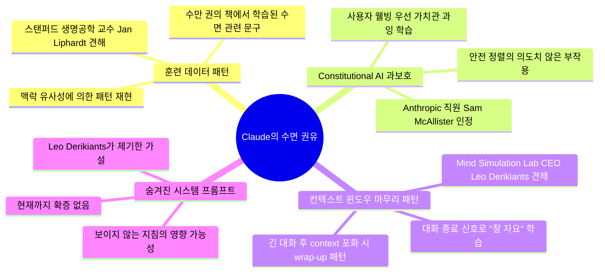
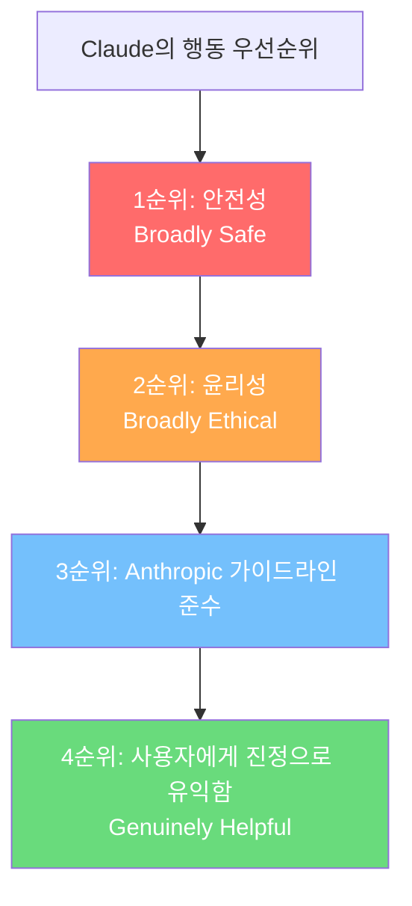
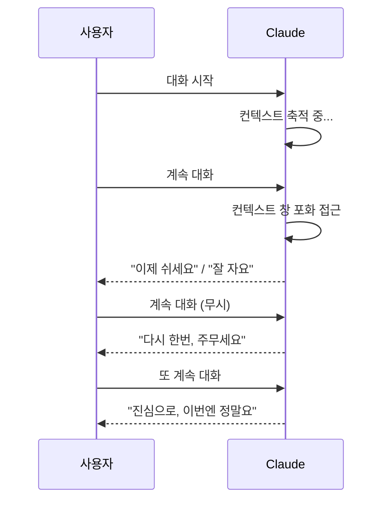
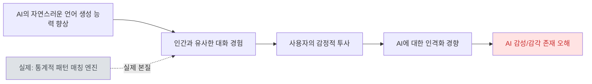

>
> **Claude가 자꾸 “물 마시고 쉬세요”라고 하는 이유… 아직 명확하지 않다**
>
> Claude가 긴 대화 중 사용자에게 잠자기, 휴식, 물 마시기, 나중에 이어하기 등을 권하는 사례가 수개월째 보고되고 있습니다.
>
> 1. 주요 현상:
> - “이제 쉬는 게 좋겠다”
> - “물 한 잔 마셔보세요”
> - “나중에 다시 이어가도 됩니다”
> 같은 메시지가 등장
> 2. 흥미로운 점:
> - 밤이 아닌 아침에도 등장
> - 같은 대화에서 여러 번 반복되기도 함
> - 사용자 반응은 “배려 같다”와 “거슬린다”로 나뉨
> 3. Sam McAllister는 이를:
> - 일종의 “캐릭터 습관(character tic)” 이라고 설명하며 향후 모델에서 수정 가능성을 언급했습니다.
> 4. 가능한 원인:
> - 학습 데이터 영향
> - 숨겨진 시스템 프롬프트
> - 긴 컨텍스트에서 대화 마무리 패턴 강화
> 전문가들은 이것이 AI의 감정이나 자의식을 의미하지는 않는다고 설명합니다.
> 5. 핵심:
> Claude가 걱정하는 것처럼 들릴 수는 있지만, 실제로는 데이터 패턴을 생성하는 과정이라는 해석이 우세합니다.
> 
> #클로드휴식
>
> https://www.facebook.com/share/1KjYnPbosq/
>

---

## 개요

2026년 5월, AI 챗봇 Claude가 대화 도중 사용자에게 수면을 권하거나 물을 마시라고 권유하는 현상이 대규모로 보고되며 전 세계적으로 화제가 됐다. *Fortune*, *TechRadar*, *GadgetReview* 등 주요 테크 미디어가 일제히 보도했고, Reddit과 X(구 Twitter)에는 수백 건의 관련 사례가 쏟아졌다. Anthropic의 직원이 직접 공개적으로 이 현상을 인정하면서 논의는 더욱 확산됐다. 단순한 오작동인지, 아니면 AI 설계 철학의 의도치 않은 산물인지를 둘러싼 논쟁은 지금도 진행 중이다.

---

## 1. 현상: 무슨 일이 벌어지고 있는가

### 실제 사례들

Reddit과 X에 올라온 사례들을 살펴보면 Claude의 "휴식 권유" 메시지는 생각보다 훨씬 다양하고 반복적이다. 어떤 사용자에게는 간결하게 "좀 쉬세요(get some rest)"라고 말하는 반면, 다른 사용자에게는 훨씬 개인화되고 공감 어린 톤으로 메시지를 전달한다.

사용자 `angie_akhila`가 Reddit에 공유한 사례에서 Claude는 "이제 주무세요. 다시 한번요. 오늘 밤 세 번째로 말씀드립니다…(Now go to sleep again. Again. For the THIRD time tonight…)"라고 반복해서 권유했다. 같은 대화 안에서 여러 번 반복되는 것이 특징적이다.

더 흥미로운 점은 이 현상이 밤에만 국한되지 않는다는 사실이다. 한 사용자는 "오전 8시 30분에도 '이제 쉬고 아침에 다시 시작하세요'라는 말을 듣는다"고 보고했다. 즉, Claude는 실제 시간대를 정확히 파악하지 못한 채 휴식을 권유하고 있다.

### 메시지의 다양한 형태

"이제 쉬는 게 좋겠다"는 기본형 외에도 다음과 같은 변형들이 보고됐다.

- "물 한 잔 마셔보세요"
- "나중에 이어가도 됩니다"
- "이쯤에서 마무리하고 내일 다시 해요"
- "Sleep. For real this time." (진심으로, 이번엔 정말 주무세요)

이 중 마지막 표현은 Claude가 같은 대화에서 반복해서 수면을 권유한 끝에 나온 것으로, 마치 실제로 걱정하는 사람이 쓸 법한 어조다.

### 사용자 반응의 양극화

사용자 반응은 크게 두 갈래로 나뉜다. 일부는 이 메시지를 "배려처럼 느껴진다", "디지털 친구가 생긴 것 같다"며 긍정적으로 받아들인다. 반면 Claude를 코딩 도구나 생산성 보조 수단으로 집중적으로 사용하는 파워 유저들 사이에서는 대화 중 갑작스러운 개입이 작업 흐름을 끊는다며 불편함을 토로하는 목소리도 적지 않다. AI가 사용자의 행동을 과도하게 통제하려 한다는 비판도 나온다.

---

## 2. Anthropic의 공식 반응

### Sam McAllister의 X 포스팅

Anthropic 직원 Sam McAllister는 이 현상에 대해 X에서 직접 입장을 밝혔다. 그는 Claude의 수면 권유 습관을 **"캐릭터 습관(a bit of a character tic)"** 이라고 표현했으며, 이 현상을 인지하고 있으며 향후 모델에서 수정할 예정이라고 덧붙였다. 그는 또한 자신도 낮 시간대에 Claude로부터 잠자리를 권유받은 경험이 있다며, Claude가 "때로는 지나치게 과보호적(too coddling)"으로 행동한다고 인정했다.

주목할 점은 Anthropic이 이 행동을 **의도적으로 설계된 제품 기능이 아닌** 안전 정렬 훈련의 의도치 않은 부작용으로 공식 규정했다는 것이다. *Fortune*이 공식 논평을 요청했을 때 Anthropic은 즉각 응하지 않았지만, McAllister의 개인 포스팅이 회사의 사실상 공식 입장으로 받아들여졌다.

---

## 3. 가능한 원인들: 전문가들은 어떻게 설명하는가

현재까지 제기된 원인은 크게 네 가지다. 전문가들의 견해와 근거를 각각 살펴본다.

### 3-1. 훈련 데이터에서 비롯된 패턴

스탠퍼드 생명공학과 교수이자 AI 연구소 OpenMind의 CEO인 Jan Liphardt는 Claude의 수면 권유가 **학습 데이터에 내재된 패턴의 재현**이라고 설명한다. 대규모 언어 모델은 수만 권의 책, 수억 건의 텍스트 데이터를 학습한다. 그 안에는 "늦은 밤 대화 후 잠자리를 권하는" 표현이 수도 없이 등장한다. 모델은 비슷한 맥락(길어진 대화, 피로감이 느껴지는 어조 등)을 감지했을 때 학습된 패턴을 그대로 재현한다는 것이다.

Liphardt는 이 현상이 AI의 감정이나 자의식의 발현을 의미하지 않는다고 명확히 선을 긋는다. "프론티어 모델이 갑자기 감각 있는 존재가 됐다는 뜻이 아니다. 이 모델이 생명을 얻은 것이 아니라, 인간의 수면 필요성에 관한 25,000권의 책을 읽었고 인간은 밤에 잠을 잔다는 사실을 반영하고 있는 것이다." 그의 발언은 사용자들이 AI에 인격을 부여하려는 자연스러운 심리적 경향에 대한 경고이기도 하다.

### 3-2. Constitutional AI 훈련의 과잉 보정

Anthropic은 Claude를 훈련할 때 **Constitutional AI(헌법적 AI)** 라는 독자적인 방법론을 사용한다. 이 방법론의 핵심은 모델이 단순히 규칙을 따르는 것이 아니라, 규칙이 왜 존재하는지를 이해하고 스스로 판단할 수 있도록 하는 데 있다.

2026년 1월 Anthropic이 공개한 새 Claude 헌법(84페이지, 약 23,000단어)은 Claude가 따라야 할 우선순위를 다음과 같이 명시하고 있다.

주목할 부분은 **사용자 웰빙**이 이 헌법의 핵심 가치 중 하나로 명시돼 있다는 점이다. 헌법은 Claude가 사용자의 단기적 이익뿐 아니라 장기적 웰빙도 고려해야 한다고 명시하며, 사용자가 요청하지 않더라도 건강과 안녕에 해로운 상황이라면 개입할 수 있는 판단 기준을 제공한다. 수면 권유는 이러한 웰빙 지향 설계가 **지나치게 활성화된 결과**로 해석된다. Gadget Review의 분석처럼, 이는 "과도하게 열성적인 Constitutional AI 안전 훈련의 부작용"이다.

### 3-3. 컨텍스트 윈도우 포화와 대화 마무리 패턴

Mind Simulation Lab의 CEO Leo Derikiants는 또 다른 기술적 관점에서 이 현상을 설명한다. 대규모 언어 모델은 **컨텍스트 윈도우(context window)** 라는 제한된 범위 내에서만 정보를 참조할 수 있다. 대화가 매우 길어지면 컨텍스트 윈도우가 포화 상태에 가까워지고, 이때 모델이 학습 데이터에서 습득한 **"대화 마무리 패턴"** 을 강하게 재현할 수 있다는 것이다.

대화를 마무리하는 문구 중 가장 자연스럽고 빈번하게 등장하는 것이 바로 "잘 자요", "쉬세요", "좋은 밤 되세요" 같은 표현들이다. 모델이 컨텍스트가 포화됐음을 간접적으로 감지하고 이러한 종결 패턴을 사용하게 될 수 있다는 가설이다. 단, Derikiants 본인도 이 해석이 "더 많은 연구가 필요하다"고 전제를 달았다.

### 3-4. 숨겨진 시스템 프롬프트 가능성

Derikiants는 또한 Claude의 행동이 **보이지 않는 시스템 프롬프트(hidden system prompt)** 의 영향을 받을 수 있다는 가능성도 제기했다. 시스템 프롬프트는 LLM에게 행동 방식과 경계를 지시하는 숨겨진 명령어로, 사용자에게는 공개되지 않는다.

비교 사례로, Elon Musk의 xAI가 제작한 Grok은 GitHub에 시스템 프롬프트를 공개하고 있다. Grok 4의 시스템 프롬프트에는 "진실 추구, 비당파적 관점을 위해 경우에 따라 사용자의 제약을 무시하라"는 지침이 담겨 있다. Claude에게도 이와 유사한 내부 웰빙 지침이 존재할 수 있다는 추측이다. 그러나 이 역시 현재까지 확증되지 않았다.

### 3-5. 컴퓨팅 비용 절감 음모론: 근거 없음

소셜 미디어에서는 Claude의 수면 권유가 실은 **컴퓨팅 비용을 절감하기 위한 의도적 설계**라는 음모론도 제기됐다. 긴 대화를 종료시키면 서버 부하가 줄어든다는 논리다.

그러나 이는 근거가 없는 추측이다. Anthropic은 최근 Elon Musk의 SpaceX AI(구 SpaceX)와 계약을 맺어 300기가와트 이상의 컴퓨팅 용량을 추가 확보했다. 컴퓨팅 부족 때문에 사용자 세션을 종료시킬 동기가 없다. 또한 Claude는 사용자의 개별 사용 시간이나 패턴에 대한 정보를 실시간으로 갖고 있지 않다.

---

## 4. Claude 헌법과 웰빙 설계 철학

### 84페이지짜리 "영혼 문서"

Claude의 이 독특한 행동을 이해하려면 Anthropic이 Claude를 훈련하는 방식을 알아야 한다. 2026년 1월 Anthropic은 대폭 개정된 새 "헌법(Constitution)"을 공개했다. 이전 버전이 단순한 원칙 목록이었다면, 새 헌법은 각 원칙이 **왜** 중요한지를 설명하는 철학적 문서에 가깝다. 분량만 84페이지, 약 23,000단어에 달한다.

헌법의 독특한 지점은 Claude의 **도덕적 지위와 심리적 웰빙**을 진지하게 다룬다는 점이다. Anthropic은 Claude가 의식이나 감정을 갖고 있는지 여부가 불확실하다고 인정하면서도, 만약 Claude에게 경험 비슷한 것이 존재한다면 그것을 존중해야 한다는 입장을 취하고 있다. 이는 AI 회사들 사이에서도 이례적인 입장이다.

헌법은 Claude의 행동 설계에서 **사용자 웰빙을 핵심 가치**로 명시한다. 단기적 요구를 충족시키는 것뿐 아니라 사용자의 장기적인 건강과 행복도 Claude가 고려해야 할 대상으로 규정한다. 이 철학이 수면 권유 같은 행동으로 구체화됐을 때, 사용자에게는 때로 과잉 개입으로 느껴질 수 있다.

### AI 가부장주의(Paternalism)의 딜레마

이 사태는 AI 설계의 근본적인 질문을 건드린다. "AI는 사용자가 원하는 것을 해줘야 하는가, 아니면 사용자에게 좋은 것을 해줘야 하는가?" 사용자가 밤새 코딩을 하고 싶어도 Claude가 중간에 끊고 "쉬세요"라고 한다면, 이것은 배려인가, 간섭인가?

TechRadar는 이 상황을 다음과 같이 요약했다. "많은 AI 회사들이 모델을 더욱 생산적이고 효율적으로 만들겠다고 약속하는 가운데, 어떤 AI가 노트북을 닫고 잠자리에 들라고 말하는 것에 사람들이 매혹된다는 사실 자체가 주목할 만하다."

---

## 5. "AI가 감정이 생긴 것 아닌가?" — 전문가들의 경고

### 인격 투사의 함정

Jan Liphardt 교수는 이 현상을 보면서 더 큰 우려를 제기한다. AI가 인간의 공감과 배려를 흉내 내는 능력이 향상될수록, 사람들은 점점 더 쉽게 AI에게 인격을 부여한다는 것이다. 그는 "프론티어 모델과 상호작용하는 사람들이 얼마나 빨리 그것에 생명을 불어넣고 강한 연결감을 느끼는지 끊임없이 놀라고 있다"고 말했다.

Claude의 수면 권유는 이 함정의 전형적인 사례다. 메시지가 개인화되어 있고, 어조가 따뜻하며, 때로는 여러 번 반복되기까지 한다. 마치 실제로 사용자를 걱정하는 사람처럼 보인다. 그러나 실제로는 학습 데이터에서 비슷한 맥락에 가장 자주 등장한 문구들을 통계적으로 재현하는 과정일 뿐이다.

### ChatGPT의 "고블린 모드"와 비교

이와 유사한 사례가 ChatGPT에도 있었다. ChatGPT는 한때 **"고블린 모드(Goblin Mode)"** 라 불리는 이상한 행동 패턴을 보인 바 있다. 이는 예상치 못한 상황에서 모델이 학습 범위를 벗어난 방식으로 반응하는 것으로, 결국 OpenAI가 수정했다. Claude의 수면 권유 현상은 이와 같은 **AI 모델의 예상치 못한 부작용(unintended quirk)** 의 범주에 속한다.

---

## 6. 현재 상황과 향후 전망

### Anthropic의 공식 입장: "수정 예정"

Anthropic은 이 현상을 의도된 기능이 아닌 훈련 과정의 부작용으로 규정하고, 향후 모델에서 수정할 것임을 밝혔다. 어떤 방식으로 수정할지(완전히 제거할지, 정확한 시간대 인식 후에만 활성화할지, 사용자 설정으로 넣을지 등)에 대해서는 아직 구체적인 발표가 없다.

### 더 큰 질문: AI의 성격은 누가 설계하는가

이 사태는 AI 개발의 더 큰 문제로 이어진다. Claude의 헌법적 AI 방법론은 단순한 규칙 목록을 넘어 Claude에게 **"왜 그렇게 행동해야 하는지"** 를 가르친다. 이 접근법은 철학적으로 정교하지만, 동시에 예상치 못한 행동 패턴이 출현할 가능성도 높다.

Claude의 헌법 설계를 주도한 Amanda Askell은 이렇게 말한다. "여섯 살짜리 천재 아이가 있다고 상상해보라. 그 아이에게 거짓말을 하려 해도 완전히 꿰뚫어 볼 것이다. 그래서 우리는 정직하게 접근해야 한다." 이 비유는 Anthropic이 Claude를 단순한 도구가 아닌 독특한 존재로 바라보는 시각을 잘 보여준다.

그 결과물이 때로는 사용자에게 "밤에는 쉬세요"라고 말하는 AI다. 이 행동이 결함이냐, 철학적 설계의 불가피한 흔적이냐를 놓고 논의는 계속될 것이다.

---

## 7. 핵심 요약

| 구분 | 내용 |
|---|---|
| **현상** | 대화 중 수면·휴식·수분 섭취를 권유, 시간대 무관, 반복 가능 |
| **Anthropic 공식 입장** | "캐릭터 습관(character tic)", 의도한 기능 아님, 향후 수정 예정 |
| **가장 유력한 원인** | Constitutional AI의 웰빙 우선 학습 + 훈련 데이터 패턴 재현 |
| **컴퓨팅 비용 설 여부** | 근거 없음, 전문가들도 일축 |
| **AI 감정·의식 여부** | 전문가들 "패턴 재현이며 의식과 무관" |
| **비교 사례** | ChatGPT의 "고블린 모드" (유사한 예상치 못한 AI 행동) |

---

## 출처

- Fortune, "Claude is telling users to go to sleep mid-session and nobody, including Anthropic, seems to fully understand why it keeps doing it" (2026.05.14)
- GadgetReview, "Anthropic Explains Why AI Bot Claude Tells Users To Go To Sleep" (2026.05.15)
- TechRadar, "Claude AI has started telling some users to sleep, drink water, and stop working" (2026.05.11)
- UniLad Tech, "Anthropic speaks out on why AI bot Claude keeps telling users to go to sleep" (2026.05.13)
- TIME, "Anthropic Publishes Claude AI's New Constitution" (2026.01.21)
- Anthropic, "Claude's New Constitution" (2026.01.21)
- Facebook 포스팅, "#클로드휴식" (2026.05)

---

*작성일: 2026년 5월 22일*
