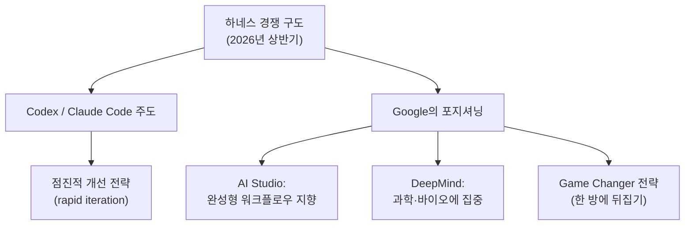
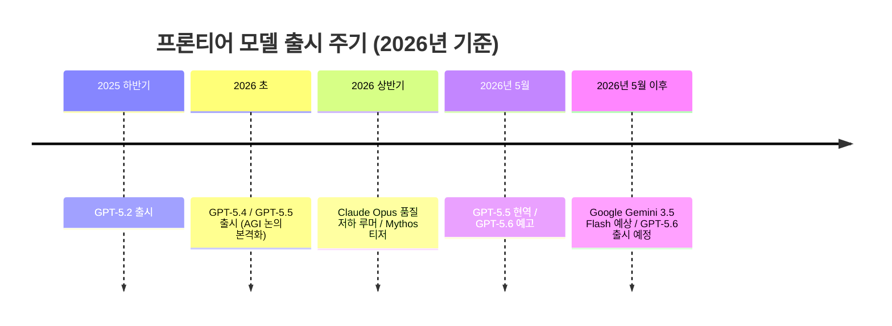
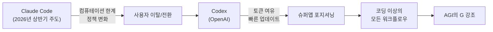
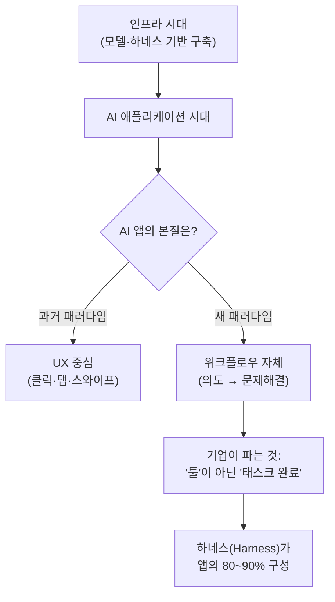
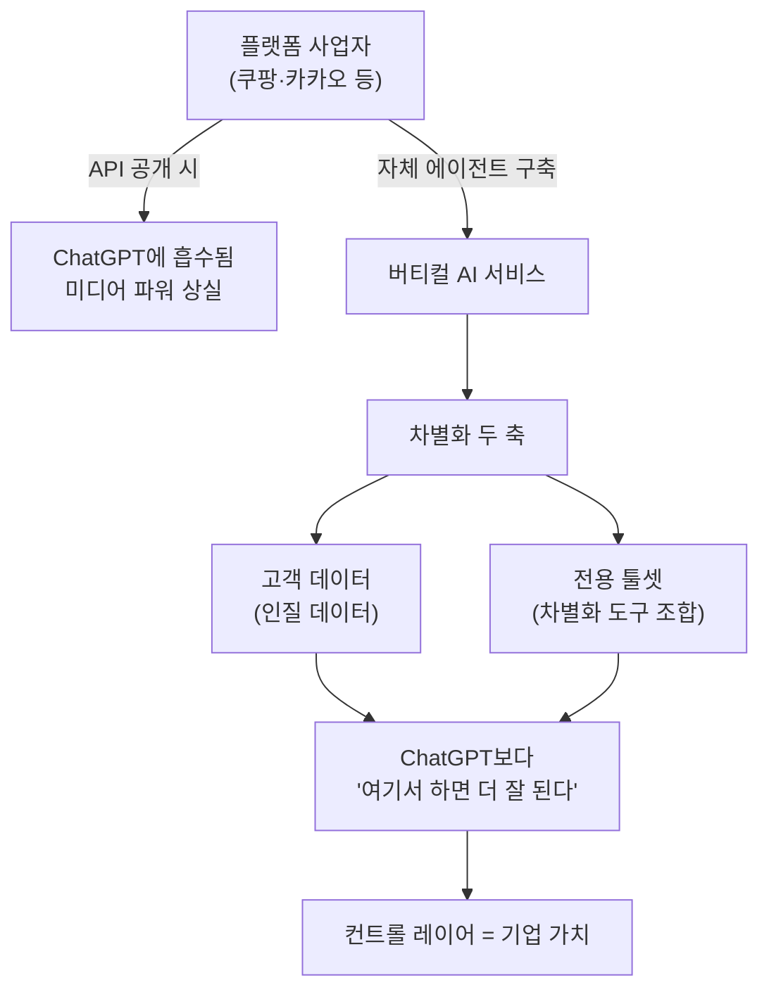
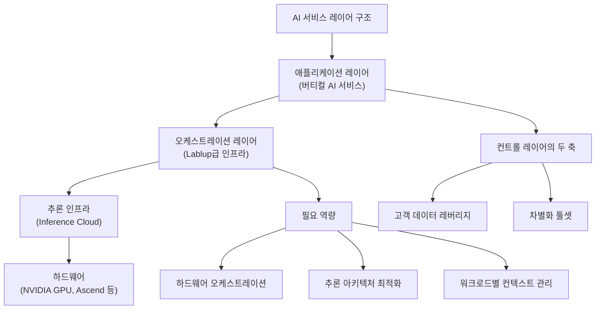
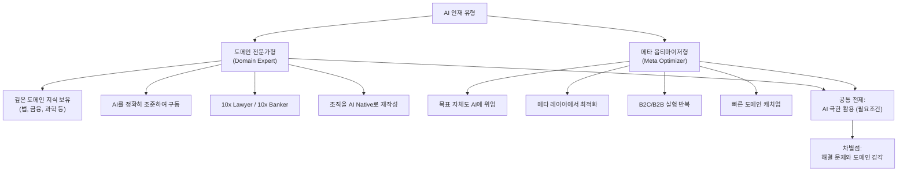
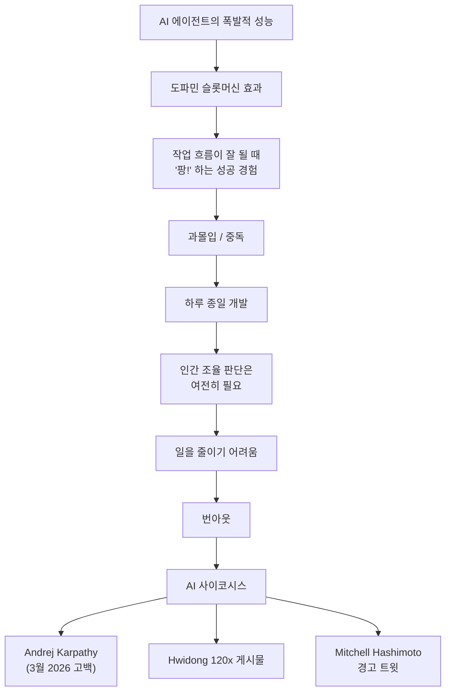
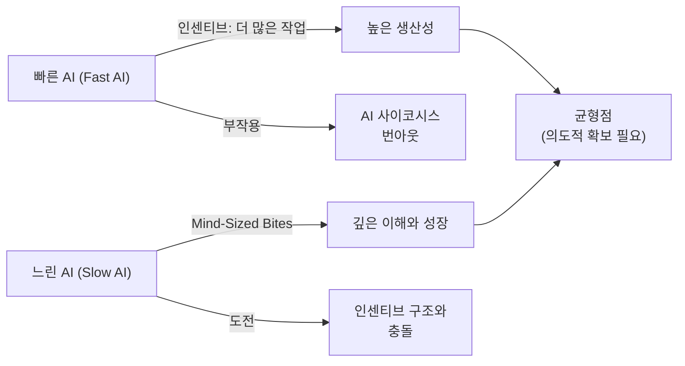
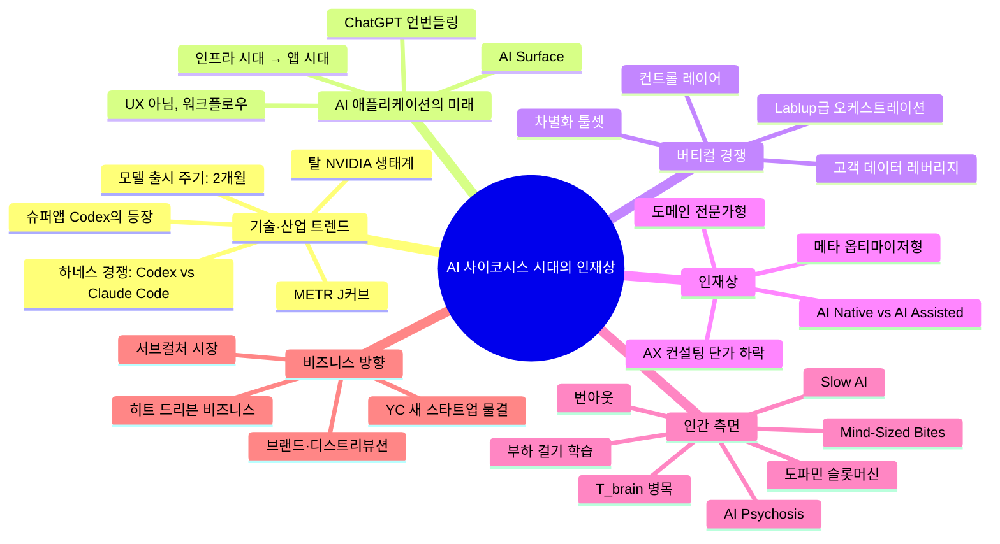

### AI Frontier 팟캐스트 — Chester Roh(노정석) & Seungjoon Choi(최승준)
> 2026년 5월 17일 녹화 / 2026년 5월 21일 공개

---

## 목차

1. [에피소드 개요](#1-에피소드-개요)
2. [Google I/O와 하네스 전쟁의 구도](#2-google-io와-하네스-전쟁의-구도)
3. [모델 출시 주기와 컴퓨테이션 제약](#3-모델-출시-주기와-컴퓨테이션-제약)
4. [탈 NVIDIA 생태계와 T_brain 병목](#4-탈-nvidia-생태계와-t_brain-병목)
5. [Claude 정책 변화와 슈퍼앱 Codex의 부상](#5-claude-정책-변화와-슈퍼앱-codex의-부상)
6. [120x 생산성과 엔지니어 번아웃](#6-120x-생산성과-엔지니어-번아웃)
7. [소프트웨어 제작 특권의 종말](#7-소프트웨어-제작-특권의-종말)
8. [AI 애플리케이션 시대의 개막](#8-ai-애플리케이션-시대의-개막)
9. [AI Surface와 인터페이스의 미래](#9-ai-surface와-인터페이스의-미래)
10. [버티컬 차별화: 고객 데이터와 툴 조합](#10-버티컬-차별화-고객-데이터와-툴-조합)
11. [AI Native vs AI Assisted: 결정적 구분선](#11-ai-native-vs-ai-assisted-결정적-구분선)
12. [AX 컨설팅 단가 하락과 새로운 AI 인재 기준](#12-ax-컨설팅-단가-하락과-새로운-ai-인재-기준)
13. [Lablup급 오케스트레이션과 컨트롤 레이어](#13-lablup급-오케스트레이션과-컨트롤-레이어)
14. [Benedict Evans의 언번들링 테제](#14-benedict-evans의-언번들링-테제)
15. [두 가지 인재상: 도메인 전문가 vs 메타 옵티마이저](#15-두-가지-인재상-도메인-전문가-vs-메타-옵티마이저)
16. [OMX와 B2C/B2B 실험 문화](#16-omx와-b2cb2b-실험-문화)
17. [메타 학습의 한계와 도메인 내면화](#17-메타-학습의-한계와-도메인-내면화)
18. [AI Psychosis와 도파민 슬롯머신](#18-ai-psychosis와-도파민-슬롯머신)
19. [Mitchell Hashimoto & Mario Zechner의 경고](#19-mitchell-hashimoto--mario-zechner의-경고)
20. [혼돈을 즐기는 인재: Cat Wu의 Anthropic 채용 철학](#20-혼돈을-즐기는-인재-cat-wu의-anthropic-채용-철학)
21. [Dwarkesh의 학습법: 부하 걸기(Load-Bearing Work)](#21-dwarkesh의-학습법-부하-걸기load-bearing-work)
22. [Slow AI와 Mind-Sized Bites](#22-slow-ai와-mind-sized-bites)
23. [브랜드·디스트리뷰션과 서브컬처 시장](#23-브랜드디스트리뷰션과-서브컬처-시장)
24. [종합: 전체 논의의 구조와 시사점](#24-종합-전체-논의의-구조와-시사점)

---

## 1. 에피소드 개요

2026년 5월 17일 일요일 아침, Chester Roh(노정석)와 Seungjoon Choi(최승준)가 오랜만에 학습 강의 형식을 벗어나 자유롭게 대화하는 '잡담 모드(banter mode)'로 돌아왔다. 이 에피소드는 AI Frontier 팟캐스트 97회로, 제목은 **"AI 사이코시스 시대의 인재(People in the Age of AI Psychosis)"** 다.

녹화 시점인 2026년 5월 중순은 AI 업계가 매우 빠르게 변화하는 한가운데였다. Claude Code와 Codex라는 두 AI 코딩 에이전트가 이미 코딩 영역을 넘어 모든 지식 노동자의 워크플로우로 스며든 시점이고, Google I/O 직전이라는 타이밍, OpenAI의 GPT-5.6 예고, Anthropic의 Claude Mythos 루머 등 굵직한 사건들이 겹친 시기다.

두 호스트는 이번 에피소드에서 다음의 핵심 주제들을 다룬다.

- AI 코딩 도구들이 '슈퍼앱'으로 진화하고 있다는 산업 트렌드
- 모델과 하네스가 사실상 범용 상품(commodity)화되어 가는 현상
- AI Native와 AI Assisted의 결정적 구분
- 도메인 전문가형 인재와 메타 최적화형 인재라는 두 가지 인재상
- AI 과몰입이 낳는 심리적 현상인 'AI 사이코시스'와 번아웃
- Slow AI 운동이 제기하는 반론
- 브랜드와 디스트리뷰션이 다시 중요해지는 히트 드리븐 비즈니스 시대

---

## 2. Google I/O와 하네스 전쟁의 구도

에피소드는 록화 시점에서 불과 며칠 뒤로 예정된 Google I/O 행사에 대한 이야기로 시작된다. 타임라인의 루머에 따르면 Gemini 3.5 Flash가 아레나(LLM 벤치마크 플랫폼)에 등장했다는 이야기가 돌고, Veo 4(비디오 생성 모델)의 출시 가능성도 거론되고 있었다.

여기서 Chester가 제기하는 핵심 관찰은 Google이 **하네스 경쟁(harness competition)** 에서 다소 뒤처져 있다는 점이다. 2025년 말 Google Antigravity가 나온 이후로 Codex(OpenAI)와 Claude Code(Anthropic)가 이 경쟁을 주도하고 있는데, Google은 그 속도를 따라가지 못하고 있다는 것이다.

대신 Google은 전혀 다른 방향의 전략을 취하고 있는 것으로 보인다. Google AI Studio를 보면, 사용자가 대략적인 의도만 말하면 에이전트가 알아서 완성된 결과물을 내놓는 워크플로우를 추구하고 있는 것으로 읽힌다. 즉, 단계적 점진적 개선보다는 **한 방에 판을 뒤집는 '게임 체인저'나 '쇼스토퍼(showstopper)'** 를 추구하는 전략이다.

이런 맥락에서 Demis Hassabis 관련 루머도 언급된다. DeepMind 수장인 그가 사실 코딩 같은 것은 매우 사소하게 여기고, 바이오테크, 과학, 노화, 질병 등을 해결하는 데 훨씬 더 관심을 가지고 있다는 이야기다. 이는 사실 여부가 불분명한 루머이지만, Google의 AI 전략이 단순한 코딩 에이전트 경쟁에 있지 않음을 시사하는 하나의 신호로 읽힌다.

---

## 3. 모델 출시 주기와 컴퓨테이션 제약

OpenAI의 GPT-5.6이 곧 출시될 것이라는 소식도 함께 언급된다. 현재 모델은 GPT-5.5이고 GPT-5.2는 이미 곧 서비스 종료(sunsetting)될 예정이다. Anthropic의 경우에는 'Claude Mythos'라는 코드명의 모델이 이미 "정말 놀랍다"고 티저가 돌고 있지만, 실제 출시가 늦어지는 이유 중 하나로 **Anthropic의 컴퓨테이션 자원 부족**이 거론된다.

이 지점에서 Seungjoon이 흥미로운 관찰을 제시한다. Dwarkesh Patel의 인터뷰(Ryan Petersen 에피소드)에서 프론티어 모델이 대략 **2개월 주기**로 교체된다는 전제하에 사전 훈련 컴퓨트 자원을 역산하는 계산이 나왔다는 것이다. 즉 현재 AI 업계에서 최신 프론티어 모델의 유효 수명은 약 2개월 정도이며, 이 주기는 계속 짧아지고 있다.

Chester는 이를 더 압축적으로 정리한다. 컴퓨테이션 양(quantity)은 지속적으로 늘어나고 있고, 동시에 컴퓨테이션 효율(efficiency)도 개선되고 있다. 여기에 DeepSeek V4 사례에서 보듯 알고리즘적 개선(algorithmic progress)도 더해지며 이 세 가지가 함께 작용하여 모델 성능이 빠른 속도로 오르고 있다.

GPT-5.4~5.5 수준부터는 업계에서 AGI라는 용어를 심심찮게 사용하기 시작했다. 물론 조심스러운 표현들이 따라붙는다. "고르지 않다(uneven)", "들쭉날쭉하다(jagged)", "어떤 면에서는 인간을 초월하지만 어떤 면에서는 바보 같다"는 식이다. 그러나 우리가 보통 지식 노동(knowledge work)이라고 부르는 대부분의 작업에서 성능이 극도로 강해진 것은 사실이라는 것이 두 호스트의 공통된 인식이다.

---

## 4. 탈 NVIDIA 생태계와 T_brain 병목

하드웨어 측면에서도 주목할 변화가 언급된다. 특히 추론(inference) 영역에서 NPU(Neural Processing Unit)와 전용 추론 칩들의 비중이 급격히 늘어나고 있다. DeepSeek V4가 화웨이 Ascend 칩을 언급한 것에서 드러나듯, **NVIDIA에 의존하지 않는 생태계**가 빠르게 확장되고 있다.

METR(모델 에이전트 평가 연구소)의 벤치마크에서 Claude Mythos 수준의 모델이 자율 작업을 16.5시간 이상 처리할 수 있다는 결과가 나왔다는 언급도 있다. 단, 현재 METR의 측정 방식 자체가 상당한 개정이 필요하다는 뉘앙스의 트윗도 있었다고 한다. 어쨌든 모델의 특정 도메인 내 성능이 J커브를 타고 있다는 것은 분명하다.

이 맥락에서 등장하는 개념이 바로 **T_brain**이다. 이전 Dwarkesh 에피소드에서 T_compute(컴퓨테이션 속도의 병목)와 T_mem(메모리 대역폭의 병목)을 이야기했다면, 이제 Seungjoon은 T_brain, 즉 **인간 뇌(human brain)가 병목**이 되는 시대를 이야기한다. 에이전트들이 너무 빠르게 돌아가는 반면 인간이 그 결과를 검토하고 조율하는 속도는 한계가 있어서, 결국 생산성의 상한선이 인간 두뇌의 처리 속도에 의해 결정된다는 것이다.

이것은 단순한 은유가 아니라 비즈니스적 의사결정과도 연결된다. 에이전트가 빠른 결과를 내더라도 중요한 조율과 의사결정은 여전히 인간이 해야 하기 때문에, 인간이 일을 줄이기가 어렵고 계속 달려야 하는 압박을 받게 된다.

---

## 5. Claude 정책 변화와 슈퍼앱 Codex의 부상

2026년 상반기는 사실상 **'AI 코딩 = Claude Code'** 의 시기였다. Claude Code라는 버즈워드가 AI 코딩 자체와 동의어처럼 쓰였고, 그 덕분에 수많은 사람들이 Anthropic에 가입하고, Claude Max 플랜이나 $20 플랜을 첫 출발점으로 삼았다. 이것이 Anthropic의 상반기 폭발적 성장에 결정적으로 기여했다.

그러나 Anthropic의 컴퓨테이션 자원에 한계가 드러나기 시작했다. Claude Opus 모델의 품질이 점진적으로 저하되는 사례들이 보고되었고, 6월부터 요금 체계를 변경한다는 발표도 나왔다. 루프(loop) 방식으로 계속 작업을 돌리거나 자원을 남용하는 사용자들에 대해 패널티를 부과하는 정책 변화도 감지되고 있다.

이 틈을 Codex(OpenAI)가 빠르게 파고들었다. OpenAI는 상대적으로 컴퓨테이션 자원에 여유가 있었고, Codex는 훨씬 넉넉한 토큰 헤드룸을 제공했다. Chester의 경우 Codex에서 주간 한도에 도달한 적이 거의 없다고 할 정도다. 데스크톱 앱과 CLI 모두 거의 매일 새 바이너리가 올라올 정도로 빠른 개발 주기를 보이고 있다.

이 시점에서 OpenAI가 Codex를 **슈퍼앱(super app)** 이라고 부르기 시작했다는 점이 중요하다. 슈퍼앱이란 어떤 종류의 작업이든 처리할 수 있는 범용 능력을 갖춘 앱을 의미한다. 이는 AGI의 'G(General)'가 점점 더 강조되는 시기와 맞물린다.

---

## 6. 120x 생산성과 엔지니어 번아웃

Seungjoon이 타임라인에서 발견한 Corca의 에이스 리드 배휘동(Hwidong)의 게시물이 인상적이라며 소개한다. 에피소드 67회(2025년 9월경)에서 배휘동은 엔지니어가 컴퓨트 멀티플라이어를 만드는 존재라고 이야기했는데, 그 이후로 지속적으로 밀어붙인 결과 내부 사용(dogfooding) 수준에서 **120배(120x)** 생산성이라는 수치에 도달했다는 것이다.

그러나 이 수치가 주목받는 이유는 놀라운 생산성 자체가 아니라, 그것이 만들어내는 **도파민 슬롯머신**의 심리 때문이다. 타임라인에서 스크롤을 내리다 보면 모델이 잘 동작해서 결과물이 팡 하고 터지는 순간들이 확률적으로 발생한다. 이런 성공 경험이 도파민을 자극하고, 사람들은 이것에 중독되어 하루 종일 개발만 하게 된다. 그리고 그 결과 다른 취미 생활은 사라지고 건강이 나빠지며, 식사 중에도 SSH로 에이전트에 작업을 할당하는 일이 일어나고 있다.

특히 중요한 지적은 이것이다. 에이전트를 오래 돌려도, 중요한 **조율과 의사결정은 여전히 인간이 해야** 한다. 그렇기 때문에 일을 줄이기 어렵고, "지금 멈추면 낭비"라는 압박감과 함께 계속 달려야 하는 악순환이 이어진다. 이것은 Seungjoon의 말처럼 일종의 **배경 속도(background speed), 불균형의 속도**에 맞추어 미친 듯이 달리는 압박이며, 이미 반년 전부터 번아웃 호소가 늘어나고 있는 상황이 더욱 심화되고 있다.

---

## 7. 소프트웨어 제작 특권의 종말

이 에피소드에서 Chester가 제기하는 가장 철학적인 주제 중 하나가 바로 **소프트웨어 제작이 특권이었던 시대의 종말**이다.

불과 1~2년 전까지만 해도, 소프트웨어를 만드는 능력은 상당한 학습과 훈련을 거쳐야만 진입할 수 있는 좋은 직업이었다. 소프트웨어를 만들 수 없어서 사업을 확장하지 못하거나, 아예 시작조차 못 하는 경우가 많았다. IT 스타트업을 창업할 때 사실상 엔지니어링 팀의 규모와 역량이 곧 회사의 역량이었고, 투자 유치 시 자금의 2/3가 엔지니어링·제품 팀의 인건비로 자연스럽게 흘러들어갔다. 이 패러다임이 10~20년 가까이 지속됐다.

그러나 지금은 상황이 달라졌다. Claude Code와 Codex를 통해 누구든 이전에는 만들지 못했던 것들을 만들 수 있게 됐다. DB, UX, 워크플로우가 담긴 제품을 개인이 만들어낼 수 있는 시대가 열린 것이다. 그 결과 수많은 제품들이 대량으로 쏟아져 나오고 있다.

그런데 흥미로운 역설이 등장한다. 누구나 뭔가를 만들 수 있게 되면서, 반대로 **남이 만든 것을 일부러 설치해서 써보려는 동기가 크게 줄어들었다**. 작년 가을~겨울만 해도 "이런 걸 만들었어요, 써보세요"라고 올리면 그 GitHub 레포를 가서 README를 읽고 설치해보는 사람이 있었지만, 이제 Chester도 Seungjoon도 그런 일을 거의 하지 않는다. 대신 흥미로운 포인트가 있다면, GitHub 레포를 받아서 자신의 에이전트에게 분석을 시킨다. 에이전트가 "특별한 게 없다" 혹은 "이 부분이 흥미롭다"고 판단하면, 흥미로운 부분은 클릭 한 번으로 자신의 코드베이스에 통합할 수 있다. 이런 시대로 진입하고 있다는 것이다.

---

## 8. AI 애플리케이션 시대의 개막

Chester는 현재 상황을 인터넷 시대나 모바일 시대와 비교하는 유추(analogy)를 제시한다. 인터넷 인프라가 깔리고 안정화되어 가격이 충분히 낮아진 이후, 애플리케이션의 시대가 열렸다. 모바일도 처음에는 Paper Toss, Angry Birds 같은 간단한 것들로 시작했지만, 이후 Uber, Airbnb 같은 거대 버티컬들이 모바일 위에 올라서면서 진정한 모바일 시대가 꽃피었다.

지금 AI 업계에서도 같은 유추가 이루어지고 있다. 모델들은 이미 충분히 안정됐고, 물론 계속 발전하겠지만, 일반인의 관점에서 추가적인 발전이 더 이상 의미 있는 한계 차이(marginal difference)를 만들지 않는 시점이 오면, 그것은 인프라가 충분히 안정되고 저렴해진 것과 같다. 그 이후가 바로 **AI 애플리케이션의 시대**다.

그렇다면 AI 애플리케이션은 어떤 모습일까? Chester는 분명히 말한다. 그것은 기존 모바일 앱이나 웹 서비스를 빠르게 만드는 것이 아니다. **AI 애플리케이션의 본질은 UX가 아니라 워크플로우 자체**다.

과거에는 기업들이 툴(tool)을 제공하면 사용자가 그 툴을 이용해 문제를 해결했다. 에이전트 시대에는 사용자가 의도(intent)만 제시하면, 기업은 **문제 해결 자체**를 팔아야 한다. 작업 완료(task completion)를 파는 것이다. 인터페이스는 자연어가 될 수도 있고, 대화형이 될 수도 있지만, 중요한 것은 UX의 형태가 아니라 '문제가 해결되었느냐'다.

---

## 9. AI Surface와 인터페이스의 미래

이 맥락에서 Jensen Huang이 말한 AI의 5개 레이어가 언급된다. 에너지 → 칩 → 모델 → 오케스트레이션 → 애플리케이션이라는 구조에서, 맨 위의 애플리케이션 레이어는 이제 우리가 알던 앱스토어 앱과는 다른 형태일 것이라는 것이다. 애플리케이션의 80~90%는 하네스(harness) 자체이고, 그 위에 사용자와 하네스 사이에 놓이는 인터페이스 부분만이 **AI Surface**다.

AI Surface의 형태에 대해서는 아직 의견이 분분하다. ChatGPT 같은 대화형 인터페이스, 자연어 대화, 음성 인터페이스, 혹은 궁극적으로는 Neuralink 같은 뇌-컴퓨터 인터페이스까지 다양한 견해가 있다. OpenAI가 Jony Ive와 협업하여 새로운 AI 폰을 만들고 있다는 루머도 이 맥락에서 언급된다. 이 기기는 기존 모바일 앱의 형태를 취하지 않고, 사용자가 보고 듣는 전체 맥락을 읽어서 자연스럽게 문제를 해결해주는 어시스턴트가 될 것이라는 예측이다.

Chester가 강조하는 것은, 인간에게 어떤 형태의 하드웨어 인터페이스가 있는 한(키보드든 음성이든), 근본적으로 바뀌지 않는 것들이 있다는 점이다. 진정한 변화를 위해서는 Neuralink처럼 뇌에 직접 연결하는 수준의 변화가 필요하다. 따라서 현재 Codex가 보여주는 모습, 즉 채팅 창을 AI Surface로 가지고 그 안에서 대화를 통해 작업을 처리하는 형태가, 당분간 모든 AI 애플리케이션의 미래 형태라고 볼 수 있다.

---

## 10. 버티컬 차별화: 고객 데이터와 툴 조합

Codex가 슈퍼앱이 된다면, 기존의 버티컬 기업들(Coupang, Kakao 같은 플랫폼 사업자들)은 어떻게 될까? Chester는 이 질문에 대한 답을 **"플랫폼 사업자와 ChatGPT 사이의 긴장관계"** 로 풀어낸다.

Codex는 이미 컴퓨터 사용(computer use) 기능이 있어서 "쿠팡에서 삼다수 주문해줘"라고 하면 이론적으로 할 수 있다. 그러나 실제로 완벽하게 작동하려면, 쿠팡이 자신의 모든 서비스를 깔끔한 API 형태로 OpenAI에 넘겨줘야 한다. 그런데 쿠팡은 절대 그렇게 하지 않는다. 쿠팡은 중간에 광고를 끼워 넣고, 다른 상품을 교차 판매하며 비즈니스를 운영하기 때문에, API를 넘기는 순간 자신의 미디어 파워를 모두 잃게 된다.

따라서 플랫폼 사업자와 범용 AI 에이전트 사이에는 **구조적 긴장 관계**가 형성된다. 이에 대응하여 쿠팡은 ChatGPT의 범용성으로는 할 수 없는 무언가를 자체적으로 구축하려 할 것이다. 고도로 개인화된 컨텍스트를 운영하고, 더욱 강화된 도구들을 만들어서, "ChatGPT에서도 할 수 있지만, 쿠팡에서 하면 훨씬 더 잘 된다"는 경험을 제공하는 것이다.

결국 이 새로운 버티컬 AI 서비스의 핵심 경쟁력은 두 축으로 압축된다.

1. **고객 데이터(customer data)**: 그 기업만이 가지고 있는 사용자 구매 이력, 선호도, 행동 패턴 등의 데이터. 사용자가 그 기업에 "인질로 잡힌" 데이터라고 표현할 수 있다.
2. **툴셋(toolset)**: 그 기업만이 가지고 있는 차별화된 도구들의 조합.

Chester는 이것을 단순하게 정리한다. **하네스 = 컨트롤 레이어**이며, 이 컨트롤 레이어를 얼마나 많이 장악할 수 있느냐가 앞으로 기업의 새로운 가치가 된다는 것이다.

---

## 11. AI Native vs AI Assisted: 결정적 구분선

회사들이 AI를 도입하는 과정에서 Chester가 강조하는 가장 중요한 개념적 구분이 등장한다. 바로 **AI Native**와 **AI Assisted**의 차이다.

**AI Native**는 전체 워크플로우가 사람의 개입이나 도움 없이 거의 완전하게 작동하는 것이다. AI가 프로세스의 처음부터 끝까지를 담당하고 인간은 최소한으로 개입한다.

**AI Assisted**는 사람이 하는 일 자체는 바뀌지 않되, AI가 중간에 들어와서 조금 더 좋게 만들어주는 것이다. 기존 업무 방식은 유지되고, AI는 보조 도구로서 작동한다.

지금 거의 모든 기업들이 "우리도 AI Native 기업이 되어야 한다"고 말하지만, 실제로 벌어지는 것은 대부분 AI Assisted다. Chester는 이것을 구체적으로 설명한다. 어떤 사람의 업무가 100 단위라면, 그것은 사실 5, 10, 20, 40, 50 단위로 쪼개진 여러 작업의 합이다. AI가 개입하면 바뀌는 것은 그 안의 몇 가지 수작업 부분뿐이다.

더 심각한 문제는 저항이다. 대부분의 사람들은 AI가 자신의 업무를 빼앗아 가는 것을 원하지 않는다. AI가 내 역할을 대체하면 나의 존재 이유가 사라지기 때문이다. 그 결과, AI Assisted 도구가 만들어져 제공되어도 사용하지 않는 경우가 많고, 사용하지 않으면 발전도 없다. 외부 컨설턴트나 개발자가 들어와 프로젝트를 수행하고 나가지만, 기업의 생산성은 그대로인 경우가 빈번하다.

이 상황은 과거 디지털 트랜스포메이션(DX), 프로세스 컨설팅이 항상 반복적으로 겪었던 문제와 동일하다. McKinsey나 BCG가 들어와도 기업이 근본적으로 변화하지 않는 것과 같은 패턴이다. 이것은 AI나 기술의 문제가 아니라, 본질적으로 **경영의 문제**다.

---

## 12. AX 컨설팅 단가 하락과 새로운 AI 인재 기준

이런 배경 위에서 AX(AI Transformation) 컨설팅 시장의 아이러니가 드러난다. AI를 통해 기업의 업무를 AI Native화 도와주는 역할, 혹은 FDE(Forward Deployed Engineer, 현장 배치 엔지니어)로 사업 문제를 해결하는 역할의 수요는 많지만, **단가는 오히려 낮아지고 있다**는 것이다.

왜냐하면 그 일을 의뢰하는 기업 쪽에서도 "AI가 다 해줄 텐데, 당신은 정확히 뭘 하는 거예요? 어차피 Claude Code 클릭하는 거 아닌가요? 왜 이렇게 비싸요?"라고 생각하기 때문이다. 더욱이 이런 'AI 클릭 작업'을 할 수 있는 사람들이 기하급수적으로 늘어나면서 시장 가격이 하락하고 있다.

Chester의 결론적 조언은 역설적이다. "회사에 들어가서 AI Assisted 무언가를 만들어줄 거라고 하는 사람들에게, 그 워크플로우를 직접 AI Native로 재작성해서 그 회사를 공격하세요. 그러면 그 회사가 가진 것을 가져올 수 있습니다." 즉, 내부 효율화를 돕는 것이 아니라, 그 비효율적 기업의 영역을 AI Native 방식으로 직접 창업하여 경쟁하는 것이 더 나은 선택이라는 것이다. **"남의 마진이 나의 기회"** 다.

그렇다면 진정한 의미의 AI 인재는 누구인가? 6개월 전에는 Claude Code를 잘 쓰는 것, Codex 안에서 OMX를 Hermes 에이전트에 연결해서 작업하는 것이 AI 인재였다. 하지만 지금은 그런 능력을 가진 사람들이 너무 많아져서, 그것만으로는 AI 인재라고 부르기 어렵다. 이제 AI 인재의 기준은 훨씬 높은 차원으로 이동했다.

---

## 13. Lablup급 오케스트레이션과 컨트롤 레이어

진정한 AI 서비스를 구축하려면 놀랍도록 높은 수준의 인프라 역량이 필요하다는 주제로 넘어온다. Codex 같은 하네스를 설치하고 운영하려면, 그 아래에 있는 인프라가 프론티어 랩들이 구축하고 있는 **추론 클라우드(inference cloud)** 수준의 인프라 및 엔지니어링 역량을 갖춰야 한다.

단순히 vLLM이나 SGLang을 설치하고 "됐다"고 말하는 수준이 아니다. 하드웨어 오케스트레이션, 그 위에서 작동하는 툴 운영, 워크로드에 최적화된 추론 아키텍처 설계 등 복잡한 엔지니어링이 필요하다. 어떤 워크로드는 프리필(prefill) 청크를 대량으로 생성하고, 어떤 워크로드는 디코드(decode) 의존성이 크며, 컨텍스트 길이도 완전히 달라질 수 있다. 이 모든 변수에 따라 엔지니어링 인프라가 완전히 달라져야 한다.

한국에서 이런 오케스트레이션 분야의 최정점에 있는 기업으로 Chester는 **Lablup**을 꼽는다. 이 회사가 처리하는 워크로드를 들여다보면 인프라 관점에서 많은 통찰을 얻을 수 있다고 한다.

이것은 2000년대 초반 Google이 BigTable, MapReduce, Borg 같은 분산 컴퓨팅 시스템을 내부에서 운영할 때와 유사하다. 당시 그것을 처음 본 엔지니어들은 "이건 미친 것"이라고 생각했고, 외부 오픈소스 커뮤니티가 Hadoop 같은 시스템으로 따라잡는 데 꽤 오랜 시간이 걸렸다. 지금도 비슷한 수준의 인프라 격차가 존재한다는 것이다.

---

## 14. Benedict Evans의 언번들링 테제

Chester가 오랫동안 좋아해 왔다고 말하는 a16z 출신의 테크 분석가 Benedict Evans의 통찰이 이 지점에서 소환된다. Evans의 핵심 주장은 이렇다.

**지난 20년, 웹 시대와 모바일 시대는 결국 Oracle을 언번들링(unbundling)하는 과정이었다.** 모든 정보는 데이터베이스에 있고, Oracle만 있으면 사실상 모든 비즈니스를 할 수 있다. Oracle과 웹 인터페이스만 있어도 모든 것을 할 수 있었지만, 우리는 이것을 수백·수천 개의 B2B SaaS와 B2C 애플리케이션으로 쪼개서 차별화했다.

ChatGPT와 Codex의 시대도 다르지 않다. ChatGPT와 Codex는 모든 것을 할 수 있다. 그러나 이것을 각각의 영역으로 **언번들링(unbundling)하는 서비스들이 무수히 생겨날 것**이라는 게 Evans의 예측이다. 택시 호출, 생일 파티 준비, 주말 나들이 결정, 레스토랑 예약 등 모든 것을 하나로 묶으려는 사업자가 나타나겠지만, 모든 전선을 동시에 방어할 수 없기 때문에, 결국 각 개별 영역에서 가장 잘하는 기업들이 등장하게 된다. 그것이 한 번 사이클을 돌면, 오늘날 네이버·쿠팡·Cafe24·인스타그램 인플루언서 셀러가 공존하는 균형처럼, AI 시대에도 그런 균형이 형성될 것이다.

Evans는 2025년 11월 발표에서도 모델이 사실상 상품화(commodity)에 가까워지고 있고, 진짜 모트(moat, 해자)는 모델 자체가 아니라 그것을 어떻게 사용하느냐에 있다는 점을 강조했다.

---

## 15. 두 가지 인재상: 도메인 전문가 vs 메타 옵티마이저

Chester는 현재 자신이 인재를 크게 두 가지 유형으로 나눈다고 설명한다.

**첫 번째 유형: 도메인 전문가(Domain Expert)**
특정 분야에 대한 깊은 지식을 이미 가지고 있는 사람으로, 그 지식을 바탕으로 AI를 정확히 조준하여 구동할 수 있다. 예를 들어 변호사나 투자은행 출신자들이 자신의 분야에서 어떤 문제를 해결해야 하는지, 동료들이 AI를 따라가지 못하는 이유가 무엇인지를 정확히 이해하고, AI를 극한으로 활용하여 10x Lawyer, 10x Banker로 스스로를 변신시키는 경우다. 그들은 기존에 조직 전체가 해야 했던 문제 해결을 에이전트와 함께 혼자 또는 소수로 제공하려 한다.

**두 번째 유형: 메타 옵티마이저(Meta Optimizer)**
목적 자체를 명확히 모르더라도, 메타 수준에서 그 목적 자체를 AI에 위임하고 최적화하는 사람이다. 명확한 목표 없이도 AI에게 목표 발견까지 맡겨서, 빠르게 도메인 지식을 따라잡고 실험을 반복하는 유형이다. auto research와 Ralph loop를 결합하고, 암묵적 지식이라고 생각했던 부분도 AI에 위임하여, 목표 최적화 자체를 메타 레이어로 끌어내린다.

두 유형 모두 이미 AI를 극도로 활용한다는 것을 전제로 한다. AI 툴 준비도는 이제 두 유형 모두에게 당연히 갖춰야 하는 것(necessary condition)이지만, 충분 조건(sufficient condition)은 아니다. 그 위에 어떤 문제를 해결할 것인가, 어떤 도메인 감각을 가지고 있는가가 진정한 차별점이 된다.

---

## 16. OMX와 B2C/B2B 실험 문화

Chester가 '젊은 불사신' 또는 '이상한 사람들'이라고 부르는 부류의 이야기도 나온다. 주변에서 "OMX 같은 걸 만들어서 뭐하려고?"라고 무시하는 시선도 있지만, Chester 본인은 OMX 자체가 극히 좋은 제품이라고 생각하며 최근에도 많이 사용하고 있다.

이들이 공략하는 분야는 주로 B2C 애플리케이션이다. 예를 들어 캐릭터 챗 서비스인 Zeta가 월 매출 360만 달러(약 50억 원) 이상을 기록한다는 이야기가 나온다. 2~3명으로 구성된 팀이나 솔로 파운더가 월 수십만 달러의 매출을 내는 사례도 등장하고 있다.

이들의 작업 방식은 타깃 대상을 정해두고 auto research를 실행하고, Ralph loop와 결합하여 돌리며, 암묵적 지식이라고 여겼던 부분도 AI에 위임한다. 목표 최적화 자체를 메타 레이어로 내리고, AI에게 그 목표도 발견하게 한다. 자신들이 부족했던 분야 지식을 매우 빠르게 따라잡는 방식이다.

B2B SaaS 영역에서도 비슷한 현상이 나타난다. B2B 논리를 정확히 이해하지 못하면서도 클릭 클릭 클릭으로 만들어내는 사람들이 늘어나고 있다. Chester와 Seungjoon 모두 이 두 번째 유형의 인재들, 즉 메타 옵티마이저들의 등장을 목격하고 있다.

---

## 17. 메타 학습의 한계와 도메인 내면화

흥미로운 자기 고백의 순간이 에피소드에 나온다. Chester가 최근 장수(longevity)와 바이오테크를 공부하면서 메타 옵티마이저 방식, 즉 OpenCode 루프에 LLM을 연결하여 분자생물학 관련 논문과 기업들을 분석시키고 자신이 원하는 것에 도달하는 최단 경로를 한두 페이지씩 정리시키는 방식을 사용했다고 말한다. 한두 달 만에 그 분야에서 수년간 일한 사람들과 대화할 때 맥락이 대략 맞는 수준에 도달했다고 한다.

그러자 Seungjoon이 예리한 반박을 제기한다. 그건 순환 논리가 있다는 것이다. Chester가 그 방법론으로 바이오테크를 빠르게 흡수할 수 있었던 것은, 사실 Chester가 10년 넘게 관련 책을 읽어오며 이미 기본 토대를 갖추고 있었기 때문이라는 것이다. 그리고 Chester 스스로 이를 인정한다. "1~2개월 만에 완전히 낯선 분야를 마스터했다는 것은 분명한 거짓말"이라는 것이다.

이로부터 도출되는 질문이 중요하다. 메타 옵티마이저 방식으로 계속 일하는 것이 지속 가능한가? 업무는 처리되고 비즈니스도 지속 가능할 수 있지만, **개인의 성장과 발전도 지속 가능한가**라는 것이다. Seungjoon은 'bio token'이라는 표현을 사용한다. AI를 다루면서 사람들은 엄청난 양의 작업을 동시에, 컨텍스트 스위칭하며 처리하는데, 실제로 학습을 통해 내면화하지 않으면 인간의 뇌는 결국 소진된다.

---

## 18. AI Psychosis와 도파민 슬롯머신

에피소드의 제목이기도 한 **AI Psychosis(AI 사이코시스)** 에 대한 본격적인 논의가 시작된다. Seungjoon이 Sarah Guo의 에피소드에서 Andrej Karpathy(OpenAI 공동 창업자, 前 Tesla AI 총괄)가 한 말을 소개한다.

Karpathy는 2025년 10월 Dwarkesh의 인터뷰에서만 해도, Cursor에서 탭 자동완성을 신중하게 사용하는, 즉 자신의 뇌를 사용하는 방식을 유지하고 있었다. 그러나 OpenClaw(오픈소스 대형 에이전트 프레임워크)가 등장한 이후, FOMO(놓치면 안 된다는 두려움)가 작동하면서 모든 것을 에이전트에 위임하기 시작했고, 도파민 히트를 계속 맞으면서 과몰입 상태가 되었다. 그래서 Karpathy 스스로 "나는 지금 사이코시스 상태"라고 표현했다.

Fortune에 따르면 Karpathy는 2026년 3월에 "나는 몇 달째 코드를 한 줄도 직접 쓰지 않았고, 무엇이 가능한지를 알아내려는 일종의 사이코시스 상태에 있다"고 밝혔다.

이 사이코시스는 슬롯머신의 심리와 연결된다. Chester도 공감을 표하며 자신의 경험을 이야기한다. 할 일 목록에 무언가를 적어두면 이미 다 한 것 같은 착각이 온다. AI에게 할당하면 AI가 해줄 테니까. 그래서 너무 명확하게 정의된 일들은 오히려 미루게 된다는 것이다.

Seungjoon은 이것이 구조적으로 강요되는 현상이라고 지적한다. 이 시장과 사회의 인센티브 자체가, AI를 기본 체력처럼 사용할 수 있는 사람들에게 보상을 주고 있기 때문에, 많은 사람들이 과몰입 상태에 자신을 몰아넣지 않을 수 없는 상황이다.

---

## 19. Mitchell Hashimoto & Mario Zechner의 경고

이 에피소드에서 소개하는 두 가지 중요한 경고문이 있다.

### Mitchell Hashimoto의 경고

HashiCorp 공동 창업자 Mitchell Hashimoto는 2026년 5월 15일 X(구 트위터)에 올린 게시물에서 강한 우려를 표명했다. 그의 요지는 이렇다.

클라우드 전환 시기에 인프라 업계에서 **MTBF(평균 고장 간격, Mean Time Between Failure) vs MTTR(평균 복구 시간, Mean Time To Recovery)** 을 둘러싼 격렬한 논쟁이 있었다. 이제 그 논쟁이 소프트웨어 개발 업계 전체에서 다시 반복되고 있다는 것이다.

AI 사이코시스에 빠진 기업들은 거의 절대적으로 "MTTR이면 충분하다"는 사고방식으로 움직인다. "버그를 배포해도 괜찮다. 에이전트들이 인간보다 빠른 속도와 규모로 고쳐줄 테니까!"라는 식이다. 그러나 Hashimoto는 경고한다.

인프라에서 이미 배웠다. MTTR은 훌륭하지만, 회복력 있는 시스템 전체를 내던져서는 안 된다는 것을. 자동화를 통해 스스로를 회복력 있는 재앙 제조기로 만들 수 있다. **시스템은 국소적 지표상으로는 건강해 보일 수 있지만, 전역적으로는 점점 이해 불가능해질 수 있다. 버그 리포트는 줄어들지만 잠재적 위험은 폭발적으로 커질 수 있다. 테스트 커버리지는 올라가지만 의미론적 이해는 떨어질 수 있다.**

이 게시물은 1,367,077회 조회라는 반향을 일으켰다.

### Mario Zechner의 경고

OpenClaw의 핵심 라이브러리로 사용되는 Pi의 개발자 Mario Zechner는 2026년 3월 25일 블로그 포스트에서 유사하지만 더 기술적인 관점의 경고를 제기했다.

그는 에이전트 코딩의 핵심 문제를 세 가지로 정리한다.

첫째, **에이전트는 학습하지 않는다**. 인간 개발자는 같은 실수를 반복하다 보면 배우고 더 이상 그 실수를 하지 않게 된다. 그러나 에이전트는 기본 상태에서는 같은 실수를 계속 반복한다.

둘째, **에이전트는 병목이 없다**. 인간은 병목이다. 하루에 주입할 수 있는 실수의 양에 한계가 있어서, 실수들이 천천히 쌓인다. 그리고 고통이 너무 커지면 누군가가 나서서 치운다. 그러나 에이전트 군단을 오케스트레이션하면 병목도 없고 인간이 느끼는 고통도 없다. 작고 사소한 무해한 실수들이 감당 불가능한 속도로 불어나고, 결국 어느 날 돌아서보면 새 기능을 추가할 수도 없는 망가진 아키텍처가 되어 있다.

셋째, **에이전트형 검색의 낮은 재현율(recall)**. 에이전트는 코드베이스 전체를 보지 못하고 항상 국소적인 단면만 본다. 그래서 기존 코드를 놓치고, 중복을 만들고, 불일치를 도입한다.

Zechner의 결론은 "좀 씨X, 천천히 가자"다. 에이전트에게 지루한 일을 맡기되, 시스템의 게슈탈트(아키텍처, API)는 직접 써라. 하루에 에이전트가 생성하게 둘 코드 양에 제한을 걸어라. 그리고 그 한도는 당신이 실제로 검토할 수 있는 능력 범위 안에 있어야 한다.

Chester는 이에 대해 자신의 광고 관리 업무에 AI를 적용하는 사례를 이야기한다. 과거에는 AI가 낸 보고서(어떤 항목을 켜고 끌지, 무엇을 만들지)를 본인이 직접 검토했지만, 지금은 Ralph를 세 번 돌려서 세 번 모두 맞다고 하면 그냥 버튼을 누른다고 한다. 그러면서 "이건 모든 문제를 컴퓨트로 줄여서 해결할 수 있다는 이상주의적 사고방식"이라는 점을, 그리고 "모델이 나보다 낫다는 가정이 깔려 있다"는 점을 인정한다.

---

## 20. 혼돈을 즐기는 인재: Cat Wu의 Anthropic 채용 철학

Lenny's Podcast에 출연한 Cat Wu(Claude Code 제품 총괄, Head of Product)의 발언이 소개된다.

Anthropic에서는 어제 P0(우선순위 0, 최상급 긴급) 이슈가 하나 있었는데, 다음 날 두 자리 숫자 P0이 될 수 있다. 즉, 문제의 규모와 우선순위가 하루 사이에 완전히 달라질 수 있다. 이런 상황에서 하나하나에 스트레스를 받으면 번아웃된다.

Anthropic이 채용할 때 기본 역량이 갖춰진다는 전제하에 찾는 것은 **혼돈을 즐길 수 있는 사람(someone who can enjoy chaos)** 이다. "이거 엄청 어려울 것 같네, 근데 재밌겠다, 최선을 다해보자"는 식의 낙관성과 회복력을 가진 사람이다.

그러나 Chester는 이것이 불편한 진실이라고 지적한다. 우리가 '좋은 직업'이라고 부르는 것들은 대체로 안정적인 타이틀을 가지고 큰 노력 없이 안정적인 일을 반복해도 높은 소득을 얻을 수 있는 자리였다. 의사나 변호사 같은 전문직도, 일반 기업의 엔지니어·PM·디자이너도 마찬가지였다. 정해진 시간 안에 정해진 일을 처리하면 의미가 있었고, 그것이 지능과 교환되는 것이었다.

그런데 이제 그런 일자리들이 사라지고 있다. 따라서 Cat Wu가 말하는 '불확실성을 견디고 그 안에서 의사결정하는 능력'은 단순한 미덕이 아니라, 앞으로 생존을 위한 필수 요건이 되어가고 있다는 것이다.

Cat Wu의 Claude Code 관련 인사이트로는 다음도 주목할 만하다.

- 제품 개발 주기가 6개월 → 1개월 → 1주일 → 하루까지 단축됐다.
- PM 역할은 분기별 로드맵 조율에서 매일 제품을 출시할 수 있도록 돕는 방향으로 전환되고 있다.
- 가장 효율적인 단위는 '제품 감각 있는 엔지니어'다. PM 없이도 사용자 피드백을 확인하고 일주일 안에 제품을 출시하는 경우가 많다.
- Anthropic 직원들은 외부 SaaS 구매보다 내부 도구를 직접 만드는 것을 선호한다.

---

## 21. Dwarkesh의 학습법: 부하 걸기(Load-Bearing Work)

에피소드의 주요 참고 인물로 Dwarkesh Patel이 등장한다. 26세의 젊은 팟캐스터인 Dwarkesh는 AI를 매우 잘 사용하면서도, 동시에 자신의 학습 능력을 의도적으로 키우는 균형을 잡고 있다는 점에서 주목받는다.

Dwarkesh가 Michael Nielsen(YC Research, Greg Brockman과 Chris Olah가 그의 책으로 공부했다고 알려진)으로부터 받은 조언이 소개된다. 핵심은 "자신의 사고에 부하를 거는 작업을 하라(do work that puts a load on your own thinking)"는 것이다. 까다로운 산출물을 만들어보고, 글로 정리하고, 설명하려 해보라. 그런 작업이 학습을 다음 수준으로 끌어올린다는 것이다.

Dwarkesh는 이 조언에 따라 실제로 다음과 같은 행동을 하고 있다.

- AlphaGo를 처음부터 직접 구현하는 공부를 하며, 그 학습 내용을 사이트에 게시했다.
- Lenny's Pod 에피소드, Eric Jang 에피소드에 대한 플래시카드 덱을 직접 만들어 스스로 풀어보는 훈련을 한다.
- Anki 같은 간격 반복 학습 기법을 실제로 실천하고 있다.
- 자신의 컨텍스트 안에서 학습 경로를 직접 설계하고, 단순히 AI를 잘 사용하는 것을 넘어 자신의 역량을 높이는 데 노력한다.

Seungjoon의 결론은 AI를 극한으로 잘 사용하는 것이 전부가 아니라, **자신의 학습을 개선하는 작업을 소홀히 해서는 안 된다**는 것이다. 그것은 결정적인 답은 아닐 수 있지만, 과몰입과 번아웃 속에서도 잃지 말아야 할 방향이다.

---

## 22. Slow AI와 Mind-Sized Bites

에피소드의 마지막 주요 주제는 **Slow AI** 운동이다. Jenny Huang의 블로그 글(2026년 5월 4일)에서도 상세히 다루어진 이 개념은, Seymour Papert의 표현인 **"Mind-Sized Bites(마음이 소화할 수 있는 크기의 한 입)"** 에서 영감을 받았다.

AI를 통해 엄청난 양을 소화하고 배울 수 있지만, 결국 자신이 실제로 처리할 수 있는 크기의 덩어리여야 한다는 것이다. AI의 속도에 맞추는 것이 아니라, 나의 속도에 맞춰 AI를 활용하는 방식(Slow AI)이 더 나을 수 있다는 시각이다.

Jenny Huang은 AI를 느린 사고를 위해 사용할 수 있다고 제안한다. 파인먼식 질문의 꼬리를 따라가게 하고, 구체적인 예시를 만들게 하며, 러버덕 역할을 하게 하고, 반대편 입장에서 비판적으로 논증하게 할 수 있다. 윤리학자 조시 메이의 표현처럼 "LLM은 당신의 사고에 대한 입력을 생성하는 데 사용해야지, 다른 사람들이 읽을 출력을 생성하는 데 사용해서는 안 된다"는 원칙이 핵심이다.

그러나 현실적으로 이 시대의 인센티브 구조는 Slow AI와 반대 방향을 향하고 있다. 지금의 시장과 직장은 AI를 기본 체력처럼 빠르게 많이 처리하는 사람에게 보상하기 때문에, 번아웃은 구조적으로 피할 수 없다고 Seungjoon은 이야기한다.

결국 Slow AI와 빠른 AI 두 학파는 대립하는 것처럼 보이지만, 사실 양립 가능할 수 있다. 빠르게 처리할 것들은 빠르게 처리하되, 자신의 진짜 성장과 이해를 위한 공간은 의도적으로 확보해야 한다는 것이다. 그리고 그 균형이 AI 사이코시스를 피하는 길이다.

---

## 23. 브랜드·디스트리뷰션과 서브컬처 시장

에피소드 후반부에서 Chester는 현재 상황이 엔터테인먼트 산업과 비슷한 **히트 드리븐 비즈니스(hit-driven business)** 처럼 느껴진다고 이야기한다.

이것은 단순히 '무언가를 만드는 능력'보다 **브랜드와 디스트리뷰션(brand & distribution)** 이 다시 중요해지고 있다는 의미다. 물론 브랜드도 자신이 직접 만드는 것이 가장 좋지만, 그 원리는 마케팅의 기초인 포지셔닝으로 돌아간다. 최고가 되기보다 **유일한 존재(the only one)** 가 되는 것이 핵심이다. 자신만의 카테고리에서 1등이 되면, 시장 크기가 의미 있는 한 생존할 수 있다.

이와 함께 **서브컬처** 시장의 부상도 주목된다. 젊은 세대들이 전통적인 성공 기준인 좋은 집, 좋은 차를 기준으로 삼지 않고, 자신만의 커뮤니티를 형성하여 그 안에서 자신의 가치를 추구하고 있다. 이것을 과거에는 "주류에서 이기지 못한 사람들의 집단"이라고 흘려넘겼지만, 이제는 그 자체가 하나의 독립된 세계가 되고 있다.

심지어 Chester는 **AI를 하지 않기로 결정하는 사람들의 숫자**가 늘어날 수 있다고 이야기한다. 그리고 그런 사람들이 자신만의 힘을 형성한다면, 그것 자체가 하나의 시장이 된다. AI가 없는 경험, 인간적인 접촉, 느린 속도의 가치가 새로운 형태의 차별화 포인트가 될 수 있다.

---

## 24. 종합: 전체 논의의 구조와 시사점

이 에피소드 전체의 논의를 하나의 구조로 정리하면 다음과 같다.

### 핵심 논지 요약

**첫째, 기술 트렌드 측면**에서 보면, 모델과 하네스의 선순환(virtuous cycle)은 계속되고 있으며 이 사이클이 더욱 빨라지고 있다. 2개월 주기로 모델이 교체되고, Claude Code와 Codex는 단순 코딩 도구를 넘어 슈퍼앱으로 진화하고 있다. NVIDIA 의존을 벗어나는 생태계도 확장 중이며, 인간의 뇌(T_brain)가 새로운 병목으로 부상하고 있다.

**둘째, AI 애플리케이션의 본질**은 UX가 아니라 워크플로우 자체다. 기업은 이제 툴을 파는 것이 아니라 문제 해결(task completion)을 팔아야 한다. 그리고 이 새로운 애플리케이션의 80~90%는 하네스이며, 그 위의 AI Surface만이 사용자에게 보이는 인터페이스가 된다.

**셋째, 버티컬 경쟁의 핵심**은 컨트롤 레이어에 있다. 고객 데이터와 차별화된 툴셋의 조합이 ChatGPT라는 범용 에이전트에 맞서는 유일한 방어선이 된다. Benedict Evans의 언번들링 테제처럼, ChatGPT를 언번들링하는 수많은 버티컬 서비스들이 생겨날 것이다.

**넷째, AI 인재의 기준**은 지속적으로 높아지고 있다. Claude Code를 잘 쓰는 것은 이제 필요조건도 되지 못하는 시대로 빠르게 진입 중이다. 진정한 AI 인재는 도메인 전문가형이든 메타 옵티마이저형이든, AI 극한 활용 위에 어떤 문제를 해결할지에 대한 감각과 타이밍을 갖추어야 한다.

**다섯째, AI Psychosis는 실재한다.** Karpathy, Hashimoto, Zechner, 배휘동의 사례 모두 공통점이 있다. 빠른 AI의 사이클에 맞추다 보면 도파민 과자극, 번아웃, 아키텍처 부채, 개인 성장의 정체 등 복합적인 부작용이 나타난다. Slow AI와 Mind-Sized Bites, Dwarkesh의 부하 걸기 학습은 이에 대한 의미 있는 대안적 시각을 제공한다.

**여섯째, 브랜드·디스트리뷰션·서브컬처**가 다시 중요해지는 시대다. 만드는 능력이 평준화되면, 결국 어떤 포지셔닝을 가지고, 어떤 고객에게 어떤 채널로 도달하느냐가 차별점이 된다. AI를 거부하는 사람들의 집단도 하나의 시장이 될 수 있다.

---

## 부록: 에피소드 참고 자료

| 항목 | 내용 |
|------|------|
| **에피소드** | AI Frontier EP 97 |
| **제목** | People in the Age of AI Psychosis |
| **녹화일** | 2026년 5월 17일 |
| **공개일** | 2026년 5월 21일 |
| **호스트** | Chester Roh(노정석), Seungjoon Choi(최승준) |
| **원본 링크** | https://www.youtube.com/watch?v=cUc8iK6LG0k |
| **전사본** | https://aifrontier.kr/ko/episodes/ep97 |
| **Mitchell Hashimoto 트윗** | https://x.com/mitchellh/status/2055380239711457578 |
| **Mario Zechner 블로그** | https://mariozechner.at/posts/2026-03-25-thoughts-on-slowing-the-fuck-down |
| **Jenny Huang Slow AI** | https://jennyhuang19.github.io/slow-ai-ai-that-meets-a-humans-pace |
| **Cat Wu (Lenny's Pod)** | https://www.youtube.com/watch?v=PplmzlgE0kg |
| **Dwarkesh 학습 노트** | https://www.dwarkesh.com/p/what-i-learned-april-15 |
| **Benedict Evans** | https://www.ben-evans.com/ |

---

