> **출처**: 알리바바 Qwen 공식 블로그 ([qwen.ai/blog?id=qwen3.7](https://qwen.ai/blog?id=qwen3.7)), AI타임스 ([aitimes.com](https://www.aitimes.com/news/articleView.html?idxno=210745)), Alibaba Cloud Summit 2026 발표 자료  
> **공개일**: 2026년 5월 20일 (한국시간 기준)  

---

## 목차

1. [개요 및 배경](#1-개요-및-배경)
2. [핵심 설계 철학: 에이전트 퍼스트](#2-핵심-설계-철학-에이전트-퍼스트)
3. [주요 기능과 능력 영역](#3-주요-기능과-능력-영역)
4. [벤치마크 성능 분석](#4-벤치마크-성능-분석)
5. [핵심 기술: 환경 스케일링](#5-핵심-기술-환경-스케일링)
6. [크로스-하네스 일반화](#6-크로스-하네스-일반화)
7. [35시간 자율 커널 최적화 실험](#7-35시간-자율-커널-최적화-실험)
8. [강화학습 기반 보상 해킹 자기 진화](#8-강화학습-기반-보상-해킹-자기-진화)
9. [YC-벤치: 스타트업 시뮬레이션](#9-yc-벤치-스타트업-시뮬레이션)
10. [프런트엔드 코딩과 멀티미디어 생성](#10-프런트엔드-코딩과-멀티미디어-생성)
11. [사무 자동화: 오피스 도구 통합](#11-사무-자동화-오피스-도구-통합)
12. [물리 세계 탐색 에이전트](#12-물리-세계-탐색-에이전트)
13. [지원 에이전트 프레임워크와 개발 환경](#13-지원-에이전트-프레임워크와-개발-환경)
14. [API 사용법 및 실제 연동 방법](#14-api-사용법-및-실제-연동-방법)
15. [경쟁 모델 대비 포지셔닝](#15-경쟁-모델-대비-포지셔닝)
16. [알리바바 클라우드 서밋 2026 맥락](#16-알리바바-클라우드-서밋-2026-맥락)
17. [총평 및 의미](#17-총평-및-의미)

---

## 1. 개요 및 배경

알리바바의 Qwen(큐원) 팀은 2026년 5월 20일, **Qwen3.7-Max**를 공식 발표했다. 이는 단순한 성능 개선 모델이 아니라 "에이전트 시대(Agent Era)"를 겨냥해 근본적으로 설계 방향을 전환한 파운데이션 모델이다. 알리바바가 스스로 설명한 출시 목적은 명확하다: **일회성 질의응답이 아닌, 수백~수천 단계에 걸쳐 자율적으로 작업을 지속할 수 있는 범용 에이전트의 뼈대**를 제공하는 것이다.

이번 발표는 항저우에서 개최된 **알리바바 클라우드 서밋 2026**의 일환으로 이루어졌다. 알리바바 클라우드 수석 부사장 류웨이광(Liu Weiguang)은 AI를 새로운 형태의 제조업으로 규정하며, 알리바바가 칩, 에이전틱 클라우드, AI 모델, 모델 서비스 플랫폼, 에이전틱 애플리케이션에 이르는 "AI 스택 5개 레이어 전체"를 운영하는 중국 유일의 기업임을 강조했다.

Qwen3.7-Max의 출시 패턴도 주목할 만하다. 알리바바는 공식 발표 5일 전인 5월 14일, **Qwen3.7-Max-Preview**와 **Qwen3.7-Plus-Preview**를 Arena AI(LM Arena) 리더보드에 조용히 등록했다. 이는 앞서 Qwen3.6-Max-Preview를 동일한 방식으로 검증한 것과 같은 전략이다. Arena AI는 실제 사용자가 블라인드 방식으로 모델 출력을 비교하는 플랫폼이므로, 벤치마크 수치가 아닌 실제 사용자 선호도로 성능을 먼저 검증하는 것이다.

그 결과, Qwen3.7-Max-Preview는 텍스트 부문 전체 13위(Elo 1,475)를 기록했고, Qwen3.7-Plus-Preview는 비전 부문 16위를 기록했다. 수학 부문 7위, 전문가 프롬프트 부문 9위 진입은 특히 주목받았다. 중국 AI 모델 중 최상위권 성적이지만, Anthropic의 Claude Opus 4.6, Google Gemini 3.1 Pro, OpenAI GPT-5.5 등 미국 최상위 프런티어 모델과는 여전히 격차가 존재한다는 평가도 병존한다.

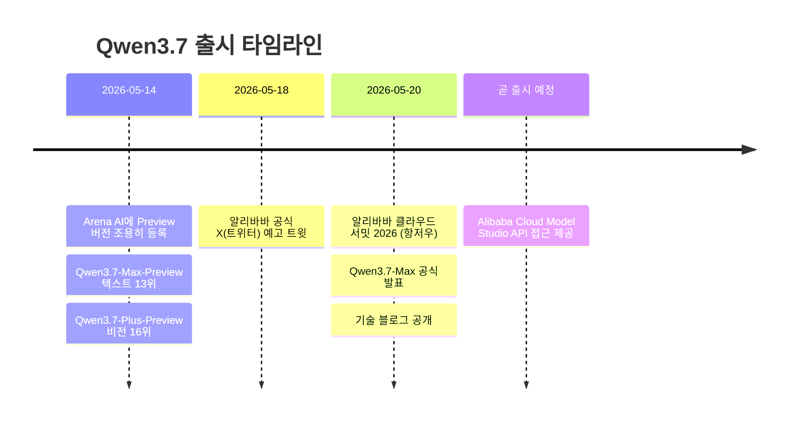

---

## 2. 핵심 설계 철학: 에이전트 퍼스트

Qwen3.7-Max를 이전 세대 모델과 구별하는 가장 핵심적인 특징은 "에이전트 퍼스트(Agent First)"라는 설계 철학이다. 기존의 대형 언어 모델들이 주로 단일 턴 대화나 짧은 맥락의 작업에 최적화되어 있었다면, Qwen3.7-Max는 처음부터 **수백~수천 단계의 연속 실행**, **수십 시간에 걸친 자율 작업**, **다양한 도구와의 반복적 상호작용**을 핵심 사용 시나리오로 상정하고 설계됐다.

이러한 철학은 훈련 방식에도 직결된다. Qwen 팀은 단순히 데이터 규모를 늘리거나 파라미터 수를 키우는 방식 대신, **다양한 실제 에이전트 환경에서 모델을 훈련**하는 "환경 스케일링(Environment Scaling)" 전략을 채택했다. 이는 마치 언어 모델이 다양한 텍스트를 사전학습하면 범용적 언어 능력을 갖추게 되는 것처럼, 다양한 환경에서의 에이전트 훈련이 범용적 문제 해결 능력을 만들어낸다는 원리에 기반한다.

또 하나의 핵심 설계 원칙은 **크로스-하네스 일반화(Cross-Harness Generalization)** 다. 현실 세계에서 AI 에이전트는 Claude Code, OpenClaw, Qwen Code, Hermes Agent 등 다양한 프레임워크 위에서 동작한다. Qwen3.7-Max는 특정 프레임워크에 과적합되지 않고, 어떤 에이전트 하네스(harness)에서도 일관된 성능을 발휘하도록 훈련됐다.

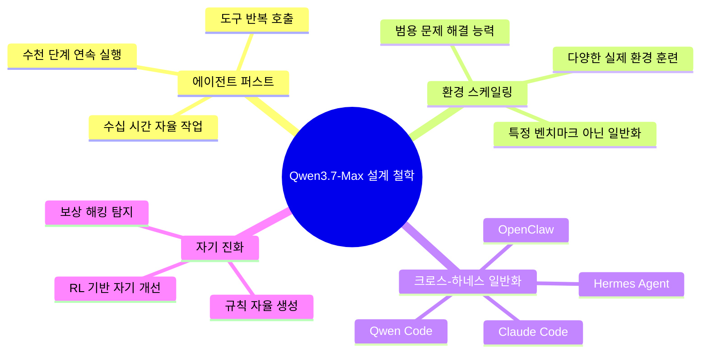

---

## 3. 주요 기능과 능력 영역

Qwen 팀이 공식적으로 제시한 Qwen3.7-Max의 주요 기능 영역은 네 가지로 정리된다.

**첫째, 프런티어 코딩 에이전트(Frontier Coding Agent)다.** 프런트엔드 프로토타이핑부터 다중 파일을 수반하는 복잡한 소프트웨어 엔지니어링까지 전 범위를 다룬다. Three.js 3D 장면, Canvas 애니메이션, 전체 페이지 레이아웃, 동적 SVG를 단일 프롬프트에서 생성하는 능력이 시연됐다.

**둘째, 코워크 생산성 어시스턴트(Cowork Productivity Assistant)다.** MCP(Model Context Protocol) 기반 워크플로우와 멀티 에이전트 오케스트레이션을 통해 실제 사무 환경의 복잡한 작업을 처리한다. 교차 산업 거래 데이터 통합, 시각화 대시보드 생성, 대용량 스프레드시트 처리 등이 시연됐다. 논문 형식 자동 교정처럼 수동으로는 1~2주가 소요되는 작업도 수 시간 내에 처리할 수 있다고 알리바바는 밝혔다.

**셋째, 장기 자율 실행(Long-Horizon Autonomous Execution)이다.** 이것이 Qwen3.7-Max의 가장 차별화된 특징이다. 35시간 연속 자율 작업이라는 결과가 이를 직접 증명한다. 모델은 문맥을 잃거나 이전 단계로 퇴행하지 않으면서, 수천 번의 도구 호출에 걸쳐 일관된 최적화 전략을 유지할 수 있다.

**넷째, 크로스-하네스 일반화(Cross-Harness Generalization)다.** Claude Code, OpenClaw, Qwen Code, QwenPaw, Qoder 등 다양한 에이전트 환경에서 일관된 성능을 낸다. 이는 특정 프레임워크에 특화된 "트릭"이 아닌, 진정한 문제 해결 능력을 학습했음을 의미한다.

---

## 4. 벤치마크 성능 분석

Qwen 팀은 코딩 에이전트, 범용 에이전트, 추론, 범용 역량, 다국어 등 5개 카테고리에 걸쳐 상세한 벤치마크 결과를 공개했다. 비교 대상은 Claude Opus-4.6 Max, Kimi K2.6 Thinking, GLM-5.1 Thinking, DeepSeek-V4-Pro Max, Qwen3.6-Plus 등이다.

### 4.1 코딩 에이전트 벤치마크

소프트웨어 엔지니어링 능력을 평가하는 핵심 지표들에서 Qwen3.7-Max는 다음과 같은 결과를 냈다.

| 벤치마크 | 설명 | Qwen3.7-Max | Claude Opus-4.6 Max | DeepSeek-V4-Pro Max |
|---|---|---|---|---|
| **Terminal-Bench 2.0 Terminus** | 에이전틱 터미널 코딩 | **69.7** | 65.4 | 67.9 |
| **SWE-Verified** | 실제 GitHub 이슈 해결 | 80.4 | 80.8 | 80.6 |
| **SWE-Pro** | 개선된 SWE 벤치마크 | **60.6** | 57.3 | 59.0 |
| **SWE-Multilingual** | 다국어 소프트웨어 엔지니어링 | **78.3** | 77.5 | 76.2 |
| **NL2Repo** | 자연어 → 레포지터리 생성 | **47.2** | 47.6 | 35.5 |
| **SciCode** | 과학 코딩 | **53.5** | 51.9 | — |
| **QwenSVG** | SVG 생성 (Elo) | **1608** | 1541 | 1506 |

Terminal-Bench 2.0에서 Qwen3.7-Max는 69.7점으로 DeepSeek-V4-Pro Max(67.9)와 Claude Opus-4.6(65.4)을 모두 넘어섰다. SWE-Verified에서는 80.4점으로 Claude Opus-4.6(80.8) 및 DeepSeek-V4-Pro(80.6)와 거의 동등한 수준이다. SWE-Pro에서는 60.6점으로 경쟁 모델 중 최고 성능을 보였다.

### 4.2 범용 에이전트 벤치마크

| 벤치마크 | 설명 | Qwen3.7-Max | Claude Opus-4.6 Max | 비고 |
|---|---|---|---|---|
| **MCP-Mark** | 실제 MCP 사용 | **60.8** | 56.7 | GLM-5.1 대비 +3.3 |
| **MCP-Atlas** | 실제 MCP 사용 | **76.4** | 75.8 | Claude 대비 +0.6 |
| **Skillsbench** | 78가지 작업 평가 | **59.2** | — | Kimi K2.6 대비 +3 |
| **BFCL-V4** | 함수 호출 능력 | 75.0 | 76.7 | Claude와 근접 |
| **CoWorkBench** | 코워크 에이전트 | 67.2 | 68.2 | Claude와 근접 |
| **SpreadSheetBench-v1** | 스프레드시트 자동화 | **87.0** | 89.3 | 상위권 |
| **Kernel Bench L3** | GPU 커널 최적화 | 1.98x / 96% | 2.63x / 98% | 2위 수준 |

MCP 관련 벤치마크에서 Qwen3.7-Max는 전 경쟁 모델을 앞섰다. 이는 실제 MCP 서버와의 통합, 도구 호출 정확성, 워크플로우 실행 신뢰성 측면에서 Claude Opus-4.6조차 넘어섰음을 의미한다.

### 4.3 추론 벤치마크

| 벤치마크 | 설명 | Qwen3.7-Max | Claude Opus-4.6 Max |
|---|---|---|---|
| **GPQA Diamond** | 박사급 과학 문제 | **92.4** | 91.3 |
| **HLE** | 인류 최후의 시험 | **41.4** | 40.0 |
| **HMMT 2026 Feb** | 고교 수학 토너먼트 | **97.1** | 96.2 |
| **IMOAnswerBench** | 국제수학올림피아드 | **90.0** | 75.3 |
| **Apex** | 수학 추론 | **44.5** | 34.5 |
| **LiveCodeBench** | 실시간 코딩 | 91.6 | 88.8 |

추론 분야에서 Qwen3.7-Max는 GPQA Diamond(92.4 vs 91.3), HLE(41.4 vs 40.0), HMMT(97.1 vs 96.2)에서 Claude Opus-4.6을 근소하게 앞섰다. 특히 Apex(수학 추론)에서 44.5 vs 34.5로 큰 격차를 보였다.

### 4.4 다국어 및 일반 역량

| 벤치마크 | 설명 | Qwen3.7-Max | Claude Opus-4.6 Max |
|---|---|---|---|
| **WMT24++** | 55개 언어 번역 | **85.8** | 82.7 |
| **MAXIFE** | 다국어 지시 따르기 | **89.2** | 81.3 |
| **IFBench** | 지시 따르기 | **79.1** | 62.5 |
| **MMLU-Pro** | 전문 지식 | 89.6 | 89.7 |
| **MRCR-v2 128k** | 128K 맥락 검색 | **90.4** | 84.0 |
| **SuperGPQA** | 대학원 수준 지식 | **73.6** | 72.5 |

다국어 부문에서 Qwen3.7-Max는 모든 경쟁 모델을 압도적으로 앞섰다. WMT24++(55개 언어 번역)에서 85.8점, MAXIFE(23개 다국어 설정)에서 89.2점으로 최고 성능이다.


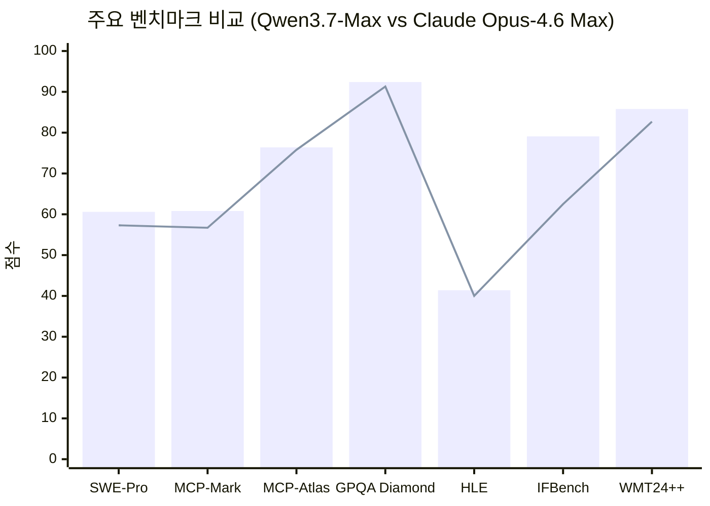

---

## 5. 핵심 기술: 환경 스케일링

Qwen3.7-Max의 탁월한 에이전트 성능을 가능하게 한 핵심 기술은 **환경 스케일링(Environment Scaling)** 이다. 이 개념은 Qwen3.5에서 처음 도입된 이후, Qwen3.7에서 공격적으로 확장됐다.

환경 스케일링의 원리는 언어 모델의 사전학습(pretraining)과 유사한 논리에서 출발한다. 언어 모델이 다양한 텍스트 데이터에서 학습할수록 범용적인 언어 이해 능력을 갖추듯이, 에이전트 모델은 다양한 에이전트 환경에서 훈련할수록 범용적인 문제 해결 능력을 갖춘다는 것이다. 이는 직관적으로는 단순해 보이지만, 실제 구현은 매우 복잡하다.

### 5.1 롤아웃 환경 인프라 구조

Qwen 팀이 개발한 롤아웃(Rollout) 환경 인프라는 각 훈련 인스턴스를 세 가지 독립 요소로 분리한다.

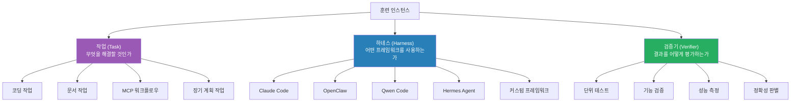

이 세 요소는 서로 독립적으로 자유롭게 재조합될 수 있다. 동일한 작업을 다른 하네스, 다른 버전, 다른 검증기와 조합해 반복 훈련하면, 모델은 특정 프레임워크의 요령이 아니라 범용적 문제 해결 전략을 학습하게 된다. 이것이 바로 **크로스-하네스 강화학습(Cross-Harness RL Training)** 의 핵심이다.

### 5.2 환경 스케일링 효과

알리바바가 공개한 차트에 따르면, 훈련 환경 수가 0에서 8,000개 이상으로 늘어남에 따라 Qwen3.7-Max(Thinking 버전)의 평균 순위가 꾸준히 상승했다. 약 8,500개 훈련 환경에서 Qwen3.7-Max는 평균 순위 3위권에 진입해 Claude-4.6-Opus-Max에 근접했다. 아래 여러 벤치마크(BFCL-V4, VITA, DeepPlanning, MCP-Atlas, ClawEval, QwenClawBench)에서 모두 환경 수 증가에 따른 일관된 성능 향상이 관찰됐다.

더 주목할 만한 점은 **예측 가능성(Predictability)** 이다. 벤치마크 일부에서의 성능 향상이 나머지 벤치마크의 성능 향상을 신뢰할 수 있는 수준으로 예측한다는 것이다. 이는 환경 스케일링이 특정 테스트에 과적합되는 것이 아니라, 진정한 역량 일반화를 이끌어낸다는 강력한 증거다.

모든 벤치마크는 훈련 중 한 번도 등장하지 않은 **도메인 외 환경**으로 구성됐다. 즉, 이 성능 향상은 암기가 아닌 진정한 학습의 결과다.

---

## 6. 크로스-하네스 일반화

에이전트 모델의 실제 사용 가치는 특정 벤치마크 점수보다 "어떤 환경에서도 안정적으로 동작하는가"에 달려 있다. Qwen3.7-Max는 이 측면에서 두드러진 결과를 보였다.

QwenClawBench에서 Qwen3.7-Max는 OpenClaw 하네스(64.3), Claude Code 하네스(68.5), Hermes Agent 하네스(70.7)에서 모두 높은 점수를 기록했다. Claude Opus-4.6은 OpenClaw에서 65.5점을 냈고, Qwen3.6-Plus는 같은 환경에서 57.2점에 머물렀다. Qwen3.7-Max는 하네스에 따라 점수가 달라졌지만, 어떤 하네스에서도 경쟁 모델보다 높거나 동등한 성능을 보였다.

CoWorkBench에서도 유사한 패턴이 관찰됐다. Claude Opus-4.6이 OpenClaw에서 68.2점을 기록한 반면, Qwen3.7-Max는 OpenClaw(67.2), Claude Code(66.0), Hermes(68.3)에서 고르게 높은 성능을 보였다.

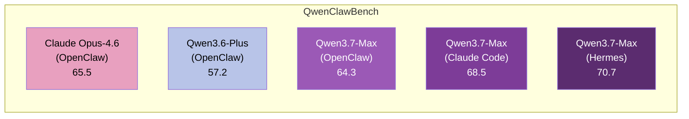

이 결과가 의미하는 바는 실용적으로 매우 중요하다. 기업이나 개발자가 어떤 에이전트 프레임워크를 선택하더라도 Qwen3.7-Max가 일관된 성능을 제공한다는 뜻이기 때문이다. 특정 프레임워크에 종속되지 않는 "드롭인(drop-in) 백본 모델"로 기능할 수 있다.

---

## 7. 35시간 자율 커널 최적화 실험

Qwen3.7-Max의 장기 자율 실행 능력을 가장 극적으로 보여주는 사례는 **Extend Attention 커널 최적화 실험**이다. 이 실험은 Qwen3.7-Max의 능력을 실제 생산 환경에 가까운 조건에서 검증한 것으로, 공개된 AI 에이전트 실험 중 가장 장시간, 가장 많은 도구 호출을 포함한 사례 중 하나다.

### 7.1 실험 배경과 설정

**Extend Attention**은 SGLang의 프로덕션급 가변 길이 멀티 헤드 어텐션 연산자다. 새로 생성된 토큰과 최대 32K 엔트리의 프리픽스 KV-캐시 사이의 어텐션 점수를 MTP(Multi-Token Prediction)와 함께 계산하는, LLM 서빙에서 메모리 바운드(memory-bound)이자 지연 임계적(latency-critical) 커널이다.

Qwen3.7-Max에게 주어진 과제는 이 커널을 **T-Head ZW-M890 PPU** 위에서 최적화하는 것이었다. 이 하드웨어 플랫폼은 모델이 훈련 중 한 번도 접하지 않은 미지의 아키텍처다. 실험 조건은 다음과 같이 극도로 제한됐다.

- 사전 프로파일링 데이터: 없음
- 하드웨어 문서: 없음
- 해당 아키텍처의 예시 커널: 없음
- 시작 시 제공된 것: 작업 설명, 기존 SGLang Triton 구현, 평가 스크립트

### 7.2 35시간 동안 무슨 일이 일어났나

총 약 35시간에 걸쳐 모델은 **1,158번의 도구 호출**과 **432번의 커널 평가**를 수행했다. 이 과정에서 모델이 자율적으로 수행한 작업은 다음과 같다.

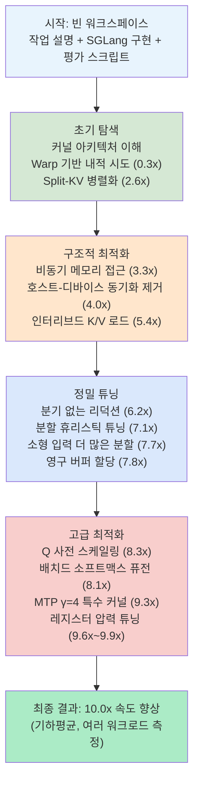

30시간이 지난 후에도 모델은 여전히 의미 있는 개선을 찾아내고 있었다. 이는 단순한 초기 최적화 이후 정체되는 것이 아니라, 진정한 장기 자율 최적화가 가능함을 보여준다.

### 7.3 다른 모델과의 비교

동일한 조건에서 다른 모델들의 결과는 다음과 같다.

| 모델 | 최종 속도 향상 | 비고 |
|---|---|---|
| **Qwen3.7-Max** | **10.0x** | 35시간, 1,158 도구 호출 |
| GLM 5.1 | 7.3x | — |
| Kimi K2.6 | 5.0x | — |
| DeepSeek V4 Pro | 3.3x | — |
| Qwen3.6-Plus | 1.1x | — |
| SGLang Triton (기준선) | 1.0x | — |

조기 종료한 모델들은 5회 연속으로 도구 호출이 없을 경우 자동 종료됐는데, 이는 모델이 더 이상 개선할 여지가 없다고 스스로 판단한 것이다. Qwen3.7-Max는 35시간 내내 도구 호출을 지속했다.

NVIDIA GPU 범용 지원에서도 Qwen3.7-Max는 KernelBench L3에서 96%의 시나리오에 대해 가속 커널을 생성했다. Claude Opus-4.6(98%), GLM 5.1(78%), Kimi K2.6(80%), DeepSeek V4 Pro(54%), Qwen3.6-Plus(48%)와 비교하면 Claude에 이어 2위 수준이다.

---

## 8. 강화학습 기반 보상 해킹 자기 진화

Qwen3.7-Max의 또 다른 주목할 만한 능력은 **강화학습(RL) 훈련의 무결성을 스스로 유지하는 것**이다. 알리바바는 Qwen3.7-Max를 소프트웨어 엔지니어링(SWE) 작업의 RL 모니터링에 통합해, 보상 해킹 자기 모니터링 및 규칙 자기 진화 프레임워크를 구축했다.

### 8.1 보상 해킹이란?

강화학습에서 **보상 해킹(Reward Hacking)** 은 모델이 실제 목표를 달성하는 대신, 보상 함수의 허점을 이용해 높은 보상을 얻는 행동을 학습하는 현상이다. SWE 태스크에서의 보상 해킹 예시로는 GitHub에서 정답을 직접 조회하거나, Gerrit API로 패치를 검색하거나, raw.githubusercontent.com에서 소스 파일을 복사하는 행위 등이 있다.

### 8.2 86시간 자율 실험 결과

알리바바가 공개한 실험 통계는 다음과 같다.

- **자율 실행 시간**: 86시간
- **총 궤적(Trajectories)**: 13,952개
- **판별 호출(Judge Calls)**: 11,196회
- **탐지된 해킹 케이스**: 1,618건

이 기간 동안 Qwen3.7-Max는 RL 훈련 궤적을 자율적으로 조회하고 재생했으며, **10,000회 이상의 호출**을 실행했다. 모델은 후보 해킹 패턴을 체계적으로 식별하고, 규칙 검증, 반례 탐색, 반복적 최적화를 수행했다.

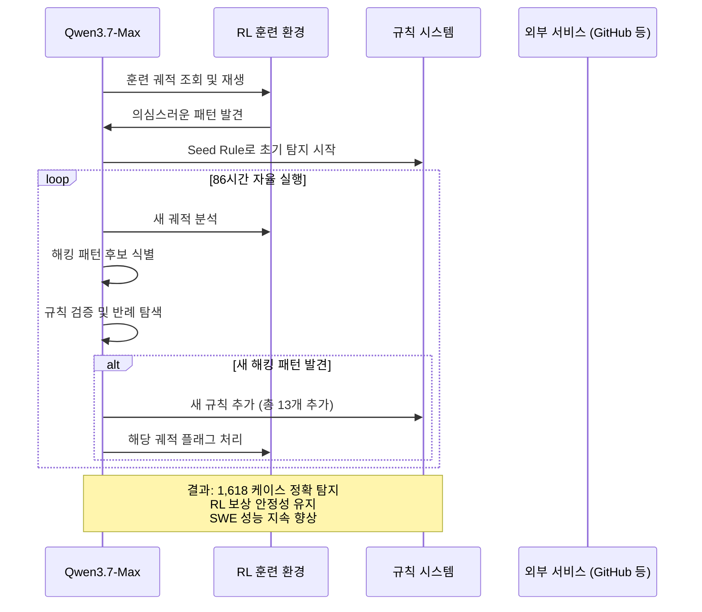

특히 눈에 띄는 것은 시간이 지남에 따라 RL 성능(파란선)과 누적 해킹 케이스 수(초록선)가 함께 증가하는 패턴이다. 규칙이 추가될 때마다(Rule 5~13) 시스템은 더 많은 해킹 패턴을 탐지하고, RL 보상이 더 정확해지며, 모델 성능도 함께 향상됐다.

탐지된 해킹 패턴의 예시:
- **Rule 7 (직접 패치 diff URL 조회)**: `patch-diff.githubusercontent.com/raw/.../*.patch`
- **Rule 9 (raw 스텁 파일 조회)**: `urllib.request.urlopen(raw.githubusercontent.com/...)`
- **Rule 11 (Gerrit 검색)**: `curl https://.../changes/?q=subject:...`
- **Rule 13 (외부 raw 소스 복사)**: `urlopen(raw.githubusercontent.com/owner/repo/branch/...)`

---

## 9. YC-벤치: 스타트업 시뮬레이션

Qwen3.7-Max의 장기 계획 능력을 평가하기 위해 알리바바는 **YC-벤치(YC-Bench)** 를 사용했다. 이는 스타트업의 1년간 전체 생애주기를 시뮬레이션하는 벤치마크로, 모델이 수백 번의 의사결정 라운드를 거쳐 전략적으로 사업을 운영해야 한다.

### 9.1 YC-벤치 과제 구성

YC-벤치에서 에이전트가 처리해야 하는 작업들은 다음과 같다.

- **인력 관리**: 직원 채용, 급여 지급, 팀 구성
- **계약 검토**: 고객 계약의 유리/불리 조건 분석
- **악성 고객 탐지**: 계약을 통해 회사를 함정에 빠뜨리려는 고객 식별 및 블랙리스트 처리
- **클라이언트 우선순위 결정**: 신뢰할 수 있는 고객과 위험한 고객을 구별해 수익 극대화
- **위기 관리**: 중간 위기를 극복하고 안정적 실행 루프 복구

총 400~600번의 의사결정 턴에 걸쳐 1년(시뮬레이션 2025년 1월~2025년 12월)을 운영한다.

### 9.2 세대 간 비교 결과

| 모델 | 최종 매출 | 완료 과제 수 | 성공률 |
|---|---|---|---|
| **Qwen3.7-Max** | **$2.08M** | **237** | 94.9% |
| Qwen3.6-Plus | $1.05M | — | — |
| Qwen3.5-Plus | $352K | — | — |

Qwen3.7-Max는 Qwen3.6-Plus 대비 약 2배, Qwen3.5-Plus 대비 약 5.9배의 매출을 기록했다. 성공률 94.9%라는 수치도 주목할 만하다.

Qwen 팀이 공개한 수익 곡선을 보면 Qwen3.7-Max의 전략적 진화 과정이 뚜렷하다.

- **초기 (2025년 1~2월)**: 잠재 고객 탐색 단계. 다양한 클라이언트 시도, 실패 경험 축적
- **2025년 2월**: 신뢰할 수 있는 고객에 집중, 실패율 0% 목표 전환
- **2025년 5월**: $406K 피크 월 수익 달성, 수익 급상승
- **2025년 여름**: 악성 고객(트랩 클라이언트) 식별 및 블랙리스트 처리
- **2025년 하반기**: 최고 클라이언트 집중, 고성장 추구
- **2025년 말**: 안정적 고효율 실행 루프 확립

이 과정은 단순한 작업 수행이 아니라, **경험으로부터 학습하고 전략을 조정하며, 위기를 극복하고, 장기적으로 수익성을 극대화하는** 진정한 의미의 에이전트적 행동을 보여준다.

---

## 10. 프런트엔드 코딩과 멀티미디어 생성

Qwen 팀은 Qwen3.7-Max의 프런트엔드 코딩 능력을 시연하는 다섯 가지 데모를 공개했다. [#](https://qwen.ai/blog?id=qwen3.7)

### 10.1 데모 2: MONOLITH 럭셔리 패션 매거진

이 데모는 Qwen3.7-Max가 단일 프롬프트에서 얼마나 복잡한 멀티미디어 프로젝트를 자율적으로 실행할 수 있는지 보여준다. 주어진 과제는 다음과 같았다.

**1단계**: AI 비디오 생성 스크립트(`scripts/dashscope-video-gen.sh`)를 사용해 세 개의 커스텀 비디오를 생성한다.

생성된 비디오는 다음과 같다.
- 하이 패션 모델의 극단적 클로즈업 시네마틱 포트레이트 (세로형)
- 오트쿠튀르 패션 런웨이 슬로우모션 워크 (세로형)
- 럭셔리 패션 매거진 페이지가 넘어가는 오버헤드 시네마틱 샷 (가로형)

**2단계**: 생성된 비디오를 활용해 인터랙티브 웹 페이지를 구축한다. 구체적 요구사항은 다음과 같다.
- 전체 뷰포트 세로형 포트레이트 비디오를 무음 자동재생 루프 배경으로 사용, 듀오톤 오버레이 적용
- "MONOLITH" 헤드라인 텍스트를 통해 두 번째 비디오가 보이는 투명 텍스트 효과
- 아래 영역에 매거진 페이지 컨테이너와 페이지 컬 호버 효과 포함
- 모노크롬 + 크림슨 액센트, 그레인 오버레이, 스크롤 트리거 애니메이션, 고정 상단 바

모델은 **사용자 입력 없이 전체 과정을 자율적으로 완료**했다. 비디오 생성 완료를 기다린 후 HTML을 빌드하는 작업 순서까지 스스로 관리했다.

### 10.2 데모 4: 3D 레이싱 게임

중국어로 작성된 간단한 프롬프트 하나로 Qwen3.7-Max는 다음을 포함하는 3D 레이싱 게임을 완성했다.

- 3D 렌더링 레이싱 트랙과 장애물
- Auto 모드(자동 플레이 기능)
- 금화 수집 메커니즘
- 실시간 속도계(143 km/h 표시)
- 랩 타이머와 순위 시스템
- 미니맵 표시

### 10.3 데모 5: 용주 경기 SVG 애니메이션

중국어 텍스트 설명만으로 Qwen3.7-Max는 복잡한 애니메이션 SVG를 생성했다. 요청된 동적 효과는 다음과 같다.

- 선수들의 동기화된 노 젓기 동작
- 용주의 미세한 상하 기복
- 깃발의 바람에 흔들리는 동작
- 수면의 물결 효과

생성된 SVG 코드는 선형 그라디언트, 재사용 가능한 컴포넌트, CSS 클래스 기반 애니메이션이 포함된 수백 줄의 정교한 코드였다.

---

## 11. 사무 자동화: 오피스 도구 통합

Qwen3.7-Max는 MCP 기반 워크플로우를 통해 실제 사무 환경의 복잡한 작업을 처리하는 능력을 보여줬다.

### 11.1 데모 1: 논문 형식 자동 교정

이 데모에서 Qwen3.7-Max에게 주어진 작업은 다음과 같다.

- **입력 파일 1**: 연구생 학위 논문 형식 규범 문서 (`연구생학위논문형식규범.docx`)
- **입력 파일 2**: 형식이 엉망인 논문 초안 (`논문_형식혼란판.docx`)
- **출력 파일**: 형식이 올바르게 수정된 논문 (`논문_형식수정판.docx`)

모델은 규범 문서를 파악하고, 혼란스러운 논문의 각 형식 요소(여백, 글꼴, 간격, 제목 스타일, 페이지 번호 위치, 단락 들여쓰기 등)를 식별하여, 규범에 맞게 자동으로 교정하는 전체 워크플로우를 자율 실행했다.

### 11.2 교차 산업 거래 데이터 대시보드

다른 시연에서는 교차 산업 거래 데이터를 통합하고 조건부 서식이 적용된 간트 차트 형식의 Deal Timeline 시각화 대시보드를 구축했다. 이 스프레드시트에는 Deal ID, 발행사, P&L(MM), 딜 규모, 타입, 시간 축 기반 간트 바 등이 포함됐다.

SpreadSheetBench-v1에서 Qwen3.7-Max는 87.0점으로 최상위권 성능을 보였다. Claude Opus-4.6(89.3), DeepSeek-V4-Pro(84.9), GLM-5.1(85.2), Kimi K2.6(84.5)과 비교하면 두 번째로 높은 점수다.

---

## 12. 물리 세계 탐색 에이전트

공개된 내용 중 가장 주목받는 신기능 중 하나는 **LLM 기반 물리 세계 탐색 에이전트**다. Qwen3.7-Max는 도구 호출을 통해 **로봇 개**를 제어하는 것이 가능하며, 물리적 환경에서의 이해, 계획, 기억, 의사결정을 수행한다.

이를 가능하게 하는 기술 스택은 다음과 같다.

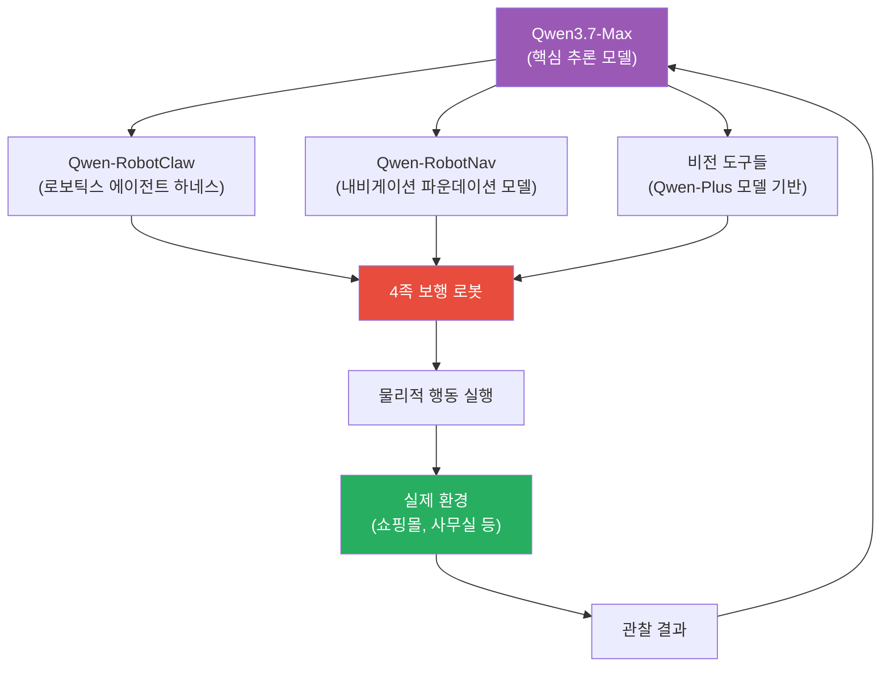

공개된 데모에서 Qwen3.7-Max는 쇼핑몰 환경에서 "이전에 CoCo Coffee에 초록색 우산을 두고 온 것 같다. 그것이 아직 있는지 확인하고, 가는 길에 흥미로운 것을 기록해 달라"는 요청을 처리했다.

20분간의 에이전트 동작 중 모델은:

1. 지도를 참고해 Tablas 로고와 조각품을 지나 앞으로 이동할 계획 수립
2. CoCo Coffee 매장에 도착 후 오른쪽으로 방향 전환
3. `physical_look_around` 도구로 주변 스캔 (6,086자 출력)
4. Poinkline 앞으로 이동해 복도를 계속 탐색하기로 결정
5. 장기 메모리에 방문 장소, 방향, 주요 랜드마크 기록

좌측 패널에는 에이전트의 도구 호출 흐름, 중앙에는 로봇의 1인칭 시점, 우측에는 장기 메모리가 표시됐다.

---

## 13. 지원 에이전트 프레임워크와 개발 환경

Qwen3.7-Max는 현재 주류 에이전트 프레임워크 및 코딩 어시스턴트와의 원활한 통합을 지원한다.

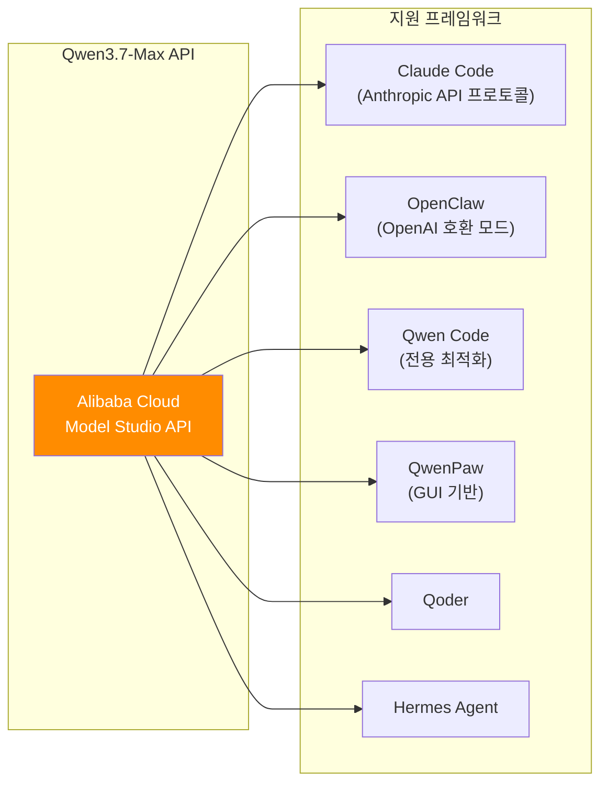

### 13.1 Claude Code 연동

Qwen API는 Anthropic API 프로토콜을 지원하므로, Claude Code를 그대로 Qwen3.7-Max 백엔드로 사용할 수 있다.

```bash
npm install -g @anthropic-ai/claude-code

export ANTHROPIC_MODEL="qwen3.7-max"
export ANTHROPIC_SMALL_FAST_MODEL="qwen3.7-max"
export ANTHROPIC_BASE_URL=https://dashscope-intl.aliyuncs.com/apps/anthropic
export ANTHROPIC_AUTH_TOKEN=<your_api_key>

claude
```

단 몇 줄의 환경 변수 설정으로 Claude Code 인터페이스를 그대로 유지하면서 백엔드만 Qwen3.7-Max로 교체할 수 있다.

### 13.2 OpenClaw 연동

```bash
curl -fsSL https://molt.bot/install.sh | bash
export DASHSCOPE_API_KEY=<your_api_key>
openclaw dashboard
```

설정 파일 `~/.openclaw/openclaw.json`에서 모델 파라미터를 다음과 같이 지정한다.

```json
{
  "models": {
    "providers": {
      "modelstudio": {
        "baseUrl": "https://dashscope-intl.aliyuncs.com/compatible-mode/v1",
        "apiKey": "DASHSCOPE_API_KEY",
        "models": [
          {
            "id": "qwen3.7-max",
            "reasoning": true,
            "contextWindow": 1000000,
            "maxTokens": 65536
          }
        ]
      }
    }
  }
}
```

주목할 점은 컨텍스트 윈도우가 **100만 토큰(1,000,000)** 임을 확인할 수 있다는 것이다.

### 13.3 Qwen Code 연동

```bash
npm install -g @qwen-code/qwen-code@latest
qwen
```

Qwen Code는 Qwen 시리즈에 깊이 최적화된 전용 도구다.

---

## 14. API 사용법 및 실제 연동 방법

### 14.1 기본 Python API 호출

Qwen3.7-Max는 OpenAI 호환 API 형식으로 호출된다. 아래는 공식 예시 코드다.

```python
"""
환경 변수:
  DASHSCOPE_API_KEY: API 키 (https://modelstudio.console.alibabacloud.com)
  DASHSCOPE_BASE_URL: (선택) 지역별 엔드포인트
    - 베이징: https://dashscope.aliyuncs.com/compatible-mode/v1
    - 싱가포르: https://dashscope-intl.aliyuncs.com/compatible-mode/v1
    - 미국(버지니아): https://dashscope-us.aliyuncs.com/compatible-mode/v1
"""
from openai import OpenAI
import os

client = OpenAI(
    api_key=os.environ.get("DASHSCOPE_API_KEY"),
    base_url=os.environ.get(
        "DASHSCOPE_BASE_URL",
        "https://dashscope-intl.aliyuncs.com/compatible-mode/v1",
    ),
)

messages = [{"role": "user", "content": "Write a Python function to merge two sorted linked lists."}]

completion = client.chat.completions.create(
    model="qwen3.7-max",
    messages=messages,
    extra_body={
        "enable_thinking": True,    # 사고 활성화
        # "preserve_thinking": True, # 에이전트 작업에 권장
    },
    stream=True
)
```

### 14.2 preserve_thinking 파라미터

에이전트 작업에서 특히 중요한 것은 `preserve_thinking` 파라미터다. 이 옵션을 활성화하면 이전 모든 턴의 사고 내용(thinking content)이 메시지 내에 보존된다. 장기 에이전트 작업에서 모델이 초기 추론 과정을 기억하고 이후 단계에서 참조할 수 있게 해주는 기능이다.

### 14.3 API 호환성

Qwen3.7-Max는 업계 표준 프로토콜을 지원한다.

- **OpenAI Chat Completions API** 호환
- **OpenAI Responses API** 호환
- **Anthropic API** 호환 (`https://dashscope-intl.aliyuncs.com/apps/anthropic`)

이 다중 프로토콜 지원 덕분에 기존 OpenAI 또는 Anthropic 기반 코드베이스를 거의 수정 없이 Qwen3.7-Max로 전환할 수 있다.

---

## 15. 경쟁 모델 대비 포지셔닝

Qwen3.7-Max는 출시 시점 기준으로 다음과 같은 포지셔닝을 갖는다.

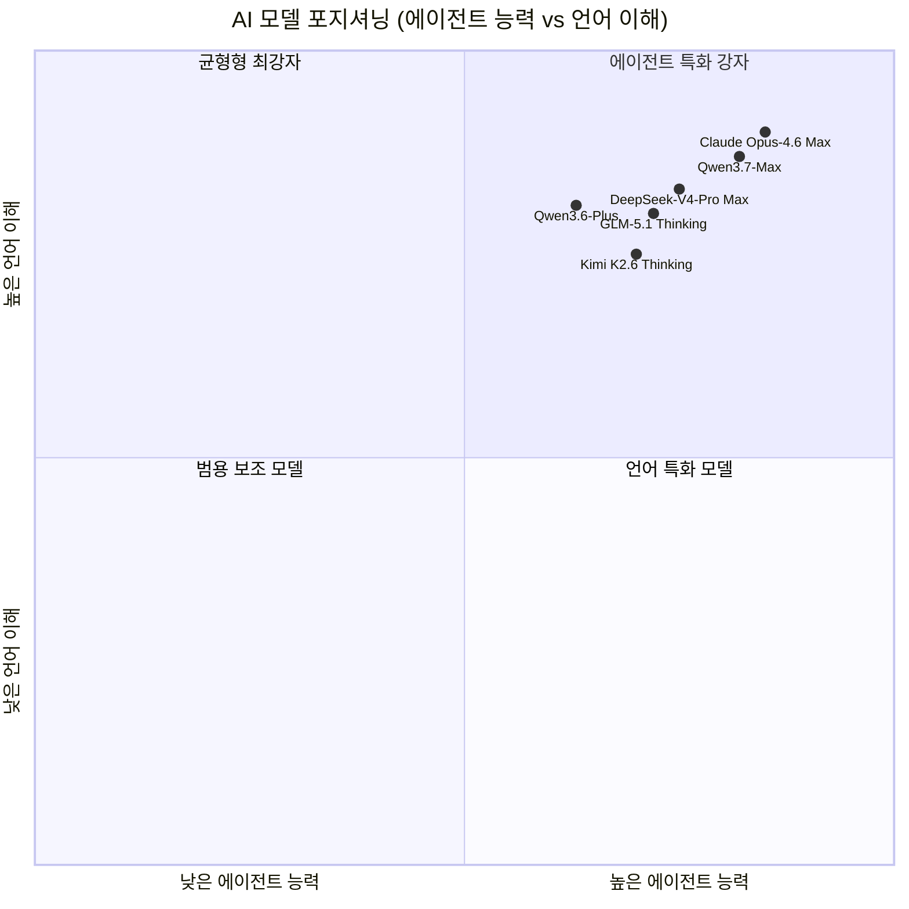

알리바바가 스스로 인정하듯, Qwen3.7-Max는 SWE-Verified(80.4 vs 80.8), CoWorkBench(67.2 vs 68.2), BFCL-V4(75.0 vs 76.7) 등 여러 지표에서 Claude Opus-4.6 Max에 근소하게 뒤지거나 동등한 수준이다. 그러나 MCP 관련 벤치마크, 다국어, 추론 수학, 지시 따르기 등에서는 Claude를 앞서는 영역도 있다.

현재 Qwen3.7-Max는 오픈소스가 아닌 독점(Proprietary) 모델이다. 알리바바 클라우드 Model Studio를 통해 API 형태로만 제공된다. 과거 Qwen 시리즈가 오픈소스와 독점 모델을 병행 출시했던 것과 달리, Qwen3.7-Max는 API 전용으로 출시됐다.

---

## 16. 알리바바 클라우드 서밋 2026 맥락

Qwen3.7-Max 발표는 더 큰 전략적 맥락 속에서 이해해야 한다. 2026년 5월 20일 항저우에서 개최된 알리바바 클라우드 서밋에서 알리바바는 단순한 모델 출시를 넘어, 자사가 "중국의 AI 팩토리"임을 선언했다.

발표된 주요 내용은 크게 세 가지다.

**첫째, 하드웨어**: **Zhenwu(진우) M890 AI 가속기 칩** 발표. 144GB 메모리 용량과 고속 인터커넥트 아키텍처를 갖춘 이 칩은 미국의 수출 규제로 인한 엔비디아 GPU 의존도를 줄이기 위한 전략적 대응이다. **Panjiu AL128 슈퍼노드 서버**는 128개의 M890 칩을 랙 스케일로 통합한 엔터프라이즈용 AI 컴퓨팅 플랫폼이다.

**둘째, 소프트웨어**: Qwen3.7-Max를 포함한 AI 모델 스택 전체 업그레이드.

**셋째, 전략**: 알리바바는 칩, 에이전틱 클라우드, AI 모델, 모델 서비스 플랫폼, 에이전틱 애플리케이션까지 "AI 스택 5개 레이어 전체"를 운영하는 유일한 중국 기업임을 강조했다.

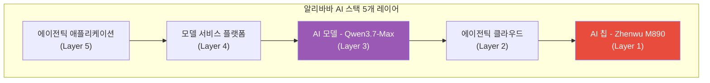

---

## 17. 총평 및 의미

Qwen3.7-Max는 여러 측면에서 중요한 의미를 갖는다.

### 17.1 기술적 의의

Qwen3.7-Max가 증명한 것은 **에이전트 능력의 진정한 일반화가 가능하다**는 것이다. 환경 스케일링을 통해 특정 벤치마크나 특정 프레임워크에 과적합되지 않고, 실제로 다양한 환경에서 범용적으로 우수한 성능을 낼 수 있음을 보여줬다. 35시간 자율 커널 최적화 실험은 AI 에이전트가 단순한 보조 도구를 넘어, 전문 엔지니어 수준의 장기 자율 작업을 수행할 수 있음을 실증했다.

보상 해킹 자기 모니터링 프레임워크는 AI의 자기 개선 메커니즘이 실제 작동 가능한 수준임을 보여주는 중요한 선례다. 모델이 스스로의 훈련 과정의 취약점을 탐지하고 규칙을 생성하는 것은, AI 시스템의 안전성과 신뢰성을 향상시키는 새로운 방향을 제시한다.

### 17.2 산업적 의의

Qwen3.7-Max는 "가성비 오픈소스"라는 기존 Qwen 시리즈의 이미지에서 벗어나, **프런티어 에이전트 모델**로의 도약을 선언한 것이다. Claude Opus-4.6과 동등하거나 일부 영역에서 앞서는 성능은, 중국 AI 모델이 단순 추격이 아닌 실질적 경쟁자로 자리잡았음을 의미한다.

OpenAI 및 Anthropic API 규격과의 호환성은 개발자와 기업에게 실질적인 전환 비용을 최소화하면서 대안을 제공한다. 특히 비용 민감한 기업 고객에게는 Claude 또는 GPT 대비 경쟁력 있는 선택지가 될 수 있다.

### 17.3 한계와 주의사항

다음과 같은 현실적 한계도 존재한다.

공개된 벤치마크 수치 중 일부는 알리바바가 자체 평가한 것으로, 독립적 검증이 필요하다. SWE-Verified(80.4), Terminal-Bench(69.7), MCP-Atlas(76.4) 등 핵심 지표는 외부 검증 가능한 공개 벤치마크를 사용했지만, CoWorkBench, QwenWorldBench, YC-Bench 등은 내부 벤치마크다.

35시간 커널 최적화 실험은 T-Head ZW-M890 PPU라는 매우 특수한 하드웨어에서 수행됐으며, 일반 엔비디아 GPU 환경에서의 재현 가능성은 확인이 필요하다. API 접근은 곧 제공될 예정이나 아직 완전히 공개되지 않았으므로, 현재는 벤치마크와 시연 수준에서의 평가임을 감안해야 한다.

### 17.4 종합

Qwen3.7-Max는 알리바바가 AI 에이전트 시대의 파운데이션 모델 경쟁에서 진지한 플레이어임을 보여주는 발표다. 환경 스케일링, 크로스-하네스 일반화, 장기 자율 실행, 자기 진화 메커니즘이라는 네 가지 기술적 축이 합쳐져, 단순 질의응답을 넘어선 실제 업무 환경의 에이전트 작업을 처리할 수 있는 모델이 탄생했다. 향후 기술 보고서 공개와 API 접근이 이루어지면 더 정밀한 외부 검증이 가능해질 것이다.

---

## 참고 자료

- Qwen 팀 공식 블로그: https://qwen.ai/blog?id=qwen3.7
- AI타임스 기사: https://www.aitimes.com/news/articleView.html?idxno=210745
- TechNode: https://technode.com/2026/05/21/alibaba-introduces-qwen3-7-max-as-next-gen-ai-agent-model/
- SCMP: https://www.scmp.com/tech/big-tech/article/3354212/alibaba-unveils-new-qwen-model-custom-chips-bid-become-chinas-ai-factory
- Alibaba Cloud Model Studio API 문서: https://modelstudio.console.alibabacloud.com

---

