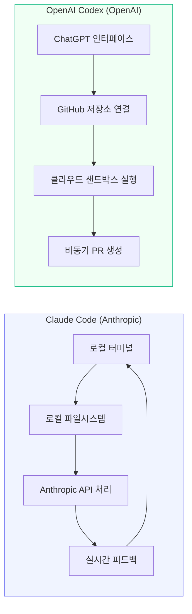
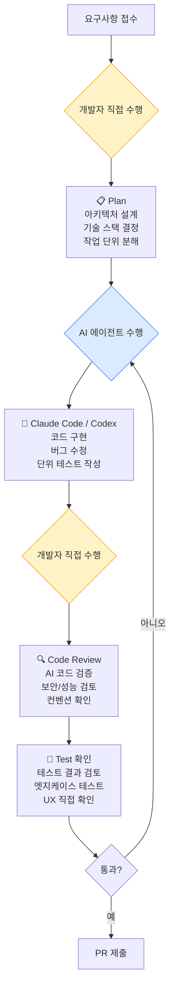
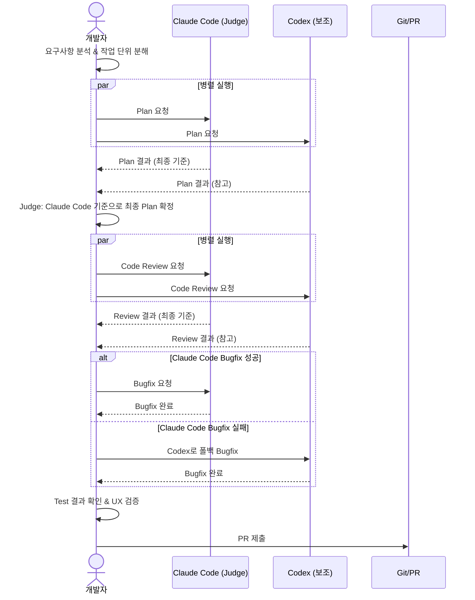
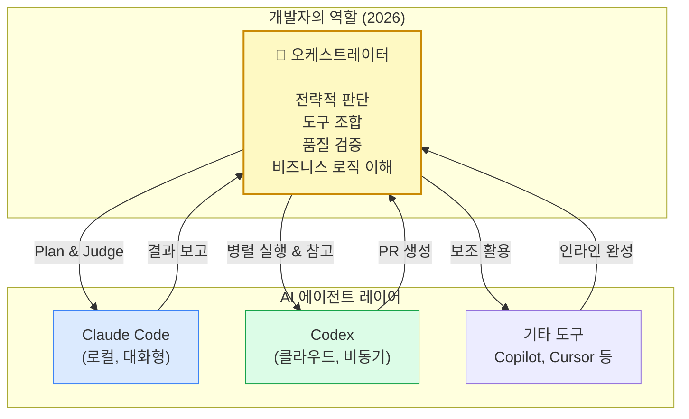

> 원문 출처: Threads [@chris.segfault]( https://www.threads.com/@chris.segfault/post/DYnkRJBEgp5) — "내가 클로드코드만 고집하는 이유"

---

## 들어가며

2025년 초부터 본격화된 AI 코딩 에이전트의 시대는 불과 1년여 만에 개발자들의 일하는 방식을 근본적으로 뒤바꿔 놓았다. Claude Code(Anthropic), Codex(OpenAI), Gemini(Google) 등이 경쟁적으로 출시되면서 "어떤 AI 도구를 써야 하는가?"라는 질문이 개발 커뮤니티의 화두로 떠올랐다. 그러나 현장에서 실제로 AI 도구를 매일 다루는 숙련된 개발자들 사이에서는 이미 이 질문이 다른 차원으로 이동하고 있다. @chris.segfault의 Threads 포스팅은 그 전환점을 날카롭게 짚어낸 글로, AI 코딩 에이전트를 단순히 "써본 사람"이 아닌 "매일 실전에서 굴리는 사람"의 시각을 담고 있다. 이 글은 그 포스팅의 핵심 논지를 풀어내고, 현재 AI 코딩 에이전트 생태계의 실제 모습을 최신 정보를 바탕으로 상세히 해설한다.

---

## 1. 현재 AI 코딩 에이전트의 실력: "이미 둘 다 넘치도록 좋다"

### 1.1 Claude Code와 Codex의 기술적 현황

2026년 현재, Claude Code와 OpenAI Codex는 서로 다른 철학을 가진 두 개의 성숙한 도구로 자리잡았다.

**Claude Code**는 Anthropic이 2025년 2월 연구 프리뷰로 출시하고 같은 해 5월 정식 출시한 터미널 기반 코딩 에이전트다. Claude Opus 4.6과 Sonnet 4.6 모델을 기반으로 동작하며, 로컬 환경에서 직접 실행된다. 코드는 사용자의 로컬 파일시스템에 머물고, Anthropic API는 처리를 위해서만 호출되므로 보안이 민감한 환경에서 특히 유리하다. 터미널에서 자연어 명령으로 파일을 읽고, 수정하고, 테스트를 실행하고, Git 커밋까지 수행한다. CLAUDE.md 파일을 통해 프로젝트 컨텍스트를 세션 간에 유지할 수 있고, 커스텀 훅, 슬래시 커맨드, MCP(Model Context Protocol) 통합 등 고급 설정도 지원한다.

**OpenAI Codex**는 2021년의 코드 자동완성 모델과 이름은 같지만 완전히 다른 제품이다. 2025년 5월 클라우드 기반 에이전트로 재출시되어, 현재는 GPT-5.3-Codex 모델을 기반으로 동작한다. ChatGPT 인터페이스에 통합되어 있고, GitHub 저장소에 연결해 격리된 클라우드 샌드박스에서 비동기적으로 작업을 처리한다. 사용자는 작업을 제출하고 브라우저를 닫아도 되며, 완료되면 Pull Request를 열어준다. 복수의 작업을 병렬로 실행할 수 있는 것이 핵심 특징이다.

### 1.2 성능 격차의 실질적 수렴

포스팅이 핵심적으로 지적하는 부분이 바로 이것이다. "AI 코딩 에이전트의 차이가 미비해졌다"는 말은 단순한 인상론이 아니다. 실제 개발자 커뮤니티의 벤치마크와 비교 평가들이 이를 뒷받침한다.

맹목 평가(개발자가 어느 도구가 만든 코드인지 모르는 상태에서 품질을 평가)에서 Claude Code가 67%, Codex CLI가 25%, 무승부가 8%를 기록했다는 데이터가 있다. Claude Code가 코드 품질 면에서 우세하지만, 이미 양쪽 모두 "훌륭한" 수준이다. 문제는 품질의 절대치가 아니라, 어떤 작업 유형에서 어느 도구가 더 적합하냐는 것이다.

- Claude Code는 복잡한 추론, 장기 세션의 일관성, 인터랙티브 디버깅, 보안 취약점 탐지에서 강세를 보인다.
- Codex는 명확히 정의된 태스크의 병렬 처리, 비동기 실행, GitHub 통합 워크플로우에서 강세를 보인다.

숙련된 개발자 입장에서는 이 두 도구 모두 단위 작업을 처리하기에 충분히 강력하다. "클로드가 낫다, 코덱스가 낫다"는 논쟁은 아직 도구를 표면적으로 다루는 단계에서 나오는 이야기다.

---

## 2. 바이브 코딩의 진화와 그 경계의 흐릿해짐

### 2.1 바이브 코딩이란 무엇인가

"바이브 코딩(Vibe Coding)"이라는 용어는 전 Tesla AI 디렉터이자 OpenAI 공동창업자인 Andrej Karpathy가 2025년 2월에 처음 사용했다. 자연어로 원하는 것을 기술하면 AI가 코드를 생성하고, 사람은 그 결과를 검토·반복하는 방식이다. "바이브(Vibe)"라는 단어는 개발자가 만들고 싶은 것의 "의도나 느낌"을 대화하듯 전달한다는 의미를 담고 있다.

2025년에는 새로운 개발 방법론으로 주목받는 수준이었지만, 2026년에는 전용 도구와 확립된 워크플로우를 갖춘 구조화된 개발 접근법으로 성숙했다. 시장 규모가 약 85억 달러에 이를 것으로 전망될 만큼 산업적 흐름이 됐다.

흥미롭게도, 카르파시 자신이 2026년 2월에 "바이브 코딩"이라는 개념이 이미 구식이 되었다고 선언했다. 단순한 코드 생성 방식에서 AI 에이전트를 조율(Orchestrate)하는 "에이전틱 엔지니어링(Agentic Engineering)"으로 패러다임이 이동했다는 것이다.

### 2.2 경계가 흐릿해진 이유

초기 바이브 코딩은 "AI가 코드를 짜주면 사람은 결과만 확인한다"는 다소 단순한 이미지였다. 그러나 실제 현장에서는 이 경계가 훨씬 복잡하게 나타난다.

바이브 코딩으로 만든 코드 중 40~62%가 보안 취약점을 포함하고 있다는 분석이 있다. AI가 XSS(Cross-Site Scripting) 공격에 대한 방어를 86% 확률로 누락한다는 데이터도 존재한다. 2026년 3월 한 달에만 AI 생성 코드에서 직접 비롯된 새로운 CVE(공통 취약점 및 노출)가 35건 발생했으며, 이는 두 달 전의 6건에 비해 급격히 늘어난 수치다.

이런 배경에서 "바이브 코딩"의 경계는 흐릿해졌다기보다, 그 개념이 성숙하면서 "어디까지 AI에게 맡기고 어디서부터 사람이 책임지느냐"라는 문제가 명확해졌다. 속도의 이점은 실재하지만, 검토 없는 속도는 기술 부채를 쌓는 지름길이다.

---

## 3. 숙련된 개발자가 여전히 직접 수행하는 것들

### 3.1 조직 내 개발의 현실

포스팅에서 가장 중요한 통찰 중 하나가 바로 이 부분이다. AI 에이전트가 아무리 뛰어나도, 조직 단위의 개발에서는 개발자가 직접 책임지고 수행해야 하는 영역이 명확히 존재한다.

포스팅이 언급한 개발자가 직접 수행하는 단계는 다음과 같다.

- **Plan (계획)**: 무엇을 만들 것인지, 어떻게 구조를 잡을 것인지에 대한 설계 판단
- **Code Review (코드 리뷰)**: AI가 생성한 코드가 기존 코드베이스의 컨벤션, 보안 요구사항, 성능 기준에 부합하는지 검증
- **Test Result (테스트 결과 확인)**: 단순히 테스트가 통과되는지가 아니라, 테스트가 실제 의도를 올바르게 검증하고 있는지 판단
- **주요 기능 직접 테스트**: 엣지 케이스, 경계 조건, 실제 사용 시나리오에서의 동작 확인
- **UX 확인**: 사용자가 실제로 어떻게 느끼는지, UI 흐름이 의도한 대로 작동하는지 사람이 직접 체험

### 3.2 검토 없는 PR이 "지옥으로 불구덩이를 가지고 뛰어드는 것"인 이유

이 비유는 매우 직설적이면서도 정확하다. AI 에이전트가 생성한 코드를 검토 없이 PR로 날리는 것은 다음과 같은 복합적인 위험을 수반한다.

첫째로 보안 위험이다. AI 생성 코드에 내재된 취약점이 프로덕션 환경에 노출될 수 있다. SQL Injection, XSS, 인증 로직 오류 등이 AI가 놓치는 대표적인 패턴이다.

둘째로 코드베이스 일관성의 붕괴다. AI는 종종 프로젝트의 기존 컨벤션을 무시하고 자체적인 스타일로 코드를 작성한다. 이것이 축적되면 코드베이스가 파편화된다.

셋째로 비즈니스 로직 오류다. AI는 코드를 잘 작성하지만, 비즈니스 도메인의 암묵적인 규칙을 이해하지 못한다. 코드는 실행되지만 의도한 비즈니스 요구사항을 충족하지 못하는 경우가 발생한다.

넷째로 기술 부채의 급격한 축적이다. AI 생성 코드는 "지금 동작하는 코드"이지, "장기적으로 유지보수하기 좋은 코드"가 아닌 경우가 많다. 검토 없이 머지된 코드는 나중에 수정 비용이 기하급수적으로 늘어난다.

---

## 4. @chris.segfault의 실전 워크플로우 해부

### 4.1 Claude Code를 Judge로 사용하는 전략

포스팅에서 소개된 워크플로우는 단순히 "Claude Code를 사용한다"가 아니다. Claude Code를 **판정자(Judge)** 로 위치시키는 것이 핵심이다. 이 구조는 다음과 같이 작동한다.

**Plan 단계와 Code Review 단계**에서 Claude Code를 Judge로 삼아 Codex와 병렬로 실행한다. 즉, 같은 플래닝 작업이나 코드 리뷰 작업을 두 AI에게 동시에 시키고, Claude Code의 판단을 최종 기준으로 삼는다는 의미다.

이 전략이 합리적인 이유는 두 가지다. 첫째, 병렬 실행으로 시간을 절약하면서도 복수의 관점을 얻을 수 있다. 둘째, Claude Code가 코드 품질 평가와 복잡한 추론에서 강점을 보이기 때문에 Judge 역할에 적합하다.

**Bugfix 단계**에서는 Claude Code를 먼저 시도하고, 실패할 경우 Codex를 폴백으로 사용한다. 이것은 "Claude Code가 항상 더 낫다"는 도그마적 믿음이 아니라, 특정 버그 유형에서 어느 도구가 더 효과적인지가 다를 수 있다는 실용적 판단이다.

### 4.2 Gemini를 버린 이유

포스팅에서 "(Gemini는 버린지 오래...)"라고 짧게 언급된 부분은 의미심장하다. Google의 Gemini는 2024~2025년 초에 AI 코딩 에이전트로서 상당한 기대를 받았지만, 실전 개발 워크플로우에서는 여러 한계가 드러났다.

최신 비교 자료들에서 Gemini CLI가 Claude Code, Codex와 3자 비교되는 경우에도 Claude Code와 Codex가 지속적으로 높은 평가를 받는 반면, Gemini는 특히 코드 품질과 복잡한 멀티파일 추론에서 상대적으로 뒤처진다는 평가가 많다. "버린지 오래"라는 표현은 실망을 경험한 후 자연스럽게 사용 빈도가 줄어든 것을 의미한다.

### 4.3 "익숙한 거 쓰는 거지"의 의미

이 마지막 한 마디가 사실 이 포스팅의 진수다. 숙련된 개발자에게 도구 선택은 이미 성능 스펙의 미세한 차이를 비교하는 단계가 아니다. 도구가 내 사고 방식, 터미널 환경, 프로젝트 구조, 팀 워크플로우에 얼마나 자연스럽게 녹아드는가의 문제다.

Claude Code가 터미널 중심 워크플로우에 익숙한 개발자에게 자연스럽게 느껴지는 것은, Claude Code가 바로 그 환경에서 작동하도록 설계되었기 때문이다. 이미 CLAUDE.md 파일 구조, 커스텀 훅 설정, MCP 통합 등을 갖춰놓은 환경에서 다른 도구로 전환하는 비용은 단순한 "학습 비용" 이상이다. 그 모든 설정과 컨텍스트를 다시 구축해야 한다.

---

## 5. AI 코딩 에이전트 시대의 개발자 역할 변화

### 5.1 단위 작업 실행자에서 오케스트레이터로

포스팅이 묘사하는 워크플로우는 개발자의 역할이 근본적으로 변화했음을 보여준다. 개발자는 더 이상 코드를 한 줄씩 타이핑하는 사람이 아니다. AI 에이전트들을 어떻게 배치하고, 어떤 작업을 어느 도구에게 위임하고, 어디서 직접 개입할지를 판단하는 **오케스트레이터**다.

이 역할 변화는 새로운 역량을 요구한다. 어떤 작업이 AI에게 위임하기 적합한 형태인지를 판단하는 능력, AI가 생성한 결과물의 품질을 빠르고 정확하게 평가하는 능력, 그리고 복수의 AI 도구를 조합해서 최적의 결과를 만들어내는 능력이다.

### 5.2 1인 개발과 조직 개발의 차이

포스팅은 "1인 개발, 솔로/사이드 프로젝트가 아닌 이상"이라는 전제를 명확히 했다. 이 구분은 매우 중요하다.

1인 프로젝트나 사이드 프로젝트에서는 검토 프로세스를 간소화해도 된다. 잘못된 코드가 프로덕션에 올라가더라도 영향 범위가 제한적이고, 본인이 모든 컨텍스트를 파악하고 있기 때문이다. 개발 속도가 최우선이라면 AI 생성 코드를 더 가볍게 검토하고 빠르게 반영하는 전략이 합리적일 수 있다.

반면 조직 내 개발에서는 코드가 여러 사람의 작업물 위에서 동작하고, 팀 전체가 그 코드를 유지보수해야 한다. 한 사람이 AI 생성 코드를 무비판적으로 머지하면 팀 전체에 부담이 전가된다. 이것이 검토 프로세스를 생략하는 것이 "지옥으로 불구덩이를 가지고 뛰어드는 것"이 되는 이유다.

---

## 6. 도구 선택의 철학: 성능 스펙을 넘어서

### 6.1 "도구 수렴"이 실제로 의미하는 것

Claude Code와 Codex의 성능 차이가 수렴한다는 것은, 어느 한쪽이 월등히 우월한 시대가 끝났다는 의미다. 그렇다면 도구 선택의 기준은 무엇이 되어야 할까?

- **워크플로우 통합 깊이**: 내 기존 개발 환경, 배포 파이프라인, 팀 협업 도구와 얼마나 자연스럽게 연결되는가
- **컨텍스트 유지 능력**: 대규모 코드베이스에서 장기 세션 동안 일관성을 유지하는가
- **인터랙션 스타일의 적합성**: 터미널 중심의 실시간 대화형 작업을 선호하는가, 아니면 태스크를 위임하고 결과를 기다리는 비동기 스타일을 선호하는가
- **비용 구조의 예측 가능성**: 사용 패턴에 따라 어느 요금 체계가 더 합리적인가
- **축적된 설정과 경험**: 이미 투자한 도구 커스터마이징과 학습 곡선

### 6.2 병렬 사용이 표준이 되는 시대

흥미로운 트렌드는 단일 도구 고수에서 **복수 도구의 전략적 병렬 사용**으로의 이동이다. 실제로 2026년 현재 많은 개발팀들이 Claude Code와 Codex를 동일한 작업에 동시에 실행해 출력을 비교한 후 채택하거나, 작업 유형에 따라 도구를 라우팅하는 방식으로 작업하고 있다는 보고가 나오고 있다.

포스팅의 저자도 이미 이 방식을 택하고 있다. Plan과 Code Review에서 병렬 실행, Bugfix에서의 폴백 전략은 모두 복수 도구의 전략적 조합이다. 이를 "Claude Code만 고집한다"고 표현한 것은, Judge 역할을 Claude Code에게 일관되게 맡긴다는 의미에서 Claude Code가 워크플로우의 중심축이라는 뜻이지, Codex를 전혀 쓰지 않는다는 것이 아니다.

---

## 7. 요약: 포스팅이 말하고자 하는 것의 본질

첫째, 도구 논쟁은 이미 무의미한 수준으로 수렴했다. 숙련된 개발자에게 Claude Code든 Codex든 이미 충분히 강력하다. 어느 것이 더 낫냐는 비개발자적 관점의 논쟁이다.

둘째, AI가 잘하는 것과 사람이 해야 하는 것을 명확히 구분해야 한다. 단위 코딩 작업의 실행은 AI에게 위임해도 되지만, Plan, Code Review, 테스트 결과 해석, UX 검증은 사람이 책임지는 영역이다.

셋째, 조직 내 개발에서 검토 프로세스의 생략은 재앙이다. AI 에이전트가 뛰어나도 조직의 코드 품질 게이트는 사람이 지켜야 한다.

넷째, 도구 선택은 성능 스펙보다 워크플로우 적합성과 친숙도의 문제다. 이미 잘 작동하는 환경을 굳이 바꿀 이유가 없다.

다섯째, 복수 도구의 전략적 조합이 단일 도구 고수보다 효과적이다. Claude Code를 Judge로 삼고 Codex를 병렬·폴백으로 활용하는 구조가 그 실천적 예시다.

---

## 마치며

AI 코딩 에이전트의 시대는 개발자를 불필요하게 만드는 것이 아니라, 개발자의 판단력과 전략적 사고의 가치를 더 높이는 방향으로 진화하고 있다. 코드를 타이핑하는 능력보다 어떤 코드가 필요한지, 그 코드가 올바른지를 판단하는 능력이 더 중요해진다. @chris.segfault의 워크플로우는 이 변화에 실용적으로 적응한 한 숙련된 개발자의 현재 모습이며, 동시에 AI 시대의 개발자가 나아가야 할 방향의 하나를 보여주는 사례다.

---

*작성 일자: 2026-05-22*

*본 문서는 공개된 최신 정보와 실제 개발자 커뮤니티의 경험을 바탕으로 작성되었습니다.*
